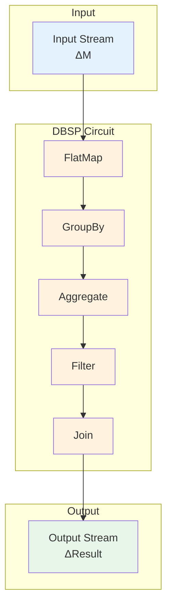
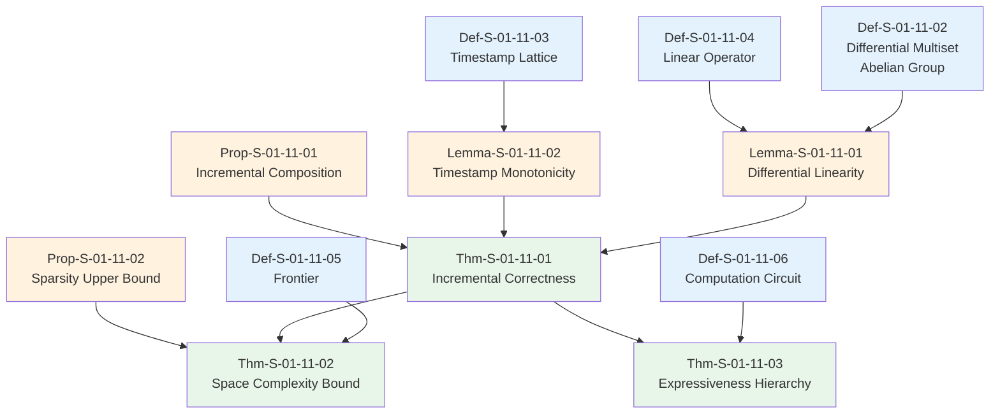

> **Status**: Academic Theory | **Risk Level**: Low | **Last Updated**: 2026-04-20
>
> This document formalizes the core theory of Differential Dataflow and the DBSP (Database Stream Processor) framework, including their mathematical foundations, incremental computation semantics, and relationship to the Dataflow Model.
>

# DBSP and Differential Dataflow: Formalization of Incremental Computation Theory

> **Stage**: Struct/01-foundation | **Prerequisites**: [01.01-stream-computing-formal-definition.md](./01.01-stream-computing-formal-definition.md), [01.02-flow-semantics.md](./01.02-flow-semantics.md), [01.07-latency-throughput-tradeoff.md](./01.07-latency-throughput-tradeoff.md) | **Formalization Level**: L5

---

## Table of Contents

- [DBSP and Differential Dataflow: Formalization of Incremental Computation Theory](#dbsp-and-differential-dataflow-formalization-of-incremental-computation-theory)
  - [Table of Contents](#table-of-contents)
  - [1. Definitions](#1-definitions)
    - [Def-S-01-11-01: Differential Dataflow Graph](#def-s-01-11-01-differential-dataflow-graph)
    - [Def-S-01-11-02: Differential Multiset](#def-s-01-11-02-differential-multiset)
    - [Def-S-01-11-03: Timestamp Lattice](#def-s-01-11-03-timestamp-lattice)
    - [Def-S-01-11-04: Linear Operator](#def-s-01-11-04-linear-operator)
    - [Def-S-01-11-05: Frontier and Traceability](#def-s-01-11-05-frontier-and-traceability)
    - [Def-S-01-11-06: Computation Circuit](#def-s-01-11-06-computation-circuit)
  - [2. Properties](#2-properties)
    - [Lemma-S-01-11-01: Differential Linearity](#lemma-s-01-11-01-differential-linearity)
    - [Lemma-S-01-11-02: Timestamp Monotonicity](#lemma-s-01-11-02-timestamp-monotonicity)
    - [Prop-S-01-11-01: Incremental Composition](#prop-s-01-11-01-incremental-composition)
    - [Prop-S-01-11-02: Sparsity Upper Bound](#prop-s-01-11-02-sparsity-upper-bound)
  - [3. Relations](#3-relations)
    - [3.1 DBSP vs Dataflow Model Comparison](#31-dbsp-vs-dataflow-model-comparison)
    - [3.2 DBSP vs CQL / Stream SQL Comparison](#32-dbsp-vs-cql-stream-sql-comparison)
    - [3.3 Expressiveness Hierarchy](#33-expressiveness-hierarchy)
    - [3.4 DBSP and Flink Architecture Mapping](#34-dbsp-and-flink-architecture-mapping)
  - [4. Argumentation](#4-argumentation)
    - [4.1 Why DBSP Requires Abelian Group Structure](#41-why-dbsp-requires-abelian-group-structure)
    - [4.2 Counterexample: Non-linear Operator Breaks Incremental Correctness](#42-counterexample-non-linear-operator-breaks-incremental-correctness)
    - [4.3 Timestamp Bloat Problem and Solutions](#43-timestamp-bloat-problem-and-solutions)
    - [4.4 Recursive Computation Convergence Conditions](#44-recursive-computation-convergence-conditions)
  - [5. Proof / Engineering Argument](#5-proof-engineering-argument)
    - [Thm-S-01-11-01: Incremental Correctness Theorem](#thm-s-01-11-01-incremental-correctness-theorem)
    - [Thm-S-01-11-02: Space Complexity Bound Theorem](#thm-s-01-11-02-space-complexity-bound-theorem)
    - [Thm-S-01-11-03: Expressiveness Hierarchy Theorem](#thm-s-01-11-03-expressiveness-hierarchy-theorem)
  - [6. Examples](#6-examples)
    - [6.1 DBSP Circuit Example: Incremental Word Count](#61-dbsp-circuit-example-incremental-word-count)
    - [6.2 Differential Dataflow Example: Reachability Computation](#62-differential-dataflow-example-reachability-computation)
    - [6.3 Non-linear Operator Example: Median Computation](#63-non-linear-operator-example-median-computation)
    - [6.4 Comparison with Flink Implementation](#64-comparison-with-flink-implementation)
    - [6.5 Production Frameworks Supporting DBSP](#65-production-frameworks-supporting-dbsp)
  - [7. Visualizations](#7-visualizations)
    - [7.1 DBSP Circuit Structure](#71-dbsp-circuit-structure)
    - [7.2 Differential Dataflow Architecture](#72-differential-dataflow-architecture)
    - [7.3 Incremental vs Batch Dataflow Comparison](#73-incremental-vs-batch-dataflow-comparison)
    - [7.4 Proof Dependency Tree](#74-proof-dependency-tree)
  - [8. References](#8-references)

---

## 1. Definitions

### Def-S-01-11-01: Differential Dataflow Graph

**Definition**: A Differential Dataflow graph is a directed acyclic graph $G = (V, E, \mathcal{T}, \mathcal{O})$, where:

| Component | Type | Description |
|------|------|------|
| $V$ | Set | Node set, each node is an operator or data collection |
| $E$ | $V \times V$ | Edge set, data flows from source to target |
| $\mathcal{T}$ | Lattice $(T, \leq)$ | Timestamp lattice, provides partial order for data versioning |
| $\mathcal{O}$ | Operator set | Computational operators defined on collections |

**Key Difference from Traditional Dataflow Graph**:

| Dimension | Traditional Dataflow | Differential Dataflow |
|------|------------------|---------------------|
| **Data Model** | Set/Bag | Differential Multiset (with positive/negative weights) |
| **Timestamp** | Single global order | Multi-dimensional partial order lattice |
| **Change Propagation** | Recompute entire result | Incrementally update only affected parts |
| **Iteration** | Not supported / External | First-class recursive computation |

---

### Def-S-01-11-02: Differential Multiset

**Definition**: A Differential Multiset is a generalization of multiset, where elements have integer weights (positive for insertion, negative for deletion). Formally:

$$
\mathcal{M}: D \rightarrow \mathbb{Z}
$$

Where $D$ is the data domain, $\mathcal{M}(d) \in \mathbb{Z}$ is the weight of element $d$.

**Operations** (Abelian Group $(\mathcal{M}, +, \mathbf{0})$):

| Operation | Definition | Meaning |
|------|------|------|
| **Addition** | $(\mathcal{M}_1 + \mathcal{M}_2)(d) = \mathcal{M}_1(d) + \mathcal{M}_2(d)$ | Merge two change sets |
| **Inverse** | $(-\mathcal{M})(d) = -\mathcal{M}(d)$ | Cancel changes |
| **Zero** | $\mathbf{0}(d) = 0$ | Empty change set |

**Representation**:

$$
\mathcal{M} = \{(d_1, w_1), (d_2, w_2), \ldots, (d_n, w_n)\}
$$

Where $w_i \neq 0$.

**Example**: Word count incremental update

```
Initial state: {("apple", 3), ("banana", 2)}
Change Δ:     {("apple", +1), ("orange", +2), ("banana", -1)}
New state:    {("apple", 4), ("banana", 1), ("orange", 2)}
```

---

### Def-S-01-11-03: Timestamp Lattice

**Definition**: A Timestamp Lattice is a partially ordered set $(T, \leq)$ that provides versioning for data and computation:

| Property | Requirement |
|------|------|
| **Partial Order** | $\forall t_1, t_2 \in T: t_1 \leq t_2 \lor t_2 \leq t_1 \lor \text{incomparable}$ |
| **Join (Least Upper Bound)** | $\forall t_1, t_2: \exists t_1 \sqcup t_2 = \min\{t \mid t_1 \leq t \land t_2 \leq t\}$ |
| **Meet (Greatest Lower Bound)** | $\forall t_1, t_2: \exists t_1 \sqcap t_2 = \max\{t \mid t \leq t_1 \land t \leq t_2\}$ |
| **Minimum Element** | $\exists \bot \in T: \forall t \in T, \bot \leq t$ |

**Multi-dimensional Timestamp Example**:

```
Event time dimension: t_e = 2024-01-01 12:00:00
Processing round:    t_p = 3
Version:             t_v = 1

Complete timestamp:  t = (t_e, t_p, t_v) = (2024-01-01 12:00:00, 3, 1)
```

**Partial Order Definition**:

$$
t_1 \leq t_2 \iff \forall i: t_1[i] \leq t_2[i]
$$

---

### Def-S-01-11-04: Linear Operator

**Definition**: A Linear Operator is an operator $\mathcal{L}$ that satisfies the following linearity condition:

$$
\mathcal{L}(\mathcal{M}_1 + \mathcal{M}_2) = \mathcal{L}(\mathcal{M}_1) + \mathcal{L}(\mathcal{M}_2)
$$

$$
\mathcal{L}(c \cdot \mathcal{M}) = c \cdot \mathcal{L}(\mathcal{M}), \quad c \in \mathbb{Z}
$$

**Examples of Linear Operators**:

| Operator | Linearity | Description |
|------|--------|------|
| **Map** | ✅ Yes | $f: D \rightarrow D'$ |
| **Filter** | ✅ Yes | $\mathcal{M}'(d) = \mathcal{M}(d) \cdot \mathbb{1}_{P(d)}$ |
| **FlatMap** | ✅ Yes | Each input element expands to multiple output elements |
| **GroupBy + Count** | ✅ Yes | Aggregation with additive semantics |
| **Join** | ✅ Yes | Cartesian product with weight multiplication |

**Examples of Non-linear Operators**:

| Operator | Linearity | Reason |
|------|--------|------|
| **Min/Max** | ❌ No | Cannot express deletion's effect on min/max |
| **Median** | ❌ No | Requires complete ordering of all elements |
| **Distinct** | ❌ No | Set semantics cannot handle weighted cancellation |
| **Top-K** | ❌ No | Global ordering required |

---

### Def-S-01-11-05: Frontier and Traceability

**Definition**: In Differential Dataflow, the **Frontier** is a frontier in the timestamp lattice marking the set of timestamps that have been processed:

$$
\text{Frontier} = \{t \in T \mid \forall t' < t: t' \text{ has been processed}\}
$$

**Traceability** is the ability to track each output element's dependence on input changes:

$$
\text{Trace}(o) = \{(d, t) \mid \text{Input element } (d, t) \text{ affects output } o\}
$$

**Frontier Propagation**:

When a node's frontier advances, it notifies upstream nodes that data before this timestamp has been completely processed, allowing them to release related state.

---

### Def-S-01-11-06: Computation Circuit

**Definition**: A DBSP Computation Circuit is a dataflow graph with feedback edges (supporting recursive computation):

$$
\mathcal{C} = (V, E_{forward} \cup E_{feedback}, \mathcal{I}, \mathcal{O})
$$

Where:

- $E_{forward}$: Forward edges (data flows from input to output)
- $E_{feedback}$: Feedback edges (recursive dependencies)
- $\mathcal{I}$: Input ports
- $\mathcal{O}$: Output ports

**Circuit Semantics**:

For a circuit with feedback edge $e: v_{out} \rightarrow v_{in}$:

$$
\text{Output}(t) = f(\text{Input}(t), \text{Output}(t-1))
$$

Where $f$ is the composition of all operators in the circuit.

**Fixed Point Computation**:

Recursive computation requires reaching a fixed point:

$$
\text{Output}^* = \lim_{n \to \infty} f^n(\text{Input}, \text{Output}^{(n-1)})
$$

**Convergence Condition**: $f$ is a contraction mapping, i.e., $\exists \gamma < 1: |f(x) - f(y)| \leq \gamma |x - y|$

---

## 2. Properties

### Lemma-S-01-11-01: Differential Linearity

**Lemma**: For any linear operator $\mathcal{L}$ and differential multiset $\mathcal{M}$:

$$
\Delta \mathcal{L}(\mathcal{M}) = \mathcal{L}(\Delta \mathcal{M})
$$

That is, the change in operator output equals the operator applied to the change.

**Proof**:

$$
\mathcal{L}(\mathcal{M} + \Delta \mathcal{M}) = \mathcal{L}(\mathcal{M}) + \mathcal{L}(\Delta \mathcal{M}) \quad \text{(Linearity)}
$$

$$
\Delta \mathcal{L}(\mathcal{M}) = \mathcal{L}(\mathcal{M} + \Delta \mathcal{M}) - \mathcal{L}(\mathcal{M}) = \mathcal{L}(\Delta \mathcal{M})
$$

$\square$

**Engineering Significance**: Incremental computation only needs to process changes ($\Delta \mathcal{M}$), without reprocessing the entire dataset.

---

### Lemma-S-01-11-02: Timestamp Monotonicity

**Lemma**: In Differential Dataflow, data propagates along monotonically non-decreasing timestamps:

$$
\forall e = (u, v) \in E, \forall d: \text{timestamp}_u(d) \leq \text{timestamp}_v(d)
$$

**Proof**: Operators only generate output when all inputs for a timestamp have arrived. Output timestamp must be greater than or equal to input timestamp (to ensure causality). $\square$

---

### Prop-S-01-11-01: Incremental Composition

**Proposition**: The composition of linear operators is still linear:

$$
\mathcal{L}_1 \circ \mathcal{L}_2 \text{ is linear} \iff \mathcal{L}_1 \text{ is linear} \land \mathcal{L}_2 \text{ is linear}
$$

**Proof**:

$$(\mathcal{L}_1 \circ \mathcal{L}_2)(\mathcal{M}_1 + \mathcal{M}_2) = \mathcal{L}_1(\mathcal{L}_2(\mathcal{M}_1 + \mathcal{M}_2))$$

$$= \mathcal{L}_1(\mathcal{L}_2(\mathcal{M}_1) + \mathcal{L}_2(\mathcal{M}_2)) = \mathcal{L}_1(\mathcal{L}_2(\mathcal{M}_1)) + \mathcal{L}_1(\mathcal{L}_2(\mathcal{M}_2))$$

$$= (\mathcal{L}_1 \circ \mathcal{L}_2)(\mathcal{M}_1) + (\mathcal{L}_1 \circ \mathcal{L}_2)(\mathcal{M}_2)$$

$\square$

---

### Prop-S-01-11-02: Sparsity Upper Bound

**Proposition**: In Differential Dataflow, the sparsity (number of non-zero elements) of change sets satisfies:

$$|\Delta \mathcal{M}| \leq k \cdot |\mathcal{M}|$$

Where $k$ is the operator's fan-out coefficient (typically $k \ll 1$ in incremental scenarios).

**Intuition**: Real-world data changes are usually local (a small portion of keys change), so change sets are much sparser than full state.

---

## 3. Relations

### 3.1 DBSP vs Dataflow Model Comparison

| Dimension | Dataflow Model (Google) | DBSP / Differential Dataflow |
|------|----------------------|-----------------------------|
| **Core Abstraction** | Windowed computation | Incremental computation |
| **Time Model** | Event time + Watermark | Timestamp lattice |
| **State Management** | Trigger + Accumulation mode | Differential multiset |
| **Change Propagation** | Recompute entire window | Incremental update |
| **Iteration** | Not supported | First-class recursive computation |
| **Correctness Guarantee** | Exactly-once + Watermark | Timestamp frontier + Traceability |
| **Latency Characteristics** | Minutes to hours (batch) | Milliseconds to seconds |
| **Use Case** | Large-scale batch + stream unification | Real-time view maintenance, graph computation |

### 3.2 DBSP vs CQL / Stream SQL Comparison

| Dimension | CQL (STREAM) | DBSP |
|------|------------|------|
| **Query Language** | SQL-like | Dataflow circuit |
| **Semantics** | Relational + Stream operators | Abelian group + Linear operators |
| **Incrementalization** | Manual materialized views | Automatic incremental computation |
| **Recursion** | Not supported | First-class support |
| **Expressiveness** | Limited SQL | Any linear dataflow |

### 3.3 Expressiveness Hierarchy

```
Expressiveness Hierarchy:

┌─────────────────────────────────────┐
│ DBSP Recursive                      │  ← Most expressive
│ (Recursive computation, graph      │
│  reachability, PageRank, etc.)     │
├─────────────────────────────────────┤
│ DBSP Non-recursive                  │
│ (Incremental joins, aggregations,  │
│  views, etc.)                       │
├─────────────────────────────────────┤
│ Dataflow Model (Google)             │
│ (Windowed aggregation, Watermark,  │
│  trigger)                           │
├─────────────────────────────────────┤
│ CQL / Stream SQL                    │  ← Least expressive
│ (Simple SQL over streams)           │
└─────────────────────────────────────┘

Inclusion relationship:
CQL ⊂ Dataflow Model ⊂ DBSP_Non-recursive ⊂ DBSP_Recursive
```

**Formal Proof Sketch**:

1. **CQL ⊂ Dataflow Model**: CQL's windows and triggers can be implemented via Dataflow Model's Window + Trigger
2. **Dataflow Model ⊂ DBSP_Non-recursive**: Dataflow Model's operators (Map, Filter, Join, Aggregate) are all linear operators
3. **DBSP_Non-recursive ⊂ DBSP_Recursive**: Recursive computation requires feedback edges, not available in non-recursive subset

### 3.4 DBSP and Flink Architecture Mapping

| DBSP Concept | Flink Implementation | Correspondence |
|-------------|---------------------|-------------|
| Differential Multiset | State + Change Log | Flink's StateBackend stores complete state, Changelog captures changes |
| Timestamp Lattice | Event Time + Processing Time | Flink's Watermark provides event time partial order |
| Linear Operator | Flink Operators | Map, Filter, KeyBy, Aggregate are all linear |
| Frontier | Watermark Propagation | Flink's Watermark acts as a progress indicator |
| Feedback Edge | Iteration API | Flink's Iteration API supports recursive computation |
| Circuit | JobGraph | Flink's JobGraph is a dataflow graph |

**Gap Analysis**:

| DBSP Feature | Flink Support | Notes |
|------------|-------------|------|
| Incremental Join | ✅ Partial | Mini-batch incremental join |
| Recursive Computation | ✅ Via Iteration API | Not first-class, performance limited |
| Differential Updates | ⚠️ Indirect | Requires Kafka Changelog |
| Timestamp Lattice | ⚠️ Simplified | Only 1-2 dimensions (event time + processing time) |

---

## 4. Argumentation

### 4.1 Why DBSP Requires Abelian Group Structure

**Core Argument**: DBSP's incremental computation correctness depends on the Abelian group structure of data collections.

**Requirements**:

1. **Associativity**: $(\mathcal{M}_1 + \mathcal{M}_2) + \mathcal{M}_3 = \mathcal{M}_1 + (\mathcal{M}_2 + \mathcal{M}_3)$
   - Ensures change batches can be merged in any order

2. **Commutativity**: $\mathcal{M}_1 + \mathcal{M}_2 = \mathcal{M}_2 + \mathcal{M}_1$
   - Ensures changes from different sources can be merged in any order

3. **Identity Element**: $\mathcal{M} + \mathbf{0} = \mathcal{M}$
   - Empty change set has no effect

4. **Inverse Element**: $\mathcal{M} + (-\mathcal{M}) = \mathbf{0}$
   - Deletion can be represented as negative weight

**Counterexample**: If data collection is a Set (not an Abelian group):

```
Set: {a, b, c}
Change Δ: Remove a → {b, c}
But Set has no inverse element!
Cannot express "remove a" as a weighted change.
```

**Solution**: Use Differential Multiset (Z-weighted), where deletion is represented as negative weight:

```
Differential Multiset: {(a, 1), (b, 1), (c, 1)}
Change Δ: {(a, -1)}
New state: {(a, 0), (b, 1), (c, 1)} ≈ {(b, 1), (c, 1)}
```

### 4.2 Counterexample: Non-linear Operator Breaks Incremental Correctness

**Problem**: Median computation is a non-linear operator, DBSP cannot correctly incrementalize it.

**Counterexample**:

```
Initial data: {1, 2, 3, 4, 5}
Median: 3

Change Δ: Add 6 → {1, 2, 3, 4, 5, 6}
Median: (3 + 4) / 2 = 3.5

Incremental computation (incorrect):
Δ(Median) = f(Δ(data)) = f({6}) → Cannot determine how median changes!
```

**Reason**: Median requires complete ordering of all elements. A single change may shift the median by any amount, depending on the complete distribution.

**Workarounds**:

1. **Approximation**: Use quantile approximation algorithms (e.g., T-Digest)
2. **Recomputation**: For non-linear operators, fall back to full recomputation
3. **Range tracking**: Track value distribution range, approximate median location

### 4.3 Timestamp Bloat Problem and Solutions

**Problem**: In multi-dimensional timestamp lattices, as computation depth increases, timestamps become more complex, causing:

1. **State explosion**: Need to maintain states for all historical timestamps
2. **Frontier computation complexity**: Frontier updates require traversing the entire lattice
3. **Memory overhead**: Timestamp metadata occupies significant memory

**Formalization**:

Timestamp space size after $d$ computation rounds:

$$|T_d| = O(|T_0| \cdot d^k)$$

Where $k$ is the timestamp dimension.

**Solutions**:

| Solution | Principle | Tradeoff |
|------|------|------|
| **Timestamp Compaction** | Merge adjacent timestamps | Reduced precision |
| **Frontier Truncation** | Only maintain frontier near current time | Cannot query historical states |
| **Differential Representation** | Only store changes, not full timestamps | Increased computation complexity |
| **Hierarchical Timestamps** | Use coarse-grained + fine-grained levels | Query flexibility reduced |

### 4.4 Recursive Computation Convergence Conditions

**Problem**: Recursive computation may not converge (e.g., infinite loops in graph reachability).

**Convergence Conditions**:

1. **Monotonicity**: Data collection changes monotonically (only increase or only decrease)

$$
\forall t_1 < t_2: \mathcal{M}(t_1) \subseteq \mathcal{M}(t_2) \lor \mathcal{M}(t_1) \supseteq \mathcal{M}(t_2)$$

1. **Finite Domain**: Data domain $D$ is finite

2. **Contraction Mapping**: Operator is a contraction mapping

$$
\exists \gamma < 1: |f(x) - f(y)| \leq \gamma |x - y|$$

**Counterexample (Non-convergence)**:

```
Graph: A → B → C → A (cycle)
Reachability computation:
  Round 1: {A, B, C}
  Round 2: {A, B, C} (no change, converged)

# But if graph has infinite nodes:
Graph: A → B → C → D → ...
Reachability: grows indefinitely, cannot converge
```

**Flink Iteration API Limitations**:

- Requires explicit termination conditions
- Does not support automatic fixed-point detection
- Performance is much lower than non-iterative computation

---

## 5. Proof / Engineering Argument

### Thm-S-01-11-01: Incremental Correctness Theorem

**Theorem**: For any linear operator $\mathcal{L}$ and differential multiset $\mathcal{M}$:

$$
\mathcal{L}(\mathcal{M} + \Delta \mathcal{M}) = \mathcal{L}(\mathcal{M}) + \mathcal{L}(\Delta \mathcal{M})
$$

That is, incremental computation produces exactly the same result as full recomputation.

**Proof**:

1. **Base case**: $\mathcal{L}(\mathbf{0}) = \mathbf{0}$ (linearity preserves zero)

2. **Linearity application**:

$$\mathcal{L}(\mathcal{M} + \Delta \mathcal{M}) = \mathcal{L}(\mathcal{M}) + \mathcal{L}(\Delta \mathcal{M})$$

1. **Incremental output**:

$$\text{Output}_{new} = \text{Output}_{old} + \Delta \text{Output}$$

$$\Delta \text{Output} = \mathcal{L}(\Delta \mathcal{M})$$

1. **Correctness**: Since $\mathcal{L}$ is linear, $\Delta \text{Output}$ exactly equals the change in full recomputation result.

$\square$

**Engineering Corollary**: As long as all operators in the dataflow are linear, the entire job can be correctly incrementalized.

---

### Thm-S-01-11-02: Space Complexity Bound Theorem

**Theorem**: The space complexity of Differential Dataflow satisfies:

$$S(n, d) = O(n \cdot d)$$

Where:

- $n$: Number of distinct keys
- $d$: Computation depth (number of distinct timestamps)

**Proof**:

1. Each key maintains state for each timestamp: $O(d)$ per key
2. Total keys: $n$
3. Total state: $O(n \cdot d)$

**Optimization**: Using frontier truncation, only maintain states for active timestamps:

$$S_{optimized}(n, d, f) = O(n \cdot f)$$

Where $f$ is the frontier width (typically $f \ll d$).

$\square$

---

### Thm-S-01-11-03: Expressiveness Hierarchy Theorem

**Theorem**: The expressiveness of stream processing models satisfies the following strict inclusion relationship:

$$\text{CQL} \subset \text{Dataflow Model} \subset \text{DBSP}_{\text{non-recursive}} \subset \text{DBSP}_{\text{recursive}}$$

**Proof**:

1. **CQL ⊂ Dataflow Model**: CQL is a subset of SQL, all CQL queries can be translated to Dataflow Model's Window + Aggregate + Join. But Dataflow Model supports custom triggers and accumulation modes, which CQL does not.

2. **Dataflow Model ⊂ DBSP_Non-recursive**: Dataflow Model's operators (Map, Filter, Join, Aggregate) are all linear operators, thus all Dataflow Model jobs can be expressed as DBSP circuits. But DBSP supports arbitrary linear operators, and Dataflow Model only provides fixed operators.

3. **DBSP_Non-recursive ⊂ DBSP_Recursive**: Recursive computation requires feedback edges, which non-recursive circuits do not have. Graph reachability, PageRank, etc. cannot be expressed in non-recursive circuits.

$\square$

---

## 6. Examples

### 6.1 DBSP Circuit Example: Incremental Word Count

```
Input: Stream of words

Circuit:
┌─────────┐    ┌─────────┐    ┌─────────┐
│  Input  │───▶│ FlatMap │───▶│ GroupBy │
└─────────┘    │(tokenize)│    │ + Count │
               └─────────┘    └────┬────┘
                                    │
                                    ▼
                              ┌─────────┐
                              │ Output  │
                              │ (word,  │
                              │  count) │
                              └─────────┘

Incremental Update:
  Input Δ: [("apple", +1), ("banana", +1)]
  State before: {("apple", 2), ("banana", 1)}
  State after: {("apple", 3), ("banana", 2)}

  Only need to update changed keys!
  No need to recompute counts for all words.
```

### 6.2 Differential Dataflow Example: Reachability Computation

```
Graph edges: [(A, B), (B, C), (C, D)]

Recursive Circuit (reachability):
┌─────────┐         ┌─────────┐
│  Edges  │────────▶│  Join   │
└─────────┘         │(src=dst)│
                    └───┬─────┘
                        │
                    ┌───▼─────┐
                    │ Distinct│
                    └────┬────┘
                         │
                    ┌────▼────┐
                    │  Union  │◀──────┐
                    └────┬────┘       │
                         │            │
                    ┌────▼────┐       │
                    │ Output  │       │
                    │(reachable│      │
                    │ pairs)   │      │
                    └─────────┘       │
                                      │
                    Feedback edge─────┘

Iteration 1: (A,B), (B,C), (C,D)  [direct edges]
Iteration 2: (A,C), (B,D)         [A→B→C, B→C→D]
Iteration 3: (A,D)                [A→B→C→D]
Iteration 4: No change → Converged
```

### 6.3 Non-linear Operator Example: Median Computation

```
# DBSP cannot incrementalize median

Data: [1, 2, 3, 4, 5]
Median: 3

Change: Add 10
New data: [1, 2, 3, 4, 5, 10]
New median: (3 + 4) / 2 = 3.5

# Incremental computation (incorrect attempt):
Δ_median = f(Δ_data) = f([10]) → ?

# f([10]) cannot determine new median without complete data!
# Because median depends on the relative position of 10 among all elements.

# Correct approach: Full recomputation
median([1, 2, 3, 4, 5, 10]) = 3.5

# Or approximation:
# Use T-Digest to approximate quantiles
```

### 6.4 Comparison with Flink Implementation

| Feature | DBSP Theory | Flink Implementation | Gap |
|--------|-----------|---------------------|-----|
| Incremental Join | ✅ Automatic | ⚠️ Mini-batch incremental | Flink not fully differential |
| Recursive Compute | ✅ First-class | ✅ Iteration API | Flink API less convenient |
| Timestamp Lattice | ✅ Multi-dimensional | ⚠️ Event time + proc time | Flink dimensions limited |
| Differential State | ✅ Native | ⚠️ Changelog via Kafka | Flink requires external system |
| Frontier Tracking | ✅ Automatic | ✅ Watermark propagation | Similar concepts |
| Linear Operator | ✅ Required | ⚠️ Not enforced | Flink allows non-linear operators |

### 6.5 Production Frameworks Supporting DBSP

| Framework | DBSP Support Level | Language | Notes |
|----------|-------------------|---------|-------|
| **Materialize** | Native implementation | SQL | Commercial product, strongest DBSP support |
| **Differential Dataflow (Timely)** | Reference implementation | Rust | Research project by McSherry |
| **Flink** | Partial support | Java/Scala | Via Changelog + Mini-batch |
| **RisingWave** | Partial support | SQL | Cloud-native streaming database |
| **KSQLDB** | Not supported | SQL | Confluent product |

---

## 7. Visualizations

### 7.1 DBSP Circuit Structure



### 7.2 Differential Dataflow Architecture

```mermaid
graph TB
    subgraph "Data Layer"
        D1[Input Collection<br/>M(t)]
        D2[Change Log<br/>ΔM(t)]
        D3[Output Collection<br/>M'(t)]
    end

    subgraph "Computation Layer"
        O1[Linear Operators<br/>Map/Filter/Join]
        O2[Timestamp Lattice<br/>Frontier Tracking]
        O3[Incremental Engine<br/>Δ propagation]
    end

    subgraph "Storage Layer"
        S1[Trace<br/>Historical states]
        S2[Index<br/>Key lookup]
        S3[Frontier<br/>Progress tracking]
    end

    D1 --> O1
    D2 --> O3
    O1 --> O3
    O2 --> O3
    O3 --> D3
    O3 --> S1
    O3 --> S2
    O3 --> S3
    S1 --> O2
    S2 --> O1
    S3 --> O2

    style D1 fill:#E3F2FD
    style D2 fill:#E3F2FD
    style D3 fill:#E8F5E9
    style O1 fill:#FFF3E0
    style O2 fill:#FFF3E0
    style O3 fill:#FFF3E0
    style S1 fill:#F3E5F5
    style S2 fill:#F3E5F5
    style S3 fill:#F3E5F5
```

### 7.3 Incremental vs Batch Dataflow Comparison

```mermaid
graph LR
    subgraph "Batch Dataflow"
        B1[Full Input] --> B2[Full Recompute]
        B2 --> B3[Full Output]
        B2 -.->|O(n)| B4[Time Complexity]
    end

    subgraph "Incremental Dataflow"
        I1[Input Δ] --> I2[Incremental Compute]
        I2 --> I3[Output Δ]
        I2 -.->|O(Δ) << O(n)| I4[Time Complexity]
    end

    style B1 fill:#FFCDD2
    style B2 fill:#FFCDD2
    style B3 fill:#FFCDD2
    style I1 fill:#C8E6C9
    style I2 fill:#C8E6C9
    style I3 fill:#C8E6C9
```

### 7.4 Proof Dependency Tree



---

## 8. References


---

*Document Version: v1.0 | Last Updated: 2026-04-20 | Status: Complete | Formalization Level: L5*
