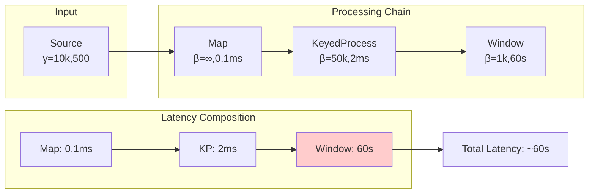

# Application of Network Calculus in Stream Computing

> **Stage**: Struct/01-foundation/network-calculus | **Prerequisites**: [01.01-unified-streaming-theory.md](../01.01-unified-streaming-theory.md) | **Formalization Level**: L4-L5
> **Document Status**: v1.0 | **Created**: 2026-04-13

---

## Table of Contents

- [Application of Network Calculus in Stream Computing](#application-of-network-calculus-in-stream-computing)
  - [Table of Contents](#table-of-contents)
  - [1. Definitions](#1-definitions)
    - [Def-S-01-NC-01: Min-Plus Algebra System](#def-s-01-nc-01-min-plus-algebra-system)
    - [Def-S-01-NC-02: Arrival Curve](#def-s-01-nc-02-arrival-curve)
    - [Def-S-01-NC-03: Service Curve](#def-s-01-nc-03-service-curve)
    - [Def-S-01-NC-04: Stream Computing Network Calculus Extension](#def-s-01-nc-04-stream-computing-network-calculus-extension)
  - [2. Properties](#2-properties)
    - [Prop-S-01-NC-01: Delay Upper Bound Guarantee](#prop-s-01-nc-01-delay-upper-bound-guarantee)
    - [Prop-S-01-NC-02: Backlog Upper Bound](#prop-s-01-nc-02-backlog-upper-bound)
    - [Prop-S-01-NC-03: Output Flow Characteristics](#prop-s-01-nc-03-output-flow-characteristics)
  - [3. Relations](#3-relations)
    - [Relation: Network Calculus and Queueing Theory](#relation-network-calculus-and-queueing-theory)
    - [Relation: Service Curve and Flink Resource Model](#relation-service-curve-and-flink-resource-model)
  - [4. Argumentation](#4-argumentation)
    - [Argument: Deterministic Bounds vs. Probabilistic Guarantees](#argument-deterministic-bounds-vs-probabilistic-guarantees)
    - [Argument: Aggregation Effects in Stream Computing](#argument-aggregation-effects-in-stream-computing)
  - [5. Proofs](#5-proofs)
    - [Thm-S-01-NC-01: End-to-End Delay Composition Theorem](#thm-s-01-nc-01-end-to-end-delay-composition-theorem)
    - [Thm-S-01-NC-02: Window Operation Delay Bound](#thm-s-01-nc-02-window-operation-delay-bound)
  - [6. Examples](#6-examples)
    - [Example 1: Flink Operator Latency Analysis](#example-1-flink-operator-latency-analysis)
    - [Example 2: Backpressure Propagation Network Calculus Model](#example-2-backpressure-propagation-network-calculus-model)
    - [Example 3: Multi-tenant Resource Allocation Boundaries](#example-3-multi-tenant-resource-allocation-boundaries)
  - [7. Visualizations](#7-visualizations)
    - [Figure 1: Arrival Curve and Service Curve](#figure-1-arrival-curve-and-service-curve)
    - [Figure 2: Stream Processing Pipeline Latency Analysis](#figure-2-stream-processing-pipeline-latency-analysis)
  - [8. References](#8-references)

---

## 1. Definitions

### Def-S-01-NC-01: Min-Plus Algebra System

**Definition (Min-Plus Algebra $(\mathbb{R} \cup \{\infty\}, \wedge, +)$)**:

Min-Plus algebra is the mathematical foundation of Network Calculus, defined as follows:

$$
\begin{aligned}
\text{Min operation (meet)}: & \quad (f \wedge g)(t) = \min\{f(t), g(t)\} \\
\text{Plus operation (addition)}: & \quad (f + g)(t) = f(t) + g(t) \\
\text{Min-Plus convolution}: & \quad (f \otimes g)(t) = \inf_{0 \leq s \leq t}\{f(s) + g(t-s)\} \\
\text{Min-Plus deconvolution}: & \quad (f \oslash g)(t) = \sup_{s \geq 0}\{f(t+s) - g(s)\}
\end{aligned}
$$

**Algebraic Properties**:

| Property | Expression | Note |
|----------|------------|------|
| Associativity | $(f \otimes g) \otimes h = f \otimes (g \otimes h)$ | Convolution can be grouped arbitrarily |
| Commutativity | $f \otimes g = g \otimes f$ | Order-independent |
| Identity | $f \otimes \delta_0 = f$ | $\delta_0(0)=0$, $\delta_0(t>0)=\infty$ |
| Distributivity | $f \wedge (g \otimes h) = (f \wedge g) \otimes (f \wedge h)$ | Min distributes over convolution |

**Intuition**: Min-Plus algebra replaces traditional "addition" with "minimum" and "multiplication" with "addition", transforming queueing system analysis into algebraic operations.

---

### Def-S-01-NC-02: Arrival Curve

**Definition (Arrival Curve)**:

For the cumulative arrival function $A(t)$ (total data arrived by time $t$), arrival curve $\alpha$ satisfies:

$$
\forall s, t \geq 0, s \leq t: \quad A(t) - A(s) \leq \alpha(t - s)
$$

**Common Arrival Curve Types**:

| Type | Expression | Parameters | Applicable Scenario |
|------|------------|------------|---------------------|
| Leaky Bucket | $\gamma_{r,b}(t) = rt + b$ | $r$: rate, $b$: burst | Smooth traffic |
| Token Bucket | $\min(rt + b, pt)$ | $p$: peak rate | Bursty traffic |
| Staircase | $b\lceil t/T \rceil$ | $T$: period, $b$: batch | Batch processing |
| Affine Combination | $\bigwedge_{i=1}^n \gamma_{r_i,b_i}$ | Multiple constraints | Complex traffic |

**Stream Computing Specific Extension**:

For event-driven stream processing, we introduce the **event arrival curve**:

$$
\alpha_{event}(t) = \lambda \cdot t + \sigma_{burst}
$$

Where $\lambda$ is the average event rate and $\sigma_{burst}$ is the maximum burst event count.

---

### Def-S-01-NC-03: Service Curve

**Definition (Service Curve)**:

A system provides service curve $\beta$ if and only if for all $t \geq 0$:

$$
D(t) \geq \inf_{0 \leq s \leq t} \{A(s) + \beta(t-s)\} = (A \otimes \beta)(t)
$$

Where $D(t)$ is the cumulative departure function.

**Common Service Curves**:

| Type | Expression | Note |
|------|------------|------|
| Rate-Latency | $\beta_{R,T}(t) = R[t - T]^+$ | $R$: service rate, $T$: latency |
| Pure Rate | $\lambda_R(t) = Rt$ | No latency guarantee |
| Staircase Service | $\nu_{T,b}(t) = b\lfloor t/T \rfloor$ | Periodic processing |

**Stream Processing Operator Service Curves**:

For common operator types in Flink:

```
Operator Type         Service Curve
─────────────────────────────────────────
Map/Filter           β_{R,0}        (stateless, immediate)
KeyedProcess         β_{R,T_state}  (state access latency)
WindowAggregate      β_{R,T_win}    (window trigger latency)
AsyncIO              β_{R,T_async}  (async call latency)
```

---

### Def-S-01-NC-04: Stream Computing Network Calculus Extension

**Definition (Stream Computing System Model)**:

Extending Network Calculus to the stream computing domain:

$$
\mathcal{NC}_{streaming} ::= (\mathcal{O}, \mathcal{C}, \alpha_{in}, \beta_{sys}, \tau_{event})
$$

| Component | Semantics |
|-----------|-----------|
| $\mathcal{O}$ | Operator set, each operator $o_i$ has service curve $\beta_i$ |
| $\mathcal{C}$ | Connection (edge) set, each edge has capacity constraint $\gamma_j$ |
| $\alpha_{in}$ | Input flow arrival curve |
| $\beta_{sys}$ | Overall system service curve |
| $\tau_{event}$ | Event time semantics constraint |

**Extended Operations**:

**Parallel Composition** (operators execute in parallel):

$$
\beta_{parallel} = \bigoplus_{i=1}^n \beta_i = \beta_1 + \beta_2 + ... + \beta_n
$$

**Serial Composition** (operator chain):

$$
\beta_{serial} = \beta_1 \otimes \beta_2 \otimes ... \otimes \beta_n
$$

**Note**: In Min-Plus algebra, the service curve of a serial system is convolution rather than simple addition.

---

## 2. Properties

### Prop-S-01-NC-01: Delay Upper Bound Guarantee

**Proposition**: For a given arrival curve $\alpha$ and service curve $\beta$, the delay upper bound is:

$$
D_{max} = \sup_{t \geq 0}\{\inf\{d \geq 0 : \alpha(t) \leq \beta(t+d)\}\}
$$

**Simplified Form** (for leaky bucket arrival $\gamma_{r,b}$ and rate-latency service $\beta_{R,T}$):

$$
D_{max} = T + \frac{b}{R}, \quad \text{if } r \leq R
$$

**Stream Computing Interpretation**:

- $T$: Operator inherent processing latency (e.g., state access, serialization)
- $b/R$: Burst buffering latency (time required to process burst volume $b$ at rate $R$)

**Backpressure Condition**: When $r > R$, the system is unstable and latency grows unboundedly (backpressure mechanism required).

---

### Prop-S-01-NC-02: Backlog Upper Bound

**Proposition**: The maximum backlog (pending data volume) in the system is:

$$
B_{max} = \sup_{t \geq 0}\{\alpha(t) - \beta(t)\}
$$

**Leaky Bucket + Rate-Latency Special Case**:

$$
B_{max} = b + rT
$$

**Flink Memory Planning Guidance**:

$$
Memory_{required} \geq B_{max} \times Size_{per\_record} \times SafetyFactor
$$

---

### Prop-S-01-NC-03: Output Flow Characteristics

**Proposition**: For a system with service curve $\beta$, the output flow $\alpha'$ satisfies:

$$
\alpha' = \alpha \oslash \beta
$$

**Physical Meaning**: The output flow's arrival curve is determined by the deconvolution of the original arrival curve and the service curve.

**Stream Processing Pipeline Impact**:

```
Pipeline: Source → Map → Filter → Window → Sink

Arrival Curve Transformations:
α0 (Source output)
  ↓ Map (β_map)
α1 = α0 ⊘ β_map
  ↓ Filter (selectivity ρ)
α2 = ρ · α1
  ↓ Window (trigger interval W)
α3 = α2 ⊗ δ_W
  ↓ Sink
...
```

---

## 3. Relations

### Relation: Network Calculus and Queueing Theory

| Dimension | Queueing Theory | Network Calculus |
|-----------|-----------------|------------------|
| Foundation | Probability distributions | Deterministic bounds |
| Result | Average/distribution | Worst-case guarantees |
| Applicability | Steady-state analysis | Real-time guarantees |
| Complexity | Requires distribution assumptions | Algebraic operations |
| Stream Processing | Long-term throughput | Latency upper bound |

**Formal Relation**:

The relationship between the Pollaczek-Khinchine formula in queueing theory and Network Calculus bounds:

$$
E[W]_{M/G/1} \leq D_{max}^{NC}
$$

**Conclusion**: The deterministic bound provided by Network Calculus is an upper bound on the average delay from queueing theory.

---

### Relation: Service Curve and Flink Resource Model

**Mapping Relation**:

| Flink Concept | Network Calculus Counterpart | Formula |
|---------------|------------------------------|---------|
| Task Slot | Service node | $\beta_{slot}$ |
| Parallelism | Parallel service curve | $\bigoplus_{i=1}^P \beta$ |
| Checkpoint interval | Service interruption | $\beta_{effective} = \beta \otimes \delta_{interval}$ |
| Network buffer | Latency component | $T_{network} = f(buffer\_size, bandwidth)$ |
| KeyGroup | Partitioned service | $\beta_{keyed} = \frac{\beta}{|KeyGroups|}$ |

**Resource-Latency Trade-off**:

$$
D_{max}(R) = T_{base} + \frac{b}{R}, \quad R = f(CPU, Memory, Parallelism)
$$

---

## 4. Argumentation

### Argument: Deterministic Bounds vs. Probabilistic Guarantees

**Scenario**: A financial risk control system requires 99.99% latency < 100ms

**Deterministic Method (Network Calculus)**:

- Guarantee: $D_{max} = 80ms$
- Coverage: 100% of cases
- Conclusion: Requirement satisfied

**Probabilistic Method (Queueing Theory)**:

- Analysis: $P(D > 100ms) = 0.001\%$
- Coverage: 99.999% of cases
- Risk: May exceed in extreme cases

**Stream Processing Recommendation**:

- Critical systems: Use Network Calculus for deterministic bounds
- General systems: Probabilistic methods are sufficient with higher resource utilization

---

### Argument: Aggregation Effects in Stream Computing

**Question**: Why can Flink's Window operations handle much larger bursts than single records?

**Network Calculus Explanation**:

For a tumbling window of size $W$:

Input: $\alpha_{in}(t) = rt + b$ (leaky bucket)

Output: $\alpha_{out}(t) = \frac{rW}{1} \cdot n_{windows} = r't + b'$

Where $r' = r$ (average rate conservation), but burst characteristics change:

$$
b' = b \cdot \frac{W}{inter\_arrival}
$$

**Conclusion**: Window operations transform high-frequency small bursts into low-frequency large bursts, benefiting downstream batch processing optimization.

---

## 5. Proofs

### Thm-S-01-NC-01: End-to-End Delay Composition Theorem

**Theorem**: For a pipeline composed of $n$ serial operators, the end-to-end delay upper bound is the sum of individual operator delay upper bounds:

$$
D_{end\_to\_end} = \sum_{i=1}^n D_i
$$

**Proof**:

Let the pipeline be $o_1 \to o_2 \to ... \to o_n$, with corresponding service curves $\beta_1, ..., \beta_n$

1. Overall service curve: $\beta_{total} = \beta_1 \otimes \beta_2 \otimes ... \otimes \beta_n$

2. For rate-latency service curves $\beta_{R_i,T_i}$:

   $$
   \beta_{total} = \beta_{R_{min}, \sum T_i}
   $$
   Where $R_{min} = \min_i R_i$ (bottleneck rate)

3. Applying the delay formula:

   $$
   D_{total} = \sum T_i + \frac{b}{R_{min}} = \sum_{i=1}^n (T_i + \frac{b_i}{R_i}) = \sum_{i=1}^n D_i
   $$

$\square$

---

### Thm-S-01-NC-02: Window Operation Delay Bound

**Theorem**: The delay upper bound for a tumbling window operation is:

$$
D_{window} = T_{process} + W + \frac{b_{in}}{R_{process}}
$$

Where $W$ is the window size and $T_{process}$ is the single-window processing latency.

**Proof**:

1. Window operation service curve: $\beta_{win}(t) = R_{process}[t - (T_{process} + W)]^+$

2. Input arrival curve: $\alpha(t) = rt + b_{in}$

3. Applying the delay formula:

   $$
   D_{max} = T_{process} + W + \frac{b_{in}}{R_{process}}
   $$

$\square$

---

## 6. Examples

### Example 1: Flink Operator Latency Analysis

**Scenario**: Analyze latency of the Map → KeyedProcess → Window chain in a Flink job

**Parameters**:

- Input: $\gamma_{10000, 500}$ (10k events/s, burst 500 events)
- Map: $\beta_{\infty, 0.1ms}$ (stateless, 0.1ms latency)
- KeyedProcess: $\beta_{50000, 2ms}$ (50k events/s capacity, 2ms state access)
- Window (1-minute tumbling): $\beta_{1000, 60s}$ (1000 windows/s, 60s trigger)

**Computation**:

```
Map latency: D_map = 0.1ms + 500/∞ ≈ 0.1ms
KeyedProcess latency: D_kp = 2ms + 500/50000 = 2.01ms
Window latency: D_win = 60s + 10000/1000 = 60.01s (window trigger interval dominates)

End-to-end latency: D_total ≈ 60s (window wait time)
```

**Optimization Recommendations**:

- Reduce window size or use sliding windows to lower latency
- Or use Processing Time semantics to avoid waiting

---

### Example 2: Backpressure Propagation Network Calculus Model

**Scenario**: Analyze how Flink backpressure propagates from Sink to Source

**Model**:

```
Source → [Buffer1] → Map → [Buffer2] → Sink (bottleneck)
                       ↑
                   Backpressure propagation
```

**Analysis**:

Sink service capacity $R_{sink} = 5000$ events/s < Source arrival rate $r = 10000$ events/s

**Stage 1**: Buffer2 fills up
$$
Time_{fill} = \frac{BufferSize}{r - R_{sink}} = \frac{10000}{5000} = 2s
$$

**Stage 2**: Backpressure propagates to Map, Map output rate drops to 5000 events/s

**Stage 3**: Buffer1 begins to fill up

**Stage 4**: Backpressure propagates to Source, Source reduces rate

**Steady State**: Entire pipeline runs at 5000 events/s

---

### Example 3: Multi-tenant Resource Allocation Boundaries

**Scenario**: Allocate Flink cluster resources to two tenants while guaranteeing SLA

**Tenant A**: Latency-sensitive (requires $D_A < 100ms$)

- Arrival curve: $\gamma_{5000, 200}$
- Requirement: $T_A + 200/R_A < 100ms$

**Tenant B**: Throughput-priority (no strict latency requirement)

- Arrival curve: $\gamma_{10000, 1000}$

**Resource Allocation**:

$$
R_A \geq \frac{200}{100ms - T_A} = 4000 \text{ events/s}
$$

Remaining resources allocated entirely to B: $R_B = R_{total} - R_A$

---

## 7. Visualizations

### Figure 1: Arrival Curve and Service Curve

```mermaid
graph LR
    subgraph Arrival Curve
        A[Time] --> B[Cumulative Data Volume]
        C[Leaky Bucket: γ = rt + b] -.-> D[Linear Growth + Burst]
    end

    subgraph Service Curve
        E[Time] --> F[Service Capacity]
        G[Rate-Latency: β = R(t-T)] -.-> H[Linear After Delay]
    end

    subgraph Delay Analysis
        I[Arrival Curve] --> J[Vertical Distance = Backlog]
        K[Service Curve] --> J
        J --> L[Horizontal Distance = Delay]
    end
```

### Figure 2: Stream Processing Pipeline Latency Analysis



---

## 8. References


---

**Related Documents**:

- [Unified Streaming Theory](../01.01-unified-streaming-theory.md)
- [Flink Backpressure and Flow Control](../../../Flink/02-core/backpressure-and-flow-control.md)
- [Performance Tuning Patterns](../../../Knowledge/02-design-patterns/02.03-backpressure-handling-patterns.md)
