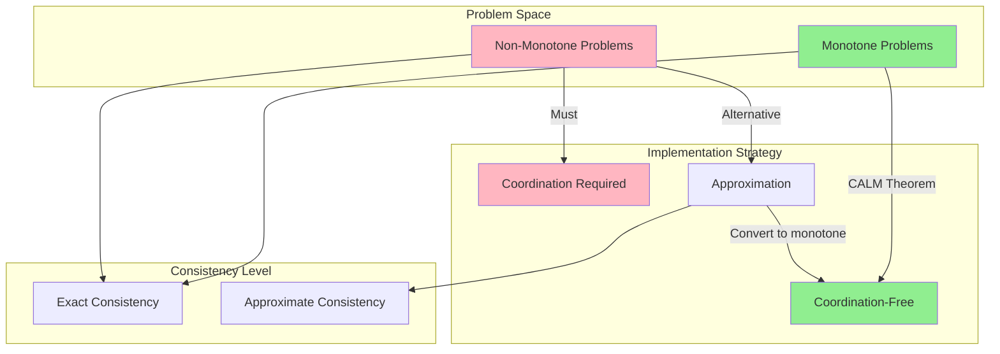
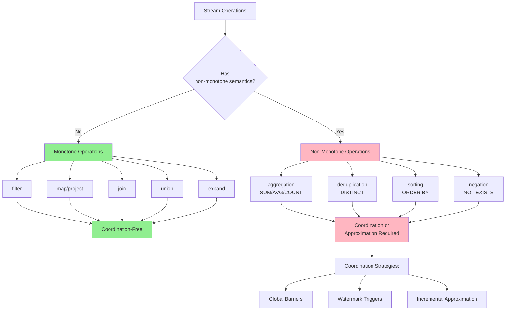
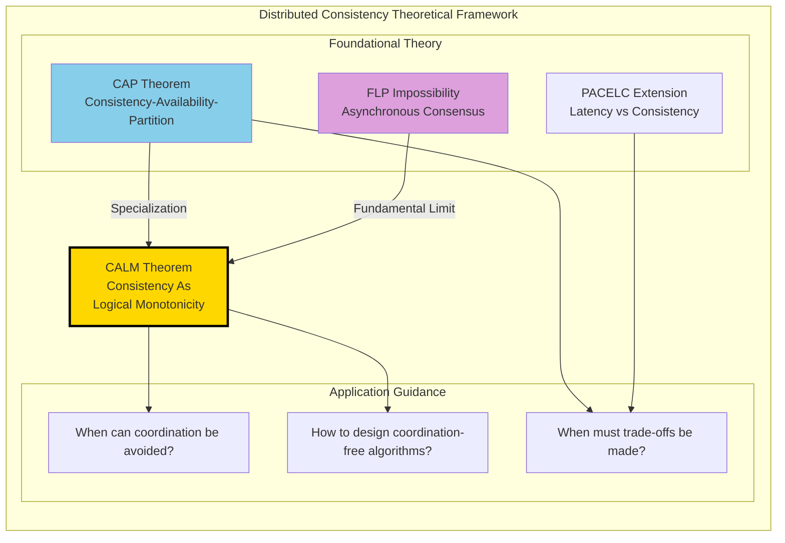

# CALM Theorem: Consistency As Logical Monotonicity

> Stage: Struct/ | Prerequisites: [02.04-liveness-and-safety.md](./02.04-liveness-and-safety.md), [02.05-type-safety-derivation.md](./02.05-type-safety-derivation.md) | Formalization Level: L5

---

## 1. Definitions

### 1.1 Problem and Computation Model

In distributed systems, we consider the following formalized model:

**Def-S-02-13** (Distributed Problem): A distributed problem $\mathcal{P}$ is a mapping $P: \mathcal{I} \to \mathcal{O}$, where:

- $\mathcal{I}$ is the set of inputs (possibly distributed across multiple nodes)
- $\mathcal{O}$ is the set of outputs
- Each input $I \in \mathcal{I}$ is a set of key-value pairs $I = \{(k_1, v_1), (k_2, v_2), \ldots\}$
- Output $O \in \mathcal{O}$ is similarly defined as a set of key-value pairs

**Def-S-02-14** (Logical Monotonicity): A problem $P$ is **logically monotone** if and only if:

$$\forall I_1, I_2 \in \mathcal{I}: I_1 \subseteq I_2 \Rightarrow P(I_1) \subseteq P(I_2)$$

That is, monotone growth of the input set leads to monotone growth of the output set.

**Intuitive Explanation**: Monotone problems have the characteristic of "can only increase, cannot decrease." Once we obtain an output tuple, that tuple will not be revoked upon receiving more input. This is consistent with the concept of monotone operations in SQL (such as selection, projection, natural join).

**Def-S-02-15** (Coordination): Coordination refers to **inter-process synchronization mechanisms** introduced in distributed computing to ensure correctness, including:

- Global barriers (Barriers)
- Distributed locks (Distributed Locks)
- Consensus protocols (Consensus Protocols)
- Two-phase commit (2PC/3PC)

Formally, coordination cost is defined as:

$$\text{CoordCost}(\mathcal{A}) = \{(m, t) : m \text{ is a sync message}, t \text{ is wait time}\}$$

**Def-S-02-16** (Consistency as Determinism of Program Results): A distributed implementation $\mathcal{A}$ satisfies **consistency** if and only if for all possible execution traces $\sigma \in \text{Exec}(\mathcal{A})$:

$$\text{result}(\sigma) = P(I)$$

Where $I$ is the total input and $P$ is the specification of the target problem. That is: **regardless of message delays, failures, or concurrency, the final program result is always equal to the function value defined by the specification**.

This differs from traditional CAP consistency — CAP focuses on consistency of replica states, while CALM focuses on **determinism of computational results relative to the specification**.

---

## 2. Properties

### 2.1 Basic Properties of Monotone Problems

**Lemma-S-02-12** (Closure of Monotone Operations under Set Operations): Logical monotonicity is closed under the following operations:

1. **Union**: If $P_1, P_2$ are monotone, then $P_1 \cup P_2$ is monotone
2. **Join**: If $P_1, P_2$ are monotone, then $P_1 \bowtie P_2$ is monotone (natural join)
3. **Selection**: If $P$ is monotone, then $\sigma_\theta(P)$ is monotone (predicate selection)
4. **Projection**: If $P$ is monotone, then $\pi_A(P)$ is monotone

*Proof Sketch*: Directly follows from the transitivity of set inclusion. ∎

**Lemma-S-02-13** (Non-Closure of Non-Monotone Operations): The following operations **do not preserve** logical monotonicity:

1. **Aggregation**: $\gamma_{A, \text{SUM}(B)}(R)$ — new input may change the aggregated value
2. **Negation** (Negation/Set Difference): $R - S$ — new input to $S$ may shrink the result
3. **Universal Quantification**: $\forall x. \phi(x)$ — a new counterexample may change the truth value to false

*Counterexample*: Consider the counting aggregation $count(R)$. Initially $R = \{a, b\}$ gives $count = 2$; adding $c$ gives $count = 3$, which does not satisfy the monotonicity definition (the output set changes from $\{2\}$ to $\{3\}$, not forming an inclusion relation). ∎

**Lemma-S-02-14** (Network Tolerance of Monotonicity): If problem $P$ is logically monotone, then for any message delay function $\delta: \mathbb{M} \to \mathbb{R}^+$, there exists an asynchronous implementation $\mathcal{A}_\delta$ such that:

$$\forall \sigma \in \text{Exec}(\mathcal{A}_\delta, \delta): \text{result}(\sigma) = P(I)$$

That is: monotone problems have natural fault tolerance to message delays.

---

## 3. Relations

### 3.1 Relation between CALM and CAP

**CAP Theorem** (Brewer, 2000): In the presence of network partitions, a system cannot simultaneously guarantee:

- Consistency (Consistency)
- Availability (Availability)
- Partition Tolerance (Partition Tolerance)

**Comparison of CALM and CAP**:

| Dimension | CAP Theorem | CALM Theorem |
|-----------|-------------|--------------|
| **Problem Type** | General distributed systems | Specific problem categories |
| **Core Conclusion** | Must trade off among the three | Monotone problems need no coordination |
| **Constructiveness** | Negative (impossibility) | Positive (feasibility) |
| **Application Value** | Architecture selection guidance | Algorithm design guidance |
| **Consistency Definition** | Linearizability, etc. | Determinism of results relative to specification |

**Key Insight**: CAP tells us "in a network partition, one must choose between consistency and availability"; CALM tells us "for monotone problems, we can have both."

### 3.2 Relation between CALM and Stream Computing

Operations in stream computing systems can be classified according to the CALM framework:

**Monotone Operations (No Coordination Needed)**:

| Operation | Description | Example |
|-----------|-------------|---------|
| `filter` | Predicate filtering | `WHERE temperature > 100` |
| `map` | Per-element transformation | `SELECT id, value * 2` |
| `join` | Natural join | `STREAM A JOIN B ON A.key = B.key` |
| `union` | Stream merge | `A UNION ALL B` |

**Non-Monotone Operations (Coordination Needed)**:

| Operation | Description | Coordination Requirement | Example |
|-----------|-------------|--------------------------|---------|
| `aggregate` | Global aggregation | Requires boundary determination | `SUM`, `COUNT`, `AVG` |
| `top-n` | Sort and take top N | Requires global view | `ORDER BY score DESC LIMIT 10` |
| `negation` | Existence check | Requires complement confirmation | `NOT EXISTS` |
| `deduplication` | Deduplication | Requires historical state | `DISTINCT` |

**Relation to Watermark**: Watermark is a mechanism in stream computing for handling non-monotonicity — it provides a logical time boundary, allowing the system to safely trigger aggregation computations at that boundary.

### 3.3 Relation with Relational Algebra

The CALM theorem reveals a profound property in relational algebra:

$$\text{Safe}(Datalog^-) = \text{Monotone Queries}$$

That is: Datalog programs with negation are "safe" (can be transformed into coordination-free implementations) if and only if they are monotone.

---

## 4. Argumentation

### 4.1 Necessity Analysis of Coordination

Why must non-monotone problems be coordinated? Consider the following argument:

**Scenario**: Compute the cardinality of set $R$, i.e., $|R|$.

**Argument Steps**:

1. Suppose two nodes $n_1, n_2$ hold subsets $R_1, R_2$ of $R$ respectively
2. The nodes need to compute $|R_1 \cup R_2| = |R_1| + |R_2| - |R_1 \cap R_2|$
3. Before knowing the contents of $R_2$, $n_1$ cannot determine the final output
4. If $n_1$ outputs a guessed value in advance, and $R_2$ later contains elements overlapping with $R_1$
5. Then $n_1$ must **revoke** the previous output and publish a corrected value
6. Such revocation requires coordination mechanisms to ensure eventual consistency

### 4.2 Bloom Language Design Philosophy

**Bloom** is a Datalog dialect designed based on the CALM theorem:

```
# Monotone operations: direct declaration
table :items, [:id, :name]
items <= [[1, "apple"], [2, "banana"]]  # Accumulation semantics

# Non-monotone operations: explicitly marked as "uncertain"
table :total_count, [:cnt]
total_count <= items.group(nil, count(:id))  # Requires coordination
```

**Key Design Principles**:

1. **Default accumulation** (`<=`): Monotone operations, no coordination needed
2. **Instant update** (`:=`): Non-monotone operations, trigger coordination
3. **Uncertainty marking**: The compiler automatically identifies locations requiring coordination

### 4.3 Boundary Discussion

**Boundary Case 1**: Approximate consistency

- In some scenarios, approximate results rather than exact results are acceptable
- In such cases, non-monotone problems can also adopt a "weak consistency" implementation
- Example: Approximate counting (HyperLogLog) can estimate cardinality without coordination

**Boundary Case 2**: Time windows

- Introducing time boundaries can transform infinite stream problems into finite problems
- Coordination is triggered at window boundaries, while asynchrony is maintained within the window
- This is the core design pattern of systems like Flink

---

## 5. Formal Proof

### 5.1 Complete Statement of the CALM Theorem

**Thm-S-02-08** (CALM Theorem — Consistency As Logical Monotonicity):

A distributed problem $P$ has a **coordination-free** consistent distributed implementation if and only if $P$ is logically monotone.

Formal statement:

$$\exists \mathcal{A}: \text{CoordFree}(\mathcal{A}) \land \text{Consistent}(\mathcal{A}, P) \iff \text{Monotone}(P)$$

Where:

- $\text{CoordFree}(\mathcal{A})$: Implementation $\mathcal{A}$ contains no explicit coordination primitives
- $\text{Consistent}(\mathcal{A}, P)$: Implementation $\mathcal{A}$ satisfies result consistency for problem $P$

### 5.2 Proof: Monotonicity => Coordination-Free Consistency

**Direction 1**: If $P$ is logically monotone, then a coordination-free consistent implementation exists.

*Construction*:
Let $P$ be a monotone problem. Construct implementation $\mathcal{A}_{mono}$ as follows:

1. Each node $n_i$ maintains a local input set $I_i$
2. Nodes exchange inputs via unreliable broadcast
3. Each node applies $P$ to the currently visible input set $I_i^{visible} = \bigcup_{j} I_{ij}^{received}$
4. Output $O_i = P(I_i^{visible})$

*Proof of Correctness*:

**Lemma**: For any node $n_i$ and any time $t$, $O_i(t) \subseteq P(I)$.

*Proof*: Since $I_i^{visible}(t) \subseteq I$ (visible input is a subset of total input), and $P$ is monotone:

$$O_i(t) = P(I_i^{visible}(t)) \subseteq P(I)$$

∎

**Lemma**: As $t \to \infty$, $O_i(t) \to P(I)$ (assuming eventual delivery).

*Proof*: Under the eventual delivery assumption, $\lim_{t \to \infty} I_i^{visible}(t) = I$. By continuity of $P$ (as a set mapping), $\lim_{t \to \infty} P(I_i^{visible}(t)) = P(I)$. ∎

**Conclusion**: $\mathcal{A}_{mono}$ satisfies consistency (results converge to $P(I)$) and requires no coordination. ∎

### 5.3 Proof: Non-Monotonicity => Coordination Required

**Direction 2**: If $P$ is not logically monotone, then any consistent implementation must coordinate.

*Proof by Contradiction*:

Assume $P$ is non-monotone, but there exists a coordination-free consistent implementation $\mathcal{A}$.

Since $P$ is non-monotone, there exist inputs $I_1 \subset I_2$ such that:

$$P(I_1) \not\subseteq P(I_2)$$

That is, there exists an output tuple $o \in P(I_1)$ but $o \notin P(I_2)$.

**Scenario Construction**:

1. Consider two nodes $n_1, n_2$
2. Total input $I_2 = I_1 \cup \Delta$, where $\Delta$ is newly added input
3. A network partition causes $n_1$ to first receive $I_1$, while $n_2$ eventually receives $I_2$

**Derivation**:

- Since $\mathcal{A}$ is coordination-free, $n_1$ cannot know whether $n_2$ holds additional input
- If $n_1$ outputs $o$ (because the computation based on $I_1$ indicates $o$ should be output)
- But the existence of $I_2$ means $o \notin P(I_2)$
- Therefore, $n_1$'s output violates global consistency

**The Only Way to Avoid Inconsistency**:

- $n_1$ must wait to confirm there is no more input (or synchronize with $n_2$)
- This waiting/synchronization is precisely the definition of **coordination**

**Conclusion**: Consistent implementations of non-monotone problems must contain coordination mechanisms. ∎

### 5.4 Corollaries

**Cor-S-02-04**: In stream computing, unbounded aggregation operations (such as global SUM, COUNT) necessarily introduce coordination overhead.

**Cor-S-02-05**: Event-time window aggregation can **delay** coordination to window boundaries via the Watermark mechanism, rather than coordinating on every record.

**Cor-S-02-06**: There exist approximate algorithms (such as Count-Min Sketch, HyperLogLog) that can transform non-monotone problems into monotone approximate versions, thereby avoiding coordination.

---

## 6. Examples

### 6.1 Example 1: Shopping Cart — Monotone Implementation

**Problem**: Implement a distributed shopping cart supporting adding items.

**Monotone Implementation** (ADD-ONLY semantics):

```python
# Each entry: (cart_id, item_id, quantity, timestamp)
class MonotoneShoppingCart:
    def __init__(self):
        self.items = set()  # Append-only set

    def add_item(self, cart_id, item_id, quantity):
        # Monotone operation: can only add, cannot delete or modify
        entry = (cart_id, item_id, quantity, time.time())
        self.items.add(entry)

    def get_cart(self, cart_id):
        # Aggregate all entries (deduplicate by latest timestamp)
        result = {}
        for c, i, q, t in self.items:
            if c == cart_id:
                if i not in result or result[i][1] < t:
                    result[i] = (q, t)
        return {i: q for i, (q, _) in result.items()}
```

**CALM Analysis**:

- The operation is monotone: adding an entry only increases output information
- No coordination needed: each node independently accumulates entries, eventual consistency is automatically achieved
- Disadvantage: Cannot support "delete item" functionality

### 6.2 Example 2: Shopping Cart — Non-Monotone Implementation

**Problem**: Support a full shopping cart with add, delete, and quantity modification.

**Non-Monotone Implementation**:

```python
class FullShoppingCart:
    def __init__(self):
        self.items = {}  # (cart_id, item_id) -> (quantity, timestamp)

    def update_item(self, cart_id, item_id, quantity):
        # Non-monotone: quantity can be 0 (delete) or decrease
        key = (cart_id, item_id)
        self.items[key] = (quantity, time.time())

    def get_cart(self, cart_id):
        result = {}
        for (c, i), (q, t) in self.items.items():
            if c == cart_id and q > 0:
                result[i] = q
        return result
```

**Coordination Requirements**:

- Delete operations introduce non-monotonicity
- Coordination mechanisms are needed (such as CRDT's LWW-Register or vector clocks)
- Or use 2PC to guarantee cross-node consistency

### 6.3 Example 3: Social Network Analysis in Bloom Language

```
# Define table schema
table :follows, [:follower, :followee]
table :reachable, [:follower, :followee]

# Monotone transitive closure computation (no coordination needed)
reachable <= follows
reachable <= (follows * reachable).pairs(:followee => :follower) do |f, r|
  [f.follower, r.followee]
end

# Non-monotone counting (requires coordination)
table :follower_count, [:user, :count]
follower_count <= reachable.group(:followee, count(:follower))
```

---

## 7. Visualizations

### 7.1 Core Logic of the CALM Theorem

**Logical structure of the CALM theorem: mapping from problem categories to implementation strategies**



### 7.2 Stream Computing Operation Classification

**Classification of stream operations under the CALM framework**



### 7.3 Relationship between CALM and CAP

**Hierarchical relationship of distributed consistency theories**



### 7.4 Shopping Cart Implementation Comparison

**Comparison of two implementation strategies**

```mermaid
stateDiagram-v2
    [*] --> MonotoneImpl: Choose strategy
    [*] --> NonMonotoneImpl: Choose strategy

    state MonotoneImpl {
        [*] --> ReceiveAdd
        ReceiveAdd --> AccumulateEntries
        AccumulateEntries --> LocalOutput
        LocalOutput --> [*]
        note right of AccumulateEntries
            No coordination needed
            Eventual consistency achieved automatically
        end note
    }

    state NonMonotoneImpl {
        [*] --> ReceiveUpdate
        ReceiveUpdate --> NeedsCoordination

        state CoordinationMechanism {
            TwoPhaseCommit
            VectorClock
            CRDTMerge
        }

        NeedsCoordination --> TwoPhaseCommit: Strong consistency
        NeedsCoordination --> VectorClock: Causal consistency
        NeedsCoordination --> CRDTMerge: Eventual consistency

        TwoPhaseCommit --> GlobalOutput
        VectorClock --> GlobalOutput
        CRDTMerge --> GlobalOutput

        GlobalOutput --> [*]
    }

    MonotoneImpl --> FunctionalLimit: Cannot delete
    NonMonotoneImpl --> FullFunctionality: Full CRUD
```

---

## 8. References

---

## Appendix: CALM Theorem Math Symbol Quick Reference

| Symbol | Meaning |
|--------|---------|
| $\mathcal{P}: \mathcal{I} \to \mathcal{O}$ | Distributed problem |
| $I_1 \subseteq I_2 \Rightarrow P(I_1) \subseteq P(I_2)$ | Logical monotonicity definition |
| $\text{CoordFree}(\mathcal{A})$ | Implementation is coordination-free |
| $\text{Consistent}(\mathcal{A}, P)$ | Implementation satisfies consistency |
| $\bowtie$ | Natural join |
| $\sigma_\theta$ | Selection operation |
| $\pi_A$ | Projection operation |
| $\gamma$ | Aggregation operation |

---

*Document Version: 1.0 | Created: 2026-04-02 | Formalization Level: L5*
