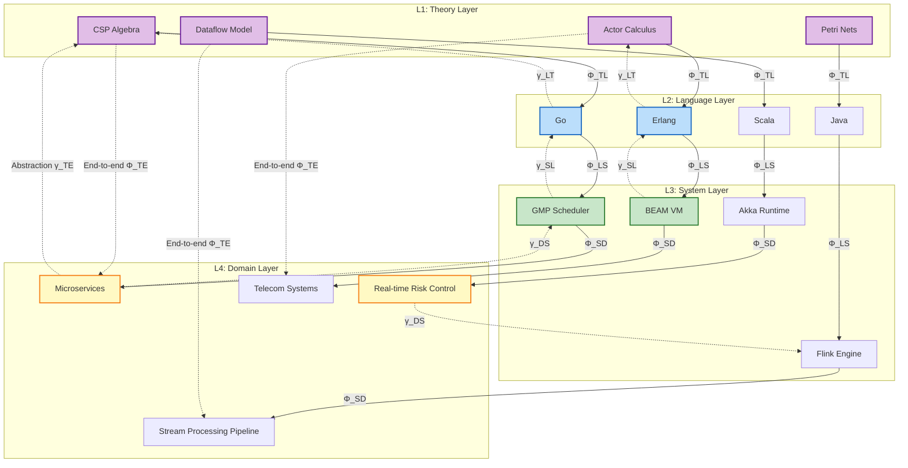
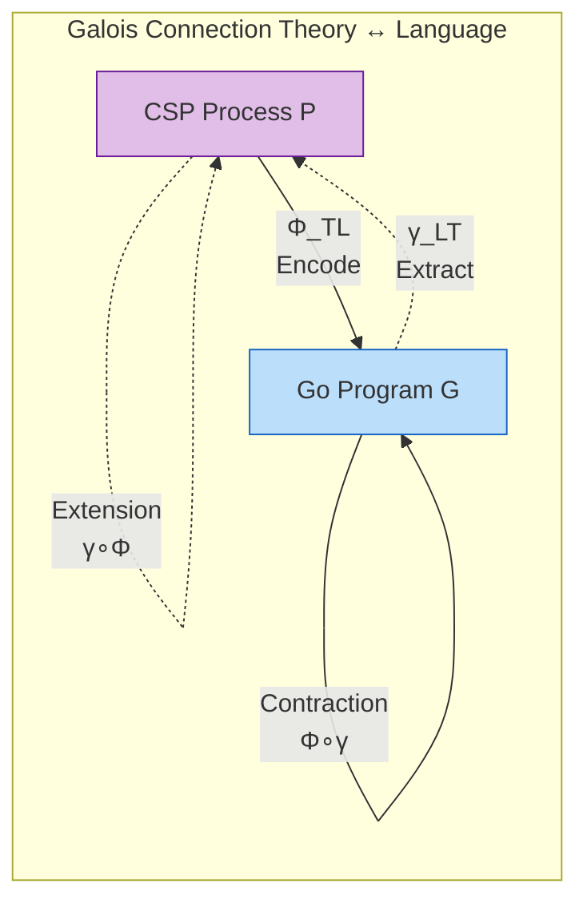
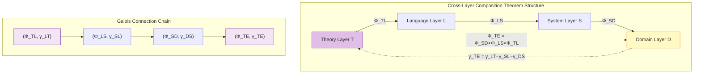
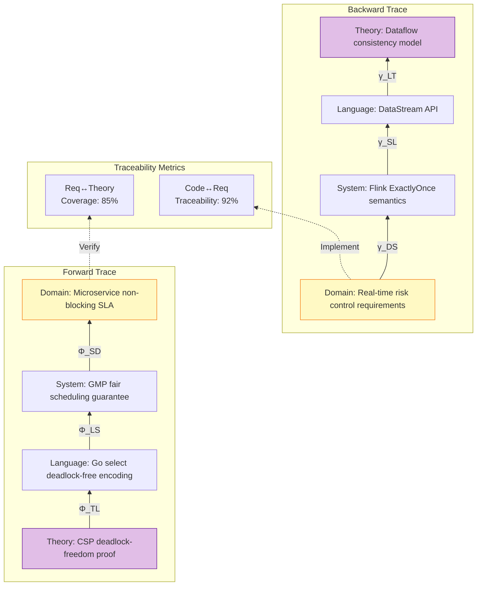

# Cross-Model Unified Mapping Framework

> **Stage**: Struct/03-relationships | **Prerequisites**: [../01-foundation/01.01-unified-streaming-theory.md](../01-foundation/01.01-unified-streaming-theory.md) | **Formalization Level**: L5-L6
> **Document ID**: S-16 | **Version**: 2026.04 | **Category**: Cross-Model Mapping

---

## Table of Contents

- [Cross-Model Unified Mapping Framework](#cross-model-unified-mapping-framework)
  - [Table of Contents](#table-of-contents)
  - [1. Definitions](#1-definitions)
    - [Def-S-16-01 (Four-Layer Unified Mapping Framework)](#def-s-16-01-four-layer-unified-mapping-framework)
    - [Def-S-16-02 (Inter-Layer Galois Connection)](#def-s-16-02-inter-layer-galois-connection)
    - [Def-S-16-03 (Cross-Layer Composed Mapping)](#def-s-16-03-cross-layer-composed-mapping)
    - [Def-S-16-04 (Semantic Preservation and Refinement Relation)](#def-s-16-04-semantic-preservation-and-refinement-relation)
  - [2. Properties](#2-properties)
    - [Lemma-S-16-01 (Order Preservation of Galois Connection)](#lemma-s-16-01-order-preservation-of-galois-connection)
    - [Lemma-S-16-02 (Galois Connection Preservation under Composition)](#lemma-s-16-02-galois-connection-preservation-under-composition)
    - [Prop-S-16-01 (Semantic Preservation of Theory-Language Encoding)](#prop-s-16-01-semantic-preservation-of-theory-language-encoding)
    - [Prop-S-16-02 (Transitivity of Cross-Layer Mappings)](#prop-s-16-02-transitivity-of-cross-layer-mappings)
    - [Prop-S-16-03 (Inter-Layer Preservation of Refinement)](#prop-s-16-03-inter-layer-preservation-of-refinement)
  - [3. Relations](#3-relations)
    - [3.1 Relation between Theory Layer $\mathcal{L}_{\text{theory}}$ and Language Layer $\mathcal{L}_{\text{language}}$](#31-relation-between-theory-layer-mathcal_l_texttheory-and-language-layer-mathcal_l_textlanguage)
    - [3.2 Relation between Language Layer $\mathcal{L}_{\text{language}}$ and System Layer $\mathcal{L}_{\text{system}}$](#32-relation-between-language-layer-mathcal_l_textlanguage-and-system-layer-mathcal_l_textsystem)
    - [3.3 Relation between System Layer $\mathcal{L}_{\text{system}}$ and Domain Layer $\mathcal{L}_{\text{domain}}$](#33-relation-between-system-layer-mathcal_l_textsystem-and-domain-layer-mathcal_l_textdomain)
    - [3.4 Cross-Layer Inference Rules](#34-cross-layer-inference-rules)
  - [4. Argumentation](#4-argumentation)
    - [4.1 Best Approximation Argument for Galois Connection](#41-best-approximation-argument-for-galois-connection)
    - [4.2 Boundary Argument for Cross-Layer Consistency](#42-boundary-argument-for-cross-layer-consistency)
    - [4.3 Convergence Argument for Composed Mappings](#43-convergence-argument-for-composed-mappings)
  - [5. Proof / Engineering Argument](#5-proof--engineering-argument)
    - [Thm-S-16-01 (Cross-Layer Mapping Composition Theorem)](#thm-s-16-01-cross-layer-mapping-composition-theorem)
    - [5.2 Engineering Argument: Bidirectional Traceability Implementation](#52-engineering-argument-bidirectional-traceability-implementation)
  - [6. Examples](#6-examples)
    - [6.1 Go/CSP Cross-Layer Mapping Example](#61-gocsp-cross-layer-mapping-example)
    - [6.2 Flink/Dataflow Cross-Layer Mapping Example](#62-flinkdataflow-cross-layer-mapping-example)
    - [6.3 Counter-Example: Semantic Loss due to Incomplete Encoding](#63-counter-example-semantic-loss-due-to-incomplete-encoding)
    - [6.4 Counter-Example: Composition Failure due to Mismatched Environmental Assumptions](#64-counter-example-composition-failure-due-to-mismatched-environmental-assumptions)
  - [7. Visualizations](#7-visualizations)
    - [Figure 7.1 Four-Layer Mapping Architecture and Galois Connection](#figure-71-four-layer-mapping-architecture-and-galois-connection)
    - [Figure 7.2 Galois Connection Adjunction](#figure-72-galois-connection-adjunction)
    - [Figure 7.3 Cross-Layer Composed Mapping Structure](#figure-73-cross-layer-composed-mapping-structure)
    - [Figure 7.4 Bidirectional Traceability Loop](#figure-74-bidirectional-traceability-loop)
  - [8. References](#8-references)
  - [Related Documents](#related-documents)
  - [Document Metadata](#document-metadata)

## 1. Definitions

### Def-S-16-01 (Four-Layer Unified Mapping Framework)

**Definition** (Four-Layer Unified Mapping Framework $\mathcal{F}_{CMU}$):

The cross-model unified mapping framework is a ten-tuple establishing a complete mapping path from formal theory to domain requirements:

$$
\mathcal{F}_{CMU} = \langle \mathcal{L}_{\text{theory}}, \mathcal{L}_{\text{language}}, \mathcal{L}_{\text{system}}, \mathcal{L}_{\text{domain}}, \Phi_{TL}, \Phi_{LS}, \Phi_{SD}, \gamma_{LT}, \gamma_{SL}, \gamma_{DS}, \mathcal{C} \rangle
$$

| Layer | Symbol | Definition | Core Concern | Expressiveness |
|-------|--------|------------|--------------|----------------|
| **Theory Layer** | $\mathcal{L}_{\text{theory}}$ | Formal systems: process calculus, Petri nets, type theory [^1][^2] | Mathematical semantics, decidability, bisimulation equivalence | L1-L6 full hierarchy |
| **Language Layer** | $\mathcal{L}_{\text{language}}$ | Programming language constructs and static semantics [^3] | Type systems, concurrency primitives, abstraction mechanisms | Concrete language implementation |
| **System Layer** | $\mathcal{L}_{\text{system}}$ | Runtime systems, virtual machines, execution engines [^4] | Scheduler, memory management, fault tolerance | Runtime behavior |
| **Domain Layer** | $\mathcal{L}_{\text{domain}}$ | Business domain models and requirement specifications [^5] | Business entities, process constraints, SLA metrics | Application semantics |

**Inter-Layer Mapping Function Family** [^6]:

| Mapping Direction | Symbol | Type | Formal Definition | Galois Connection |
|-------------------|--------|------|-------------------|-------------------|
| Theory → Language | $\Phi_{TL}$ | Encoding map | $\Phi_{TL}: \mathcal{L}_{\text{theory}} \to \mathcal{L}_{\text{language}}$ | Adjoint $\gamma_{LT}$ |
| Language → System | $\Phi_{LS}$ | Instantiation map | $\Phi_{LS}: \mathcal{L}_{\text{language}} \to \mathcal{L}_{\text{system}}$ | Adjoint $\gamma_{SL}$ |
| System → Domain | $\Phi_{SD}$ | Refinement map | $\Phi_{SD}: \mathcal{L}_{\text{system}} \to \mathcal{L}_{\text{domain}}$ | Adjoint $\gamma_{DS}$ |

**End-to-End Mapping**:

$$
\Phi_{TE} = \Phi_{SD} \circ \Phi_{LS} \circ \Phi_{TL}: \mathcal{L}_{\text{theory}} \to \mathcal{L}_{\text{domain}}
$$

**Definition Motivation**: Establishing a unified cross-layer mapping framework ensures that every decision at each layer can be traced back to the formal foundation of the upper layer, and every property can be propagated to the implementation of the lower layer, supporting bidirectional traceability from code to requirements and from requirements to code [^6].

---

### Def-S-16-02 (Inter-Layer Galois Connection)

**Definition** (Galois Connection between adjacent layers):

For adjacent abstraction levels $L_i$ and $L_{i+1}$, if there exists a mapping pair $(\alpha, \gamma)$ satisfying:

$$
\alpha: L_i \to L_{i+1} \quad \text{(abstraction/encoding)} \\
\gamma: L_{i+1} \to L_i \quad \text{(concretization/decoding)}
$$

And satisfying the Galois connection condition [^7]:

$$
\forall x \in L_i, y \in L_{i+1}. \; \alpha(x) \leq_{i+1} y \iff x \leq_i \gamma(y)
$$

Then $(\alpha, \gamma)$ is called a Galois connection, denoted $L_i \xrightarrow{\alpha \dashv \gamma} L_{i+1}$.

**Galois Connection Instances in the Framework**:

| Connection Pair | Abstraction Function $\alpha$ | Concretization Function $\gamma$ | Partial Order Relation |
|-----------------|-------------------------------|-----------------------------------|------------------------|
| $(\Phi_{TL}, \gamma_{LT})$ | Encode theoretical construct into language implementation | Extract weakest theoretical premise from language implementation | Semantic refinement order $\sqsubseteq$ |
| $(\Phi_{LS}, \gamma_{SL})$ | Instantiate language construct into system component | Abstract system behavior into language semantics | Behavioral inclusion order $\leq$ |
| $(\Phi_{SD}, \gamma_{DS})$ | Map system capability into domain concept | Decompose domain requirement into system specification | Requirement satisfaction order $\models$ |

**Core Property**: Galois connection guarantees that abstraction is the best approximation of concretization:

$$
\gamma \circ \alpha \geq \text{id}_{L_i} \quad \text{(extension)} \\
\alpha \circ \gamma \leq \text{id}_{L_{i+1}} \quad \text{(contraction)}
$$

---

### Def-S-16-03 (Cross-Layer Composed Mapping)

**Definition** (Cross-layer composed mapping $\Phi_{\text{compose}}$):

Given adjacent layer mappings $\Phi_{i,i+1}: L_i \to L_{i+1}$ and $\Phi_{i+1,i+2}: L_{i+1} \to L_{i+2}$, their composition is defined as:

$$
\Phi_{i,i+2} = \Phi_{i+1,i+2} \circ \Phi_{i,i+1}: L_i \to L_{i+2}
$$

**Composition Type Classification**:

| Composition Type | Definition | Semantic Preservation Condition |
|------------------|------------|--------------------------------|
| Sequential composition | $\Phi_{j,k} \circ \Phi_{i,j}$ | Transitivity of layer-wise semantic preservation |
| Parallel composition | $\Phi_{i,j}^{(1)} \parallel \Phi_{i,j}^{(2)}$ | Independence guarantees non-interference |
| Conditional composition | $\Phi_{i,j}^{(1)} \triangleleft b \triangleright \Phi_{i,j}^{(2)}$ | Guard conditions are mutually exclusive and exhaustive |

**Composition Operator Properties**:

$$
\text{(Associativity)} \quad (\Phi_{k,l} \circ \Phi_{j,k}) \circ \Phi_{i,j} = \Phi_{k,l} \circ (\Phi_{j,k} \circ \Phi_{i,j}) \\
\text{(Identity)} \quad \Phi_{i,i} = \text{id}_{L_i}
$$

---

### Def-S-16-04 (Semantic Preservation and Refinement Relation)

**Definition** (Semantic preservation mapping):

A mapping $\Phi: L_i \to L_j$ is semantically preserving iff for all observable properties $\phi \in \text{ObsProps}(L_i)$:

$$
M \models_i \phi \implies \Phi(M) \models_j \phi'
$$

Where $\phi'$ is the corresponding property of $\phi$ in $L_j$.

**Refinement Relation Definition**:

$$
M_1 \sqsubseteq M_2 \iff \forall \phi \in \text{Spec}. \; M_2 \models \phi \implies M_1 \models \phi
$$

That is, $M_1$ satisfies all specifications of $M_2$ ($M_1$ is more concrete / more refined).

---

## 2. Properties

### Lemma-S-16-01 (Order Preservation of Galois Connection)

**Lemma**: If $(\alpha, \gamma)$ is a Galois connection between $L_i$ and $L_{i+1}$, then $\alpha$ and $\gamma$ are both monotone functions.

**Proof**:

Let $x_1 \leq_i x_2$. We need to prove $\alpha(x_1) \leq_{i+1} \alpha(x_2)$.

1. By reflexivity of partial order: $\alpha(x_2) \leq_{i+1} \alpha(x_2)$
2. By Galois connection definition: $\alpha(x_2) \leq_{i+1} \alpha(x_2) \iff x_2 \leq_i \gamma(\alpha(x_2))$
3. By transitivity: $x_1 \leq_i x_2 \leq_i \gamma(\alpha(x_2))$
4. Apply Galois connection again: $\alpha(x_1) \leq_{i+1} \alpha(x_2)$

The monotonicity of $\gamma$ can be proved similarly. ∎

---

### Lemma-S-16-02 (Galois Connection Preservation under Composition)

**Lemma**: If $L_i \xrightarrow{\alpha_1 \dashv \gamma_1} L_j$ and $L_j \xrightarrow{\alpha_2 \dashv \gamma_2} L_k$ are both Galois connections, then the composite $(\alpha_2 \circ \alpha_1, \gamma_1 \circ \gamma_2)$ forms a Galois connection between $L_i$ and $L_k$.

**Proof**:

We need to prove: $\alpha_2(\alpha_1(x)) \leq_k z \iff x \leq_i \gamma_1(\gamma_2(z))$

1. $(\Rightarrow)$ direction:
   - Assume $\alpha_2(\alpha_1(x)) \leq_k z$
   - By Galois connection of $(\alpha_2, \gamma_2)$: $\alpha_1(x) \leq_j \gamma_2(z)$
   - By Galois connection of $(\alpha_1, \gamma_1)$: $x \leq_i \gamma_1(\gamma_2(z))$

2. $(\Leftarrow)$ direction is symmetric.

Therefore, cross-layer Galois connections can be built layer-by-layer and composed. ∎

---

### Prop-S-16-01 (Semantic Preservation of Theory-Language Encoding)

**Proposition**: If a theoretical construct $T$ is encoded into language implementation $L = \Phi_{TL}(T)$, then the semantic properties of $T$ are preserved in $L$:

$$
\forall \phi \in \text{Properties}(T): T \models \phi \implies L \models \phi'
$$

**Derivation**:

1. By Def-S-16-02, Galois connection guarantees best approximation
2. Observational equivalence implies consistent externally distinguishable behavior
3. Therefore any externally verifiable property $\phi$ holds on both sides
4. **Q.E.D.** ∎

---

### Prop-S-16-02 (Transitivity of Cross-Layer Mappings)

**Proposition**: Composition of adjacent layer mappings preserves transitivity:

$$
\Phi_{TE}(t) = d \iff \exists l, s. \; \Phi_{TL}(t) = l \land \Phi_{LS}(l) = s \land \Phi_{SD}(s) = d
$$

**Derivation**:

1. By function composition definition, $\Phi_{TE} = \Phi_{SD} \circ \Phi_{LS} \circ \Phi_{TL}$
2. If each sub-mapping is a well-defined function (guaranteed by Def-S-16-01), then composition is also well-defined
3. By Lemma-S-16-02, Galois connections are preserved under composition
4. Therefore the end-to-end mapping has determinism and best approximation
5. **Q.E.D.** ∎

---

### Prop-S-16-03 (Inter-Layer Preservation of Refinement)

**Proposition**: The refinement relation preserves direction under inter-layer mappings:

$$
M_1 \sqsubseteq_i M_2 \implies \Phi_{i,i+1}(M_1) \sqsubseteq_{i+1} \Phi_{i,i+1}(M_2)
$$

**Derivation**:

1. $M_1 \sqsubseteq_i M_2$ means $M_1$ satisfies all specifications of $M_2$
2. By semantic preservation, $\Phi_{i,i+1}$ preserves specification satisfiability
3. Therefore $\Phi_{i,i+1}(M_1)$ satisfies all corresponding specifications of $\Phi_{i,i+1}(M_2)$
4. **Q.E.D.** ∎

---

## 3. Relations

### 3.1 Relation between Theory Layer $\mathcal{L}_{\text{theory}}$ and Language Layer $\mathcal{L}_{\text{language}}$ {#31-relation-between-theory-layer-mathcal_l_texttheory-and-language-layer-mathcal_l_textlanguage}

**Encoding Existence** [^2]:

| Theoretical Construct | Language Implementation | Semantic Preservation Condition | Galois Connection Type |
|-----------------------|------------------------|--------------------------------|------------------------|
| CSP process $P \square Q$ | Go `select` statement | Non-deterministic choice semantics | Refinement connection |
| Actor behavior $\lambda x.M$ | Erlang `receive` pattern matching | Message processing isolation | Behavioral equivalence |
| $\pi$-calculus channel $\nu a.P$ | Scala Channel dynamic creation | Name creation and passing | Bisimulation preservation |
| Type $\tau \to \sigma$ | Function type `func(T) U` | Type safety | Type refinement |

**Galois Connection Instance**:

There exists a Galois connection $(\Phi_{TL}, \gamma_{LT})$ between theory-layer CSP processes and language-layer Go code:

$$
\Phi_{TL}(P) \sqsubseteq_{\text{Go}} G \iff P \sqsubseteq_{\text{CSP}} \gamma_{LT}(G)
$$

Where:

- $\Phi_{TL}(P)$: Encodes CSP process into the best Go implementation
- $\gamma_{LT}(G)$: Extracts the weakest CSP specification satisfied by the Go function

---

### 3.2 Relation between Language Layer $\mathcal{L}_{\text{language}}$ and System Layer $\mathcal{L}_{\text{system}}$ {#32-relation-between-language-layer-mathcal_l_textlanguage-and-system-layer-mathcal_l_textsystem}

**Instantiation Correspondence Table** [^4]:

| Language Construct | System Implementation | Runtime Component | Refinement Relation |
|--------------------|----------------------|-------------------|---------------------|
| Go `goroutine` | GMP scheduling unit | G struct + scheduler queue | $\text{Go goroutine} \sqsubseteq \text{GMP G}$ |
| Go `channel` | Synchronous queue | `hchan` struct + lock | $\text{Go channel} \sqsubseteq \text{hchan}$ |
| Erlang `process` | BEAM process | Process Control Block (PCB) | $\text{Erlang proc} \sqsubseteq \text{BEAM PCB}$ |
| Scala `Actor` | Akka Actor | ActorRef + mailbox | $\text{Scala Actor} \sqsubseteq \text{Akka ActorRef}$ |

---

### 3.3 Relation between System Layer $\mathcal{L}_{\text{system}}$ and Domain Layer $\mathcal{L}_{\text{domain}}$ {#33-relation-between-system-layer-mathcal_l_textsystem-and-domain-layer-mathcal_l_textdomain}

**Capability Mapping Table** [^5]:

| System Capability | Domain Requirement | Mapping Description |
|-------------------|--------------------|---------------------|
| Flink ExactlyOnce semantics | Financial transaction consistency | $\text{Flink ExactlyOnce} \models \text{ACID}$ |
| Actor supervision tree | Carrier-grade high availability (99.999%) | $\text{Supervision Tree} \models \text{High Availability}$ |
| Backpressure mechanism | System stability SLA | $\text{Backpressure} \models \text{Stability}$ |
| Checkpoint mechanism | Fault recovery RPO=0 | $\text{Checkpoint} \models \text{Zero RPO}$ |

---

### 3.4 Cross-Layer Inference Rules

**Forward Traceability Rule** (Theory → Domain):

$$
\frac{P \vdash_{\text{theory}} \phi \quad \Phi_{TE}(P) = D}{D \models_{\text{domain}} \phi'}
$$

**Backward Traceability Rule** (Domain → Theory):

$$
\frac{D \models_{\text{domain}} \psi \quad \gamma_{TE}(D) = P}{P \vdash_{\text{theory}} \psi'}
$$

Where $\gamma_{TE} = \gamma_{LT} \circ \gamma_{SL} \circ \gamma_{DS}$ is the end-to-end abstraction function.

---

## 4. Argumentation

### 4.1 Best Approximation Argument for Galois Connection

**Argumentation**: Galois connection guarantees that the abstraction function $\alpha$ is the left adjoint of the concretization function $\gamma$, providing the best approximation.

**Reasoning Process**:

1. **Existence**: For any $x \in L_i$, the set $\{y \in L_{i+1} \mid \alpha(x) \leq y\}$ is non-empty (contains at least $\alpha(x)$)
2. **Optimality**: $\alpha(x)$ is the minimum element of this set
3. **Uniqueness**: Guaranteed by antisymmetry of partial order

Therefore, the encoding mapping $\Phi_{TL}$ provides the optimal implementation scheme from theory to language.

---

### 4.2 Boundary Argument for Cross-Layer Consistency

**Argumentation**: Not all properties can be preserved in cross-layer mappings; there exist decidability boundaries.

**Boundary Analysis**:

| Hierarchy | Decidable Properties | Undecidable Properties | Reason |
|-----------|---------------------|------------------------|--------|
| L1-L3 | Deadlock freedom, liveness | — | Finite state space |
| L4 | Partial reachability | General liveness | Dynamic topology |
| L5-L6 | Type safety | Deadlock, termination | Turing-complete [^8] |

**Corollary**: At L5-L6 hierarchies (e.g., Actor, general-purpose programming languages), formal verification must be combined with runtime mechanisms (e.g., supervision trees, timeouts).

---

### 4.3 Convergence Argument for Composed Mappings

**Argumentation**: Composition of multi-layer Galois connections preserves convergence.

**Iterative Refinement Process**:

$$
M_0 \xrightarrow{\gamma \circ \alpha} M_1 \xrightarrow{\gamma \circ \alpha} M_2 \xrightarrow{\gamma \circ \alpha} \cdots
$$

Where $M_{i+1} = (\gamma \circ \alpha)(M_i)$. Since $\gamma \circ \alpha \geq \text{id}$ (extension property), the sequence is monotonically increasing and bounded above, thus converging to a fixed point.

---

## 5. Proof / Engineering Argument

### Thm-S-16-01 (Cross-Layer Mapping Composition Theorem)

**Theorem**: "Mappings across adjacent layers compose to form valid end-to-end translations with Galois connection preservation"

**Formal Statement**:

The composition of adjacent layer mappings forms a valid end-to-end translation and preserves the Galois connection structure:

$$
\forall T \in \mathcal{L}_{\text{theory}}: \Phi_{SD}(\Phi_{LS}(\Phi_{TL}(T))) \text{ is well-defined and semantically preserving}
$$

And the composite mapping $(\Phi_{TE}, \gamma_{TE})$ forms a Galois connection between $\mathcal{L}_{\text{theory}}$ and $\mathcal{L}_{\text{domain}}$.

**Proof**:

**Step 1: Decompose the mapping chain**

Let $\Phi_{TE} = \Phi_{SD} \circ \Phi_{LS} \circ \Phi_{TL}$. For a theoretical construct $T \in \mathcal{L}_{\text{theory}}$:

$$
\begin{aligned}
L &= \Phi_{TL}(T) \in \mathcal{L}_{\text{language}} \\
S &= \Phi_{LS}(L) \in \mathcal{L}_{\text{system}} \\
D &= \Phi_{SD}(S) \in \mathcal{L}_{\text{domain}}
\end{aligned}
$$

**Step 2: Prove well-definedness**

Guaranteed by definitions:

- Def-S-16-01 ensures each layer mapping is a well-defined function
- Function composition preserves well-definedness

**Step 3: Prove Galois connection preservation**

By Lemma-S-16-02:

- $(\Phi_{TL}, \gamma_{LT})$ is a Galois connection
- $(\Phi_{LS}, \gamma_{SL})$ is a Galois connection
- $(\Phi_{SD}, \gamma_{DS})$ is a Galois connection
- Therefore the composite $(\Phi_{TE}, \gamma_{TE})$ is also a Galois connection

**Step 4: Prove semantic preservation**

For any theoretical property $\phi_T$:

$$
\begin{aligned}
T \models \phi_T &\implies L \models \phi_L &&\text{(Prop-S-16-01)} \\
&\implies S \models \phi_S &&\text{(semantic preservation instantiation)} \\
&\implies D \models \phi_D &&\text{(refinement preservation property)}
\end{aligned}
$$

Therefore: $T \models \phi_T \implies D \models \phi_D$

**Step 5: Verify best approximation**

By Galois connection property:

$$
\gamma_{TE}(\Phi_{TE}(T)) \sqsupseteq T \quad \text{(extension)}
$$

This means end-to-end translation does not lose any theoretical-level constraints.

**Key Case Analysis**:

| Case | Theory Layer | Language Layer | System Layer | Domain Layer | Property Preservation | Galois Verification |
|------|--------------|----------------|--------------|--------------|----------------------|---------------------|
| Deadlock freedom | CSP deadlock-free process | Go select deadlock-free encoding | GMP fair scheduling guarantee | Microservice non-blocking | ✅ Preserved | $\gamma_{LT}$ extracts deadlock-freedom conditions |
| Type safety | FG well-typed term | Go compilation passes | Runtime type checking | Data consistency | ✅ Preserved | Type refinement preserved |
| Liveness | Actor liveness guarantee | Erlang supervision tree | BEAM process restart | Service availability | ⚠️ Probabilistically preserved | L5 undecidability limit |
| Real-time | Temporal logic specification | Real-time language extension | Real-time scheduler | Latency SLA | ✅ Preserved | Time refinement preserved |

∎

---

### 5.2 Engineering Argument: Bidirectional Traceability Implementation

**Argumentation Goal**: Prove that the cross-model unified mapping framework supports effective bidirectional traceability.

**Forward Traceability (Theory → Domain)**:

```
Theory property verification
    ↓ Φ_TL
Language implementation correctness
    ↓ Φ_LS
System behavior conformance
    ↓ Φ_SD
Domain requirement satisfaction
```

**Backward Traceability (Domain → Theory)**:

```
Domain requirement specification
    ↓ γ_DS
System capability requirements
    ↓ γ_SL
Language semantic constraints
    ↓ γ_LT
Theoretical prerequisite conditions
```

**Traceability Metrics**:

| Metric | Definition | Target | Measurement Method |
|--------|------------|--------|--------------------|
| Requirement coverage | Proportion of requirements traced | ≥ 90% | Requirement-code trace matrix |
| Property preservation rate | Proportion of properties preserved across layers | ≥ 85% | Formal verification statistics |
| Change propagation precision | Precision of code scope affected by requirement changes | ≤ 15% false positives | Impact analysis tools |

---

## 6. Examples

### 6.1 Go/CSP Cross-Layer Mapping Example

**Theory Layer (CSP)** [^2]:

```
P = (in?x → out!x → P) □ (timeout → P)
```

This process reads a value from channel `in` and forwards it to `out`, or recurses after a timeout.

**Language Layer (Go)**:

```go
func Process(in <-chan int, out chan<- int, timeout time.Duration) {
    for {
        select {
        case x := <-in:
            out <- x
        case <-time.After(timeout):
            // timeout handling, continue loop
        }
    }
}
```

**Galois Connection Verification**:

- $\Phi_{TL}(P) = \text{the above Go function}$ (encoding)
- $\gamma_{LT}(\text{Go function}) = P' \sqsubseteq P$ (weakest premise)

**System Layer (GMP)**:

```
Goroutine state machine: runnable → running → waiting → runnable
Channel implementation: hchan { qcount, dataqsiz, buf, sendq, recvq, lock }
```

**Domain Layer (Microservice Order Processing)**:

Requirement: Order requests must be forwarded to downstream services within 500ms, or a timeout alarm must be triggered.

**Cross-Layer Verification**: CSP deadlock freedom $\xrightarrow{\Phi_{TE}}$ Microservice non-blocking SLA satisfaction.

---

### 6.2 Flink/Dataflow Cross-Layer Mapping Example

**Theory Layer (Dataflow Model)** [^1]:

$$
\text{WindowedAggregation} = \lambda s. \; \text{groupBy}(key) \triangleright \text{window}(time) \triangleright \text{aggregate}(fn)
$$

**Language Layer (Flink DataStream API)**:

```java
// [伪代码片段 - 不可直接运行] 仅展示核心逻辑
import org.apache.flink.streaming.api.datastream.DataStream;
import org.apache.flink.api.common.functions.AggregateFunction;
import org.apache.flink.streaming.api.windowing.time.Time;

DataStream<Result> result = stream
    .keyBy(Event::getKey)
    .window(TumblingEventTimeWindows.of(Time.seconds(10)))
    .aggregate(new MyAggregateFunction());
```

**System Layer (Flink Engine)**:

| Component | Implementation | Corresponding Theoretical Concept |
|-----------|----------------|-----------------------------------|
| Checkpoint | Chandy-Lamport distributed snapshot | Consistency point |
| Watermark | Event time advancement mechanism | Logical clock |
| State Backend | RocksDB/Heap state storage | State space |

**Domain Layer (Real-time Risk Control)**:

Requirement: Fraud detection latency < 200ms, ExactlyOnce processing, 99.9% availability.

**Cross-Layer Verification**:

$$
\text{Dataflow ExactlyOnce} \xrightarrow{\Phi_{TE}} \text{Financial-grade consistency satisfied}
$$

---

### 6.3 Counter-Example: Semantic Loss due to Incomplete Encoding

**Scenario**: Erlang hot code upgrade mapped from Actor model to implementation layer

**Problem Analysis**:

| Layer | Expected Semantics | Actual Implementation | Gap |
|-------|--------------------|----------------------|-----|
| Theory | Atomic code replacement | Code hot-loading | Assumption mismatch |
| System | Automatic state migration | Manual state transition | Omission |
| Result | Zero-downtime upgrade | Runtime crash | Failure |

**Lesson**: Refinement mappings must completely cover all relevant semantics, including state migration, version compatibility, etc.

---

### 6.4 Counter-Example: Composition Failure due to Mismatched Environmental Assumptions

**Scenario**: Composing CSP→Go and Actor→Erlang refinement results in a hybrid system

**Conflict Analysis**:

| Feature | CSP→Go Refinement | Actor→Erlang Refinement |
|---------|-------------------|------------------------|
| Communication model | Synchronous (buffered) | Asynchronous FIFO |
| Choice semantics | Deterministic choice | Non-deterministic receive |
| Result | Buffer introduces asynchrony | Conflicts with non-determinism |

**Conclusion**: When composing refinement results, environmental assumptions of each component must be verified for compatibility.

---

## 7. Visualizations

### Figure 7.1 Four-Layer Mapping Architecture and Galois Connection



**Figure Description**:

- Purple = Theory Layer, Blue = Language Layer, Green = System Layer, Yellow = Domain Layer
- Solid downward arrows = encoding/abstraction mappings ($\Phi$)
- Dashed upward arrows = concretization/decoding mappings ($\gamma$)
- Each layer mapping pair forms a Galois connection

---

### Figure 7.2 Galois Connection Adjunction



**Figure Description**: Shows the extension ($\gamma \circ \Phi \geq \text{id}$) and contraction ($\Phi \circ \gamma \leq \text{id}$) properties of the Galois connection.

---

### Figure 7.3 Cross-Layer Composed Mapping Structure



---

### Figure 7.4 Bidirectional Traceability Loop



**Figure Description**: Forward traceability (property propagation from theory to domain) and backward traceability (requirement verification from domain to theory) form a complete loop through Galois connections.

---

## 8. References

[^1]: T. Akidau et al., "The Dataflow Model: A Practical Approach to Balancing Correctness, Latency, and Cost in Massive-Scale, Unbounded, Out-of-Order Data Processing", PVLDB, 8(12), 2015. <https://doi.org/10.14778/2824032.2824076>

[^2]: C.A.R. Hoare, "Communicating Sequential Processes", Prentice Hall, 1985. <[CSP Resource Site - Link Invalid]>

[^3]: G. Agha, "Actors: A Model of Concurrent Computation in Distributed Systems", MIT Press, 1986.

[^4]: Go Team, "Go Runtime Scheduler Implementation", Go 1.22 Documentation, 2024. <https://go.dev/src/runtime/proc.go>

[^5]: P. Carbone et al., "Apache Flink: Stream and Batch Processing in a Single Engine", IEEE Data Engineering Bulletin, 38(4), 2015.

[^6]: B. Pierce, "Types and Programming Languages", MIT Press, 2002. (Refinement relations and type systems)

[^7]: P. Cousot & R. Cousot, "Abstract Interpretation: A Unified Lattice Model for Static Analysis of Programs", POPL 1977. (Galois connection theoretical foundation)

[^8]: H. Rice, "Classes of Recursively Enumerable Sets and Their Decision Problems", Transactions of the AMS, 74(2), 1953. (Rice's Theorem)

---

## Related Documents

| Document Path | Content | Relation |
|---------------|---------|----------|
| [../01-foundation/01.01-unified-streaming-theory.md](../01-foundation/01.01-unified-streaming-theory.md) | USTM meta-model, six-layer hierarchy | Theoretical foundation |
| [../01-foundation/01.02-process-calculus-primer.md](../01-foundation/01.02-process-calculus-primer.md) | CSP/Actor/π calculus fundamentals | Theory layer instances |
| [../01-foundation/01.03-actor-model-formalization.md](../01-foundation/01.03-actor-model-formalization.md) | Actor semantics, supervision trees | Language-system mapping |
| [../01-foundation/01.05-csp-formalization.md](../01-foundation/01.05-csp-formalization.md) | CSP formalization | Theory layer instance |
| [03.01-actor-to-csp-encoding.md](./03.01-actor-to-csp-encoding.md) | Actor to CSP encoding | Cross-model mapping instance |
| [03.03-expressiveness-hierarchy.md](./03.03-expressiveness-hierarchy.md) | Expressiveness hierarchy | Hierarchy inclusion relations |

---

## Document Metadata

- **Document ID**: S-16
- **Version**: 2026.04
- **Formalization Level**: L5-L6
- **Definition Count**: 4 (Def-S-16-01 to Def-S-16-04)
- **Lemma Count**: 2 (Lemma-S-16-01, Lemma-S-16-02)
- **Proposition Count**: 3 (Prop-S-16-01 to Prop-S-16-03)
- **Theorem Count**: 1 (Thm-S-16-01)
- **Status**: Core framework document
- **Last Updated**: 2026-04-02

---

*This document establishes the cross-model unified mapping framework, achieving bidirectional traceable mapping from the theory layer to the domain layer through Galois connections, providing a unified methodological foundation for the formal analysis and engineering implementation of complex streaming systems.*
