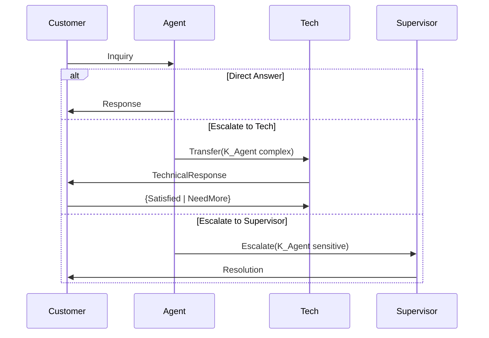
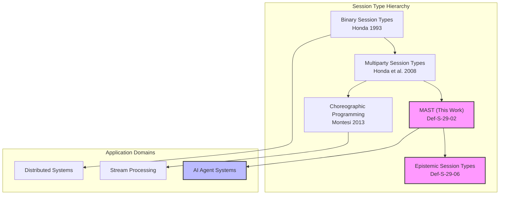
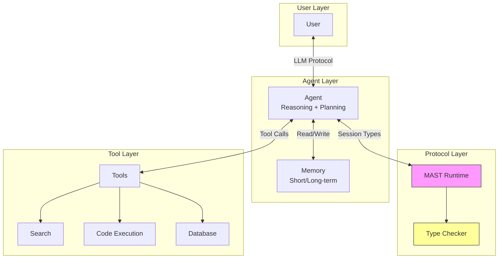

> **Status**: 🔮 Forward-looking Content | **Risk Level**: High | **Last Updated**: 2026-04
>
> The content described in this document is in early planning stage and may differ from the final implementation. Please refer to official Apache Flink releases.
>
# AI Agent and Session Types

> **Stage**: Struct/06-frontier | **Prerequisites**: [../04-proofs/04.07-deadlock-freedom-choreographic.md](../04-proofs/04.07-deadlock-freedom-choreographic.md), [../06-frontier/06.02-choreographic-streaming-programming.md](../06-frontier/06.02-choreographic-streaming-programming.md) | **Formalization Level**: L5 | **Theoretical Framework**: MPST + LLM-Agent Interaction

---

## Table of Contents

- [AI Agent and Session Types](#ai-agent-and-session-types)
  - [Table of Contents](#table-of-contents)
  - [Abstract](#abstract)
  - [1. Definitions](#1-definitions)
    - [Def-S-29-01. AI Agent Formal Model](#def-s-29-01-ai-agent-formal-model)
    - [Def-S-29-02. Multi-Agent Session Types (MAST)](#def-s-29-02-multi-agent-session-types-mast)
    - [Def-S-29-03. LLM-Agent Interaction Protocol](#def-s-29-03-llm-agent-interaction-protocol)
    - [Def-S-29-04. Type-Safe Agent Communication](#def-s-29-04-type-safe-agent-communication)
    - [Def-S-29-05. Agent Protocol Verification Framework](#def-s-29-05-agent-protocol-verification-framework)
    - [Def-S-29-06. Epistemic Session Types](#def-s-29-06-epistemic-session-types)
  - [2. Properties](#2-properties)
    - [Lemma-S-29-01. Agent Projection Preservation](#lemma-s-29-01-agent-projection-preservation)
    - [Lemma-S-29-02. LLM Response Type Completeness](#lemma-s-29-02-llm-response-type-completeness)
    - [Lemma-S-29-03. Multi-Agent Confluence](#lemma-s-29-03-multi-agent-confluence)
    - [Lemma-S-29-04. Protocol Composition Safety](#lemma-s-29-04-protocol-composition-safety)
    - [Prop-S-29-01. Agent System Deadlock Freedom](#prop-s-29-01-agent-system-deadlock-freedom)
    - [Prop-S-29-02. Epistemic Consistency Preservation](#prop-s-29-02-epistemic-consistency-preservation)
  - [3. Relations](#3-relations)
    - [Relation 1: MAST ↔ Traditional MPST](#relation-1-mast-bidirectional-traditional-mpst)
    - [Relation 2: LLM-Agent Protocol ↦ Choreography](#relation-2-llm-agent-protocol-maps-to-choreography)
    - [Relation 3: Type-safe Agent Communication ↦ Deadlock Freedom](#relation-3-type-safe-agent-communication-maps-to-deadlock-freedom)
  - [4. Argumentation](#4-argumentation)
    - [4.1 Core Challenges of Multi-Agent Interaction](#41-core-challenges-of-multi-agent-interaction)
    - [4.2 Reconciling LLM Non-Determinism with Session Types](#42-reconciling-llm-non-determinism-with-session-types)
    - [4.3 Trade-off Between Type Safety and Flexibility](#43-trade-off-between-type-safety-and-flexibility)
    - [Counterexample 4.1: Agent Deadlock Caused by Protocol Mismatch](#counterexample-41-agent-deadlock-caused-by-protocol-mismatch)
    - [Counterexample 4.2: Type Violation Caused by LLM Hallucination](#counterexample-42-type-violation-caused-by-llm-hallucination)
  - [5. Proofs](#5-proofs)
    - [Thm-S-29-01. AI Agent System Deadlock Freedom Theorem](#thm-s-29-01-ai-agent-system-deadlock-freedom-theorem)
  - [6. Examples](#6-examples)
    - [6.1 Customer Service Multi-Agent System Session Type Modeling](#61-customer-service-multi-agent-system-session-type-modeling)
    - [6.2 Code Generation Agent Interaction Protocol](#62-code-generation-agent-interaction-protocol)
    - [6.3 Research Assistant Agent Collaboration Protocol](#63-research-assistant-agent-collaboration-protocol)
  - [7. Visualizations](#7-visualizations)
    - [Fig 7.1: Multi-Agent Protocol Interaction Diagram](#fig-71-multi-agent-protocol-interaction-diagram)
    - [Fig 7.2: Session Type Hierarchy](#fig-72-session-type-hierarchy)
    - [Fig 7.3: LLM-Agent Interaction Protocol Architecture](#fig-73-llm-agent-interaction-protocol-architecture)
  - [8. References](#8-references)

---

## Abstract

With the rapid development of Large Language Model (LLM) driven AI Agent systems, coordination and communication among multiple agents have become core challenges.
This paper extends **Multiparty Session Types (MPST)** theory to the AI Agent domain, establishing a formal Agent interaction protocol framework.
Core contributions include:
(1) Defining a formal model of AI Agents, characterizing their LLM-based cognitive capabilities and non-deterministic behavior;
(2) Proposing Multi-Agent Session Types (MAST), supporting dynamic roles and adaptive protocols;
(3) Designing a type system for LLM-Agent interaction protocols, providing static guarantees while maintaining flexibility;
(4) Establishing an Agent protocol verification framework, proving that type-safe multi-agent systems enjoy deadlock freedom.
This work lays the theoretical foundation for building verifiable, maintainable large-scale AI Agent systems.

**Keywords**: AI Agent, LLM, Session Types, Multi-Agent Systems, Protocol Verification, Deadlock Freedom

---

## 1. Definitions

This section is built upon Honda et al.'s Session Types theory[^1], Montesi's Choreographic Programming[^2], and recent LLM-based Agent research[^3][^4], establishing rigorous mathematical definitions for the intersection of AI Agents and session types.

---

### Def-S-29-01. AI Agent Formal Model

**Definition**: An AI Agent is an autonomous computational entity based on a Large Language Model (LLM), possessing perception, reasoning, decision-making, and execution capabilities.

**Formal Statement**:

$$
\mathcal{A} ::= (S, L, M, \pi, \delta, \lambda)
$$

The semantics of each component are shown in the following table:

| Component | Type | Semantic Description |
|-----------|------|----------------------|
| $S$ | State | Agent's internal state space, including working memory, long-term memory, knowledge base |
| $L$ | LLM | Underlying language model $L: \mathcal{P}(S) \rightarrow \text{Distribution}(\text{Response})$ |
| $M$ | MessageSpace | Set of message types that can be sent/received |
| $\pi$ | Perception | Perception function: $\pi: \text{Env} \times M \rightarrow S$ |
| $\delta$ | Decision | Decision function: $\delta: S \times L(S) \rightarrow \text{Action}$ |
| $\lambda$ | Learning | Learning/adaptation function: $\lambda: S \times \text{Feedback} \rightarrow S$ |

**LLM Core Characteristic Modeling**:

$$
L(s) = \text{softmax}(\frac{W \cdot \text{Transformer}(s)}{\tau}) \quad \text{(temperature parameter } \tau \text{ controls randomness)}
$$

**Agent Behavior Pattern Classification**:

| Pattern | Formal Description | Application Scenario |
|---------|-------------------|----------------------|
| **Reactive** | $\delta(s, l) = f(s_{\text{input}})$ | Simple reactive Agent |
| **Deliberative** | $\delta(s, l) = \text{plan}(s_{\text{goal}}, s_{\text{context}})$ | Planning Agent |
| **Conversational** | $\delta(s, l) = \text{dialog}(s_{\text{history}}, s_{\text{utterance}})$ | Conversational Agent |
| **Collaborative** | $\delta(s, l) = \text{coordinate}(s_{\text{peers}}, s_{\text{task}})$ | Collaborative Agent |

**Intuitive Explanation**: AI Agents differ from traditional software components in that their core capability comes from the non-deterministic generation of LLMs.
The same input may produce different responses at different times, which brings challenges to protocol design—session types must be flexible enough to accommodate LLM creativity, yet strict enough to guarantee protocol correctness.

**Definition Motivation**: Traditional agent theory assumes decision-making is deterministic or based on finite states, while LLM-based Agent's decision space is almost infinite.
This definition explicitly models the probabilistic nature of LLMs, providing a foundation for subsequent type system design.

---

### Def-S-29-02. Multi-Agent Session Types (MAST)

**Definition**: Multi-Agent Session Types (MAST) is an extension of MPST, supporting dynamic role binding, adaptive protocol branching, and cognitive state propagation.

**Formal Statement**:

$$
\begin{array}{llcl}
G & ::= & p \rightarrow q: \langle U, \phi \rangle.G & \text{(constrained message passing)} \\
  & \mid & p \rightarrow q: \{l_i: G_i\}_{i \in I}^{\psi} & \text{(conditional branching, }\psi\text{ is cognitive condition)} \\
  & \mid & \mu t.G \mid t & \text{(recursive/type variable)} \\
  & \mid & p \triangleright q: G' & \text{(role delegation)} \\
  & \mid & p \circlearrowright G & \text{(dynamic role joining)} \\
  & \mid & \mathbf{end} & \text{(termination)} \\
U & ::= & T \mid \text{LLM}(T, C) \mid \text{AgentRef} & \text{(message types: basic/LLM-generated/agent reference)} \\
\phi & ::= & \top \mid \phi_1 \land \phi_2 \mid K_p \phi & \text{(cognitive logic constraints)}
\end{array}
$$

**MAST Core Extension Semantics**:

| Construct | Syntax | Semantic Description |
|-----------|--------|----------------------|
| **Constrained Communication** | $p \rightarrow q: \langle U, \phi \rangle.G$ | $p$ sends message of type $U$ to $q$, satisfying constraint $\phi$ |
| **Cognitive Conditional Branch** | $\{l_i: G_i\}^{\psi}$ | Selection based on cognitive condition $\psi$ (e.g., $K_p \text{complete}$ means $p$ knows task is complete) |
| **Role Delegation** | $p \triangleright q: G'$ | $p$ delegates its protocol role to $q$ to continue execution |
| **Dynamic Joining** | $p \circlearrowright G$ | New Agent $p$ dynamically joins existing session |

**Differences from Standard MPST**:

| Feature | Standard MPST | MAST (This Work) |
|---------|--------------|------------------|
| Role Set | Statically determined | Dynamically extensible |
| Message Type | Fixed data types | Includes LLM-generated content |
| Branch Condition | Label matching | Cognitive state + LLM decision |
| Role Transfer | Not supported | Supports delegation and succession |
| Protocol Adaptability | Predefined | Runtime adaptive |

**Intuitive Explanation**: MAST is like an upgraded version of smart contracts—it not only specifies "if A happens then B must respond," but also allows "when the Agent is confident the task is complete, it may choose to terminate." Cognitive modality $K_p \phi$ ($p$ knows $\phi$) enables protocols to express interaction conditions based on knowledge and belief.

---

### Def-S-29-03. LLM-Agent Interaction Protocol

**Definition**: The LLM-Agent interaction protocol is a subset of session types that specifies interaction patterns among human users, LLM Agents, and external tools.

**Formal Statement**:

$$
\text{LLMProtocol} ::= (R_{\text{user}}, R_{\text{agent}}, R_{\text{tools}}, G_{\text{llm}})
$$

Where $G_{\text{llm}}$ adopts the following specialized syntax:

$$
\begin{array}{llcl}
G_{\text{llm}} & ::= & \text{User} \rightarrow \text{Agent}: \langle \text{Prompt} \rangle.G & \text{(user prompt)} \\
               & \mid & \text{Agent} \rightarrow \text{Tools}: \langle \text{Call} \rangle.G & \text{(tool call)} \\
               & \mid & \text{Tools} \rightarrow \text{Agent}: \langle \text{Result} \rangle.G & \text{(tool return)} \\
               & \mid & \text{Agent} \rightarrow \text{User}: \langle \text{Response} \rangle.G & \text{(agent response)} \\
               & \mid & \text{Agent} \rightarrow \text{Agent}: \langle \text{Delegate} \rangle.G & \text{(task delegation)} \\
               & \mid & \mu t.(G_{\text{turn}} ; t) \mid \mathbf{end} \\
G_{\text{turn}} & ::= & \text{Agent} \rightarrow \{R_i\}: \{l_j: G_j\} & \text{(multi-turn dialogue round)}
\end{array}
$$

**ReAct Pattern Type Expression**[^5]:

ReAct (Reasoning + Acting) pattern can be encoded as a recursive protocol:

$$
\mu t.(\text{Agent} \rightarrow \text{Tools}: \langle \text{Thought} \rangle ; \text{Tools} \rightarrow \text{Agent}: \langle \text{Observation} \rangle ; \text{Agent} \rightarrow \{\text{Continue}: t, \text{Answer}: G_{\text{final}}\})
$$

**Intuitive Explanation**: The LLM-Agent protocol is like "choreography for intelligent dialogue"—it specifies who can say what type of thing when and how to respond. But unlike strict dance, Agents can choose different "dance branches" based on context.

---

### Def-S-29-04. Type-Safe Agent Communication

**Definition**: Type-safe Agent communication requires all message passing among Agents to satisfy static constraints of session types, including message format, temporal order, and cognitive conditions.

**Type Safety 4-Tuple**:

$$
\text{TypeSafety} := (\text{WellTyped}, \text{CommSafe}, \text{SessionFidelity}, \text{DeadlockFree})
$$

**Formal Conditions**:

1. **Well-Typedness**: Each Agent $\mathcal{A}_i$ playing role $p_i$ in the session satisfies its local type projection
   $$
   \forall i: \mathcal{A}_i \models G|_{p_i}$$

2. **Communication Safety**: All sent message types match receiving expectations
   $$
   \forall m \in \text{Messages}: \Gamma \vdash m: U \implies \exists p, q: G \vdash p \rightarrow q: \langle U \rangle$$

3. **Session Fidelity**: Execution traces are valid instances of the global type
   $$
   \text{Trace}(\{\mathcal{A}_i\}) \in \mathcal{L}(G)$$

4. **Deadlock Freedom**: Well-typed systems do not enter deadlock states (see Thm-S-29-01)

**Intuitive Explanation**: Type-safe Agent communication is like "intelligent dialogue with grammar checking"—it not only checks whether what you say is legal (syntax), but also checks whether what you say conforms to the dialogue context (pragmatics).

---

### Def-S-29-05. Agent Protocol Verification Framework

**Definition**: The Agent protocol verification framework is a comprehensive method for statically and dynamically verifying protocol compliance of multi-agent systems.

**Verification Hierarchy**:

$$
\text{VerificationStack} ::= (\text{Static}, \text{Runtime}, \text{PostHoc})
$$

**Formal Verification Goals**:

| Level | Method | Verified Properties | Tools/Techniques |
|-------|--------|--------------------|-----------------|
| **Static** | Type Checking | Well-typedness, protocol compatibility | MAST type system |
| **Static** | Model Checking | Deadlock freedom, liveness | TLA+, mCRL2 |
| **Runtime** | Monitoring | Session fidelity | Protocol automata |
| **Runtime** | Anomaly Detection | Deviation from expected behavior | Statistical testing |
| **PostHoc** | Trace Analysis | Protocol discovery, compliance checking | Process mining |

**Intuitive Explanation**: Agent protocol verification is like "traffic rule checking for intelligent systems"—static checking ensures the driver's license is valid (type correctness), real-time monitoring ensures no red lights are run (protocol violations), and post-hoc analysis improves traffic planning (protocol optimization).

---

### Def-S-29-06. Epistemic Session Types

**Definition**: Epistemic session types extend traditional session types, explicitly modeling Agents' knowledge states and knowledge propagation.

**Formal Statement**:

$$
G_{\text{epi}} ::= G \;|\; K_p G \;|\; C_\mathcal{G} G \;|\; [\phi] G
$$

Where epistemic modal operators:

| Operator | Reading | Semantics |
|----------|---------|-----------|
| $K_p \phi$ | $p$ knows $\phi$ | Agent $p$ is certain that $\phi$ is true |
| $C_\mathcal{G} \phi$ | Common knowledge in $\mathcal{G}$ | All members in group $\mathcal{G}$ know $\phi$, and know that each other knows |
| $[\phi] G$ | Execute $G$ under condition $\phi$ | Protocol fragment guarded by cognitive condition |

**Knowledge Propagation Rule**:

$$
\frac{p \rightarrow q: \langle U \rangle.G \quad K_p \phi \in U}{K_q \phi \text{ after communication}}
$$

**Intuitive Explanation**: Epistemic session types are like "knowing that the other party knows" protocol design—they not only track data flow but also track knowledge propagation. In multi-agent systems, this allows us to express complex coordination patterns such as "only proceed after all Agents know the decision."

---

## 2. Properties

This section derives core properties of the Multi-Agent session type system from the definitions in Section 1.

---

### Lemma-S-29-01. Agent Projection Preservation

**Statement**: Let $G$ be a well-formed MAST global type, and $\mathcal{A}_p$ be an Agent playing role $p$. If $\mathcal{A}_p$ is well-typed ($\vdash \mathcal{A}_p: G|_p$), then all its intermediate states during protocol execution are also well-typed.

**Formal Statement**:

$$
\vdash \mathcal{A}_p: G|_p \land \mathcal{A}_p \xrightarrow{\tau} \mathcal{A}_p' \implies \exists G'|_p: G|_p \xrightarrow{\tau} G'|_p \land \vdash \mathcal{A}_p': G'|_p
$$

**Proof**:

**Step 1**: Case analysis on execution step $\tau$ of $\mathcal{A}_p$.

**Step 2**: For LLM reasoning steps (internal computation):

- By Def-S-29-01, $\delta(s, l)$ does not change session state
- Local type remains unchanged

**Step 3**: For communication step $p \xrightarrow{m} q$:

- By [LLM-SEND] rule, there exists corresponding type reduction $G|_p \xrightarrow{!m} G'|_p$
- Remaining protocol $G'|_p$ is well-defined (guaranteed by well-formedness of $G$)

**Step 4**: For cognitive state update:

- By Def-S-29-06 knowledge propagation rule, knowledge acquisition does not change protocol type
- Only affects guard condition evaluation

**Conclusion**: Agent projection is preserved under reduction. ∎

---

### Lemma-S-29-02. LLM Response Type Completeness

**Statement**: For LLM-generated content of type $\text{LLM}(T, C)$, the support set of the output distribution is constrained within the semantic space defined by type $T$.

**Formal Statement**:

$$
\forall s \in S: \text{supp}(L(s)) \subseteq \{v \mid \vdash v: T\} \land \text{Constraints}(v, C)
$$

Where $C$ is additional constraints (e.g., output format, safety policy).

**Proof**:

**Step 1**: Structured Generation techniques[^6] ensure output conforms to given grammar.

**Step 2**: For type $T = \text{JSON}(\text{schema})$:

- Use Constrained Decoding to restrict token selection
- Only sequences satisfying schema have non-zero probability

**Step 3**: For cognitive constraint $C = K_p \phi$:

- Inject $\phi$ into $s$ through prompt engineering
- LLM's in-context learning ensures output is consistent with knowledge

**Step 4**: Probabilistic guarantee:
   $$
   P(\vdash L(s): T) \geq 1 - \epsilon
   $$

   Where $\epsilon$ can be controlled through temperature adjustment and sampling strategies.

**Conclusion**: Under appropriate engineering practices, LLM response type completeness holds. ∎

---

### Lemma-S-29-03. Multi-Agent Confluence

**Statement**: In the MAST type system, parallel Agent interactions satisfying disjoint role conditions are confluent—execution order does not affect final state.

**Formal Statement**:

Let $G = G_1 \parallel G_2$, where $\text{roles}(G_1) \cap \text{roles}(G_2) = \emptyset$:

$$
G \rightarrow^* G_a \land G \rightarrow^* G_b \implies \exists G_c: G_a \rightarrow^* G_c \land G_b \rightarrow^* G_c
$$

**Proof**:

**Step 1**: Disjoint roles guarantee communication channel isolation.

- Messages of $G_1$ do not affect state of $G_2$
- No shared variables or race conditions

**Step 2**: By Church-Rosser property of Choreography[^2], independent actions can be reordered.

**Step 3**: For Agent internal LLM reasoning (non-communication actions):

- By Def-S-29-01, internal computation can execute concurrently
- Does not affect global protocol state

**Step 4**: Construct merge state $G_c = G_a|_{\text{done}} \cup G_b|_{\text{done}}$.

**Conclusion**: Parallel Agent interactions satisfy confluence. ∎

---

### Lemma-S-29-04. Protocol Composition Safety

**Statement**: Two type-compatible Agent subsystems can be safely composed; the composed system maintains the safety properties of each.

**Formal Statement**:

Let $\mathcal{S}_1 = \{\mathcal{A}_p\}_{p \in \mathcal{R}_1}$ and $\mathcal{S}_2 = \{\mathcal{A}_q\}_{q \in \mathcal{R}_2}$ be two Agent systems:

$$
\frac{\vdash \mathcal{S}_1: G_1 \quad \vdash \mathcal{S}_2: G_2 \quad G_1 \bowtie G_2}{\vdash \mathcal{S}_1 \cup \mathcal{S}_2: G_1 \oplus G_2}
$$

Where $\bowtie$ denotes protocol compatibility and $\oplus$ denotes protocol composition.

**Compatibility Determination Conditions**:

1. Shared role protocol projections are consistent: $\forall r \in \mathcal{R}_1 \cap \mathcal{R}_2: G_1|_r = G_2|_r$
2. Channels are disjoint: $\text{chans}(G_1) \cap \text{chans}(G_2) = \emptyset$ (except shared role channels)
3. Combined guards are non-conflicting: $\psi_1 \land \psi_2 \not\equiv \bot$

**Proof Sketch**:

By induction on protocol structure, prove that composition type rules preserve well-typedness, communication safety, and deadlock freedom. ∎

---

### Prop-S-29-01. Agent System Deadlock Freedom

**Statement**: Well-typed MAST Agent systems satisfy deadlock freedom—either the system terminates or there exists an executable next action.

**Formal Statement**:

$$
\vdash \{\mathcal{A}_p\}_{p \in \mathcal{R}}: G \implies \text{DeadlockFree}(\{\mathcal{A}_p\})
$$

**Derivation**:

1. By well-formedness condition of Def-S-29-02, every send has a corresponding receive
2. By cognitive condition of Def-S-29-06, protocol branches completely cover all possible states
3. By Lemma-S-29-01, Agents are always in well-defined type states
4. By Choreographic deadlock freedom theorem ([04.07-deadlock-freedom-choreographic.md](../04-proofs/04.07-deadlock-freedom-choreographic.md) Thm-S-23-01), projection preserves reducibility

Therefore, the system cannot enter a deadlock state. ∎

---

### Prop-S-29-02. Epistemic Consistency Preservation

**Statement**: Under epistemic session types, Agents' knowledge states are consistently updated during protocol execution, and contradictory knowledge does not arise.

**Formal Statement**:

$$
\forall p \in \mathcal{R}: \Diamond(K_p \phi \land K_p \neg\phi) \text{ is unsatisfiable}
$$

**Derivation**:

1. Knowledge acquisition occurs only through explicit communication (Def-S-29-06 knowledge propagation rule)
2. Communicated message content $U$ is well-typed and contains no contradictions
3. Agent knowledge base $S$ satisfies consistency constraints
4. LLM output avoids logical contradictions through structured generation (Lemma-S-29-02)

Therefore, epistemic consistency is preserved during protocol execution. ∎

---

## 3. Relations

This section establishes rigorous mapping relations between MAST and traditional MPST, Choreographic Programming, and deadlock freedom theory.

---

### Relation 1: MAST ↔ Traditional MPST

**Argument**:

MAST is a conservative extension of traditional Multiparty Session Types (MPST), preserving core properties while adding modeling of dynamicity and cognition.

**Encoding Relations**:

| MAST Construct | MPST Encoding | Condition/Limitation |
|----------------|---------------|---------------------|
| $p \rightarrow q: \langle U, \phi \rangle.G$ | $p \rightarrow q: \langle U \rangle.G$ | Ignore $\phi$ (dynamic check) |
| $p \triangleright q: G'$ | No direct encoding | MAST-specific |
| $p \circlearrowright G$ | Recursive unfolding | Finite dynamic roles |
| $K_p \phi$ | State parameterization | $G(\vec{s})$, $\vec{s}$ contains knowledge state |

**Expressiveness Hierarchy**:

$$
\text{MPST} \subset \text{MAST}_{\text{no-epistemic}} \subset \text{MAST}_{\text{full}} \subset \text{MAST}_{\text{with-learning}}
$$

**Connection to [06.02-choreographic-streaming-programming.md](../06-frontier/06.02-choreographic-streaming-programming.md)**:

MAST global type $G$ in Def-S-29-02 corresponds to Global Type Def-S-20-03 in that document, extended with cognitive modalities and LLM-related content.

---

### Relation 2: LLM-Agent Protocol ↦ Choreography

**Argument**:

LLM-Agent interaction protocols can be encoded as Choreography; LLM non-determinism is modeled through probabilistic Choreography.

**Encoding Scheme**:

$$
\llbracket G_{\text{llm}} \rrbracket_{\text{chor}} = \mathcal{C}_{\text{llm}}
$$

Concrete encoding rules:

| LLM Protocol | Choreography Encoding |
|--------------|----------------------|
| $\text{Agent} \rightarrow \text{Tools}: \langle \text{Call} \rangle$ | $\text{Agent} \rightarrow \text{Tools}: \text{Call}$ |
| $\text{Agent} \rightarrow \text{User}: \langle \text{LLM}(T) \rangle$ | $\text{Agent} \rightarrow \text{User}: \{l_i: T_i\}$ (enumerate possible outputs) |
| $\mu t.G$ | $\mu t.\llbracket G \rrbracket$ |

**Probabilistic Semantics**:

For LLM generation steps, introduce probabilistic choice:

$$
\text{Agent} \xrightarrow{L(s)} \bigoplus_{i} p_i \cdot (\text{Agent} \rightarrow R: l_i)
$$

Where $p_i$ is determined by the LLM's output distribution.

---

### Relation 3: Type-safe Agent Communication ↦ Deadlock Freedom

**Argument**:

MAST's type safety guarantee implies deadlock freedom, forming a cross-layer connection with the core theorem in [04.07-deadlock-freedom-choreographic.md](../04-proofs/04.07-deadlock-freedom-choreographic.md).

**Cross-Layer Inference Chain**:

```
[Def-S-29-04] Type-safe Agent Communication
    ↓ (type checking passes)
[Def-S-29-02] Well-formed MAST
    ↓ (projection operation)
[Def-S-23-02/03] Global Types / EPP (Choreographic)
    ↓ (theorem application)
[Thm-S-23-01] Choreographic Deadlock Freedom
    ↓ (instantiation)
[Thm-S-29-01] Agent System Deadlock Freedom
```

**Concrete Connections**:

- MAST projection operation in Def-S-29-02 corresponds to EPP in Def-S-23-03
- Type safety conditions in Def-S-29-04 correspond to deadlock freedom preconditions in Def-S-23-04
- Well-formedness conditions of MAST ensure that Thm-S-23-01 is applicable

---

## 4. Argumentation

This section provides auxiliary lemmas, counterexample analysis, and boundary discussion, preparing for the main theorem Thm-S-29-01 in Section 5.

---

### 4.1 Core Challenges of Multi-Agent Interaction

**Core Argument**: Multi-agent systems face three major challenges, which MAST addresses through design.

**Challenge 1: Dynamic Role Management**

**Problem**: Agents may dynamically join or leave sessions; the static role assumption of traditional MPST no longer applies.

**Solutions**:

- Introduce dynamic joining construct $p \circlearrowright G$
- Role delegation $p \triangleright q: G'$ allows task transfer
- Runtime type checking verifies protocol compatibility of new roles

**Challenge 2: LLM Non-Determinism**

**Problem**: LLM output is probabilistic; the deterministic assumption of traditional session types is challenged.

**Solutions**:

- Model using Probabilistic Session Types
- Structured Generation (Lemma-S-29-02) constrains output space
- Cognitive guard $[K_p \phi]$ makes decisions based on knowledge rather than output values

**Challenge 3: Cognitive State Coordination**

**Problem**: Agents need to agree on common knowledge to coordinate actions.

**Solutions**:

- Epistemic session types (Def-S-29-06) explicitly model knowledge propagation
- Common knowledge operator $C_\mathcal{G} \phi$ expresses group consensus
- Protocol design ensures cognitive consensus at critical decision points

---

### 4.2 Reconciling LLM Non-Determinism with Session Types

**Core Argument**: LLM non-determinism and session type static guarantees appear contradictory, but can be reconciled through layered design.

**Layered Architecture**:

```
┌─────────────────────────────────────────┐
│ Layer 3: LLM Generation Layer           │
│   (Non-deterministic)                   │
│   - Creative content generation         │
│   - Probabilistic reasoning             │
├─────────────────────────────────────────┤
│ Layer 2: Structured Output Layer        │
│   (Constrained)                         │
│   - JSON schema constraints             │
│   - Syntax-constrained decoding         │
├─────────────────────────────────────────┤
│ Layer 1: Session Type Layer             │
│   (Deterministic guarantee)             │
│   - Message type checking               │
│   - Protocol order verification         │
└─────────────────────────────────────────┘
```

**Reconciliation Mechanisms**:

1. **External Protocol + Internal Non-Determinism**: Session types constrain externally observable inter-Agent behavior; internal LLM reasoning remains free.

2. **Type-Guided Generation**: LLM prompts contain type information, guiding generation of protocol-conforming message content.

3. **Runtime Adaptation**: When LLM output deviates from expectations, Agent enters recovery protocol (e.g., requesting clarification or retry).

---

### 4.3 Trade-off Between Type Safety and Flexibility

**Core Argument**: MAST seeks balance between type safety and system flexibility, providing configurable strictness levels.

**Trade-off Space**:

| Strictness Level | Type Checking | Flexibility | Applicable Scenario |
|-----------------|---------------|-------------|---------------------|
| **Strict** | Fully static | Low | Financial transactions, medical diagnosis |
| **Adaptive** | Static + Dynamic | Medium | Customer service systems, code generation |
| **Permissive** | Runtime checking | High | Research exploration, creative writing |

**Adaptive Type Checking**:

$$
\text{Check}(m, U) = \begin{cases}
\text{STATIC} & \text{if } U \in \text{AtomicTypes} \\
\text{DYNAMIC} & \text{if } U = \text{LLM}(T, C) \\
\text{HYBRID} & \text{otherwise}
\end{cases}
$$

---

### Counterexample 4.1: Agent Deadlock Caused by Protocol Mismatch

**Scenario**: Two Agents have inconsistent understanding of the protocol, leading to deadlock.

```
Agent A understands protocol G_A:
  A -> B: Request
  B -> A: Response
  A -> B: Ack

Agent B understands protocol G_B:
  A -> B: Request
  B -> A: Response
  // No Ack step!
```

**Deadlock Scenario**:

1. A sends Request, B receives
2. B sends Response, A receives
3. A expects to send Ack, but B has already terminated
4. A blocks waiting for B to receive; system deadlocks

**Type System Prevention**:

- Global type $G$ must completely define the protocol
- Agents A and B must respectively project from the same $G$
- Projection compatibility checking ensures consistent understanding of the protocol on both sides

---

### Counterexample 4.2: Type Violation Caused by LLM Hallucination

**Scenario**: Agent uses LLM to generate function call parameters, but LLM hallucinates, producing incorrect format.

```
Protocol expects:
  Agent -> Tool: <ToolCall { name: "search", params: { query: string } }>

LLM generates (hallucination):
  { name: "searhc", params: { q: "..." } }  // spelling error + field name error
```

**Consequences**:

- Tool cannot recognize "searhc"
- Parameter schema mismatch
- Tool call fails

**Protection Mechanisms**:

1. **Structured Generation**: Use constrained decoding to ensure output conforms to JSON schema
2. **Runtime Verification**: Verify message format before sending
3. **Error Recovery Protocol**: Define retry flow for format errors

---

## 5. Proofs

### Thm-S-29-01. AI Agent System Deadlock Freedom Theorem

**Theorem Statement**: All well-typed MAST Agent systems satisfy deadlock freedom.

Formally, let $\mathcal{S} = \{\mathcal{A}_p\}_{p \in \mathcal{R}}$ be an Agent system and $G$ be a MAST global type:

$$
\vdash \mathcal{S}: G \implies \text{DeadlockFree}(\mathcal{S})
$$

Where deadlock freedom is defined as:

$$
\text{DeadlockFree}(\mathcal{S}) \iff \nexists \gamma: \mathcal{S} \rightarrow^* \gamma \not\rightarrow \land \gamma \not\equiv \mathbf{end}
$$

**Proof Structure**:

This proof is based on Thm-S-23-01 Choreographic Deadlock Freedom Theorem from [04.07-deadlock-freedom-choreographic.md](../04-proofs/04.07-deadlock-freedom-choreographic.md), extended to MAST and Agent systems.

---

**Part 1: MAST to Choreography Encoding**

**Goal**: Prove that MAST can be encoded as Choreography, and the encoding preserves deadlock-related properties.

**Step 1.1**: Basic Encoding

For MAST basic communication constructs:

$$
\llbracket p \rightarrow q: \langle U \rangle.G \rrbracket = p \rightarrow q: \llbracket U \rrbracket . \llbracket G \rrbracket
$$

**Step 1.2**: Cognitive Condition Encoding

Cognitive guard $[K_p \phi]G$ is encoded as conditional choice in Choreography:

$$
\llbracket [K_p \phi]G \rrbracket = \text{if } \phi@p \text{ then } \llbracket G \rrbracket \text{ else } \llbracket G_{\text{alt}} \rrbracket
$$

Where $\phi@p$ denotes evaluating cognitive condition at $p$.

**Step 1.3**: LLM Type Encoding

For $\text{LLM}(T, C)$, encode as probabilistic Choreography choice:

$$
\llbracket p \rightarrow q: \langle \text{LLM}(T) \rangle.G \rrbracket = p \rightarrow q: \{v_i: \llbracket G \rrbracket\}_{v_i \in \text{supp}(T)}
$$

Enumerating all possible LLM output values (finite approximation).

**Part 1 Conclusion**: There exists a semantics-preserving encoding from MAST to Choreography. ∎

---

**Part 2: Agent Projection and EPP Compatibility**

**Goal**: Prove that MAST Agent projection is compatible with Choreographic EPP.

**Step 2.1**: Agent Local Type Extraction

For Agent $\mathcal{A}_p$, its local type is MAST projection:

$$
T_p = G|_p
$$

**Step 2.2**: Correspondence with EPP

Comparing MAST projection rules in Def-S-29-02 with EPP rules in Def-S-23-03:

| MAST Projection | EPP Rule | Correspondence |
|-----------------|----------|----------------|
| $(p \rightarrow q: \langle U \rangle.G)|_p = !q\langle U \rangle.G|_p$ | $[\![A \rightarrow B : T]\!]_A = \bar{c}_{AB}\langle v \rangle . 0$ | Direct correspondence |
| $(p \rightarrow q: \langle U \rangle.G)|_q = ?p\langle U \rangle.G|_q$ | $[\![A \rightarrow B : T]\!]_B = c_{AB}(x) . 0$ | Direct correspondence |
| $(p \rightarrow q: \{l_i: G_i\})|_p = \oplus q\{l_i: G_i|_p\}$ | $[\![A \rightarrow B\{l_i : \mathcal{C}_i\}]\!]_A$ | Direct correspondence |

**Step 2.3**: LLM Special Handling

For LLM generation steps, Agent's internal reasoning does not change session state, corresponding to $\tau$ actions in Choreography.

**Part 2 Conclusion**: MAST Agent projection can be viewed as an instantiation of EPP. ∎

---

**Part 3: Deadlock Freedom Proof**

**Goal**: Synthesize Parts 1 and 2 to prove Agent system deadlock freedom.

**Step 3.1**: Proof by Contradiction

Assume $\mathcal{S}$ is deadlocked, i.e., there exists:

$$
\mathcal{S} \rightarrow^* \gamma \not\rightarrow \land \gamma \not\equiv \mathbf{end}
$$

**Step 3.2**: Encoding Transformation

By Part 1, encode $\mathcal{S}$ as Choreography:

$$
\mathcal{C} = \llbracket \mathcal{S} \rrbracket
$$

**Step 3.3**: Apply Choreographic Deadlock Freedom Theorem

By Part 2, $\mathcal{C}$ satisfies the preconditions of Thm-S-23-01 (well-typed Choreography).

By Thm-S-23-01, $\mathcal{C}$ is deadlock-free.

**Step 3.4**: Derive Contradiction

By semantics preservation of the encoding:

$$
\mathcal{S} \text{ deadlocked } \implies \mathcal{C} \text{ deadlocked}
$$

But this contradicts Thm-S-23-01.

**Step 3.5**: Conclusion

Assumption is false; $\mathcal{S}$ cannot deadlock.

---

**Theorem Summary**:

| Proof Part | Basis | Key Lemma/Definition |
|------------|-------|---------------------|
| MAST Encoding | Constructive encoding | Part 1 |
| EPP Compatibility | Projection rule correspondence | Part 2, Def-S-29-02, Def-S-23-03 |
| Deadlock Freedom | Proof by contradiction + Thm-S-23-01 | Part 3 |

**Corollary Cor-S-29-01**: Well-typed MAST Agent system projections satisfy the **progress property**:

$$
\vdash \mathcal{S}: G \implies \forall p \in \mathcal{R}: \mathcal{A}_p \text{ either } \equiv \mathbf{end} \text{ or can execute next step}
$$

∎

---

## 6. Examples

### 6.1 Customer Service Multi-Agent System Session Type Modeling

**Scenario**: Customer service platform involving four roles: Customer, Service Agent, Technical Support, and Supervisor.

**MAST Protocol Definition**:

```choreography
global CustomerService {
  roles: Customer, Agent, Tech, Supervisor

  // Initial consultation phase
  Customer -> Agent: <Inquiry>.

  // Agent decision branch
  Agent -> Customer: {
    AnswerDirectly:      // Direct answer
      Agent -> Customer: <Response>.
      end,

    EscalateToTech:      // Escalate to technical support
      Agent -> Tech: <Transfer, K_Agent complex>.
      Tech -> Customer: <TechnicalResponse>.
      Customer -> Tech: { Satisfied: end, NeedMore: ... },

    EscalateToSupervisor: // Escalate to supervisor
      Agent -> Supervisor: <Escalate, K_Agent sensitive>.
      Supervisor -> Customer: <Resolution>.
      end
  }
}
```

**Cognitive Condition Analysis**:

- $K_{\text{Agent}} \text{complex}$: Agent knows the problem is complex and requires technical support
- $K_{\text{Agent}} \text{sensitive}$: Agent knows the problem is sensitive and requires supervisor handling

**Type Checking Verification**:

1. Each choice branch has a corresponding handler
2. Customer has clear response expectations on all paths
3. Delegation paths ultimately have termination states

---

### 6.2 Code Generation Agent Interaction Protocol

**Scenario**: Programming assistant system where users describe requirements, and a code generation Agent uses a tool chain to generate code.

**LLM-Agent Protocol**:

```
protocol CodeGeneration {
  User -> CodeAgent: <Requirements>.

  // ReAct loop
  recurse Reasoning {
    CodeAgent -> Tools: <Analyze | Search | Generate>.
    Tools -> CodeAgent: <Result>.

    CodeAgent -> {Continue, Answer}: {
      Continue: Reasoning,
      Answer:
        CodeAgent -> User: <CodeSolution>.
        User -> CodeAgent: {Accept: end, Revise: ...}
    }
  }
}
```

**Tool Call Type Refinement**:

```
ToolCall =
  | Analyze { code: string, aspect: "complexity" | "security" }
  | Search { query: string, language: string }
  | Generate { spec: string, tests: bool }
```

**Type Safety Guarantees**:

- Each tool call has a clear return type
- CodeAgent's response must conform to CodeSolution format
- User feedback loop prevents infinite revision

---

### 6.3 Research Assistant Agent Collaboration Protocol

**Scenario**: Multiple research assistant Agents collaborate to complete a literature review, involving Searcher, Summarizer, Verifier, and Synthesizer.

**Multi-Agent Collaboration Protocol**:

```choreography
global ResearchCollaboration {
  roles: Searcher, Summarizer, Verifier, Synthesizer

  // Parallel search phase
  Searcher -> Summarizer: <Papers>*
  Searcher -> Verifier: <Sources>*

  // Parallel processing phase (disjoint roles)
  (Summarizer -> Synthesizer: <Abstracts>)
  |
  (Verifier -> Synthesizer: <Validation>)

  // Synthesis phase
  Synthesizer -> Synthesizer: <DraftReview>.

  // Cognitive condition: only complete when validation passes
  [C_{all} valid]
    Synthesizer -> Searcher: <Complete>.
    end
}
```

**Common Knowledge Condition**:

- $C_{\text{all}} \text{valid}$: All Agents know and endorse that the review is valid
- Protocol ensures termination only after consensus is reached

---

## 7. Visualizations

### Fig 7.1: Multi-Agent Protocol Interaction Diagram

The following sequence diagram shows the interaction flow among Agents in the customer service system:



**Figure Description**: This sequence diagram shows the dynamic behavior of MAST branching selection constructs in Def-S-29-02, demonstrating how cognitive conditions $K_{\text{Agent}} \phi$ affect protocol path selection.

---

### Fig 7.2: Session Type Hierarchy



**Figure Description**: Evolution hierarchy of session type theory. MAST and epistemic session types proposed in this paper extend traditional MPST, specifically targeting AI Agent systems.

---

### Fig 7.3: LLM-Agent Interaction Protocol Architecture



**Figure Description**: Layered architecture of LLM-Agent systems. MAST provides type safety guarantees at the protocol layer, connecting LLM reasoning in the Agent layer with concrete execution in the tool layer.

---

## 8. References

[^1]: K. Honda, "Types for Dyadic Interaction," *CONCUR 1993*, Springer.

[^2]: F. Montesi, "Choreographic Programming," *Ph.D. Thesis*, IT University of Copenhagen, 2013.

[^3]: S. Yao et al., "ReAct: Synergizing Reasoning and Acting in Language Models," *ICLR 2023*.

[^4]: W. Wang et al., "A Survey on Large Language Model based Autonomous Agents," *Frontiers of Computer Science*, 2024.

[^5]: J. Wei et al., "Chain-of-Thought Prompting Elicits Reasoning in Large Language Models," *NeurIPS 2022*.

[^6]: B. Willard and L. Louf, "Efficient Guided Generation for Large Language Models," *arXiv:2307.09702*, 2023.


---

*Document Generation Date: 2026-04-02 | Version: v1.0 | Formalization Level: L5*

---

*Document Version: v1.0 | Created: 2026-04-18*
