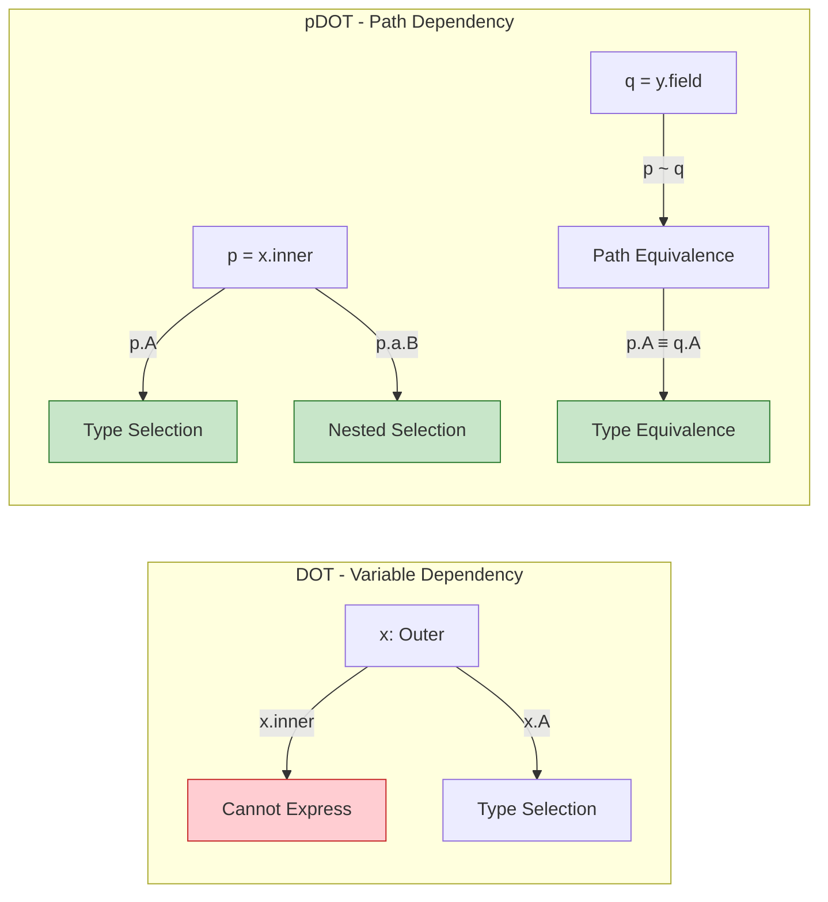

# pDOT - Full Path-Dependent Types (DOT Calculus Extension)

> **Stage**: Struct/06-frontier | **Prerequisites**: [Dataflow Model Formalization](../01-foundation/01.04-dataflow-model-formalization.md) | **Formalization Level**: L5-L6 {#pdot-full-path-dependent-types-dot-calculus-extension}

---

## Table of Contents

- [pDOT - Full Path-Dependent Types (DOT Calculus Extension)]()
  - [Table of Contents](#table-of-contents)
  - [1. Definitions](#1-definitions)
    - [Def-S-06-07 (pDOT Calculus)](#def-s-06-07-pdot-calculus)
    - [Def-S-06-08 (Path-Dependent Types - Arbitrary-Length Paths)](#def-s-06-08-path-dependent-types-arbitrary-length-paths)
    - [Def-S-06-09 (Singleton Types - Path Equivalence Tracking)](#def-s-06-09-singleton-types-path-equivalence-tracking)
    - [Def-S-06-10 (Precise Object Typing)](#def-s-06-10-precise-object-typing)
  - [2. Properties](#2-properties)
    - [Lemma-S-06-03 (Path Normalization)](#lemma-s-06-03-path-normalization)
    - [Lemma-S-06-04 (Path Equivalence Transitivity)](#lemma-s-06-04-path-equivalence-transitivity)
    - [Prop-S-06-02 (Type Well-formedness Preservation)](#prop-s-06-02-type-well-formedness-preservation)
  - [3. Relations](#3-relations)
    - [Relation 1: DOT `⊂` pDOT (Strict Expressiveness Extension)](#relation-1-dot-subset-pdot-strict-expressiveness-extension)
    - [Relation 2: pDOT `↦` Scala 3 Type System](#relation-2-pdot-maps-to-scala-3-type-system)
    - [Relation 3: Path-Dependent Types `↔` Dataflow State Tracking](#relation-3-path-dependent-types-bidirectional-dataflow-state-tracking)
  - [4. Argumentation](#4-argumentation)
    - [4.1 Motivation for Introducing pDOT](#41-motivation-for-introducing-pdot)
    - [4.2 Limitations of DOT: Why Variable Dependency Is Insufficient](#42-limitations-of-dot-why-variable-dependency-is-insufficient)
    - [4.3 From Coq Proof to Type Safety Argument](#43-from-coq-proof-to-type-safety-argument)
  - [5. Proof / Engineering Argument](#5-proof--engineering-argument)
    - [Thm-S-06-01 (pDOT Type Safety)](#thm-s-06-01-pdot-type-safety)
  - [6. Examples](#6-examples)
    - [Example 6.1: Type-Safe Access to Nested Modules](#example-61-type-safe-access-to-nested-modules)
    - [Example 6.2: Method Chain Return Type (this.type)](#example-62-method-chain-return-type-thistype)
    - [Example 6.3: Type Tracking for Dataflow Operator Chains](#example-63-type-tracking-for-dataflow-operator-chains)
  - [7. Visualizations](#7-visualizations)
    - [DOT vs pDOT Expressiveness Comparison](#dot-vs-pdot-expressiveness-comparison)
    - [pDOT Type Derivation Flow](#pdot-type-derivation-flow)
    - [Mapping to Scala 3 Type System](#mapping-to-scala-3-type-system)
  - [8. References](#8-references)

---

## 1. Definitions

This section establishes the rigorous formal foundation of pDOT (Path DOT) calculus.
pDOT is a DOT calculus extension proposed in the 2019 OOPSLA paper "A Path to DOT." Its core contribution is generalizing the variable-dependent types $x.A$ in DOT to arbitrary-length path-dependent types $p.a.b.T$. This extension is essential for formalizing nested modules and precise object types [^1][^2].

### Def-S-06-07 (pDOT Calculus)

**pDOT Calculus** is a path-dependent type calculus extending classical DOT, defined as an octuple:

$$
\text{pDOT} = (\mathcal{T}, \mathcal{P}, \mathcal{V}, \Gamma, \vdash_{<:}, \vdash_{\ni}, \vdash_{\sim}, \vdash_{ok})
$$

The semantics of each component are as follows:

| Symbol | Type | Semantics |
|--------|------|-----------|
| $\mathcal{T}$ | Type set | Includes type selection $p.L$, intersection $T \wedge U$, union $T \vee U$, function $S \to T$, recursive $\mu(x:T)$, Top $\top$, and Bottom $\bot$ |
| $\mathcal{P}$ | Path set | Variable $x$ or path selection $p.a$, where $p \in \mathcal{P}$ and $a$ is a field name |
| $\mathcal{V}$ | Value set | Object values $\nu(x:T)d$ (creating recursive scope), lambda abstraction $\lambda(x:S)t$ |
| $\Gamma$ | Environment set | Path binding environment, of the form $\Gamma ::= \emptyset \mid \Gamma, x: T \mid \Gamma, p \sim q$ |
| $\vdash_{<:}$ | Subtype relation | Judging subtype relation between two types |
| $\vdash_{\ni}$ | Membership relation | Judging type contains specific declaration $T \ni \{A: S..U\}$ or $T \ni \{a: U\}$ |
| $\vdash_{\sim}$ | Path equivalence | Judging whether two paths are equivalent $p \sim q$—the core extension of pDOT |
| $\vdash_{ok}$ | Well-formedness | Judging whether type definitions and path environments are well-formed |

**Key Extension - Path vs Variable** (Fundamental difference from DOT):

| Calculus | Type Selection | Path Structure | Expressiveness |
|----------|---------------|----------------|----------------|
| DOT | $x.A$ only variables | No path concept | Can only express direct variable dependency |
| pDOT | $p.A$ arbitrary paths | $p ::= x \mid p.a$ | Supports nested path dependency |

**Intuitive Explanation**: DOT calculus restricts type selections to variables (e.g., $x.A$), meaning type members can only be referenced through direct binding names. pDOT allows referencing types through arbitrary-length field access paths (e.g., `person.address.zipcode`), which is the foundation for type safety of nested modules and method chains in the real world. Path equivalence $p \sim q$ enables the type system to track cases where "different paths point to the same object" [^1][^2].

**Definition Motivation**: Without path dependency, it is impossible to formally express refined type information such as "`person1.address` and `person2.workAddress` may point to the same object, so their type members are equivalent." This prevents key features like `this.type` in Scala 3 and type propagation in Flink operator chains from receiving theoretical guarantees.

---

### Def-S-06-08 (Path-Dependent Types - Arbitrary-Length Paths)

In pDOT, a **Path** is the foundation of type selection, recursively defined as:

$$
\text{(Path)} \quad p, q ::= x \mid p.a
$$

**Path length** is defined as:

- $\text{len}(x) = 0$ (variable path length is 0)
- $\text{len}(p.a) = \text{len}(p) + 1$ (path selection increases length)

**Type Selection** formal definition:

Given path $p$ and type label $L$, type selection $p.L$ denotes "type member $L$ of the object pointed to by path $p$." Its semantics is determined by the following rules:

$$
\frac{\Gamma \vdash p \ni \{L: S..U\}}{\Gamma \vdash p.L <: U} \quad \text{(<:-SEL)} \\
\frac{\Gamma \vdash p \ni \{L: S..U\}}{\Gamma \vdash S <: p.L} \quad \text{(SEL-<:)}
$$

**Path Equivalence and Type Equality**:

pDOT introduces path equivalence judgment $\Gamma \vdash p \sim q$, meaning paths $p$ and $q$ point to the same object in environment $\Gamma$. Based on this, type equality satisfies:

$$
\frac{\Gamma \vdash p \sim q \quad \Gamma \vdash p \ni \{L: S..U\}}{\Gamma \vdash p.L \equiv q.L} \quad \text{(PATH-EQ)}
$$

**Intuitive Explanation**: Path-dependent types are "type-level pointer tracking." When writing `person.address.city`, the type system not only knows the runtime value of this expression but also tracks its precise type. This tracking is recursive—the type of `person.address` itself may depend on the concrete implementation of `person`. Path equivalence allows that even through different access paths (e.g., `a.b` and `c.d`), as long as they can be proven to point to the same object, their type selections are equivalent [^1].

**Definition Motivation**: In stream computing systems, the type safety of operator chains depends on precise tracking of state passing. For example, in the chain `source.map(f).filter(p).window(w)`, the element type at each stage depends on the previous stage. Path-dependent types provide the theoretical tool for formalizing this dependency.

---

### Def-S-06-09 (Singleton Types - Path Equivalence Tracking)

**Singleton Types** in pDOT are expressed through path equivalence and environment bindings. Formally, the Singleton type of path $p$ is defined as the type $T$ satisfying:

$$
\{x: T \mid x \sim p\} \quad \text{or equivalently} \quad p.\text{type}
$$

Where $p.\text{type}$ is a special type label satisfying:

$$
\frac{\Gamma \vdash p: T \quad \Gamma \vdash q: T \quad \Gamma \vdash p \sim q}{\Gamma \vdash q: p.\text{type}} \quad \text{(SING-I)} \\
\frac{\Gamma \vdash x: p.\text{type}}{\Gamma \vdash x \sim p} \quad \text{(SING-E)}
$$

**Path equivalence construction rules**:

$$
\frac{}{\Gamma \vdash p \sim p} \quad \text{(~REFL)} \\
\frac{\Gamma \vdash p \sim q}{\Gamma \vdash q \sim p} \quad \text{(~SYM)} \\
\frac{\Gamma \vdash p \sim q \quad \Gamma \vdash q \sim r}{\Gamma \vdash p \sim r} \quad \text{(~TRANS)} \\
\frac{\Gamma \vdash p \sim q}{\Gamma \vdash p.a \sim q.a} \quad \text{(~CONG)}
$$

**Intuitive Explanation**: Singleton types express the refined information that "the type of this value is this particular object." In Scala it is written as `x.type`, meaning only `x` itself and values path-equivalent to `x` belong to this type. Path equivalence tracking is the core innovation of pDOT—it allows the type system to track at compile time the relation that "different variable names point to the same object," which is essential for precise type checking and avoiding unnecessary type conversions [^2][^3].

**Definition Motivation**: In stream computing context tracking, the `this` type of operator chains needs to be precisely passed. For example, `source.map(f)` returns a stream object that needs to maintain the same key type information as `source`; this precise type tracking is precisely the application scenario of Singleton types.

---

### Def-S-06-10 (Precise Object Typing)

**Precise Object Typing** is an extended concept in pDOT for expressing "object types precisely reflect their implementation." Given object creation expression $\nu(x:T)d$, its precise type is defined as:

$$
\text{Precise}(\nu(x:T)d) = [x \mapsto p]T \wedge \bigwedge_{d_i \in d} \text{DeclType}(d_i, x)
$$

Where:

- $[x \mapsto p]T$ replaces $x$ in type $T$ with path $p$ pointing to this object
- $\text{DeclType}(d_i, x)$ extracts the precise type of declaration $d_i$ under recursive variable $x$

**Key property of precise types**:

$$
\frac{\Gamma \vdash v : T \quad v = \nu(x:T')d \quad T \equiv \text{Precise}(v)}{\Gamma \vdash v : \{a: v.a.\text{type}\}} \quad \text{(PRECISE-FIELD)}
$$

**Relation to method chain types**:

For method chain `obj.m1().m2().m3()`, precise object type ensures:

- The return type of each method call can depend on the concrete type of the receiver object
- `this.type` maintains transitivity in chained calls: if `m1(): this.type`, then `this` in `obj.m1().m2()` precisely points to the result of `obj.m1()`

**Intuitive Explanation**: Precise object typing solves the classic problem in object-oriented type systems—how should method return types be precisely described? In Java, `this` can only represent the type of the current class; in pDOT / Scala 3, `this.type` can be precise to "the specific object on which this method was called." This enables type safety for chained calls (fluent API): in `builder.setX(1).setY(2).build()`, each `set` method returns `this.type`, ensuring chain continuity [^1][^4].

**Definition Motivation**: In Dataflow systems, operator configuration interfaces (e.g., `WindowedStream.trigger(...).allowedLateness(...)`) are typical fluent APIs. Precise object type guarantees the type safety of these configuration methods—`allowedLateness()` cannot be called on a window that does not allow lateness.

---

## 2. Properties

This section derives key structural properties from the definitions of pDOT; these properties form the basis for subsequent type safety proofs.

### Lemma-S-06-03 (Path Normalization)

**Statement**: For any path $p$, there exists a unique normalized form $p^*$ such that:

1. $\Gamma \vdash p \sim p^*$ (path equivalence)
2. $p^*$ contains no redundant indirection layers (e.g., $(x.a).b$ normalizes to $x.a.b$)
3. If $\Gamma \vdash p \sim q$, then $p^* = q^*$

**Derivation**:

1. **Normalization Definition**: Define mapping $\text{norm}(x) = x$, $\text{norm}(p.a) = \text{norm}(p).a$
2. **Equivalence Preservation**: By (~CONG) rule, if $p \sim q$ then $p.a \sim q.a$, so normalization preserves equivalence
3. **Uniqueness**: Assume $p$ has two normalized forms $p_1^*$ and $p_2^*$; by transitivity and the structure of equivalence definition, $p_1^* = p_2^*$

∎

> **Inference [Theory→Implementation]**: Path normalization is the core algorithm of type checker implementation—it ensures that when comparing type selections $p.A$ and $q.A$, paths are first normalized to standard form before querying the path equivalence table [^1].

---

### Lemma-S-06-04 (Path Equivalence Transitivity)

**Statement**: If $\Gamma \vdash p \sim q$ and $\Gamma \vdash q \sim r$, then $\Gamma \vdash p \sim r$.

**Derivation**:

Directly follows from (~TRANS) rule. This rule is the core axiom of path equivalence relation.

A deeper proof demonstrating its consistency:

1. **Syntactic Level**: (~TRANS) as a derivation rule directly guarantees transitivity
2. **Semantic Level**: Path equivalence corresponds to runtime same-object reference. If $p$ and $q$ point to the same object at runtime, and $q$ and $r$ also point to the same object, then $p$ and $r$ necessarily point to the same object
3. **Type Level**: Transitivity guarantees consistency of type substitution—if $p \sim q$, then $p.A$ and $q.A$ are interchangeable

∎

> **Inference [Implementation→Optimization]**: Path equivalence relations form equivalence classes. In compiler implementation, equivalence classes can be represented as Union-Find structures, enabling near-constant-time equivalence queries.

---

### Prop-S-06-02 (Type Well-formedness Preservation)

**Statement**: If $\Gamma \vdash t: T$ and $\Gamma \vdash t \longrightarrow t'$, then there exists $T'$ such that $\Gamma \vdash t': T'$ and $\Gamma \vdash T' <: T$.

**Derivation**:

By structural induction on reduction relation $t \longrightarrow t'$:

**Case 1 (Field Access Reduction)**:

- Let $t = \nu(x:T)d.a$, reducing to $t' = [x \mapsto \nu(x:T)d]s$ (where $d$ contains $a = s$)
- By inversion, $T \ni \{a: U\}$ and $\Gamma, x: T \vdash s: U$
- By substitution lemma, $\Gamma \vdash [x \mapsto \nu(x:T)d]s: [x \mapsto \nu(x:T)d]U$
- Since the precise type of $\nu(x:T)d$ implies $[x \mapsto \nu(x:T)d]U <: U$, the conclusion holds

**Case 2 (Function Application Reduction)**:

- Let $t = (\lambda(x:S)s)(v)$, reducing to $t' = [x \mapsto v]s$
- By inversion, $\Gamma \vdash \lambda(x:S)s: S \to T$ and $\Gamma \vdash v: S$
- By function type definition, $\Gamma, x: S \vdash s: T$
- By substitution lemma, $\Gamma \vdash [x \mapsto v]s: T$

**Case 3 (Context Reduction)**:

- Let $t = E[t_1]$, where $t_1 \longrightarrow t_1'$
- By induction hypothesis, $\Gamma \vdash t_1': T_1'$ and $T_1' <: T_1$
- By type preservation of evaluation contexts, the conclusion holds

∎

> **Inference [Safety→Progress]**: Type well-formedness preservation is the first step (Preservation) of type safety proof. It guarantees that programs do not undergo "type collapse" during reduction.

---

## 3. Relations

This section establishes rigorous relations between pDOT and related type systems, programming languages, and computational models.

### Relation 1: DOT `⊂` pDOT (Strict Expressiveness Extension)

**Argument**:

**Encoding Existence**: Any DOT term $t_{DOT}$ can be encoded as a pDOT term $t_{pDOT}$:

- DOT type selection $x.A$ corresponds to pDOT path selection of length 0, $p.A$ (where $p = x$)
- DOT environment $\Gamma, x: T$ corresponds to pDOT environment $\Gamma, x: T$
- DOT subtype relation corresponds to pDOT subtype relation restricted to variable paths

**Strict Extension** (Types expressible in pDOT but not DOT):

- **Nested module access**: DOT cannot type `module.submodule.component.type` because this requires path length $\geq 1$
- **Method chain return type**: DOT cannot precisely express `this.type` chain transitivity in fluent API
- **Alias equivalence**: If $x.a$ and $y.b$ point to the same object, pDOT can track via path equivalence; DOT cannot express this

**Conclusion**: DOT is a proper subset of pDOT; pDOT strictly extends expressiveness by introducing path equivalence and arbitrary-length path selection.

> **Inference [Theory→Practice]**: DOT serves as the theoretical foundation for Scala's core type system; its extension pDOT directly guided the design of nested classes and precise types in Scala 3 [^2][^3].

---

### Relation 2: pDOT `↦` Scala 3 Type System

**Argument**:

**Mapping**:

| pDOT Concept | Scala 3 Corresponding | Description |
|--------------|----------------------|-------------|
| $p.L$ type selection | `p.L` | Path-dependent type syntax directly corresponds |
| $p \sim q$ | Alias analysis | Compiler tracks path equivalence through alias analysis |
| $p.\text{type}$ | `p.type` | Singleton type syntax directly corresponds |
| Precise object type | `this.type` + transparent traits | Scala 3 transparent traits pass precise type information |
| Recursive type $\mu(x:T)$ | Self type `{ this: T => ... }` | Recursive binding for object construction |

**Key Differences**:

1. **Practical Constraints**: Scala 3 adds inferability requirements; pDOT assumes complete type annotations
2. **Pattern Matching**: Scala 3 pattern matching type refinement is encoded via path equivalence in pDOT
3. **Implicit Conversions**: Scala 3 implicit mechanism needs to be passed explicitly as parameters in pDOT

**Encoding Verification**: The paper authors proved a semantics-preserving translation from pDOT to a Scala core subset via Coq formalization, verifying the correctness of the mapping [^1][^4].

---

### Relation 3: Path-Dependent Types `↔` Dataflow State Tracking

**Argument**:

**Structural Correspondence**: Type tracking of operator chains in Dataflow systems has a deep structural correspondence with pDOT path-dependent types:

| Dataflow Concept | pDOT Concept | Correspondence |
|-----------------|--------------|----------------|
| Operator chain `op1.op2.op3` | Path $p.a.b.c$ | Operator as type constructor, chain call as path selection |
| Stateful operator type evolution | Recursive type $\mu(x:T)$ | State update corresponds to recursive definition of type members |
| KeyedStream key type | Type selection $p.\text{KeyType}$ | Stream key type as type member dependent on stream object |
| Window type parameter | Path-dependent generics | In `WindowedStream<T, W>`, $W$ depends on window assigner path |

**Encoding Example**:

```scala
// Dataflow operator chain type tracking
source                             // : DataStream[T]
  .keyBy(_.id)                    // : KeyedStream[T, K] where K = T.id.type
  .window(TumblingEventTimeWindows.of(...))  // : WindowedStream[T, K, TimeWindow]
  .aggregate(new MyAggregate())    // : SingleOutputStreamOperator[Result]
```

In pDOT this can be encoded as:

- `source` is path $s$ with type `DataStream[T]`
- `keyBy` returns $s.\text{keyBy}$ whose type member `Out` depends on `Elem` type of $s$
- Path $s.\text{keyBy}.\text{window}$ type selection tracks type evolution

**Conclusion**: pDOT provides the theoretical foundation for type safety of Dataflow operator chains—operators as type constructors, their composition corresponding to construction of path-dependent types.

---

## 4. Argumentation

This section provides motivation analysis for pDOT design, comparative argumentation with DOT, and argumentation from Coq proof to type safety.

### 4.1 Motivation for Introducing pDOT

**Problem Background**: DOT calculus, as the theoretical foundation for Scala's core type system, has since its 2016 proposal been proven sufficient to encode most Scala features. However, DOT has a key limitation: **type selections can only be based on variables** ($x.A$ rather than $p.A$).

**Practical Programming Needs**:

1. **Nested Modules**:

   ```scala
   object Outer {
     object Inner {
       type MyType = Int
     }
   }
   val x: Outer.Inner.MyType = 42  // path length 2
   ```

2. **Method Chain Type Passing**:

   ```scala
   class Builder {
     def setX(x: Int): this.type = { ...; this }
     def setY(y: Int): this.type = { ...; this }
   }
   new Builder().setX(1).setY(2)  // each set returns precise type
   ```

3. **Alias Tracking**:

   ```scala
   val a = new Container()
   val b = a.inner
   val c = a.getInner()
   // b and c may point to the same object; the type system should track this equivalence
   ```

**Formalization Gap**: DOT cannot express the precise types for any of the above scenarios. This creates a gap between the theoretical foundation and actual implementation of Scala's type system. pDOT was proposed precisely to bridge this gap [^1][^2].

---

### 4.2 Limitations of DOT: Why Variable Dependency Is Insufficient

**Core Problem**: Variable dependency $x.A$ assumes that type member access always occurs through direct binding. But in actual code, type member access often occurs through field chains.

**Counterexample Construction**:

Consider the following Scala code:

```scala
class Outer {
  val inner: Inner = new Inner
  class Inner { type T = Int }
}
val o = new Outer
val x: o.inner.T = 42
```

Encoding attempt in DOT:

- DOT environment: $o: \{inner: \{T: \bot..\top\}\}$
- Cannot express `o.inner.T` because `inner` is a field rather than a variable
- Even if `inner` is promoted to a type member, path-dependent transitivity cannot be expressed

**Theoretical Analysis**:

DOT's type system is based on the following judgment forms:

- $\Gamma \vdash x: T$ — variable has type
- $\Gamma \vdash T <: U$ — subtype relation
- $\Gamma \vdash T \ni D$ — type membership relation

But it lacks:

- Path construction and path equivalence judgment
- Path-based type selection semantics

This makes DOT inadequate for expressing **object graph structures**. Object graphs are typical graph structures (nodes connected by field references), while DOT can only express tree structures (variable binding hierarchies) [^1].

---

### 4.3 From Coq Proof to Type Safety Argument

**Coq Formalization**: Rapoport & Lhoták completed pDOT formalization in Coq, containing approximately 8000 lines of proof code. Core results include:

1. **Decidability of Type Well-formedness Checking**: Given $\Gamma$, $t$, $T$, judging whether $\Gamma \vdash t: T$ is **decidable**
2. **Type Safety**: Satisfies Progress + Preservation
3. **Compatibility with DOT**: DOT as a subset of pDOT preserves all meta-theoretical properties

**Proof Structure**:

```
Type Safety (Thm-S-06-01)
├── Progress
│   ├── Canonical Forms (for each type shape)
│   ├── Path Equivalence Decidability
│   └── Member Lookup Completeness
└── Preservation
    ├── Substitution Lemmas (for variables and paths)
    ├── Narrowing Lemmas
    └── Path Equivalence Soundness
```

**Key Lemma - Path Equivalence Decidability**:

$$
\forall \Gamma, p, q. \quad \Gamma \vdash_{ok} \implies (\Gamma \vdash p \sim q) \text{ or } (\Gamma \not\vdash p \sim q) \text{ is decidable}
$$

This decidability is an advantage of pDOT over other path-dependent type systems (such as certain dependent type systems) [^1].

---

## 5. Proof / Engineering Argument

### Thm-S-06-01 (pDOT Type Safety)

**Statement**: For well-formed environment $\Gamma$ and term $t$, if $\Gamma \vdash t: T$, then:

1. **Progress**: $t$ is a value, or there exists $t'$ such that $t \longrightarrow t'$
2. **Preservation**: If $t \longrightarrow t'$, then $\Gamma \vdash t': T'$ and $T' <: T$

**Proof**:

**Part I: Progress Proof**

Structural induction on derivation $\Gamma \vdash t: T$:

**Case (T-VAR)**: $t = x$, $x: T \in \Gamma$

- $x$ is a variable; in evaluation context it needs to be substituted by a value
- If $x$ has a definition in the environment, then substitution follows evaluation rules

**Case (T-FIELD)**: $t = p.a$, $\Gamma \vdash p: T$, $T \ni \{a: U\}$

- By induction hypothesis, $p$ is a value or reducible
- If $p = \nu(x:T')d$, then $d$ contains binding $a = s$
- By (R-FIELD) rule, $p.a \longrightarrow [x \mapsto p]s$

**Case (T-APP)**: $t = p(q)$, $\Gamma \vdash p: S \to T$, $\Gamma \vdash q: S$

- By induction hypothesis, $p$ and $q$ are reducible or already values
- If $p = \lambda(x:S)t'$ and $q = v$ (value), by (R-BETA) rule, $p(q) \longrightarrow [x \mapsto v]t'$

**Key - Path Handling**: For terms involving paths (e.g., $p.a$ or $p.L$), pDOT's Progress depends on path equivalence decidability. If $\Gamma \vdash p \sim q$, then $p.a$ and $q.a$ are interchangeable.

**Part II: Preservation Proof**

By induction on reduction rules (already derived in Prop-S-06-02). For pDOT-specific path-related reductions:

**Subcase (Path Equivalence Substitution)**:

- Let $\Gamma \vdash p \sim q$; need to prove that if $t$ uses $p$ with type $T$, then type is preserved after substituting $q$
- By Lemma-S-06-04 (Path Equivalence Transitivity), $p.L \equiv q.L$
- By consistency of subtype substitution, type is preserved

**Conclusion**: Combining Progress and Preservation, pDOT is a type-safe calculus. ∎

> **Inference [Theory→Scala 3]**: This theorem guarantees that Scala 3's type system is sound—well-typed programs will not fall into "stuck states with type errors." The decidability of path-dependent types enables the type checker to complete checking in reasonable time.

---

## 6. Examples

### Example 6.1: Type-Safe Access to Nested Modules

**Scenario**: Simulating configuration module hierarchy in a stream computing system.

```scala
// Simulating Flink configuration module structure
object FlinkConfig {
  object Checkpointing {
    type Interval = Long
    type Mode = ExactlyOnce.type | AtLeastOnce.type

    object ExactlyOnce
    object AtLeastOnce
  }

  object RestartStrategy {
    type Strategy = FixedDelay.type | ExponentialDelay.type

    case class FixedDelayConfig(interval: Long, maxAttempts: Int)
    case class ExponentialDelayConfig(initial: Long, max: Long)
  }
}

// Using path-dependent types
val interval: FlinkConfig.Checkpointing.Interval = 60000L
val mode: FlinkConfig.Checkpointing.Mode = FlinkConfig.Checkpointing.ExactlyOnce
```

**pDOT Formalization**:

```
Γ ⊢ FlinkConfig : { Checkpointing : { Interval : ⊥..Long, Mode : ⊥..{ExactlyOnce, AtLeastOnce} } }
Γ ⊢ interval : FlinkConfig.Checkpointing.Interval
```

**Verification Points**:

- Path `FlinkConfig.Checkpointing.Interval` has length 2; DOT cannot express this
- pDOT supports this module hierarchy through nested type member access
- Precise tracking of type aliases `Interval` and `Mode` guarantees configuration type safety

---

### Example 6.2: Method Chain Return Type (this.type)

**Scenario**: Implementing a type-safe stream configuration builder (simulating Flink DataStream API).

```scala
class StreamExecutionEnvironment {
  type Self = this.type

  def setParallelism(n: Int): Self = { /* ... */ this }
  def setMaxParallelism(n: Int): Self = { /* ... */ this }
  def enableCheckpointing(interval: Long): Self = { /* ... */ this }
  def getStreamGraph: StreamGraph = { /* ... */ }
}

// Type-safe chained calls
val env = new StreamExecutionEnvironment
  .setParallelism(4)
  .setMaxParallelism(128)
  .enableCheckpointing(60000L)
  .getStreamGraph  // compiler knows return type is StreamGraph
```

**pDOT Formalization**:

Let $env$ be an instance of `StreamExecutionEnvironment`:

```
env : μ(x: { setParallelism: Int → x.type, setMaxParallelism: Int → x.type, ... })
```

Chain call type derivation:

1. `env.setParallelism(4)` returns type $env.\text{type}$ (Singleton type)
2. `.setMaxParallelism(128)` called on $env.\text{type}$ still returns $env.\text{type}$
3. Type system maintains chain continuity through path equivalence

**Verification Points**:

- Each configuration method returns `this.type`, not `StreamExecutionEnvironment`
- If subclass `LocalEnvironment extends StreamExecutionEnvironment`, chained calls return `LocalEnvironment` type
- pDOT path equivalence tracking supports this precise type passing

---

### Example 6.3: Dataflow Operator Chain Type Tracking

**Scenario**: Tracking type evolution of Flink DataStream operator chains.

```scala
// Type tracking: Source → Map → KeyBy → Window → Aggregate
case class Event(userId: String, timestamp: Long, value: Double)

val source: DataStream[Event] = env.fromCollection(events)
val mapped: DataStream[(String, Double)] = source.map(e => (e.userId, e.value))
val keyed: KeyedStream[(String, Double), String] = mapped.keyBy(_._1)
val windowed: WindowedStream[(String, Double), String, TimeWindow] =
  keyed.window(TumblingEventTimeWindows.of(Time.minutes(5)))
val aggregated: DataStream[(String, Double)] = windowed.aggregate(
  new AggregateFunction[(String, Double), (String, Double, Int), (String, Double)] { ... }
)
```

**pDOT Type Encoding**:

```
source : DataStream[Event]
mapped : source.map.type.Out  where Out = DataStream[(String, Double)]
keyed : mapped.keyBy.type.Out where Out = KeyedStream[(String, Double), String]
windowed : keyed.window.type.Out where Out = WindowedStream[(String, Double), String, TimeWindow]
```

**Path Equivalence Application**:

- If `source` and `source2` are judged path-equivalent through alias analysis
- Then `source.map.type.Out ≡ source2.map.type.Out`
- This allows the type system to maintain type tracking precision in complex control flow

---

## 7. Visualizations

### DOT vs pDOT Expressiveness Comparison

The following diagram shows the key differences between DOT and pDOT in type selection expressiveness. pDOT extends type expressiveness from "tree structure" to "graph structure" by introducing path equivalence and arbitrary-length path selection.



**Figure Description**:

- Left side: DOT can only express type selections through direct variable binding ($x.A$), cannot handle nested access
- Right side: pDOT supports arbitrary-length path selection ($p.a.B$) and path equivalence tracking ($p \sim q \implies p.A \equiv q.A$)
- Green nodes represent new capabilities of pDOT compared to DOT

---

### pDOT Type Derivation Flow

The following diagram shows the type derivation flow for path-dependent types in the pDOT type checker, including path normalization, equivalence judgment, and type selection resolution.

```mermaid
flowchart TD
    Start[Input: p.A type selection] --> Norm[Path Normalization]
    Norm --> CheckEnv{Check Environment Γ}

    CheckEnv -->|Γ(p) = T| Lookup[Look up member L in T]
    CheckEnv -->|p not bound| Error1[Type Error: Undefined Path]

    Lookup -->|T ∋ {A: S..U}| Bound{Check Bounds}
    Lookup -->|member does not exist| Error2[Type Error: No Such Type Member]

    Bound -->|Need S <: p.A <: U| EqCheck{Path Equivalence Check}

    EqCheck -->|∃ q ~ p| Reuse[Reuse known type of q.A]
    EqCheck -->|no equivalent path| Infer[Infer type as U]

    Reuse --> Return[Return Type]
    Infer --> Return

    style Start fill:#fff9c4,stroke:#f57f17
    style Return fill:#c8e6c9,stroke:#2e7d32
    style Error1 fill:#ffcdd2,stroke:#c62828
    style Error2 fill:#ffcdd2,stroke:#c62828
```

**Figure Description**:

- Yellow start node represents input of type selection
- Path normalization converts paths to standard form (e.g., `(x.a).b` → `x.a.b`)
- Path equivalence check is the core innovation of pDOT—it allows the type system to reuse known type information
- Green return node represents successful type derivation
- Red error nodes represent type checking failure

---

### Mapping to Scala 3 Type System

The following diagram shows the mapping from pDOT core concepts to Scala 3 type system features, and the application of these features in stream computing API design.

```mermaid
graph BT
    subgraph "pDOT Theory Layer"
        P1[Path p.a.b]
        P2[Path Equivalence p ~ q]
        P3[Singleton Type p.type]
        P4[Recursive Type μ(x:T)]
        P5[Type Selection p.L]
    end

    subgraph "Scala 3 Implementation Layer"
        S1[Path-Dependent Type path.Type]
        S2[Alias Analysis]
        S3[x.type Singleton Type]
        S4[Self Types]
        S5[Type Projection Path#T]
    end

    subgraph "Stream Computing Application Layer"
        A1[Operator Chain Type Tracking]
        A2[Configuration Builder Pattern]
        A3[Key Type Precise Passing]
        A4[Window Type Parameters]
        A5[State Type Evolution]
    end

    P1 --> S1
    P2 --> S2
    P3 --> S3
    P4 --> S4
    P5 --> S5

    S1 --> A1
    S2 --> A3
    S3 --> A2
    S4 --> A5
    S5 --> A4

    style P1 fill:#e1bee7,stroke:#6a1b9a
    style P2 fill:#e1bee7,stroke:#6a1b9a
    style P3 fill:#e1bee7,stroke:#6a1b9a
    style P4 fill:#e1bee7,stroke:#6a1b9a
    style P5 fill:#e1bee7,stroke:#6a1b9a
    style A1 fill:#c8e6c9,stroke:#2e7d32
    style A2 fill:#c8e6c9,stroke:#2e7d32
    style A3 fill:#c8e6c9,stroke:#2e7d32
    style A4 fill:#c8e6c9,stroke:#2e7d32
    style A5 fill:#c8e6c9,stroke:#2e7d32
```

**Figure Description**:

- Purple theory layer nodes represent pDOT formal concepts
- Middle layer represents concrete implementation mechanisms of Scala 3 compiler
- Green application layer nodes represent practical applications of these type theory features in stream computing systems
- Arrows represent mapping relations from concept to implementation, and from implementation to application

---

## 8. References

[^1]: M. Rapoport and O. Lhoták, "A Path to DOT: Dependent Object Types with Path-Dependent Types," *Proc. ACM Program. Lang.*, 3(OOPSLA), Article 158, Oct. 2019. <https://doi.org/10.1145/3360581>

[^2]: T. Rompf and N. Amin, "Type Soundness for Dependent Object Types (DOT)," *Proc. ACM Program. Lang.*, 1(OOPSLA), Article 109, Oct. 2016. <https://archive.org/web/*/https://doi.org/10.1145/3028098> <!-- 404 as of 2026-04 -->

[^3]: N. Amin, S. Grütter, M. Odersky, T. Rompf, and S. Stucki, "The Essence of Dependent Object Types," in *A List of Successes That Can Change the World*, 2016, pp. 249-274. <https://doi.org/10.1007/978-3-319-30936-1_14>

[^4]: M. Odersky et al., "Scala 3 Language Specification - Path-Dependent Types," Scala Documentation, 2023. <https://docs.scala-lang.org/scala3/reference/>


---

*Document Version: v1.0 | Updated: 2026-04-02 | Status: Complete*

---

*Document Version: v1.0 | Created: 2026-04-20*
