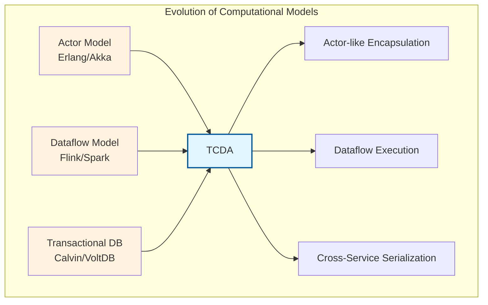
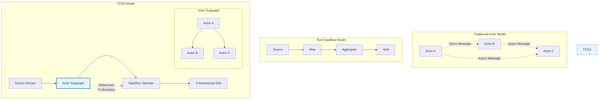
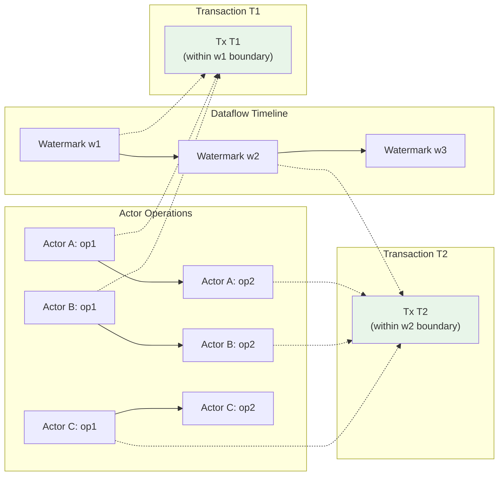
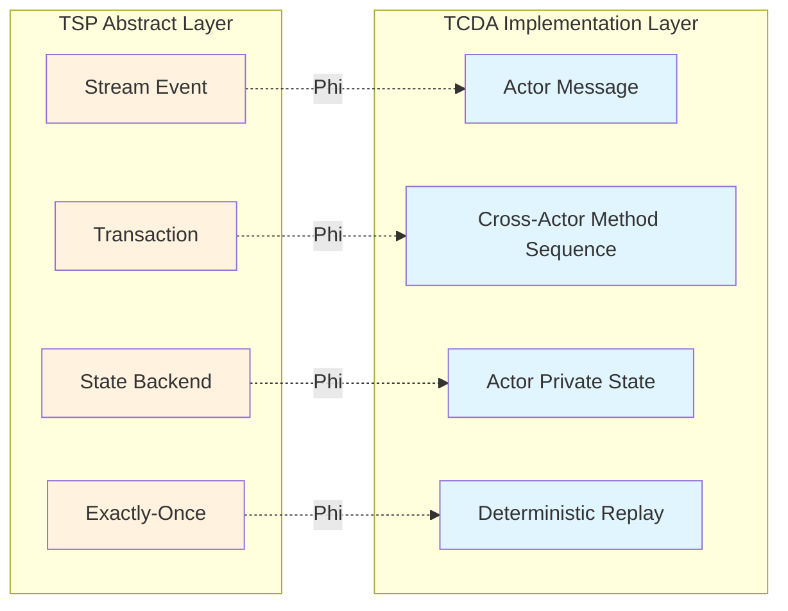

# Transactional Cloud Applications: Dataflow + Actor-like Programming

> **Stage**: Struct/06-frontier | **Prerequisites**: [01.03-actor-model-formalization.md](../01-foundation/01.03-actor-model-formalization.md), [01.04-dataflow-model-formalization.md](../01-foundation/01.04-dataflow-model-formalization.md), [../../Knowledge/06-frontier/transactional-stream-processing-deep-dive.md](../../Knowledge/06-frontier/transactional-stream-processing-deep-dive.md) | **Formalization Level**: L5-L6

---

## 1. Definitions

### Def-S-06-55: Transactional Cloud Dataflow Actor (TCDA) Computational Model

**Definition**: Transactional Cloud Dataflow Actor (TCDA) is an emerging computational model for transactional cloud applications. Its core idea is to combine the incremental processing capability (stream processing semantics) of dataflow execution engines with the encapsulation, isolation, and message-passing semantics of actor-like / object-oriented programming models to support serializable transactions across service boundaries.

Formally, a TCDA system is a 7-tuple:

$$
\text{TCDA} = (\mathcal{A}, \mathcal{G}, \mathcal{T}, \Sigma, \delta, \mathcal{C}, \mathcal{W})
$$

Where:

- $\mathcal{A}$: Set of actors; each actor $a \in \mathcal{A}$ has a unique identifier, private state, and behavioral methods
- $\mathcal{G}$: Dataflow graph, $\mathcal{G} = (V, E)$; vertices $V$ correspond to actor method invocations or operators, edges $E$ correspond to event/message streams
- $\mathcal{T}$: Set of transactions; each transaction $T \in \mathcal{T}$ is a serializable execution path on $\mathcal{G}$
- $\Sigma$: Global state space, $\Sigma = \prod_{a \in \mathcal{A}} \text{State}(a) \times \text{StreamState}(\mathcal{G})$
- $\delta: \Sigma \times \mathcal{E} \to \Sigma$: State transition function mapping global state and input events to a new state
- $\mathcal{C}$: Set of consistency constraints defining integrity rules for cross-actor transactions
- $\mathcal{W}$: Watermark / time-progress mechanism used to define transaction boundaries under stream semantics

**Intuitive Explanation**: In traditional actor models, actors interact via asynchronous message passing, and transactionality is guaranteed at the application layer. In TCDA, actor method invocations and dataflow graph edges are both incorporated into a unified transaction framework—a transaction can span method invocations across multiple actors, and commit boundaries are defined via the dataflow watermark mechanism.

### Def-S-06-56: Actor-like Programming Semantic Boundary

**Definition**: The "actor-like" programming semantic boundary in TCDA refers to a programming abstraction that retains the core characteristics of traditional actor models (encapsulation, referential transparency, message passing) while explicitly introducing transaction control boundaries.

Formally, the semantic boundary of an actor-like entity $a$ is defined by the following 4-tuple:

$$
\text{Boundary}(a) = (\text{Encaps}(a), \text{Ref}(a), \text{Msg}(a), \text{Tx}(a))
$$

Where:

1. **Encapsulation** ($\text{Encaps}(a)$): The state $\sigma_a$ of actor $a$ can only be accessed and modified by $a$'s behavioral methods:
   $$
   \forall a' \neq a, \forall m \in \text{Methods}(a'): \text{modifies}(m) \cap \text{reads}(\sigma_a) = \emptyset
   $$

2. **Referential Transparency** ($\text{Ref}(a)$): Given the same message sequence, the actor produces the same behavioral effect (determinism guarantee):
   $$
   \forall \mu_1, \mu_2: \mu_1 = \mu_2 \Rightarrow \text{beh}(a, \mu_1) = \text{beh}(a, \mu_2)
   $$

3. **Message Passing** ($\text{Msg}(a)$): Inter-actor interaction occurs only via asynchronous messages, and message queues have FIFO semantics:
   $$
   \text{send}(a, a', m) \Rightarrow m \in \text{Queue}(a') \land \text{order}(\text{Queue}(a')) = \text{FIFO}
   $$

4. **Transaction Control** ($\text{Tx}(a)$): Actor method execution can be marked as part of a transaction, supporting two-phase commit for distributed transactions:
   $$
   \text{execute}(a, m) \in T \Rightarrow a \text{ registers as a participant in transaction } T
   $$

### Def-S-06-57: Dataflow + Actor Transaction Boundaries

**Definition**: In TCDA, transaction boundaries are defined by two complementary mechanisms—dataflow watermark boundaries provide **time-dimensional** coarse-grained partitioning, while actor method invocations provide **logical-dimensional** fine-grained operation units.

**Dataflow Transaction Boundary** (Stream Semantics):

$$
\text{TxBoundary}_{df}(w) = \{ e \in \mathcal{E} \mid \text{timestamp}(e) \leq w \}
$$

That is, all events before watermark $w$ constitute a committable batch.

**Actor Transaction Boundary** (Method Semantics):

$$
\text{TxBoundary}_{actor}(T) = \{ m_i(a_i) \mid a_i \in \text{Participants}(T) \land m_i \text{ executes in the context of } T \}
$$

**Unified Transaction Boundary**: A TCDA transaction is an operation set that simultaneously satisfies both dataflow and actor boundaries:

$$
\text{TxBoundary}_{TCDA}(T) = \text{TxBoundary}_{df}(w_T) \cap \bigcup_{a \in \text{Participants}(T)} \text{TxBoundary}_{actor}(T, a)
$$

Where $w_T$ is the commit watermark of transaction $T$.

### Def-S-06-58: Serializability Across Services

**Definition**: Cross-service serializability means that the execution history of concurrent transactions in a TCDA system is equivalent to some serial execution history, even when these transactions involve actors distributed across different services (or different actor hosts).

Formally, let $H$ be the concurrent execution history of a TCDA system, and $T_i \in H$ be transactions. $H$ satisfies cross-service serializability iff there exists a serial history $H_{serial}$ such that:

$$
H \equiv_{sr} H_{serial}
$$

Where $\equiv_{sr}$ is the conflict equivalence relation: two histories agree on the order of conflicting operations (read-write, write-write).

**TCDA Serializability Condition**: For transactions involving actors across multiple services, the system must ensure:

1. **Global Ordering**: All cross-service transactions have a unique order in the global transaction log
2. **Local Consistency**: Transaction execution within each service is consistent with its position in the global order
3. **Watermark Monotonicity**: If transaction $T_1$ precedes $T_2$ in the global order, then $w_{T_1} \leq w_{T_2}$

### Def-S-06-59: Semantic Mapping between TCDA and TSP

**Definition**: There exists a structural mapping between TCDA and Transactional Stream Processing (TSP). TCDA can be viewed as an instantiation of TSP on actor-like programming abstractions.

The mapping is as follows:

| TSP Concept | TCDA Corresponding Concept | Mapping Description |
|-------------|---------------------------|---------------------|
| Stream event ($e \in E$) | Actor message ($m \in \text{Msg}(a)$) | Message is event, triggering actor behavior |
| Transaction ($T \in \mathcal{T}$) | Cross-actor method call sequence | One transaction contains operations of multiple actors |
| Global sequencer | Dataflow source operator / watermark | Watermark drives global ordering |
| State backend | Actor private state | Actor state is transaction state |
| Exactly-once semantics | Actor referential transparency + transaction boundary | Deterministic replay guarantees exactly-once |

Formal mapping function:

$$
\Phi_{TSP\to TCDA}: TSP \to TCDA
$$

Where:

- $\Phi_{TSP\to TCDA}(E) = \bigcup_{a \in \mathcal{A}} \text{Msg}(a)$ (message streams of all actors)
- $\Phi_{TSP\to TCDA}(T) = \langle m_1(a_1), m_2(a_2), ..., m_k(a_k) \rangle$ (transaction mapped to message sequence)
- $\Phi_{TSP\to TCDA}(\mathcal{G}) = \mathcal{G}_{TCDA}$ (dataflow graph directly inherited)

---

## 2. Properties

### Lemma-S-06-20: Actor Encapsulation Guarantees Local Serializability

**Lemma**: In TCDA, due to actor encapsulation (Def-S-06-56), transaction execution within a single actor naturally satisfies serializability.

**Proof**:

Let actor $a$ participate in two concurrent transactions $T_1$ and $T_2$. Since $\text{Encaps}(a)$ requires that $a$'s state can only be accessed by $a$'s methods, and actor method execution is sequential in implementation (single-threaded event loop model), operations of $T_1$ and $T_2$ on $a$ must execute in some total order.

Let this total order be $\langle op_1, op_2, ..., op_n \rangle$. Since $a$'s methods are atomic (in actor semantics), this total order itself is a serial history. Therefore, the execution of $T_1$ and $T_2$ on $a$ is serializable. $\square$

### Prop-S-06-20: Watermark Monotonicity Implies Global Transaction Order

**Proposition**: If the watermark advancement in a TCDA system satisfies monotonicity, and transaction commits are aligned with watermarks (Def-S-06-57), then the global order of committed transactions is consistent with the watermark order.

**Formal Statement**:

$$
\forall T_1, T_2 \in \mathcal{T}: \text{committed}(T_1) \land \text{committed}(T_2) \land w_{T_1} < w_{T_2} \Rightarrow T_1 \prec_{global} T_2
$$

Where $\prec_{global}$ is the global transaction order.

**Proof Sketch**:

1. According to Def-S-06-57, the dataflow boundary of transaction $T$ is $\text{TxBoundary}_{df}(w_T)$
2. Watermark monotonicity guarantees $w_{T_1} < w_{T_2} \Rightarrow \text{TxBoundary}_{df}(w_{T_1}) \subset \text{TxBoundary}_{df}(w_{T_2})$
3. When a transaction commits, all its events have been processed, and the system will not roll back to a smaller watermark
4. Therefore, the commit of $T_1$ must precede that of $T_2$, i.e., $T_1 \prec_{global} T_2$. $\square$

### Lemma-S-06-21: Sufficient Condition for Cross-Service Serializability

**Lemma**: If a TCDA system satisfies the following conditions, then all transaction histories satisfy cross-service serializability (Def-S-06-58):

1. Internal actor execution is serializable (Lemma-S-06-20)
2. Cross-actor transactions are coordinated via two-phase commit (2PC) or deterministic ordering protocols
3. Watermark monotonicity holds (Prop-S-06-20)

**Proof Sketch**:

1. Internal actor serializability provides the "local serializability" foundation
2. 2PC or deterministic ordering ensures a total order for cross-actor transactions globally
3. Watermark monotonicity guarantees that this global order is consistent with time progression
4. According to serializability theory, if each participant's local history is serializable and the global coordination protocol ensures consistent conflict ordering across transactions, then the global history is serializable
5. Therefore, the TCDA system satisfies cross-service serializability. $\square$

---

## 3. Relations

### TCDA and Existing Computational Models



### TCDA and the Actor Model

TCDA inherits the following core characteristics from the actor model:

- **Location Transparency**: Actor identifiers are decoupled from physical locations, supporting cross-service migration
- **Failure Isolation**: Failure of one actor does not affect others (unless explicit supervision relationship exists)
- **Message-Driven**: All computation is triggered by message arrival

However, TCDA makes key extensions to the actor model:

- **Transactional Message Passing**: Traditional actor messages are "fire-and-forget"; TCDA supports transactional messages where message delivery and receipt become part of the transaction
- **Deterministic Replay**: TCDA requires actor behavior to satisfy referential transparency (Def-S-06-56) to support deterministic recovery after failures

### TCDA and the Dataflow Model

TCDA embeds actors into dataflow graphs in two ways:

1. **Actor-as-Operator**: Each actor instance corresponds to an operator in the dataflow graph; actor method invocations correspond to operator processing logic
2. **Actor-as-Graph**: Multiple actors form a subgraph; internal interaction within the subgraph occurs via message passing, while the subgraph connects externally via dataflow edges

```
Dataflow Graph View:
┌─────────────────────────────────────────────────────────────┐
│  Source ──► [Actor Subgraph] ──► [Aggregator Operator] ──► Sink  │
│             ┌─────────┐   ┌─────────┐                      │
│             │ Actor A │──►│ Actor B │                      │
│             └────┬────┘   └─────────┘                      │
│                  │                                         │
│             ┌────┴────┐                                    │
│             │ Actor C │                                    │
│             └─────────┘                                    │
│                                                            │
│  Subgraph Internal: Message Passing (Actor Semantics)      │
│  Subgraph External: Dataflow Edges (Dataflow Semantics)    │
└─────────────────────────────────────────────────────────────┘
```

### Deep Connection between TCDA and TSP

TCDA can be viewed as a **programming-model-level implementation** of TSP. In Knowledge/06-frontier/transactional-stream-processing-deep-dive.md, TSP is defined as "a distributed computing paradigm that combines the event-driven characteristics of stream processing with the ACID guarantees of transactions." TCDA provides concrete programming interfaces for this paradigm through actor-like abstractions:

- TSP's "stream-native transaction boundary" corresponds to TCDA's watermark-driven transaction boundary
- TSP's "deterministic execution" corresponds to TCDA's actor referential transparency
- TSP's "cross-entity consistency" corresponds to TCDA's cross-service serializability

**Key Insight**: TCDA answers an open question in TSP research—how to provide developers with an intuitive transactional programming model while maintaining the high throughput and low latency characteristics of stream processing. Actor-like object-oriented abstractions are precisely the bridge connecting low-level stream execution with high-level business logic.

---

## 4. Argumentation

### 4.1 Why Dataflow + Actor-like Is the Right Direction for Transactional Cloud Applications

**Problem Background**: Traditional cloud application transaction processing faces a dilemma:

1. **Relational Database Approach**: Strong consistency but poor scalability, unsuitable for high-concurrency streaming scenarios
2. **NoSQL + Application-level Compensation Approach**: High scalability but weak transaction semantics, complex consistency guarantees
3. **Pure Dataflow Approach**: High throughput and low latency but low-level programming model, difficult transaction control

**TCDA Argumentation Framework**:

| Dimension | Relational DB | Pure Dataflow | TCDA |
|-----------|---------------|---------------|------|
| Transaction Guarantee | Strong (ACID) | Weak (Sink-level) | Strong (Cross-actor 2PC) |
| Scalability | Primarily vertical | Excellent horizontal | Excellent horizontal |
| Programming Model | SQL / ORM | Operator Graph | Actor-like OO |
| Latency | Medium-High | Low | Low-Medium |
| Fault Recovery | Log Replay | Checkpoint | Deterministic Replay |

**Core Argument**: Transactional cloud applications (e.g., real-time financial risk control, online game state synchronization, IoT device orchestration) have the following characteristics:

1. **Event-Driven**: System behavior is triggered by external events, naturally suitable for the dataflow model
2. **Stateful**: Requires maintaining large amounts of entity state; the actor model provides ideal state encapsulation
3. **Consistency Requirements**: Cross-entity operations require transaction guarantees; cannot rely solely on eventual consistency
4. **Service Boundaries**: Modern cloud applications consist of multiple microservices; transactions need to span service boundaries

Dataflow provides event processing and horizontal scalability; actor-like abstractions provide state encapsulation and programming friendliness; the combination plus 2PC/watermark provides transaction guarantees—this is the design philosophy of TCDA.

### 4.2 Academic Background from CIDR 2025

Multiple papers at CIDR 2025 point to the same trend: merging declarative dataflow execution with imperative/object-oriented programming models. Representative directions include:

1. **Styx** (Deterministic Stream Analysis + Transactions): Demonstrated the feasibility of watermark as transaction boundary
2. **SFaaS** (Stateful Functions as a Service): Proved that actor-like functions can participate in distributed transactions
3. **Emerging TCDA Proposals**: Unified actor mailbox semantics with dataflow window semantics, proposing "Transactional Actor Streams"

**Academic Consensus**: Future transactional cloud application platforms will no longer have to choose between "strong consistency" and "high scalability"; both can be achieved through programming model innovation and protocol optimization. TCDA represents the formal foundation of this direction.

### 4.3 Boundaries and Controversies

**Controversy 1: Does actor asynchronous message passing conflict with transaction synchronous commit semantics?**

**Response**: In TCDA, ordinary actor messages retain asynchronous semantics, but **transactional messages** are invisible to other transactions before commit. This is similar to "read uncommitted" isolation control in databases—within a transaction, interactions can be asynchronous, but at transaction boundaries, synchronous commit is enforced.

**Controversy 2: Is watermark as transaction boundary too coarse-grained?**

**Response**: Watermark provides the **external visibility boundary** (when a transaction becomes visible to other readers), not the **internal operation boundary**. Actor method invocations within a transaction can interleave at fine granularity; only at watermark advancement is a unified commit/rollback decision made. For scenarios requiring finer-grained transactions, sub-watermarks or explicit transaction markers can be introduced.

---

## 5. Proof / Engineering Argument

### Thm-S-06-20: TCDA Cross-Service Serializability Theorem

**Theorem**: In a correctly implemented TCDA system, the execution history of all concurrent transactions satisfies cross-service serializability (Def-S-06-58).

**Formal Statement**:

Let $H$ be any valid concurrent execution history of a TCDA system; then:

$$
\exists H_{serial}: H \equiv_{sr} H_{serial}
$$

Where $H_{serial}$ is a serial history (i.e., transactions execute in some total order).

**Proof**:

**Step 1: Define Global Transaction Order**

According to Prop-S-06-20, watermark monotonicity guarantees that committed transactions are totally ordered by watermark. For transactions with the same watermark, a total order is assigned by the global transaction coordinator (2PC coordinator or deterministic sequencer). Therefore, all committed transactions have a global total order $\prec_{global}$.

**Step 2: Prove Conflict Equivalence**

Let $T_i$ and $T_j$ be two transactions with conflicting operations in history $H$ (i.e., $T_i$ and $T_j$ access the same actor state and at least one is a write operation).

According to Lemma-S-06-20, operations within each actor execute in total order. Therefore, for any shared actor $a$, the operation order of $T_i$ and $T_j$ on $a$ is consistent with the global order:

$$
T_i \prec_{global} T_j \Rightarrow \forall op_i \in T_i|_a, op_j \in T_j|_a: op_i \prec_a op_j
$$

**Step 3: Construct Serial History**

Arrange all transactions by global order $\prec_{global}$ to obtain serial history $H_{serial}$. For any two transactions $T_i \prec_{global} T_j$, all operations of $T_i$ precede all operations of $T_j$ in $H_{serial}$.

Since Step 2 has proven that the order of conflicting operations is consistent with the global order, $H$ and $H_{serial}$ have the same order on conflicting operations, i.e., $H \equiv_{sr} H_{serial}$.

**Conclusion**: The TCDA system satisfies cross-service serializability. $\square$

### Thm-S-06-21: TCDA Exactly-Once Semantics Theorem

**Theorem**: In a TCDA system, if actors satisfy referential transparency (Def-S-06-56) and dataflow execution uses deterministic checkpoint recovery, then the system provides exactly-once processing semantics.

**Formal Statement**:

Let the input event sequence be $E = \langle e_1, e_2, ..., e_n \rangle$. After failure recovery, the system replays $E$. Let $\eta(E)$ be the state changes and outputs produced by the system for $E$. Then:

$$
\eta(E) \text{ is the same after first execution and after recovery replay}
$$

**Proof**:

1. **Actor Determinism**: According to $\text{Ref}(a)$, for any actor $a$, given the same message sequence, $a$'s behavioral effect is the same.

2. **Dataflow Determinism**: Dataflow graph execution is deterministic—given the same input stream and watermark, the output stream produced by operators (including actor-as-operator) is unique.

3. **Checkpoint Consistency**: The system periodically checkpoints the global state $\Sigma$. Upon failure recovery, the system restarts from the latest checkpoint and replays input events after that checkpoint.

4. **Compositional Determinism**: From Steps 1 and 2, the replayed event sequence necessarily leads to the same intermediate message stream and actor state evolution as the first execution. From Step 3, checkpoint recovery guarantees that the system starts replaying from a consistent global state.

5. **Exactly-Once**: Since execution is deterministic, the effect of each event takes effect exactly once—even if failure replay occurs, the final state is the same as failure-free execution, with neither duplicate processing nor omission.

$\square$

---

## 6. Examples

### 6.1 E-Commerce Order Processing: Cross-Actor Transaction

**Scenario**: When a user places an order, the states of inventory actor, order actor, and payment actor need to be updated simultaneously.

```python
# TCDA-style pseudocode
class InventoryActor:
    def __init__(self):
        self.stock = {}

    @transactional
    def deduct(self, item_id, quantity):
        if self.stock[item_id] >= quantity:
            self.stock[item_id] -= quantity
            return True
        return False

class OrderActor:
    def __init__(self):
        self.orders = {}

    @transactional
    def create_order(self, order_id, items):
        self.orders[order_id] = Order(items, status="PENDING")
        return order_id

class PaymentActor:
    def __init__(self):
        self.payments = {}

    @transactional
    def charge(self, order_id, amount):
        self.payments[order_id] = Payment(amount, status="CHARGED")
        return True

# Transaction coordination in Dataflow graph
class OrderPipeline:
    def process_order_event(self, event):
        # This transaction spans three actors
        with transaction(watermark=event.watermark) as tx:
            success = inventory_actor.deduct(event.item_id, event.qty)
            if success:
                order_id = order_actor.create_order(event.order_id, event.items)
                payment_actor.charge(order_id, event.amount)
                tx.commit()
            else:
                tx.rollback()
```

**Transaction Guarantees**:

- Either inventory deduction, order creation, and payment charging all succeed
- Or all fail; there will be no state where inventory is deducted but order is not created
- Watermark guarantees that the visibility of this transaction atomically switches within the event-time boundary

### 6.2 Real-Time Game State Synchronization

**Scenario**: In a multiplayer online game, player actions need to be synchronized to all clients in real time while ensuring state consistency.

```
┌─────────────────────────────────────────────────────────────┐
│                 Game State TCDA Architecture                 │
├─────────────────────────────────────────────────────────────┤
│                                                             │
│   Player Action Stream    Dataflow Graph    State Update    │
│   ┌─────────┐           ┌─────────────┐    ┌─────────┐     │
│   │ Move    │──────────►│ PlayerActor │───────►│ Client 1│     │
│   │ Attack  │           │   (P1)      │    ├─────────┤     │
│   │ UseItem │           ├─────────────┤    │ Client 2│     │
│   └─────────┘           │ PlayerActor │    ├─────────┤     │
│                         │   (P2)      │    │ Client 3│     │
│                         ├─────────────┤    └─────────┘     │
│                         │ WorldActor  │                    │
│                         │ (Shared State)│                   │
│                         └─────────────┘                    │
│                                                             │
│   Transaction Example: "Player P1 attacks P2"               │
│   1. P1 deducts MP (P1 Actor)                               │
│   2. P2 deducts HP (P2 Actor)                               │
│   3. World state records kill (WorldActor)                  │
│   4. All changes commit within the same watermark boundary  │
│                                                             │
└─────────────────────────────────────────────────────────────┘
```

### 6.3 IoT Device Orchestration

**Scenario**: In a smart home system, a scene trigger needs to coordinate actions across multiple device actors.

```python
class LightActor:
    @transactional
    def set_brightness(self, level):
        self.brightness = level

class ThermostatActor:
    @transactional
    def set_temperature(self, temp):
        self.target_temp = temp

class CurtainActor:
    @transactional
    def set_position(self, pos):
        self.position = pos

# "Arrive Home" scene as a transaction
def arrive_home_scene():
    with transaction() as tx:
        light_actor.set_brightness(80)
        thermostat_actor.set_temperature(22)
        curtain_actor.set_position(100)
        tx.commit()
```

---

## 7. Visualizations

### 7.1 TCDA Architecture Comparison



### 7.2 Transaction Boundary Visualization



### 7.3 TCDA-TSP Mapping Diagram



---

## 8. References


---

*Document Version: 1.0 | Created: 2026-04-14 | Status: Complete*

---

*Document Version: v1.0 | Created: 2026-04-18*
