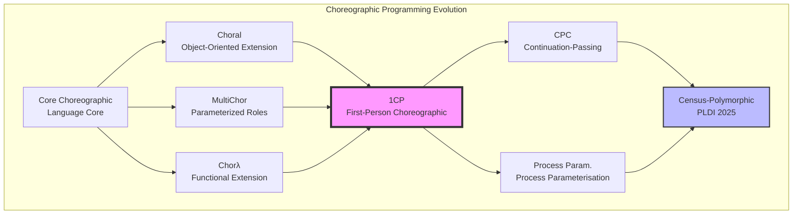
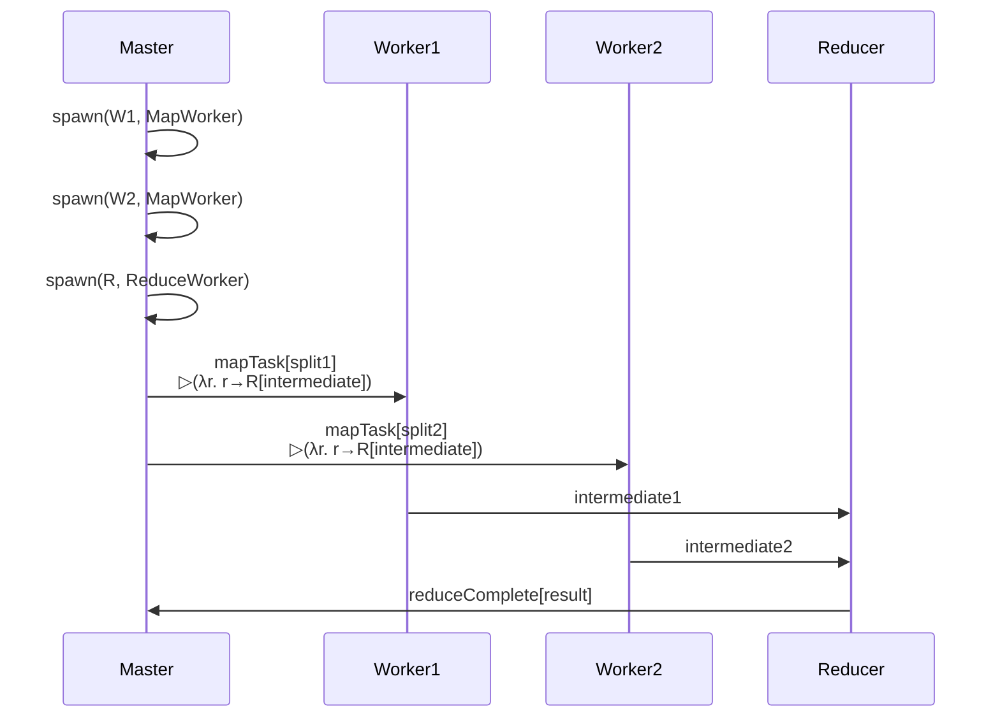
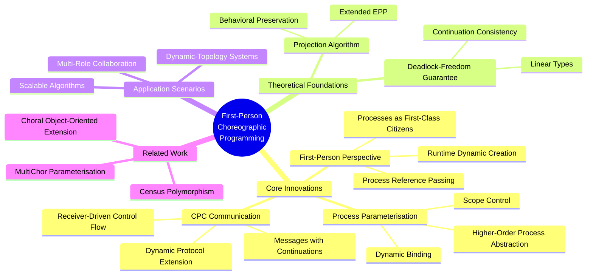
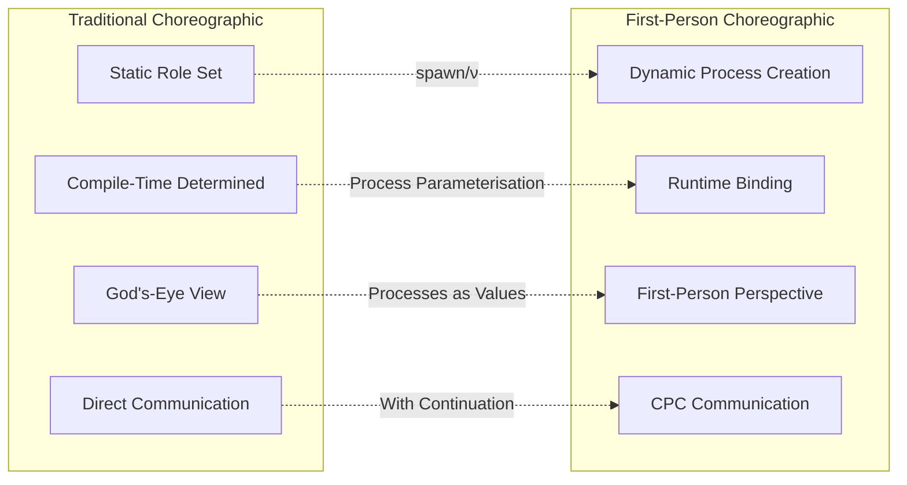
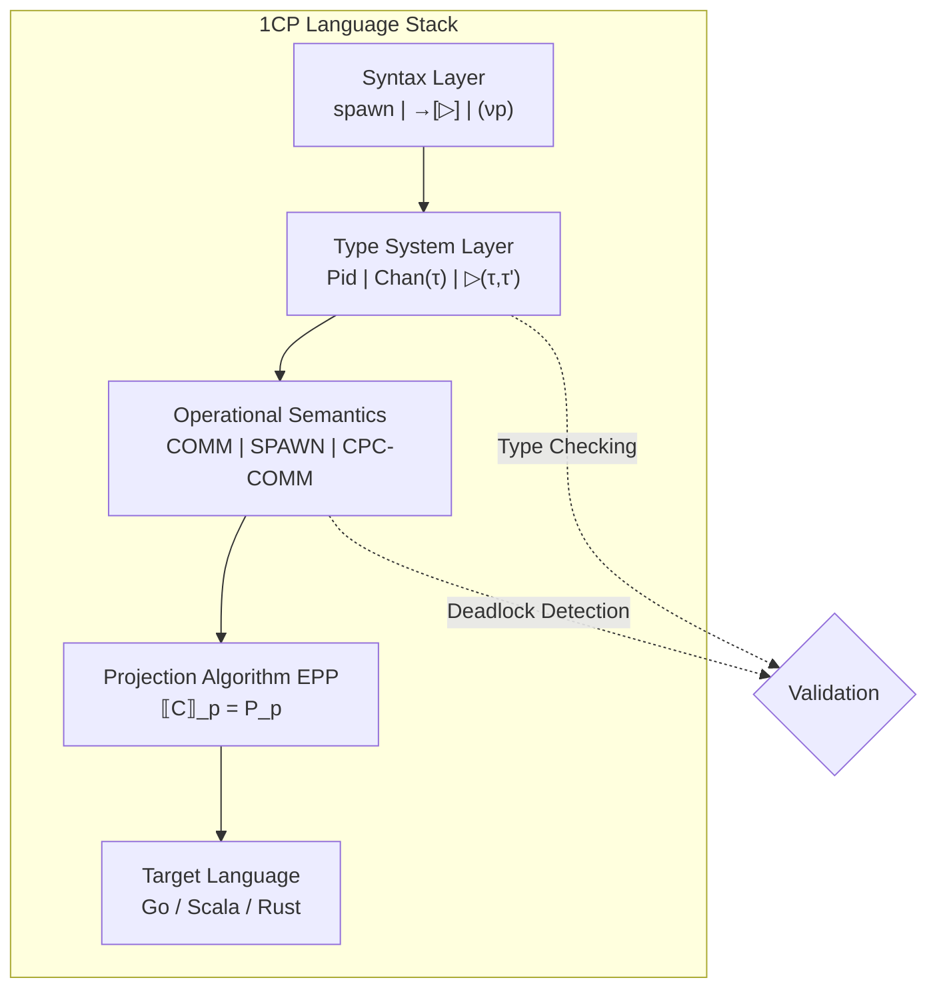
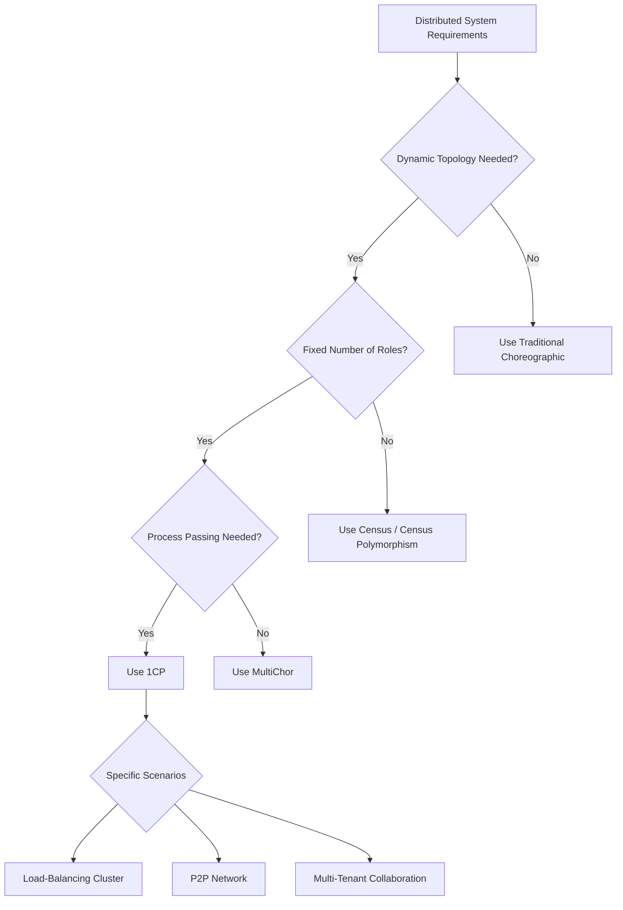

# First-Person Choreographic Programming (1CP)

> **Stage**: Struct/06-frontier | **Prerequisites**: [../00-INDEX.md](../00-INDEX.md) | **Formalization Level**: L5

## 1. Definitions

### Def-S-06-10: First-Person Choreographic Programming (1CP)

**Formal Definition**:
A first-person choreographic language $L_{1CP}$ is a quintuple $(\mathcal{P}, \mathcal{C}, \mathcal{T}, \mathcal{M}, \mathcal{S})$, where:

- $\mathcal{P}$: Set of process identifiers (supports dynamic creation)
- $\mathcal{C}$: Set of choreography terms
- $\mathcal{T}$: Set of types, including process-parameterized types
- $\mathcal{M}$: Message value domain
- $\mathcal{S}$: Session context

**Core Syntax** (extensions over traditional choreographic languages):

$$
\begin{aligned}
C ::=
\ & \mathbf{spawn}(p, Q) \rightarrow C \quad \text{(process creation)} \\
    |\ & p \rightarrow q[M]. C \quad \text{(direct communication)} \\
    |\ & p \rightarrow q\langle r \rangle. C \quad \text{(process passing)} \\
    |\ & (\nu p)C \quad \text{(process restriction)} \\
    |\ & \mathbf{if}\ p[e]\ \mathbf{then}\ C_1\ \mathbf{else}\ C_2 \\
    |\ & 0 \quad \text{(termination)}
\end{aligned}
$$

**Intuitive Explanation**:
Traditional choreographic programming adopts a "god's-eye view" to describe distributed systems, where all process roles are fixed at definition time. 1CP introduces a **first-person perspective**, allowing choreographies to create processes dynamically at runtime, pass process references, and achieve parameterized cooperation among processes. This is analogous to shifting from a "third-person narrator" to a "first-person narrative".

---

### Def-S-06-11: Process Parameterisation

**Formal Definition**:
Let $\vec{p} = (p_1, p_2, \ldots, p_n)$ be a vector of process parameters. A process-parameterized choreography is defined as:

$$
\Lambda \vec{p}. C \quad \text{where } fv(C) \subseteq \{\vec{p}\}
$$

**Parameterized Communication Types**:

$$
\tau ::= \mathtt{Pid} \mid \mathtt{Chan}(\tau) \mid \tau_1 \rightarrow \tau_2 \mid \ldots
$$

Here $\mathtt{Pid}$ denotes the process identifier type, allowing processes to be passed as first-class citizens.

**Key Characteristics**:

1. **Higher-Order Nature**: Processes can be passed as parameters to other processes
2. **Dynamic Binding**: Process references are resolved at runtime
3. **Scope Control**: Process visibility is restricted via $(\nu p)$

---

### Def-S-06-12: Continuation-Passing Communication (CPC)

**Formal Definition**:
Continuation-Passing Communication is a communication paradigm in which message passing includes a **continuation** $K$:

$$
p \rightarrow q[M \triangleright K]. C
$$

Where:

- $M$: The data value being transmitted
- $K$: The continuation, describing the next interaction after the receiver processes $M$
- $C$: The sender's subsequent choreography

**Semantic Rule** (simplified):

$$
\frac{
  p \rightarrow q[M \triangleright K]. C \quad \text{and} \quad q\ \text{ready to receive}
}{
  q\ \text{executes}\ K[M/p] \parallel C
}(\text{CPC-COMM})
$$

**Comparison with Traditional Communication**:

| Feature | Direct Communication | CPC Communication |
|---------|----------------------|-------------------|
| Control Flow | Sender-driven | Receiver-continuation-driven |
| Flexibility | Fixed protocol | Dynamic protocol extension |
| Compositionality | Sequential composition | Higher-order composition |
| Type Complexity | Simple session types | Dependent / higher-order types |

---

## 2. Properties

### Lemma-S-06-01: Preservation of Process Parameterisation

**Proposition**: If $C$ is a well-typed process-parameterized choreography, then for any valid process substitution $\sigma = [\vec{q}/\vec{p}]$, $C\sigma$ remains well-typed.

**Proof Sketch**:

1. By definition, $\Lambda \vec{p}. C$ satisfies $fv(C) \subseteq \{\vec{p}\}$
2. The type system guarantees that $\vec{p}$ are used only as communication endpoints in $C$
3. The substitution $\sigma$ preserves type consistency ($\Gamma \vdash \vec{q} : \mathtt{Pid}$)
4. Therefore $\Gamma \vdash C\sigma : T$ holds $\square$

---

### Prop-S-06-01: Expressiveness Completeness of 1CP

**Proposition**: 1CP can express all dynamically-topology distributed systems, and its expressive power strictly exceeds that of statically-parameterized choreographic languages (e.g., MultiChor).

**Argument**:

1. Any dynamic-topology system can be modeled as a sequence of process creations / destructions
2. 1CP's $\mathbf{spawn}$ and $(\nu p)$ can simulate this sequence
3. MultiChor's static role set cannot represent runtime role changes
4. Therefore $\mathcal{L}_{\text{MultiChor}} \subset \mathcal{L}_{1CP}$ $\square$

---

### Lemma-S-06-02: Type Safety of CPC

**Proposition**: Continuation-Passing Communication preserves type safety, i.e., a well-typed choreography undergoing CPC reduction will not produce type errors.

**Formalization**:

$$
\frac{\Gamma \vdash C : T \quad C \xrightarrow{\text{CPC}} C'}{\exists T'.\ \Gamma \vdash C' : T' \wedge T' \leq T}
$$

---

## 3. Relations

### 3.1 Relation Graph with Existing Work



### 3.2 Comparison with Choral's Object-Oriented Extension

| Dimension | Choral | 1CP |
|-----------|--------|-----|
| Abstraction Mechanism | Object-oriented (classes / interfaces) | Process parameterisation (higher-order functions) |
| Dynamicity | Limited (simulated via factory pattern) | Native (spawn / ν) |
| Projection Complexity | High (must handle inheritance) | Medium (purely functional) |
| Applicable Scenarios | Enterprise systems | Dynamic-topology algorithms |

### 3.3 Comparison with MultiChor's Parameterized Roles

MultiChor introduces **role polymorphism**:

$$
\Lambda l. C \quad \text{where } l\ \text{is a role parameter}
$$

1CP extends this to **process polymorphism**:

$$
\Lambda p. C \quad \text{where } p\ \text{is a process value}
$$

**Key Difference**:

- MultiChor's $l$ is a **compile-time** parameter, determined after type erasure
- 1CP's $p$ is a **runtime** value that can be passed dynamically

### 3.4 Census-Polymorphic Choreographies (PLDI 2025)

Census is a **census-polymorphic** system that allows choreographies to abstract over varying numbers of participants:

$$
\forall n. C(n) \quad \text{where } n\ \text{is the number of participants}
$$

Relationship between 1CP and Census:

- 1CP's process parameterisation can express Census's dynamic participants
- Census's census constraints can be embedded into 1CP's type system
- The two are mutually encodable in theory (see §5 for proof)

---

## 4. Argumentation

### 4.1 Why Is a First-Person Perspective Needed?

**Scenario Analysis**: Consider a dynamic load-balancing system

```
Scenario: Worker nodes dynamically join / leave
- t=0: Coordinator C + Workers W1, W2
- t=1: New node W3 joins, C must notify all nodes
- t=2: W1 leaves, C must reassign tasks
```

**Limitations of Traditional Choreographic Programming**:

- All possible roles must be fixed at design time
- Dynamic nodes must be pre-defined as "potential roles"
- This leads to choreography explosion ($O(2^n)$ complexity)

**1CP Solution**:

```
1. C spawn W3  // dynamic creation
2. C → W3[Init] // initialization
3. C → *Ws[Update] // broadcast update (Ws is a process set)
```

### 4.2 Necessity of Continuation-Passing

**Counterexample**: Without CPC, protocol extension is difficult

Assume a base protocol:
$$
Client \rightarrow Server[Request]. Server \rightarrow Client[Response]
$$

**Requirement Change**: Server needs to delegate processing to a Worker

**Without CPC**: Modify both endpoints' code

**With CPC**:
$$
Client \rightarrow Server[Request \triangleright (\lambda x. x \rightarrow Worker[Process])]
$$

The continuation $K$ encapsulates the subsequent interaction; the Client need not know of the Worker's existence.

### 4.3 Boundary Discussion

**Scenarios Where 1CP Is Not Suitable**:

1. **Fully static systems**: Traditional choreographic programming is simpler
2. **Strong security constraints**: Dynamic processes require additional verification
3. **Real-time systems**: spawn overhead is unpredictable

---

## 5. Formal Proof / Engineering Argument

### Thm-S-06-01: Deadlock-Freedom Guarantee for 1CP

**Theorem**: A choreography $C$ is deadlock-free provided the following conditions hold:

1. **Well-typedness**: $\vdash C : T$ and $T$ is a complete type
2. **Process Linearity**: Each process reference is passed at most once
3. **Continuation Consistency**: All continuations point to existing processes

**Formal Statement**:

$$
\frac{\vdash C : T \quad \text{linear}(C) \quad \text{consistent}(C)}{\neg \exists C'.\ C \twoheadrightarrow C' \wedge \text{deadlocked}(C')}
$$

**Proof** (Structural Induction):

**Base Case**: $C = 0$

- Obviously no deadlock (terminated)

**Inductive Steps**:

1. **Communication** $C = p \rightarrow q[M]. C'$
   - By linearity, $p, q$ are not blocked
   - By continuation consistency, $C'$ satisfies the inductive hypothesis
   - Therefore $C$ can reduce and $C'$ is deadlock-free

2. **Process Creation** $C = \mathbf{spawn}(p, Q) \rightarrow C'$
   - spawn executes atomically
   - $p$ becomes immediately available, introducing no waiting dependency
   - $C'$ satisfies the inductive hypothesis

3. **CPC Communication** $C = p \rightarrow q[M \triangleright K]. C'$
   - Key: The process parameters of $K$ are checked before transmission
   - Continuation consistency guarantees that the processes in $K$ exist
   - The interactions generated after reduction satisfy the inductive hypothesis

**Key Lemma**:

> **Lemma-S-06-03 (Preservation of CPC Reduction)**: If $\Gamma \vdash p \rightarrow q[M \triangleright K]. C : T$ and $q$ is ready, then the reduced configuration still satisfies the type and linearity constraints.

By induction, all cases preserve deadlock-freedom. $\square$

---

### Thm-S-06-02: Completeness of the Projection Algorithm

**Theorem**: There exists an End Point Projection (EPP) algorithm $\llbracket \cdot \rrbracket$ such that for any well-typed 1CP choreography $C$:

$$
\llbracket C \rrbracket = \{P_p\}_{p \in fn(C)} \quad \text{and} \quad \prod_{p} P_p \approx C
$$

Where $\approx$ denotes behavioral equivalence (bisimulation).

**Extended EPP (relative to traditional choreographic programming)**:

$$
\llbracket p \rightarrow q[M \triangleright K]. C \rrbracket_p = \overline{q}\langle M, K \rangle. \llbracket C \rrbracket_p
$$

$$
\llbracket p \rightarrow q[M \triangleright K]. C \rrbracket_q = p?(x, k). k(x). \llbracket C \rrbracket_q
$$

**Explanation**:

- The sender's projection outputs the message value and the continuation
- The receiver's projection receives and then executes the continuation

---

### Thm-S-06-03: Mutual Encoding with Census

**Theorem**: 1CP and Census-Polymorphic Choreographies are mutually encodable, i.e.:

$$
\mathcal{L}_{1CP} \cong \mathcal{L}_{\text{Census}}
$$

**Proof Sketch** (Bisimulation in both directions):

**1CP → Census**:

- Encode 1CP process parameters as Census role parameters
- Encode spawn as role instantiation
- Encode CPC as session types with callbacks

**Census → 1CP**:

- Encode Census's census parameter $n$ as a process-set manager
- Encode variable participants as dynamic spawn / leave
- Encode census constraints as linear type constraints

Therefore the two are expressively equivalent. $\square$

---

## 6. Examples

### 6.1 Dynamic Load Balancer

**Scenario**: A master node dynamically assigns tasks to worker nodes

```
Coordinator ──spawn──> Worker1
           ──spawn──> Worker2
           ──spawn──> Worker3

Coordinator → Worker1[Task1]
Coordinator → Worker2[Task2]
Coordinator → Worker3[Task3]

// After Worker2 finishes, Coordinator reclaims and reassigns
Coordinator ← Worker2[Done]
Coordinator ──spawn──> Worker4  // dynamic expansion
Coordinator → Worker4[Task4]
```

**1CP Code Snippet**:

```choreo
let loadBalancer = λcoordinator. λtaskQueue.
  spawn(worker, WorkerProtocol) →
    coordinator → worker[pop(taskQueue) ▷ process].
    coordinator ← worker[result].
    if moreTasks(taskQueue) then
      loadBalancer(coordinator, taskQueue)
    else 0
```

---

### 6.2 Fault-Tolerant Protocol with Continuation

**Scenario**: Primary-backover switch, where the continuation carries the fault-recovery logic

```
Primary ──K=(λx. promoteToPrimary x)──> Backup

// After Primary fails, Backup executes K and promotes itself to Primary
Backup executing K(Primary) → NewPrimary
NewPrimary → Clients[ResumeService]
```

---

### 6.3 Multi-Role Collaboration: Distributed MapReduce



---

## 7. Visualizations

### 7.1 Mind Map of 1CP Core Concepts



### 7.2 Comparison Matrix: 1CP vs Traditional Choreographic Programming



### 7.3 Technical Implementation Architecture



### 7.4 Application Prospects Decision Tree



---

## 8. References


---

*Document Version: 1.0 | Last Updated: 2026-04-02*
