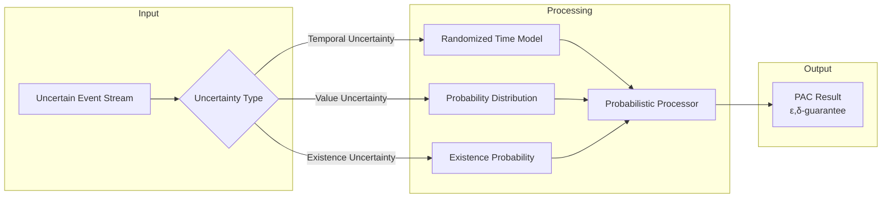

# Formal Semantics of Probabilistic Stream Processing

> **Stage**: Struct/06-frontier/probabilistic-streaming | **Prerequisites**: [01.01-unified-streaming-theory.md](../../01-foundation/01.01-unified-streaming-theory.md), [02.01-determinism-in-streaming.md](../../02-properties/02.01-determinism-in-streaming.md) | **Formality Level**: L5-L6
> **Document Status**: v1.0 | **Created**: 2026-04-13

---

## Table of Contents

- [Formal Semantics of Probabilistic Stream Processing](#formal-semantics-of-probabilistic-stream-processing)
  - [Table of Contents](#table-of-contents)
  - [1. Definitions](#1-definitions)
    - [Def-S-06-PS-01: Probabilistic Event Stream](#def-s-06-ps-01-probabilistic-event-stream)
    - [Def-S-06-PS-02: Randomized Processor](#def-s-06-ps-02-randomized-processor)
    - [Def-S-06-PS-03: Probabilistic Time Model](#def-s-06-ps-03-probabilistic-time-model)
    - [Def-S-06-PS-04: Probably Approximately Correct (PAC) Semantics](#def-s-06-ps-04-probably-approximately-correct-pac-semantics)
  - [2. Properties](#2-properties)
    - [Prop-S-06-PS-01: Probabilistic Watermark Monotonicity](#prop-s-06-ps-01-probabilistic-watermark-monotonicity)
    - [Prop-S-06-PS-02: Randomized Approximate Consistency](#prop-s-06-ps-02-randomized-approximate-consistency)
  - [3. Relations](#3-relations)
    - [Relation: Embedding of Probabilistic Streams into Deterministic Streams](#relation-embedding-of-probabilistic-streams-into-deterministic-streams)
    - [Relation: Sampling Theorem and Stream Processing](#relation-sampling-theorem-and-stream-processing)
  - [4. Argumentation](#4-argumentation)
    - [Argument: Practical Value of Approximate Correctness](#argument-practical-value-of-approximate-correctness)
    - [Argument: Randomization and Performance Trade-offs](#argument-randomization-and-performance-trade-offs)
  - [5. Proofs](#5-proofs)
    - [Thm-S-06-PS-01: Probabilistic Checkpoint Correctness](#thm-s-06-ps-01-probabilistic-checkpoint-correctness)
    - [Thm-S-06-PS-02: Error Bounds for Sampling Aggregation](#thm-s-06-ps-02-error-bounds-for-sampling-aggregation)
  - [6. Examples](#6-examples)
    - [Example 1: Approximate Counting (HyperLogLog)](#example-1-approximate-counting-hyperloglog)
    - [Example 2: Randomized Sampling Window](#example-2-randomized-sampling-window)
    - [Example 3: Monte Carlo Stream Analysis](#example-3-monte-carlo-stream-analysis)
  - [7. Visualizations](#7-visualizations)
    - [Probabilistic Stream Processing Architecture](#probabilistic-stream-processing-architecture)
    - [Accuracy-Resource Trade-off Curve](#accuracy-resource-trade-off-curve)
  - [8. References](#8-references)

---

## 1. Definitions

### Def-S-06-PS-01: Probabilistic Event Stream

**Definition (Probabilistic Event Stream)**:

A probabilistic event stream is a stream data abstraction with uncertainty measures:

$$
\mathcal{S}_{prob} ::= (T, V, P, \mathcal{D})
$$

| Component | Type | Semantics |
|-----------|------|-----------|
| $T$ | $\mathbb{R}^+$ | Timestamp (can be a random variable) |
| $V$ | $\mathcal{V}$ | Value domain (can carry probability distributions) |
| $P$ | $[0,1]$ | Event confidence / existence probability |
| $\mathcal{D}$ | $Distribution$ | Probability distribution of values |

**Probabilistic Stream Representation**:

For the stream state at time $t$:

$$
\mathcal{S}(t) = \{(v_i, p_i, \sigma_i) | v_i \in V, p_i \in [0,1], \sigma_i \sim \mathcal{D}_i\}
$$

Where $p_i$ denotes the existence probability of the event, and $\sigma_i$ denotes the value uncertainty.

**Uncertainty Propagation**:

For processor $f: \mathcal{S}_{in} \to \mathcal{S}_{out}$:

$$
P_{out}(y) = \int_{x \in f^{-1}(y)} P_{in}(x) \cdot J_f(x) \, dx
$$

Where $J_f$ is the Jacobian determinant of $f$ (for differentiable transformations).

---

### Def-S-06-PS-02: Randomized Processor

**Definition (Randomized Processor)**:

A randomized processor is a computation unit with internal randomness:

$$
\mathcal{P}_{rand} ::= (f_{det}, \xi, \Omega, \Rightarrow_p)
$$

Where:

- $f_{det}$: Deterministic computation core
- $\xi \sim \Omega$: Random seed / noise source
- $\Rightarrow_p$: Probabilistic transition relation

**Probabilistic Transition Semantics**:

$$
\frac{s \xrightarrow{\xi} s' \quad \xi \sim \Omega}{s \Rightarrow_p s'} \quad \text{where } p = \mathbb{P}(\xi)
$$

**Processor Types**:

```
RandomProcessor
├── MonteCarloSampler    # Monte Carlo sampling
├── SketchAggregator     # Probabilistic sketch aggregation
├── RandomizedAlgorithm  # Randomized algorithms (e.g., reservoir sampling)
└── ProbabilisticML      # Probabilistic machine learning inference
```

---

### Def-S-06-PS-03: Probabilistic Time Model

**Definition (Randomized Time)**:

In probabilistic stream processing, timestamps can be random variables:

$$
\tau: \Omega \to \mathbb{R}^+
$$

**Arrival Process Models**:

- **Poisson Process**: $N(t) \sim Poisson(\lambda t)$
- **Compound Poisson**: Batch arrivals
- **Renewal Process**: General inter-arrival distribution
- **Markov-Modulated**: Rate changes with state

**Randomized Extension of Watermark**:

$$
\mathcal{W}(t) = \min(\tau_{observed}) - \epsilon_{confidence}
$$

Where $\epsilon_{confidence}$ is a safety margin accounting for uncertainty:

$$
\epsilon = F^{-1}_{\tau}(1 - \delta)
$$

$F^{-1}$ is the quantile function, and $\delta$ is the upper bound on the probability of late events.

---

### Def-S-06-PS-04: Probably Approximately Correct (PAC) Semantics

**Definition (PAC Stream Processing)**:

Probably Approximately Correct (PAC) semantics provides probabilistic guarantees for stream processing results:

$$
\mathbb{P}(|Result_{approx} - Result_{true}| \leq \epsilon) \geq 1 - \delta
$$

**Parameter Description**:

- $\epsilon$: Approximation error bound
- $\delta$: Failure probability bound
- $1-\delta$: Confidence level

**Extension to Stream Processing**:

For the result of stream query $Q$ over time window $W$:

$$
\forall t. \; \mathbb{P}(|\hat{Q}(\mathcal{S}_{[t-W,t]}) - Q(\mathcal{S}_{[t-W,t]})| \leq \epsilon) \geq 1 - \delta
$$

**Resource-Accuracy Trade-off**:

$$
Cost \propto \frac{1}{\epsilon^2} \log\frac{1}{\delta}
$$

---

## 2. Properties

### Prop-S-06-PS-01: Probabilistic Watermark Monotonicity

**Proposition**: Under the probabilistic time model, the Watermark is monotone with high probability:

$$
\mathbb{P}(\mathcal{W}(t_2) \geq \mathcal{W}(t_1)) \geq 1 - \delta, \quad \forall t_2 > t_1
$$

**Proof Sketch**:

1. Let event arrival time $\tau_i \sim F$
2. Watermark update: $\mathcal{W}(t) = g(\{\tau_i | \tau_i \leq t\})$
3. For Poisson arrivals, $\mathcal{W}$ is almost surely monotone
4. For general distributions, control the violation probability by choosing $\epsilon$

---

### Prop-S-06-PS-02: Randomized Approximate Consistency

**Proposition**: Aggregations using sketch data structures (e.g., Count-Min, HyperLogLog) satisfy PAC guarantees.

**Formalization**:

For Count-Min Sketch estimated frequency $\hat{f}$ and true frequency $f$:

$$
\mathbb{P}(\hat{f} \leq f + \epsilon \|f\|_1) \geq 1 - \delta
$$

**Derivation**:

- Space complexity: $O(\frac{1}{\epsilon} \log\frac{1}{\delta})$
- Update complexity: $O(\log\frac{1}{\delta})$
- Query complexity: $O(\log\frac{1}{\delta})$

---

## 3. Relations

### Relation: Embedding of Probabilistic Streams into Deterministic Streams

```
Deterministic Stream (S_det)
       ↓ Embedding
Probabilistic Stream (S_prob)
       ↓ Projection (Expectation)
Deterministic Approximation (E[S_prob])
```

**Formal Mapping**:

$$
\Phi: \mathcal{S}_{det} \hookrightarrow \mathcal{S}_{prob}, \quad \Phi(s) = (s, 1, \delta_s)
$$

$$
\Psi: \mathcal{S}_{prob} \twoheadrightarrow \mathcal{S}_{det}, \quad \Psi(s_{prob}) = \mathbb{E}[V]
$$

---

### Relation: Sampling Theorem and Stream Processing

**Nyquist-Shannon Sampling Theorem Extended to Stream Processing**:

For band-limited stream signals (event rate bounded by $\lambda_{max}$):

$$
SampleRate \geq 2\lambda_{max}
$$

Guarantees perfect reconstruction of the original stream.

**Practical Sampling Strategies**:

| Strategy | Guarantee | Applicable Scenario |
|----------|-----------|---------------------|
| Uniform Sampling | Unbiased estimate | Statistical characteristics |
| Stratified Sampling | Subgroup guarantees | Multi-tenancy |
| Reservoir Sampling | Unbiased subset | Limited storage |
| Priority Sampling | Important events first | Anomaly detection |

---

## 4. Argumentation

### Argument: Practical Value of Approximate Correctness

**Question**: Why is an $(\epsilon, \delta)$-approximate result acceptable?

**Argument**:

1. **Business Tolerance**: Most business scenarios accept 1-5% error
2. **Cost-Benefit**: Approximate algorithms can reduce resources by 10-100x
3. **Real-Time Requirements**: Exact algorithms may not complete within time limits
4. **Inherent Noise**: Input data itself carries uncertainty

**Decision Framework**:

```
IF (error cost < computation cost savings) AND (business acceptable)
THEN use approximate algorithm
ELSE use exact algorithm
```

---

### Argument: Randomization and Performance Trade-offs

**Advantages of Randomized Algorithms**:

| Algorithm | Deterministic | Randomized | Speedup |
|-----------|---------------|------------|---------|
| Counting | HashMap | Count-Min | 100x space |
| Cardinality | Set | HyperLogLog | 1000x space |
| Quantiles | Sort | t-Digest | 50x time |
| Sampling | Full dataset | Reservoir | Unbounded → fixed |

---

## 5. Proofs

### Thm-S-06-PS-01: Probabilistic Checkpoint Correctness

**Theorem**: The probabilistic checkpoint protocol guarantees state consistency with probability $1-\delta$.

**Protocol Description**:

1. Sample state records with probability $p$
2. Build an approximate state snapshot
3. Reconstruct estimated state during recovery

**Proof**:

Let the true state be $S$, and the sampled state be $\hat{S}$:

By the Chernoff bound:

$$
\mathbb{P}(|\hat{S} - S| > \epsilon S) < 2e^{-2\epsilon^2 n}
$$

Let $\delta = 2e^{-2\epsilon^2 n}$, solving for $n$:

$$
n = \frac{\ln(2/\delta)}{2\epsilon^2}
$$

Therefore, with probability $1-\delta$, the recovered state satisfies $(1-\epsilon)S \leq \hat{S} \leq (1+\epsilon)S$.

$\square$

---

### Thm-S-06-PS-02: Error Bounds for Sampling Aggregation

**Theorem**: For aggregation queries with uniform sampling rate $p$, the relative error is bounded with high probability.

**Proof**:

Let total record count be $N$, sample count $n = pN$, true aggregation $A = \sum_{i=1}^N x_i$.

Estimator $\hat{A} = \frac{1}{p} \sum_{j=1}^n x_j$.

By the Central Limit Theorem:

$$
\hat{A} \sim \mathcal{N}(A, \frac{\sigma^2}{p^2 n}) = \mathcal{N}(A, \frac{\sigma^2}{p N})
$$

Therefore:

$$
\mathbb{P}\left(\frac{|\hat{A} - A|}{A} \leq \epsilon\right) \approx 2\Phi\left(\frac{\epsilon A \sqrt{pN}}{\sigma}\right) - 1
$$

For large $N$, the error converges at a rate of $O(1/\sqrt{pN})$.

$\square$

---

## 6. Examples

### Example 1: Approximate Counting (HyperLogLog)

**Scenario**: Real-time UV statistics, daily active users in the tens of millions

**Exact Solution**: HashSet → memory explosion

**HLL Solution**:

- Space: 12KB vs GB+
- Error: 2.3% (standard configuration)
- Time: O(1) updates

**Formal Guarantee**:

$$
\mathbb{P}(|HLL - true| \leq 1.04/\sqrt{m}) \geq 0.99
$$

Where $m=2^{precision}$ is the number of buckets.

---

### Example 2: Randomized Sampling Window

**Scenario**: Large window aggregation, memory-constrained

**Reservoir Sampling**:

```
Algorithm: Maintain a sample set of size k
For the i-th element (i > k):
  Replace a random sample with probability k/i
Guarantee: Each element is sampled with probability = k/n
```

**Formal Guarantee**: Unbiased estimate, variance is computable

---

### Example 3: Monte Carlo Stream Analysis

**Scenario**: Approximation for complex queries (e.g., multi-dimensional JOINs)

**Method**:

1. Randomly sample a subset of the input stream
2. Execute the query on the sample
3. Extrapolate to the full population

**Error Control**:

- Increase sample size to reduce variance
- Stratified sampling to reduce bias

---

## 7. Visualizations

### Probabilistic Stream Processing Architecture



### Accuracy-Resource Trade-off Curve

```mermaid
graph
    y_axis[Resource Usage]
    x_axis[Relative Error ε]

    exact_algorithm[(Exact Algorithm<br/>O(1/ε))]
    approx_algorithm[(Approximate Algorithm<br/>O(log(1/ε)))]

    exact_algorithm -->|High cost| A[ε=0, Resource=∞]
    approx_algorithm -->|Efficient| B[ε=0.01, Resource=1x]
    approx_algorithm -->|Balanced| C[ε=0.05, Resource=0.1x]
```

---

## 8. References


---

**Related Documents**:

- [Unified Streaming Theory](../../01-foundation/01.01-unified-streaming-theory.md)
- [Determinism in Streaming](../../02-properties/02.01-determinism-in-streaming.md)
- [Differential Privacy Streaming](../../02-properties/02.08-differential-privacy-streaming.md)
