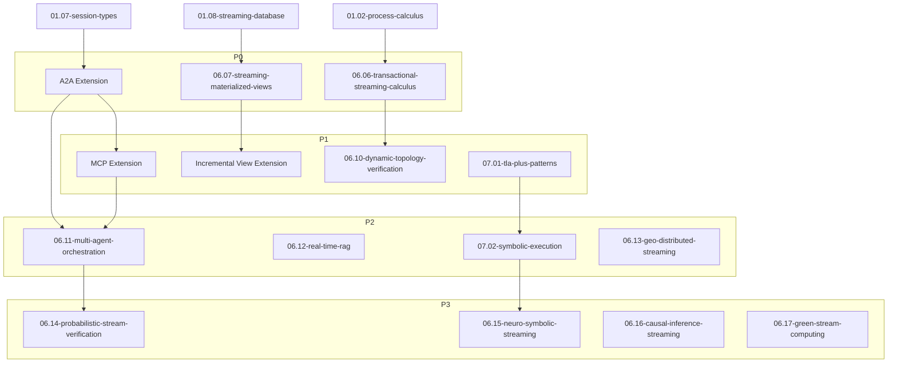

> **Status**: 🔮 Forward-looking Content | **Risk Level**: High | **Last Updated**: 2026-04
>
> The content described in this document is in early planning stages and may differ from the final implementation. Please refer to official Apache Flink releases for authoritative information.

# Project Supplementation Implementation Plan

> **Stage**: Struct/06-frontier | **Prerequisites**: [academic-frontier-2024-2026.md](./academic-frontier-2024-2026.md), [research-trends-analysis-2024-2026.md](./research-trends-analysis-2024-2026.md) | **Formalization Level**: L3-L5
> **Version**: 2026.04 | **Priority**: P0-P3

---

## Table of Contents

- [Project Supplementation Implementation Plan](#project-supplementation-implementation-plan)
  - [Table of Contents](#table-of-contents)
  - [Executive Summary](#executive-summary)
  - [P0 - Immediate Execution (This Month)](#p0-immediate-execution-this-month)
    - [P0-1: Transactional Stream Processing Process Calculus](#p0-1-transactional-stream-processing-process-calculus)
    - [P0-2: A2A Protocol Formalization Mapping](#p0-2-a2a-protocol-formalization-mapping)
    - [P0-3: Streaming Materialized Views Foundation Theory](#p0-3-streaming-materialized-views-foundation-theory)
  - [P1 - Short-Term Plan (1-3 Months)](#p1-short-term-plan-1-3-months)
    - [P1-1: MCP Protocol Stream Operator Semantics](#p1-1-mcp-protocol-stream-operator-semantics)
    - [P1-2: Incremental View Maintenance Correctness Theorem](#p1-2-incremental-view-maintenance-correctness-theorem)
    - [P1-3: Dynamic Topology Verification Framework](#p1-3-dynamic-topology-verification-framework)
    - [P1-4: TLA+ Pattern Library Construction](#p1-4-tla-pattern-library-construction)
  - [P2 - Medium-Term Plan (3-6 Months)](#p2-medium-term-plan-3-6-months)
    - [P2-1: Multi-Agent Collaboration Formalization](#p2-1-multi-agent-collaboration-formalization)
    - [P2-2: Real-Time RAG Formalization Model](#p2-2-real-time-rag-formalization-model)
    - [P2-3: Symbolic Execution Semantics Framework](#p2-3-symbolic-execution-semantics-framework)
    - [P2-4: Geo-Distributed Stream Processing Optimization](#p2-4-geo-distributed-stream-processing-optimization)
  - [P3 - Long-Term Plan (6-12 Months)](#p3-long-term-plan-6-12-months)
    - [P3-1: Probabilistic Stream Verification Theory](#p3-1-probabilistic-stream-verification-theory)
    - [P3-2: Neuro-Symbolic Stream Framework](#p3-2-neuro-symbolic-stream-framework)
    - [P3-3: Causal Inference Stream Theory](#p3-3-causal-inference-stream-theory)
    - [P3-4: Green Stream Computing Formalization](#p3-4-green-stream-computing-formalization)
  - [Resource Requirements and Dependencies](#resource-requirements-and-dependencies)
    - [Document Dependency Graph](#document-dependency-graph)
    - [Formal Element Statistics](#formal-element-statistics)
  - [Acceptance Criteria](#acceptance-criteria)
    - [Overall Project Acceptance Criteria](#overall-project-acceptance-criteria)
    - [Single Document Acceptance Checklist](#single-document-acceptance-checklist)
  - [Risks and Mitigation Strategies](#risks-and-mitigation-strategies)

---

## Executive Summary

Based on the review and analysis of stream computing academic frontiers from 2024-2026, this project proposes the following supplementation recommendations:

**Core Supplementation Areas**:

1. **AI Agent-Stream Fusion** (P0-P1): Establish formalization mapping for A2A/MCP protocols
2. **Transactional Stream Processing** (P0): Establish process calculus and ACID formalization theory
3. **Stream-Database Unification** (P0-P1): Introduce delayed view semantics and streaming materialized view theory
4. **Formal Verification Engineering** (P1-P2): Build TLA+ pattern library and symbolic execution framework

**New Document Plan**: 13 core documents

**Expected New Formal Elements**:

- Theorems (Thm): 15-20
- Definitions (Def): 25-30
- Lemmas (Lemma): 10-15
- Propositions (Prop): 8-10

---

## P0 - Immediate Execution (This Month)

### P0-1: Transactional Stream Processing Process Calculus

**Document**: `06.06-transactional-streaming-calculus.md`

**Objective**: Establish the formal foundation of transactional stream processing, define TSP-Calculus

**Content Outline**:

```markdown
1. Definitions
   - Def-S-26-01: Transactional Stream Processing Calculus (TSP-Calculus)
   - Def-S-26-02: Stream Transaction Boundary
   - Def-S-26-03: Transactional Operator

2. Properties
   - Lemma-S-26-01: Composition Preservation of Transaction Atomicity
   - Lemma-S-26-02: Checkpoint and Transaction Boundary Alignment Condition

3. Relations
   - TSP-Calculus ↔ π-calculus extension
   - TSP-Calculus ↔ Dataflow model mapping

4. Formal Proof
   - Thm-S-26-01: Stream Transaction Serializability Theorem
   - Thm-S-26-02: Exactly-Once and Serializability Equivalence Condition

5. Examples
   - TSP modeling of Flink Two-Phase Commit transactional Sink
   - Formalization analysis of Kafka Transactions
```

**Prerequisites**: [01.02-process-calculus-primer.md](../01-foundation/01.02-process-calculus-primer.md)

**Estimated Effort**: 3-4 days

**Acceptance Criteria**:

- [ ] TSP-Calculus syntax and operational semantics fully defined
- [ ] At least 2 theorems with complete proofs
- [ ] At least 1 industrial system instance with formal modeling

---

### P0-2: A2A Protocol Formalization Mapping

**Document**: Extension to [06.05-ai-agent-streaming-formalization.md](./06.05-ai-agent-streaming-formalization.md)

**Objective**: Map Google A2A protocol to multi-party session types

**Content Outline**:

```markdown
New Section: A2A Protocol Formalization Mapping

1. A2A Session Type Encoding
   - Def-S-26-06: A2A Session Type
   - Task send/receive type representation
   - Streaming Update type representation
   - Artifact exchange type representation

2. A2A Global Type
   - Complete definition of G_A2A
   - Task lifecycle session type
   - Multi-Agent collaboration session type

3. Type Safety Theorems
   - Thm-A2A-01: A2A Protocol Type Safety
   - Thm-A2A-02: Confluence of Projected Local Types

4. Mapping to Stream Computing
   - A2A message ↔ Stream event
   - A2A task ↔ Stream processing operator chain
```

**Prerequisites**: [06.03-ai-agent-session-types.md](./06.03-ai-agent-session-types.md), [01.07-session-types.md](../01-foundation/01.07-session-types.md)

**Estimated Effort**: 2-3 days

**Acceptance Criteria**:

- [ ] A2A core primitives encoded as session types
- [ ] Type safety theorem statements
- [ ] A2A to stream computing mapping example

---

### P0-3: Streaming Materialized Views Foundation Theory

**Document**: `06.07-streaming-materialized-views.md`

**Objective**: Establish the formal theory of streaming materialized views, introducing delayed view semantics

**Content Outline**:

```markdown
1. Definitions
   - Def-S-26-02: Streaming Materialized View
   - Def-S-26-03: Delayed View Semantics (DVS)
   - Def-S-26-09: View Freshness
   - Def-S-26-10: Changelog Semantics

2. Properties
   - Lemma-S-26-03: Incremental Update Completeness
   - Lemma-S-26-04: DVS Consistency with Traditional View Semantics

3. Relations
   - Streaming materialized view ↔ Database materialized view
   - Changelog ↔ WAL mapping

4. Formal Proof
   - Thm-S-26-02: Incremental View Maintenance Correctness Theorem
   - Thm-S-26-03: Continuous Query and Batch Query Equivalence Theorem

5. Examples
   - Differential Dataflow modeling of Materialize
   - Materialized view analysis of Flink SQL Continuous Query
```

**Prerequisites**: [01.08-streaming-database-formalization.md](../01-foundation/01.08-streaming-database-formalization.md)

**Estimated Effort**: 3-4 days

**Acceptance Criteria**:

- [ ] DVS formal definition
- [ ] Incremental maintenance correctness theorem
- [ ] Analysis of at least 1 streaming database system

---

## P1 - Short-Term Plan (1-3 Months)

### P1-1: MCP Protocol Stream Operator Semantics

**Document**: Extension to [06.05-ai-agent-streaming-formalization.md](./06.05-ai-agent-streaming-formalization.md)

**Objective**: Map Anthropic MCP protocol to stream computing operators

**Content Outline**:

```markdown
New Section: MCP Protocol Stream Operator Semantics

1. MCP Component to Stream Operator Mapping
   - Resources ↔ Broadcast Stream
   - Tools ↔ AsyncFunction
   - Prompts ↔ MapFunction
   - Sampling ↔ CoProcessFunction

2. MCP Context Flow Dataflow Diagram
   - Complete MCP data flow diagram
   - Context injection and query processing

3. MCP Protocol Correctness
   - Liveness guarantee of tool invocation
   - Consistency of resource access

4. Integration with A2A Protocol
   - A2A + MCP joint semantics
   - Formalization of multi-protocol Agent systems
```

**Estimated Effort**: 2-3 days

**Acceptance Criteria**:

- [ ] MCP core component to stream operator mapping table
- [ ] MCP context flow Dataflow diagram
- [ ] Tool invocation liveness analysis

---

### P1-2: Incremental View Maintenance Correctness Theorem

**Document**: Extension to `06.07-streaming-materialized-views.md`

**Objective**: Prove the correctness conditions of incremental view maintenance

**Content Outline**:

```markdown
New Section: Formal Proof of Incremental View Maintenance

1. Problem Statement
   - Full view computation: V = Q(D)
   - Incremental update: ΔV = f(ΔD, V_old)
   - Correctness condition definition

2. Incremental Maintenance Completeness
   - Lemma-S-26-05: Change Capture Completeness
   - Lemma-S-26-06: Update Propagation Completeness

3. Incremental Maintenance Consistency
   - Thm-S-26-04: Incremental Update and Recomputation Equivalence
   - Proof: Based on induction

4. Specialties of Streaming Incremental Maintenance
   - Out-of-order event handling
   - Retraction mechanism correctness
   - Watermark and view consistency
```

**Estimated Effort**: 3-4 days

**Acceptance Criteria**:

- [ ] Complete proof of incremental maintenance correctness theorem
- [ ] Formal analysis of Retraction mechanism
- [ ] Correctness guarantee under out-of-order scenarios

---

### P1-3: Dynamic Topology Verification Framework

**Document**: `06.10-dynamic-topology-verification.md`

**Objective**: Establish a formal verification framework for runtime dynamic topology changes

**Content Outline**:

```markdown
1. Definitions
   - Def-S-26-04: Dynamic Topology Migration
   - Def-S-26-11: State Repartitioning
   - Def-S-26-12: Online Rescaling

2. Properties
   - Lemma-S-26-07: Monotonicity of State Migration
   - Lemma-S-26-08: Partition Key Consistency Preservation

3. Formal Proof
   - Thm-S-26-05: Exactly-Once Preservation under Dynamic Topology Theorem
   - Thm-S-26-06: State Migration Consistency Theorem

4. Verification Methods
   - Model checking methods
   - Runtime monitoring methods
   - Test generation methods

5. Examples
   - Formal analysis of Flink Rescaling
   - Verification of Kafka Streams repartitioning
```

**Prerequisites**: [06.01-open-problems-streaming-verification.md](./06.01-open-problems-streaming-verification.md)

**Estimated Effort**: 4-5 days

**Acceptance Criteria**:

- [ ] Formal definition of dynamic topology migration
- [ ] Complete proofs of at least 2 core theorems
- [ ] Comparative analysis of verification methods

---

### P1-4: TLA+ Pattern Library Construction

**Document**: `07.01-tla-plus-patterns-for-streaming.md`

**Objective**: Build a TLA+ specification pattern library for stream processing systems

**Content Outline**:

```markdown
1. Basic Patterns
   - Stateful operator pattern
   - Window operation pattern
   - Checkpoint protocol pattern

2. Consistency Patterns
   - Exactly-Once pattern
   - Transactional Sink pattern
   - Distributed snapshot pattern

3. Time Patterns
   - Watermark advancement pattern
   - Event-time processing pattern
   - Out-of-order event processing pattern

4. Fault Handling Patterns
   - Failure detection pattern
   - State recovery pattern
   - Fault-tolerant replay pattern

5. Verification Cases
   - TLA+ specification of Flink Checkpoint protocol
   - TLA+ specification of window trigger
   - TLA+ specification of end-to-end Exactly-Once
```

**Estimated Effort**: 5-7 days

**Acceptance Criteria**:

- [ ] At least 10 TLA+ pattern definitions
- [ ] At least 3 complete verification cases
- [ ] Pattern application guide

---

## P2 - Medium-Term Plan (3-6 Months)

### P2-1: Multi-Agent Collaboration Formalization

**Document**: `06.11-multi-agent-orchestration.md`

**Objective**: Establish the formal theory of multi-Agent collaboration stream orchestration

**Content Outline**:

```markdown
1. Definitions
   - Def-S-26-13: Multi-Agent System
   - Def-S-26-14: Agent Orchestration Graph
   - Def-S-26-15: Collaborative Session Type

2. Properties
   - Lemma-S-26-09: Liveness Conditions of Multi-Agent Systems
   - Lemma-S-26-10: Fairness of Collaboration Protocols

3. Formal Proof
   - Thm-S-26-07: Multi-Agent Collaboration Liveness Theorem
   - Thm-S-26-08: Collaboration Safety Theorem

4. Orchestration Patterns
   - Sequential orchestration pattern
   - Parallel orchestration pattern
   - Conditional branch pattern
   - Loop feedback pattern

5. Examples
   - DevAgent + TestAgent + DeployAgent collaboration
   - Customer service multi-Agent system
```

**Prerequisites**: P0-2 (A2A Protocol Formalization)

**Estimated Effort**: 4-5 days

**Acceptance Criteria**:

- [ ] Formal definition of multi-Agent collaboration
- [ ] Complete proofs of at least 2 orchestration theorems
- [ ] At least 2 collaboration pattern examples

---

### P2-2: Real-Time RAG Formalization Model

**Document**: `06.12-real-time-rag-formalization.md`

**Objective**: Establish a formal model of real-time retrieval-augmented generation streaming architecture

**Content Outline**:

```markdown
1. Definitions
   - Def-S-26-16: Real-Time RAG Stream
   - Def-S-26-17: Document Embedding Stream
   - Def-S-26-18: Vector Index Stream

2. Properties
   - Lemma-S-26-11: Embedding Consistency
   - Lemma-S-26-12: Retrieval Relevance Guarantee

3. Formal Proof
   - Thm-S-26-09: Real-Time RAG Result Consistency Theorem
   - Thm-S-26-10: Index Update and Query Consistency

4. Architecture Patterns
   - Document stream processing pattern
   - Query-Index Join pattern
   - Incremental vector update pattern

5. Examples
   - Real-time document Q&A system
   - Streaming knowledge base update
```

**Estimated Effort**: 3-4 days

**Acceptance Criteria**:

- [ ] Real-time RAG formal model
- [ ] Complete proof of consistency theorem
- [ ] At least 1 complete architecture example

---

### P2-3: Symbolic Execution Semantics Framework

**Document**: `07.02-symbolic-execution-for-streaming.md`

**Objective**: Establish a symbolic execution formalization framework for stream processing operators

**Content Outline**:

```markdown
1. Definitions
   - Def-S-26-19: Symbolic Stream
   - Def-S-26-20: Symbolic State
   - Def-S-26-21: Path Constraint

2. Symbolic Execution Rules
   - Source operator symbolic semantics
   - Map operator symbolic semantics
   - Filter operator symbolic semantics
   - Window operator symbolic semantics
   - Join operator symbolic semantics

3. State Backend Symbolic Modeling
   - MemoryStateBackend symbolic model
   - RocksDBStateBackend symbolic model
   - IncrementalCheckpoint symbolic model

4. Verification Applications
   - Dead code detection
   - Invariant verification
   - Path coverage analysis

5. Flink Integration
   - Flink Symbolic Executor architecture
   - Practical application cases
```

**Estimated Effort**: 5-7 days

**Acceptance Criteria**:

- [ ] Symbolic execution rules for core operators
- [ ] State backend symbolic models
- [ ] At least 2 verification application cases

---

### P2-4: Geo-Distributed Stream Processing Optimization

**Document**: `06.13-geo-distributed-streaming.md`

**Objective**: Establish a formal optimization model for geo-distributed stream processing

**Content Outline**:

```markdown
1. Definitions
   - Def-S-26-07: Geo-Distributed Operator Placement
   - Def-S-26-22: Network Topology Awareness
   - Def-S-26-23: Latency Constraint

2. Optimization Problem Formalization
   - Minimize cross-DC network transfer
   - Satisfy end-to-end latency constraints
   - Load balancing optimization

3. Formal Proof
   - Thm-S-26-11: Aggregate Function Placement Optimality Theorem
   - Thm-S-26-12: Latency Constraint Satisfiability Decision

4. Placement Algorithms
   - Heuristic placement algorithm
   - Approximation algorithm for optimal placement
   - Dynamic placement adjustment

5. Examples
   - Globally distributed log analysis
   - Cross-cloud stream processing architecture
```

**Estimated Effort**: 4-5 days

**Acceptance Criteria**:

- [ ] Formal definition of optimization problem
- [ ] At least 2 optimality theorems
- [ ] Comparative analysis of placement algorithms

---

## P3 - Long-Term Plan (6-12 Months)

### P3-1: Probabilistic Stream Verification Theory

**Document**: `06.14-probabilistic-stream-verification.md`

**Objective**: Establish a formal verification theory for probabilistic stream processing

**Content Outline**:

```markdown
1. Definitions
   - Def-S-26-24: Probabilistic Stream
   - Def-S-26-25: Probabilistic Operator
   - Def-S-26-26: Confidence Constraint

2. Probabilistic Models
   - Markov Decision Process (MDP) modeling
   - Probabilistic Timed Automata (PTA) modeling

3. Verification Methods
   - Probabilistic Model Checking (PMC)
   - Statistical Model Checking (SMC)
   - Monte Carlo methods

4. Application Scenarios
   - LLM output uncertainty handling
   - Sensor data noise modeling
   - Approximate computation correctness guarantee

5. Tool Integration
   - PRISM tool application
   - Storm tool application
```

**Estimated Effort**: 7-10 days

**Acceptance Criteria**:

- [ ] Formal definition of probabilistic stream
- [ ] Systematic organization of probabilistic verification methods
- [ ] At least 2 application scenario analyses

---

### P3-2: Neuro-Symbolic Stream Framework

**Document**: `06.15-neuro-symbolic-streaming.md`

**Objective**: Establish a formal framework for neuro-symbolic hybrid stream processing

**Content Outline**:

```markdown
1. Definitions
   - Def-S-26-27: Neuro-Symbolic Operator
   - Def-S-26-28: Perception Layer
   - Def-S-26-29: Reasoning Layer

2. Architecture Patterns
   - Neural network processes raw data
   - Symbolic reasoning processes structured knowledge
   - Streaming neuro-symbolic pipeline

3. Verification Challenges
   - Neural network interpretability
   - Neuro-symbolic interface correctness
   - End-to-end correctness guarantee

4. Application Cases
   - Object detection and reasoning in video streams
   - Semantic parsing of natural language streams
```

**Estimated Effort**: 6-8 days

**Acceptance Criteria**:

- [ ] Formal definition of neuro-symbolic stream
- [ ] Systematic organization of architecture patterns
- [ ] In-depth analysis of verification challenges

---

### P3-3: Causal Inference Stream Theory

**Document**: `06.16-causal-inference-streaming.md`

**Objective**: Establish a formal theory of causal inference on stream data

**Content Outline**:

```markdown
1. Definitions
   - Def-S-26-30: Streaming Causal Graph
   - Def-S-26-31: Real-Time Causal Effect
   - Def-S-26-32: Counterfactual Stream Query

2. Causal Discovery
   - Causal discovery algorithms on stream data
   - Incremental causal graph update
   - Causal relationship stability testing

3. Causal Effect Estimation
   - Real-time Average Treatment Effect (ATE) estimation
   - Conditional Average Treatment Effect (CATE) estimation
   - Confidence interval computation

4. Formal Guarantees
   - Consistency of causal discovery
   - Unbiasedness of effect estimation
   - Computational complexity analysis
```

**Estimated Effort**: 8-10 days

**Acceptance Criteria**:

- [ ] Formal framework of stream causal inference
- [ ] Correctness analysis of algorithms
- [ ] Complexity analysis

---

### P3-4: Green Stream Computing Formalization

**Document**: `06.17-green-streaming-computing.md`

**Objective**: Establish an energy consumption optimization formalization model for stream computing

**Content Outline**:

```markdown
1. Definitions
   - Def-S-26-33: Energy Consumption Model
   - Def-S-26-34: Carbon Footprint Metric
   - Def-S-26-35: Green Scheduling

2. Optimization Objectives
   - Minimize energy consumption
   - Minimize carbon emissions
   - Performance-energy trade-off

3. Scheduling Strategies
   - Carbon-aware scheduling
   - Dynamic frequency scaling
   - Load aggregation optimization

4. Formal Guarantees
   - Energy consumption upper bound analysis
   - Performance lower bound guarantee
   - Pareto optimality of trade-off curve
```

**Estimated Effort**: 5-6 days

**Acceptance Criteria**:

- [ ] Formal definition of energy consumption model
- [ ] Formal analysis of scheduling strategies
- [ ] Trade-off analysis

---

## Resource Requirements and Dependencies

### Document Dependency Graph



### Formal Element Statistics

| Priority | New Documents | Expected Thm | Expected Def | Expected Lemma | Expected Prop |
|----------|---------------|--------------|--------------|----------------|---------------|
| P0 | 3 | 4-5 | 8-10 | 3-4 | 2-3 |
| P1 | 4 | 5-6 | 8-10 | 4-5 | 3-4 |
| P2 | 4 | 4-5 | 6-8 | 2-3 | 2-3 |
| P3 | 4 | 3-4 | 5-6 | 2-3 | 1-2 |
| **Total** | **15** | **16-20** | **27-34** | **11-15** | **8-12** |

---

## Acceptance Criteria

### Overall Project Acceptance Criteria

1. **Completeness**: All P0/P1 tasks completed, P2 tasks completed >50%
2. **Formalization Quality**: Each new theorem has a complete proof or proof sketch
3. **Document Quality**: Follows the project's six-section template specification
4. **Cross-References**: New documents establish appropriate cross-references with existing documents
5. **Visualizations**: Each new document contains at least 2 Mermaid diagrams

### Single Document Acceptance Checklist

- [ ] Document follows six-section structure
- [ ] Contains at least 3 formal definitions (Def)
- [ ] Contains at least 1 theorem (Thm) or lemma (Lemma)
- [ ] Contains at least 2 Mermaid visualizations
- [ ] Contains at least 1 example verification
- [ ] Citation format conforms to specification[^n]
- [ ] Document end contains related documents table
- [ ] Metadata (stage, prerequisites, formalization level) is complete

---

## Risks and Mitigation Strategies

| Risk | Impact | Likelihood | Mitigation Strategy |
|------|--------|------------|---------------------|
| Rapid evolution of A2A/MCP protocols | High | High | Adopt versioned documents, annotate protocol version numbers; monitor official updates |
| Academic research progress exceeding expectations | Medium | Medium | Establish quarterly review mechanism, dynamically adjust priorities |
| Formal proof complexity exceeding expectations | High | Medium | Adopt layered proof strategy; provide proof sketches first, then refine |
| Resource insufficiency (time/human) | High | Medium | Prioritize P0/P1; P3 tasks can be adjusted as needed |
| Conflicts with existing documents | Medium | Low | Carefully review existing documents before writing; establish inter-document consistency checks |

---

**Document Created**: 2026-04-09

**Last Updated**: 2026-04-09

**Maintainer**: AnalysisDataFlow Project

**Status**: Active - Implementation Plan
