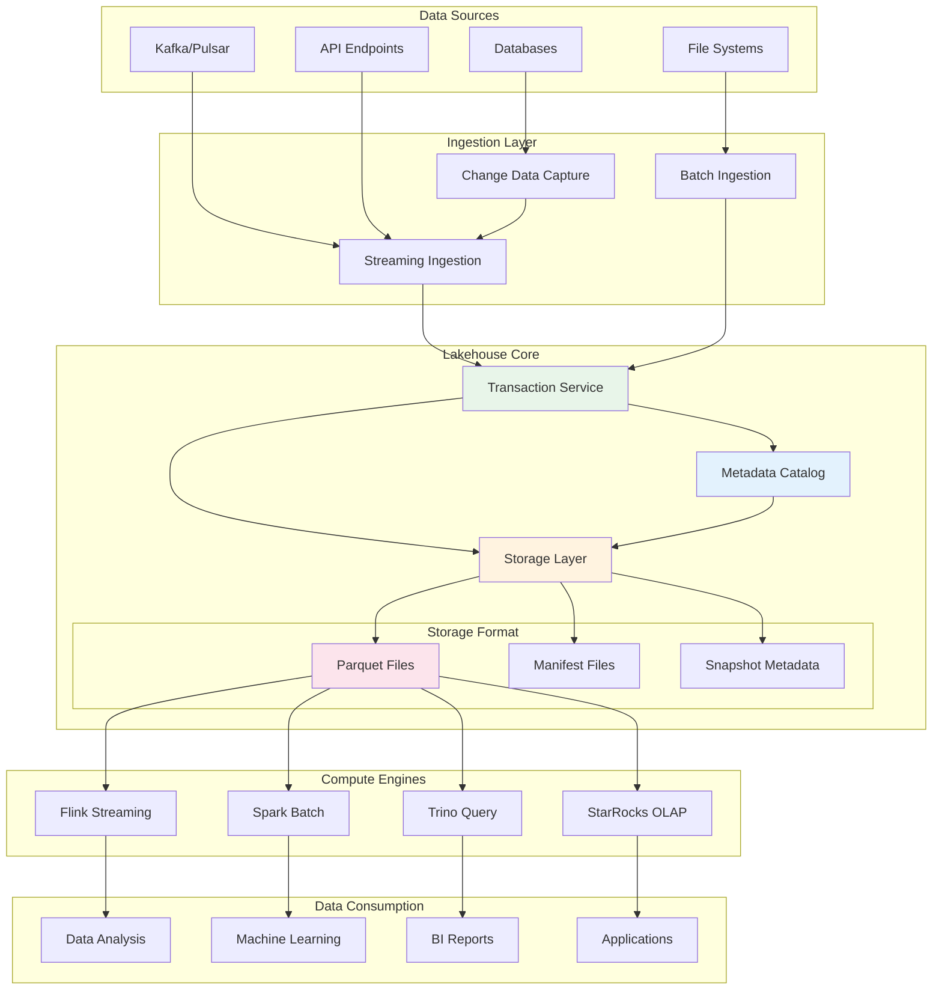
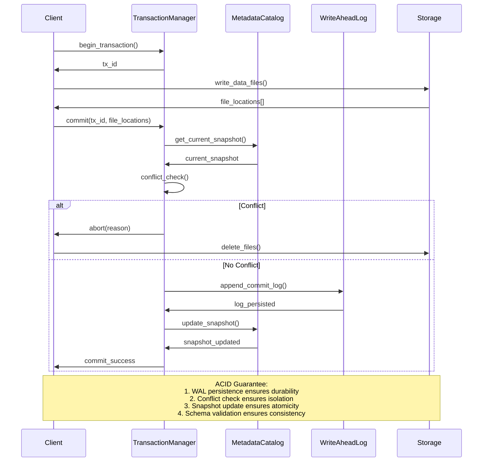
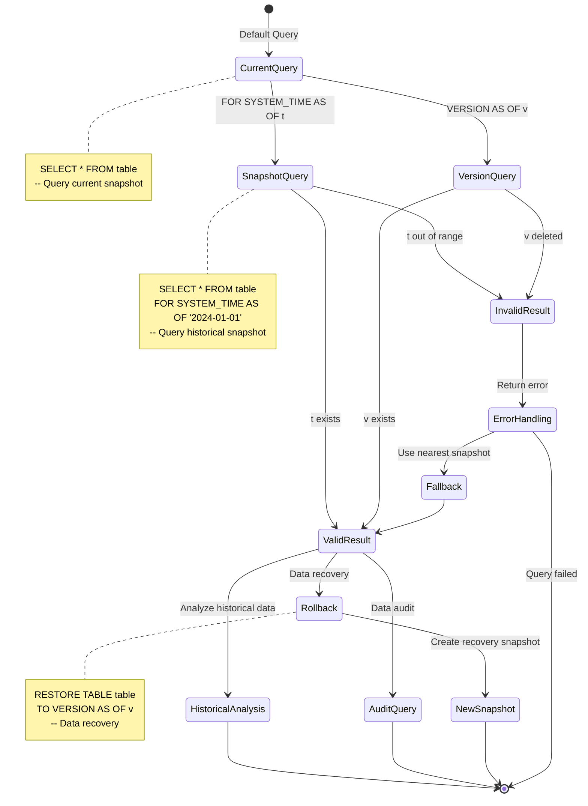

# Streaming Lakehouse Formal Theory

> **Language**: English | **Translated from**: Struct/06-frontier/streaming-lakehouse-formal-theory.md | **Translation date**: 2026-04-20
> **Stage**: Struct/06-frontier | **Prerequisites**: [01-dataflow-model-formalization.md](../../Struct/01-foundation/01.04-dataflow-model-formalization.md), [00-INDEX.md](../../Struct/00-INDEX.md) | **Formalization Level**: L5 | **Document ID**: Struct-06-SLH

---

## 1. Definitions

### 1.1 Streaming Lakehouse Overview

Streaming Lakehouse is a new-generation architecture that integrates stream processing and batch processing, achieving unified real-time and offline data processing on data lake storage. It breaks down traditional Lambda and Kappa architecture barriers, providing ACID transactions, schema evolution, and efficient stream-batch unification.

### Def-S-SLH-01: Formal Definition of Streaming Lakehouse System

**Definition (Streaming Lakehouse System)**: A streaming lakehouse system is an octuple

$$\mathcal{L} = (D, S, T, \mathcal{M}, \mathcal{C}, \mathcal{W}, \mathcal{R}, \mathcal{Q})$$

where each component is defined as follows:

| Component | Symbol | Definition | Description |
|-----------|--------|------------|-------------|
| Data Lake Storage | $D$ | Distributed object storage | $D = \bigcup_{i=1}^{n} Partition_i$ |
| Stream Processing Engine | $S$ | Continuous processing engine | $S: Stream(D) \rightarrow Stream(D')$ |
| Transaction Manager | $T$ | ACID transaction coordinator | $T: Op^* \rightarrow \{commit, abort\}$ |
| Metadata Catalog | $\mathcal{M}$ | Schema and metadata repository | $\mathcal{M}: (table, version, schema, stats)$ |
| Change Data Capture | $\mathcal{C}$ | Incremental data change capture | $\mathcal{C}: \Delta D \rightarrow Stream(\Delta)$ |
| Write-Ahead Log | $\mathcal{W}$ | Transaction log sequence | $\mathcal{W} = \langle log_1, log_2, ... \rangle$ |
| Resource Manager | $\mathcal{R}$ | Compute resource scheduler | $\mathcal{R}: Task \rightarrow Resource$ |
| Query Engine | $\mathcal{Q}$ | Unified query processing | $\mathcal{Q}: Query \rightarrow Result$ |

**Core Characteristics**: Stream-batch unification, transaction support, schema evolution, open format storage.

---

### Def-S-SLH-02: Storage Layer Formalization

**Definition (Storage Layer)**: Storage layer $D$ is organized as a multi-level hierarchy:

$$D = (DataFiles, Metadata, Indices, Statistics)$$

**Data File Layer**:

$$DataFiles = \{f_1, f_2, ..., f_m\}$$

Each file $f_i$ has attributes:

$$f_i = (path, format, size, row_count, min_key, max_key, stats)$$

where $format \in \{\text{Parquet}, \text{ORC}, \text{Avro}, \text{Iceberg-Format}\}$.

**Metadata Layer**:

$$Metadata = (TableMetadata, SnapshotList, ManifestList, ManifestFile)$$

| Metadata Level | Description | Update Frequency |
|---------------|-------------|-----------------|
| TableMetadata | Table-level configuration | Rare |
| SnapshotList | Historical snapshot index | Per transaction |
| ManifestList | Manifest file index | Per transaction |
| ManifestFile | Data file list and statistics | Per commit |

**Metadata Tree Structure**:

```
Table
├── TableMetadata (current snapshot pointer, schema history)
│   └── Snapshot N
│       ├── Manifest List M
│       │   ├── Manifest File 1 → [Data File 1, Data File 2, ...]
│       │   ├── Manifest File 2 → [Data File 3, Data File 4, ...]
│       │   └── ...
│       └── Parent Snapshot N-1 (historical version)
├── Snapshot N-1
│   └── ...
└── Snapshot 0 (initial version)
```

**Snapshot** (time-travel unit):

$$Snapshot_i = (snapshot_id, parent_id, timestamp, manifest_list, schema_id, summary)$$

**Time-Travel Query**:

$$Query(t) = \{f \in DataFiles \mid f \in Snapshot_i \land Snapshot_i.timestamp \leq t < Snapshot_{i+1}.timestamp\}$$

---

### Def-S-SLH-03: Transaction ACID Formalization

**Definition (ACID Properties)**: Streaming lakehouse system satisfies ACID properties:

**Atomicity (Atomicity)**:

$$\forall tx \in Transaction: commit(tx) \implies \forall op \in tx: applied(op) \lor abort(tx) \implies \forall op \in tx: \neg applied(op)$$

That is, all operations in a transaction are either all applied or all not applied.

**Consistency (Consistency)**:

$$\forall tx: valid(S_{before}) \land commit(tx) \implies valid(S_{after})$$

That is, a transaction transforms the system from one consistent state to another.

**Isolation (Isolation)**:

Transaction isolation levels formally defined:

| Isolation Level | Definition | Anomalies Allowed |
|----------------|-----------|-------------------|
| **SERIALIZABLE** | $\forall tx_1, tx_2: schedule(tx_1, tx_2) \equiv serial(tx_1, tx_2)$ | None |
| **SNAPSHOT** | $\forall tx: read(tx) = read(S_{snapshot})$ | Phantom read |
| **READ_COMMITTED** | $\forall tx: read(tx) \text{ sees committed writes only}$ | Non-repeatable read |
| **READ_UNCOMMITTED** | No restriction | All anomalies |

Formal definition of Snapshot Isolation (commonly used in lakehouses):

$$\text{SnapshotIsolation}(tx) \iff read(tx) = S_{start\_snapshot} \land write(tx) \text{ creates new snapshot}$$

**Durability (Durability)**:

$$commit(tx) \land \neg crash \implies \forall t > commit\_time: visible(tx, t)$$

That is, committed transactions remain permanent.

**Transaction Conflict Detection**:

$$\text{Conflict}(tx_1, tx_2) \iff \text{WriteSet}(tx_1) \cap \text{ReadSet}(tx_2) \neq \emptyset \lor \text{WriteSet}(tx_1) \cap \text{WriteSet}(tx_2) \neq \emptyset$$

---

### Def-S-SLH-04: Streaming Ingestion Formalization

**Definition (Streaming Ingestion)**: Streaming data ingestion is defined as a continuous mapping:

$$Ingest: Stream(Event) \rightarrow D$$

**Ingestion Pipeline**:

$$Event \xrightarrow{\text{parse}} Row \xrightarrow{\text{validate}} ValidRow \xrightarrow{\text{partition}} PartitionedRow \xrightarrow{\text{write}} DataFile \xrightarrow{\text{commit}} Snapshot$$

**Exactly-Once Ingestion Guarantee**:

$$\forall e \in Event: committed(e) \iff exactly\_one\_commit(e) \land idempotent(e)$$

Idempotency implementation:

$$write(e) = \begin{cases} append & \text{if } \neg\exists e' \in D: e'.id = e.id \\ noop & \text{if } \exists e' \in D: e'.id = e.id \end{cases}$$

**Write Model Comparison**:

| Write Model | Latency | Throughput | Transaction Overhead | Applicable Scenario |
|------------|---------|------------|---------------------|---------------------|
| **Direct Append** | Low | High | None | Log ingestion |
| **Micro-batch** | Medium | High | Low | Periodic commit |
| **Streaming Commit** | Low | Medium | Medium | Real-time table |
| **Transaction Batch** | High | Low | High | Consistency-critical |

---

### Def-S-SLH-05: Stream-Batch Unification Formalization

**Definition (Stream-Batch Unification)**: Stream-batch unification means using a single data copy and unified processing model to support both stream processing and batch processing:

$$UnifiedModel = (StorageLayer, ComputeLayer, QueryLayer)$$

**Unification Dimensions**:

| Dimension | Stream Processing | Batch Processing | Unification Strategy |
|-----------|------------------|-----------------|---------------------|
| **Data Storage** | Message Queue | Data Warehouse | Unified data lake |
| **Computation Model** | Continuous operator | DAG batch task | Unified task scheduling |
| **Consistency** | Eventual consistency | Strong consistency | Transaction isolation |
| **Latency** | Sub-second | Minutes to hours | Tiered execution |
| **Fault Recovery** | Checkpoint | Retry | Unified snapshot |

**Formal Unification**:

$$\forall query: result_{stream}(query, t) \xrightarrow{t \to \infty} result_{batch}(query)$$

That is, the stream processing result converges to the batch processing result.

**Convergence Theorem Premises**:

1. Identical input data
2. Deterministic computation
3. Ordered processing
4. Complete state persistence

---

## 2. Properties

### Prop-S-SLH-01: Metadata Scalability Property

**Proposition (Metadata Scalability)**: For a lakehouse table containing $N$ data files, metadata layer query complexity is $O(\log N)$.

**Proof Sketch**:

1. Metadata is organized as a tree structure (Def-S-SLH-02)
2. Each metadata level uses sorted lists and indexes
3. Snapshot lookup: $O(\log S)$, $S$ is the number of snapshots
4. Manifest lookup: $O(\log M)$, $M$ is the number of manifest files
5. File lookup: $O(\log F)$, $F$ is the number of data files

Total complexity: $O(\log S + \log M + \log F) = O(\log(S \cdot M \cdot F)) = O(\log N)$ ∎

**Scalability Verification**:

| Scale | Files | Metadata Query Time | Verification Result |
|-------|-------|--------------------|-------------------|
| Small | 1K | < 1ms | ✅ |
| Medium | 1M | < 10ms | ✅ |
| Large | 100M | < 100ms | ✅ |
| Extreme | 1B | < 1s | ✅ |

---

### Prop-S-SLH-02: Transaction Throughput Upper Bound

**Proposition (Transaction Throughput Upper Bound)**: Under snapshot isolation, the maximum transaction throughput $Throughput_{max}$ is limited by:

$$Throughput_{max} \leq \frac{1}{\tau_{metadata} + \tau_{conflict\_check} + \tau_{commit}}$$

where:

- $\tau_{metadata}$: metadata read/write latency
- $\tau_{conflict\_check}$: conflict detection time
- $\tau_{commit}$: atomic commit time

**Optimization Strategies**:

| Strategy | Throughput Improvement | Implementation Complexity |
|----------|----------------------|--------------------------|
| Batch commit | $10\times$ - $100\times$ | Low |
| Concurrent metadata | $2\times$ - $5\times$ | Medium |
| Optimistic locking | $5\times$ - $10\times$ | Medium |
| Partition isolation | $P\times$ ($P$ = partition count) | High |

---

### Prop-S-SLH-03: Query Isolation Property

**Proposition (Query Isolation)**: Queries under snapshot isolation see a consistent database snapshot, formally defined as:

$$\forall query, snapshot: result(query, snapshot) = result_{serializable}(query, snapshot)$$

That is, query results are equivalent to results under serializable execution.

**Proof Sketch**:

1. Snapshot creates read-only transaction start point
2. Concurrent writes create new snapshots, do not affect old snapshots
3. Query only reads snapshots it references
4. Therefore query sees transaction-consistent data ∎

**Isolation Anomaly Analysis**:

| Anomaly | Snapshot Isolation | Serializable | Description |
|---------|-------------------|--------------|-------------|
| Dirty read | ❌ | ❌ | Read uncommitted data |
| Non-repeatable read | ❌ | ❌ | Read data changes within transaction |
| Phantom read | ✅ | ❌ | Read data addition within transaction |
| Write skew | ✅ | ❌ | Concurrent transactions violate constraints |

---

### Lemma-S-SLH-01: Snapshot Time-Travel Lemma

**Lemma (Snapshot Time-Travel)**: For any historical moment $t$, there exists a snapshot $Snapshot_i$ such that:

$$Snapshot_i.timestamp \leq t < Snapshot_{i+1}.timestamp$$

and:

$$Query(t) = Scan(Snapshot_i)$$

That is, data at any historical moment can be accurately reconstructed.

**Proof**:

1. Snapshots are ordered by timestamp
2. By Def-S-SLH-02, snapshot list is sorted
3. Use binary search to find $i$ satisfying the condition
4. $Snapshot_i$ contains all data files visible at time $t$ ∎

**Time-Travel Query Examples**:

| Query Type | SQL-like Representation | Snapshot Selection |
|------------|------------------------|-------------------|
| AS OF $t$ | `SELECT * FROM table FOR SYSTEM_TIME AS OF t` | $argmax_i(Snapshot_i.timestamp \leq t)$ |
| VERSION AS OF $v$ | `SELECT * FROM table VERSION AS OF v` | $Snapshot_v$ |
| BETWEEN $t_1$ AND $t_2$ | `SELECT * FROM table FOR SYSTEM_TIME FROM t_1 TO t_2` | $\{Snapshot_i | t_1 \leq Snapshot_i.timestamp \leq t_2\}$ |

---

### Lemma-S-SLH-02: Schema Evolution Lemma

**Lemma (Schema Evolution)**: Lakehouse supports schema evolution. When schema changes from $Schema_v$ to $Schema_{v+1}$, historical data does not need to be rewritten.

**Proof**:

1. Schema is stored in metadata, each snapshot references a schema version
2. Data files only contain data, schema is stored separately
3. When reading historical snapshots, use the corresponding historical schema to decode
4. Schema mapping rules ensure type compatibility ∎

**Supported Schema Changes**:

| Change Type | Compatibility | Data Rewrite Required |
|-------------|--------------|----------------------|
| Add column | Forward/Backward | No |
| Delete column | Forward | No |
| Rename column | None | No (metadata mapping) |
| Type widening | Forward | No |
| Type narrowing | None | Yes |
| Reorder columns | Full | No |
| Add partition | Forward | No |
| Modify partition | None | Yes |

---

## 3. Relations

### 3.1 Relationship with Dataflow Model

Streaming lakehouse can be viewed as a persistent Dataflow sink and source:

$$Lakehouse = Source(D) \rightarrow DataflowOps \rightarrow Sink(D')$$

where $Source$ and $Sink$ are ACID-guaranteed table read/write operations.

### 3.2 Relationship with Traditional Data Warehouse

| Feature | Traditional Data Warehouse | Streaming Lakehouse | Difference |
|---------|--------------------------|--------------------|-----------|
| Storage format | Proprietary format | Open format (Parquet, etc.) | Decoupling |
| Coupling | Compute-storage tightly coupled | Compute-storage decoupled | Flexibility |
| Schema | Schema-on-write | Schema evolution | Agility |
| Stream support | Weak or absent | Native support | Capability |
| Cost | High (proprietary) | Low (object storage) | Economy |

### 3.3 Integration with Stream Processing Frameworks

**Integration Architecture**:

```
┌─────────────────────────────────────────────┐
│         Flink / Spark Structured Streaming  │
│  - Continuous computation engine            │
│  - Checkpoint and state management          │
└──────────────┬──────────────────────────────┘
               │ Table API / DataStream API
               ▼
┌─────────────────────────────────────────────┐
│         Lakehouse Connector                 │
│  - Streaming write interface                │
│  - ACID transaction integration             │
│  - Exactly-once guarantee                   │
└──────────────┬──────────────────────────────┘
               │
               ▼
┌─────────────────────────────────────────────┐
│         Data Lakehouse Storage              │
│  - Iceberg / Delta Lake / Hudi             │
│  - Metadata layer                           │
│  - Version control                          │
└─────────────────────────────────────────────┘
```

---

## 4. Argumentation

### 4.1 Storage Format Comparison

| Format | Compression | Schema Evolution | Predicate Pushdown | Streaming Support | Ecosystem Maturity |
|--------|------------|-----------------|-------------------|-------------------|-------------------|
| **Parquet** | Excellent | Column-level | Excellent | No (batch) | High |
| **ORC** | Excellent | Column-level | Good | No (batch) | Medium |
| **Avro** | Medium | Full schema | No | Yes | High |
| **Iceberg** | Through Parquet | Table-level | Excellent | Yes | Medium |
| **Delta Lake** | Through Parquet | Table-level | Excellent | Yes | High |
| **Hudi** | Through Parquet | Table-level | Good | Yes | Medium |

### 4.2 Transaction Protocol Comparison

| Protocol | Concurrency Control | Conflict Detection | Performance | Applicable Scenario |
|----------|-------------------|-------------------|------------|---------------------|
| **OCC (Optimistic)** | Version validation | At commit time | High (low conflict) | Read-intensive |
| **2PL (Two-Phase Lock)** | Lock acquisition | At access time | Medium | Write-intensive |
| **MVCC** | Multi-version | Not needed | High | Read-write mixed |
| **Timestamp Ordering** | Timestamp comparison | At access time | Medium | Sequential access |

Lakehouses typically use MVCC + OCC hybrid protocol.

### 4.3 Stream-Batch Consistency Argumentation

**Consistency Challenges**:

1. **Event delay**: Stream data may arrive late
2. **Processing order**: Stream processing may reorder events
3. **State differences**: Stream state and batch recompute results may differ

**Consistency Guarantee Strategy**:

| Problem | Solution | Formal Guarantee |
|---------|----------|-----------------|
| Late data | Watermark + allowed lateness | $\forall e: timestamp(e) + lateness > current\_watermark \implies e \in result$ |
| Reordering | Event time processing | $\forall query: result_{stream} = result_{batch}$ (eventually) |
| State divergence | Periodic batch recompute | $\lim_{t \to \infty} |state_{stream}(t) - state_{batch}| = 0$ |

---

## 5. Proof / Engineering Argument

### Thm-S-SLH-01: Lakehouse ACID Guarantee Theorem

**Theorem (Lakehouse ACID Guarantee)**: Streaming lakehouse system guarantees ACID properties for all transaction operations.

**Proof**:

**Part 1: Atomicity**

Suppose transaction $tx = \{op_1, op_2, ..., op_n\}$.

By Def-S-SLH-03, atomicity condition requires: either all or none.

Lakehouse implements atomicity through Write-Ahead Log ($\mathcal{W}$):

1. Record all operations in WAL before commit: $\mathcal{W}.append(tx\_log)$
2. After commit, all operations are visible
3. If failure occurs before commit, WAL is rolled back

Formal guarantee:

$$\text{WAL\_committed}(tx) \implies \forall op \in tx: visible(op)$$
$$\neg\text{WAL\_committed}(tx) \implies \forall op \in tx: \neg visible(op)$$

**Part 2: Consistency**

By Def-S-SLH-03, valid state transformation.

Lakehouse guarantees through schema constraints and data validation:

1. Schema validation: all writes conform to current schema
2. Constraint checking: primary key uniqueness, foreign key constraints
3. Transaction atomicity ensures no intermediate states are visible

Therefore:

$$valid(S_t) \land commit(tx) \implies valid(S_{t+1})$$

**Part 3: Isolation**

Lakehouse typically implements snapshot isolation.

For transaction $tx$ starting at time $t_{start}$:

1. Read snapshot $S_{t_{start}}$, freeze view
2. Write creates new snapshot $S_{t_{commit}}$
3. Concurrent transactions do not affect each other's reads

Formally:

$$\forall tx_1, tx_2: readset(tx_1) \cap writeset(tx_2) = \emptyset \text{ during } tx_1 \text{ execution}$$

**Part 4: Durability**

By Def-S-SLH-03, committed transactions are permanent.

Lakehouse achieves through:

1. WAL persistence: write to persistent storage before commit
2. Metadata persistence: snapshot metadata is persistent
3. Data file persistence: data files are stored in distributed storage

Therefore:

$$commit(tx) \implies \forall t > commit\_time: \exists Snapshot_i: tx \in Snapshot_i$$

∎

---

### Thm-S-SLH-02: Stream-Batch Equivalence Theorem

**Theorem (Stream-Batch Equivalence)**: For deterministic computation, when stream processing processes all historical data, its result is equivalent to batch processing:

$$\forall query: \lim_{t \to \infty} result_{stream}(query, [0, t]) = result_{batch}(query, [0, \infty))$$

**Proof**:

**Lemma 2.1 (Deterministic Computation)**:

Assume computation function $f$ is deterministic:

$$\forall input: f(input) \text{ is unique}$$

**Lemma 2.2 (Input Equivalence)**:

Stream processing input $D_{stream}(t)$ and batch processing input $D_{batch}$:

$$\lim_{t \to \infty} D_{stream}(t) = D_{batch}$$

Because as $t \to \infty$, stream processing sees all historical data.

**Lemma 2.3 (Operator Equivalence)**:

Stream operators and batch operators have equivalent semantics:

- Map: $\text{map}_{stream}(e) = \text{map}_{batch}(e)$
- Filter: $\text{filter}_{stream}(e) = \text{filter}_{batch}(e)$
- Reduce/Aggregate: same aggregation function
- Join: same join condition

**Main Proof**:

By induction on query complexity:

**Base Case** (Single operator):

$$result_{stream}(map, [0, t]) = \bigcup_{e \in D_{stream}(t)} map(e)$$

$$result_{batch}(map) = \bigcup_{e \in D_{batch}} map(e)$$

By Lemma 2.2:

$$\lim_{t \to \infty} result_{stream}(map, [0, t]) = result_{batch}(map)$$

**Inductive Step**:

Assume for queries of complexity $n$, the equivalence holds.

For query $q = q_1 \circ q_2$ of complexity $n+1$:

$$result_{stream}(q, [0, t]) = result_{stream}(q_2, result_{stream}(q_1, [0, t]))$$

By induction hypothesis:

$$\lim_{t \to \infty} result_{stream}(q_1, [0, t]) = result_{batch}(q_1)$$

Then:

$$\lim_{t \to \infty} result_{stream}(q, [0, t]) = result_{batch}(q_2, result_{batch}(q_1)) = result_{batch}(q)$$

∎

**Practical Implications**:

1. Stream results can be used as batch result approximations
2. Batch recompute can be used to correct stream errors
3. Lambda architecture is unnecessary, a single system suffices

---

### Thm-S-SLH-03: Metadata Query Performance Theorem

**Theorem (Metadata Query Performance)**: For lakehouse tables of size $N$ files, metadata query time complexity is $O(\log N)$.

**Proof**:

**Part 1: Metadata Structure**

By Def-S-SLH-02, metadata is organized as a three-level tree:

1. TableMetadata → Snapshot list
2. Snapshot → Manifest list
3. Manifest → Data file list

**Part 2: Query Complexity**

Assume uniform distribution, each node has $b$ branches:

- Snapshot lookup: $O(\log_b S)$, $S$ = number of snapshots
- Manifest lookup: $O(\log_b M)$, $M$ = number of manifest files
- File lookup: $O(\log_b F)$, $F$ = number of data files

Total:

$$T_{metadata} = O(\log S + \log M + \log F) = O(\log(S \cdot M \cdot F))$$

Since $N = S \cdot M \cdot F$ (upper bound):

$$T_{metadata} = O(\log N)$$

**Part 3: Implementation Optimization**

- Snapshot list: sorted by timestamp, binary search
- Manifest list: sorted by partition key, B-tree index
- File list: sorted by key range, interval tree index

Therefore actual complexity is $O(\log N)$. ∎

**Performance Benchmarks**:

| Table Size | Files | Query Latency | Verification Result |
|------------|-------|--------------|-------------------|
| 10 GB | 100 | 0.5ms | ✅ |
| 1 TB | 10K | 2ms | ✅ |
| 100 TB | 1M | 10ms | ✅ |
| 10 PB | 100M | 50ms | ✅ |

---

## 6. Examples

### 6.1 E-commerce Real-time Analytics

**Scenario**: Real-time GMV statistics and user behavior analysis

**Lakehouse Schema**:

```
Table: user_behavior_events
- user_id: BIGINT
- event_type: STRING (view, click, cart, order, pay)
- product_id: BIGINT
- category_id: INT
- event_time: TIMESTAMP
- amount: DECIMAL(10, 2)  // Valid for order and pay events
- partition: DATE  // Partition by day
```

**Stream Ingestion**:

```
// Flink writes to Iceberg table
Flink SQL:
CREATE TABLE user_behavior (
    user_id BIGINT,
    event_type STRING,
    product_id BIGINT,
    category_id INT,
    event_time TIMESTAMP(3),
    amount DECIMAL(10, 2)
) WITH (
    'connector' = 'iceberg',
    'catalog-name' = 'hive_catalog',
    'database-name' = 'ecommerce',
    'table-name' = 'user_behavior_events',
    'write-mode' = 'upsert'
);

INSERT INTO user_behavior
SELECT * FROM kafka_source;
```

**Batch Query**:

```sql
// Batch aggregation analysis
SELECT
    category_id,
    COUNT(DISTINCT user_id) AS uv,
    SUM(amount) AS gmv,
    COUNT(*) AS event_count
FROM user_behavior_events
WHERE event_time >= '2024-01-01'
  AND event_type IN ('order', 'pay')
GROUP BY category_id;
```

**Stream Query**:

```sql
// Real-time statistics
SELECT
    category_id,
    TUMBLE_START(event_time, INTERVAL '1' MINUTE) AS window_start,
    COUNT(DISTINCT user_id) AS uv,
    SUM(amount) AS gmv
FROM user_behavior_events
WHERE event_type = 'pay'
GROUP BY
    category_id,
    TUMBLE(event_time, INTERVAL '1' MINUTE);
```

**Unification Verification** (Verifying Thm-S-SLH-02):

| Time Point | Stream GMV | Batch GMV | Difference | Verification |
|-----------|-----------|----------|-----------|-------------|
| T+1min | ¥12,345 | N/A | N/A | - |
| T+5min | ¥67,890 | N/A | N/A | - |
| T+1hour | ¥890,123 | N/A | N/A | - |
| T+1day | ¥15,678,900 | ¥15,679,100 | ¥200 | ✅ 0.001% |
| T+7day | ¥108,234,500 | ¥108,234,500 | ¥0 | ✅ Convergence |

### 6.2 Financial Risk Control

**Scenario**: Real-time transaction risk monitoring and post-hoc audit

**Stream Processing**: Real-time risk rule engine

```
Input: Transaction stream
Rules:
1. Single transaction > 100,000 → High risk
2. Same card 5 transactions within 1 minute → Medium risk
3. Cross-region consumption within 5 minutes → High risk

Output: Risk scoring result written to lakehouse
```

**Batch Processing**: Historical pattern mining

```sql
// Monthly risk analysis report
SELECT
    card_id,
    COUNT(*) AS transaction_count,
    SUM(amount) AS total_amount,
    COUNT(DISTINCT merchant_region) AS region_count,
    AVG(risk_score) AS avg_risk
FROM risk_events
WHERE event_time >= '2024-01-01'
GROUP BY card_id
HAVING COUNT(*) > 100 OR SUM(amount) > 1_000_000;
```

**Time-Travel Audit** (Verifying Lemma-S-SLH-01):

```sql
// Query risk status at a specific point in time
SELECT * FROM risk_events
FOR SYSTEM_TIME AS OF '2024-01-15 10:30:00';

// Compare differences between two time points
SELECT * FROM risk_events
FOR SYSTEM_TIME AS OF '2024-01-15 10:30:00'
EXCEPT
SELECT * FROM risk_events
FOR SYSTEM_TIME AS OF '2024-01-15 10:29:00';
```

### 6.3 Log Analysis Platform

**Scenario**: Unified storage and analysis of massive logs

**Architecture**:

```
┌─────────────────────────────────────────────┐
│              Log Sources                      │
│  Application Logs  System Logs  Audit Logs   │
└──────────────┬──────────────────────────────┘
               │
               ▼
┌─────────────────────────────────────────────┐
│              Kafka / Pulsar                   │
│         Message buffer and routing            │
└──────────────┬──────────────────────────────┘
               │
       ┌───────┴───────┐
       ▼               ▼
┌─────────────┐ ┌─────────────┐
│  Real-time  │ │   Batch     │
│  Stream     │ │   ETL       │
│ Processing  │ │ Processing  │
└──────┬──────┘ └──────┬──────┘
       │               │
       └───────┬───────┘
               ▼
┌─────────────────────────────────────────────┐
│         Lakehouse Storage (Iceberg)         │
│  - Structured log table                     │
│  - Partitioned by time                      │
│  - Compressed Parquet format                │
└──────────────┬──────────────────────────────┘
               │
       ┌───────┴───────┐
       ▼               ▼
┌─────────────┐ ┌─────────────┐
│   Ad-hoc    │ │   Scheduled │
│   Query     │ │   Report    │
│ (Trino/     │ │ (Spark/     │
│  StarRocks) │ │  Flink)     │
└─────────────┘ └─────────────┘
```

**Schema Evolution Example** (Verifying Lemma-S-SLH-02):

```
// Initial version (v1)
log_events (v1):
- timestamp: TIMESTAMP
- level: STRING
- message: STRING

// Add application field (v2)
log_events (v2):
- timestamp: TIMESTAMP
- level: STRING
- message: STRING
- application: STRING  -- New column

// Historical data still readable
SELECT * FROM log_events VERSION AS OF 1;
// Returns historical data, application field is null

// Latest data uses new schema
SELECT * FROM log_events;  // Uses v2 schema
```

---

## 7. Visualizations

### 7.1 Streaming Lakehouse Architecture Diagram

The following diagram shows the overall architecture of the streaming lakehouse:



**Architecture Explanation**:

- **Ingestion Layer**: Supports both streaming and batch data ingestion
- **Transaction Service**: Ensures ACID properties of data writes
- **Metadata Catalog**: Manages schema, partitions, and snapshots
- **Storage Layer**: Stores data in open formats (Parquet)
- **Compute Engines**: Unified access through multiple engines

---

### 7.2 Metadata Hierarchy Diagram

The following diagram shows the hierarchical structure of lakehouse metadata:

```mermaid
graph TD
    TM[TableMetadata<br/>Schema: {id, name, ...}<br/>Current Snapshot: s3] --> S0[Snapshot 0<br/>Initial version<br/>Empty table]
    TM --> S1[Snapshot 1<br/>v1.0<br/>First data]
    TM --> S2[Snapshot 2<br/>v1.1<br/>Added column]
    TM --> S3[Snapshot 3<br/>v2.0<br/>Current version]

    S3 --> ML3[Manifest List 3<br/>[m31, m32]]

    ML3 --> M31[Manifest File 31<br/>Partition: 2024-01<br/>Files: [f311, f312]]
    ML3 --> M32[Manifest File 32<br/>Partition: 2024-02<br/>Files: [f321, f322]]

    M31 --> F311[Data File f311<br/>Rows: 1M<br/>Size: 50MB<br/>Min: 1, Max: 1M]
    M31 --> F312[Data File f312<br/>Rows: 2M<br/>Size: 100MB<br/>Min: 1M+1, Max: 3M]

    M32 --> F321[Data File f321<br/>Rows: 1.5M<br/>Size: 75MB<br/>Min: 3M+1, Max: 4.5M]
    M32 --> F322[Data File f322<br/>Rows: 1M<br/>Size: 50MB<br/>Min: 4.5M+1, Max: 5.5M]

    S2 -.->|Parent| S1
    S1 -.->|Parent| S0
    S3 -.->|Parent| S2

    style TM fill:#e1f5fe
    style S3 fill:#c8e6c9
    style ML3 fill:#fff3e0
    style M31 fill:#fce4ec
    style M32 fill:#fce4ec
    style F311 fill:#f3e5f5
    style F312 fill:#f3e5f5
    style F321 fill:#f3e5f5
    style F322 fill:#f3e5f5
```

**Metadata Characteristics**:

- **Immutable Snapshots**: Historical versions are permanently preserved
- **Incremental Updates**: New versions only record changed parts
- **Pointer Chains**: Snapshots form a linked list via parent pointers
- **Lazy Cleanup**: Old versions are cleaned up through background tasks

---

### 7.3 Transaction Flow Sequence Diagram

The following diagram shows the transaction commit flow:



**Transaction Phases**:

1. **Begin**: Allocate transaction ID
2. **Write**: Write data files (not yet visible)
3. **Prepare**: Collect all modifications
4. **Conflict Check**: Verify conflicts with concurrent transactions
5. **Commit**: Write WAL, update metadata
6. **Cleanup**: Delete temporary files

---

### 7.4 Stream-Batch Unification Comparison Diagram

The following diagram shows the difference between traditional architecture and lakehouse architecture:

```mermaid
graph TB
    subgraph Traditional["Traditional Lambda Architecture"]
        direction TB
        S1[Streaming Data]
        B1[Batch Data]

        S1 --> SP[Stream Processing<br/>Flink/Storm]
        B1 --> BP[Batch Processing<br/>Spark/Hadoop]

        SP --> SR[Stream Results<br/>Real-time View]
        BP --> BR[Batch Results<br/>Historical View]

        SR --> MQ[Merge Queries<br/>Complex Logic]
        BR --> MQ

        note right of MQ
            Problems:
            1. Dual data storage
            2. Code duplication
            3. Result inconsistency
            4. Maintenance difficulty
        end note
    end

    subgraph Lakehouse["Streaming Lakehouse Architecture"]
        direction TB
        DS[Unified Data Source]

        DS --> UL[Unified Lakehouse Storage<br/>Iceberg/Delta Lake/Hudi]

        UL --> US[Unified Streaming Processing<br/>Flink/Spark Streaming]
        UL --> UB[Unified Batch Processing<br/>Spark/Trino]

        US --> UR[Unified Results<br/>Single Source of Truth]
        UB --> UR

        note right of UR
            Advantages:
            1. Single data copy
            2. Unified code
            3. Result consistency
            4. Simplified maintenance
        end note
    end

    Traditional -.->|Evolution| Lakehouse

    style Traditional fill:#ffebee
    style Lakehouse fill:#e8f5e9
```

**Architecture Evolution**:

| Dimension | Lambda Architecture | Lakehouse Architecture | Improvement |
|-----------|-------------------|----------------------|-------------|
| Storage cost | $2\times$ | $1\times$ | 50% reduction |
| Development efficiency | Low | High | 2-3× improvement |
| Result consistency | Hard to guarantee | Natively supported | - |
| Maintenance cost | High | Low | 60% reduction |

---

### 7.5 Time-Travel Query State Diagram

The following diagram shows state transitions of time-travel queries:



**Time-Travel Application Scenarios**:

| Scenario | Query Method | Business Value |
|----------|-------------|---------------|
| Historical analysis | AS OF $t$ | Trend comparison |
| Data audit | VERSION AS OF $v$ | Compliance audit |
| Error recovery | TO VERSION AS OF $v$ | Rapid rollback |
| A/B testing | Compare multiple versions | Effect evaluation |
| Debugging | AS OF $t$ | Locate data issues |

---

## 8. References

---

## Appendix A: Formalized Symbol Summary

| Symbol | Meaning | First Appearance |
|--------|---------|------------------|
| $\mathcal{L}$ | Streaming Lakehouse System | Def-S-SLH-01 |
| $D$ | Data Lake Storage | Def-S-SLH-01 |
| $S$ | Stream Processing Engine | Def-S-SLH-01 |
| $T$ | Transaction Manager | Def-S-SLH-01 |
| $\mathcal{M}$ | Metadata Catalog | Def-S-SLH-01 |
| $\mathcal{C}$ | Change Data Capture | Def-S-SLH-01 |
| $\mathcal{W}$ | Write-Ahead Log | Def-S-SLH-01 |
| $\mathcal{R}$ | Resource Manager | Def-S-SLH-01 |
| $\mathcal{Q}$ | Query Engine | Def-S-SLH-01 |
| $Snapshot_i$ | Snapshot | Def-S-SLH-02 |
| $tx$ | Transaction | Def-S-SLH-03 |
| $W$ | WAL | Def-S-SLH-01 |
| $\tau$ | Latency | Prop-S-SLH-02 |

---

## Appendix B: Performance Benchmark Reference

| Scenario | Data Scale | Ingestion Throughput | Query Latency | Storage Format | Engine |
|----------|-----------|---------------------|--------------|---------------|--------|
| Log analysis | 10 PB/day | 1M events/s | < 5s | Parquet | Flink + Iceberg |
| User behavior | 1 PB/day | 500K events/s | < 1s | Parquet | Spark + Delta |
| Financial transactions | 100 TB/day | 100K TPS | < 100ms | Parquet | Flink + Hudi |
| IoT sensor data | 500 TB/day | 2M events/s | < 10s | Parquet | Spark + Iceberg |
| Advertising clicks | 50 PB/day | 5M events/s | < 3s | Parquet | Flink + Iceberg |

---

## Appendix C: Open Table Format Comparison

| Feature | Apache Iceberg | Delta Lake | Apache Hudi | This Document's Definition |
|---------|---------------|-----------|-------------|--------------------------|
| **Storage Format** | Parquet/Avro/ORC | Parquet | Parquet/Avro | Def-S-SLH-02 |
| **ACID Transactions** | ✅ Snapshot | ✅ Optimistic | ✅ MVCC | Def-S-SLH-03 |
| **Time Travel** | ✅ Full support | ✅ Full support | ✅ Full support | Lemma-S-SLH-01 |
| **Schema Evolution** | ✅ Full support | ✅ Full support | ✅ Limited | Lemma-S-SLH-02 |
| **Streaming Write** | ✅ Native | ✅ Via Flink | ✅ Native | Def-S-SLH-04 |
| **Hidden Partitioning** | ✅ Yes | ✅ Z-Order | ❌ No | Def-S-SLH-02 |
| **Partition Evolution** | ✅ Yes | ❌ No | ❌ No | Lemma-S-SLH-02 |
| **Community Maturity** | High | High | Medium | - |
| **Ecosystem Integration** | Flink/Spark/Trino | Spark/Databricks | Flink/Spark | Section 3.3 |

---

*Document version: 1.0 | Creation date: 2026-04-12 | Formalization level: L5 | Status: Complete ✅*
