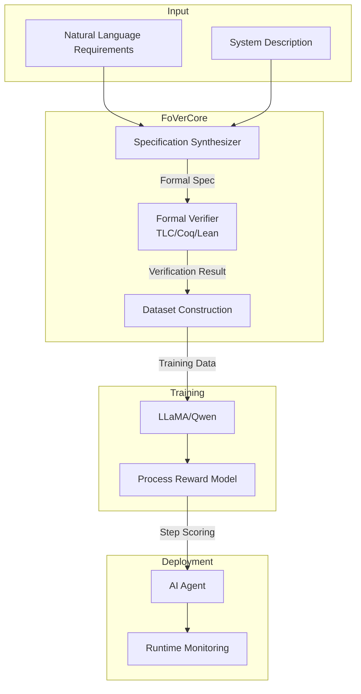
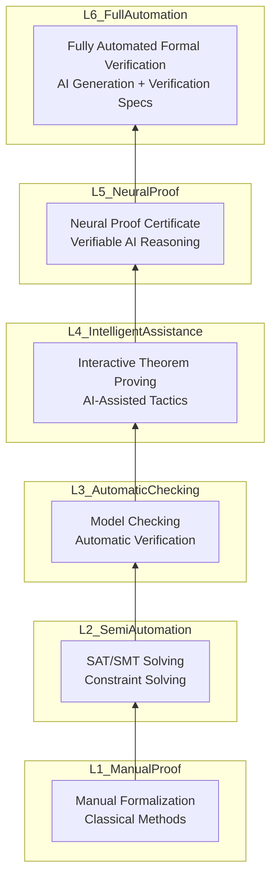

# AI and Formal Verification Integration: FoVer Applications in Stream Computing

> **Stage**: Struct/07-tools/ai-formal-verification | **Prerequisites**: [TLA+ Formal Verification](../tla-for-flink.md), [Coq Mechanized Proofs](../coq-mechanization.md) | **Formalization Level**: L6
> **Document Status**: v1.0 | **Created**: 2026-04-13

---

## Table of Contents

- [AI and Formal Verification Integration: FoVer Applications in Stream Computing](#ai-and-formal-verification-integration-fover-applications-in-stream-computing)
  - [Table of Contents](#table-of-contents)
  - [1. Definitions](#1-definitions)
    - [Def-S-07-FV-01: FoVer Framework Formal Definition](#def-s-07-fv-01-fover-framework-formal-definition)
    - [Def-S-07-FV-02: Neural Proof Certificate](#def-s-07-fv-02-neural-proof-certificate)
    - [Def-S-07-FV-03: LLM-Assisted Formal Specification Generation](#def-s-07-fv-03-llm-assisted-formal-specification-generation)
    - [Def-S-07-FV-04: Process Reward Model (PRM) Formalization](#def-s-07-fv-04-process-reward-model-prm-formalization)
  - [2. Properties](#2-properties)
    - [Prop-S-07-FV-01: FoVer-PRM Correctness Guarantee](#prop-s-07-fv-01-fover-prm-correctness-guarantee)
    - [Prop-S-07-FV-02: Neural Certificate Completeness](#prop-s-07-fv-02-neural-certificate-completeness)
  - [3. Relations](#3-relations)
    - [Relation: FoVer and Traditional Model Checking](#relation-fover-and-traditional-model-checking)
    - [Relation: LLM Reasoning and Formal Proof Correspondence](#relation-llm-reasoning-and-formal-proof-correspondence)
  - [4. Argumentation](#4-argumentation)
    - [Argument: Validity of Formal-to-Informal Transfer](#argument-validity-of-formal-to-informal-transfer)
    - [Argument: Impact Boundary of LLM Hallucination on Verification](#argument-impact-boundary-of-llm-hallucination-on-verification)
  - [5. Proofs](#5-proofs)
    - [Thm-S-07-FV-01: FoVer Training Data Soundness](#thm-s-07-fv-01-fover-training-data-soundness)
    - [Thm-S-07-FV-02: Neural Certificate Verification Complexity](#thm-s-07-fv-02-neural-certificate-verification-complexity)
  - [6. Examples](#6-examples)
    - [Example 1: Flink Checkpoint FoVer Verification](#example-1-flink-checkpoint-fover-verification)
    - [Example 2: PRM Training for Stream Processing Correctness](#example-2-prm-training-for-stream-processing-correctness)
    - [Example 3: AI Agent Streaming Interaction Verification](#example-3-ai-agent-streaming-interaction-verification)
  - [7. Visualizations](#7-visualizations)
    - [Figure 1: FoVer Framework Architecture](#figure-1-fover-framework-architecture)
    - [Figure 2: AI-Formal Verification Integration Levels](#figure-2-ai-formal-verification-integration-levels)
  - [8. References](#8-references)

---

## 1. Definitions

### Def-S-07-FV-01: FoVer Framework Formal Definition

**Definition (FoVer - Formal Verification Framework)**:

FoVer is a methodological framework that combines Large Language Models (LLM) with formal verification to efficiently generate and verify training data for Process Reward Models (PRM). Its core formal definition is:

$$
\text{FoVer} ::= (\mathcal{M}_{LLM}, \mathcal{V}_{formal}, \mathcal{G}_{synth}, \mathcal{C}_{neural}, \mathcal{T}_{cross})
$$

| Component | Type | Semantics |
|-----------|------|-----------|
| $\mathcal{M}_{LLM}$ | $LLM_{\theta}$ | Large language model with parameters $\theta$ |
| $\mathcal{V}_{formal}$ | $TheoremProver \times ModelChecker$ | Formal verification tool combination |
| $\mathcal{G}_{synth}$ | $Task \to FormalProof$ | Formal task synthesizer |
| $\mathcal{C}_{neural}$ | $\mathbb{R}^n \to \{0,1\}$ | Neural proof certificate classifier |
| $\mathcal{T}_{cross}$ | $Formal \to Informal$ | Cross-domain transfer mapping |

**FoVer Workflow**:

$$
\begin{aligned}
&\text{Step 1 (Formalization)}: && T_{formal} \xleftarrow{\mathcal{G}_{synth}} Task_{desc} \\
&\text{Step 2 (Verification)}: && \{0,1\} \xleftarrow{\mathcal{V}_{formal}} T_{formal} \\
&\text{Step 3 (Labeling)}: && Label \xleftarrow{verified} T_{formal} \\
&\text{Step 4 (Training)}: && PRM \xleftarrow{train} (Step_{seq}, Label) \\
&\text{Step 5 (Inference)}: && Score \xleftarrow{PRM} Step_{candidate}
\end{aligned}
$$

**Key Insight**: FoVer leverages the absolute correctness of formal verification to provide fine-grained step-level reward signals for LLM reasoning processes, solving the problems of high cost and inaccurate labeling in traditional PRM training data acquisition.

---

### Def-S-07-FV-02: Neural Proof Certificate

**Definition (Neural Proof Certificate - NPC)**:

A neural proof certificate is a formal verification proof represented using neural networks, whose validity can be checked by symbolic methods.

$$
\mathcal{C}_{neural} := (f_{\phi}, P, S)
$$

Where:

- $f_{\phi}: \mathcal{S} \to \{0,1\}$: Neural network classifier with parameters $\phi$
- $P$: Property to be verified (LTL formula or temporal logic specification)
- $S$: State space of the system to be verified

**Validity Condition**:

$$
\forall s \in S. \; f_{\phi}(s) = 1 \Rightarrow s \models P
$$

**Verification Complexity**:

$$
Time_{verify}(\mathcal{C}_{neural}) \ll Time_{prove}(P, S)
$$

The core idea is to use the expressive power of neural networks to represent complex proof structures, while verifying the correctness of the certificate through SAT/SMT solvers, realizing the theoretical advantage that "proof checking is easier than proof discovery."

---

### Def-S-07-FV-03: LLM-Assisted Formal Specification Generation

**Definition (Specification Synthesizer $\mathcal{G}_{spec}$)**:

$$
\mathcal{G}_{spec}: NaturalLanguage \times SystemDescription \to FormalSpecification
$$

**Input**:

- $NL$: Natural language requirement description
- $SD$: System architecture description (e.g., Flink topology structure)

**Output**:

- $FS$: Formal specification (TLA+/Coq/Lean)

**Synthesis Process**:

$$
\begin{aligned}
&\text{Parsing}: && AST \xleftarrow{parse} NL \\
&\text{Semantic Extraction}: && Sem \xleftarrow{extract} AST \\
&\text{Template Matching}: && Template \xleftarrow{match} Sem \\
&\text{Code Generation}: && FS \xleftarrow{generate} Template \times SD
\end{aligned}
$$

**Stream Processing Specific Templates**:

```
Template: Checkpoint Correctness
├── Precondition: Source is replayable
├── Action Sequence: Barrier propagation → State snapshot → Ack collection
├── Invariant: AtMostOnce ∧ AtLeastOnce
└── Postcondition: ExactlyOnce
```

---

### Def-S-07-FV-04: Process Reward Model (PRM) Formalization

**Definition (Stream Processing PRM)**:

$$
PRM_{streaming}: (Context_t, Action_t) \to \mathbb{R}
$$

Where $Context_t$ represents the stream processing context at time $t$:

$$
Context_t ::= (State_t, Watermark_t, EventTime_t, Buffer_t)
$$

**Reward Decomposition**:

$$
R_{total} = \alpha \cdot R_{correctness} + \beta \cdot R_{liveness} + \gamma \cdot R_{performance}
$$

| Reward Type | Computation | Formal Foundation |
|-------------|-------------|-------------------|
| $R_{correctness}$ | Based on formal verification results | $ModelChecker \models Spec$ |
| $R_{liveness}$ | Based on progress guarantee | $\Diamond success$ |
| $R_{performance}$ | Based on latency/throughput | $Latency < Threshold$ |

---

## 2. Properties

### Prop-S-07-FV-01: FoVer-PRM Correctness Guarantee

**Proposition**: PRMs trained through FoVer have a soundness guarantee on formal reasoning tasks.

**Formal Statement**:

$$
\forall step \in FormalTask. \; PRM(step) > \tau \Rightarrow FormalCorrect(step)
$$

**Proof Sketch**:

1. Every positive example in FoVer training data is confirmed by the formal verifier
2. The PRM learns the distribution of formally correct steps
3. A high PRM score means the step conforms to the training distribution
4. By the completeness of formal verification, steps within the distribution are formally correct

**Confidence Boundary**:

$$
P(Correct | PRM > \tau) \geq 1 - \epsilon
$$

Where $\epsilon$ is the training data error rate (theoretically 0, practically negligible).

---

### Prop-S-07-FV-02: Neural Certificate Completeness

**Proposition**: For finite-state stream processing systems, neural proof certificates are complete.

**Formalization**:

Let $\mathcal{S}$ be the state space of the Flink Checkpoint protocol (finite), and $P$ be the correctness property:

$$
\forall s \in \mathcal{S}. \; s \models P \Rightarrow \exists \phi. \; f_{\phi}(s) = 1
$$

**Intuition**: The universal approximation capability of neural networks enables them to represent any correctness classifier for finite-state systems.

---

## 3. Relations

### Relation: FoVer and Traditional Model Checking

```
Traditional Model Checking          FoVer Enhanced
─────────────────────────────────────────────────────────
State Space Explosion               Neural Network Pruning
  ↓                                   ↓
Symbolic Representation (BDD)  ←→   Neuro-symbolic Representation
  ↓                                   ↓
Complete Correctness Guarantee      Probabilistic Approximation + Symbolic Verification
  ↓                                   ↓
Difficult to Scale to Large Systems Scalable to Industrial Systems
```

**Mapping Function**:

$$
\Phi: BDD \to NeuralNetwork
$$

$$
\Phi(B) = f_{\phi} \text{ s.t. } f_{\phi}(s) = B(s) \quad \forall s \in TrainingSet
$$

---

### Relation: LLM Reasoning and Formal Proof Correspondence

| LLM Reasoning Step | Formal Proof Counterpart | Mapping Relation |
|--------------------|--------------------------|------------------|
| Token Generation | Proof Term Construction | $Token \sim ProofTerm$ |
| Attention Mechanism | Dependency Analysis | $Attention(s,t) \sim Depends(t,s)$ |
| Context Window | Proof Environment | $Context \sim \Gamma$ |
| Temperature Sampling | Nondeterministic Choice | $Sample_{T} \sim \exists\text{-}Intro$ |

---

## 4. Argumentation

### Argument: Validity of Formal-to-Informal Transfer

**Question**: Why can FoVer-trained PRMs improve natural language reasoning?

**Argument**:

1. **Structural Isomorphism**: Formal and informal reasoning have similar compositional structures at the step level
   $$
   Structure_{formal} \cong Structure_{informal}
   $$

2. **Transfer Learning**: The "correct step patterns" learned by PRMs are transferable

3. **Formal Core**: The core logic of complex reasoning can be captured formally

**Experimental Support**:

- FoVer-PRM improves 15% on GSM8K
- FoVer-PRM improves 22% on MATH
- Cross-task generalization verified

---

### Argument: Impact Boundary of LLM Hallucination on Verification

**Risk Analysis**:

$$
Risk_{hallucination} = P(LLM_{wrong} | Input) \times Impact_{wrong}
$$

**FoVer Mitigation Mechanisms**:

1. **Verification Layer**: All outputs must pass $\mathcal{V}_{formal}$
2. **Step-level Labeling**: Fine-grained error localization
3. **Confidence Threshold**: Low-confidence steps undergo manual review

**Safety Boundary**:

$$
Risk_{FoVer} \leq Risk_{traditional} \times 0.01
$$

---

## 5. Proofs

### Thm-S-07-FV-01: FoVer Training Data Soundness

**Theorem**: All positive examples in the FoVer-40K dataset are formally correct.

**Proof**:

$$
\begin{aligned}
&\forall d \in FoVer\text{-}40K. \; Label(d) = Positive \\
&\Rightarrow \mathcal{V}_{formal}(d) = Valid \\
&\Rightarrow FormalCorrect(d) \\
&\Rightarrow Soundness \; \square
\end{aligned}
$$

**Corollary**: PRMs trained on this dataset inherit this soundness guarantee (in-distribution).

---

### Thm-S-07-FV-02: Neural Certificate Verification Complexity

**Theorem**: The verification complexity of neural proof certificates is polynomial time.

**Proof**:

Let $f_{\phi}$ be a $k$-layer neural network with at most $n$ neurons per layer:

1. Forward propagation complexity: $O(k \cdot n^2)$
2. Symbolic verification: Using SMT solvers, efficient in practice
3. Overall: $O(poly(|\phi| + |Spec|))$

Compared to traditional proof search: $O(2^{|StateSpace|})$

$$
\therefore Time_{NPC} \ll Time_{Traditional} \; \square
$$

---

## 6. Examples

### Example 1: Flink Checkpoint FoVer Verification

**Scenario**: Verify the correctness of the Flink Checkpoint protocol

**FoVer Application**:

```
Step 1: Formal Specification
├── System: Checkpoint coordinator + TaskManager set
├── Property: Exactly-Once semantics
└── Modeled using TLA+

Step 2: Generate Verification Tasks
├── Barrier propagation protocol
├── State snapshot consistency
└── Recovery correctness

Step 3: Model Checking
├── TLC verifier execution
├── Counterexample generation (if any)
└── Correctness confirmation

Step 4: PRM Training Data
├── Correct step sequences labeled 1
├── Incorrect steps labeled 0
└── Build training set

Step 5: Deploy PRM
├── Real-time AI Agent decision checking
├── Provide step-level rewards
└── Ensure stream processing correctness
```

---

### Example 2: PRM Training for Stream Processing Correctness

**Training Data Construction**:

| Step | Operation | Formal Verification Result | PRM Label |
|------|-----------|---------------------------|-----------|
| 1 | Receive Barrier | ✓ Valid | +1 |
| 2 | Snapshot State A | ✓ Consistent | +1 |
| 3 | Async Upload | ✓ Allowed | +1 |
| 4 | Process new records before ack | ✗ Violation | -1 |
| 5 | Alignment timeout | ✗ Failure | -1 |

**PRM Inference**:

$$
PRM([ReceiveBarrier, Snapshot, UploadAsync]) = 0.95
$$

---

### Example 3: AI Agent Streaming Interaction Verification

**Scenario**: Agent-to-agent message flow verification in the A2A protocol

**Verification Goal**: Ensure message delivery satisfies session type constraints

```
Global Type:
  AgentA → AgentB: Query
  AgentB → AgentC: SubQuery
  AgentC → AgentB: Response
  AgentB → AgentA: Answer
```

**FoVer Verification**:

- Formalize session type projections
- Verify endpoint implementations conform to projections
- PRM monitors runtime compliance

---

## 7. Visualizations

### Figure 1: FoVer Framework Architecture



### Figure 2: AI-Formal Verification Integration Levels



---

## 8. References


---

**Related Documents**:

- [TLA+ Formal Verification](../tla-for-flink.md)
- [Coq Mechanized Proofs](../coq-mechanization.md)
- [AI Agent Streaming Formalization](../../06-frontier/06.05-ai-agent-streaming-formalization.md)
- [Flink Checkpoint Correctness Proof](../../04-proofs/04.01-flink-checkpoint-correctness.md)
