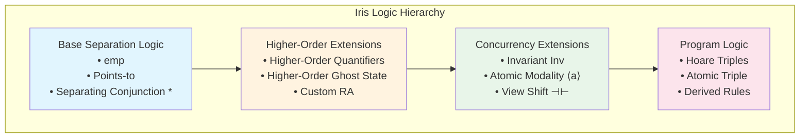
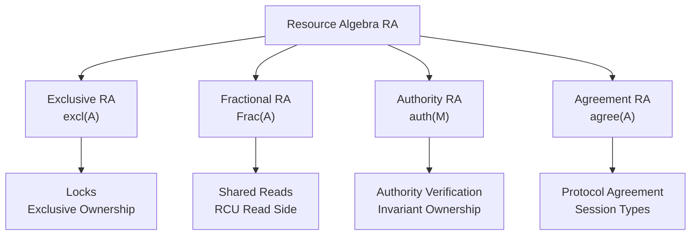
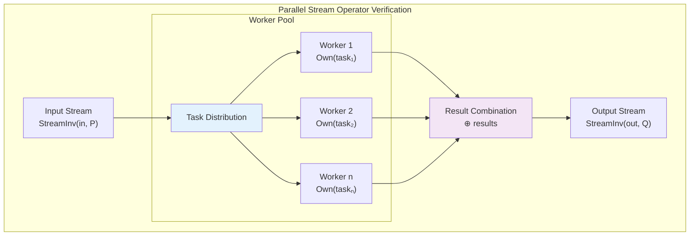
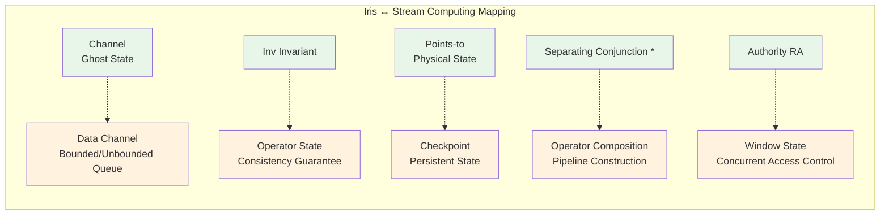

# Iris - Higher-Order Concurrent Separation Logic

> **Stage**: Struct/ | **Prerequisites**: [../00-INDEX.md](../00-INDEX.md) | **Formality Level**: L6

---

## 1. Definitions

### 1.1 Separation Logic Foundation

**Def-S-07-01: Separation Logic Assertion Syntax**

The syntax of separation logic assertions $P, Q$:

$$P, Q ::= \text{emp} \mid P * Q \mid P \wand Q \mid l \mapsto v \mid \exists x. P \mid \forall x. P \mid P \Rightarrow Q$$

Where:

- $\text{emp}$: empty heap
- $P * Q$: separating conjunction, $P$ and $Q$ hold disjoint resources
- $P \wand Q$: separating implication, deriving $Q$ after separating $P$'s resources
- $l \mapsto v$: points-to assertion, location $l$ stores value $v$

**Def-S-07-02: Separation Logic Semantics**

Assertion $P$ satisfied on heap $h$, denoted $h \vDash P$:

$$
\begin{aligned}
h &\vDash \text{emp} \iff h = \emptyset \\
h &\vDash P * Q \iff \exists h_1, h_2.\ h = h_1 \uplus h_2 \land h_1 \vDash P \land h_2 \vDash Q \\
h &\vDash P \wand Q \iff \forall h'.\ h' \vDash P \Rightarrow h \uplus h' \vDash Q \\
h &\vDash l \mapsto v \iff \text{dom}(h) = \{l\} \land h(l) = v
\end{aligned}
$$

### 1.2 Core Iris Assertions

**Def-S-07-03: Separation Logic Assertions (Points-to, Own, Inv)**

Iris extends classical separation logic with higher-order assertions:

**(a) Physical Points-to Assertion**: $\ell \mapsto v$

Represents that physical memory location $\ell$ stores value $v$, satisfying:
$$\frac{P * (\ell \mapsto v)}{\langle \ell \leftarrow w \rangle}\{P * (\ell \mapsto w)\}$$

**(b) Ghost Ownership Assertion**: $a \ownsto_\gamma \pi$

Represents ownership share $\pi \in (0, 1]$ of resource algebra (RA) element $a$ under resource name $\gamma$ in ghost state:
$$\text{Own}(a)_\gamma \triangleq \exists \pi > 0.\ a \ownsto_\gamma \pi$$

**(c) Invariant Assertion**: $\invname{\iota}{P}$

Represents that invariant $\iota$ protects assertion $P$; any thread can obtain read-only access to $P$ via $\text{inv}_\iota$:
$$\frac{\invname{\iota}{P}}{\langle \text{open } \iota \rangle}\{P * \text{inv}_\iota\}\{P * \text{inv}_\iota\}\langle \text{close } \iota \rangle$$

### 1.3 Higher-Order Ghost State

**Def-S-07-04: Higher-Order Ghost State**

Iris allows assertions to be part of ghost state, defining the **Higher-Order Resource Algebra** (HORA):

$$
\text{HORA} \triangleq \{A \subseteq \text{Prop} \mid A \text{ is upward-closed and non-empty}\}
$$

Core constructions:

**(a) Authority Token**: $\authfull{\gamma}{a}$

Represents full authority over resource algebra element $a$:
$$\authfull{\gamma}{a} * \authfrag{\gamma}{b} \Rightarrow a \cdot b \text{ well-defined}$$

**(b) Knowledge Assertion**: $\knows{\gamma}{a}$

Represents knowing that resource $a$ exists under $\gamma$:
$$\knows{\gamma}{a} \triangleq \exists b.\ \authfrag{\gamma}{b} \land a \preceq b$$

**(c) Higher-Order Invariant**: $\text{HInv}(\iota, F)$

Where $F : \text{Prop} \to \text{Prop}$ is a monotone function:
$$\text{HInv}(\iota, F) \triangleq \mu X.\ F(X) * \invname{\iota}{X}$$

### 1.4 Resource Algebra

**Def-S-07-05: Resource Algebra**

A resource algebra $(M, \cdot, \varepsilon, |\cdot|, \mvalid)$ comprises:

| Component | Type | Description |
|------|------|------|
| $M$ | Set | Set of resource elements |
| $\cdot : M \times M \rightharpoonup M$ | Partial binary operation | Resource composition (commutative, associative) |
| $\varepsilon \in M$ | Unit | $\forall a.\ a \cdot \varepsilon = a$ |
| $|\cdot| : M \to M$ | Core operation | $|a|$ is the "core" part of $a$ |
| $\mvalid \subseteq M$ | Validity predicate | Valid resource combinations |

**RA Axioms**:

$$
\begin{aligned}
&\text{(RA-COMM)} && a \cdot b = b \cdot a \\
&\text{(RA-ASSOC)} && (a \cdot b) \cdot c = a \cdot (b \cdot c) \\
&\text{(RA-CORE)} && |a| \cdot a = a \land ||a|| = |a| \\
&\text{(RA-VALID)} & & a \cdot b \in \mvalid \Rightarrow a \in \mvalid
\end{aligned}
$$

**Common RA Instances**:

1. **Exclusive RA**: $\excl(A) \triangleq A \uplus \{\bot\}$
   $$a \cdot b = \bot,\quad |a| = \bot$$

2. **Fractional RA**: $\text{Frac}(A) \triangleq A \times (0, 1]$
   $$(a, q) \cdot (a, q\') = (a, q + q\') \text{ if } q + q\' \leq 1$$

3. **Authority RA**: $\auth(M) \triangleq M \times M$
   $$(a, b) \cdot (a\', b\') = (a \cdot a\', b) \text{ if } a = a\' \land b \cdot b\' \in M$$

### 1.5 Invariants and Atomicity

**Def-S-07-06: Invariants and Atomicity**

**(a) Named Invariant**:

$$\invname{\iota}{P} \in \text{Prop}$$

Satisfying:

- **Persistence**: $\invname{\iota}{P} \Rightarrow \Box \invname{\iota}{P}$
- **Open Rule**: $P$ can be temporarily obtained from $\invname{\iota}{P}$ (must be returned)

**(b) Atomic Modality**: $\langle a \rangle$

Marks the boundary of atomic operations:
$$\frac{\{P\}\ e\ \{Q\}}{\{\langle a \rangle P\}\ \langle e \rangle\ \{\langle a \rangle Q\}}$$

**(c) View Shift**: $P \vs Q$

Represents resource perspective transformation during invariant open/close:
$$P \vs Q \triangleq \Box(P \Rightarrow Q) \land \text{provable transformation}$$

---

## 2. Properties

### 2.1 Basic Properties of Separation Logic

**Lemma-S-07-01: Distributivity of Separating Conjunction**

$$P * (Q \lor R) \dashv\vdash (P * Q) \lor (P * R)$$

**Proof**:

$(\Rightarrow)$ Direction: Assume $h \vDash P * (Q \lor R)$

- Then $\exists h_1, h_2.\ h = h_1 \uplus h_2$, $h_1 \vDash P$, $h_2 \vDash Q \lor R$
- If $h_2 \vDash Q$, then $h \vDash P * Q$, hence $h \vDash (P * Q) \lor (P * R)$
- If $h_2 \vDash R$, then $h \vDash P * R$, hence $h \vDash (P * Q) \lor (P * R)$

$(\Leftarrow)$ Direction is similar, from the monotonicity of separating conjunction over existential quantification. $\square$

**Lemma-S-07-02: Adjunction between Wand and Separation**

$$P * Q \vdash R \iff P \vdash Q \wand R$$

**Proof**: Directly from the definition of separating implication $\wand$. $\square$

### 2.2 Iris Inference Rules

**Lemma-S-07-03: Invariant Open/Close Rule**

$$
\frac{\invname{\iota}{P}}{\{P * \invname{\iota}{P}\}\ \text{open } \iota\ \{\invname{\iota}{P}\}}$$

**Lemma-S-07-04: Ghost State Distributivity**

$$a \ownsto_\gamma \pi_1 * b \ownsto_\gamma \pi_2 \vdash (a \cdot b) \ownsto_\gamma (\pi_1 + \pi_2)$$

When $a \cdot b$ is well-defined and $\pi_1 + \pi_2 \leq 1$.

### 2.3 Higher-Order Properties

**Lemma-S-07-05: Persistence Propagation**

$$\frac{P \text{ is persistent}}{\Box P \dashv\vdash P}$$

Where $\Box P$ is the necessity modality, meaning $P$ holds in all possible worlds.

**Lemma-S-07-06: Higher-Order Invariant Fixed Point**

For monotone function $F : \text{Prop} \to \text{Prop}$:
$$\text{HInv}(\iota, F) \dashv\vdash F(\text{HInv}(\iota, F))$$

---

## 3. Relations

### 3.1 Iris and Concurrency Models

**Prop-S-07-01: Iris Encodes the Actor Model**

An actor's mailbox can be encoded as a locked queue in Iris:

```
Mailbox(α) ≜ ∃ℓ. ℓ ↦ queue * Inv(mailbox_inv(ℓ, α))

where mailbox_inv(ℓ, α) ≜ ∃msgs. ℓ ↦ msgs * All(α, msgs)
```

Where $All(\alpha, msgs)$ means all messages satisfy protocol $\alpha$.

### 3.2 Iris and Type Theory

**Prop-S-07-02: Iris Embedding of Session Types**

A binary Session Type $S$ can be embedded as an Iris assertion:

$$
\begin{aligned}
\llbracket !A.S \rrbracket_\gamma &\triangleq \exists v.\ \ell \mapsto v *A(v)* \llbracket S \rrbracket_\gamma \\
\llbracket ?A.S \rrbracket_\gamma &\triangleq \forall v.\ A(v) \wand \llbracket S \rrbracket_\gamma
\end{aligned}
$$

### 3.3 Iris and TLA+

**Prop-S-07-03: Correspondence between Iris Actions and TLA+ Actions**

| Iris Concept | TLA+ Concept | Relation |
|-----------|-----------|------|
| Hoare triple $\{P\}e\{Q\}$ | Action $[A]_v$ | Iris implies TLA+ action semantics |
| Invariant $\invname{\iota}{P}$ | Invariant $\text{Inv}$ | Iris invariant is stronger (composable) |
| Ghost state | Stuttering | Ghost state corresponds to TLA+ stuttering step |
| View shift $P \vs Q$ | Temporal logic $\Box$ | $\vs$ is a localized $\Box$ |

---

## 4. Argumentation

### 4.1 Verification Challenges for Fine-Grained Concurrent Abstractions

**Problem Statement**:

Verifying fine-grained concurrent data structures (e.g., lock-free queue) faces:
1. **Thread interleaving**: exponential state space
2. **ABA problem**: verification difficulty caused by pointer reuse
3. **Helping**: one thread helps another thread complete an operation

**Iris Solution**:

Solved through **Protocols** and **Higher-Order Ghost State**:

```
Protocol ≜ State → (Prop × Protocol)  -- state transition protocol
```

### 4.2 Protocol Specifications

**Construction Methods**:

1. **State Machine Protocol**: defines abstract state transitions
   $$
   \text{Protocol}(s, s\') \triangleq P_s \vs P_{s\'}
   $$

2. **Resource Protocol**: defines how resources evolve with state
   $$
   \text{ResProtocol}(a, a\') \triangleq a \ownsto_\gamma \pi \vs a\' \ownsto_\gamma \pi
   $$

3. **Higher-Order Protocol**: protocol itself as a resource
   $$
   \text{HOProtocol}(F) \triangleq \mu X.\ F(X)
   $$

### 4.3 Atomicity Extension Argument

**Key Observation**:

Iris's $\langle a \rangle$ modality enables verification of **Logical Atomicity**, even when the physical implementation is non-atomic:

$$
\frac{\{P\} e \{Q\} \text{ logically atomic}}{\{P *R\} e \{Q* R\}} \text{ (Frame preservation)}
$$

---

## 5. Proof / Engineering Argument

### 5.1 Iris Base Metatheory

**Thm-S-07-01: Soundness of Iris**

If $\vDash \{P\} e \{Q\}$ is provable in Iris logic, then under operational semantics:
$$
\forall \sigma, h.\ (\sigma, h \vDash P) \Rightarrow \text{safe}(e, \sigma, h, Q)
$$

Where $\text{safe}(e, \sigma, h, Q)$ means program execution is safe and satisfies $Q$ upon termination.

**Proof Sketch**:

1. Define the resource model $(\text{Res}, \cdot, \varepsilon)$
2. Construct step-indexed semantics
3. Prove all Iris rules are valid in the model
4. Connect logic and operational semantics via the adequacy theorem

**Reference**: Jung et al., "Iris from the ground up", JFP 2018 [^2]

### 5.2 Expressiveness of Higher-Order Ghost State

**Thm-S-07-02: Completeness of Higher-Order Ghost State**

For any countable resource algebra $M$, there exists an Iris embedding:
$$\embed{M} : M \to \text{Prop}$$

Such that:
$$a \cdot b = c \iff \embed{a} * \embed{b} \dashv\vdash \embed{c}$$

### 5.3 Engineering Argument: Verifying Parallel Stream Operators

**Engineering Scenario**: verifying a parallel map operator

```
ParallelMap : (α → β) → Stream α → Stream β
```

**Verification Strategy**:

1. **Define stream invariant**:
   $$
   \text{StreamInv}(s, P) \triangleq \invname{s}{\exists xs.\ s \mapsto xs * \text{All}(P, xs)}
   $$

2. **Define worker protocol**:
   Each worker thread holds an ownership share of a data fragment

3. **Compositional verification**:
   $$
   \frac{\{P(x)\} f(x) \{Q(y)\}}{\{\text{StreamInv}(s, P)\}\ \text{ParallelMap}\ f\ s\ \{\text{StreamInv}(s\', Q)\}\}}
   $$

### 5.4 Distributed Verification Progress (2024-2025)

In recent years, Iris and its extension frameworks have achieved significant progress in the formal verification of distributed systems, particularly in modular verification of network protocols and distributed consensus algorithms.

**Two-Phase Commit Verified in Iris**:

Research teams used Aneris logic, an Iris extension, to completely verify the correctness of the Two-Phase Commit protocol in a packet-loss network environment. Core results include:

- Modeling **coordinator logs** and **participant prepare states** as cross-node persistent Iris ghost resources
- Proving that transaction atomicity is preserved even under network partitions or coordinator crashes
- Formalizing global consistency of commit decisions: all surviving participants eventually reach a consistent commit/abort decision for the same transaction

Formal statement:

$$
\text{2PC-Atomicity} \triangleq \Box(\forall T. \text{committed}(T) \lor \text{aborted}(T) \Rightarrow \forall p \in \text{Participants}(T). \text{decision}(p, T) = \text{decision}_{global}(T))
$$

**Modular Verification of Paxos**:

Using the protocol compositionality of the Trillium framework, the Paxos consensus algorithm is decomposed into independently verifiable sub-protocols:

1. **Leader Election Sub-protocol**: verify that at most one recognized leader exists in any given term
2. **Log Replication Sub-protocol**: verify that committed log entries are never overwritten or lost
3. **Safety Composition**: compose the safety properties of the two sub-protocols into complete Paxos safety via Trillium's composition rules

This decomposition strategy reduces the engineering effort for Paxos formal verification from traditional person-year level to person-month level.

**Convergence Proof for CRDT**:

CRDTs (Conflict-free Replicated Data Types) have been systematically formalized in Iris:

**Def-S-07-21: CRDT State Convergence Assertion**

For a CRDT replicated across a set of nodes $N$, its state convergence assertion is defined as:

$$
\text{CRDT-Converge}(c, N) \triangleq \forall n_1, n_2 \in N. \text{delivered}_{n_1}(c) = \text{delivered}_{n_2}(c) \Rightarrow \text{state}_{n_1}(c) = \text{state}_{n_2}(c)
$$

Where $\text{delivered}_n(c)$ is the set of all update operations received by node $n$.

**Def-S-07-22: Distributed Persistent Log Resource**

In the Aneris extension of Iris logic, the persistent log resource on node $n$ regarding transaction $T$ is defined as:

$$
\text{PersistLog}(n, T, v) \triangleq \ell_n \mapsto v * \Box(\ell_n \mapsto v)
$$

Where $\ell_n$ is the persistent storage location of node $n$, and $v \in \{ \text{PREPARED}, \text{COMMITTED}, \text{ABORTED} \}$ is the state of transaction $T$. The persistence modality $\Box$ of this assertion ensures that the log resource remains valid even if the node crashes and restarts.

**Prop-S-07-09: CRDT Eventual Convergence**

If the network satisfies the "eventual delivery" assumption, then:

$$
\Diamond(\forall n_1, n_2 \in N. \text{delivered}_{n_1}(c) = \text{delivered}_{n_2}(c))
$$

This property is encoded in Iris as a temporal logic invariant, and proven by induction: CRDT merge operations satisfy commutativity, associativity, and idempotence, ensuring that different nodes applying updates in arbitrary orders eventually reach consistent states.

**Introduction of Trillium and Aneris**:

- **Trillium**: as an Iris extension at the protocol layer, provides modular refinement verification between network protocol implementations and specifications. Its core value lies in protocol compositionality—verified protocols can be composed like LEGO bricks without re-proving the entire system.
- **Aneris**: as an Iris extension at the distributed systems layer, explicitly models real network semantics (packet loss, reordering, duplication), supporting end-to-end verification of distributed applications.

See the new document [trillium-aneris-distributed-verification.md](./trillium-aneris-distributed-verification.md).

---

## 6. Examples

### 6.1 Simple Stream Processing Pipeline Verification

**Scenario**: verifying a stateful map operator

```ocaml
(* Stateful map: maintains an accumulating sum *)
let stateful_map f init stream =
  let state = ref init in
  map (fun x ->
    let y = f !state x in
    state := y;
    y
  ) stream
```

**Iris Specification**:

```
{ state ↦ init * Inv(state_inv(state, f, init)) }
  stateful_map f init stream
{ λresult. StreamInv(result, λy. ∃s. state ↦ s * state_inv(state, f, s)) }

where state_inv(ℓ, f, s) ≜ ∃hist. s = fold f init hist
```

**Verification Steps**:

1. **Establish invariant**: state is always the result of fold
2. **Prove thread safety**: state is an exclusive resource (excl RA)
3. **Compose pipeline**: use separating conjunction to compose operator specifications

### 6.2 Channel as a Resource

**Define Channel Resource Algebra**:

$$
\text{Chan}(A) \triangleq \text{list}(A) \times \text{option}(A)
$$

**Iris Specification**:

```
Send(ch, v) ≜ ∃buf. ch ↦ (buf · [v], None) * All(P, buf · [v])
Recv(ch)    ≜ ∃buf, v. ch ↦ (buf, Some v) * P(v) * All(P, buf)
```

### 6.3 Verification Patterns for Parallel Stream Operators

**Pattern 1: Worker Pool**

```
WorkerPool(f, tasks) ≜
  ∃workers. |workers| = n *
  (* each worker *)
  ⊛_{w ∈ workers} Worker(w, f) *
  (* task distribution *)
  TaskDistribution(tasks, workers)
```

**Pattern 2: Pipeline Stages**

```
Pipeline(stage₁, stage₂) ≜
  ∃ch. Channel(ch) *
  stage₁ ↦ (λx. send(ch, transform₁(x))) *
  stage₂ ↦ (λ(). recv(ch) |> transform₂)
```

---

## 7. Visualizations

### 7.1 Iris Logic Hierarchy



### 7.2 Resource Algebra Taxonomy



### 7.3 Stream Processing Verification Patterns



### 7.4 Iris ↔ Stream Computing Concept Mapping



---

## 8. References

[^1]: R. Jung, D. Swasey, F. Sieczkowski, K. Svendsen, A. Turon, L. Birkedal, and D. Dreyer, "Iris: Monoids and Invariants as an Orthogonal Basis for Concurrent Reasoning", POPL 2015. https://doi.org/10.1145/2676726.2676980

[^2]: R. Jung, R. Krebbers, J. Jourdan, A. Bizjak, L. Birkedal, and D. Dreyer, "Iris from the ground up: A modular foundation for higher-order concurrent separation logic", JFP 28, 2018. https://doi.org/10.1017/S0956796818000151

[^3]: R. Jung, R. Krebbers, L. Birkedal, and D. Dreyer, "Higher-Order Ghost State", ICFP 2016. https://doi.org/10.1145/2951913.2951943

[^4]: A. Turon, V. Vafeiadis, and D. Dreyer, "GPois: A Unifying Logic for Verifying Fine-Grained Concurrent Programs", PLDI 2014 (predecessor of Iris). https://doi.org/10.1145/2594291.2594312

[^5]: J. B. Jensen, N. Benton, and A. Kennedy, "High-Level Separation Logic for Low-Level Code", POPL 2013. https://doi.org/10.1145/2429069.2429091

[^6]: V. Vafeiadis and M. J. Parkinson, "A Marriage of Rely/Guarantee and Separation Logic", CONCUR 2007. https://doi.org/10.1007/978-3-540-74407-8_18

[^7]: M. Herlihy and N. Shavit, "The Art of Multiprocessor Programming", Morgan Kaufmann, 2008. (concurrent algorithms reference)

[^8]: Iris Coq formalization: https://gitlab.mpi-sws.org/iris/iris

---

*Document Version: 1.0 | Created: 2026-04-02 | Status: Draft*
