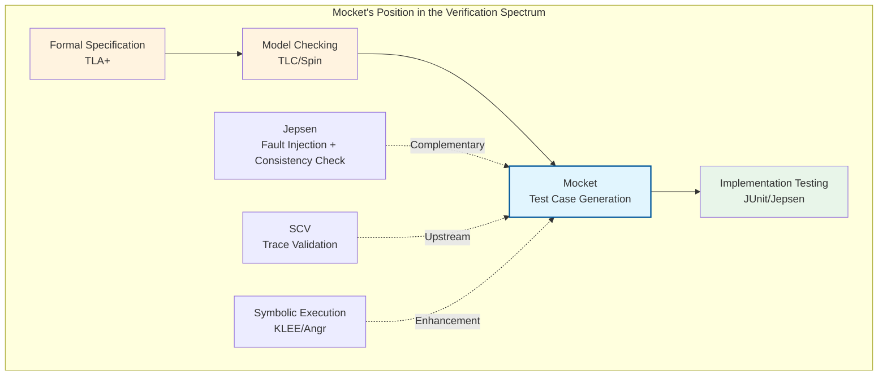
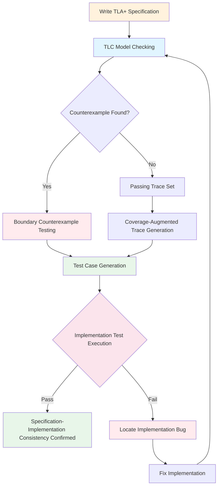
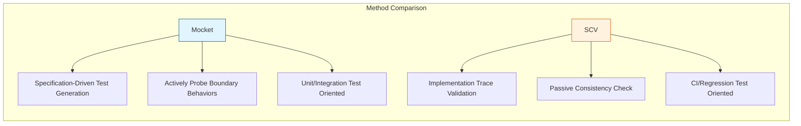

# Model Checking Guided Testing (Mocket)

> **Stage**: Struct/07-tools | **Prerequisites**: [model-checking-practice.md](./model-checking-practice.md), [smart-casual-verification.md](./smart-casual-verification.md), [tla-for-flink.md](./tla-for-flink.md) | **Formalization Level**: L5

> Bridging the gap between formal specifications and distributed system implementations

---

## 1. Definitions

### Def-S-07-17: Model Checking Guided Testing (Mocket)

**Definition (Mocket)**: Model Checking Guided Testing (abbreviated as Mocket) is a verification methodology that combines high-level formal specifications (typically TLA+) with low-level implementation testing. Its core idea is: using boundary behaviors discovered by the model checker in the abstract state space (including counterexample paths and coverage paths) to guide the generation of implementation-level test cases, thereby capturing implementation bugs that deviate from the specification under the premise that the specification is correct.

Formally, the Mocket framework is a triple:

$$
\text{Mocket} = (\text{Spec}, \mathcal{M}, \text{Mapper})
$$

Where:

- $\text{Spec} = (S, S_0, \rightarrow, \Phi)$: Formal specification, containing state set $S$, initial state $S_0$, transition relation $\rightarrow$, and property set $\Phi$
- $\mathcal{M}$: Model checker (such as TLC, Spin, NuSMV), capable of exhaustive or sampled exploration of the state space under finite instantiation
- $\text{Mapper}: \text{Traces}(\text{Spec}) \to \text{TestCases}(\text{Impl})$: A transformation function mapping specification-level execution traces to implementation test cases

**Key Differences from SCV**:

| Dimension | SCV (Smart Casual Verification) | Mocket |
|-----------|--------------------------------|--------|
| Driving Direction | Implementation produces trace → validates against specification | Specification explores paths → generates test cases |
| Core Question | "Does implementation conform to specification?" | "Are specification-revealed boundary behaviors covered in implementation?" |
| Test Generation | Manual or random | Guided by model checker counterexamples/paths |
| Guarantee Type | Conformance checking | Coverage enhancement + targeted fault injection |
| Applicable Phase | Integration testing, CI regression | Unit test design, stress test construction |

### Def-S-07-18: Spec-to-Test Mapping

**Definition**: The spec-to-test mapping $M_{S\to T}$ is a partial function from TLA+ actions to implementation test steps:

$$
M_{S\to T}: \text{Actions}(\text{Spec}) \rightharpoonup \text{TestOps}(\text{Impl})
$$

For each specification action $a \in \text{Actions}(\text{Spec})$, if it has a corresponding operation in the implementation, $M_{S\to T}(a)$ returns a test operation sequence $\langle op_1, op_2, ..., op_k \rangle$. The composition of specification actions is realized through the interleaving of test operation sequences:

$$
M_{S\to T}(a_1 \circ a_2) = M_{S\to T}(a_1) \parallel M_{S\to T}(a_2)
$$

Where $\parallel$ denotes concurrent or interleaved execution.

**Mapping Fidelity** is defined as:

$$
\text{Fidelity}(M_{S\to T}) = \frac{|\{ a \mid M_{S\to T}(a) \text{ well-defined} \}|}{|\text{Actions}(\text{Spec})|}
$$

### Def-S-07-19: Coverage-Augmented Trace

**Definition**: Given a specification trace $\tau_{spec} = \langle s_0, a_0, s_1, a_1, ..., a_{n-1}, s_n \rangle$ generated by the model checker, its coverage-augmented trace $CA(\tau_{spec})$ is the set of test traces obtained by non-deterministically expanding the trace while preserving action semantic equivalence:

$$
CA(\tau_{spec}) = \{ \tau_{test} \mid \alpha(\tau_{test}) = \tau_{spec} \land \tau_{test} \in \text{ValidSchedules}(M_{S\to T}) \}
$$

Where $\alpha$ is the abstraction function mapping test traces back to specification traces. The size of $CA(\tau_{spec})$ depends on the number of internal non-deterministic branches corresponding to each specification action in the implementation.

### Def-S-07-20: Boundary Counterexample Testing

**Definition**: Boundary Counterexample Testing is one of Mocket's core strategies. When the model checker discovers a property violation trace $\tau_{ce}$ in the specification, Mocket attempts to "instantiate" this counterexample into a concrete test input in the implementation:

$$
\text{BCT}(\tau_{ce}) = \arg\min_{\tau_{test} \in CA(\tau_{ce})} \text{dist}(\text{Impl}(\tau_{test}), \text{Violation})
$$

Where $\text{dist}$ measures the proximity of the implementation execution to the target violation state. The goal of BCT is to find the shortest test case that can trigger a bug in the implementation corresponding to the specification counterexample.

---

## 2. Properties

### Lemma-S-07-07: Mocket Coverage Lower Bound

**Lemma**: If model checker $\mathcal{M}$ has completed full verification of specification $\text{Spec}$ (i.e., traversed all reachable states of the parameterized instance), and mapping fidelity $\text{Fidelity}(M_{S\to T}) = 1$, then the test case set $T_{mocket}$ generated by Mocket covers all reachable action sequences in the specification at least once.

**Formal Statement**:

$$
\mathcal{M}(\text{Spec}) \models \phi \land \text{Fidelity} = 1 \Rightarrow \forall \tau_{spec} \in \text{Reachable}(\text{Spec}), \exists \tau_{test} \in T_{mocket}: \alpha(\tau_{test}) = \tau_{spec}
$$

**Proof Sketch**:

1. Full verification guarantees $\mathcal{M}$ enumerates all reachable states of $\text{Spec}$ under finite instantiation
2. Fidelity of 1 guarantees every specification action has a corresponding test operation
3. Mocket generates at least one coverage-augmented trace for each reachable trace
4. Therefore all reachable action sequences have corresponding test cases $\square$

### Prop-S-07-07: Mocket and Model Checking Completeness are Complementary

**Proposition**: Mocket does not enhance model checking completeness, but enhances implementation test coverage of specification boundary behaviors.

$$
\text{Completeness}(\mathcal{M}, \text{Spec}) = \text{Completeness}(\mathcal{M}, \text{Spec}) \quad \text{(unchanged)}
$$

$$
\text{Coverage}(T_{mocket}, \text{Impl}) \geq \text{Coverage}(T_{random}, \text{Impl}) \quad \text{(when specification reveals complex boundaries)}
$$

**Engineering Inference**: When implementation bugs stem from boundary behaviors foreseen by the specification but not covered by tests, Mocket's discovery probability is significantly higher than random testing.

### Lemma-S-07-08: Detection Conditions for "Specification Correct but Implementation Has Bug"

**Lemma**: Let specification $\text{Spec}$ have passed model checking (no counterexamples), and implementation $Impl$ has a bug. Mocket can detect this bug iff:

1. There exists a specification trace $\tau_{spec}$ such that $\tau_{spec} \models \text{Spec}$
2. There exists a corresponding implementation trace $\tau_{impl}$ such that $\alpha(\tau_{impl}) = \tau_{spec}$ but $\tau_{impl} \not\models \text{ExpectedBehavior}$
3. $M_{S\to T}$ can generate test inputs that trigger $\tau_{impl}$

**Explanation**: This lemma precisely characterizes the "specification correct but implementation has bug" scenario — the specification itself has no design flaws, but the implementation deviates from the specification intent. Mocket specifically captures such deviations by guiding tests through specification paths.

---

## 3. Relations

### Mocket Mapping with Existing Verification Techniques



### Mocket vs TLA+ / Jepsen / Implementation-Level Model Checkers

| Tool/Method | Verification Level | Relationship with Mocket | Key Difference |
|-------------|-------------------|--------------------------|----------------|
| **TLA+ / TLC** | Specification | Mocket's upstream input | TLC verifies abstract models, Mocket sinks results to implementation tests |
| **Jepsen** | Implementation | Mocket's downstream complement | Jepsen explores through random fault injection, Mocket guides through specification paths |
| **SPIN (Implementation-level)** | Code model | Similar goal | SPIN verifies manually extracted code models, Mocket directly generates executable implementation tests |
| **Property-based Testing** | Implementation | Methodologically similar | PBT generates random inputs from properties, Mocket generates structured scenarios from specification paths |

**Relationship with TLA+**: TLA+ provides Mocket's "source of truth". Mocket translates TLC's exploration results (including passing traces and counterexample traces) into implementation test cases, forming a closed verification loop from specification to implementation.

**Relationship with Jepsen**: Jepsen excels at discovering consistency vulnerabilities through massive fault injection, but its search is blind. Mocket can provide Jepsen with "targeted fault injection sequences" — boundary scenarios revealed by the specification. Combined, they significantly improve bug discovery efficiency.

---

## 4. Argumentation

### 4.1 Why Mocket? — The "Specification Correct but Implementation Has Bug" Problem

In distributed system verification practice, a common but dangerous assumption is: "If the specification passes model checking, then the system implemented according to the specification is correct." However, this assumption ignores the **Specification-Implementation Gap**.

**Problem Source Analysis**:

1. **Abstraction omission**: The specification omits critical implementation details for verifiability (e.g., memory ordering, GC pauses, network buffer management)
2. **Coding errors**: Programmers introduce logic errors when translating specifications into code
3. **Optimization breakage**: Performance optimizations change execution timing that implicitly matched specification assumptions
4. **Environment differences**: Specification environmental assumptions (e.g., messages lost at most once) don't match the real environment

**Typical Case**: Consider a distributed snapshot protocol. In the specification, barrier receipt and state snapshot are atomic actions:

```tla
ReceiveBarrierAndSnapshot(t) ==
    /\ barriers[t] = TRUE
    /\ taskStates' = [taskStates EXCEPT ![t] = "SNAPSHOT_TAKEN"]
    /\ barriers' = [barriers EXCEPT ![t] = FALSE]
```

But in implementation, these two steps may be split into non-atomic sub-steps: first mark barrier arrival, then asynchronously execute the snapshot in another thread. If the snapshot thread completes state writing after receiving an abort signal, it violates the atomicity assumption in the specification — the specification check passes, but the implementation has a bug.

**Mocket's Solution Strategy**: Mocket expands atomic actions from the specification into multiple possible non-atomic interleavings in test scenarios, actively probing whether the implementation correctly handles these deviations.

### 4.2 From Model Checker Counterexample to Implementation Test Conversion Flow

**Step 1: Counterexample Extraction**

TLC discovers the following counterexample path (simplified):

```
State 1: taskStates = [t1 |-> "RUNNING", t2 |-> "RUNNING"]
         barriers = [t1 |-> TRUE, t2 |-> TRUE]
Action : ReceiveBarrierAndSnapshot("t1")
State 2: taskStates = [t1 |-> "SNAPSHOT_TAKEN", t2 |-> "RUNNING"]
         barriers = [t1 |-> FALSE, t2 |-> TRUE]
Action : CompleteCheckpoint
==> VIOLATION: t2 has not taken snapshot!
```

**Step 2: Counterexample Analysis**

Analyze the boundary condition revealed by the counterexample: After t1 completes its snapshot but before t2 completes its snapshot, the system attempts to complete the checkpoint. This is illegal in the specification but may occur in the implementation due to timing races.

**Step 3: Test Case Generation**

Mocket generates the corresponding concurrency test:

```java
@Test
public void testCheckpointCompletionRace() {
    // Trigger checkpoint, send barriers to t1, t2
    coordinator.triggerCheckpoint(1);

    // t1 completes barrier receipt and snapshot (fast path)
    task1.receiveBarrier();
    task1.takeSnapshot();

    // Attempt to complete checkpoint while t2 has not finished snapshot
    // Implementation should reject or block this operation
    assertThrows(IllegalStateException.class, () -> {
        coordinator.tryCompleteCheckpoint(1);
    });

    // t2 eventually completes snapshot
    task2.receiveBarrier();
    task2.takeSnapshot();

    // Now completion is allowed
    assertTrue(coordinator.tryCompleteCheckpoint(1));
}
```

---

## 5. Proof / Engineering Argument

### Thm-S-07-10: Mocket Correctness Theorem (Engineering Version)

**Theorem**: Let specification $\text{Spec}$ have been verified by the model checker (no counterexamples), and $T_{mocket}$ be the test case set generated by Mocket. If implementation $Impl$ passes all tests in $T_{mocket}$, then within the coverage range of $T_{mocket}$, $Impl$'s behavior is consistent with $\text{Spec}$.

**Formal Statement**:

$$
\forall \tau_{test} \in T_{mocket}: \text{Impl}(\tau_{test}) \models \text{Expected}(\tau_{test}) \Rightarrow \forall \tau_{spec} \in \alpha(T_{mocket}): \exists \tau_{impl}. \alpha(\tau_{impl}) = \tau_{spec} \land \tau_{impl} \models \text{Spec}
$$

**Engineering Argument**:

**Preconditions**:

1. $\text{Spec}$ has passed TLC verification: $\mathcal{M}(\text{Spec}) \models \Phi$
2. Mapping function $M_{S\to T}$ preserves causal structure of actions: if $a$ precedes $b$ in the specification, then $M_{S\to T}(a)$'s test operations precede $M_{S\to T}(b)$'s
3. Test assertions correctly encode specification properties

**Argument Steps**:

1. **Specification Correctness**: Since TLC verification passes, $\text{Spec}$ itself has no design-level safety/liveness violations.

2. **Test Coverage**: For each test case $\tau_{test}$ in $T_{mocket}$, its corresponding specification trace $\alpha(\tau_{test})$ is a legal trace of $\text{Spec}$ (guaranteed by Lemma-S-07-07).

3. **Implementation Consistency**: If $Impl$ passes all tests, then for all specification paths covered by $T_{mocket}$, $Impl$'s behavior will not deviate from $\text{Spec}$'s prediction.

**Boundary Statement**: This theorem is **engineering correctness** rather than **mathematical completeness**. It does not guarantee $Impl$ is correct under all possible executions, only within the coverage range generated by Mocket. Uncovered paths (such as implementation details not modeled by the specification, behaviors beyond parameterized instance scale) may still contain bugs.

**Q.E.D.** (Engineering sense)

### Thm-S-07-11: Mocket vs Random Test Discovery Rate Comparison

**Theorem**: For boundary bugs revealed by the specification that require specific action sequences to trigger, Mocket's expected discovery step upper bound is better than pure random testing.

**Setup**:

- Let triggering a boundary bug require precise action sequence $\sigma^*$, length $k$
- At each step, the implementation has $b$ possible non-deterministic choices
- Random testing independently and uniformly selects branches at each step

**Random Test Discovery Probability**:

$$
P_{random}(\text{find in } n \text{ steps}) = 1 - \left(1 - \frac{1}{b^k}\right)^n
$$

**Mocket Discovery Probability**:

Mocket directly generates test cases corresponding to $\sigma^*$ from the specification path:

$$
P_{mocket}(\text{find}) = 1 \quad \text{(after generating corresponding test case)}
$$

**Expected Step Comparison**:

| Method | Expected Steps | Condition |
|--------|---------------|-----------|
| Random Testing | $O(b^k)$ | Unguided |
| Mocket | $O(k \cdot \text{poly}(|Spec|))$ | Specification verifiable |

**Engineering Inference**: When $b=5, k=8$, random testing's expected steps are approximately $5^8 = 390,625$, while Mocket's test generation complexity is polynomially related to specification scale, typically on the order of thousands.

---

## 6. Examples

### 6.1 Mocket Application in Flink Checkpoint / Barrier Protocol

**Scenario**: Verify Flink Checkpoint coordinator behavior under concurrent failure scenarios.

**TLA+ Specification Fragment**:

```tla
ReceiveBarrier(t) ==
    /\ phase = "PENDING"
    /\ pendingBarriers[t] = TRUE
    /\ taskStates' = [taskStates EXCEPT ![t] = "BARRIER_ARRIVED"]
    /\ pendingBarriers' = [pendingBarriers EXCEPT ![t] = FALSE]
    /\ UNCHANGED <<phase, checkpointId>>

AckCheckpoint(t) ==
    /\ taskStates[t] = "BARRIER_ARRIVED"
    /\ taskStates' = [taskStates EXCEPT ![t] = "ACKED"]
    /\ UNCHANGED <<phase, checkpointId, pendingBarriers>>

CompleteCheckpoint ==
    /\ phase = "PENDING"
    /\ \A t \in Tasks : taskStates[t] = "ACKED"
    /\ phase' = "COMPLETED"
    /\ UNCHANGED <<taskStates, checkpointId, pendingBarriers>>
```

**Boundary Behaviors Discovered by TLC**:

1. **Behavior B1**: All tasks normally receive barrier → ack → complete checkpoint
2. **Behavior B2**: A task fails after receiving barrier but before ack, triggering timeout abort
3. **Behavior B3**: Coordinator receives new checkpoint request while some tasks have already acked
4. **Behavior B4 (Counterexample)**: Coordinator sends new barrier to task t after t has acked old checkpoint but before t resets state

**Mocket-Generated Test Cases**:

```java
public class MocketCheckpointTest {

    // B1: Normal path
    @Test
    public void testNormalCheckpointCompletion() { /* ... */ }

    // B2: Task fails after barrier receipt but before ack
    @Test
    public void testTaskFailureAfterBarrierBeforeAck() {
        coordinator.triggerCheckpoint(1);
        task1.receiveBarrier();

        // Simulate task1 failure before ack
        task1.simulateFailure();

        // Verify coordinator eventually triggers abort or timeout
        await().atMost(Duration.ofSeconds(5))
               .until(() -> coordinator.getPhase(1) == CheckpointPhase.ABORTED);
    }

    // B3: Concurrent checkpoint request
    @Test
    public void testConcurrentCheckpointRequest() {
        coordinator.triggerCheckpoint(1);
        task1.receiveBarrier();
        task1.ackCheckpoint(1);

        // Trigger checkpoint 2 while checkpoint 1 is not yet complete
        assertThrows(CheckpointPendingException.class, () -> {
            coordinator.triggerCheckpoint(2);
        });
    }

    // B4: New barrier arrives before old state reset (implementation test corresponding to specification counterexample)
    @Test
    public void testNewBarrierBeforeStateReset() {
        coordinator.triggerCheckpoint(1);
        task1.completeCheckpointSequence(1); // receive barrier, ack
        coordinator.completeCheckpoint(1);

        // Simulate coordinator failing to notify task1 to reset state in time
        // New barrier for checkpoint 2 should not be allowed immediately
        assertTrue(coordinator.isTaskResetRequired("task1"));

        // Forcing new barrier should be rejected or buffered by implementation
        coordinator.triggerCheckpoint(2);
        assertThat(task1.getPendingBarriers()).doesNotContain(2);
    }
}
```

### 6.2 Mocket Test Generation Toolchain Architecture

```
┌─────────────────────────────────────────────────────────────────┐
│                     Mocket Toolchain Architecture               │
├─────────────────────────────────────────────────────────────────┤
│                                                                 │
│  ┌──────────────┐      ┌──────────────┐      ┌──────────────┐  │
│  │   TLA+ Spec  │─────►│  TLC / Spin  │─────►│ Trace Corpus │  │
│  │              │      │  Model Checker│      │ (Pass + CE)  │  │
│  └──────────────┘      └──────────────┘      └──────┬───────┘  │
│                                                     │           │
│  ┌──────────────────────────────────────────────────┘           │
│  │                                                             │
│  │  ┌─────────────────┐    ┌─────────────────┐    ┌─────────┐ │
│  │  │ Path Analyzer   │───►│ Test Generator  │───►│  JUnit  │ │
│  │  │ (Boundary ID)   │    │ (Test Code Gen) │    │  Tests  │ │
│  │  └─────────────────┘    └─────────────────┘    └────┬────┘ │
│  │                                                     │      │
│  │  ┌─────────────────┐                                │      │
│  │  │  Jepsen Adapter │◄───────────────────────────────┘      │
│  │  │ (Fault Injection)│                                      │
│  │  └─────────────────┘                                       │
│  │                                                             │
│  └─────────────────────────────────────────────────────────────┘
│                              │
│                              ▼
│  ┌───────────────────────────────────────────────────────────┐
│  │                      Implementation (Impl)                 │
│  │                    Flink / CCF / etc.                     │
│  └───────────────────────────────────────────────────────────┘
│
```

---

## 7. Visualizations

### 7.1 Mocket Workflow Diagram



### 7.2 Mocket vs SCV Comparison Matrix



### 7.3 Specification-Implementation-Test Three-Layer Mapping

```mermaid
graph TB
    subgraph "Specification Layer"
        SP1[TLA+ Action: TriggerCheckpoint]
        SP2[TLA+ Action: ReceiveBarrier]
        SP3[TLA+ Action: CompleteCheckpoint]
    end

    subgraph "Implementation Layer"
        IM1[Coordinator.triggerCheckpoint]
        IM2[Task.receiveBarrier + Task.ackCheckpoint]
        IM3[Coordinator.completeCheckpoint]
    end

    subgraph "Test Layer"
        TE1[@Test testTriggerCheckpoint]
        TE2[@Test testBarrierAlignment]
        TE3[@Test testCheckpointCompletionRace]
    end

    SP1 -.-> IM1
    SP2 -.-> IM2
    SP3 -.-> IM3
    IM1 -.-> TE1
    IM2 -.-> TE2
    IM3 -.-> TE3

    SP1 -.->|Counterexample Path| TE3
```

---

## 8. References


---

*Document Version: 1.0 | Created: 2026-04-14 | Status: Complete*
