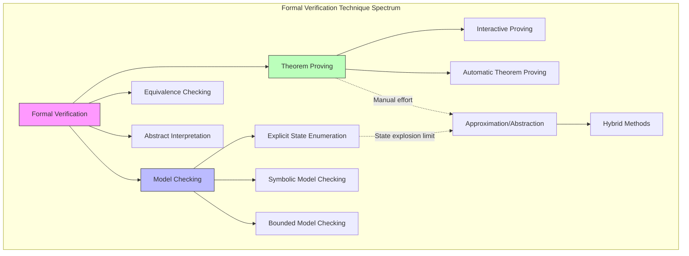
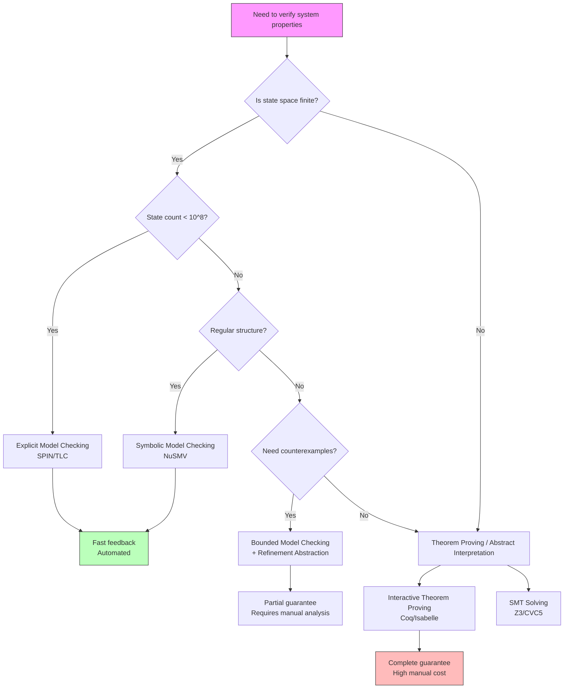
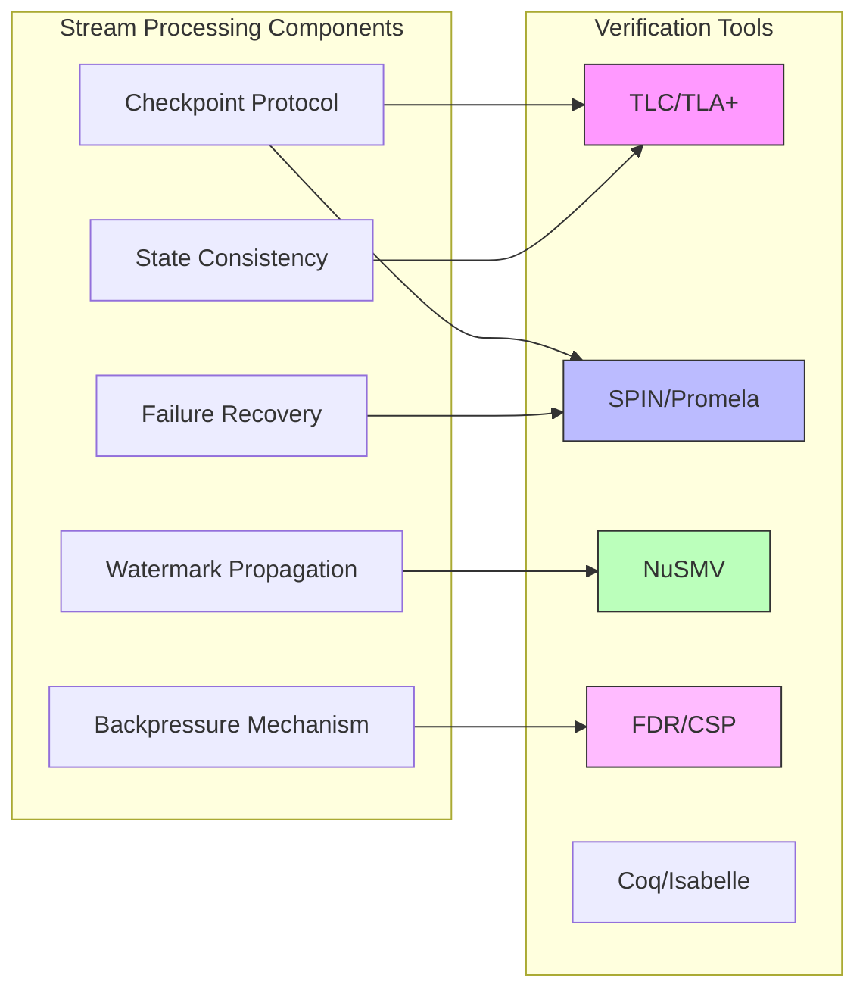

# Model Checking in Stream Processing Verification

> **Stage**: Struct | **Prerequisites**: [00-INDEX.md](../00-INDEX.md) | **Formality Level**: L4

## 1. Definitions

### Def-S-07-10: Model Checking

**Definition**: Model checking is an automated formal verification technique used to check whether a finite-state system satisfies a given temporal logic specification. Given a system model $M = (S, S_0, R, L)$, where:

- $S$ is the finite set of states
- $S_0 \subseteq S$ is the set of initial states
- $R \subseteq S \times S$ is the state transition relation
- $L: S \rightarrow 2^{AP}$ is the labeling function, with $AP$ being the set of atomic propositions

Model checking verifies $M \models \phi$, where $\phi$ is a temporal logic formula. If $M \not\models \phi$, the model checker produces a **counterexample** path, demonstrating the specific execution sequence that leads to the specification violation.

**Intuitive Explanation**: Model checking treats the system as a state machine, exhaustively or symbolically traversing all possible state spaces to automatically verify whether system behavior satisfies desired properties. Unlike testing, it provides mathematical completeness guarantees—if model checking passes, there are no specification-violating bugs at the model abstraction level.

### Def-S-07-11: LTL/CTL Temporal Logic

**Definition**: Temporal logic is a formal language for describing how systems evolve over time.

**LTL (Linear Temporal Logic)** describes properties along a single timeline:

$$\phi ::= p \mid \neg\phi \mid \phi \lor \phi \mid \bigcirc\phi \mid \phi \, \mathcal{U} \, \phi$$

Where:

- $\bigcirc\phi$: "In the next state, $\phi$ holds" (Next)
- $\phi \, \mathcal{U} \, \psi$: "$\phi$ holds continuously until $\psi$ holds" (Until)
- $\Diamond\phi \equiv \top \, \mathcal{U} \, \phi$: "$\phi$ eventually holds" (Eventually)
- $\Box\phi \equiv \neg\Diamond\neg\phi$: "$\phi$ always holds" (Globally)

**CTL (Computation Tree Logic)** quantifies over branching time:

$$\phi ::= p \mid \neg\phi \mid \phi \lor \phi \mid \mathbf{A}\psi \mid \mathbf{E}\psi$$

Where path formulas $\psi$ include:

- $\mathbf{X}\phi$: In all/some paths, the next state satisfies $\phi$
- $\mathbf{F}\phi$: In all/some paths, $\phi$ is eventually satisfied
- $\mathbf{G}\phi$: In all/some paths, $\phi$ is always satisfied
- $\phi \, \mathbf{U} \, \psi$: In all/some paths, $\phi$ holds until $\psi$

**Expressive Power**: LTL is suitable for describing properties on a single execution path (e.g., "a request is always eventually responded to"), while CTL is suitable for describing branching choices (e.g., "there exists a path along which the system can recover"). Their expressive powers are incomparable.

### Def-S-07-12: State Space Explosion

**Definition**: State space explosion refers to the phenomenon where the state space size of the system to be verified grows exponentially with the number of system components. For a system composed of $n$ concurrent components, if each component has $k$ states, the combined state space size is $k^n$ in the worst case.

Formally, let the system be the parallel composition of $n$ finite state machines $M = M_1 \parallel M_2 \parallel \cdots \parallel M_n$. Then:

$$|S_M| = \prod_{i=1}^{n} |S_{M_i}|$$

**Consequence**: State space explosion is the fundamental obstacle to applying model checking to large-scale systems. For stream processing systems (e.g., Flink jobs with hundreds of operators), naive state space construction would lead to memory exhaustion or non-terminating verification.

---

## 2. Properties

### Lemma-S-07-01: Completeness of Model Checking

**Lemma**: For a finite-state system $M$ and an LTL/CTL formula $\phi$, the model checking algorithm is **decidable**.

**Proof Sketch**:

1. A finite-state system has only finitely many paths (in the Büchi automaton sense)
2. An LTL formula can be converted to an equivalent Büchi automaton $A_{\neg\phi}$
3. Checking $M \models \phi$ is equivalent to checking $L(M) \cap L(A_{\neg\phi}) = \emptyset$
4. This intersection non-emptiness can be decided by a graph algorithm in $O(|M| \times |A_{\neg\phi}|)$ time $\square$

### Lemma-S-07-02: Symbolic Model Checking Space Complexity

**Lemma**: Symbolic model checking using BDDs (Binary Decision Diagrams) can reduce space complexity from explicit-state $O(|S|)$ to $O(\log |S|)$ BDD nodes.

**Explanation**: Although in the worst case BDD size is still exponential in the number of states, for systems with regular structure (such as symmetry and locality), BDDs can provide exponential compression.

### Prop-S-07-01: Classifying Verifiable Properties of Stream Processing Systems

**Proposition**: The key properties of stream processing systems can be classified into the following verifiable patterns:

| Property Category | LTL/CTL Expression | Verification Goal |
|-------------------|--------------------|-------------------|
| Safety | $\Box \neg \text{Error}$ | Bad state is never reachable |
| Liveness | $\Box(\text{Request} \rightarrow \Diamond \text{Response})$ | Request is eventually responded to |
| Fairness | $\Box\Diamond \text{Enabled} \rightarrow \Box\Diamond \text{Executed}$ | Infinite opportunities imply infinite executions |
| Consistency | $\mathbf{AG}(\text{Committed} \rightarrow \mathbf{AX} \text{Visible})$ | Immediately visible after commit |
| Termination | $\mathbf{AF} \text{Terminated}$ | All paths eventually terminate |

---

## 3. Relations

### Model Checking vs. Other Verification Methods



### Method Mapping in Stream Processing Verification

| Verification Goal | Recommended Tool | Method Category | Applicable Scenario |
|-------------------|------------------|-----------------|---------------------|
| Checkpoint protocol correctness | TLC / TLA+ | Model checking | Distributed coordination logic |
| Operator state consistency | SPIN / Promela | Model checking | Concurrent state machines |
| Exactly-Once semantics | NuSMV | Symbolic checking | State space compression |
| Backpressure deadlock-freedom | FDR / CSP | Refinement checking | Process algebra modeling |
| Watermark propagation properties | Theorem proving (Coq/Isabelle) | Interactive proving | Complex mathematical properties |
| Type safety | Type system / Liquid Types | Static analysis | Compile-time guarantee |

---

## 4. Argumentation

### 4.1 Advantages and Limitations of Model Checking

**Advantages**:

- **Fully Automatic**: Verification process requires no human intervention; produces counterexamples to guide debugging
- **Precise**: Provides mathematical completeness guarantees at the model level
- **Incremental**: Models can be progressively refined to validate early design decisions

**Limitations**:

- **State Explosion**: Concurrent components cause exponential state space growth
- **Abstraction Overhead**: Converting from code to formal models requires specialized knowledge
- **Property Limitations**: Difficult to verify properties involving infinite domains or complex arithmetic

### 4.2 Modeling Challenges for Stream Processing Systems

Stream processing systems (such as Flink, Spark Streaming) have the following characteristics that increase modeling complexity:

1. **Infinite Data Streams**: Need to be modeled as finite approximations with Watermarks or as parameterized systems
2. **Dynamic Parallelism**: Operator instance count changes at runtime, requiring parameterized modeling
3. **Fault Recovery**: Checkpoint and restore introduce additional non-determinism
4. **Time Semantics**: Event time vs. processing time requires explicit clock modeling

### 4.3 Counterexample Analysis and Debugging Value

One of the core values of model checking is producing **executable counterexamples**. When verification fails, the counterexample path demonstrates the complete execution sequence from the initial state to the violating state. This is particularly important in stream processing debugging:

- **Deadlock counterexample**: Shows the operator interaction sequence that leads to circular waiting
- **Data loss counterexample**: Shows the incomplete checkpoint sequence under specific failure modes
- **Consistency violation counterexample**: Shows the timing conditions for reading uncommitted states

---

## 5. Formal Proof / Engineering Argument

### 5.1 Tool Technical Principles

#### SPIN (Promela)

SPIN uses an **on-the-fly** verification strategy, checking properties simultaneously with state generation, avoiding construction of the complete state graph.

**Core Algorithm**: Nested Depth-First Search (Nested DFS) for detecting accepting cycles (LTL satisfiability).

```
Time complexity: O(|S| + |R|) for explicit enumeration
Space complexity: O(|S|) worst case
```

**Promela Modeling Example** (simplified Checkpoint coordination):

```promela
// Simplified model: Checkpoint coordinator and Task interaction
mtype = { CP_REQUEST, CP_ACK, CP_COMPLETE };

chan coord_to_task = [1] of { mtype };
chan task_to_coord = [1] of { mtype };

proctype Coordinator() {
    do
    :: coord_to_task!CP_REQUEST;
       task_to_coord?CP_ACK;
       task_to_coord?CP_COMPLETE;
    od
}

proctype Task() {
    do
    :: coord_to_task?CP_REQUEST;
       task_to_coord!CP_ACK;
       // Simulate checkpoint execution
       task_to_coord!CP_COMPLETE;
    od
}

init {
    run Coordinator();
    run Task();
}

// LTL property: Request is eventually completed
// ltl p0 { [](cp_requested -> <>cp_completed) }
```

#### NuSMV (Symbolic Model Checking)

NuSMV uses **Ordered Binary Decision Diagrams (OBDD)** to symbolically represent state sets and transition relations.

**Core Advantage**: Achieves state space compression through the canonical form of Boolean functions. For systems with regular structure, BDD size can be logarithmically related to the number of states.

**Key Operations**:

- **Image computation**: $\text{Img}(R, S) = \{ s' \mid \exists s \in S: (s, s') \in R \}$
- **Fixed-point iteration**: Computing $\mu Z . f(Z)$ or $\nu Z . f(Z)$ for CTL model checking

#### TLC (TLA+ Model Checker)

TLC verifies TLA+ specifications, supporting:

- **Explicit state enumeration**: Suitable for medium-scale systems
- **Symmetry reduction**: Automatically identifies and merges symmetric states
- **Distributed model checking**: Supports multi-machine parallel verification

**TLA+ Style Modeling**:

```tla
\* Simplified: State machine for Flink Checkpoint protocol
MODULE CheckpointProtocol

VARIABLES phase, acks

Phases == { "IN_PROGRESS", "COMPLETED", "ABORTED" }

Init ==
    /\ phase = "IN_PROGRESS"
    /\ acks = 0

ReceiveAck ==
    /\ phase = "IN_PROGRESS"
    /\ acks' = acks + 1
    /\ UNCHANGED phase

Complete ==
    /\ phase = "IN_PROGRESS"
    /\ acks = N_TASKS  \* Assumed constant
    /\ phase' = "COMPLETED"
    /\ UNCHANGED acks

Abort ==
    /\ phase = "IN_PROGRESS"
    /\ phase' = "ABORTED"
    /\ UNCHANGED acks

Next == ReceiveAck \/ Complete \/ Abort

\* Invariant: When completed, all acks have been received
Inv == phase = "COMPLETED" => acks = N_TASKS

================================================================
```

#### FDR (CSP Refinement Checking)

FDR verifies **refinement relations** of CSP processes:

- **Trace refinement**: $P \sqsubseteq_T Q$ — All visible behaviors of $Q$ are permitted by $P$
- **Failures refinement**: $P \sqsubseteq_F Q$ — Adds deadlock detection
- **Failures-divergences refinement**: Adds divergence (livelock) detection

**CSP Modeling Advantage**: Process algebra is naturally suitable for describing communication patterns (synchronization, buffering, choice) between operators in stream processing.

### 5.2 Flink Checkpoint Protocol Verification Example

**Protocol Description**:
Flink Checkpoint is an implementation of the distributed snapshot algorithm (Chandy-Lamport variant):

1. Checkpoint Coordinator injects barriers into all Sources
2. Barriers propagate downstream along the data flow
3. Operators snapshot state after receiving barriers from all input streams
4. After snapshot completion, send ACK to Coordinator
5. After all ACKs are received, the Checkpoint is marked COMPLETED

**Key Properties** (expressed in LTL):

**P1 (Consistency)**: Once a Checkpoint completes, all operator states come from the same logical time point:

```
□(completed → ∀op. state(op) ∈ snapshot(cp_id))
```

**P2 (Liveness)**: If the Coordinator triggers a Checkpoint, it eventually completes or explicitly fails:

```
□(triggered → ◇(completed ∨ failed))
```

**P3 (No Duplicate Completion)**: Each Checkpoint ID completes at most once:

```
□(completed(cp) → □¬completed(cp))
```

**Verification Method**:

1. Model the Checkpoint coordination protocol using TLA+
2. Verify the above properties using TLC
3. Extend the model by introducing non-deterministic failures (Task failure, network partition)

### 5.3 Deadlock Detection Case

**Scenario**: Two operators A and B communicate through buffered channels with resource contention.

**CSP Modeling**:

```csp
channel a_to_b, b_to_a : Data

A = a_to_b?x -> B
    [] timeout -> SKIP

B = b_to_a?y -> A
    [] timeout -> SKIP

System = A [| {a_to_b, b_to_a} |] B
```

**FDR Verification**:

- Check deadlock freedom: `assert System :[deadlock free]`
- If it fails, FDR produces a trace showing the deadlock state

**Common Deadlock Patterns in Stream Processing**:

1. **Circular dependency**: Operators form a circular wait with buffers
2. **Barrier alignment deadlock**: Stagnation of an input stream prevents barrier alignment
3. **Resource exhaustion**: Network buffer depletion causes reverse pressure cycles

---

## 6. Examples

### 6.1 TLA+ Verification of Flink Checkpoint Consistency

Complete runnable TLA+ specification:

```tla
------------------------------ MODULE FlinkCheckpoint ------------------------------
EXTENDS Naturals, Sequences, FiniteSets

CONSTANTS Tasks,    \* Task set
          MaxClock  \* Clock upper bound (for finite-state model checking)

VARIABLES taskStates,     \* Local state of each task
          barriers,       \* Barrier positions in channels
          cpStatus,       \* Checkpoint status
          globalClock     \* Global logical clock

vars == <<taskStates, barriers, cpStatus, globalClock>>

\* Task states
TaskState == [phase: {"RUNNING", "BARRIER_ARRIVED", "SNAPSHOT_TAKEN"}]

\* Checkpoint states
CpState == { "NONE", "PENDING", "COMPLETED", "ABORTED" }

Init ==
    /\ taskStates = [t \in Tasks |-> [phase |-> "RUNNING"]]
    /\ barriers = [t \in Tasks |-> FALSE]  \* Barriers not yet received
    /\ cpStatus = "NONE"
    /\ globalClock = 0

\* Trigger Checkpoint
TriggerCp ==
    /\ cpStatus = "NONE"
    /\ cpStatus' = "PENDING"
    /\ barriers' = [t \in Tasks |-> TRUE]  \* Send barriers to all tasks
    /\ UNCHANGED <<taskStates, globalClock>>

\* Task receives barrier
ReceiveBarrier(t) ==
    /\ barriers[t] = TRUE
    /\ taskStates[t].phase = "RUNNING"
    /\ taskStates' = [taskStates EXCEPT ![t].phase = "BARRIER_ARRIVED"]
    /\ barriers' = [barriers EXCEPT ![t] = FALSE]
    /\ UNCHANGED <<cpStatus, globalClock>>

\* Task takes snapshot
TakeSnapshot(t) ==
    /\ taskStates[t].phase = "BARRIER_ARRIVED"
    /\ taskStates' = [taskStates EXCEPT ![t].phase = "SNAPSHOT_TAKEN"]
    /\ UNCHANGED <<barriers, cpStatus, globalClock>>

\* Complete Checkpoint
CompleteCp ==
    /\ cpStatus = "PENDING"
    /\ \A t \in Tasks : taskStates[t].phase = "SNAPSHOT_TAKEN"
    /\ cpStatus' = "COMPLETED"
    /\ globalClock' = globalClock + 1
    /\ UNCHANGED <<taskStates, barriers>>

\* Time advance (for liveness verification)
Tick ==
    /\ globalClock < MaxClock
    /\ globalClock' = globalClock + 1
    /\ UNCHANGED <<taskStates, barriers, cpStatus>>

Next ==
    \/ TriggerCp
    \/ \E t \in Tasks : ReceiveBarrier(t) \/ TakeSnapshot(t)
    \/ CompleteCp
    \/ Tick

\* ==== Verification Properties ====

\* Type invariant
TypeInv ==
    /\ \A t \in Tasks : taskStates[t].phase \in {"RUNNING", "BARRIER_ARRIVED", "SNAPSHOT_TAKEN"}
    /\ cpStatus \in CpState

\* Safety: When completed, all tasks must have taken snapshots
Safety ==
    cpStatus = "COMPLETED" =>
        \A t \in Tasks : taskStates[t].phase = "SNAPSHOT_TAKEN"

\* Liveness: If Pending, eventually completes (within finite clock)
Liveness ==
    cpStatus = "PENDING" ~> cpStatus = "COMPLETED"

================================================================================
```

**TLC Verification Command**:

```bash
tlc -config Checkpoint.cfg FlinkCheckpoint.tla
```

### 6.2 SPIN Verification of Deadlock Freedom

Verify deadlock freedom of a stream processing operator chain:

```promela
#define N 3  // Number of operators

// Operator states
mtype = { IDLE, PROCESSING, WAITING, DONE };
mtype state[N];

// Message channels
chan ch[N] = [2] of { int };

// Operator process
proctype Operator(int id) {
    do
    :: state[id] == IDLE ->
        ch[id]?_;  // Receive input
        state[id] = PROCESSING;
    :: state[id] == PROCESSING ->
        if
        :: (id < N-1) ->
            ch[id+1]!1;  // Send downstream
            state[id] = IDLE;
        :: (id == N-1) ->
            state[id] = DONE;
        fi
    :: state[id] == DONE ->
        break;
    od
}

// Source operator (continuously produces data)
proctype Source() {
    do
    :: ch[0]!1;
    od
}

init {
    atomic {
        int i;
        for (i : 0 .. N-1) {
            state[i] = IDLE;
        }
        run Source();
        for (i : 0 .. N-1) {
            run Operator(i);
        }
    }
}

// LTL: No global deadlock (at least one process can execute)
// ltl deadlock_free { [](<>(state[0] != DONE || state[1] != DONE || state[2] != DONE)) }
```

**SPIN Verification**:

```bash
spin -a deadlock_check.pml
gcc -o pan pan.c
./pan -a  # Verify acceptance conditions
```

---

## 7. Visualizations

### 7.1 Model Checking Tool Comparison Matrix

```mermaid
graph TB
    subgraph "Tool Capability Comparison"
        direction TB

        Tools["Model Checking Tools"] --> Spin["SPIN / Promela"]
        Tools --> NuSMV["NuSMV"]
        Tools --> TLC["TLC / TLA+"]
        Tools --> FDR["FDR / CSP"]

        Spin --> S1["Explicit State Enumeration"]
        Spin --> S2["LTL Verification"]
        Spin --> S3["On-the-fly"]
        Spin --> S4["Suitable for: Async Concurrency"]

        NuSMV --> N1["Symbolic Model Checking"]
        NuSMV --> N2["CTL/LTL Verification"]
        NuSMV --> N3["BDD Compression"]
        NuSMV --> N4["Suitable for: Hardware/Sync Systems"]

        TLC --> T1["Explicit Enumeration"]
        TLC --> T2["TLA+ Specifications"]
        TLC --> T3["Symmetry Reduction"]
        TLC --> T4["Suitable for: Distributed Algorithms"]

        FDR --> F1["Refinement Checking"]
        FDR --> F2["CSP Process Algebra"]
        FDR --> F3["Deadlock/Livelock Detection"]
        FDR --> F4["Suitable for: Communication Protocols"]
    end

    style Tools fill:#f9f,stroke:#333,stroke-width:2px
    style Spin fill:#bbf,stroke:#333
    style NuSMV fill:#bfb,stroke:#333
    style TLC fill:#fbf,stroke:#333
    style FDR fill:#fbb,stroke:#333
```



### 7.2 Decision Tree: When to Use Model Checking vs. Theorem Proving



### 7.3 Stream Processing System Verification Method Mapping



---

## 8. Practical Guide: Model Checking vs. Theorem Proving

### 8.1 Scenarios for Choosing Model Checking

| Characteristic | Description |
|----------------|-------------|
| Finite state space | System can be abstracted as a finite state machine with controllable state count (<10^8) |
| Concurrency-dominated | Core complexity comes from process/thread interaction rather than complex computation |
| Protocol verification | Need to verify correctness of communication protocols and coordination algorithms |
| Fast feedback | Need automated tools to quickly discover counterexamples |
| Deadlock/liveness detection | Need to verify system deadlock-freedom, request eventual response, and other temporal properties |

**Typical Stream Processing Use Cases**:

- Liveness and safety of Checkpoint coordination protocols
- Deadlock freedom of inter-operator data exchange
- Correctness of barrier alignment algorithms
- Fairness of task scheduling strategies

### 8.2 Scenarios for Choosing Theorem Proving

| Characteristic | Description |
|----------------|-------------|
| Infinite-state systems | Involve unbounded data structures, real-time parameters, continuous values |
| Complex invariants | Invariants requiring inductive proofs involve complex mathematics |
| Refinement correctness | Need to prove refinement relation from high-level spec to low-level implementation |
| Completeness requirement | Need the highest level of mathematical certainty |
| Algorithm correctness | Mathematical properties of core stream processing algorithms (e.g., window computation, state backends) |

**Typical Stream Processing Use Cases**:

- Mathematical relationship between Watermark and Event Time
- Correctness proof of window aggregation algorithms
- End-to-end proof of Exactly-Once semantics
- Completeness of distributed snapshot algorithms

### 8.3 Best Practices for Hybrid Methods

**Recommended Workflow**:

1. **Early design phase**: Use TLA+ / PlusCal to model core protocols, use TLC to verify key properties
2. **Implementation phase**: Use Isabelle/HOL for function-level correctness proofs of core algorithm modules
3. **Integration testing**: Use SPIN to verify deadlock freedom of concurrent interactions
4. **Regression verification**: Integrate model checking into CI to verify that design changes do not break verified properties

**Toolchain Integration Example**:

```
Design Document (TLA+)
    ↓ TLC verification
Abstract model verification passes
    ↓ Refine to
Implementation code
    ↓ Extract
Verification Conditions (VCC/Frama-C)
    ↓ SMT solving
Code-level property verification
```

---

## 9. References
