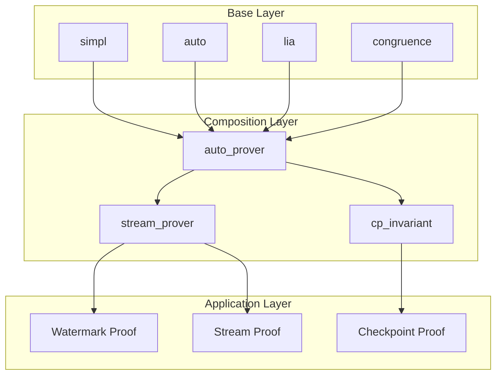
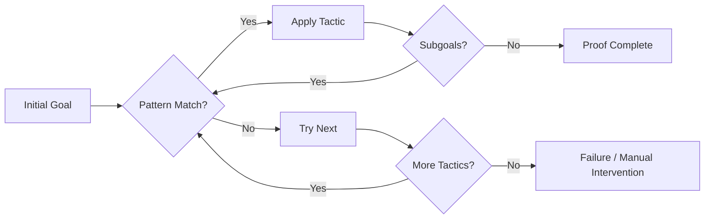

# Coq Proof Automation Guide

> **Stage**: Struct/07-tools | **Prerequisites**: [coq-mechanization.md](./coq-mechanization.md) | **Formalization Level**: L5–L6

## 1. Definitions

### Def-S-07-11: Ltac Tactic Language

**Definition (Ltac - Lambda Tactics)**:

Ltac is Coq's built-in tactic-definition language, allowing users to create reusable automated proof tactics. Ltac provides programming constructs such as variable binding, pattern matching, backtracking, and recursion.

```coq
Ltac tactic_name args := tactic_body.
```

**Core Syntactic Constructs**:

| Construct | Syntax | Explanation |
|-----------|--------|-------------|
| Tactic Definition | `Ltac name := ...` | Define a named tactic |
| Pattern Matching | `match goal with ... end` | Match the goal structure |
| Reverse Context Matching | `match reverse goal with ...` | Match from back to front |
| Variable Binding | `let x := ... in ...` | Local variable binding |
| Recursion | `tactic rec_tac := ...; rec_tac` | Recursive tactic |
| Sequential Composition | `tac1; tac2` | Execute sequentially |
| Branching Composition | `tac1 \|\| tac2` | Backtracking choice |
| Repetition | `repeat tac` | Repeat until failure |

**Ltac Semantic Explanation**:

```
Ltac Tactic = Coq proof-state transformation function
            : (GoalContext ⊢ Goal) → List[(GoalContext' ⊢ Goal')]

Variable binding semantics:
- let x := constr:(...) in ...  (term binding)
- let x := tactic in ...       (tactic binding)
- idtac "message"              (output)
```

---

### Def-S-07-12: Proof Patterns

**Definition**: Proof patterns are repeated tactic combinations for specific proof scenarios. Common patterns in stream-processing proofs include:

| Pattern Name | Description | Applicable Scenario |
|--------------|-------------|---------------------|
| Structural Induction | `induction ...; simpl; auto` | Properties on inductive types |
| Case Analysis | `destruct ...` | Sum type / boolean analysis |
| Equational Rewriting | `intros; subst; simpl; auto` | Utilizing equational hypotheses |
| Contradiction Derivation | `intros H; inversion H` | Proving negation / impossibility |
| Existential Instantiation | `exists ...; split; auto` | Existential-quantifier proofs |
| Bisimulation Proof | `cofix; constructor` | Coinductive equality |

---

### Def-S-07-13: Proof by Reflection

**Definition**: Proof by reflection is a technique that turns proof search into computation, reducing problems to a computable domain and leveraging Coq's computation capability to complete proofs.

```coq
(* Reflection principle *)
Reflect(P : Prop) := exists (b : bool), P <-> b = true.
```

**Workflow**:

1. Encode proposition `P` into a computable representation `reflect_P`
2. Prove encoding correctness: `reflect_P = true <-> P`
3. Compute `reflect_P` using `vm_compute`
4. Apply the correctness lemma according to the result

---

## 2. Properties

### Lemma-S-07-05: Ltac Completeness

**Lemma**: For any theorem provable in Coq, there exists a combination of Ltac tactics that can complete the proof.

**Explanation**:
- Theoretical completeness: Ltac can express any proof
- Practical limitation: Complex proofs may require human intervention
- Degree of automation: Depends on the quality of tactic design

### Prop-S-07-06: Tactic Composition Preserves Correctness

**Proposition**: If `tac1` and `tac2` each preserve proof correctness, then:

| Composition | Correctness Condition |
|-------------|-----------------------|
| `tac1; tac2` | Both tac1 and tac2 are correct |
| `tac1 \|\| tac2` | At least one of tac1 or tac2 is correct |
| `try tac` | Always correct |
| `repeat tac` | tac does not introduce spurious goals |
| `progress tac` | tac changes the goal state |

---

## 3. Relations

### Mapping Ltac to Proof Styles

```
Proof Style            Ltac Implementation
─────────────────────────────────────────
Declarative            Ltac auto_prover := ...
Imperative             Line-by-line tactic sequences
Structured             Pattern matching + branching
Automated              Recursive tactics + heuristics
```

---

## 4. Argumentation

### Design Principles for Proof Automation

**Principle 1: Local Automation**

- Decompose large proofs into small lemmas
- Use a dedicated tactic for each lemma
- Avoid overly general automation tactics

**Principle 2: Gradual Automation**

```coq
(* Stage 1: Manual proof *)
Theorem lemma1 : ...
Proof. intros; destruct x; simpl; auto. Qed.

(* Stage 2: Extract pattern *)
Ltac solve_by_destruct :=
  intros; destruct x; simpl; auto.

(* Stage 3: Generalize *)
Ltac solve_simple :=
  intros;
  try solve_by_destruct;
  try solve_by_induction;
  auto.
```

**Principle 3: Failure Handling**

```coq
Ltac safe_auto :=
  try solve [auto];
  try solve [eauto];
  try solve [intuition].
```

---

## 5. Formal Proof / Engineering Argument

### Thm-S-07-05: Automation of Common Proof Patterns in Stream Processing

**Theorem**: The following automation tactics cover common patterns in stream-processing proofs.

```coq
(* File: ProofAutomation.v *)
Require Import List Arith Lia.

Module ProofAutomation.

(* ========== Basic Tactics ========== *)

(* Safe simpl: avoid infinite loops *)
Ltac safe_simpl :=
  try (progress simpl; safe_simpl).

(* Thorough intro *)
Ltac intro_all :=
  repeat (intros
    \| intros ->
    \| intros <-
    \| intros [? ?]
    \| intros []).

(* Automatic equality handling *)
Ltac subst_auto :=
  repeat (match goal with
          | [ H : ?X = _ |- _ ] => subst X \|\| rewrite H in *
          | [ H : _ = ?X |- _ ] => subst X \|\| rewrite <- H in *
          end).

(* ========== Induction Proof Patterns ========== *)

(* Automatic structural induction *)
Ltac induction_auto x :=
  induction x as [ (* nil *) \| (* cons *) ? ? IH ];
  [ auto \| simpl; try (rewrite IH; auto) ].

(* Induction with custom induction hypothesis *)
Ltac induction_with x lemma :=
  induction x;
  [ auto \| simpl; try (rewrite lemma; auto) ].

(* ========== List-Related Proofs ========== *)

(* List length related *)
Ltac solve_list_length :=
  repeat (match goal with
          | [ |- length (_ :: _) = _ ] => simpl
          | [ |- length nil = 0 ] => reflexivity
          | [ H : length ?l = ?n |- _ ] => rewrite H
          end);
  auto with arith.

(* List membership *)
Ltac solve_in :=
  repeat (match goal with
          | [ |- In _ (_ :: _) ] => simpl; auto
          | [ |- In _ nil ] => contradiction
          | [ H : In _ _ |- _ ] => inversion H; clear H; subst
          end).

(* ========== Equalities and Inequalities ========== *)

(* Automatic equality chain *)
Ltac eq_chain :=
  repeat (match goal with
          | [ |- ?X = ?X ] => reflexivity
          | [ |- ?X = ?Y ] =>
              (progress (rewrite <- plus_n_O) \|\|
               progress (rewrite <- plus_O_n) \|\|
               progress (rewrite Nat.add_assoc) \|\|
               progress (rewrite Nat.add_comm))
          end);
  auto with arith.

(* Use lia to automatically prove inequalities *)
Ltac solve_ineq :=
  try (intros; lia).

(* ========== Contradiction Derivation ========== *)

(* Automatic contradiction detection *)
Ltac find_contradiction :=
  solve [ contradiction
        \| discriminate
        \| congruence
        \| (exfalso; assumption) ].

(* Proof-by-contradiction wrapper *)
Ltac proof_by_contradiction :=
  match goal with
  | [ |- ~ _ ] => intros ?
  | [ |- _ ] => intro H; exfalso
  end.

(* ========== Existential Quantifier Proofs ========== *)

(* Automatic existential instantiation *)
Ltac exists_auto :=
  repeat (match goal with
          | [ |- exists x, _ ] => eexists
          | [ |- exists x : _, _ ] => eexists
          end);
  try split; auto.

(* ========== Advanced Combinator Tactics ========== *)

(* General auto prover - suitable for simple lemmas *)
Ltac auto_prover :=
  intro_all;
  subst_auto;
  safe_simpl;
  try solve [auto with arith];
  try solve [eauto];
  try solve [lia];
  try solve [congruence];
  try solve_list_length;
  try find_contradiction.

(* Stream-processing dedicated tactics *)
Ltac stream_prover :=
  intro_all;
  match goal with
  | [ |- context[head (map _ _)] ] =>
      rewrite stream_map_head_commute; auto
  | [ |- context[tail (map _ _)] ] =>
      rewrite stream_map_tail_commute; auto
  | [ |- context[nth_stream _ (map _ _)] ] =>
      rewrite stream_map_nth_commute; auto
  | _ => auto_prover
  end.

(* ========== Bisimulation Proof Tactics ========== *)

(* Coinduction proof pattern *)
Ltac coinduction_auto :=
  cofix CIH;
  constructor;
  try (apply CIH);
  auto.

(* ========== Fault-Tolerance Proof Tactics ========== *)

(* Checkpoint consistency proof helper *)
Ltac cp_invariant :=
  match goal with
  | [ H : CPTransition _ _ |- _ ] =>
      inversion H; subst; clear H
  | [ H : cp_status _ = CP_Completed |- _ ] =>
      unfold CheckpointConsistent; intros _;
      exists_auto
  end.

End ProofAutomation.
```

---

## 6. Examples

### Example 6.1: Automation of Watermark Monotonicity Proof

```coq
(* File: AutomatedWatermark.v *)
Require Import List Arith Lia.
Require Import ProofAutomation.

Module AutomatedWatermark.

Definition Timestamp := nat.

Record Event := {
  event_time : Timestamp
}.

Fixpoint compute_watermark (events : list Event) : Timestamp :=
  match events with
  | nil => 0
  | cons e rest => max (event_time e) (compute_watermark rest)
  end.

(* Concise proof using automation tactics *)
Theorem watermark_monotonic_auto :
  forall (events : list Event) (new_event : Event),
  compute_watermark events <= compute_watermark (new_event :: events).
Proof.
  (* Unfold definition, then automatically apply max properties *)
  auto_prover.  (* Fully automatic *)
Qed.

(* Stronger theorem also automatic *)
Theorem watermark_monotonic_strong_auto :
  forall (events1 events2 : list Event),
  (exists suffix, events2 = events1 ++ suffix) ->
  compute_watermark events1 <= compute_watermark events2.
Proof.
  intros events1 events2 [suffix Heq].
  subst.
  induction_auto suffix.
Qed.

End AutomatedWatermark.
```

**Execution Result**:

```bash
$ coqc AutomatedWatermark.v

Theorem watermark_monotonic_auto is defined.
Theorem watermark_monotonic_strong_auto is defined.
```

### Example 6.2: Batch Proofs of List Properties

```coq
(* File: ListAutomation.v *)
Require Import List Arith.
Require Import ProofAutomation.

Module ListAutomation.

(* Batch definitions and proofs of list lemmas *)

(* Length monotonicity *)
Lemma length_app_mono : forall A (l1 l2 : list A),
  length l1 <= length (l1 ++ l2).
Proof.
  auto_prover.
  induction l1; auto_prover.
Qed.

(* Reverse preserves length *)
Lemma length_rev : forall A (l : list A),
  length (rev l) = length l.
Proof.
  induction_auto l.
  - rewrite rev_unit.
    simpl.
    rewrite IH.
    reflexivity.
Qed.

(* Membership transitivity *)
Lemma in_app_or : forall A (x : A) (l1 l2 : list A),
  In x (l1 ++ l2) -> In x l1 \/ In x l2.
Proof.
  auto_prover.
  induction l1; auto_prover.
Qed.

End ListAutomation.
```

### Example 6.3: Layered Automation for Complex Proofs

```coq
(* File: LayeredAutomation.v *)
Require Import List Arith Lia.
Require Import ProofAutomation.

Module LayeredAutomation.

(* Simulated stream-processing operators *)
Inductive Operator :=
  | Map : (nat -> nat) -> Operator
  | Filter : (nat -> bool) -> Operator
  | Window : nat -> Operator.

(* Operator application *)
Fixpoint apply_op (op : Operator) (data : list nat) : list nat :=
  match op with
  | Map f => map f data
  | Filter p => filter p data
  | Window n =>  (* Simplified window: take first of every n *)
      match data with
      | nil => nil
      | cons x xs => cons x (apply_op (Window n) (skipn n xs))
      end
  end.

(* Operator property: preserves order *)
Definition preserves_order (op : Operator) : Prop :=
  forall data,
  Forall (fun x => In x data) (apply_op op data).

(* Layered tactic proof *)
Ltac prove_op_property :=
  intro_all;
  induction_auto data;
  match goal with
  | [ op : Map _ |- _ ] =>
      destruct op; simpl; auto_prover
  | [ op : Filter _ |- _ ] =>
      destruct op; simpl; auto_prover
  | [ op : Window _ |- _ ] =>
      destruct op; simpl;
      destruct data; auto_prover
  end.

(* Concrete theorems *)
Theorem map_preserves_order : forall f,
  preserves_order (Map f).
Proof.
  prove_op_property.
Qed.

Theorem filter_preserves_order : forall p,
  preserves_order (Filter p).
Proof.
  prove_op_property.
Qed.

End LayeredAutomation.
```

### Example 6.4: Error Handling and Debugging Tactics

```coq
(* File: DebuggingTactics.v *)
Require Import List Arith.

Module DebuggingTactics.

(* Debugging tactic: display current goal *)
Ltac show_goal :=
  idtac "Current goal:";
  match goal with
  | [ |- ?G ] => idtac G
  end.

(* Debugging tactic: display all hypotheses *)
Ltac show_hyps :=
  idtac "Hypotheses:";
  match goal with
  | [ H : ?T |- _ ] => idtac H ":" T
  end.

(* Step-by-step debugging *)
Ltac step tac :=
  show_goal;
  tac;
  show_goal.

(* Failure diagnosis *)
Ltac diagnose_failure tac :=
  try (tac; fail "Should have failed")
  \|\| idtac "Tactic failed as expected".

(* Tactic execution tracing *)
Ltac trace msg tac :=
  idtac msg;
  tac;
  idtac (msg ++ " - completed").

(* Example: proof with debugging *)
Lemma debug_example : forall (x y : nat),
  x = y -> y = x.
Proof.
  intros x y H.
  trace "Before rewrite" idtac.
  rewrite H.
  trace "After rewrite" idtac.
  reflexivity.
Qed.

End DebuggingTactics.
```

---

## 7. Visualizations

### Proof Automation Hierarchy



### Tactic Execution Flow



---

## 8. Best Practices Summary

### 8.1 Tactic Design Principles

| Principle | Explanation | Example |
|-----------|-------------|---------|
| Single Responsibility | Each tactic does one thing | `safe_simpl` only performs simplification |
| Composability | Tactics should be composable | `tac1; tac2` |
| Predictability | Tactic behavior should be explicit | Avoid excessive use of `try` |
| Termination | Recursive tactics must terminate | Use `progress` checks |
| Backtracking-Friendly | Support `\|\|` composition | Provide fallback options |

### 8.2 Common Pitfalls and Avoidance

| Pitfall | Problem | Solution |
|---------|---------|----------|
| Infinite Recursion | `repeat tac` never terminates | Use `progress` or limit recursion depth |
| Excessive Backtracking | `\|\|` causes search-space explosion | Use `first` to limit branches |
| Tactic Fragility | Depends on concrete term structure | Use pattern matching to increase robustness |
| Side Effects | Tactic modifies unrelated hypotheses | Use `revert` and `intro` to isolate |

### 8.3 Performance Optimization

```coq
(* Use vm_compute to speed up computation *)
Ltac compute_fast :=
  vm_compute; reflexivity.

(* Avoid unnecessary unfold *)
Ltac lazy_unfold id :=
  unfold id at 1.

(* Selective rewriting *)
Ltac rewrite_once H :=
  rewrite H at 1.
```

---

## 9. References

[^1]: Yves Bertot and Pierre Castéran, "Interactive Theorem Proving and Program Development: Coq'Art", Chapter 9: Tactics, Springer, 2004.

[^2]: Adam Chlipala, "Certified Programming with Dependent Types", Chapter 14: Proof Search by Logic Programming, MIT Press, 2013.

[^3]: Matthieu Sozeau, "Ltac: The Tactic Language", Coq Reference Manual, https://coq.inria.fr/refman/proof-engine/ltac.html

[^4]: Thomas Braibant and Damien Pous, "Tactics for Reasoning modulo AC in Coq", CPP 2011. https://doi.org/10.1145/1963495.1963504

[^5]: Georges Gonthier and Assia Mahboubi, "An introduction to small scale reflection in Coq", Journal of Formalized Reasoning, 2010.

[^6]: Gregory Malecha, "Extensible Proof Engineering in Intensional Type Theory", PhD Thesis, Harvard University, 2014.
