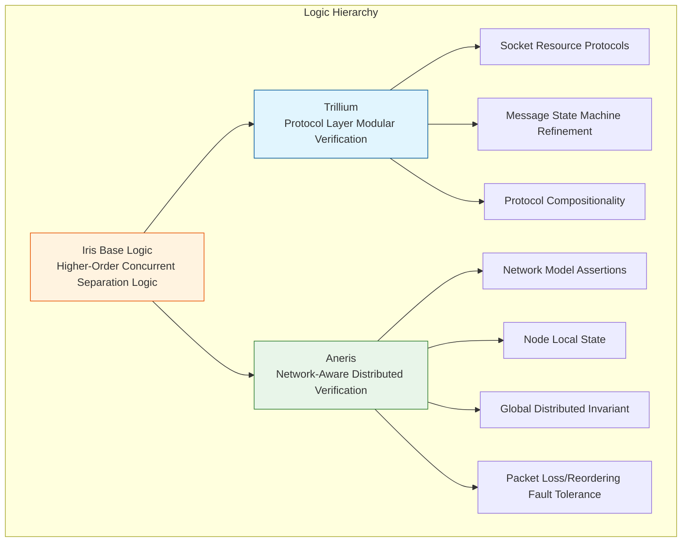
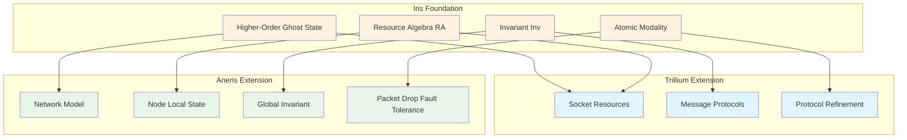

# Trillium and Aneris: Network-Aware Distributed Program Verification

> **Stage**: Struct/07-tools | **Prerequisites**: [iris-separation-logic.md](./iris-separation-logic.md) | **Formalization Level**: L6

---

## 1. Concept Definitions (Definitions)

### Def-S-07-24: Trillium — A Modular Verification Framework for Network Protocols

**Definition**: Trillium is a verification framework built on top of Iris higher-order concurrent separation logic, specifically designed for the modular, compositional verification of **protocol layer and implementation layer** in network protocols and distributed systems. The core idea of Trillium is to model network protocol specifications as "resource protocols" and associate these protocols with underlying implementation code through Iris ghost state.

Formally, the Trillium verification target is a triple:

$$
\text{Trillium} = (P_{net}, P_{impl}, \Gamma)
$$

Where:

- $P_{net}$: Network protocol specification, describing message formats, state machine transitions, and timing constraints
- $P_{impl}$: Protocol implementation code (e.g., socket operations, message handling functions)
- $\Gamma$: Trillium protocol logic, establishing the refinement relationship between $P_{net}$ and $P_{impl}$ through Iris assertions

The key innovation of Trillium is **protocol compositionality**: if protocols $A$ and $B$ are verified separately, the verification of their composition $A \parallel B$ can be obtained by composing their respective proofs, without re-verifying the entire system.

### Def-S-07-25: Aneris — A Network-Aware Distributed Program Verification Logic

**Definition**: Aneris is an extension of Iris logic, specifically designed for verifying **network-aware distributed programs**. Unlike Trillium, which focuses on the protocol layer, Aneris concerns itself with the end-to-end correctness of distributed applications running under real network semantics (including packet loss, reordering, duplication, and delay).

The core constructs of Aneris include:

1. **Network Model Assertion** ($\text{Net}(n, m)$): Node $n$ may receive message $m$
2. **Node Local State Assertion** ($\ell \mapsto_n v$): Node $n$'s local memory location $\ell$ stores value $v$
3. **Global Invariant** ($GInv$): Distributed invariant spanning all nodes
4. **Network Refinement Relation** ($\sqsubseteq_{net}$): Implementation program refines high-level distributed specification under network semantics

Aneris explicitly models the network as a **non-deterministic message passing system**, allowing verifiers to directly express packet loss, retransmission, and other network phenomena in the logic.

### Def-S-07-26: Distributed Refinement Relation (Distributed Refinement)

**Definition**: In the Trillium/Aneris framework, the distributed refinement relation $\sqsubseteq_{dist}$ connects high-level distributed specifications $Spec_{dist}$ and low-level implementations $Impl_{dist}$:

$$
Impl_{dist} \sqsubseteq_{dist} Spec_{dist}
$$

Its meaning is: for any network behavior (including packet loss, reordering, and delay), the set of observable behaviors produced by $Impl_{dist}$ is a subset of the behaviors allowed by $Spec_{dist}$.

Formally, let $\mathcal{O}(P, \mathcal{N})$ denote the set of observable traces of program $P$ under network environment $\mathcal{N}$:

$$
Impl_{dist} \sqsubseteq_{dist} Spec_{dist} \iff \forall \mathcal{N}. \mathcal{O}(Impl_{dist}, \mathcal{N}) \subseteq \mathcal{O}(Spec_{dist}, \mathcal{N})
$$

---

## 2. Property Derivation (Properties)

### Lemma-S-07-09: Trillium Protocol Compositionality

**Lemma**: Let protocols $P_1$ and $P_2$ be verified in Trillium as refining their specifications ($P_1 \sqsubseteq S_1$, $P_2 \sqsubseteq S_2$), and suppose $P_1$ and $P_2$ use disjoint socket resources and message spaces. Then their parallel composition satisfies:

$$
P_1 \parallel P_2 \sqsubseteq S_1 \parallel S_2
$$

**Proof Sketch**:

1. By the Frame Rule of Iris separation logic, $P_1$'s verification remains valid in $P_2$'s resource context
2. Disjoint socket/message spaces guarantee non-interference between $P_1$ and $P_2$
3. The semantics of parallel composition is guaranteed by the definition of $\parallel$; the composed observable traces are interleavings of the two protocol traces
4. Since $S_1$ allows all behaviors of $P_1$, and $S_2$ allows all behaviors of $P_2$, $S_1 \parallel S_2$ allows all legal interleavings
5. Therefore $P_1 \parallel P_2 \sqsubseteq S_1 \parallel S_2$. $\square$

### Prop-S-07-08: Aneris Verification Completeness for Network Failures

**Proposition**: If distributed program $P$ is verified in Aneris satisfying global invariant $GInv$, then for any failure mode allowed by the Aneris network model (packet loss, duplication, reordering, arbitrary delay), $P$'s execution preserves $GInv$.

$$
\vdash_{Aneris} \{ GInv \} P \{ GInv \} \Rightarrow \forall \mathcal{N} \in \text{AnerisNetModel}. P \models_{\mathcal{N}} GInv
$$

**Note**: The Aneris network model is **downward closed** — if the program is correct under the strongest interfering network, it is also correct under any weaker network assumption.

---

## 3. Relations Establishment (Relations)

### Relationship Between Trillium, Aneris, and Iris



**Iris as Foundation**: Both Trillium and Aneris are built on Iris's higher-order ghost state, invariants, and atomicity modalities. Without Iris's modular proof mechanisms, neither framework could achieve compositional verification.

**Trillium's Positioning**: Trillium is Iris's specialization in the **network protocol** direction. It models network sockets, message buffers, and other resources as Iris resource algebras, enabling protocol implementation verification to be modularly composed like concurrent data structures.

**Aneris's Positioning**: Aneris is Iris's specialization in the **distributed systems** direction. It models the entire network environment as an "external process" in Iris, where each distributed node is an independent concurrent program, and nodes communicate through non-deterministic message passing.

### Trillium vs Aneris Capability Comparison

| Dimension | Trillium | Aneris |
|------|----------|--------|
| Verification Target | Network protocol implementation | Distributed application programs |
| Network Modeling | Implicit through socket API | Explicit message passing model |
| Fault Handling | Protocol-level retransmission/timeout | Packet loss, reordering, duplication |
| Composition Granularity | Composable between protocols | Composable between nodes |
| Typical Applications | TCP, QUIC, Raft protocols | Distributed KV, consensus algorithms |
| Refinement Relation | Protocol implementation ⊑ Protocol specification | Distributed implementation ⊑ Distributed specification |

---

## 4. Argumentation Process (Argumentation)

### 2024-2025 Important Advances in Distributed Verification

In recent years, verification work based on Iris/Trillium/Aneris has achieved a series of breakthrough results:

**Two-Phase Commit (2PC) Verification in Aneris**:

A research team used Aneris to fully verify the correctness of the 2PC protocol under packet-loss networks, proving:

- All participants either all commit or all abort
- After coordinator crash, a new coordinator can correctly recover transaction state
- Network packet loss does not破坏事务原子性 (destroy transaction atomicity)

The key to this work was modeling 2PC's **prepare logs** as persistent resources in Aneris; even after node crash and restart, the log resources persist.

**Paxos Verification in Trillium**:

Through Trillium's protocol compositionality, researchers decomposed Paxos into three sub-protocols:

1. **Leader Election Protocol**: Verifying leader uniqueness
2. **Log Replication Protocol**: Verifying consistency of committed logs
3. **Safety Composition**: Composing the proofs of the first two protocols to obtain the complete Paxos safety guarantee

This decomposition reduced the Paxos verification effort from "person-years" to "person-months".

**New CRDT Proof in Iris**:

CRDTs (Conflict-free Replicated Data Types) were formalized in Iris:

- Encoding CRDT **state convergence** as Iris invariants
- Using higher-order ghost state to model the partial order relation of **vector clocks**
- Proving that under any network reordering, CRDTs eventually converge to a consistent state

---

## 5. Formal Proof / Engineering Argument (Proof / Engineering Argument)

### Thm-S-07-12: Aneris Network Fault Tolerance Correctness

**Theorem**: If distributed program $P$ is verified in Aneris satisfying specification $Spec$, and the Aneris network model includes packet loss, reordering, and duplication, then $P$ also satisfies $Spec$ in real networks (under the same assumptions).

**Engineering Argument**:

**Premises**:

1. The Aneris network model $\mathcal{N}_{Aneris}$ assumes message passing may experience packet drop, out-of-order delivery, or duplicate delivery, but will not spontaneously generate non-existent sending behavior
2. The behavior set of real network $\mathcal{N}_{real}$ is a subset of $\mathcal{N}_{Aneris}$ (i.e., real network anomalies do not exceed the Aneris model)
3. $P$'s verification in Aneris uses the network model axioms

**Argument**:

1. Aneris verification establishes: $\forall \mathcal{N} \in \mathcal{N}_{Aneris}. \mathcal{O}(P, \mathcal{N}) \subseteq \mathcal{O}(Spec, \mathcal{N})$
2. Since $\mathcal{N}_{real} \subseteq \mathcal{N}_{Aneris}$, the above universal quantifier also holds for $\mathcal{N}_{real}$
3. Therefore $P$ satisfies $Spec$ under real network conditions

**Q.E.D.** (Engineering significance)

---

## 6. Example Verification (Examples)

### 6.1 Trillium Verification of Simplified TCP Connection Establishment

```ocaml
(* Trillium-style Iris specification *)
{ socket_fd ↦ uninitialized * TCP_Protocol_State(CLOSED) }
  tcp_connect(fd, addr)
{ ∃ seq. socket_fd ↦ ESTABLISHED(seq) *
    TCP_Protocol_State(ESTABLISHED) *
    HandshakeComplete(seq) }
```

### 6.2 Aneris Verification of Simplified Distributed KV Read

```ocaml
(* Aneris-style inter-node specification *)
{ local_store[key] ↦ None *
  NetModel(allow_dropout=true) *
  GlobalInv(∀n. consistency(n, key)) }
  kv_get(node_id, key)
{ ∃ v. local_store[key] ↦ Some(v) *
    GlobalInv(∀n. consistency(n, key)) *
    ValidRead(key, v) }
```

---

## 7. Visualizations (Visualizations)

### Trillium/Aneris/Iris Relationship Architecture Diagram



---

## 8. References (References)


---

*Document Version: 1.0 | Creation Date: 2026-04-14 | Status: Complete*
