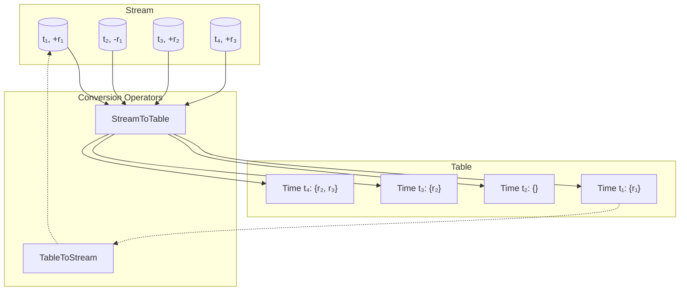
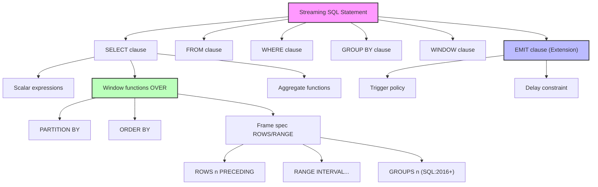
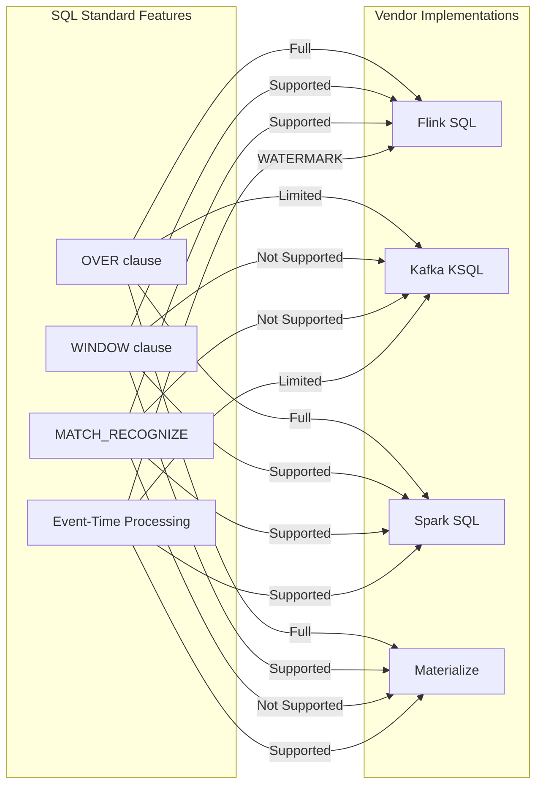

# Streaming SQL Standards - SQL:2011/2023 and Extensions

> Stage: Struct/ | Prerequisites: [00-INDEX.md](../00-INDEX.md) | Formalization Level: L4

## 1. Definitions

### Def-S-08-01: SQL:2011 Stream Extensions

**Formal Definition:**

The SQL:2011 standard introduced **Window Functions** and **Temporal Period Support**, laying the syntactic foundation for stream data processing. Let relation $R$ be a temporal relation; define its time attributes as:

$$
R^T = \{ (t, r) \mid t \in \mathbb{T}, r \in R \}
$$

Where $\mathbb{T}$ is the time domain. SQL:2011 defines two types of time periods:

- **Application-Time Period**: Business time interval $[start, end)$ managed by the user
- **System-Time Period**: Transaction timestamp automatically managed by the DBMS

**Core Window Function Syntax:**

$$
\text{window_function}(args) \text{ OVER } (\text{PARTITION BY } p_1, ..., p_n \text{ ORDER BY } o_1, ..., o_m \text{ frame_spec})
$$

Where `frame_spec` defines the row window boundary:

$$
\text{frame_spec} ::= \text{ROWS } | \text{RANGE } | \text{GROUPS } \{ \text{frame_extent} \}
$$

---

### Def-S-08-02: Standard Window Function Syntax

**Formal Definition:**

Let stream $S$ be a temporal event sequence $S = \langle e_1, e_2, ..., e_n \rangle$, where each event $e_i$ carries a timestamp $t_i$. The window function is defined over window $W$:

$$
W = \{ e_i \in S \mid t_{start} \leq t_i \leq t_{end} \}
$$

**Window Frame Types** defined in SQL:2011:

| Frame Type | Syntax | Semantics |
|------------|--------|-----------|
| Row Frame | `ROWS n PRECEDING` | Based on the previous $n$ physical rows |
| Range Frame | `RANGE INTERVAL '1' HOUR PRECEDING` | Based on time value range |
| Group Frame | `GROUPS n PRECEDING` | Based on peer groups (SQL:2016+) |

**Window Boundary Definition:**

$$
\text{frame_start} ::= \text{UNBOUNDED PRECEDING} \mid n \text{ PRECEDING} \mid \text{CURRENT ROW}
$$

$$
\text{frame_end} ::= \text{UNBOUNDED FOLLOWING} \mid n \text{ FOLLOWING} \mid \text{CURRENT ROW}
$$

---

### Def-S-08-03: Stream-Table Duality

**Formal Definition:**

Stream-table duality describes the **isomorphic relationship** between streams and tables. Let:

- Table $T$ be a snapshot at a given moment: $T = \{ r_1, r_2, ..., r_m \}$
- Stream $S$ be a sequence of changes with timestamps: $S = \langle (t_1, \Delta_1), (t_2, \Delta_2), ... \rangle$

**Define conversion operators:**

$$
\text{TableToStream}(T) = \{ (t, +r) \mid r \in T, t = \text{NOW}() \}
$$

$$
\text{StreamToTable}(S, t) = \{ r \mid \exists (t_i, +r) \in S, t_i \leq t \} \setminus \{ r \mid \exists (t_j, -r) \in S, t_j \leq t \}
$$

**Duality Theorem:** For any table $T$ and stream $S$:

$$
\text{StreamToTable}(\text{TableToStream}(T), t) = T, \quad \forall t \geq \text{NOW}()
$$

**SQL Semantic Equivalence:**

| Stream Operation | Equivalent Table Operation |
|------------------|----------------------------|
| `SELECT * FROM S [RANGE 1 HOUR]` | `SELECT * FROM T WHERE t >= NOW() - INTERVAL '1' HOUR` |
| `INSERT INTO S` | `INSERT INTO T` |
| `SELECT ... EMIT WITH DELAY` | Materialized view refresh |

---

## 2. Properties

### Lemma-S-08-01: Window Function Closure

For any window function $f$ and stream $S$, the windowing operation preserves relational algebra closure:

$$
\forall f, S: \quad f(S[W]) \subseteq S[W]
$$

**Proof Sketch:** Window functions only compute over existing rows, introducing no new tuples, only filtering or aggregating.

---

### Lemma-S-08-02: Idempotency of Stream-Table Conversion

Stream-table conversion operations satisfy **idempotency**:

$$
\text{TableToStream}(\text{StreamToTable}(S, t)) = S_t
$$

Where $S_t$ denotes the slice of stream $S$ at time $t$.

---

### Prop-S-08-01: SQL:2011 Window Function Completeness

The SQL:2011 standard window function categories include:

1. **Ranking Functions**: `ROW_NUMBER()`, `RANK()`, `DENSE_RANK()`, `NTILE(n)`
2. **Distribution Functions**: `PERCENT_RANK()`, `CUME_DIST()`
3. **Value Functions**: `LAG()`, `LEAD()`
4. **First/Last Functions**: `FIRST_VALUE()`, `LAST_VALUE()`, `NTH_VALUE()`
5. **Aggregate Extensions**: `SUM()`, `AVG()`, `COUNT()`, `MIN()`, `MAX()` (window versions)

For streaming scenarios, these functions maintain semantic consistency on **ordered windows**.

---

### Prop-S-08-02: Temporal Semantic Consistency

Let $S$ be an event-timestamped stream and $W$ an event-time-based window. Then:

$$
\forall e_i, e_j \in S: \quad t_i < t_j \implies e_i \in W_k \Rightarrow e_j \in W_{k'} \text{ and } k \leq k'
$$

That is, event time order is consistent with window order.

---

## 3. Relations

### 3.1 Standard Evolution Relations

```
SQL:2003 ──→ SQL:2011 ──→ SQL:2016 ──→ SQL:2023
    │            │            │            │
    │            ▼            │            ▼
    │      Window Functions   JSON Support  More Stream Features
    │      Temporal Periods   GROUPS Frame  Row Pattern Recognition
    │                                      (MATCH_RECOGNIZE)
    ▼
 Base Aggregation
 Subqueries
```

**Key Evolution Milestones:**

| Standard Version | Core Features | Significance for Stream Processing |
|------------------|---------------|------------------------------------|
| SQL:2003 | Analytic functions draft | Basic aggregation framework |
| SQL:2011 | Window functions standardized, temporal periods | **Stream processing syntax foundation** |
| SQL:2016 | JSON, polymorphic tables, group frames | Semi-structured stream processing |
| SQL:2023 | `MATCH_RECOGNIZE`, row patterns | **CEP standardization** |

---

### 3.2 Vendor Extensions and Standard Mapping

| Standard Feature | Apache Flink | Kafka KSQL | Spark SQL | Materialize |
|------------------|--------------|------------|-----------|-------------|
| `OVER` clause | ✅ Full | ✅ Limited | ✅ Full | ✅ Full |
| `WINDOW` clause | ✅ | ❌ | ✅ | ✅ |
| `MATCH_RECOGNIZE` | ✅ | ❌ | ✅ | ❌ |
| Event-Time Processing | ✅ `WATERMARK` | ⚠️ Limited | ✅ | ✅ |
| `EMIT` Strategy | ✅ `EMIT WITH DELAY` | ⚠️ Implicit | ⚠️ Triggers | ✅ `TAIL` |

---

### 3.3 Syntax Structure Hierarchy

```
Streaming SQL Statement
    ├── SELECT clause
    │       ├── Scalar expressions
    │       ├── Window functions (OVER)
    │       └── Aggregate functions
    ├── FROM clause
    │       ├── Stream source
    │       ├── Table source
    │       └── Subquery
    ├── WINDOW clause (named windows)
    ├── WHERE clause (filtering)
    ├── GROUP BY clause
    ├── HAVING clause
    └── EMIT clause (stream extension)
            ├── Trigger policy
            └── Delay constraint
```

---

## 4. Argumentation

### 4.1 Window Frame Selection Boundary Analysis

**Question:** The trade-off between choosing `ROWS` vs `RANGE` frames in stream processing.

**Analysis:**

| Dimension | ROWS Frame | RANGE Frame |
|-----------|------------|-------------|
| Semantics | Physical row count | Logical time value |
| Determinism | Depends on ingestion order | Depends on event timestamps |
| Out-of-Order Handling | Requires sorting buffer | Naturally supports disorder |
| Resource Consumption | Fixed window size | Dynamic window size |
| Applicable Scenario | Count-limited scenarios | Time window scenarios |

**Argument:** Stream processing should prefer `RANGE` frames, because event-time semantics are more stable than processing order.

---

### 4.2 Engineering Significance of Stream-Table Duality

**Core Argument:**

Stream-table duality enables the same SQL engine to handle both:

1. **Batch queries** (table semantics)
2. **Stream queries** (stream semantics)

This reduces learning costs through unified syntax, but the implementation requires different execution strategies:

- Table queries: Full scan + materialized results
- Stream queries: Incremental computation + continuous updates

---

### 4.3 Compatibility Challenges Between Standards and Extensions

**Counterexample Analysis:**

Apache Flink's `EMIT WITH DELAY` syntax:

```sql
SELECT TUMBLE_START(event_time, INTERVAL '1' HOUR) as window_start,
       COUNT(*) as cnt
FROM events
GROUP BY TUMBLE(event_time, INTERVAL '1' HOUR)
EMIT WITH DELAY '5' MINUTE
```

This extension is **non-standard SQL**, but solves the practical problem of late data handling. Standard evolution must consider:

- Syntactic compatibility
- Semantic consistency
- Implementation feasibility

---

## 5. Proof / Engineering Argument

### 5.1 Correctness of SQL:2011 Window Functions on Streams

**Theorem (Thm-S-08-01):** SQL:2011 window functions maintain result correctness on streams with finite windows.

**Proof:**

Let stream $S$ have event sequence $\langle e_1, e_2, ..., e_n \rangle$, and window $W$ define time interval $[t_s, t_e]$.

**Define window slice:**

$$
S[W] = \{ e_i \in S \mid t_s \leq t_i \leq t_e \}
$$

**Window function property:**

For aggregate window functions $f \in \{SUM, AVG, COUNT, MIN, MAX\}$:

$$
f(S[W]) = f(\{ v_i \mid e_i \in S[W] \})
$$

Since $S[W]$ is a finite set and aggregate functions are well-defined on finite sets, the result is correct.

**Incremental update argument:**

Let new event $e_{new}$ arrive, and $t_{new} \in [t_s, t_e]$:

$$
f(S[W] \cup \{e_{new}\}) = f(S[W]) \oplus v_{new}
$$

Where $\oplus$ is the incremental aggregation operation (e.g., addition for `SUM`).

**Conclusion:** SQL:2011 window function semantics can be losslessly migrated to stream processing scenarios.

∎

---

### 5.2 Stream-Table Duality Implementation Argument

**Engineering Argument:** Both Materialize and Flink adopt stream-table duality as a core design principle.

**Materialize Implementation:**

```
Data Source (Kafka) ──→ Stream (Differential Dataflow) ──→ Materialized View (Table)
                         │
                         └──→ Incremental Update Notifications
```

**Flink Implementation:**

```
Batch Processing (DataSet API) ←──── Unified Relational Algebra ────→ Stream Processing (DataStream API)
                              │
                              └── SQL Table API (Stream-Table Unification)
```

**Key Argument Points:**

1. **Semantic Equivalence:** The same SQL statement produces logically equivalent results in batch and stream modes
2. **Performance Difference:** Stream mode avoids full recomputation through incremental computation
3. **State Management:** Stream mode requires state maintenance, while batch mode can process full datasets

---

## 6. Examples

### 6.1 Standard SQL:2011 Window Function

```sql
-- Calculate cumulative visits per user within each hour (rolling window)
SELECT
    user_id,
    event_time,
    COUNT(*) OVER (
        PARTITION BY user_id
        ORDER BY event_time
        RANGE BETWEEN INTERVAL '1' HOUR PRECEDING AND CURRENT ROW
    ) as hourly_count
FROM user_events;
```

### 6.2 Flink SQL Extension Syntax

```sql
-- Using WATERMARK and EMIT strategy
CREATE TABLE user_events (
    user_id STRING,
    event_time TIMESTAMP(3),
    WATERMARK FOR event_time AS event_time - INTERVAL '5' SECOND
) WITH (
    'connector' = 'kafka',
    'topic' = 'user-events',
    'format' = 'json'
);

-- TUMBLE window with delayed emission
SELECT
    TUMBLE_START(event_time, INTERVAL '1' HOUR) as window_start,
    user_id,
    COUNT(*) as event_count
FROM user_events
GROUP BY
    TUMBLE(event_time, INTERVAL '1' HOUR),
    user_id
EMIT WITH DELAY '1' MINUTE;
```

### 6.3 SQL:2023 MATCH_RECOGNIZE (CEP)

```sql
-- Detect user behavior pattern: Login -> Browse -> Purchase
SELECT *
FROM user_events
MATCH_RECOGNIZE (
    PARTITION BY user_id
    ORDER BY event_time
    MEASURES
        A.event_time as login_time,
        B.event_time as browse_time,
        C.event_time as purchase_time
    PATTERN (A B+ C)
    DEFINE
        A AS event_type = 'LOGIN',
        B AS event_type = 'BROWSE',
        C AS event_type = 'PURCHASE'
);
```

### 6.4 Kafka KSQL Syntax

```sql
-- KSQL window aggregation (simplified)
CREATE TABLE pageviews_per_region AS
SELECT
    regionid,
    COUNT(*) AS numusers
FROM pageviews
WINDOW TUMBLING (SIZE 30 SECONDS)
GROUP BY regionid;
```

---

## 7. Visualizations

### 7.1 SQL Standard Evolution Timeline

```mermaid
gantt
    title SQL Standard Evolution and Stream Processing Features
    dateFormat  YYYY
    section SQL Standards
    SQL:2003           :done, sql2003, 2003-01-01, 2003-12-31
    SQL:2011           :done, sql2011, 2011-01-01, 2011-12-31
    SQL:2016           :done, sql2016, 2016-01-01, 2016-12-31
    SQL:2023           :done, sql2023, 2023-01-01, 2023-12-31

    section Stream Features
    Window Functions   :active, wf, after sql2003, 2011-12-31
    Temporal Periods   :active, tp, after sql2003, 2011-12-31
    Group Frame Support :active, gf, 2011-12-31, 2016-12-31
    JSON Support       :active, json, 2011-12-31, 2016-12-31
    MATCH_RECOGNIZE    :active, mr, 2016-12-31, 2023-12-31
```

### 7.2 Stream-Table Duality Concept Diagram



### 7.3 Streaming SQL Syntax Structure Hierarchy Diagram



### 7.4 Vendor Implementation Comparison Matrix



---

## 8. References
