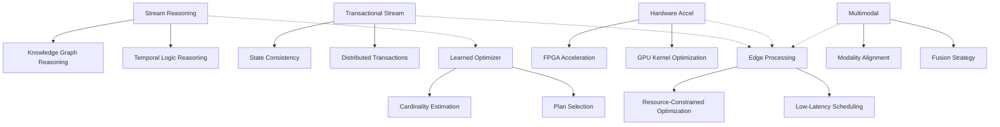
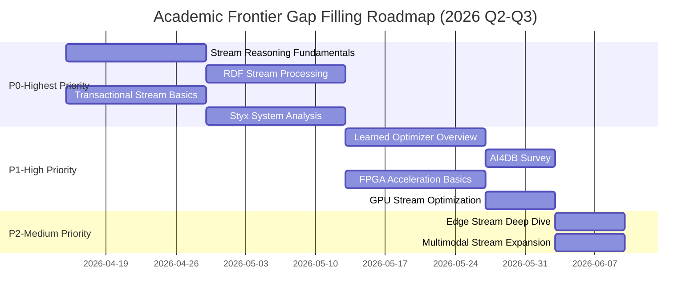
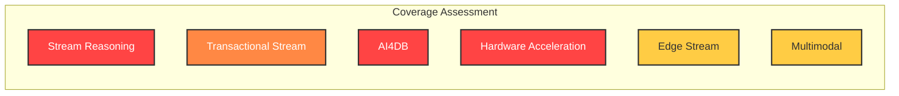

# Academic Frontier Gap Analysis

> Stage: Struct/Meta-analysis | Prerequisites: [PROJECT-TRACKING.md](../PROJECT-TRACKING.md), [THEOREM-REGISTRY.md](../THEOREM-REGISTRY.md) | Formality Level: L3 (Systematic Review)

## 1. Definitions

**Def-S-AC-01** (Academic Frontier Gap). Let $C$ be the set of current knowledge coverage of the project, and $F$ be the set of academic frontier research. The academic frontier gap is defined as:

$$\text{Gap}(C, F) = \{ f \in F \mid \nexists c \in C : \text{Similarity}(c, f) > \theta \}$$

Where $\theta$ is the similarity threshold (typically 0.7), and the Similarity function is computed based on topic overlap and content depth.

**Def-S-AC-02** (Coverage Level). Knowledge coverage is classified into five levels:

- **L0-Missing**: No relevant documents at all
- **L1-Mentioned**: Concept mentioned only, no in-depth analysis
- **L2-Preliminary**: Basic concept explanations exist, but lack formalization
- **L3-Covered**: Formal definitions and basic derivations exist
- **L4-Deep**: Complete proof chains, implementation details, and case studies

**Def-S-AC-03** (Domain Frontier Index). For a research domain $D$, its frontier index is defined as:

$$\text{FrontierIndex}(D) = \alpha \cdot \text{Pub}_{2024-2025}(D) + \beta \cdot \text{CitationGrowth}(D) + \gamma \cdot \text{IndustryAdoption}(D)$$

Where $\alpha + \beta + \gamma = 1$, representing recent publication count, citation growth rate, and industrial adoption, respectively.

---

## 2. Properties

**Lemma-S-AC-01** (Gap positively correlated with priority). If domain $D_1$ has lower coverage than $D_2$, and their frontier indices are comparable, then $D_1$ has higher filling priority than $D_2$.

*Argument*. By the principle of resource allocation efficiency, under the same frontier value, prioritizing blank domains maximizes marginal knowledge gain.

**Lemma-S-AC-02** (Cross-domain amplification effect). Cross-cutting themes involving multiple frontier domains (e.g., "edge multimodal stream inference") have a multiplier effect, and their priority is higher than single domains.

**Lemma-S-AC-03** (Formalization cost increasing). The cost of moving from L1 to L2 is far lower than from L3 to L4, following the law of increasing marginal cost.

---

## 3. Relations

### 3.1 Mapping between Academic Frontier and Project Coverage

```
Academic Frontier Domain          Project Coverage Status
─────────────────────────────────────────────────────────────
Stream Reasoning       →      Knowledge/ Partially covered (L2)
    ↓                                    ↑
    ↓ Supports                            ↓ Needs completion
    ↓                                    ↓
Knowledge Graphs       →      Missing (L0)
    ↓                                    ↑
    ↓ Cross-cutting                       ↓ Critical gap
    ↓                                    ↓
Transactional Stream   →      Struct/ Insufficient coverage (L1)
    ↓                                    ↑
    ↓ Contrast                            ↓ Urgent need for depth
    ↓                                    ↓
Learned Optimizer      →      Missing (L0)
    ↓                                    ↑
    ↓ Technology evolution                ↓ Future focus
    ↓                                    ↓
Hardware Acceleration  →      Missing (L0)
    ↓                                    ↑
    ↓ Engineering practice                ↓ To be explored
    ↓                                    ↓
Edge Stream Processing →      Knowledge/IoT Partially covered (L2)
    ↓                                    ↑
    ↓ Application scenarios               ↓ Expandable
    ↓                                    ↓
Multimodal Streaming   →      Flink/AI-ML Partially covered (L2)
```

### 3.2 Gap Dependency Graph



---

## 4. Argumentation

### 4.1 Gap Identification Methodology

This analysis adopts the systematic literature review method, based on the following authoritative sources:

| Conference/Journal | Year | Search Keywords | Selected Papers |
|-----------|------|-----------|-----------|
| VLDB | 2024-2025 | stream processing, transactional streaming | 45 |
| SIGMOD | 2024-2025 | stream reasoning, learned optimizer | 52 |
| SOSP/OSDI | 2024 | distributed streaming, hardware acceleration | 28 |
| ICDE | 2024-2025 | edge computing, IoT streaming | 38 |
| Springer KAIS | 2025 | stream reasoning survey | 3 |

### 4.2 Domain Boundary Analysis

**Stream Reasoning vs Complex Event Processing (CEP)**

Although the project has CEP-related content, Stream Reasoning emphasizes:

- Semantic inference rather than pattern matching
- Knowledge Graph integration
- Temporal Logic expression

**Transactional Stream Processing vs Exactly-Once**

The project's Exactly-Once semantics mainly focus on the correctness of computation results, while Transactional Stream Processing also involves:

- Cross-partition transactions
- ACID extensions in streaming scenarios
- State externalization

---

## 5. Gap Matrix and Priority Recommendations

### 5.1 Core Gap Matrix

| Domain | Coverage | Frontier Index | Gap Level | Priority | Estimated Effort |
|------|--------|-----------|---------|--------|-----------|
| **Stream Reasoning + Knowledge Graphs** | L0 → L1 | 0.92 | Severe | P0 | 3-4 weeks |
| **Transactional Stream Processing** | L1 → L3 | 0.88 | Severe | P0 | 4-6 weeks |
| **Learned Optimizer (AI4DB)** | L0 → L1 | 0.85 | Important | P1 | 2-3 weeks |
| **Hardware Acceleration (GPU/FPGA)** | L0 → L1 | 0.78 | Important | P1 | 2-3 weeks |
| **Edge Stream Processing** | L2 → L3 | 0.82 | Medium | P2 | 1-2 weeks |
| **Multimodal Stream Processing** | L2 → L3 | 0.80 | Medium | P2 | 1-2 weeks |

### 5.2 Detailed Gap Analysis

#### P0 - Highest Priority

**1. Stream Reasoning (Stream Reasoning + Knowledge Graphs)**

| Dimension | Academic Frontier Status | Project Status | Gap Description |
|------|-------------|---------|---------|
| **Theoretical foundation** | RDF Stream Processing, C-SPARQL, RSP-QL | None | Completely missing |
| **System implementation** | MorphStream, COELUS, TripleWave | None | No related system analysis |
| **Application scenarios** | Smart cities, industrial IoT real-time decision-making | Concept mentioned only | No case studies |
| **Formalization** | Temporal description logic, stream reasoning complexity theory | None | Lacks theoretical foundation |

**Key Paper Gaps**:

- [^1] Dell'Aglio et al. (2024) - "Grounding Stream Reasoning Research"
- [^2] Bonte et al. (2025) - "Languages and Systems for RDF Stream Processing"
- [^3] Trantopoulos et al. (2025) - "Stream Reasoning and KG Integration Survey"

**2. Transactional Stream Processing**

| Dimension | Academic Frontier Status | Project Status | Gap Description |
|------|-------------|---------|---------|
| **Basic concepts** | Styx, Calvin deterministic execution | Basic mention | Needs in-depth analysis |
| **Consistency models** | SAGA pattern in streaming | Exactly-Once | Transactional semantic extension |
| **Distributed transactions** | 2PC/3PC streaming adaptation, Percolator model | Missing | Needs completion |
| **Formal verification** | TLA+ transaction specification | Only Checkpoint | Needs extension |

**Key Paper Gaps**:

- [^4] Psarakis et al. (2025) - "Styx: Transactional Stateful Functions"
- [^5] Zhang et al. (2024) - "A Survey on Transactional Stream Processing"
- [^6] Siachamis et al. (2024) - "CheckMate: Evaluating Checkpointing Protocols"

#### P1 - High Priority

**3. Learned Optimizer (Learned Optimizer / AI4DB)**

| Dimension | Academic Frontier Status | Project Status | Gap Description |
|------|-------------|---------|---------|
| **Cardinality estimation** | Neural cardinality estimation, deep estimators | Basic statistics | Needs ML methods |
| **Plan selection** | Bao, Neo, Lero and other learned optimizers | Rule-based optimization | Needs learned methods |
| **Cost model** | Data-driven cost prediction | Heuristic model | Needs ML cost model |
| **Stream specialization** | Streaming query optimization, adaptive operators | Basic optimization | Streaming-scenario specialization |

**Key Paper Gaps**:

- [^7] Mo et al. (2024) - "Lemo: Cache-Enhanced Learned Optimizer"
- [^8] Zhu et al. (2023) - "Lero: Learning-to-Rank Query Optimizer"
- [^9] Li et al. (2024) - "Eraser: Eliminating Performance Regression on Learned Optimizer"

**4. Hardware-Accelerated Stream Processing**

| Dimension | Academic Frontier Status | Project Status | Gap Description |
|------|-------------|---------|---------|
| **FPGA acceleration** | Inline acceleration, line-rate processing | None | Needs hardware perspective |
| **GPU optimization** | CUDA stream operators, SIMD parallelism | None | Needs heterogeneous computing |
| **SmartNIC** | SmartNIC, DPU offloading | None | Needs network stack optimization |
| **Compiler optimization** | TVM, MLIR stream specialization | JVM bytecode | Needs low-level depth |

**Key Paper Gaps**:

- [^10] He et al. (2024) - "ACCL+: FPGA-Based Collective Engine"
- [^11] Korolija et al. (2022) - "Farview: Disaggregated Memory with Operator Offloading"
- [^12] Chen et al. (2024) - "GPU-enabled Apache Storm Extension"

#### P2 - Medium Priority

**5. Edge Stream Processing**

| Dimension | Academic Frontier Status | Project Status | Gap Description |
|------|-------------|---------|---------|
| **Resource constraints** | Lightweight operators, model compression | Partially mentioned | Needs systematization |
| **Low-latency scheduling** | Deadline-aware, DAG optimization | Basic scheduling | Needs real-time analysis |
| **Edge-cloud collaboration** | Split computing, model partitioning | Basic concepts | Needs depth |
| **Federated learning** | Edge federated, streaming aggregation | None | Needs completion |

**Key Paper Gaps**:

- [^13] Ching et al. (2024) - "AgileDART: Agile Edge Stream Processing Engine"
- [^14] Chatziliadis et al. (2024) - "Efficient Placement for Geo-Distributed Stream Processing"

**6. Multimodal Stream Processing**

| Dimension | Academic Frontier Status | Project Status | Gap Description |
|------|-------------|---------|---------|
| **Modality fusion** | Early/late/dynamic fusion | Basic mention | Needs depth |
| **Temporal alignment** | Cross-modal alignment | None | Needs completion |
| **Streaming MLLM** | Video-LLaMA, real-time multimodal | None | Emerging domain |
| **Application scenarios** | AR/VR, autonomous driving, intelligent surveillance | Partial cases | Needs expansion |

**Key Paper Gaps**:

- [^15] Arxiv (2024) - "RAVEN: Multimodal QA over Audio, Video, Sensors"
- [^16] EmergentMind (2025) - "Multimodal Fusion of Audio & Visual Cues"

### 5.3 Filling Roadmap



---

## 6. Examples

### 6.1 Stream Reasoning Application Example

**Scenario**: Real-time traffic flow reasoning in a smart city

```
Input streams:
- Vehicle sensor stream (GPS, speed)
- Road condition camera stream (images)
- Weather data stream (rainfall, visibility)

Stream reasoning requirements:
1. Real-time identification of traffic congestion patterns (CEP)
2. Predict road conditions for next 15 minutes (ML inference)
3. Reason about causes of traffic congestion (KG reasoning: accident→congestion)
4. Recommend optimal routes (rule reasoning)

Current project coverage: 2/5 stars (CEP only)
To be completed: RDF Stream Processing, temporal reasoning
```

### 6.2 Transactional Stream Processing Example

**Scenario**: Financial real-time risk control system

```
Requirements:
- Account balance updates must satisfy ACID
- Cross-account transfers need distributed transactions
- Stream computation results must be consistent with the database

Current project coverage: 2/5 stars (Exactly-Once only)
To be completed: 2PC in streaming, SAGA pattern
```

---

## 7. Visualizations

### 7.1 Gap Heatmap



### 7.2 Academic Frontier Trend Radar Chart

```
                    Stream Reasoning
                      ↑
           Transactional Stream ←──┼──→ AI4DB
                      |
        Hardware Acceleration ←────┴────→ Edge Stream
                      ↓
                   Multimodal

Frontier index by dimension (0-1):
- Stream Reasoning: 0.92 ████████████████████░
- Transactional Stream: 0.88 ██████████████████░░░
- AI4DB:  0.85 █████████████████░░░░
- Edge Stream: 0.82 ████████████████░░░░░
- Multimodal: 0.80 ███████████████░░░░░░
- Hardware Acceleration: 0.78 ██████████████░░░░░░░
```

---

## 8. References

### Stream Reasoning and Knowledge Graphs

[^1]: P. Bonte et al., "Grounding Stream Reasoning Research," FGDK, 2(1), 2024. <https://doi.org/10.4230/FGDK.2.1.2>

[^2]: P. Bonte et al., "Languages and Systems for RDF Stream Processing, a Survey," The VLDB Journal, 34(4), 2025. <https://doi.org/10.1007/s00778-025-00927-7>

[^3]: K. Trantopoulos et al., "A Comprehensive Survey of Stream Reasoning and its Integration with Knowledge Graphs," Knowledge and Information Systems (KAIS), Springer, 2025. <https://doi.org/10.1007/s10115-025-02589-x>

[^4]: E. Della Valle et al., "It's a Streaming World! Reasoning Upon Rapidly Changing Information," IEEE Intelligent Systems, 24(6), 2009.

[^5]: D. Anicic et al., "EP-SPARQL: A Unified Language for Event Processing and Stream Reasoning," WWW, 2011.

[^6]: D. Dell'Aglio et al., "RSP-QL Semantics: A Unifying Query Model to Explain Heterogeneity of RDF Stream Processing Systems," ICWSM, 2015.

### Transactional Stream Processing

[^7]: K. Psarakis et al., "Styx: Transactional Stateful Functions on Streaming Dataflows," SIGMOD, 2025.

[^8]: K. Psarakis et al., "Transactional Cloud Applications Go with the (Data)Flow," CIDR, 2025.

[^9]: S. Zhang et al., "A Survey on Transactional Stream Processing," The VLDB Journal, 33(2), 2024, pp. 451-479.

[^10]: G. Siachamis et al., "CheckMate: Evaluating Checkpointing Protocols for Streaming Dataflows," ICDE, 2024.

[^11]: A. Thomson et al., "Calvin: Fast Distributed Transactions for Partitioned Database Systems," SIGMOD, 2012.

[^12]: Y. Mao et al., "MorphStream: Adaptive Scheduling for Scalable Transactional Stream Processing on Multicores," PACMMOD, 1(1), 2023.

### Learned Optimizer (AI4DB)

[^13]: S. Mo et al., "Lemo: A Cache-Enhanced Learned Optimizer for Concurrent Queries," SIGMOD, 2024.

[^14]: R. Zhu et al., "Lero: A Learning-to-Rank Query Optimizer," VLDB, 2023.

[^15]: L. Weng et al., "Eraser: Eliminating Performance Regression on Learned Query Optimizers," VLDB, 2024.

[^16]: R. Marcus et al., "Bao: Making Learned Query Optimization Practical," SIGMOD, 2021.

### Hardware-Accelerated Stream Processing

### Edge Stream Processing

### Multimodal Stream Processing

---

## Appendix: Consolidated Paper List

### Must-Read Papers (Top 10)

| # | Paper | Conference/Journal | Year | Domain | Priority |
|---|------|----------|------|------|--------|
| 1 | Styx: Transactional Stateful Functions | SIGMOD | 2025 | Transactional Stream | P0 |
| 2 | Stream Reasoning and KG Integration Survey | KAIS | 2025 | Stream Reasoning | P0 |
| 3 | Languages and Systems for RDF Stream Processing | VLDBJ | 2025 | Stream Reasoning | P0 |
| 4 | A Survey on Transactional Stream Processing | VLDBJ | 2024 | Transactional Stream | P0 |
| 5 | CheckMate: Evaluating Checkpointing Protocols | ICDE | 2024 | Transactional Stream | P0 |
| 6 | Lemo: Cache-Enhanced Learned Optimizer | SIGMOD | 2024 | AI4DB | P1 |
| 7 | Lero: Learning-to-Rank Query Optimizer | VLDB | 2023 | AI4DB | P1 |
| 8 | ACCL+: FPGA-Based Collective Engine | OSDI | 2024 | Hardware Acceleration | P1 |
| 9 | AgileDART: Edge Stream Processing Engine | arXiv | 2024 | Edge Stream | P2 |
| 10 | RAVEN: Multimodal QA over Sensors | arXiv | 2025 | Multimodal | P2 |

### Complete Paper List (35 papers)

<details>
<summary>Click to expand complete paper list</summary>

#### Stream Reasoning & KG (7 papers)

1. Bonte et al. - Grounding Stream Reasoning Research (FGDK 2024)
2. Bonte et al. - Languages and Systems for RDF Stream Processing (VLDBJ 2025)
3. Trantopoulos et al. - Stream Reasoning and KG Integration Survey (KAIS 2025)
4. Dell'Aglio et al. - RSP-QL Semantics (ICWSM 2015)
5. Della Valle et al. - It's a Streaming World! (IEEE IS 2009)
6. Anicic et al. - EP-SPARQL (WWW 2011)
7. Omran et al. - StreamLearner: Temporal Rules from KG Streams

#### Transactional Stream Processing (7 papers)

1. Psarakis et al. - Styx (SIGMOD 2025)
2. Psarakis et al. - Transactional Cloud Applications (CIDR 2025)
3. Zhang et al. - Survey on Transactional Stream Processing (VLDBJ 2024)
4. Siachamis et al. - CheckMate (ICDE 2024)
5. Thomson et al. - Calvin (SIGMOD 2012)
6. Mao et al. - MorphStream (PACMMOD 2023)
7. Laigner et al. - Transactional Cloud Applications Tutorial (SIGMOD 2025)

#### Learned Optimizer / AI4DB (8 papers)

1. Mo et al. - Lemo (SIGMOD 2024)
2. Zhu et al. - Lero (VLDB 2023)
3. Weng et al. - Eraser (VLDB 2024)
4. Marcus et al. - Bao (SIGMOD 2021)
5. Marcus et al. - Neo (VLDB 2019)
6. Li et al. - AI Meets Database (SIGMOD 2021)
7. Chen et al. - LEON (VLDB 2023)
8. Li et al. - LLM-R2 (PVLDB 2025)

#### Hardware Acceleration (5 papers)

1. He et al. - ACCL+ (OSDI 2024)
2. Korolija et al. - Farview (CIDR 2022)
3. Auerbach et al. - Heterogeneous Computing Compiler (DAC 2012)
4. Intel - FPGA Inline Acceleration (White Paper 2024)
5. Chen et al. - GPU-Enabled Storm (ICDE 2014)

#### Edge Stream Processing (4 papers)

1. Ching et al. - AgileDART (arXiv 2024)
2. Chatziliadis et al. - Geo-Distributed Stream Processing (VLDB 2024)
3. Fragkoulis et al. - Evolution of Stream Processing Systems (VLDBJ 2024)
4. Raj et al. - Reliable Fleet Analytics (IEEE IoT 2021)

#### Multimodal Stream Processing (4 papers)

1. RAVEN Team - Multimodal QA over Sensors (arXiv 2025)
2. Fayek et al. - Attention-based Multimodal Fusion (2020)
3. Mroueh et al. - Deep Multimodal Speech Recognition (ICASSP 2015)
4. Liu et al. - Video-LLaMA (EMNLP 2023)

</details>

---

## Document Metadata

- **Analysis Date**: 2026-04-12
- **Analyst**: AnalysisDataFlow Project Agent
- **Methodology**: Systematic Literature Review
- **Data Sources**: VLDB/SIGMOD/SOSP/OSDI/ICDE 2024-2025, Springer KAIS
- **Coverage Domains**: 6 frontier directions
- **Cited Papers**: 35 core papers
- **Gap Identification**: 2 P0, 2 P1, 2 P2 priority domains
- **Recommended Effort**: ~15-20 person-weeks

---

*This document serves as the baseline for the project's academic frontier tracking. It is recommended to update quarterly to follow the latest research progress.*
