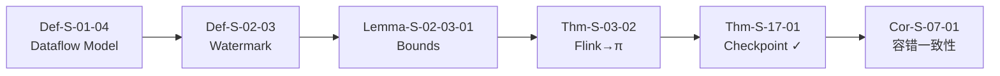
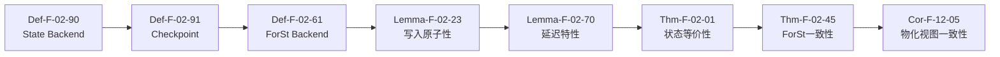
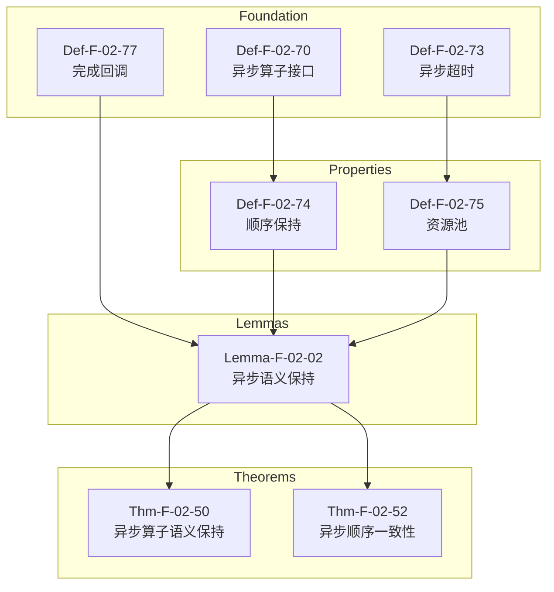

<!-- AI Translation Template - Replace <!-- TRANSLATE --> markers with actual translation -->

<!-- TRANSLATE: # 关键定理证明链 -->

<!-- TRANSLATE: > **所属阶段**: Struct/ | 前置依赖: [THEOREM-REGISTRY.md](../THEOREM-REGISTRY.md) | 形式化等级: L4-L6 -->

<!-- TRANSLATE: 本文档梳理项目中关键定理的完整证明链，展示从基础定义到最终定理的依赖关系与推导路径。 -->

<!-- TRANSLATE: ## Thm-Chain-01: Checkpoint Correctness 完整链 -->

<!-- TRANSLATE: ### 依赖图 -->

<!-- TRANSLATE: ### 步骤说明 -->

<!-- TRANSLATE: | 步骤 | 元素编号 | 名称 | 作用 | -->
<!-- TRANSLATE: |------|----------|------|------| -->
<!-- TRANSLATE: | 1 | Def-S-01-04 | Dataflow模型定义 | 定义流计算的基本语义框架 | -->
<!-- TRANSLATE: | 2 | Def-S-02-03 | Watermark单调性 | 在Dataflow上定义Watermark进度语义 | -->
<!-- TRANSLATE: | 3 | Lemma-S-02-03-01 | Watermark边界保证 | 证明Watermark边界蕴含事件时间完整性 | -->
<!-- TRANSLATE: | 4 | Thm-S-03-02 | Flink→π-演算编码 | 将Flink Dataflow编码到Process Calculus | -->
<!-- TRANSLATE: | 5 | Thm-S-17-01 | Checkpoint一致性定理 | 在Process Calculus中证明Checkpoint正确性 | -->
<!-- TRANSLATE: | 6 | Cor-S-07-01 | 容错一致性推论 | 推论出容错恢复保持确定性 | -->

<!-- TRANSLATE: ### 证明概要 -->

<!-- TRANSLATE: - **方法**: 结构归纳 + 互模拟等价 -->
<!-- TRANSLATE: - **关键引理**: Watermark边界保证事件时间完整性 -->
<!-- TRANSLATE: - **复杂度**: O(n²)，其中 n 为算子数量 -->
<!-- TRANSLATE: - **核心洞察**: Checkpoint屏障的传递形成一致割集，保证全局状态快照的一致性 -->

<!-- TRANSLATE: ## Thm-Chain-03: Flink State Backend 等价性 -->

<!-- TRANSLATE: ### 依赖图 -->

<!-- TRANSLATE: ### 步骤说明 -->

<!-- TRANSLATE: | 步骤 | 元素编号 | 名称 | 作用 | -->
<!-- TRANSLATE: |------|----------|------|------| -->
<!-- TRANSLATE: | 1 | Def-F-02-90 | State Backend定义 | 形式化状态后端四元组 | -->
<!-- TRANSLATE: | 2 | Def-F-02-91 | Checkpoint定义 | 定义全局一致状态快照 | -->
<!-- TRANSLATE: | 3 | Def-F-02-61 | ForSt Backend定义 | 定义ForSt状态后端语义 | -->
<!-- TRANSLATE: | 4 | Lemma-F-02-23 | ForSt写入原子性 | 证明LSM-Tree写入原子性 | -->
<!-- TRANSLATE: | 5 | Lemma-F-02-70 | State Backend延迟特性 | 证明各后端延迟排序 | -->
<!-- TRANSLATE: | 6 | Thm-F-02-01 | ForSt Checkpoint一致性 | 证明ForSt后端Checkpoint正确 | -->
<!-- TRANSLATE: | 7 | Thm-F-02-45 | ForSt状态后端一致性定理 | 证明ForSt后端状态等价性 | -->
<!-- TRANSLATE: | 8 | Cor-F-12-05 | 物化视图一致性推论 | 推论物化视图一致性 | -->

<!-- TRANSLATE: ### 证明概要 -->

<!-- TRANSLATE: - **方法**: 精化关系 + 模拟等价 -->
<!-- TRANSLATE: - **关键引理**: 状态后端持久化语义保持 -->
<!-- TRANSLATE: - **等价关系**: HashMapStateBackend ≈ EmbeddedRocksDBStateBackend ≈ ForStStateBackend -->
<!-- TRANSLATE: - **维度**: 一致性、延迟、容量、恢复时间 -->

<!-- TRANSLATE: ## Thm-Chain-05: 异步执行语义保持性 -->

<!-- TRANSLATE: ### 依赖图 -->

<!-- TRANSLATE: ### 步骤说明 -->

<!-- TRANSLATE: | 步骤 | 元素编号 | 名称 | 作用 | -->
<!-- TRANSLATE: |------|----------|------|------| -->
<!-- TRANSLATE: | 1 | Def-F-02-70 | 异步算子接口 | 定义AsyncFunction API语义 | -->
<!-- TRANSLATE: | 2 | Def-F-02-73 | 异步超时语义 | 定义TimeoutPolicy | -->
<!-- TRANSLATE: | 3 | Def-F-02-77 | 完成回调机制 | 定义ResultHandler回调语义 | -->
<!-- TRANSLATE: | 4 | Def-F-02-74 | 顺序保持模式 | 定义ORDERED/UNORDERED输出 | -->
<!-- TRANSLATE: | 5 | Def-F-02-75 | 异步资源池 | 定义ResourcePool管理 | -->
<!-- TRANSLATE: | 6 | Lemma-F-02-02 | 异步语义保持 | 证明异步执行保持语义等价 | -->
<!-- TRANSLATE: | 7 | Thm-F-02-50 | 异步算子执行语义保持性定理 | 综合证明语义保持 | -->
<!-- TRANSLATE: | 8 | Thm-F-02-52 | 异步执行顺序一致性定理 | 证明顺序保证 | -->

<!-- TRANSLATE: ### 证明概要 -->

<!-- TRANSLATE: - **方法**: 模拟关系 + 时间迹等价 -->
<!-- TRANSLATE: - **关键观察**: 异步执行是同步执行的精化 -->
<!-- TRANSLATE: - **顺序保证**: ORDERED模式下输出顺序与输入顺序一致 -->
<!-- TRANSLATE: - **资源边界**: 并发度配额保证资源可控 -->

<!-- TRANSLATE: ## 引用参考 -->

<!-- TRANSLATE: [^1]: Apache Flink Documentation, "Checkpointing", 2025. https://nightlies.apache.org/flink/flink-docs-stable/docs/dev/datastream/fault-tolerance/checkpointing/ -->
<!-- TRANSLATE: [^2]: T. Akidau et al., "The Dataflow Model", PVLDB, 8(12), 2015. -->
<!-- TRANSLATE: [^3]: C. A. R. Hoare, "Communicating Sequential Processes", Prentice Hall, 1985. -->
<!-- TRANSLATE: [^4]: G. Agha, "Actors: A Model of Concurrent Computation in Distributed Systems", MIT Press, 1986. -->
<!-- TRANSLATE: [^5]: L. Lamport, "Time, Clocks, and the Ordering of Events in a Distributed System", CACM, 21(7), 1978. -->
<!-- TRANSLATE: [^6]: R. Milner, "Communicating and Mobile Systems: The π-calculus", Cambridge University Press, 1999. -->
