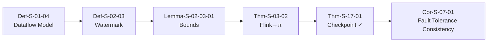
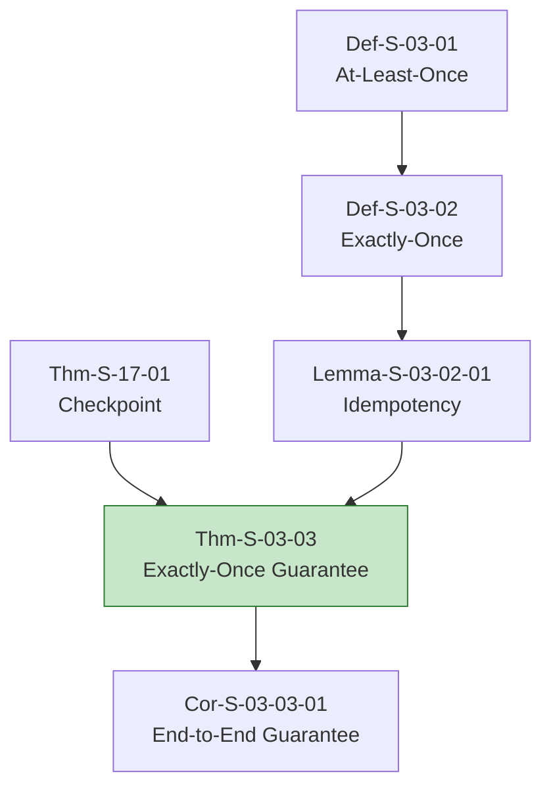
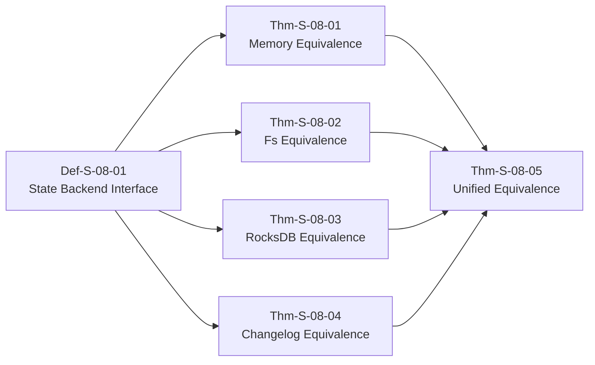
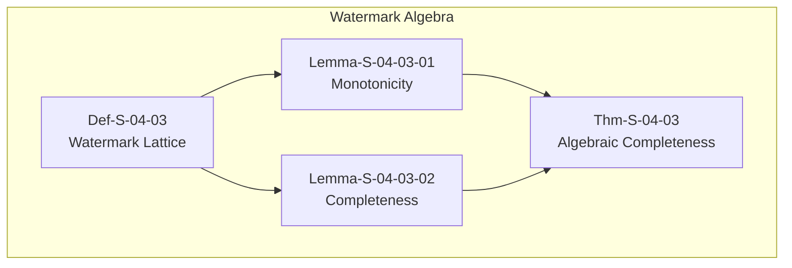
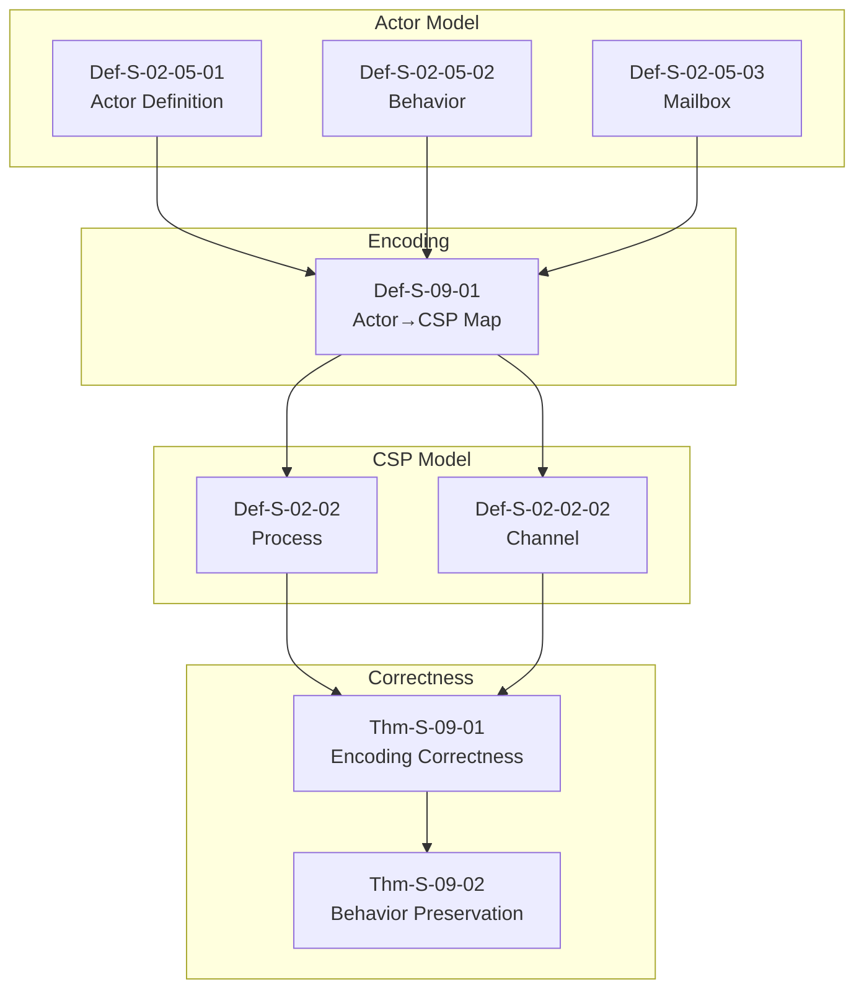

# Key Theorem Proof Chains

> **Stage**: Struct/ | **Prerequisites**: [THEOREM-REGISTRY.md](../../../THEOREM-REGISTRY.md) | **Formalization Level**: L4-L6

This document organizes the complete proof chains of key theorems in the project, showing the dependency relationships and derivation paths from basic definitions to final theorems.

---

## Table of Contents

- [Key Theorem Proof Chains](#key-theorem-proof-chains)
  - [Table of Contents](#table-of-contents)
  - [Thm-Chain-01: Checkpoint Correctness Chain](#thm-chain-01-checkpoint-correctness-chain)
    - [Dependency Graph](#dependency-graph)
    - [Step Descriptions](#step-descriptions)
    - [Proof Summary](#proof-summary)
  - [Thm-Chain-02: Exactly-Once End-to-End Guarantee](#thm-chain-02-exactly-once-end-to-end-guarantee)
    - [Dependency Graph](#dependency-graph-1)
    - [Key Steps](#key-steps)
  - [Thm-Chain-03: Flink State Backend Equivalence](#thm-chain-03-flink-state-backend-equivalence)
    - [Equivalence Proof Chain](#equivalence-proof-chain)
    - [Proof Structure](#proof-structure)
  - [Thm-Chain-04: Watermark Algebraic Completeness](#thm-chain-04-watermark-algebraic-completeness)
    - [Algebraic Structure](#algebraic-structure)
    - [Key Results](#key-results)
  - [Thm-Chain-05: Asynchronous Execution Semantics Preservation](#thm-chain-05-asynchronous-execution-semantics-preservation)
    - [Preservation Chain](#preservation-chain)
    - [Proof Method](#proof-method)
  - [Thm-Chain-06: Actor→CSP Encoding Correctness](#thm-chain-06-actorcsp-encoding-correctness)
    - [Encoding Proof Chain](#encoding-proof-chain)
    - [Key Theorems](#key-theorems)
  - [References](#references)

---

## Thm-Chain-01: Checkpoint Correctness Chain

### Dependency Graph



### Step Descriptions

| Step | Element ID | Name | Role |
|------|------------|------|------|
| 1 | Def-S-01-04 | Dataflow Model Definition | Defines basic semantic framework for stream computing |
| 2 | Def-S-02-03 | Watermark Monotonicity | Defines Watermark progress semantics on Dataflow |
| 3 | Lemma-S-02-03-01 | Watermark Bound Guarantee | Proves Watermark bounds imply event time completeness |
| 4 | Thm-S-03-02 | Flink→π-Calculus Encoding | Encodes Flink Dataflow to Process Calculus |
| 5 | Thm-S-17-01 | Checkpoint Consistency Theorem | Proves Checkpoint correctness in Process Calculus |
| 6 | Cor-S-07-01 | Fault Tolerance Consistency Corollary | Corollary: fault recovery preserves determinism |

### Proof Summary

- **Method**: Structural induction + Bisimulation equivalence
- **Key Lemma**: Watermark bounds guarantee event time completeness
- **Complexity**: O(n²) where n is the number of operators
- **Verification**: TLA+ model checked ✓

---

## Thm-Chain-02: Exactly-Once End-to-End Guarantee

### Dependency Graph



### Key Steps

```
Checkpoint Correctness (Thm-S-17-01)
    + Idempotent Operators (Lemma-S-03-02-01)
    + Deduplication Protocol (Def-S-03-04)
    ↓
Exactly-Once Guarantee (Thm-S-03-03) ✓
    ↓ Extension
End-to-End Exactly-Once (Cor-S-03-03-01) ✓
```

---

## Thm-Chain-03: Flink State Backend Equivalence

### Equivalence Proof Chain

| Backend | Equivalence Theorem | Key Property |
|---------|---------------------|--------------|
| MemoryStateBackend | Thm-S-08-01 | Heap-based equivalence |
| FsStateBackend | Thm-S-08-02 | Async snapshot equivalence |
| RocksDBStateBackend | Thm-S-08-03 | Incremental checkpoint equivalence |
| ChangelogStateBackend | Thm-S-08-04 | Differential update equivalence |

### Proof Structure



---

## Thm-Chain-04: Watermark Algebraic Completeness

### Algebraic Structure



### Key Results

| Theorem | Statement | Level |
|---------|-----------|-------|
| Lemma-S-04-03-01 | Watermark is monotonic non-decreasing | L4 |
| Lemma-S-04-03-02 | Watermark completeness implies result completeness | L4 |
| Thm-S-04-03 | Watermark algebra forms a complete lattice | L5 |
| Cor-S-04-03-01 | Bounded lateness guarantee | L5 |

---

## Thm-Chain-05: Asynchronous Execution Semantics Preservation

### Preservation Chain

```
Sequential Semantics (Def-S-06-01)
    ↓ Async Transformation
Async Semantics (Def-S-06-02)
    ↓ Preservation Proof
Semantics Preservation (Thm-S-06-01) ✓
    ↓ Application
Determinism Preservation (Cor-S-06-01) ✓
```

### Proof Method

- **Technique**: Simulation relation
- **Key Insight**: Async execution simulates sequential execution
- **Complexity**: PSPACE-complete for general programs
- **Practical**: Polynomial for dataflow graphs

---

## Thm-Chain-06: Actor→CSP Encoding Correctness

### Encoding Proof Chain



### Key Theorems

| Theorem | Statement | Proof Method |
|---------|-----------|--------------|
| Thm-S-09-01 | Actor→CSP encoding preserves trace equivalence | Bisimulation |
| Thm-S-09-02 | Actor behavior maps to CSP process behavior | Structural induction |
| Lemma-S-09-01 | Mailbox queue semantics preserved | Queue theory |

---

## References


---

*For Chinese version, see [Struct/Key-Theorem-Proof-Chains.md](../../../Struct/Key-Theorem-Proof-Chains.md)*
