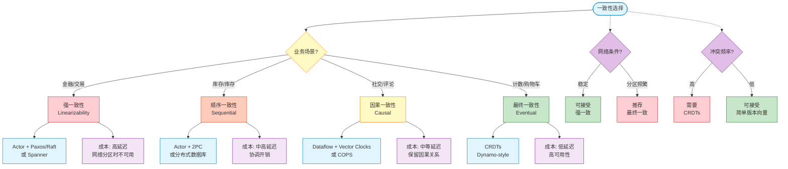
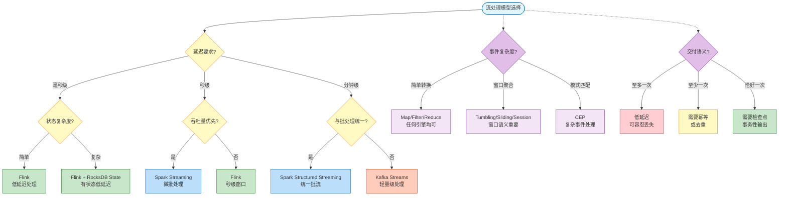

<!-- AI Translation Template - Replace <!-- TRANSLATE --> markers with actual translation -->

<!-- TRANSLATE: # 并发与分布式计算模型选择决策树 -->

<!-- TRANSLATE: > **所属阶段**: Struct | **前置依赖**: [03-relationships/03.03-expressiveness-hierarchy.md](./03-relationships/03.03-expressiveness-hierarchy.md), [03-relationships/03.03-expressiveness-hierarchy-supplement.md](./03-relationships/03.03-expressiveness-hierarchy-supplement.md) | **形式化等级**: L3-L5 -->
<!-- TRANSLATE: > **版本**: 2026.04 | **状态**: 完整 -->


<!-- TRANSLATE: ## 1. 概念定义 (Definitions) -->

<!-- TRANSLATE: ### Def-S-16-01. 模型选择决策空间 -->

**模型选择决策空间** $\mathcal{D}$ 是问题特征空间 $\mathcal{P}$ 与计算模型空间 $\mathcal{M}$ 之间的映射关系：

$$
<!-- TRANSLATE: \mathcal{D} = \{d: \mathcal{P} \to \mathcal{M} \mid d \text{ 满足适配度约束}\} -->
$$

<!-- TRANSLATE: 其中： -->
- **问题特征空间** $\mathcal{P} = (C_{consistency}, C_{topology}, C_{pattern}, C_{verify})$，包含一致性需求、拓扑特征、计算模式、验证需求四个维度
- **计算模型空间** $\mathcal{M} = \{\text{Actor}, \text{CSP}, \pi, \text{Dataflow}, \text{CRDT}, \text{Session Types}, \dots\}$
- **决策** $d$ 为从问题特征到推荐模型的映射函数


<!-- TRANSLATE: ### Def-S-16-03. 模型适配度度量 -->

模型 $M$ 对问题 $P$ 的**适配度** $\text{Fit}(M, P)$ 定义为：

$$
<!-- TRANSLATE: \text{Fit}(M, P) = \sum_{i} w_i \cdot \text{match}(C_i(P), C_i(M)) -->
$$

<!-- TRANSLATE: 其中： -->
- $w_i$ 为维度权重，满足 $\sum w_i = 1$
- $\text{match}(c_p, c_m) \in [0, 1]$ 为特征匹配度

**最优模型**：$M^* = \arg\max_{M \in \mathcal{M}} \text{Fit}(M, P)$


<!-- TRANSLATE: ### Lemma-S-16-02. 模型正交性 -->

**陈述**：不同计算模型在特定问题子空间上可能具有**不可比较性**，即 $\exists M_1, M_2, P: \text{Fit}(M_1, P) \not< \text{Fit}(M_2, P) \land \text{Fit}(M_2, P) \not< \text{Fit}(M_1, P)$。

<!-- TRANSLATE: **推导**： -->

1. 考虑问题 $P$ 需要强一致性 + 动态拓扑
<!-- TRANSLATE: 2. Actor 模型在动态拓扑上适配度高（支持运行时创建），但在强一致性上需要额外协议（2PC） -->
<!-- TRANSLATE: 3. CSP 在强一致性上天然支持（同步语义），但动态拓扑上适配度低（静态通道） -->
4. 因此两者在 $P$ 上不可比较，需要根据权重取舍。 ∎


<!-- TRANSLATE: ## 3. 关系建立 (Relations) -->

<!-- TRANSLATE: ### 关系 1: 问题特征 → 模型选择映射 -->

<!-- TRANSLATE: **核心映射表**： -->

<!-- TRANSLATE: | 问题特征 | 推荐模型 | 理由 | -->
<!-- TRANSLATE: |----------|----------|------| -->
<!-- TRANSLATE: | 分布式容错 + 强一致 | Actor + 2PC/Paxos | 事务原子性保证 | -->
<!-- TRANSLATE: | 分布式容错 + 最终一致 | CRDTs | 无协调冲突解决 | -->
<!-- TRANSLATE: | 流处理 + 复杂事件 | Dataflow + CEP | 窗口计算 + 模式匹配 | -->
<!-- TRANSLATE: | 流处理 + 简单转换 | Dataflow | 高效流水线 | -->
<!-- TRANSLATE: | 并发协议 + 顺序重要 | CSP | 同步通信验证 | -->
<!-- TRANSLATE: | 并发协议 + 内容重要 | Session Types | 类型安全通信 | -->
<!-- TRANSLATE: | 形式化证明 + 状态 | Separation Logic | 资源推理 | -->
<!-- TRANSLATE: | 形式化证明 + 时序 | TLA+ | 时序属性验证 | -->


<!-- TRANSLATE: ### 关系 3: 验证需求 → 验证方法 -->

<!-- TRANSLATE: **验证方法选择矩阵**： -->

<!-- TRANSLATE: | 需验证属性 | 系统规模 | 推荐方法 | 工具 | -->
<!-- TRANSLATE: |------------|----------|----------|------| -->
<!-- TRANSLATE: | 时序属性 | 中小 | 模型检验 | TLC, SPIN, FDR | -->
<!-- TRANSLATE: | 时序属性 | 大 | 交互式证明 | TLAPS, Coq | -->
<!-- TRANSLATE: | 状态/内存 | 任意 | 分离逻辑 | Iris, VST | -->
<!-- TRANSLATE: | 通信协议 | 任意 | 会话类型 | Scribble, Rust session-types | -->
<!-- TRANSLATE: | 类型安全 | 任意 | 类型系统 | 编译器 | -->


<!-- TRANSLATE: ### 论证 2: 模型选择常见误区 -->

<!-- TRANSLATE: **误区 1：过度使用 Actor 模型** -->

<!-- TRANSLATE: - **症状**：所有分布式组件都使用 Actor -->
<!-- TRANSLATE: - **问题**：Actor 的无序消息语义不适合需要强一致性的场景 -->
<!-- TRANSLATE: - **修正**：需要强一致性时考虑 Actor + 2PC 或替代模型 -->

<!-- TRANSLATE: **误区 2：忽视一致性成本** -->

<!-- TRANSLATE: - **症状**：所有操作使用强一致性 -->
<!-- TRANSLATE: - **问题**：强一致性在网络分区时牺牲可用性 -->
<!-- TRANSLATE: - **修正**：评估业务需求，容忍最终一致时使用 CRDTs -->

<!-- TRANSLATE: **误区 3：混淆验证层级** -->

<!-- TRANSLATE: - **症状**：用单元测试替代形式化验证 -->
<!-- TRANSLATE: - **问题**：并发 bugs 难以通过测试穷尽 -->
<!-- TRANSLATE: - **修正**：关键协议使用 TLA+ 或 Session Types -->


<!-- TRANSLATE: ## 5. 形式证明 / 工程论证 -->

<!-- TRANSLATE: ### Thm-S-16-01. 模型选择正确性定理 -->

**陈述**：若决策树 $T$ 对问题 $P$ 输出模型 $M$，则 $M$ 在问题 $P$ 的所有维度上满足**最低适配度要求**：

$$
<!-- TRANSLATE: \forall i: \text{match}(C_i(P), C_i(M)) \geq \theta_i -->
$$

其中 $\theta_i$ 为维度 $i$ 的最低可接受阈值。

<!-- TRANSLATE: **工程论证**： -->

<!-- TRANSLATE: **基础情况**：决策树的每个叶节点对应一个具体的模型推荐。该推荐基于以下验证： -->

<!-- TRANSLATE: 1. **一致性匹配**： -->
   - 若 $C_{consistency}(P) = \text{强一致}$，则 $M$ 必须支持事务或共识协议
<!-- TRANSLATE:    - 决策树的"强一致"分支仅通向 Actor+2PC、CSP 等支持强一致的模型 -->

<!-- TRANSLATE: 2. **拓扑匹配**： -->
   - 若 $C_{topology}(P) = \text{动态}$，则 $M$ 必须支持运行时创建（Actor、π）
<!-- TRANSLATE:    - 静态拓扑需求可兼容动态模型（降级使用），反之不行 -->

<!-- TRANSLATE: 3. **模式匹配**： -->
<!-- TRANSLATE:    - 流处理模式强制导向 Dataflow 及其变体 -->
<!-- TRANSLATE:    - 请求-响应模式导向 Actor/CSP -->

<!-- TRANSLATE: **归纳步骤**：假设决策树在某深度的选择都满足适配度要求，则下一层的选择： -->
<!-- TRANSLATE: - 保持已满足维度的约束 -->
<!-- TRANSLATE: - 进一步细化未确定维度 -->
<!-- TRANSLATE: - 最终叶节点满足所有维度约束 -->

<!-- TRANSLATE: **结论**：决策树的构造保证了输出的模型在所有维度上至少达到最低要求。 ∎ -->


<!-- TRANSLATE: ## 6. 实例验证 (Examples) -->

<!-- TRANSLATE: ### 示例 1: 微服务订单系统 -->

<!-- TRANSLATE: **问题特征**： -->
<!-- TRANSLATE: - 一致性：强一致（订单与库存必须一致） -->
<!-- TRANSLATE: - 拓扑：动态（服务可扩展） -->
<!-- TRANSLATE: - 模式：请求-响应 -->
<!-- TRANSLATE: - 验证：模型检验 -->

<!-- TRANSLATE: **决策路径**： -->

```
分布式系统? → 是
├── 需要强一致性? → 是
│   └── 拓扑动态? → 是
│       └── 推荐: Actor + 2PC
└── 验证需求: 模型检验 → TLA+
```

<!-- TRANSLATE: **最终方案**： -->
<!-- TRANSLATE: - **计算模型**：Actor（Akka）实现微服务间通信 -->
<!-- TRANSLATE: - **一致性协议**：两阶段提交（2PC）保证订单-库存一致性 -->
<!-- TRANSLATE: - **验证**：TLA+ 规范 2PC 协议的正确性 -->

<!-- TRANSLATE: **代码示意**： -->

```scala
// Actor 实现订单服务
class OrderActor extends Actor {
  def receive = {
    case CreateOrder(items) =>
      // 启动 2PC 协调
      val coordinator = context.actorOf(Props[TwoPhaseCoordinator])
      coordinator ! BeginTransaction(items)
  }
}
```


<!-- TRANSLATE: ### 示例 3: 分布式锁服务 -->

<!-- TRANSLATE: **问题特征**： -->
<!-- TRANSLATE: - 一致性：强一致（锁必须互斥） -->
<!-- TRANSLATE: - 拓扑：动态（客户端动态加入） -->
<!-- TRANSLATE: - 模式：状态机 -->
<!-- TRANSLATE: - 验证：形式化证明 -->

<!-- TRANSLATE: **决策路径**： -->

```
分布式系统? → 是
├── 需要强一致性? → 是
│   └── 状态机模式? → 是
│       └── 推荐: Actor + 共识算法
└── 验证需求: 形式化证明 → TLA+
```

<!-- TRANSLATE: **最终方案**： -->
<!-- TRANSLATE: - **计算模型**：Actor（管理锁状态机） -->
<!-- TRANSLATE: - **一致性**：Raft 共识算法保证锁状态一致 -->
<!-- TRANSLATE: - **验证**：TLA+ 证明锁的互斥性和活性 -->

<!-- TRANSLATE: **TLA+ 规范片段**： -->

```tla
VARIABLES lockHolder, requested

AcquireLock(p) ==
  /\ lockHolder = None
  /\ lockHolder' = p
  /\ requested' = requested \cup {p}
  /\ UNCHANGED <<>>

ReleaseLock(p) ==
  /\ lockHolder = p
  /\ lockHolder' = None
  /\ UNCHANGED <<requested>>

(* 安全属性：互斥 *)
MutualExclusion ==
  \A p1, p2 \in Processes : 
    (lockHolder = p1 /\ lockHolder = p2) => p1 = p2

(* 活性属性：无饥饿 *)
NoStarvation ==
  \A p \in Processes : 
    p \in requested ~> lockHolder = p
```


<!-- TRANSLATE: ### 图 7.2: 一致性选择子决策树 -->



<!-- TRANSLATE: **图说明**： -->

<!-- TRANSLATE: - 从业务场景出发，映射到合适的一致性级别 -->
<!-- TRANSLATE: - 右侧显示每种一致性级别的技术方案和成本 -->
<!-- TRANSLATE: - 虚线分支提供额外的决策因素（网络条件、冲突频率） -->


<!-- TRANSLATE: ### 图 7.4: 流处理模型选择决策树 -->



<!-- TRANSLATE: **图说明**： -->

<!-- TRANSLATE: - 流处理决策的核心是延迟要求（毫秒/秒/分钟） -->
<!-- TRANSLATE: - 其次考虑状态复杂度、吞吐量等 -->
<!-- TRANSLATE: - 虚线分支提供事件复杂度和交付语义的额外维度 -->


<!-- TRANSLATE: ## 关联文档 -->

<!-- TRANSLATE: - [03-relationships/03.03-expressiveness-hierarchy.md](./03-relationships/03.03-expressiveness-hierarchy.md) —— 表达能力层级 -->
<!-- TRANSLATE: - [03-relationships/03.03-expressiveness-hierarchy-supplement.md](./03-relationships/03.03-expressiveness-hierarchy-supplement.md) —— 扩展模型与验证框架 -->
<!-- TRANSLATE: - [01-foundation/01.02-process-calculus-primer.md](./01-foundation/01.02-process-calculus-primer.md) —— 进程演算基础 -->
<!-- TRANSLATE: - [01-foundation/01.03-actor-model-formalization.md](./01-foundation/01.03-actor-model-formalization.md) —— Actor 模型形式化 -->
