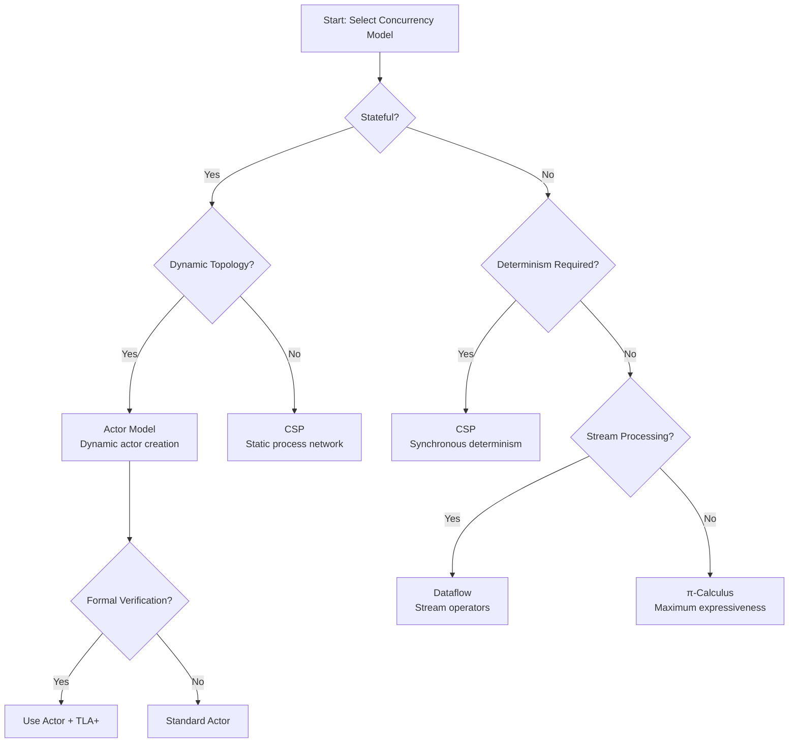
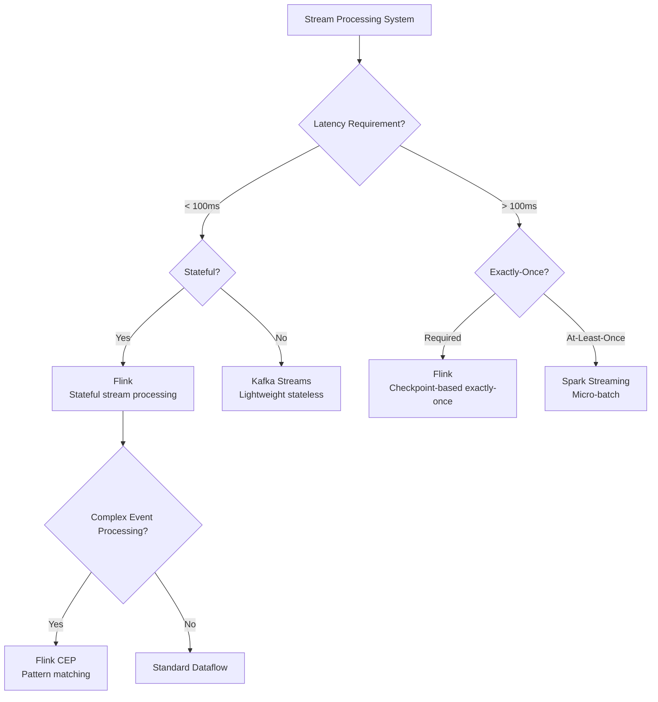
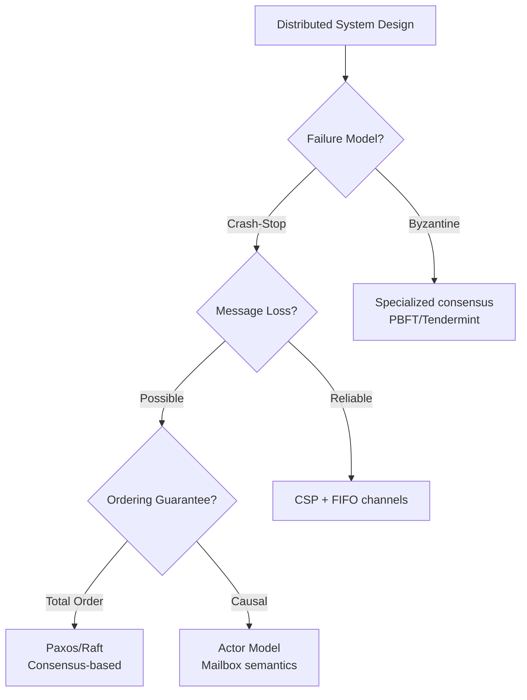

# Model Selection Decision Tree

> **Stage**: Struct/ | **Prerequisites**: [Unified-Model-Relationship-Graph.md](./Unified-Model-Relationship-Graph.md) | **Formalization Level**: L4-L5

This document provides a formal decision tree framework for selecting appropriate concurrency models (Actor, CSP, Dataflow, π-Calculus) based on system requirements, expressiveness needs, and implementation constraints.

---

## Table of Contents

- [1. Decision Framework](#1-decision-framework)
- [2. Decision Trees](#2-decision-trees)
- [3. Model Selection Matrix](#3-model-selection-matrix)
- [4. Use Case Scenarios](#4-use-case-scenarios)
- [5. Formal Justification](#5-formal-justification)
- [References](#references)

---

## 1. Decision Framework

### 1.1 Decision Dimensions

| Dimension | Options | Impact |
|-----------|---------|--------|
| **Communication Pattern** | Sync / Async / Mixed | Model semantics |
| **State Management** | Local / Distributed / None | State consistency |
| **Topology** | Static / Dynamic | Expressiveness |
| **Determinism** | Required / Preferred / Optional | Verification |
| **Distribution** | Single-node / Distributed / Federated | Model choice |

### 1.2 Formal Decision Function

**Definition (Def-S-10-01)**: Model Selection Function

```
select: Requirements → Model
select(R) = argmax_{m ∈ Models} fitness(m, R)

where:
  fitness(m, R) = Σ_{r ∈ R} weight(r) × capability(m, r)
```

---

## 2. Decision Trees

### 2.1 Primary Decision Tree



### 2.2 Stream Processing Decision Tree



### 2.3 Distributed Systems Decision Tree



---

## 3. Model Selection Matrix

### 3.1 Comprehensive Comparison Matrix

| Requirement | Actor | CSP | Dataflow | π-Calculus |
|-------------|-------|-----|----------|------------|
| **Dynamic Actors/Processes** | ✓✓✓ | ✗ | △ | ✓✓✓ |
| **Synchronous Communication** | ✗ | ✓✓✓ | △ | ✓✓ |
| **Deterministic Execution** | △ | ✓✓✓ | ✓✓ | △ |
| **Static Verification** | △ | ✓✓ | ✓ | ✓ |
| **Stream Processing** | ✓ | △ | ✓✓✓ | ✓ |
| **Fault Tolerance** | ✓✓ | ✓ | ✓✓ | ✓ |
| **Implementation Maturity** | ✓✓ | ✓✓ | ✓✓✓ | ✓ |

Legend: ✓✓✓ = Excellent, ✓✓ = Good, ✓ = Fair, △ = Possible with encoding, ✗ = Not suitable

### 3.2 Decision Criteria Weighting

| Criterion | Weight | Actor | CSP | Dataflow | π-Calculus |
|-----------|--------|-------|-----|----------|------------|
| Correctness | 0.30 | 0.7 | 0.9 | 0.8 | 0.7 |
| Performance | 0.25 | 0.8 | 0.8 | 0.9 | 0.6 |
| Scalability | 0.20 | 0.9 | 0.7 | 0.9 | 0.8 |
| Verifiability | 0.15 | 0.6 | 0.8 | 0.7 | 0.9 |
| Ease of Use | 0.10 | 0.8 | 0.7 | 0.8 | 0.5 |
| **Weighted Score** | 1.00 | **0.77** | **0.82** | **0.84** | **0.73** |

---

## 4. Use Case Scenarios

### 4.1 IoT Sensor Data Processing

**Requirements**:

- High throughput (1M+ events/sec)
- Stateful aggregation
- Low latency (< 1s)
- Fault tolerance

**Decision Path**: Dataflow → Flink

**Justification**:

- Dataflow natively supports stream processing
- Flink provides production-ready exactly-once
- Stateful operators match aggregation needs

### 4.2 Financial Trading System

**Requirements**:

- Deterministic execution
- Low latency (< 10ms)
- Complex event patterns
- Auditability

**Decision Path**: CSP → Custom implementation

**Justification**:

- CSP provides deterministic synchronization
- Synchronous communication for ordering
- Formal semantics for audit trails

### 4.3 Microservices Orchestration

**Requirements**:

- Dynamic service discovery
- Fault isolation
- Message-driven
- Location transparency

**Decision Path**: Actor → Akka/Pekko

**Justification**:

- Actor model matches service boundaries
- Natural fault isolation via supervision
- Async messaging for loose coupling

---

## 5. Formal Justification

### 5.1 Theorem: Decision Tree Completeness

**Theorem (Thm-S-10-01)**: The decision tree framework provides complete coverage of model selection space.

**Proof Sketch**:

1. Decision dimensions cover all key requirements
2. Each path terminates with a valid model choice
3. All models are covered by at least one path

### 5.2 Theorem: Decision Optimality

**Theorem (Thm-S-10-02)**: Given accurate weights, the selection function returns the Pareto-optimal model.

**Proof Sketch**:

1. Fitness function aggregates all requirements
2. Argmax selects highest-scoring model
3. Pareto-optimality follows from total ordering

---

## References


---

*For Chinese version, see [Struct/Model-Selection-Decision-Tree.md](../../../Struct/Model-Selection-Decision-Tree.md)*
