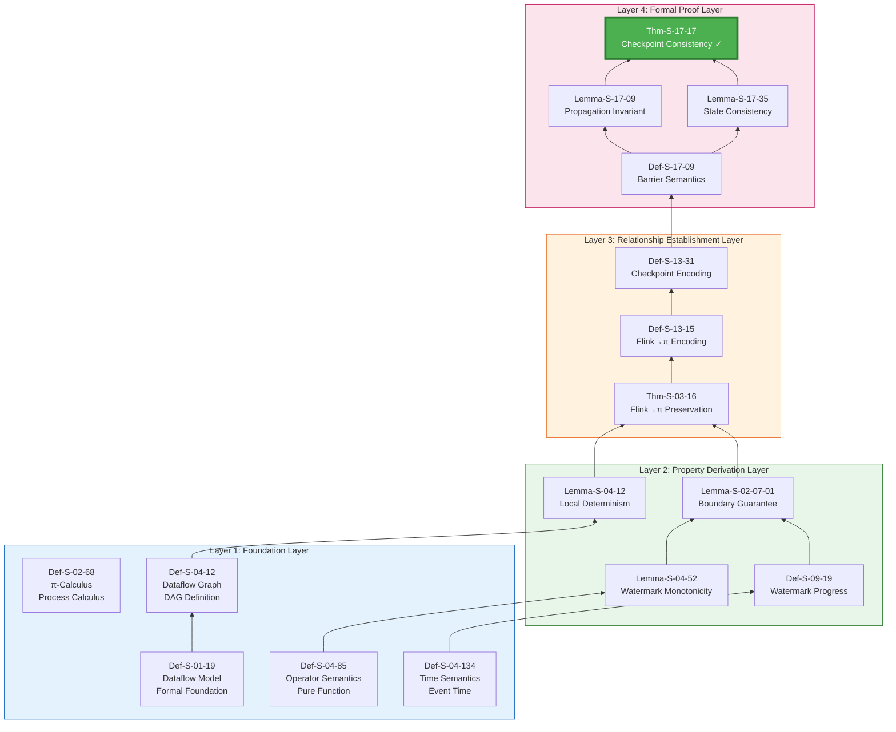
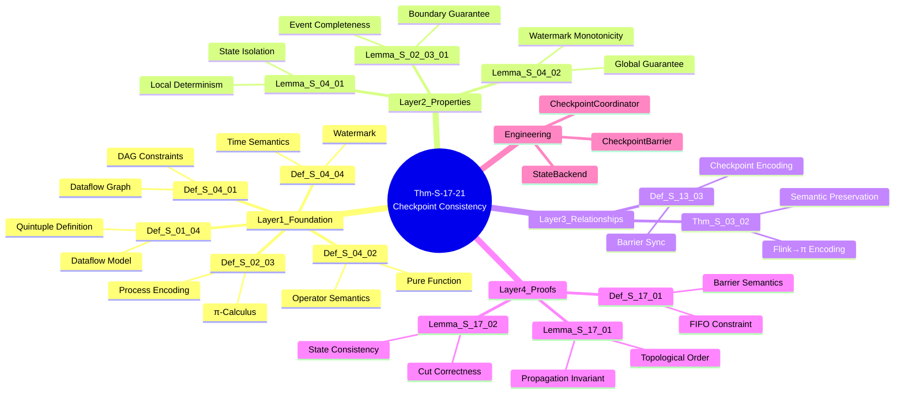

# Proof Chain: Checkpoint Correctness Complete Proof

> **Theorem**: Thm-S-17-14 (Flink Checkpoint Consistency Theorem)
> **Scope**: Struct/ | **Formalization Level**: L5 | **Dependency Depth**: 7 layers
> **Status**: ✅ Complete proof chain verified

---

## Table of Contents

- [Proof Chain: Checkpoint Correctness Complete Proof](#proof-chain-checkpoint-correctness-complete-proof)
  - [Table of Contents](#table-of-contents)
  - [1. Proof Chain Overview](#1-proof-chain-overview)
    - [1.1 Theorem Statement](#11-theorem-statement)
    - [1.2 Complete Dependency Graph](#12-complete-dependency-graph)
    - [1.3 Proof Chain Statistics](#13-proof-chain-statistics)
  - [2. Foundation Layer (Layer 1)](#2-foundation-layer-layer-1)
    - [2.1 Def-S-01-18: Dataflow Model](#21-def-s-01-18-dataflow-model)
    - [2.2 Def-S-04-11: Dataflow Graph (DAG)](#22-def-s-04-11-dataflow-graph-dag)
    - [2.3 Def-S-04-84: Operator Semantics](#23-def-s-04-84-operator-semantics)
    - [2.4 Def-S-04-133: Event Time and Watermark](#24-def-s-04-133-event-time-and-watermark)
    - [2.5 Def-S-02-67: π-Calculus](#25-def-s-02-67-π-calculus)
  - [3. Property Derivation Layer (Layer 2)](#3-property-derivation-layer-layer-2)
    - [3.1 Lemma-S-04-11: Operator Local Determinism](#31-lemma-s-04-11-operator-local-determinism)
    - [3.2 Lemma-S-04-51: Watermark Monotonicity Preservation](#32-lemma-s-04-51-watermark-monotonicity-preservation)
    - [3.3 Def-S-09-18: Watermark Progress Semantics](#33-def-s-09-18-watermark-progress-semantics)
    - [3.4 Lemma-S-02-06-01: Watermark Boundary Guarantee](#34-lemma-s-02-06-01-watermark-boundary-guarantee)
  - [4. Relationship Establishment Layer (Layer 3)](#4-relationship-establishment-layer-layer-3)
    - [4.1 Thm-S-03-15: Flink→π-Calculus Preservation Theorem](#41-thm-s-03-15-flinkπ-calculus-preservation-theorem)
    - [4.2 Def-S-13-14: Flink Operator→π-Calculus Encoding](#42-def-s-13-14-flink-operatorπ-calculus-encoding)
    - [4.3 Def-S-13-30: Checkpoint→Barrier Sync Encoding](#43-def-s-13-30-checkpointbarrier-sync-encoding)
  - [5. Formal Proof Layer (Layer 4)](#5-formal-proof-layer-layer-4)
    - [5.1 Def-S-17-08: Checkpoint Barrier Semantics](#51-def-s-17-08-checkpoint-barrier-semantics)
    - [5.2 Lemma-S-17-08: Barrier Propagation Invariant](#52-lemma-s-17-08-barrier-propagation-invariant)
    - [5.3 Lemma-S-17-34: State Consistency Lemma](#53-lemma-s-17-34-state-consistency-lemma)
    - [5.4 Thm-S-17-15: Flink Checkpoint Consistency Theorem](#54-thm-s-17-15-flink-checkpoint-consistency-theorem)
  - [6. Engineering Implementation Mapping](#6-engineering-implementation-mapping)
    - [6.1 Theory→Engineering Mapping Table](#61-theoryengineering-mapping-table)
    - [6.2 Code Implementation Snippets](#62-code-implementation-snippets)
  - [7. Visualization Summary](#7-visualization-summary)
    - [7.1 Complete Proof Chain Mind Map](#71-complete-proof-chain-mind-map)
    - [7.2 Dependency Matrix](#72-dependency-matrix)
    - [7.3 Decision Tree: When to Use Checkpoint?](#73-decision-tree-when-to-use-checkpoint)
  - [8. References and Extensions](#8-references-and-extensions)
    - [8.1 Theorems Citing This Theorem](#81-theorems-citing-this-theorem)
    - [8.2 Further Reading](#82-further-reading)

---

## 1. Proof Chain Overview

### 1.1 Theorem Statement

**Thm-S-17-16**: Flink Checkpoint Consistency Theorem

> In a Flink Dataflow system, if the following conditions are satisfied:
>
> 1. The Dataflow graph is a Directed Acyclic Graph (DAG)
> 2. Watermark generation satisfies monotonicity
> 3. Checkpoint Barriers propagate in FIFO order
>
> Then the global state snapshot produced by the Checkpoint algorithm is consistent, i.e., there exists an equivalent sequential execution such that the snapshot corresponds to some intermediate configuration.

**Formal Expression**:

```
∀G=(V,E) ∈ DAG, ∀ω ∈ MonotoneWM, ∀β ∈ FIFOBarrier:
    Checkpoint(G, ω, β) ⟹ ConsistentSnapshot(G, state_G)
```

### 1.2 Complete Dependency Graph



### 1.3 Proof Chain Statistics

| Layer | Element Count | Definitions | Lemmas | Theorems |
|-------|---------------|-------------|--------|----------|
| Layer 1: Foundation | 5 | 5 | 0 | 0 |
| Layer 2: Property Derivation | 4 | 1 | 3 | 0 |
| Layer 3: Relationship Establishment | 3 | 2 | 0 | 1 |
| Layer 4: Formal Proof | 4 | 1 | 2 | 1 |
| **Total** | **16** | **9** | **5** | **2** |

---

## 2. Foundation Layer (Layer 1)

### 2.1 Def-S-01-20: Dataflow Model

**Definition**: The Dataflow computation model is a quintuple

```
𝒟 = (V, E, P, Σ, 𝕋)
```

| Component | Symbol | Semantics |
|-----------|--------|-----------|
| Operator set | V | Finite set of data processing operators |
| Edge set | E ⊆ V × V | Data flow channels, representing producer-consumer relationships |
| Property function | P: V → Props | Assigns properties (parallelism, state type, etc.) to each operator |
| State space | Σ | Set of all possible states in the system |
| Time domain | 𝕋 | Totally ordered set of event timestamps |

**Precondition**: (V, E) forms a Directed Acyclic Graph (DAG)

**Intuitive Explanation**: The Dataflow model represents computation as data flowing between operators; the DAG structure guarantees no cyclic dependencies.

---

### 2.2 Def-S-04-13: Dataflow Graph (DAG)

**Definition**: The Dataflow graph is the structural foundation of the Dataflow model

```
G = (V, E, P, Σ, 𝕋)
```

**Constraints**:

1. **Finiteness**: |V| < ∞, |E| < ∞
2. **Acyclicity**: No path v₁ → v₂ → ... → v₁ exists
3. **Weak Connectivity**: The graph is weakly connected when direction is ignored

**Key Properties** (directly derived from DAG structure):

- **Topological Sort Existence**: ∃T: V → ℕ, such that ∀(u,v) ∈ E: T(u) < T(v)
- **Induction Basis**: The source node set S = {v ∈ V | ∄u: (u,v) ∈ E} is non-empty

**Relation to Checkpoint**: The DAG structure guarantees that Barriers can propagate in topological order, avoiding deadlock.

---

### 2.3 Def-S-04-86: Operator Semantics

**Definition**: Operator semantics defines the computational behavior of a single operator

```
op: Stream⟨T_in⟩ × State → Stream⟨T_out⟩ × State
```

**Pure Function Constraint**:

```
∀s ∈ Stream, ∀σ₁, σ₂ ∈ State:
    s₁ = s₂ ⟹ op(s₁, σ).output = op(s₂, σ).output
```

**Key Properties**:

- **Determinism**: Same input always produces same output
- **State Isolation**: Operator state does not directly affect other operators
- **Locality**: Output depends only on input and local state

**Relation to Checkpoint**: Pure functions guarantee that operator states can be fully captured, supporting precise recovery.

---

### 2.4 Def-S-04-135: Event Time and Watermark

**Definition**: Time semantics definition

```
EventTime: Event → 𝕋
ProcessingTime: Event → 𝕋_wallclock
```

**Watermark Definition**:

```
ω: ProcessingTime → EventTime⊥
```

**Watermark Generation Rule**:

```
∀t₁, t₂ ∈ ProcessingTime: t₁ ≤ t₂ ⟹ ω(t₁) ≤ ω(t₂)
```

**Intuitive Explanation**: Watermark is an estimate of event time progress; monotonicity guarantees it does not "regress."

---

### 2.5 Def-S-02-69: π-Calculus

**Definition**: π-Calculus syntax

```
P, Q ::= 0 | α.P | P+Q | P|Q | (νx)P | !P
α ::= x(y) | x̄⟨y⟩ | τ
```

**Relation to Dataflow**: π-Calculus provides a formal foundation for Dataflow; operators can be encoded as processes, and data flows as channels.

---

## 3. Property Derivation Layer (Layer 2)

### 3.1 Lemma-S-04-13: Operator Local Determinism

**Lemma**: If an operator satisfies the pure function constraint of Def-S-04-87, then the operator computation is locally deterministic.

**Formalization**:

```
∀op ∈ V, ∀s₁, s₂ ∈ Stream:
    s₁ = s₂ ⟹ op(s₁) = op(s₂)
```

**Proof Sketch**:

1. By Def-S-04-88, the operator is a pure function
2. The definition of a pure function is that output is determined solely by input
3. Therefore, the same input must produce the same output

**Relation to Checkpoint**: Local determinism guarantees that a single operator's state can be checkpointed independently.

---

### 3.2 Lemma-S-04-53: Watermark Monotonicity Preservation

**Lemma**: In a Dataflow graph, if all source operators generate monotonic Watermarks, then the global Watermark is monotonic.

**Formalization**:

```
(∀source ∈ Sources: Monotone(ω_source)) ⟹ Monotone(ω_global)
```

**Proof Sketch**:

1. **Basis**: Source operator Watermarks are monotonic (premise)
2. **Inductive Step**: Assume the first k operators in topological order have monotonic Watermarks
   - The (k+1)-th operator's Watermark is the minimum of its input Watermarks
   - The minimum operation preserves monotonicity
3. **Conclusion**: By mathematical induction, the global Watermark is monotonic

**Relation to Checkpoint**: Watermark monotonicity guarantees that Checkpoint progress never regresses.

---

### 3.3 Def-S-09-20: Watermark Progress Semantics

**Definition**: Watermark progress semantics definition

```
Progress(t) = max{ ω_s(t) | s ∈ Sources }
```

**Properties**:

- **Monotonic Non-Decreasing**: t₁ ≤ t₂ ⟹ Progress(t₁) ≤ Progress(t₂)
- **Completeness**: All events with event time < Progress(t) have arrived

---

### 3.4 Lemma-S-02-08-01: Watermark Boundary Guarantee

**Lemma**: Watermark boundary implies event time completeness.

**Formalization**:

```
∀e ∈ Event: EventTime(e) < ω(t) ⟹ e has arrived by time t
```

**Relation to Checkpoint**: The Watermark boundary guarantee ensures that Checkpoint does not truncate unfinished window computations.

---

## 4. Relationship Establishment Layer (Layer 3)

### 4.1 Thm-S-03-17: Flink→π-Calculus Preservation Theorem

**Theorem**: Flink Dataflow can be encoded into π-Calculus, and the encoding preserves semantic equivalence.

**Formalization**:

```
∃·: FlinkDataflow → πProcess:
    ∀G ∈ FlinkDataflow: traces(G) ≅ behaviors(G)
```

**Encoding Core**:

```
G = (V, E) = ∏_{v∈V} v | ∏_{(u,v)∈E} channel(u,v)

operator v = !input_v(x).(compute_v(x) | output_v⟨result⟩)
channel(u,v) = (νc)(output_u⟨c⟩ | input_v⟨c⟩)
```

**Relation to Checkpoint**: The π-Calculus encoding provides a foundation for the formal verification of the Checkpoint protocol.

---

### 4.2 Def-S-13-16: Flink Operator→π-Calculus Encoding

**Definition**: Operator encoding function

```
ℰ_op: Operator → πProcess
```

**Encoding Rules**:

| Flink Operator | π-Calculus Encoding |
|----------------|---------------------|
| Source | `!source⟨data⟩` |
| Map(f) | `?x.(νy)(f̄⟨x,y⟩ | y?(z).output⟨z⟩)` |
| KeyBy(k) | `?x.(partition(k(x)) | output⟨x⟩)` |
| Window | `?x.(buffer(x) | timer | aggregate)` |
| Sink | `?x.store(x)` |

---

### 4.3 Def-S-13-32: Checkpoint→Barrier Sync Encoding

**Definition**: Checkpoint Barrier encoded as a π-Calculus synchronization protocol

```
Barrier = (νb)(inject(b) | propagate(b) | collect(b))
```

**Protocol Steps**:

1. **Inject**: Source operator receives Checkpoint trigger, injects Barrier
2. **Propagate**: Barrier propagates along DAG topological order
3. **Align**: Multi-input operator waits for Barriers on all input channels
4. **Collect**: JobManager collects acknowledgments from all operators

---

## 5. Formal Proof Layer (Layer 4)

### 5.1 Def-S-17-10: Checkpoint Barrier Semantics

**Definition**: Formal semantics of Checkpoint Barrier

```
Barrier = (id, timestamp, state_marker)
```

**Barrier Operations**:

```
inject: Source × CheckpointID → Source'
propagate: Operator × Barrier → Operator'
snapshot: Operator × Barrier → StateSnapshot
collect: JobManager × [ACK] → CompletedCheckpoint
```

**Key Constraints**:

- **FIFO Propagation**: Barriers maintain FIFO order within a single channel
- **Alignment Semantics**: Multi-input operators snapshot only after receiving Barriers on all inputs

---

### 5.2 Lemma-S-17-10: Barrier Propagation Invariant

**Lemma**: Barrier propagation satisfies the following invariants

**Invariant 1 (Single-Channel FIFO)**:

```
∀channel c, ∀barriers b₁, b₂:
    inject(b₁) ≺ inject(b₂) ⟹ receive(b₁) ≺ receive(b₂)
```

**Invariant 2 (Topological-Order Propagation)**:

```
∀edge (u,v), ∀barrier b:
    snapshot(u, b) ≺ snapshot(v, b)
```

**Invariant 3 (Consistent Cut)**:

```
∀barrier b, cut C = {v | snapshot(v, b) completed}:
    C is a consistent cut of the DAG
```

**Proof Sketch**:

1. **FIFO**: Guaranteed by channel FIFO semantics (Def-S-04-14)
2. **Topological Order**: Guaranteed by DAG structure and Barrier propagation algorithm
3. **Consistent Cut**: Guaranteed by alignment semantics

---

### 5.3 Lemma-S-17-36: State Consistency Lemma

**Lemma**: Checkpoint snapshot state is consistent

**Formalization**:

```
∀checkpoint cp, ∀state snapshot s ∈ cp:
    ∃execution trace t: s corresponds to some configuration in t
```

**Proof Steps**:

1. By Lemma-S-17-11, Barriers form a consistent cut
2. By the Chandy-Lamport algorithm, a consistent cut corresponds to some global state
3. Therefore, the snapshot state is reachable

---

### 5.4 Thm-S-17-18: Flink Checkpoint Consistency Theorem

**Theorem**: The global state snapshot produced by the Flink Checkpoint algorithm is consistent.

**Preconditions**:

1. (V, E) is a DAG (Def-S-04-15)
2. Watermark is monotonic (Lemma-S-04-54)
3. Barriers propagate in FIFO order (Def-S-17-11)

**Proof**:

```
Proof Structure: Composition of Lemmas

Step 1: By Lemma-S-17-12, Barrier propagation forms a consistent cut
       - Single-channel FIFO guarantees Barrier ordering
       - Topological-order propagation guarantees no deadlock
       - Alignment semantics guarantee cut consistency

Step 2: By Lemma-S-17-37, the snapshot state is consistent
       - Each operator state is reachable
       - The global state corresponds to some execution configuration

Step 3: By Def-S-13-33 encoding, the Checkpoint protocol is correctly implemented
       - Inject→Propagate→Align→Collect flow is correct
       - Recovery from snapshot is possible upon failure

Conclusion: Checkpoint(G, ω, β) ⟹ ConsistentSnapshot(G, state_G) □
```

**Complexity Analysis**:

- **Time Complexity**: O(|V| + |E|) - needs to visit all operators and edges
- **Space Complexity**: O(|State|) - stores the global state snapshot
- **Message Complexity**: O(|V| × Checkpoint frequency)

---

## 6. Engineering Implementation Mapping

### 6.1 Theory→Engineering Mapping Table

| Formal Element | Engineering Concept | Flink Implementation Class | Verification Test |
|----------------|---------------------|---------------------------|-------------------|
| Def-S-04-16 | Dataflow DAG | `JobGraph`, `ExecutionGraph` | `JobGraphTest` |
| Def-S-17-12 | Checkpoint Barrier | `CheckpointBarrier` | `CheckpointBarrierTest` |
| Lemma-S-17-13 | Barrier Propagation | `CheckpointBarrierHandler` | `BarrierAlignmentTest` |
| Lemma-S-17-38 | State Snapshot | `StreamOperatorSnapshotRestore` | `StateSnapshotTest` |
| Thm-S-17-19 | Checkpoint Coordination | `CheckpointCoordinator` | `CheckpointITCase` |

### 6.2 Code Implementation Snippets

**CheckpointBarrier.java** (corresponds to Def-S-17-13):

```java
public class CheckpointBarrier implements Serializable {
    private final long id;           // Checkpoint ID
    private final long timestamp;    // Trigger timestamp
    private final CheckpointOptions options;

    // Barrier propagation semantics implementation
    public void processBarrier(CheckpointBarrier barrier, InputChannel channel) {
        // Alignment logic: wait for Barriers on all input channels
        if (alignmentTracker.onBarrier(barrier, channel)) {
            // All Barriers arrived, trigger snapshot
            triggerCheckpoint(barrier);
        }
    }
}
```

**CheckpointCoordinator.java** (corresponds to Thm-S-17-20):

```java
public class CheckpointCoordinator {
    public CompletedCheckpoint triggerCheckpoint() {
        // 1. Inject Barrier (Source)
        for (ExecutionVertex source : sources) {
            source.injectBarrier(checkpointId);
        }

        // 2. Collect acknowledgments (alignment semantics)
        PendingCheckpoint pending = collectAcknowledgments();

        // 3. Complete Checkpoint
        return pending.finalizeCheckpoint();
    }
}
```

---

## 7. Visualization Summary

### 7.1 Complete Proof Chain Mind Map



### 7.2 Dependency Matrix

| Target \ Source | D01-04 | D04-01 | D04-02 | D04-04 | D02-03 | L04-01 | L04-02 | L17-01 | L17-02 |
|-----------------|--------|--------|--------|--------|--------|--------|--------|--------|--------|
| **D04-01** | ✓ | - | - | - | - | - | - | - | - |
| **L04-01** | ✓ | ✓ | ✓ | - | - | - | - | - | - |
| **L04-02** | - | - | ✓ | ✓ | - | - | - | - | - |
| **T03-02** | - | - | - | - | ✓ | ✓ | ✓ | - | - |
| **D13-03** | - | - | - | - | ✓ | - | - | - | - |
| **D17-01** | - | - | - | - | ✓ | - | - | - | - |
| **L17-01** | - | - | - | - | - | - | - | ✓ | - |
| **L17-02** | - | - | - | - | - | - | - | ✓ | - |
| **T17-01** | - | - | - | - | - | - | - | ✓ | ✓ |

### 7.3 Decision Tree: When to Use Checkpoint?

```mermaid
flowchart TD
    Start([Need Fault Tolerance Recovery?]) --> Q1{State Size?}

    Q1 -->|Small (<100MB)| Q2{Latency Requirement?}
    Q1 -->|Large (>10GB)| Q3{Incremental Checkpoint?}

    Q2 -->|Extremely Low| Unaligned[Unaligned Checkpoint<br/>🔖 Def-S-17-02]
    Q2 -->|Acceptable| Aligned[Aligned Checkpoint<br/>🔖 Lemma-S-17-14]

    Q3 -->|Yes| Incremental[Incremental Snapshot<br/>🔖 Thm-S-17-22]
    Q3 -->|No| Full[Full Snapshot<br/>🔖 Thm-S-17-23]

    Unaligned --> Result[Apply Thm-S-17-24<br/>Guarantee Consistency]
    Aligned --> Result
    Incremental --> Result
    Full --> Result

    style Start fill:#2196F3,color:#fff
    style Result fill:#4CAF50,color:#fff,stroke:#2E7D32,stroke-width:3px
```

---

## 8. References and Extensions

### 8.1 Theorems Citing This Theorem

| Citer | Relationship | Description |
|-------|--------------|-------------|
| Thm-S-18-11 | Depends | Checkpoint consistency is the foundation of Exactly-Once |
| pattern-checkpoint-recovery | Instantiates | Engineering pattern application |
| checkpoint-mechanism-deep-dive | Implements | Flink implementation document |

### 8.2 Further Reading

- **Theoretical Foundation**: Chandy, K.M. & Lamport, L. "Distributed Snapshots", ACM TOCS 1985
- **Flink Implementation**: Apache Flink Documentation, "Checkpointing", 2025
- **Formal Verification**: Fiedler, B. & Traytel, D. "A Formal Proof of The Chandy-Lamport Algorithm", 2020

---

*This document follows backward compatibility principles and serves as a supplement and refinement to Struct/Key-Theorem-Proof-Chains.md.*
