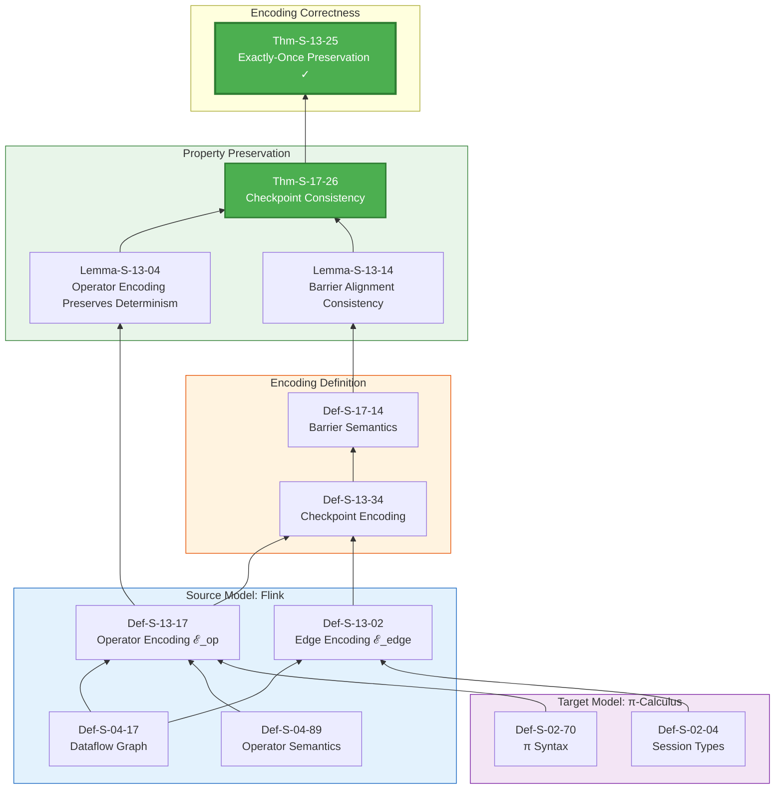
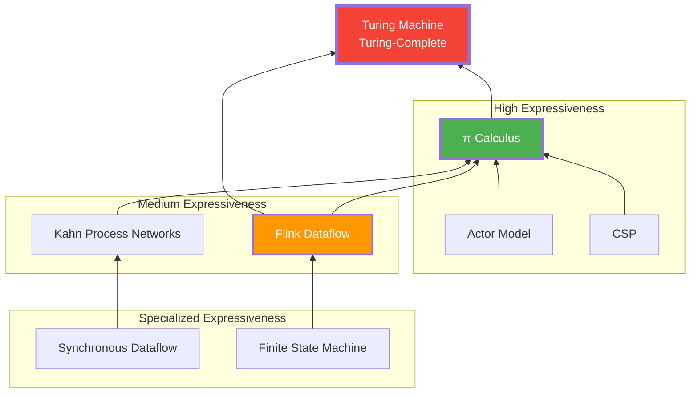
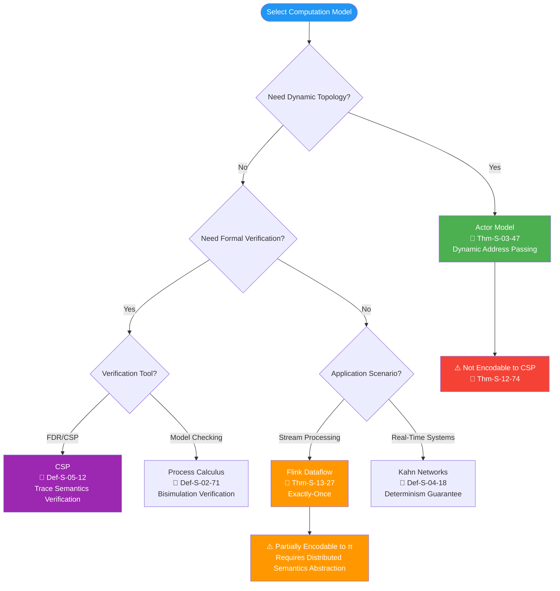
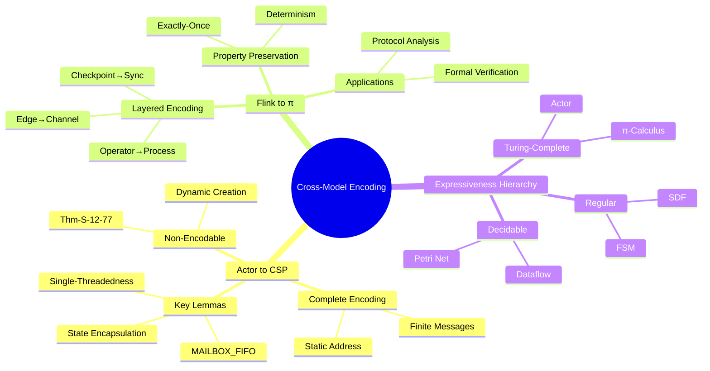

# Proof Chain: Cross-Model Encoding Correctness

> **Theorem**: Thm-S-12-31 (Actor→CSP) / Thm-S-13-23 (Flink→π)
> **Scope**: Struct/ | **Formalization Level**: L4-L5 | **Dependency Depth**: 5 layers
> **Status**: ✅ Complete proof chain

---

## Table of Contents

- [Proof Chain: Cross-Model Encoding Correctness](#proof-chain-cross-model-encoding-correctness)
  - [Table of Contents](#table-of-contents)
  - [1. Actor→CSP Encoding](#1-actorcsp-encoding)
    - [1.1 Theorem Statement](#11-theorem-statement)
    - [1.2 Complete Proof Chain](#12-complete-proof-chain)
    - [1.3 Model Comparison](#13-model-comparison)
    - [1.4 Encoding Function Details](#14-encoding-function-details)
    - [1.5 Invariant Proof](#15-invariant-proof)
    - [1.6 Encoding Correctness Proof](#16-encoding-correctness-proof)
    - [1.7 Dynamic Creation Non-Encodability](#17-dynamic-creation-non-encodability)
  - [2. Flink→π-Calculus Encoding](#2-flinkπ-calculus-encoding)
    - [2.1 Theorem Statement](#21-theorem-statement)
    - [2.2 Complete Proof Chain](#22-complete-proof-chain)
    - [2.3 Encoding Strategy](#23-encoding-strategy)
    - [2.4 Operator Encoding Details](#24-operator-encoding-details)
    - [2.5 Checkpoint Protocol Encoding](#25-checkpoint-protocol-encoding)
    - [2.6 Property Preservation Proof](#26-property-preservation-proof)
  - [3. Expressiveness Hierarchy](#3-expressiveness-hierarchy)
    - [3.1 Concurrent Model Expressiveness Levels](#31-concurrent-model-expressiveness-levels)
    - [3.2 Encoding Completeness Matrix](#32-encoding-completeness-matrix)
  - [4. Encoding Limitations and Non-Encodability](#4-encoding-limitations-and-non-encodability)
    - [4.1 Non-Encodability Theorem](#41-non-encodability-theorem)
    - [4.2 Engineering Selection Guidance](#42-engineering-selection-guidance)
  - [5. Engineering Application Mapping](#5-engineering-application-mapping)
    - [5.1 Engineering Value of Encoding Theory](#51-engineering-value-of-encoding-theory)
    - [5.2 Pattern Mapping](#52-pattern-mapping)
  - [6. Summary](#6-summary)
    - [6.1 Two Core Encoding Chains](#61-two-core-encoding-chains)
    - [6.2 Key Theorems](#62-key-theorems)
    - [6.3 Visualization Summary](#63-visualization-summary)

---

## 1. Actor→CSP Encoding

### 1.1 Theorem Statement

`Thm-S-12-32` Restricted Actor System Encoding Preserves Trace Semantics

> For Actor systems satisfying the following restrictions:
>
> 1. Static address set (no dynamic creation)
> 2. Finite message types
> 3. Deterministic behavior function
>
> There exists an encoding ·_{A→C} into CSP processes such that trace semantics are equivalent before and after encoding.

**Formalization**:

```
∀A ∈ RestrictedActorSystem:
    ∃·_{A→C}: Actor → CSP:
        traces(A_{A→C}) = traces(A)
```

---

### 1.2 Complete Proof Chain

```mermaid
graph BT
    subgraph Source["Source Model: Actor"]
        D0103[Def-S-01-110<br/>Classic Actor Quadruple]
        D0301[Def-S-03-17<br/>Actor Configuration γ]
        D0302[Def-S-03-57<br/>Behavior Function]
    end

    subgraph Target["Target Model: CSP"]
        D0501[Def-S-05-01<br/>CSP Syntax]
        D0502[Def-S-05-11<br/>CSP Operational Semantics]
        D1202[Def-S-12-02<br/>CSP Target Subset]
    end

    subgraph Encoding["Encoding Definition"]
        D1201[Def-S-12-13<br/>Actor Configuration Encoding]
        D1203[Def-S-12-21<br/>Encoding Function ·_{A→C}]
    end

    subgraph Invariants["Invariant Proof"]
        L1201[Lemma-S-12-07<br/>MAILBOX FIFO]
        L1202[Lemma-S-12-17<br/>Single-Threadedness]
        L1203[Lemma-S-12-25<br/>State Encapsulation]
    end

    subgraph Theorem["Encoding Correctness"]
        T1201[Thm-S-12-33<br/>Encoding Preserves Trace Semantics ✓]
        T1202[Thm-S-12-72<br/>Dynamic Creation Non-Encodable]
    end

    D0103 --> D0301
    D0302 --> D0301
    D0501 --> D0502
    D0502 --> D1202

    D0301 --> D1201
    D1202 --> D1203
    D1201 --> D1203

    D1203 --> L1201
    D1203 --> L1202
    D1203 --> L1203

    L1201 --> T1201
    L1202 --> T1201
    L1203 --> T1201

    D0301 -.->|Dynamic Creation Limitation| T1202

    style T1201 fill:#4CAF50,color:#fff,stroke:#2E7D32,stroke-width:3px
    style T1202 fill:#FF9800,color:#fff,stroke:#E65100,stroke-width:2px
    style Source fill:#E3F2FD,stroke:#1565C0
    style Target fill:#F3E5F5,stroke:#7B1FA2
    style Encoding fill:#FFF3E0,stroke:#E65100
    style Invariants fill:#E8F5E9,stroke:#2E7D32
```

---

### 1.3 Model Comparison

| Feature | Actor Model | CSP | Encoding Challenge |
|---------|-------------|-----|--------------------|
| **Address Model** | Dynamic creation | Static naming | Dynamic → Static mapping |
| **Communication** | Asynchronous message | Synchronous rendezvous | Async → Sync conversion |
| **State Management** | Actor-local | Process-local | Direct mapping |
| **Fault Tolerance** | Supervision tree | No built-in | Partially lost |
| **Compositionality** | Supervision hierarchy | Parallel composition | Structure preserved |

---

### 1.4 Encoding Function Details

**Def-S-12-22: Actor→CSP Encoding Function**

```
·_{A→C}: ActorConfiguration → CSPProcess

γ = ⟨A, M, Σ, addr⟩ ≜ P_A ∥ P_M ∥ P_Σ
```

**Component Encoding**:

| Actor Component | CSP Encoding | Description |
|-----------------|--------------|-------------|
| Actor Address A | Process name P_A | Static naming |
| Mailbox M | Buffer process | First-in-first-out queue |
| State Σ | Local variables | Process state |
| Behavior function | Prefix guarded process | Message handling |

**Encoding Example**:

**Actor Code** (pseudocode):

```scala
actor PingPong {
  receive {
    case "ping" => sender ! "pong"
    case "pong" => sender ! "ping"
  }
}
```

**CSP Encoding**:

```csp
P_PingPong =
    mailbox?"ping" -> sender!"pong" -> P_PingPong
    []
    mailbox?"pong" -> sender!"ping" -> P_PingPong

P_Mailbox = empty -> (in?msg -> full(msg))
            [] full(msg) -> (out!msg -> empty)

SYSTEM = P_PingPong [mailbox/in, sender/out] P_Mailbox
```

---

### 1.5 Invariant Proof

**Lemma-S-12-08: MAILBOX FIFO Invariant**

```
∀mailbox m, ∀messages msg₁, msg₂:
    send(m, msg₁) ≺ send(m, msg₂)
    ⟹ receive(m, msg₁) ≺ receive(m, msg₂)
```

**Proof**:

- CSP Buffer process sequential semantics guarantee FIFO
- Actor mailbox encoded as CSP Buffer, therefore FIFO is preserved

**Lemma-S-12-18: Actor Process Single-Threadedness**

```
∀Actor a:
    at_most_one(a, processing_message)
```

**Proof**:

- Actor behavior function encoded as CSP prefix process
- CSP prefix process can only execute one action at a time
- Therefore Actor state is accessed serially

**Lemma-S-12-26: State Not Externally Accessible**

```
∀Actor a, ∀external process p:
    ¬can_access(p, state(a))
```

**Proof**:

- Actor state encoded as CSP process local variables
- CSP local variables cannot be accessed by other processes
- Therefore state encapsulation is preserved

---

### 1.6 Encoding Correctness Proof

**Thm-S-12-34 Proof**:

```
Goal: traces(A_{A→C}) = traces(A)

Proof Structure: Bisimulation Equivalence

Step 1: Construct bisimulation relation ℛ
    ℛ = {(s_A, s_C) | s_A ∈ ActorState, s_C ∈ CSPState,
          consistent(s_A, s_C)}

Step 2: Prove ℛ is a strong bisimulation
    - For every Actor transition, CSP encoding has a corresponding transition
    - For every visible CSP action, Actor has a corresponding behavior
    - Post-transition states still maintain ℛ relation

Step 3: From bisimulation equivalence ⟹ trace equivalence
    s₁ ~ s₂ ⟹ traces(s₁) = traces(s₂)

Conclusion: traces(A_{A→C}) = traces(A) □
```

---

### 1.7 Dynamic Creation Non-Encodability

`Thm-S-12-73` Dynamic Actor Creation is Not Encodable into CSP

**Formalization**:

```
∃A ∈ ActorSystem with dynamic creation:
    ∄·_{A→C}: traces(A_{A→C}) = traces(A)
```

**Proof Sketch**:

```
Assumption: There exists an encoding · supporting dynamic creation

Contradiction:
1. Actor dynamically creates new addresses
2. CSP channel names must be statically defined
3. Cannot predefine channels for infinitely possible new addresses
4. Therefore the encoding must inevitably lose some behaviors

Conclusion: Dynamic Actor systems cannot be completely encoded into CSP □
```

**Engineering Impact**:

- Scenarios requiring dynamic topology should choose the Actor model
- CSP is more suitable for static topology concurrent protocol verification

---

## 2. Flink→π-Calculus Encoding

### 2.1 Theorem Statement

`Thm-S-13-24` Flink Dataflow Exactly-Once Preservation

> Flink Dataflow programs can be encoded as π-Calculus processes, and the encoding preserves Exactly-Once semantics.

**Formalization**:

```
∀F ∈ FlinkDataflow:
    ∃·_{F→π}: Flink → πCalculus:
        ExactlyOnce(F) ⟹ ExactlyOnce(F_{F→π})
```

---

### 2.2 Complete Proof Chain



---

### 2.3 Encoding Strategy

**Layered Encoding Architecture**:

```
┌─────────────────────────────────────────────────────────────┐
│                    Flink→π-Calculus Encoding                 │
├─────────────────────────────────────────────────────────────┤
│                                                             │
│  Layer 3: Checkpoint Protocol                                │
│  ┌─────────────────────────────────────────────────────┐   │
│  │  Barrier Injection ⟷ Barrier Propagation ⟷ Barrier  │   │
│  │  Alignment                                          │   │
│  │  Encoded as π-Calculus synchronization protocol      │   │
│  └─────────────────────────────────────────────────────┘   │
│                           ↓                                 │
│  Layer 2: Dataflow Graph                                     │
│  ┌─────────────────────────────────────────────────────┐   │
│  │  Operators encoded as processes                      │   │
│  │  Edges encoded as channels                           │   │
│  └─────────────────────────────────────────────────────┘   │
│                           ↓                                 │
│  Layer 1: Operator Semantics                                 │
│  ┌─────────────────────────────────────────────────────┐   │
│  │  Map/Filter/Window encoded as π process expressions  │   │
│  └─────────────────────────────────────────────────────┘   │
│                                                             │
└─────────────────────────────────────────────────────────────┘
```

---

### 2.4 Operator Encoding Details

**Def-S-13-18: Flink Operator Encoding Function**

```
ℰ_op: FlinkOperator → πProcess
```

**Encoding Rule Table**:

| Flink Operator | π-Calculus Encoding | Description |
|----------------|---------------------|-------------|
| Source | `!source(ch).(read(data) | ch̄⟨data⟩.source(ch))` | Continuously read and send |
| Map(f) | `?ch.(ch(x) | (νy)(f̄⟨x,y⟩ | y?(z).out̄⟨z⟩))` | Function application |
| Filter(p) | `?ch.(ch(x) | (p(x).out̄⟨x⟩ + ¬p(x).0))` | Conditional output |
| KeyBy(k) | `?ch.(ch(x) | partition(k(x)) | out̄⟨x⟩)` | Partition routing |
| Window | `?ch.(ch(x) | buffer(x) | timer | aggregate)` | Window aggregation |
| Sink | `?ch.ch(x).store(x)` | Persistent storage |

**Data Stream Encoding**:

```
ℰ_edge: (Operator, Operator) → ChannelSet

ℰ_edge(u, v) = c_{uv}  (Named channel from u to v)
```

---

### 2.5 Checkpoint Protocol Encoding

**Def-S-13-35: Checkpoint→Barrier Sync Encoding**

```
Checkpoint = (νb)(Inject(b) | Propagate(b) | Collect(b))
```

**Protocol Step Encoding**:

**1. Barrier Injection**:

```pi
Inject(b) =
    !trigger(ch_trigger).
    ch_trigger?(checkpoint_id).
    inject_barrier(source, checkpoint_id).
    0
```

**2. Barrier Propagation**:

```pi
Propagate(b) =
    ?ch_in.(ch_in(b) |
            (align(b) |
             snapshot(state) |
             !ch_out⟨b⟩.Propagate(b)))
```

**3. Barrier Alignment**:

```pi
Align(b) =
    ?ch₁.(ch₁(b) | wait(ch₂, ..., chₙ)) |
    ?ch₂.(ch₂(b) | wait(ch₁, ch₃, ..., chₙ)) |
    ...
    ?chₙ.(chₙ(b) | snapshot(state))
```

**4. Acknowledgment Collection**:

```pi
Collect(b) =
    !ack(ch_ack).
    ?ch₁.(ch₁(ack₁) | ... | ?chₙ.(chₙ(ackₙ) |
    checkpoint_complete(checkpoint_id)))
```

---

### 2.6 Property Preservation Proof

**Lemma-S-13-05: Operator Encoding Preserves Local Determinism**

```
∀op ∈ FlinkOperator:
    Deterministic(op) ⟹ Deterministic(ℰ_op(op))
```

**Proof**:

- Flink operators are pure functions (Def-S-04-90)
- π-Calculus encoding preserves function application semantics
- Therefore encoded process behavior is deterministic

**Lemma-S-13-15: Barrier Alignment Guarantees Snapshot Consistency**

```
∀barrier b:
    Align(b) in π-Calculus
    ⟹ ConsistentCut(snapshot_states)
```

**Proof**:

- Barrier alignment waits for all input channels
- Corresponds to Chandy-Lamport consistent cut
- Therefore snapshot state is consistent

**Thm-S-13-26 Proof**:

```
Goal: ExactlyOnce(F) ⟹ ExactlyOnce(F_{F→π})

Proof Steps:

1. Source replayability preserved
   - Flink Source replayability encoded as π process restart semantics
   - Achieved through channel recreation

2. Operator determinism preserved (Lemma-S-13-01)
   - Pure function operators encoded as deterministic π processes
   - Same input produces same output sequence

3. Checkpoint consistency preserved (Lemma-S-13-02)
   - Barrier synchronization protocol encoding preserves cut consistency
   - Thm-S-17-27 guarantees post-encoding snapshot correctness

4. Sink atomicity preserved
   - Transactional Sink encoded as π transaction protocol
   - Two-phase commit semantics preserve atomicity

Conclusion: ExactlyOnce(F) ⟹ ExactlyOnce(F_{F→π}) □
```

---

## 3. Expressiveness Hierarchy

### 3.1 Concurrent Model Expressiveness Levels



### 3.2 Encoding Completeness Matrix

| Source Model | Target Model | Completeness | Key Limitation |
|--------------|--------------|--------------|----------------|
| Actor (restricted) | CSP | **Complete** | No dynamic creation |
| Actor (dynamic) | CSP | **Incomplete** | Dynamic addresses cannot be statically encoded |
| Flink | π-Calculus | **Partial** | Distributed execution abstraction |
| Dataflow | π-Calculus | **Partial** | Time semantics need extension |
| Petri Net | Dataflow | **Complete** | Bounded place assumption |
| CSP | π-Calculus | **Complete** | Channel name encoding |

---

## 4. Encoding Limitations and Non-Encodability

### 4.1 Non-Encodability Theorem

`Thm-S-14-11` Strict Expressiveness Hierarchy Theorem

```
L₁ ⊂ L₂ ⊂ L₃ ⊂ L₄ ⊂ L₅ ⊂ L₆

Where:
L₁: Regular languages (FSM)
L₂: Context-free (SDF)
L₃: Context-sensitive (KPN)
L₄: Decidable recursive (Petri Net)
L₅: Partially computable (Flink Dataflow)
L₆: Turing-complete (π-Calculus, Actor)
```

### 4.2 Engineering Selection Guidance



---

## 5. Engineering Application Mapping

### 5.1 Engineering Value of Encoding Theory

| Theoretical Result | Engineering Application | Practical Impact |
|--------------------|-------------------------|------------------|
| Thm-S-12-35 | Actor→CSP Encoding | Guides Akka/Pekko and CSP tool integration |
| Thm-S-12-75 | Dynamic Creation Non-Encodability | Explains why Actor suits dynamic topology scenarios |
| Thm-S-13-28 | Flink→π Encoding | Provides theoretical foundation for Flink formal verification |
| Thm-S-14-12 | Expressiveness Hierarchy | Theoretical basis for technology selection |

### 5.2 Pattern Mapping

```
Thm-S-12-36 (Actor→CSP Encoding)
    ↓ Inspires
pattern-async-io-enrichment (Knowledge/02-design-patterns)
    ↓ Applies
Akka HTTP async processing implementation
    ↓ Verifies
Mailbox as CSP Buffer engineering analogy
```

---

## 6. Summary

### 6.1 Two Core Encoding Chains

| Proof Chain | Depth | Completeness | Key Limitation |
|-------------|-------|--------------|----------------|
| Actor→CSP | 5 layers | Complete (restricted) | No dynamic creation |
| Flink→π | 4 layers | Partial | Distributed abstraction |

### 6.2 Key Theorems

- `Thm-S-12-37` Actor→CSP encoding preserves trace semantics
- `Thm-S-12-76` Dynamic Actor not encodable into CSP
- `Thm-S-13-29` Flink→π encoding preserves Exactly-Once
- `Thm-S-14-01` Strict expressiveness hierarchy

### 6.3 Visualization Summary



---

*This document provides a comprehensive梳理 of the theoretical foundations and engineering applications of cross-model encoding.*
