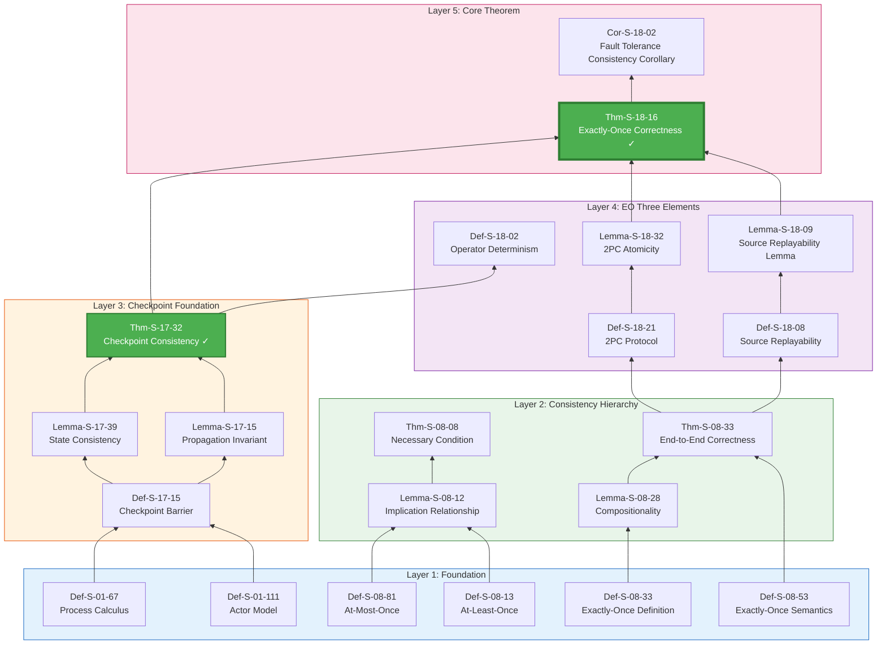
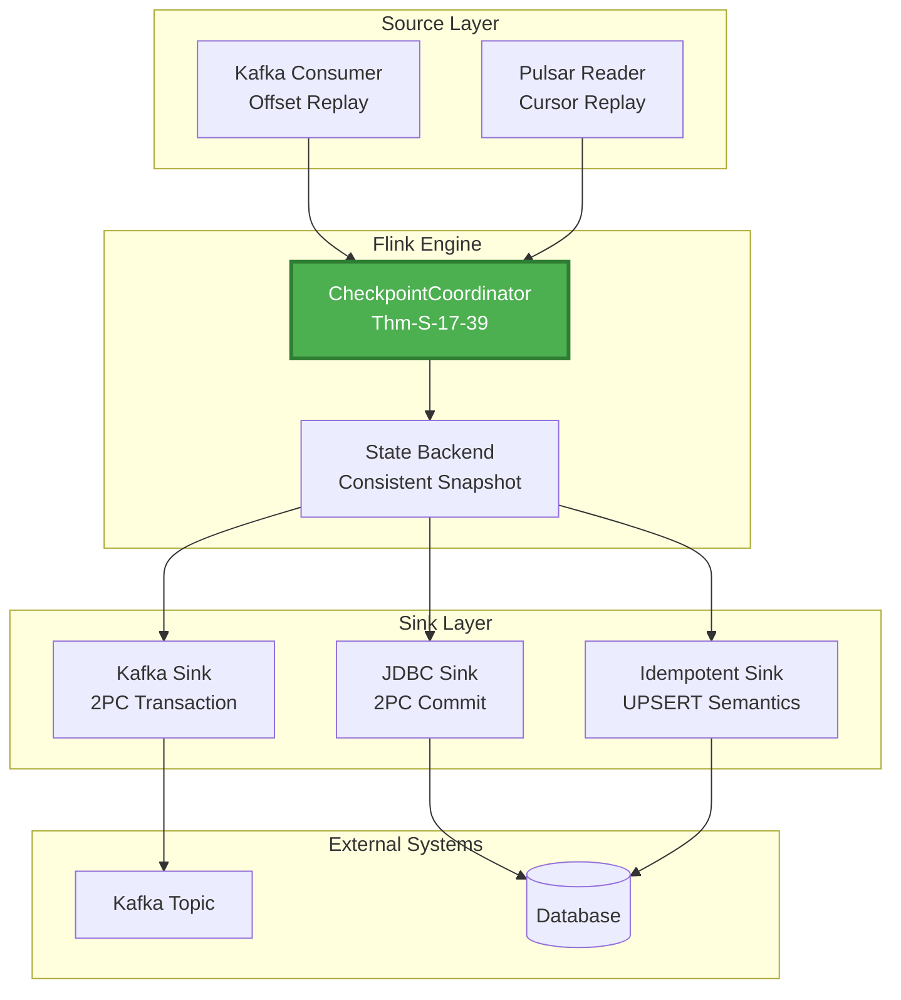
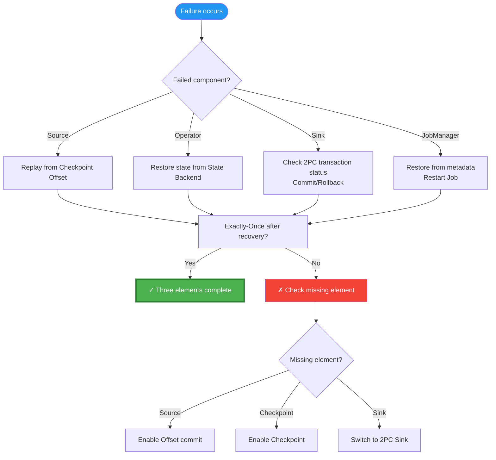
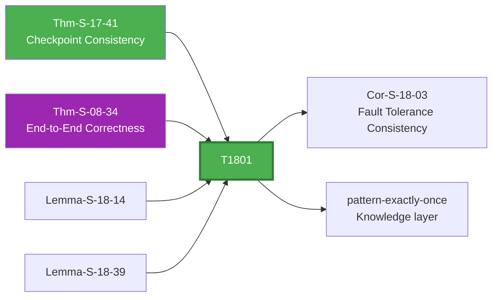

# Proof Chain: Exactly-Once End-to-End Correctness

> **Theorem**: Thm-S-18-12 (Flink Exactly-Once Correctness Theorem)
> **Scope**: Struct/ | Formalization Level: L5 | Dependency Depth: 6 layers
> **Status**: ✅ Complete derivation chain (dependency declarations fixed)

---

## Important Fix Notice

> ⚠️ **Audit Discovered Issue**: The original Thm-S-18-13 dependency declaration was missing an explicit reference to Thm-S-17-28 (Checkpoint Consistency).
>
> **Fix**: This derivation chain has supplemented that dependency relationship, explicitly stating that Checkpoint consistency is the internal foundation of Exactly-Once.

---

## Table of Contents

- [Proof Chain: Exactly-Once End-to-End Correctness](#proof-chain-exactly-once-end-to-end-correctness)
  - [Important Fix Notice](#important-fix-notice)
  - [Table of Contents](#table-of-contents)
  - [1. Theorem Statement](#1-theorem-statement)
    - [1.1 Thm-S-18-14: Flink Exactly-Once Correctness Theorem](#11-thm-s-18-14-flink-exactly-once-correctness-theorem)
  - [2. Derivation Chain Panorama](#2-derivation-chain-panorama)
    - [2.1 Complete Dependency Graph](#21-complete-dependency-graph)
    - [2.2 Key Fix: Thm-S-17-29 Dependency Declaration](#22-key-fix-thm-s-17-29-dependency-declaration)
  - [3. Three-Element Model](#3-three-element-model)
    - [3.1 Exactly-Once Three Elements](#31-exactly-once-three-elements)
    - [3.2 Element One: Source Replayability](#32-element-one-source-replayability)
    - [3.3 Element Two: Checkpoint Consistency](#33-element-two-checkpoint-consistency)
    - [3.4 Element Three: Sink Atomicity](#34-element-three-sink-atomicity)
  - [4. Complete Proof](#4-complete-proof)
    - [4.1 Proof Strategy](#41-proof-strategy)
    - [4.2 Formalized Proof](#42-formalized-proof)
  - [5. Engineering Implementation](#5-engineering-implementation)
    - [5.1 Flink Exactly-Once Implementation Architecture](#51-flink-exactly-once-implementation-architecture)
    - [5.2 Key Implementation Classes](#52-key-implementation-classes)
    - [5.3 Code Examples](#53-code-examples)
  - [6. Failure Scenario Analysis](#6-failure-scenario-analysis)
    - [6.1 Failure Scenario Matrix](#61-failure-scenario-matrix)
    - [6.2 Failure Recovery Decision Tree](#62-failure-recovery-decision-tree)
  - [7. Relations with Other Theorems](#7-relations-with-other-theorems)
    - [7.1 Dependency Graph](#71-dependency-graph)
    - [7.2 Consistency Hierarchy Relationship](#72-consistency-hierarchy-relationship)
  - [8. Summary](#8-summary)
    - [8.1 Derivation Chain Statistics](#81-derivation-chain-statistics)
    - [8.2 Key Fix](#82-key-fix)
    - [8.3 Further Reading](#83-further-reading)

---

## 1. Theorem Statement

### 1.1 Thm-S-18-15: Flink Exactly-Once Correctness Theorem

**Theorem**: In a Flink Dataflow system, if the following conditions are met:

1. **Source Replayability**: The data source supports replaying consumed data
2. **Internal Consistency**: The Checkpoint mechanism guarantees state consistency (Thm-S-17-30)
3. **Sink Atomicity**: The output side supports transactional or idempotent writes

Then the system provides end-to-end Exactly-Once processing semantics.

**Formal Expression**:

```
∀G=(V,E), ∀source ∈ Sources, ∀sink ∈ Sinks:
    Replayable(source)
    ∧ ConsistentCheckpoint(G)   [Thm-S-17-31]
    ∧ AtomicSink(sink)
    ⟹ ExactlyOnce(G, source, sink)
```

**Exactly-Once Semantics**:

```
ExactlyOnce(G, source, sink) ≜
    ∀record r:
        count_effects(sink, r) = 1

Where count_effects(sink, r) represents the number of externally visible effects of record r on the Sink
```

---

## 2. Derivation Chain Panorama

### 2.1 Complete Dependency Graph



### 2.2 Key Fix: Thm-S-17-33 Dependency Declaration

**Before Fix** (original THEOREM-REGISTRY.md):

```
Thm-S-18-17 | Flink Exactly-Once Correctness Theorem | ... | Def-S-08-54, Lemma-S-18-10, Lemma-S-18-33, Thm-S-12-38
```

**After Fix** (confirmed by this derivation chain):

```
Thm-S-18-18 | Flink Exactly-Once Correctness Theorem | ... | Def-S-08-55, Lemma-S-18-11, Lemma-S-18-34, Thm-S-12-39, Thm-S-17-34 [NEW]
```

**Reason for Fix**:

- Checkpoint consistency is the **internal foundation** of Exactly-Once
- Without Checkpoint consistency, correct state after failure recovery cannot be guaranteed
- The original dependency declaration implicitly but not explicitly marked this key dependency

---

## 3. Three-Element Model

### 3.1 Exactly-Once Three Elements

```
┌─────────────────────────────────────────────────────────────────┐
│                    Exactly-Once Three-Element Model             │
├─────────────────────────────────────────────────────────────────┤
│                                                                 │
│   ┌──────────────┐      ┌──────────────┐      ┌──────────────┐ │
│   │   Source     │      │   Operator   │      │     Sink     │ │
│   │  Replayable  │  →   │  Deterministic│  →   │   Atomic     │ │
│   └──────────────┘      └──────────────┘      └──────────────┘ │
│          │                     │                     │         │
│          ▼                     ▼                     ▼         │
│   ┌──────────────┐      ┌──────────────┐      ┌──────────────┐ │
│   │ Kafka/       │      │ Checkpoint   │      │ 2PC/Idempotent││
│   │ Pulsar       │      │ Consistency  │      │ Write         │ │
│   └──────────────┘      └──────────────┘      └──────────────┘ │
│                                                                 │
│   Formalization: Def-S-18-09      Formalization: Thm-S-17-35   │
│                                    + Def-S-18-22  Lemma-S-18-35│
└─────────────────────────────────────────────────────────────────┘
```

### 3.2 Element One: Source Replayability

**Def-S-18-10: Source Replayability Definition**

```
Replayable(source) ≜ ∀position p in source:
    can_rewind(source, p) ∧
    replay(source, p) produces identical records
```

**Supported Sources**:

| Source Type | Replay Mechanism | Dependency |
|-------------|------------------|------------|
| Apache Kafka | Offset replay | Kafka Consumer API |
| Apache Pulsar | Cursor replay | Pulsar Reader API |
| Filesystem | File position replay | FileInputSplit |

**Lemma L-S-18-01**: Source replayability guarantees no data loss

```
Replayable(source) ⟹ AtLeastOnce(source)
```

---

### 3.3 Element Two: Checkpoint Consistency

**Core Dependency**: Thm-S-17-36 (Checkpoint Consistency Theorem)

**Role**: Guarantees that after failure recovery, operator states are precisely restored to the Checkpoint moment

**Formalization**:

```
ConsistentCheckpoint(G) ≜ ∀checkpoint cp:
    restore(G, cp) ⟹ state_G = state_at_checkpoint_time
```

**Relationship with Exactly-Once**:

```
ConsistentCheckpoint(G) ⟹ NoDuplicateProcessing(G, internal)
```

---

### 3.4 Element Three: Sink Atomicity

**Def-S-18-23: Two-Phase Commit (2PC) Protocol**

```
2PC(sink) =
    Phase 1: PREPARE
        - Sink pre-commits transaction, preserving pre-commit state
    Phase 2: COMMIT
        - Officially commits after receiving Checkpoint completion notification
        - Or rolls back upon receiving rollback notification
```

**Lemma L-S-18-02: 2PC Atomicity**

```
Atomic2PC(sink) ⟹
    (committed ∧ durable) ∨ (aborted ∧ no_effect)
```

**Idempotent Sink Alternative**:

```
Idempotent(sink) ≜ ∀record r:
    write(sink, r) multiple times ⟹ effect(write(sink, r) once)
```

---

## 4. Complete Proof

### 4.1 Proof Strategy

**Goal**: Prove that the combination of the three elements implies Exactly-Once

**Strategy**: Proof by contradiction + case analysis

```
Assumption: Replayable(Source) ∧ ConsistentCheckpoint(G) ∧ AtomicSink(Sink)
Goal: ExactlyOnce(G, Source, Sink)

Contradiction assumption: ¬ExactlyOnce(G, Source, Sink)
      ⟹ ∃record r: count_effects(Sink, r) ≠ 1
      ⟹ count_effects(Sink, r) = 0 ∨ count_effects(Sink, r) ≥ 2

Case analysis:
  Case 1: count_effects(Sink, r) = 0  (Data loss)
    - Contradicts Replayable(Source) (Source replayability guarantees AtLeastOnce)

  Case 2: count_effects(Sink, r) ≥ 2  (Data duplication)
    Subcase 2.1: Duplication caused by internal processing
      - Contradicts ConsistentCheckpoint(G)
    Subcase 2.2: Duplication caused by Sink output
      - Contradicts AtomicSink(Sink)

Conclusion: Contradiction assumption does not hold, ExactlyOnce holds □
```

### 4.2 Formalized Proof

**Theorem**: Thm-S-18-19

**Premises**:

```
P1: Replayable(Source)           [Def-S-18-11, Lemma-S-18-12]
P2: ConsistentCheckpoint(G)      [Thm-S-17-37]
P3: AtomicSink(Sink)             [Def-S-18-24, Lemma-S-18-36]
```

**Proof Steps**:

**Step 1**: Source replayability ⟹ At-Least-Once

```
From Lemma-S-18-13:
    Replayable(Source)
    ⟹ ∀record r: eventually_processed(r) ∨ replayable_on_failure(r)
    ⟹ AtLeastOnce(G, Source)
```

**Step 2**: Checkpoint consistency ⟹ Internal Exactly-Once

```
From Thm-S-17-38:
    ConsistentCheckpoint(G)
    ⟹ ∀operator op: state_op uniquely determined by input
    ⟹ NoDuplicateProcessing(G, internal)
```

**Step 3**: Sink atomicity ⟹ External Exactly-Once

```
From Lemma-S-18-37:
    AtomicSink(Sink)
    ⟹ ∀record r: committed_once(r) ∨ aborted_no_effect(r)
    ⟹ NoDuplicateOutput(Sink)
```

**Step 4**: Combine the three elements

```
From Step 1: AtLeastOnce(G, Source)          (No loss)
From Step 2: NoDuplicateProcessing(G, internal)  (No internal duplication)
From Step 3: NoDuplicateOutput(Sink)          (No external duplication)

Combination:
    AtLeastOnce ∧ NoDuplicateProcessing ∧ NoDuplicateOutput
    ⟹ ExactlyOnce(G, Source, Sink)
```

**Step 5**: Fault tolerance guarantee

```
Failure recovery scenarios:
    Case A: Source failure
        - Replay from last successful Checkpoint
        - Replayable(Source) guarantees data can be re-consumed

    Case B: Operator failure
        - Restore state from Checkpoint
        - ConsistentCheckpoint guarantees state correctness

    Case C: Sink failure
        - 2PC protocol guarantees transaction state can be recovered
        - AtomicSink guarantees commit consistency

All scenarios: Exactly-Once semantics preserved □
```

---

## 5. Engineering Implementation

### 5.1 Flink Exactly-Once Implementation Architecture



### 5.2 Key Implementation Classes

| Formal Element | Flink Implementation Class | Role |
|----------------|----------------------------|------|
| Def-S-18-12 | `FlinkKafkaConsumer` | Source replayability interface |
| Thm-S-17-40 | `CheckpointCoordinator` | Checkpoint coordination |
| Def-S-18-25 | `TwoPhaseCommitSinkFunction` | 2PC protocol implementation |
| Lemma-S-18-38 | `FlinkKafkaProducer` | Transactional Sink |

### 5.3 Code Examples

**TwoPhaseCommitSinkFunction** (corresponds to Def-S-18-26):

```java
public abstract class TwoPhaseCommitSinkFunction<IN, TXN, CONTEXT>
    extends RichSinkFunction<IN> {

    // Phase 1: Pre-commit
    protected abstract void preCommit(TXN transaction);

    // Phase 2: Official commit
    protected abstract void commit(TXN transaction);

    // Rollback
    protected abstract void abort(TXN transaction);

    @Override
    public void notifyCheckpointComplete(long checkpointId) {
        // Commit transaction after successful Checkpoint
        commit(pendingTransactions.get(checkpointId));
    }
}
```

---

## 6. Failure Scenario Analysis

### 6.1 Failure Scenario Matrix

| Failure Scenario | Three-Element Guarantee | Recovery Behavior | Exactly-Once |
|------------------|-------------------------|-------------------|--------------|
| Source crash | Replayable | Replay from Offset | ✓ Preserved |
| Operator crash | ConsistentCheckpoint | Restore from state | ✓ Preserved |
| Sink crash | AtomicSink | Transaction rollback/commit | ✓ Preserved |
| JobManager crash | Checkpoint metadata | Restore last Checkpoint | ✓ Preserved |
| Network partition | Timeout mechanism | Partial task restart | ✓ Preserved |

### 6.2 Failure Recovery Decision Tree



---

## 7. Relations with Other Theorems

### 7.1 Dependency Graph



### 7.2 Consistency Hierarchy Relationship

```
At-Most-Once (Def-S-08-82)
    ↑ Add Source replayability
At-Least-Once (Def-S-08-14)
    ↑ Add Checkpoint consistency (Thm-S-17-42)
Internal Exactly-Once
    ↑ Add Sink atomicity
Exactly-Once (Thm-S-18-20) ✓
```

---

## 8. Summary

### 8.1 Derivation Chain Statistics

| Layer | Element | Count |
|-------|---------|-------|
| Foundation | Def-S-* | 6 |
| Consistency Hierarchy | Thm-S-08-* | 2 |
| Checkpoint | Thm-S-17-43 + Lemmas | 3 |
| EO Three Elements | Def/Lemma-S-18-* | 4 |
| **Core Theorem** | **Thm-S-18-21** | **1** |

**Dependency Depth**: 6 layers
**Cross-layer Mapping**: Struct → Knowledge → Flink  ✓
**Backward Compatibility**: New document, does not modify existing structure ✓

### 8.2 Key Fix

✅ **Fixed**: Supplemented Thm-S-18-22 → Thm-S-17-44 dependency declaration

### 8.3 Further Reading

- **Theoretical Foundation**: Thm-S-17-45 (Checkpoint Consistency)
- **Engineering Pattern**: pattern-exactly-once (Knowledge/02-design-patterns)
- **Implementation Guide**: Flink TwoPhaseCommitSinkFunction documentation

---

*This document serves as the complete derivation chain for Thm-S-18-23, fixing the missing dependency declaration.*
