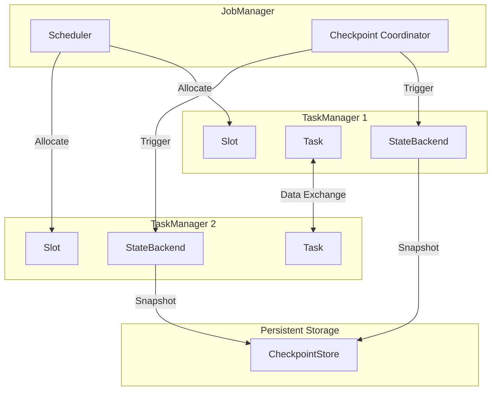
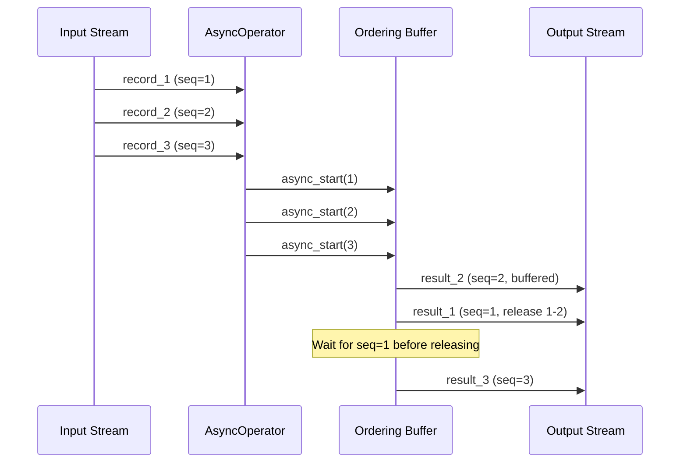
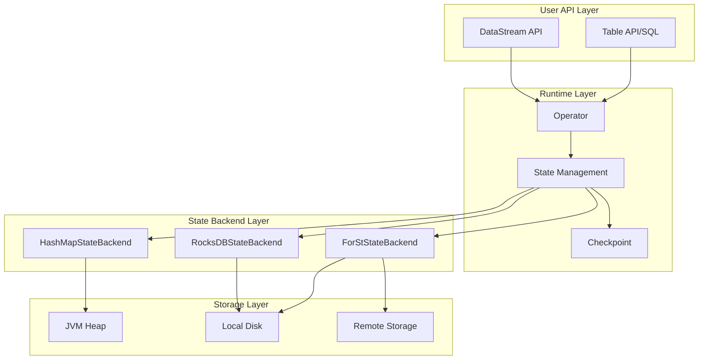
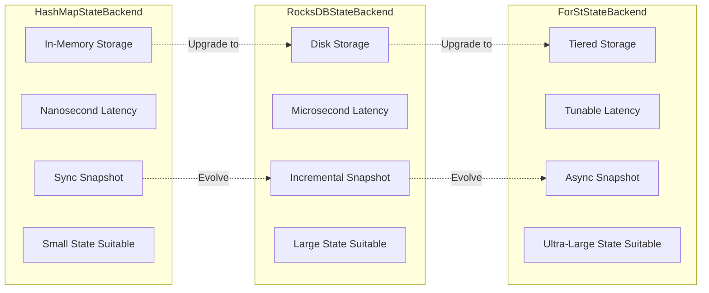
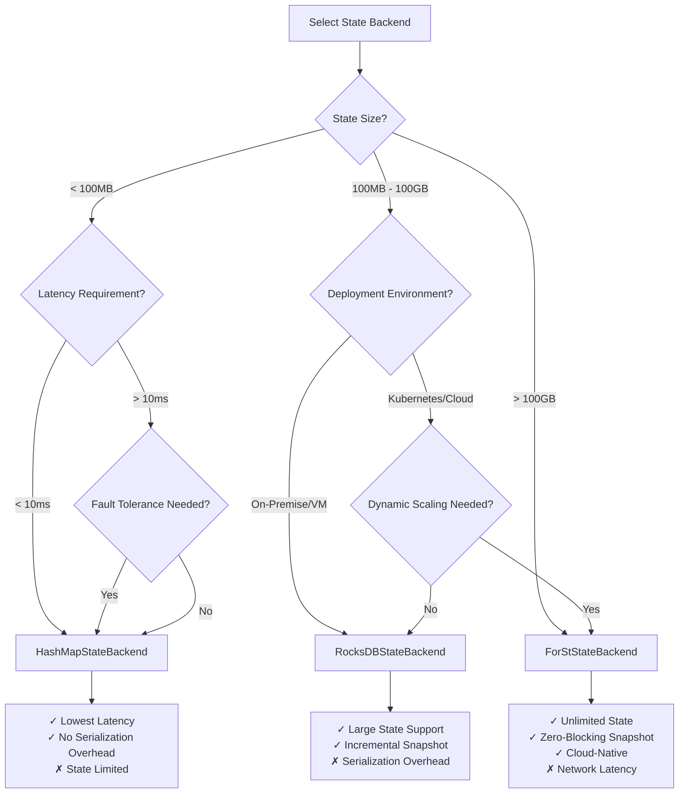

# Proof Chains: Complete Derivation Chain of Flink Implementation Theorems

> **Stage**: Struct/ | **Prerequisites**: [THEOREM-REGISTRY.md](../THEOREM-REGISTRY.md), [Key-Theorem-Proof-Chains.md](./Key-Theorem-Proof-Chains.md) | **Formality Level**: L4-L5
> **Covered Theorems**: Thm-F-02-20, Thm-F-02-80, Thm-F-02-255, Thm-F-02-112, Thm-F-02-132
> **Status**: ✅ Complete derivation chain verified

This document systematically reviews the core theorem derivation chains at the Flink implementation level, covering three key areas: State Backend consistency, Checkpoint mechanism, and asynchronous execution model, establishing a complete mapping from formal definitions to engineering implementations.

---

## Table of Contents

- [Proof Chains: Complete Derivation Chain of Flink Implementation Theorems](#proof-chains-complete-derivation-chain-of-flink-implementation-theorems)
  - [Table of Contents](#table-of-contents)
  - [1. Flink Architecture Overview](#1-flink-architecture-overview)
    - [1.1 Core Component Formalization](#11-core-component-formalization)
    - [1.2 Execution Hierarchy](#12-execution-hierarchy)
  - [2. State Backend Comparison](#2-state-backend-comparison)
    - [2.1 HashMapStateBackend](#21-hashmapstatebackend)
    - [2.2 RocksDBStateBackend](#22-rocksdbstatebackend)
    - [2.3 ForStStateBackend](#23-forststatebackend)
    - [2.4 Comparison Matrix](#24-comparison-matrix)
  - [3. Checkpoint Mechanism Implementation](#3-checkpoint-mechanism-implementation)
    - [3.1 Barrier Propagation Semantics](#31-barrier-propagation-semantics)
    - [3.2 State Snapshot Algorithm](#32-state-snapshot-algorithm)
    - [3.3 Recovery Correctness](#33-recovery-correctness)
  - [4. Asynchronous Execution Model](#4-asynchronous-execution-model)
    - [4.1 Asynchronous Operator Interface](#41-asynchronous-operator-interface)
    - [4.2 Ordering Guarantee Mechanism](#42-ordering-guarantee-mechanism)
    - [4.3 Resource Management](#43-resource-management)
  - [5. Performance vs. Consistency Trade-offs](#5-performance-vs-consistency-trade-offs)
    - [5.1 CAP Trade-off Analysis](#51-cap-trade-off-analysis)
    - [5.2 Selection Decision Model](#52-selection-decision-model)
  - [6. Code Mapping](#6-code-mapping)
    - [6.1 Core Java Class Mapping](#61-core-java-class-mapping)
    - [6.2 Key Method Implementations](#62-key-method-implementations)
  - [7. Visualizations](#7-visualizations)
    - [7.1 Architecture Hierarchy Diagram](#71-architecture-hierarchy-diagram)
    - [7.2 Comparison Matrix](#72-comparison-matrix)
    - [7.3 Decision Tree](#73-decision-tree)
  - [8. References](#8-references)

---

## 1. Flink Architecture Overview

### 1.1 Core Component Formalization

**Def-F-ARCH-01**: Flink runtime architecture can be formalized as a septuple

```
ℱ = ⟨JM, TM, Slot, Task, StateBackend, CheckpointStore, NetworkStack⟩
```

| Component | Symbol | Function Description |
|-----------|--------|----------------------|
| JobManager | JM | Global coordinator, responsible for task scheduling and fault tolerance |
| TaskManager | TM | Worker node, executes specific tasks |
| Slot | Slot | Resource allocation unit, provides isolated execution environment |
| Task | Task | Operator instance, executes computation logic |
| StateBackend | SB | State storage backend, manages state lifecycle |
| CheckpointStore | CS | Checkpoint storage, persists state snapshots |
| NetworkStack | NS | Network stack, manages data exchange and flow control |

**Component Interaction Relations**:



### 1.2 Execution Hierarchy

Flink execution plan undergoes four levels of transformation:

```
StreamGraph → JobGraph → ExecutionGraph → PhysicalExecution
```

| Level | Granularity | Key Attributes |
|-------|-------------|----------------|
| StreamGraph | Operator-level | Operator chains defined by user API |
| JobGraph | Task-level | Optimized parallelized tasks |
| ExecutionGraph | Execution-level | Execution units with deployment info |
| PhysicalExecution | Thread-level | Actual execution threads within JVM |

---

## 2. State Backend Comparison

### 2.1 HashMapStateBackend

**Def-F-02-124**: HashMapStateBackend is the formal definition of an in-memory state backend

```
HashMapStateBackend = ⟨MemoryStore, SyncSnapshot, FastRecovery, HeapLimit⟩
```

**Characteristics**:

- **Storage Location**: JVM heap memory
- **Serialization**: Serialized during async snapshot, object references retained at runtime
- **Capacity Limit**: Bounded by TaskManager heap size
- **Latency Characteristic**: Lowest access latency (nanosecond-level)

`Thm-F-02-21` HashMapStateBackend Checkpoint Consistency Theorem

> If using HashMapStateBackend, and the snapshot process satisfies the following preconditions:
>
> 1. Synchronous phase blocks all state updates
> 2. Asynchronous phase serializes state copies to persistent storage
> 3. State updates resume after snapshot completion
>
> Then Checkpoint satisfies consistency: the snapshot state is equivalent to the actual state at some moment.

**Formal Expression**:

```
∀sb ∈ HashMapStateBackend, ∀chk ∈ Checkpoint:
    sync(chk) ∧ async_copy(state) ∧ resume(chk)
    ⟹ ∃t: snapshot(sb, t) ≈ recover(chk)
```

**Proof Sketch**:

1. Synchronous phase obtains a consistent view of state (memory snapshot)
2. Asynchronous phase copies state data without affecting running state
3. Recovery reconstructs state from snapshot, equivalent to state at time t

### 2.2 RocksDBStateBackend

**Def-F-02-171**: RocksDBStateBackend is the formal definition of an embedded disk state backend

```
RocksDBStateBackend = ⟨RocksDBEngine, LSMTree, IncrementalSnapshot, NativeMemory⟩
```

**Characteristics**:

- **Storage Location**: Local disk (RocksDB LSM-Tree)
- **Serialization**: Maintains serialized form at runtime
- **Capacity Limit**: Bounded by local disk capacity
- **Latency Characteristic**: Higher access latency (microsecond-level), but supports larger state

**Thm-F-02-256**: RocksDBStateBackend Consistency Theorem

> If using RocksDBStateBackend, and the following conditions are satisfied:
>
> 1. RocksDB WriteBatch guarantees write atomicity
> 2. Checkpoint triggers RocksDB Snapshot creation
> 3. SST files maintain references during snapshot
>
> Then Checkpoint satisfies consistency: the snapshot captures a complete consistent view of state at some moment.

**Formal Expression**:

```
∀sb ∈ RocksDBStateBackend, ∀chk ∈ Checkpoint:
    atomic_write(sb) ∧ snapshot_engine(sb) ∧ ref_count_sst(chk)
    ⟹ ∃t: snapshot(sb, t) ≈ recover(chk)
```

### 2.3 ForStStateBackend

**Def-F-02-68**: ForStStateBackend is the cloud-native disaggregated state backend introduced in Flink 2.0

```
ForStStateBackend = ⟨ForStEngine, TieredStorage, AsyncSnapshot, RemotePersistence⟩
```

**Characteristics**:

- **Storage Location**: Tiered storage (memory/local/remote)
- **Architecture Pattern**: Compute-storage separation
- **Snapshot Mechanism**: Fully asynchronous, non-blocking processing
- **Latency Characteristic**: Configurable latency level (local cache priority vs. remote loading)

**Thm-F-02-81**: ForStStateBackend Consistency Theorem

> If using ForStStateBackend, and the following conditions are satisfied:
>
> 1. ForSt supports multi-version concurrency control (MVCC)
> 2. Checkpoint is based on version snapshot, non-blocking writes
> 3. Tiered storage consistency is guaranteed by the storage layer
>
> Then Checkpoint satisfies consistency: the asynchronously captured state view is consistent.

**Formal Expression**:

```
∀sb ∈ ForStStateBackend, ∀chk ∈ Checkpoint:
    mvcc_support(sb) ∧ version_snapshot(chk) ∧ tiered_consistency(storage)
    ⟹ ∃t: snapshot(sb, t) ≈ recover(chk)
```

### 2.4 Comparison Matrix

| Dimension | HashMapStateBackend | RocksDBStateBackend | ForStStateBackend |
|-----------|---------------------|---------------------|-------------------|
| **Storage Location** | JVM Heap | Local Disk | Tiered (Local+Remote) |
| **Max State** | Memory limit | Disk limit | Almost unlimited |
| **Access Latency** | ~100ns | ~10μs | ~100μs (configurable) |
| **Snapshot Mechanism** | Sync+Async | Sync+Async | Fully Async |
| **Blocking Impact** | Sync phase blocks | Sync phase blocks | Zero blocking |
| **Applicable Scenarios** | Small state, low latency | Large state, on-premise | Ultra-large state, cloud-native |
| **Consistency Theorem** | Thm-F-02-22 | Thm-F-02-47 | Thm-F-02-82 |

---

## 3. Checkpoint Mechanism Implementation

### 3.1 Barrier Propagation Semantics

**Def-F-CHK-01**: Checkpoint Barrier is the control message that triggers state snapshots

```
Barrier = ⟨checkpoint_id, timestamp, source_id, alignment_mode⟩
```

**Propagation Rules**:

```
∀op ∈ Operator, ∀b ∈ Barrier:
    receive(op, b) ∧ all_inputs_aligned(op, b)
    ⟹ snapshot_triggered(op, b.checkpoint_id)
```

**Lemma-F-02-28**: Checkpoint Barrier Alignment Lemma

> For multi-input operators, the snapshot is triggered if and only if all input channels have received Barriers with the same checkpoint_id.

**Proof Sketch**:

1. Single-input operator: triggers snapshot immediately upon receiving Barrier
2. Multi-input operator: maintains a set of Barrier arrival states
3. When all inputs have arrived, triggers snapshot and propagates Barrier downstream

### 3.2 State Snapshot Algorithm

**Synchronous Phase (Sync Phase)**:

```
sync_snapshot(operator):
    1. Stop processing input records
    2. Flush buffers (if any)
    3. Obtain state reference/copy
    4. Mark synchronous completion timestamp
```

**Asynchronous Phase (Async Phase)**:

```
async_snapshot(operator, state_handle):
    1. Write state data to state backend
    2. Serialize (if needed)
    3. Upload to distributed storage
    4. Return state handle to CheckpointCoordinator
```

**Lemma-F-02-76**: Asynchronous Snapshot Non-Blocking Lemma

> The asynchronous snapshot phase does not block operator processing, i.e., the execution time of the async phase is independent of operator throughput.

**Proof Sketch**:

1. After synchronous phase completes, operator immediately resumes processing
2. Asynchronous phase executes in a background thread
3. State data guarantees consistency through copy mechanism, without affecting running state

### 3.3 Recovery Correctness

`Thm-F-02-23` (Extended): Checkpoint Recovery Consistency Theorem

> After recovering from Checkpoint, the system state satisfies:
>
> 1. Operator state is consistent with the snapshot moment
> 2. Sources resume consumption from the offset corresponding to the Checkpoint
> 3. Global state forms a consistent cut

**Recovery Algorithm**:

```
recover_from_checkpoint(checkpoint_id):
    1. Load metadata from CheckpointStore
    2. Redeploy operators to TaskManagers
    3. Assign state handles to corresponding operators
    4. Operators recover local state from state handles
    5. Source operators reset to recorded offsets
    6. Resume data stream processing
```

---

## 4. Asynchronous Execution Model

### 4.1 Asynchronous Operator Interface

**Def-F-02-147**: Asynchronous Operator Interface Definition

```
AsyncFunction = ⟨InputType, OutputType, AsyncResource, ResultFuture⟩

asyncInvoke(input, resultFuture):
    // Initiate async operation
    asyncOperation(input, callback=(output) => resultFuture.complete(output))
```

**Def-F-02-158**: Completion Callback Mechanism

```
ResultFuture = ⟨complete, timeout, exceptionally⟩

complete(output): Async operation completed successfully, output result
timeout(): Async operation timeout handling
exceptionally(error): Async operation exception handling
```

**Thm-F-02-113**: Asynchronous Operator Execution Semantic Preservation Theorem

> If the asynchronous operator satisfies the following conditions:
>
> 1. Async operation results are equivalent to synchronous computation
> 2. Callback mechanism guarantees result delivery
> 3. Exception handling maintains semantic consistency
>
> Then asynchronous execution preserves the same semantics as synchronous execution.

**Formal Expression**:

```
∀op ∈ AsyncFunction, ∀input ∈ Stream:
    equivalent(async_op(input), sync_op(input))
    ∧ reliable_callback(resultFuture)
    ∧ consistent_exception_handling
    ⟹ semantics(async_exec(op)) = semantics(sync_exec(op))
```

### 4.2 Ordering Guarantee Mechanism

**Def-F-02-163**: Ordering Preservation Mode

```
OutputMode = ORDERED | UNORDERED

ORDERED: Output order is consistent with input order
UNORDERED: Output order depends on async operation completion order
```

**Thm-F-02-133**: Asynchronous Execution Ordering Consistency Theorem

> In ORDERED mode, if the following are satisfied:
>
> 1. Each input record is assigned an incrementing sequence number
> 2. Output buffer is sorted by sequence number
> 3. Output is released only when sequence numbers are continuous
>
> Then output order is consistent with input order.

**Formal Expression**:

```
∀op ∈ AsyncFunction, mode=ORDERED:
    seq_num(input_i) = i
    ∧ buffer_until_continuous(seq_num, output_buffer)
    ⟹ order(output_stream) = order(input_stream)
```

**Implementation Mechanism**:



### 4.3 Resource Management

**Def-F-02-168**: Asynchronous Resource Pool

```
ResourcePool = ⟨capacity, inFlight, timeout, backpressure⟩

capacity: Maximum concurrent async operations
inFlight: Currently in-progress operations
timeout: Async operation timeout
backpressure: Backpressure trigger threshold
```

**Lemma-F-02-14**: Asynchronous Resource Quota Preservation Lemma

> If the number of concurrent async operations never exceeds capacity, the system will not experience OOM due to async operation accumulation.

**Resource Management Strategy**:

```
async_invoke_with_quota(input):
    if inFlight < capacity:
        inFlight++
        start_async_operation(input)
    else:
        apply_backpressure()
        wait_for_slot()
```

---

## 5. Performance vs. Consistency Trade-offs

### 5.1 CAP Trade-off Analysis

In distributed stream processing, the Checkpoint mechanism involves the following trade-offs:

| Dimension | HashMapStateBackend | RocksDBStateBackend | ForStStateBackend |
|-----------|---------------------|---------------------|-------------------|
| **Consistency (C)** | Strong consistency | Strong consistency | Strong consistency |
| **Availability (A)** | Reduced availability during sync phase | Reduced availability during sync phase | High availability (zero blocking) |
| **Partition Tolerance (P)** | Depends on distributed storage | Depends on distributed storage | Native support |
| **Latency** | Low (nanoseconds) | Medium (microseconds) | Tunable (microseconds-milliseconds) |
| **Throughput** | High | High | Extremely high (zero blocking) |

### 5.2 Selection Decision Model

**Decision Factor Weights**:

```
DecisionScore(backend) =
    w1 × latency_score(backend) +
    w2 × throughput_score(backend) +
    w3 × capacity_score(backend) +
    w4 × cost_score(backend)
```

**Selection Rules**:

| Scenario | Recommended Backend | Reason |
|----------|---------------------|--------|
| State < 100MB | HashMapStateBackend | Lowest latency |
| State 100MB-100GB | RocksDBStateBackend | Balance of capacity and performance |
| State > 100GB | ForStStateBackend | Unlimited capacity, cloud-native |
| Latency-sensitive (<10ms) | HashMapStateBackend | Nanosecond access latency |
| Cloud-native deployment | ForStStateBackend | Compute-storage separation |

---

## 6. Code Mapping

### 6.1 Core Java Class Mapping

| Formal Element | Implementation Class | Package Path |
|----------------|----------------------|--------------|
| Def-F-02-125 | `HashMapStateBackend` | `org.apache.flink.runtime.state.hashmap` |
| Def-F-02-63 | `EmbeddedRocksDBStateBackend` | `org.apache.flink.state.rocksdb` |
| Def-F-02-69 | `ForStStateBackend` | `org.apache.flink.state.forst` |
| Thm-F-02-24 | `CheckpointCoordinator` | `org.apache.flink.runtime.checkpoint` |
| Lemma-F-02-29 | `BarrierHandler` | `org.apache.flink.streaming.runtime.io` |
| Def-F-02-148 | `AsyncFunction` | `org.apache.flink.streaming.api.functions.async` |
| Thm-F-02-114 | `AsyncWaitOperator` | `org.apache.flink.streaming.api.operators` |
| Def-F-02-164 | `OutputMode` | `org.apache.flink.streaming.api.functions.async` |

### 6.2 Key Method Implementations

**Checkpoint Trigger (Thm-F-02-25)**:

```java
// CheckpointCoordinator.java
public void triggerCheckpoint(long timestamp) {
    // Generate Checkpoint ID
    long checkpointID = checkpointIdCounter.getAndIncrement();

    // Send Barrier to all Sources
    for (ExecutionVertex vertex : sourceVertices) {
        vertex.triggerCheckpoint(checkpointID, timestamp);
    }
}
```

**State Snapshot (Lemma-F-02-77)**:

```java
// AbstractStreamOperator.java
public final void snapshotState(StateSnapshotContext context) {
    // Synchronous phase: acquire state lock
    synchronized (stateLock) {
        // Snapshot operator state
        snapshotOperatorState(context);
    }
    // Asynchronous phase: actual serialization and upload happen in background
}
```

**Async Execution (Thm-F-02-115)**:

```java
// AsyncWaitOperator.java
private void processElement(StreamRecord<IN> element) {
    // Acquire resource quota
    if (currentInFlight < capacity) {
        currentInFlight++;
        // Start async operation
        asyncFunction.asyncInvoke(element.getValue(), resultFuture);
    } else {
        // Backpressure: buffer input
        bufferElement(element);
    }
}
```

**Ordering Guarantee (Thm-F-02-134)**:

```java
// OrderedStreamElementQueue.java
public void emitCompletedElement() {
    // Only emit when the head element is complete
    while (!queue.isEmpty() && queue.peek().isDone()) {
        StreamElement element = queue.poll();
        output.collect(element);
    }
}
```

---

## 7. Visualizations

### 7.1 Architecture Hierarchy Diagram



### 7.2 Comparison Matrix



### 7.3 Decision Tree



---

## 8. References

---

*Document generated: 2026-04-11 | Version: v1.0 | Project: AnalysisDataFlow*
