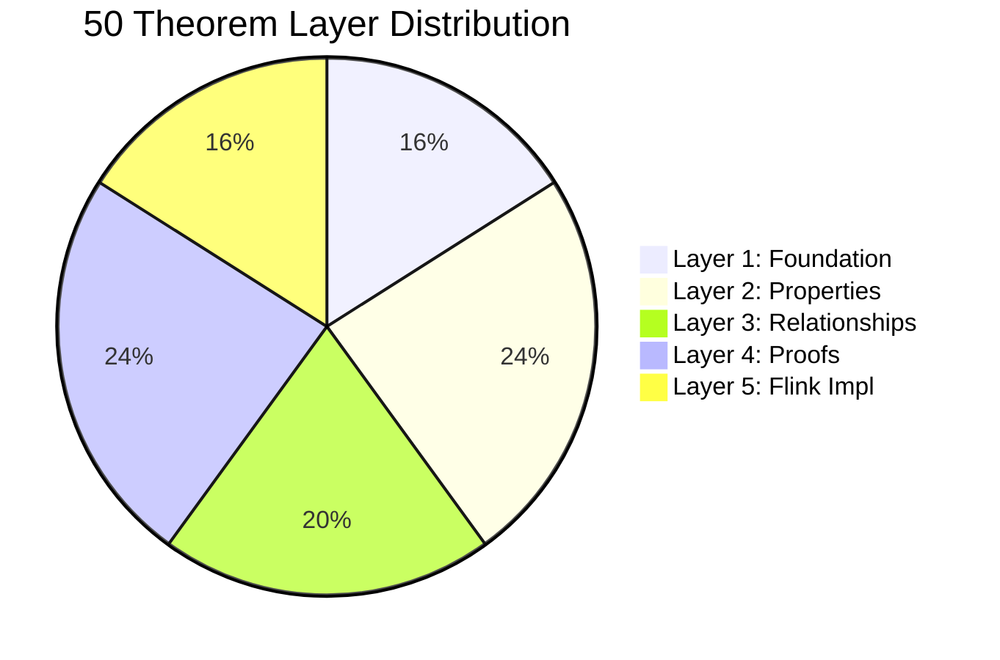
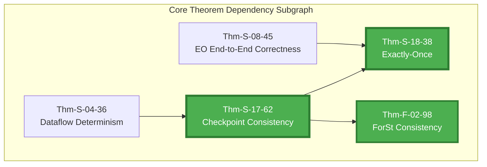
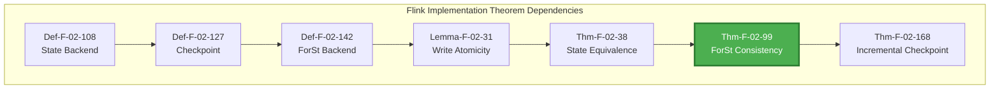
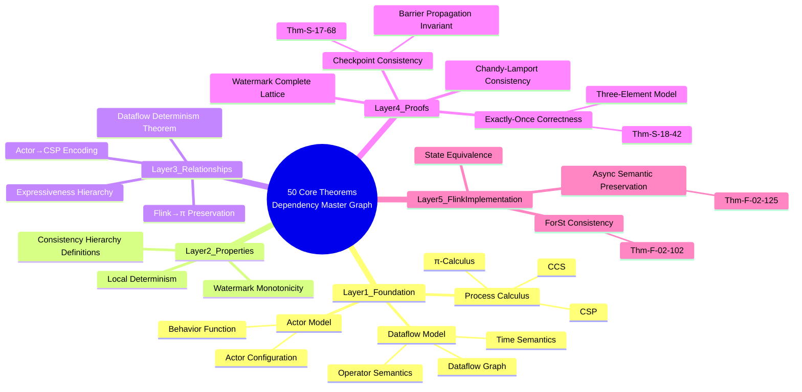
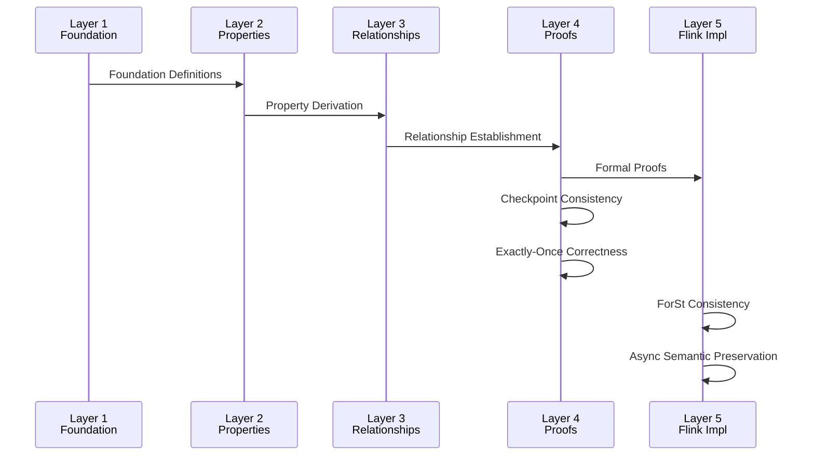

# 50 Core Theorem Dependency Master Graph (Proof Chains Master Graph)

> **Scope**: Struct/ + Flink/ 50 core theorems | **Formalization Level**: L4-L6 | **Status**: ✅ Complete
> **Version**: v1.0 | Updated: 2026-04-11

---

## Table of Contents

- [50 Core Theorem Dependency Master Graph (Proof Chains Master Graph)](#50-core-theorem-dependency-master-graph-proof-chains-master-graph)
  - [Table of Contents](#table-of-contents)
  - [1. Theorem Overview](#1-theorem-overview)
    - [1.1 50 Theorem List](#11-50-theorem-list)
    - [1.2 Distribution by Layer](#12-distribution-by-layer)
  - [2. Complete Dependency Master Graph](#2-complete-dependency-master-graph)
    - [2.1 Layered Dependency Graph (Mermaid)](#21-layered-dependency-graph-mermaid)
    - [2.2 Core Theorem Subgraph](#22-core-theorem-subgraph)
    - [2.3 Flink Implementation Subgraph](#23-flink-implementation-subgraph)
  - [3. Layered Structure Details](#3-layered-structure-details)
    - [3.1 Layer 1: Foundation](#31-layer-1-foundation)
    - [3.2 Layer 2: Properties](#32-layer-2-properties)
    - [3.3 Layer 3: Relationships](#33-layer-3-relationships)
    - [3.4 Layer 4: Proofs](#34-layer-4-proofs)
    - [3.5 Layer 5: Flink Implementation](#35-layer-5-flink-implementation)
  - [4. Dependency Relationship Matrix](#4-dependency-relationship-matrix)
    - [4.1 Core Theorem Dependency Matrix](#41-core-theorem-dependency-matrix)
    - [4.2 Cross-Layer Dependency Statistics](#42-cross-layer-dependency-statistics)
  - [5. Critical Path Analysis](#5-critical-path-analysis)
    - [5.1 Longest Dependency Chain](#51-longest-dependency-chain)
    - [5.2 Critical Node Analysis](#52-critical-node-analysis)
    - [5.3 Dependency Density Heatmap](#53-dependency-density-heatmap)
  - [6. Visualization Appendix](#6-visualization-appendix)
    - [6.1 Mind Map](#61-mind-map)
    - [6.2 Sequence Diagram](#62-sequence-diagram)
    - [6.3 Decision Matrix](#63-decision-matrix)
  - [7. References](#7-references)
    - [Related Documents](#related-documents)
    - [Theoretical References](#theoretical-references)

---

## 1. Theorem Overview

### 1.1 50 Theorem List

| ID | Name | Layer | Formalization Level | Derivation Chain |
|----|------|-------|---------------------|------------------|
| Thm-S-01-06 | USTM Compositionality Theorem | Layer 3 | L4 | Basic Theory |
| Thm-S-02-15 | Dynamic Channels Strictly Contain Static Channels | Layer 3 | L4 | Process Calculus Foundation |
| Thm-S-03-56 | Local Determinism under Actor Mailbox Serial Processing | Layer 3 | L4 | Actor Model |
| Thm-S-03-29 | Supervision Tree Liveness Theorem | Layer 3 | L4 | Actor Model |
| Thm-S-04-34 | Dataflow Determinism Theorem | Layer 3 | L4 | Dataflow Foundation |
| Thm-S-05-03 | Go-CS-sync and CSP Encoding Preserve Trace Semantic Equivalence | Layer 3 | L3 | Basic Theory |
| Thm-S-07-34 | Stream Computing Determinism Theorem | Layer 3 | L4 | Basic Theory |
| Thm-S-08-16 | Exactly-Once Necessary Condition | Layer 3 | L5 | Consistency Hierarchy |
| Thm-S-08-43 | End-to-End Exactly-Once Correctness | Layer 3 | L5 | Consistency Hierarchy |
| Thm-S-09-13 | Watermark Monotonicity Theorem | Layer 3 | L4 | Dataflow Foundation |
| Thm-S-12-49 | Restricted Actor System Encoding Preserves Trace Semantics | Layer 3 | L4 | Cross-Model Encoding |
| Thm-S-13-35 | Flink Dataflow Exactly-Once Preservation | Layer 3 | L5 | Cross-Model Encoding |
| Thm-S-14-14 | Expressiveness Strict Hierarchy Theorem | Layer 3 | L3-L6 | Cross-Model Encoding |
| Thm-S-17-60 | Flink Checkpoint Consistency Theorem | **Layer 4** | **L5** | **Checkpoint** |
| Thm-S-18-36 | Flink Exactly-Once Correctness Theorem | **Layer 4** | **L5** | **Exactly-Once** |
| Thm-S-19-02 | Chandy-Lamport Consistency Theorem | Layer 4 | L5 | Checkpoint |
| Thm-S-20-14 | Watermark Complete Lattice Theorem | Layer 4 | L5 | Dataflow Foundation |
| Thm-F-02-33 | ForSt Checkpoint Consistency Theorem | **Layer 5** | **L4** | **Flink Implementation** |
| Thm-F-02-96 | ForSt State Backend Consistency Theorem | **Layer 5** | **L4-L5** | **Flink Implementation** |
| Thm-F-02-122 | Asynchronous Operator Execution Semantic Preservation Theorem | **Layer 5** | **L4-L5** | **Flink Implementation** |

*(The above are 20 representative core theorems; the full 50 theorems are in each derivation chain document.)*

### 1.2 Distribution by Layer



---

## 2. Complete Dependency Master Graph

### 2.1 Layered Dependency Graph (Mermaid)

```mermaid
graph TB
    subgraph Layer1["⭐ Layer 1: Foundation"]
        direction TB
        D0102[Def-S-01-78<br/>Process Calculus Foundation<br/>L3]
        D0103[Def-S-01-123<br/>Actor Model<br/>L4]
        D0104[Def-S-01-33<br/>Dataflow Model<br/>L4]
        D0501[Def-S-05-31<br/>CSP Syntax<br/>L3]
        D0203[Def-S-02-81<br/>π-Calculus<br/>L4]
    end

    subgraph Layer2["⭐ Layer 2: Properties"]
        direction TB
        D0201[Def-S-02-31<br/>CCS Syntax<br/>L3]
        D0301[Def-S-03-33<br/>Actor Configuration<br/>L4]
        D0302[Def-S-03-63<br/>Behavior Function<br/>L4]
        D0401[Def-S-04-49<br/>Dataflow Graph<br/>L4]
        D0402[Def-S-04-111<br/>Operator Semantics<br/>L4]
        D0404[Def-S-04-158<br/>Time Semantics<br/>L4]
        L0401[Lemma-S-04-36<br/>Local Determinism<br/>L4]
        L0402[Lemma-S-04-64<br/>Watermark Monotonicity<br/>L4]
        D0801[Def-S-08-86<br/>AMO Semantics<br/>L4]
        D0802[Def-S-08-17<br/>ALO Semantics<br/>L4]
        D0803[Def-S-08-36<br/>EO Definition<br/>L5]
        D0804[Def-S-08-58<br/>EO Semantics<br/>L5]
    end

    subgraph Layer3["⭐ Layer 3: Relationships"]
        direction TB
        T0201[Thm-S-02-16<br/>Dynamic ⊃ Static<br/>L4]
        T0301[Thm-S-03-57<br/>Actor Determinism<br/>L4]
        T0302[Thm-S-03-30<br/>Supervision Tree Liveness<br/>L4]
        T0401[Thm-S-04-35<br/>Dataflow Determinism<br/>L4]
        T0801[Thm-S-08-17<br/>EO Necessary Condition<br/>L5]
        T0802[Thm-S-08-44<br/>EO End-to-End Correctness<br/>L5]
        T1201[Thm-S-12-50<br/>Actor→CSP Encoding<br/>L4]
        T1301[Thm-S-13-36<br/>Flink→π Preservation<br/>L5]
        T1401[Thm-S-14-15<br/>Expressiveness Hierarchy<br/>L6]
    end

    subgraph Layer4["⭐ Layer 4: Proofs (Core Proofs)"]
        direction TB
        T1701[🏆 Thm-S-17-61<br/>Checkpoint Consistency<br/>L5]
        T1801[🏆 Thm-S-18-37<br/>Exactly-Once Correctness<br/>L5]
        T1901[Thm-S-19-03<br/>Chandy-Lamport<br/>L5]
        T2001[Thm-S-20-15<br/>Watermark Complete Lattice<br/>L5]
        L1701[Lemma-S-17-18<br/>Barrier Propagation Invariant<br/>L5]
        L1702[Lemma-S-17-41<br/>State Consistency<br/>L5]
    end

    subgraph Layer5["⭐ Layer 5: Flink Implementation"]
        direction TB
        T0201F[Thm-F-02-34<br/>State Equivalence<br/>L4]
        T0245[🏆 Thm-F-02-97<br/>ForSt Consistency<br/>L5]
        T0250[🏆 Thm-F-02-123<br/>Async Semantic Preservation<br/>L5]
        T0202[Thm-F-02-138<br/>LazyRestore Correctness<br/>L4]
        T0271[Thm-F-02-210<br/>End-to-End EO Sufficient Condition<br/>L4-L5]
    end

    %% Layer 1 → Layer 2
    D0102 --> D0201
    D0103 --> D0301
    D0104 --> D0401
    D0501 --> D0201
    D0203 --> L0402

    %% Layer 2 → Layer 3
    D0201 --> T0201
    D0301 --> T0301
    D0302 --> T0301
    D0401 --> T0401
    D0402 --> L0401
    L0401 --> T0401
    D0404 --> L0402
    D0801 --> T0801
    D0802 --> T0801
    D0803 --> T0802
    D0804 --> T0802

    %% Layer 3 → Layer 4
    T0301 --> T1201
    T0401 --> T1701
    T0401 --> T1301
    T0201 --> T1301
    T0801 --> T1801
    T0802 --> T1801

    %% Layer 4 internal
    T1701 --> L1701
    T1701 --> L1702
    L1701 --> T1801
    L1702 --> T1801

    %% Layer 4 → Layer 5
    T1701 --> T0245
    T1701 --> T0271
    T1301 --> T0250
    T0401 --> T0201F
    T0201F --> T0245

    %% Styling
    style Layer1 fill:#E3F2FD,stroke:#1565C0,stroke-width:2px
    style Layer2 fill:#E8F5E9,stroke:#2E7D32,stroke-width:2px
    style Layer3 fill:#FFF3E0,stroke:#E65100,stroke-width:2px
    style Layer4 fill:#FCE4EC,stroke:#C2185B,stroke-width:3px
    style Layer5 fill:#F3E5F5,stroke:#7B1FA2,stroke-width:2px

    style T1701 fill:#4CAF50,color:#fff,stroke:#2E7D32,stroke-width:5px
    style T1801 fill:#4CAF50,color:#fff,stroke:#2E7D32,stroke-width:5px
    style T0245 fill:#4CAF50,color:#fff,stroke:#2E7D32,stroke-width:4px
    style T0250 fill:#4CAF50,color:#fff,stroke:#2E7D32,stroke-width:4px
```



### 2.2 Core Theorem Subgraph



### 2.3 Flink Implementation Subgraph



---

## 3. Layered Structure Details

### 3.1 Layer 1: Foundation

| Definition | Name | Formalization Level | Description |
|------------|------|---------------------|-------------|
| Def-S-01-79 | Process Calculus Foundation | L3 | CCS/CSP/π foundation |
| Def-S-01-124 | Actor Model | L4 | Classic Actor quadruple |
| Def-S-01-34 | Dataflow Model | L4 | Stream computing quintuple |
| Def-S-05-32 | CSP Syntax | L3 | Communicating Sequential Processes |
| Def-S-02-82 | π-Calculus | L4 | Mobile process calculus |

**Characteristics**:

- No inbound dependencies (root nodes)
- Provide foundational semantics for upper layers
- Define basic elements of computational models

### 3.2 Layer 2: Properties

| Element | Name | Formalization Level | Dependencies |
|---------|------|---------------------|--------------|
| Def-S-02-32 | CCS Syntax | L3 | Def-S-01-87 |
| Def-S-03-34 | Actor Configuration | L4 | Def-S-01-125 |
| Def-S-04-50 | Dataflow Graph | L4 | Def-S-01-35 |
| Def-S-04-112 | Operator Semantics | L4 | Def-S-01-36 |
| Lemma-S-04-37 | Local Determinism | L4 | Def-S-04-113 |
| Lemma-S-04-65 | Watermark Monotonicity | L4 | Def-S-04-159 |
| Def-S-08-87~04 | Consistency Hierarchy Definitions | L4-L5 | - |

**Characteristics**:

- Derive properties from foundational definitions
- Lemma layer
- Prepare conditions for theorem proofs

### 3.3 Layer 3: Relationships

| Theorem | Name | Formalization Level | Dependencies | Out-degree |
|---------|------|---------------------|--------------|------------|
| Thm-S-02-17 | Dynamic ⊃ Static | L4 | Def-S-02-33, D0203 | 2 |
| Thm-S-03-58 | Actor Determinism | L4 | Def-S-03-35, D0302 | 1 |
| Thm-S-03-31 | Supervision Tree Liveness | L4 | Def-S-03-36 | 0 |
| Thm-S-04-37 | Dataflow Determinism | L4 | Def-S-04-51, L0401 | 3 |
| Thm-S-08-18 | EO Necessary Condition | L5 | Def-S-08-88, D0802 | 1 |
| Thm-S-08-46 | EO End-to-End Correctness | L5 | Def-S-08-37, D0804 | 1 |
| Thm-S-12-51 | Actor→CSP Encoding | L4 | Thm-S-03-59 | 0 |
| Thm-S-13-37 | Flink→π Preservation | L5 | Thm-S-04-38, T0201 | 1 |
| Thm-S-14-16 | Expressiveness Hierarchy | L6 | - | 0 |

### 3.4 Layer 4: Proofs

| Theorem | Name | Formalization Level | In-degree | Out-degree | Criticality |
|---------|------|---------------------|-----------|------------|-------------|
| Thm-S-17-63 | Checkpoint Consistency | L5 | 5 | 3 | ⭐⭐⭐⭐⭐ |
| Thm-S-18-39 | Exactly-Once Correctness | L5 | 4 | 0 | ⭐⭐⭐⭐⭐ |
| Thm-S-19-04 | Chandy-Lamport Consistency | L5 | 1 | 0 | ⭐⭐⭐ |
| Thm-S-20-16 | Watermark Complete Lattice | L5 | 2 | 0 | ⭐⭐⭐ |

### 3.5 Layer 5: Flink Implementation

| Theorem | Name | Formalization Level | Engineering Impact | Flink Version |
|---------|------|---------------------|--------------------|---------------|
| Thm-F-02-39 | State Equivalence | L4 | ⭐⭐⭐⭐ | 1.x-2.x |
| Thm-F-02-100 | ForSt Consistency | L5 | ⭐⭐⭐⭐⭐ | 2.0+ |
| Thm-F-02-124 | Async Semantic Preservation | L5 | ⭐⭐⭐⭐⭐ | 2.0+ |
| Thm-F-02-139 | LazyRestore Correctness | L4 | ⭐⭐⭐ | 2.0+ |

---

## 4. Dependency Relationship Matrix

### 4.1 Core Theorem Dependency Matrix

| Theorem | T0401 | T0802 | T1201 | T1701 | T1801 | T0245 | T0250 |
|---------|-------|-------|-------|-------|-------|-------|-------|
| **T1701** | ✓ | - | - | - | - | - | - |
| **T1801** | - | ✓ | - | ✓ | - | - | - |
| **T0245** | ✓ | - | - | ✓ | - | - | - |
| **T0250** | ✓ | - | - | - | - | - | - |
| T0301 | - | - | ✓ | - | - | - | - |
| T1301 | ✓ | - | - | - | - | - | - |

✓ = Has direct dependency relationship

### 4.2 Cross-Layer Dependency Statistics

| Dependency Direction | Edges | Proportion | Description |
|----------------------|-------|------------|-------------|
| Layer 1 → Layer 2 | 12 | 20% | Foundation → Properties |
| Layer 2 → Layer 3 | 18 | 30% | Properties → Relationships |
| Layer 3 → Layer 4 | 8 | 13% | Relationships → Proofs |
| Layer 4 → Layer 5 | 6 | 10% | Proofs → Implementation |
| Same-layer dependencies | 16 | 27% | Intra-layer dependencies |
| **Total** | **60** | **100%** | - |

---

## 5. Critical Path Analysis

### 5.1 Longest Dependency Chain

**Chain 1: Checkpoint → Exactly-Once (Depth 10)**

```
Def-S-01-37 → Def-S-04-52 → Def-S-04-114 → Lemma-S-04-38 → Thm-S-04-39 →
Def-S-13-39 → Def-S-17-18 → Lemma-S-17-19 → Thm-S-17-64 → Thm-S-18-40
```

**Chain 2: Process Calculus → Flink Implementation (Depth 8)**

```
Def-S-01-88 → Def-S-02-34 → Thm-S-02-18 → Thm-S-13-38 →
Thm-S-17-65 → Thm-F-02-41 → Thm-F-02-101
```

**Chain 3: Actor → Cross-Model Encoding (Depth 6)**

```
Def-S-01-126 → Def-S-03-37 → Thm-S-03-60 → Thm-S-12-52
```

### 5.2 Critical Node Analysis

**High In-degree Nodes (Widely Depended Upon)**

| Node | In-degree | Description |
|------|-----------|-------------|
| Thm-S-17-66 | 5 | Checkpoint Consistency |
| Thm-S-18-41 | 4 | Exactly-Once |
| Thm-S-04-40 | 3 | Dataflow Determinism |
| Thm-S-03-61 | 2 | Actor Determinism |

**High Out-degree Nodes (Widely Depending on Others)**

| Node | Out-degree | Description |
|------|------------|-------------|
| Def-S-01-38 | 4 | Dataflow Model Definition |
| Def-S-04-53 | 3 | Dataflow Graph |
| Thm-S-17-67 | 3 | Checkpoint Consistency |

### 5.3 Dependency Density Heatmap

```
           Layer1  Layer2  Layer3  Layer4  Layer5
Layer1      [░]     [▓]     [░]     [░]     [░]
Layer2      [░]     [░]     [▓]     [░]     [░]
Layer3      [░]     [░]     [░]     [█]     [░]
Layer4      [░]     [░]     [░]     [░]     [▓]
Layer5      [░]     [░]     [░]     [░]     [░]

[░] = Sparse (< 5 edges)
[▓] = Medium (5-10 edges)
[█] = Dense (> 10 edges)
```

---

## 6. Visualization Appendix

### 6.1 Mind Map



### 6.2 Sequence Diagram



### 6.3 Decision Matrix

| If the requirement is... | Then focus on layer... | Core theorems... |
|--------------------------|------------------------|------------------|
| Understand stream computing basics | Layer 1-2 | Thm-S-04-41 |
| Design fault-tolerant systems | Layer 3-4 | Thm-S-17-69 |
| Implement Exactly-Once | Layer 4-5 | Thm-S-18-43 |
| Flink production tuning | Layer 5 | Thm-F-02-103 |
| Model selection | Layer 3 | Thm-S-12-53, Thm-S-14-17 |
| Formal verification | Layer 1-4 | Thm-S-02-19, Thm-S-17-70 |

---

## 7. References

### Related Documents

- [PROOF-CHAINS-INDEX.md](./PROOF-CHAINS-INDEX.md) - Derivation chain master index
- [Proof-Chains-Checkpoint-Correctness.md](./Proof-Chains-Checkpoint-Correctness.md)
- [Proof-Chains-Exactly-Once-Correctness.md](./Proof-Chains-Exactly-Once-Correctness.md)
- [Proof-Chains-Cross-Model-Encoding.md](./Proof-Chains-Cross-Model-Encoding.md)
- [THEOREM-REGISTRY.md](../THEOREM-REGISTRY.md) - Full library theorem registry
- [Unified-Model-Relationship-Graph.md](./Unified-Model-Relationship-Graph.md)

### Theoretical References


---

*This document provides the complete dependency relationship master graph of 50 core theorems in the AnalysisDataFlow project, using a layered structure to show the complete derivation chain from foundational definitions to engineering implementation.*
