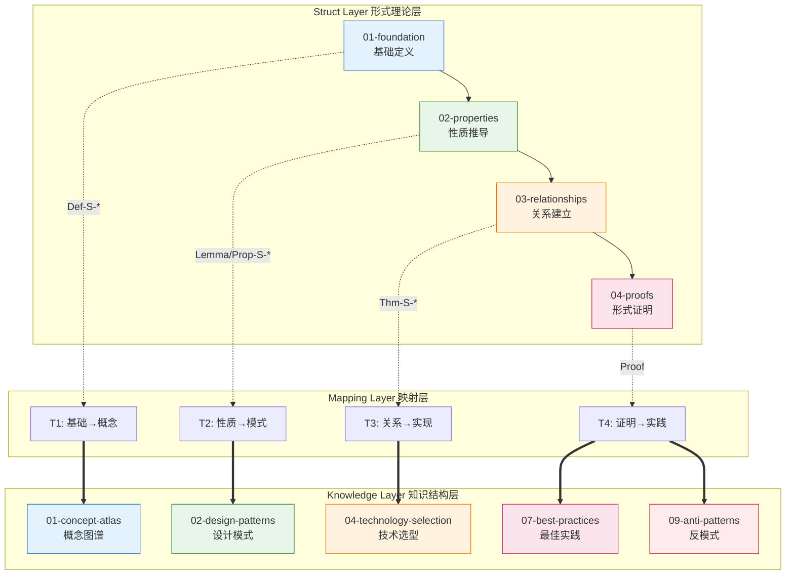
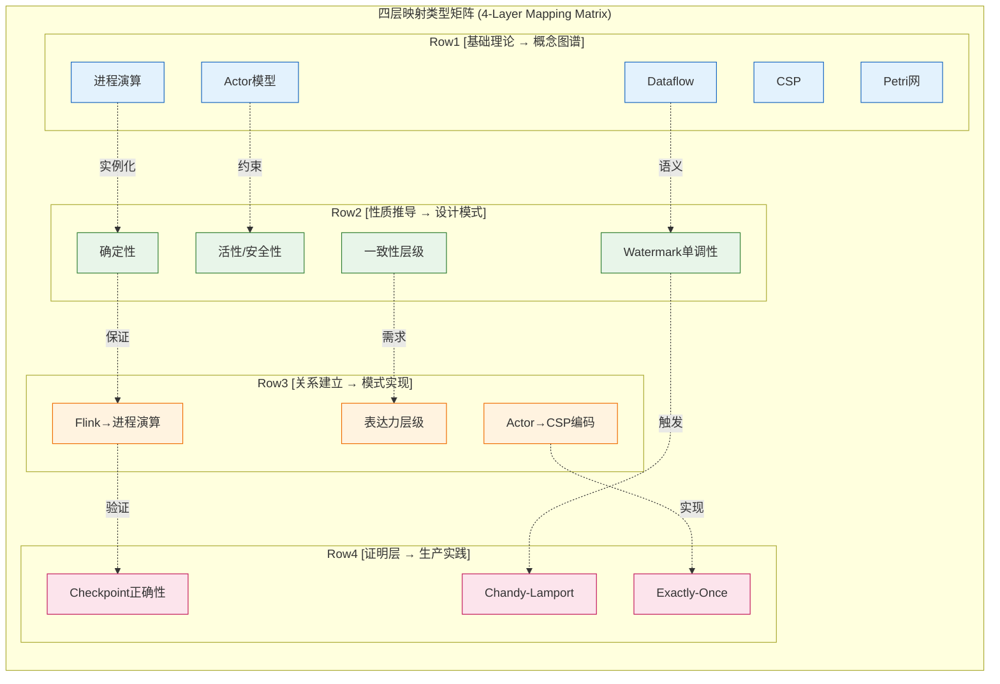

<!-- AI Translation Template - Replace <!-- TRANSLATE --> markers with actual translation -->

<!-- TRANSLATE: # Struct-to-Knowledge 层级映射 -->

<!-- TRANSLATE: > **所属阶段**: Struct → Knowledge 跨层映射 | **前置依赖**: [Struct/00-INDEX.md](./00-INDEX.md), [Knowledge/00-INDEX.md](../Knowledge/00-INDEX.md) | **形式化等级**: L3-L5 -->


<!-- TRANSLATE: ## 1. 概念定义 (Definitions) -->

<!-- TRANSLATE: ### Def-S-M-01. 形式理论层 (Struct Layer) -->

<!-- TRANSLATE: 形式理论层（Struct Layer）是知识体系中的**严格形式化基础层**，包含以下核心要素： -->

$$
<!-- TRANSLATE: \text{Struct} = (\mathcal{D}, \mathcal{P}, \mathcal{R}, \mathcal{T}) -->
$$

<!-- TRANSLATE: 其中： -->

<!-- TRANSLATE: | 分量 | 符号 | 语义 | -->
<!-- TRANSLATE: |------|------|------| -->
| 定义集 | $\mathcal{D}$ | 严格的形式化定义（Def-S-*） |
| 命题集 | $\mathcal{P}$ | 引理、命题、定理、推论（Lemma-S-*, Prop-S-*, Thm-S-*, Cor-S-*） |
| 关系集 | $\mathcal{R}$ | 模型间的编码、映射、表达能力关系 |
| 证明集 | $\mathcal{T}$ | 形式化证明与验证技术 |

<!-- TRANSLATE: **文档结构**：Struct/ 目录按逻辑层次组织为 01-foundation、02-properties、03-relationships、04-proofs、05-comparative-analysis、06-frontier、07-tools、08-standards 八个子目录 [^1]。 -->


<!-- TRANSLATE: ### Def-S-M-03. 跨层映射 (Cross-Layer Mapping) -->

<!-- TRANSLATE: **跨层映射**是连接形式理论层与工程知识层的二元关系： -->

$$
<!-- TRANSLATE: \mathcal{M}: \text{Struct} \times \text{Knowledge} \rightarrow \{\text{Direct}, \text{Derived}, \text{Inspired}, \text{Validated}\} -->
$$

<!-- TRANSLATE: 映射类型定义： -->

<!-- TRANSLATE: | 映射类型 | 符号 | 语义 | -->
<!-- TRANSLATE: |----------|------|------| -->
<!-- TRANSLATE: | 直接映射 | Direct | Struct 定义直接对应 Knowledge 概念（如 Def-S-02-01 → concurrency-paradigms） | -->
<!-- TRANSLATE: | 推导映射 | Derived | 从 Struct 定理推导 Knowledge 模式约束（如 Thm-S-17-01 → pattern-checkpoint） | -->
<!-- TRANSLATE: | 启发映射 | Inspired | Struct 理论启发 Knowledge 设计（如 Actor→CSP 编码启发异步 IO 模式） | -->
<!-- TRANSLATE: | 验证映射 | Validated | Knowledge 实践验证 Struct 理论（如 Flink 生产验证 Checkpoint 正确性） | -->

<!-- TRANSLATE: **直观解释**：跨层映射如同"理论到实践的翻译器"，将形式化的数学保证转化为工程师可理解、可应用的知识资产。 -->


<!-- TRANSLATE: ## 2. 属性推导 (Properties) -->

<!-- TRANSLATE: ### Lemma-S-M-01. 形式化保证的工程可实现性 -->

**引理**：若 Struct 层存在形式化定义 $\text{Def-S-X-Y}$ 及其满足的性质 $\text{Prop-S-X-Z}$，则 Knowledge 层存在对应的工程概念和实现模式，使得该性质可在工程系统中近似满足。

$$
<!-- TRANSLATE: \forall d \in \mathcal{D}, \exists c \in \mathcal{C}: \text{Sem}(d) \approx \text{Sem}(c) \land \text{Prop}(d) \Rightarrow \text{Guarantee}(c) -->
$$

**直观解释**：形式化的语义（$\text{Sem}$）可以在工程中以一定精度（$\approx$）被实现，形式化保证（$\text{Prop}$）转化为工程系统的运行时保证（$\text{Guarantee}$）。


<!-- TRANSLATE: ### Prop-S-M-01. 理论与实践的知识鸿沟 -->

<!-- TRANSLATE: **命题**：Struct 层的形式化抽象与 Knowledge 层的工程实践之间存在必然的知识鸿沟，映射文档的作用是显式化这一鸿沟并提供跨越路径。 -->

$$
<!-- TRANSLATE: \exists \delta > 0: \forall s \in \text{Struct}, k \in \text{Knowledge}: \text{Dist}(\text{Sem}(s), \text{Sem}(k)) \leq \delta \cdot \text{Complexity}(s) -->
$$

其中 $\text{Dist}$ 为语义距离度量，$\text{Complexity}$ 为形式化复杂度。


<!-- TRANSLATE: ### 关系 2: Struct 定理 `⟹` Knowledge 模式 -->

<!-- TRANSLATE: 形式化定理通过**约束推导**映射到设计模式的工程约束： -->

$$
<!-- TRANSLATE: \text{Thm-S-X-Y} \implies \text{Pattern}_K \iff \text{Pattern}_K \text{ 的实现满足 } \text{Thm-S-X-Y} \text{ 的前提条件} -->
$$

<!-- TRANSLATE: **典型实例**： -->

- Thm-S-07-01 (流计算确定性定理) $\implies$ pattern-stateful-computation.md 的确定性保证
- Thm-S-17-01 (Checkpoint 一致性定理) $\implies$ pattern-checkpoint-recovery.md 的容错设计


<!-- TRANSLATE: ## 4. 论证过程 (Argumentation) -->

<!-- TRANSLATE: ### 论证 1: 为什么需要形式化到工程的映射 -->

<!-- TRANSLATE: 形式化理论（Struct）与工程实践（Knowledge）之间存在以下断层： -->

<!-- TRANSLATE: | 断层维度 | Struct 层特征 | Knowledge 层特征 | 映射作用 | -->
<!-- TRANSLATE: |----------|---------------|------------------|----------| -->
<!-- TRANSLATE: | **抽象级别** | 数学抽象、符号系统 | 工程概念、代码模式 | 桥接抽象差距 | -->
<!-- TRANSLATE: | **验证方式** | 形式证明、模型检验 | 测试、监控、运维 | 保证可验证性 | -->
<!-- TRANSLATE: | **目标读者** | 研究人员、验证工程师 | 应用工程师、架构师 | 知识传递 | -->
<!-- TRANSLATE: | **演进速度** | 慢（理论稳定） | 快（技术迭代） | 建立稳定基础 | -->

<!-- TRANSLATE: 映射文档提供显式的"理论-实践"追溯链，使得： -->

<!-- TRANSLATE: 1. 工程师理解设计决策的形式化根源 -->
<!-- TRANSLATE: 2. 研究人员验证理论的工程适用性 -->
<!-- TRANSLATE: 3. 技术选型有严格的理论依据 -->


<!-- TRANSLATE: ### 论证 3: 跨层追溯性的价值 -->

<!-- TRANSLATE: 跨层追溯性支持以下关键场景： -->

<!-- TRANSLATE: **场景 A: 根因分析** -->
<!-- TRANSLATE: 生产故障 → 检查 Knowledge 反模式 → 追溯 Struct 定理违反 → 定位根因 -->

<!-- TRANSLATE: **场景 B: 技术选型** -->
<!-- TRANSLATE: 业务需求 → Knowledge 选型指南 → 追溯 Struct 表达能力定理 → 验证技术可行性 -->

<!-- TRANSLATE: **场景 C: 能力验证** -->
<!-- TRANSLATE: 新功能设计 → Knowledge 模式组合 → 追溯 Struct 性质推导 → 验证正确性保证 -->


<!-- TRANSLATE: ## 6. 实例验证 (Examples) -->

<!-- TRANSLATE: ### 示例 1: Checkpoint 正确性的跨层追溯 -->

<!-- TRANSLATE: **完整追溯链**： -->

```
[Struct/04-proofs/04.01-flink-checkpoint-correctness.md]
    ↓ Thm-S-17-01 (Flink Checkpoint 一致性定理)
    ↓ 证明依赖: Def-S-17-01~04, Lemma-S-17-01~04
    ↓ 关系: Flink Checkpoint ↦ Chandy-Lamport 分布式快照

[Knowledge/02-design-patterns/pattern-checkpoint-recovery.md]
    ↓ 应用: Checkpoint 屏障对齐机制
    ↓ 模式: 异步快照与状态后端选型

[Knowledge/07-best-practices/07.01-flink-production-checklist.md]
    ↓ 实践: checkpoint.interval, min-pause-between-checkpoints 配置
    ↓ 检查: 对齐/非对齐模式选择依据

[Knowledge/09-anti-patterns/anti-pattern-03-checkpoint-interval-misconfig.md]
    ↓ 避免: 违反 Thm-S-17-01 前提条件的配置
```

<!-- TRANSLATE: **价值**：当生产环境出现 Checkpoint 超时故障时，可沿此链追溯至 Struct 层的 Barrier 传播不变式（Lemma-S-17-01），分析是否为网络延迟违反了不变式前提。 -->


<!-- TRANSLATE: ## 7. 可视化 (Visualizations) -->

<!-- TRANSLATE: ### 图 1: Struct-Knowledge 双向映射关系图 -->



<!-- TRANSLATE: **说明**：此图展示了从 Struct 四层结构到 Knowledge 应用场景的双向映射关系，映射层（Mapping Layer）作为桥梁显式连接理论与实践。 -->


<!-- TRANSLATE: ### 图 3: 四层映射类型矩阵 -->



<!-- TRANSLATE: **说明**：此矩阵展示了四层映射的垂直依赖关系，上层理论为下层工程提供基础，下层实现验证上层理论的可行性。 -->


<!-- TRANSLATE: ### 表 2: 性质推导 → 设计模式 -->

<!-- TRANSLATE: | Struct 性质 | Knowledge 设计模式 | 映射类型 | 映射说明 | -->
<!-- TRANSLATE: |------------|-------------------|----------|----------| -->
<!-- TRANSLATE: | [Def-S-07-01 确定性](./02-properties/02.01-determinism-in-streaming.md#def-s-07-01-确定性流处理系统) | [pattern-stateful-computation.md](../Knowledge/02-design-patterns/pattern-stateful-computation.md) | Derived | 确定性保证状态一致性，指导有状态算子设计 | -->
<!-- TRANSLATE: | [Def-S-08-01 一致性层级](./02-properties/02.02-consistency-hierarchy.md) | [pattern-event-time-processing.md](../Knowledge/02-design-patterns/pattern-event-time-processing.md) | Derived | 一致性级别影响事件处理语义，指导 Watermark 配置 | -->
<!-- TRANSLATE: | [Lemma-S-08-02 Watermark 单调性](./02-properties/02.03-watermark-monotonicity.md) | [pattern-event-time-processing.md](../Knowledge/02-design-patterns/pattern-event-time-processing.md) | Derived | Watermark 单调性 → 窗口触发确定性保证 | -->
<!-- TRANSLATE: | [Def-S-09-01 活性/安全性](./02-properties/02.04-liveness-and-safety.md) | [pattern-checkpoint-recovery.md](../Knowledge/02-design-patterns/pattern-checkpoint-recovery.md) | Derived | 活性/安全性性质 → 容错设计模式约束 | -->

<!-- TRANSLATE: **约束传递**： -->

<!-- TRANSLATE: - Thm-S-07-01 (流计算确定性定理) 要求：纯函数算子 + FIFO 通道 + 事件时间 → pattern-stateful-computation.md 的 "Operator State 必须满足确定性条件" -->
<!-- TRANSLATE: - Lemma-S-08-02 (Watermark 单调性) 要求：Watermark 生成器必须单调不降 → pattern-event-time-processing.md 的 "Watermark 生成策略" -->


<!-- TRANSLATE: ### 表 4: 证明层 → 生产实践 -->

<!-- TRANSLATE: | Struct 证明 | Knowledge 案例/最佳实践 | 映射类型 | 映射说明 | -->
<!-- TRANSLATE: |-----------|----------------------|----------|----------| -->
<!-- TRANSLATE: | [Thm-S-17-01 Checkpoint 正确性](./04-proofs/04.01-flink-checkpoint-correctness.md) | [pattern-checkpoint-recovery.md](../Knowledge/02-design-patterns/pattern-checkpoint-recovery.md) | Validated | 形式证明 → Checkpoint 屏障对齐工程实现 | -->
<!-- TRANSLATE: | [Thm-S-17-01 Checkpoint 正确性](./04-proofs/04.01-flink-checkpoint-correctness.md) | [07.01-flink-production-checklist.md](../Knowledge/07-best-practices/07.01-flink-production-checklist.md) | Validated | Barrier 传播语义 → 生产检查清单配置项 | -->
<!-- TRANSLATE: | [Thm-S-18-01 Exactly-Once](./04-proofs/04.02-flink-exactly-once-correctness.md) | [07.01-flink-production-checklist.md](../Knowledge/07-best-practices/07.01-flink-production-checklist.md) | Validated | EO 语义保证 → 端到端一致性检查项 | -->
<!-- TRANSLATE: | [Thm-S-19-01 Chandy-Lamport](./04-proofs/04.03-chandy-lamport-consistency.md) | [streaming-anti-patterns.md](../Knowledge/09-anti-patterns/streaming-anti-patterns.md) | Validated | 避免违反 CL 协议的反模式 | -->

<!-- TRANSLATE: **实践验证链**： -->

```
Thm-S-17-01 证明 Barrier 对齐保证一致性
    ↓ 工程实现
07.01-flink-production-checklist.md: checkpoint.mode = EXACTLY_ONCE
    ↓ 运行时验证
streaming-anti-patterns.md: 避免 checkpoint.interval 配置不当
```


<!-- TRANSLATE: *文档版本: 2026.04 | 映射覆盖: 15+ 核心定义, 10+ 关键定理, 10+ 工程文档 | 状态: Production* -->
