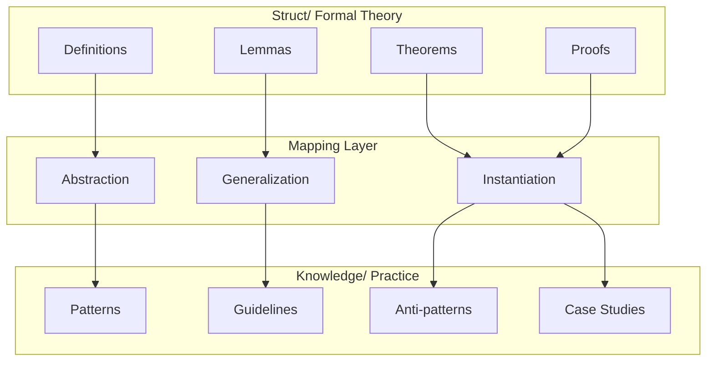
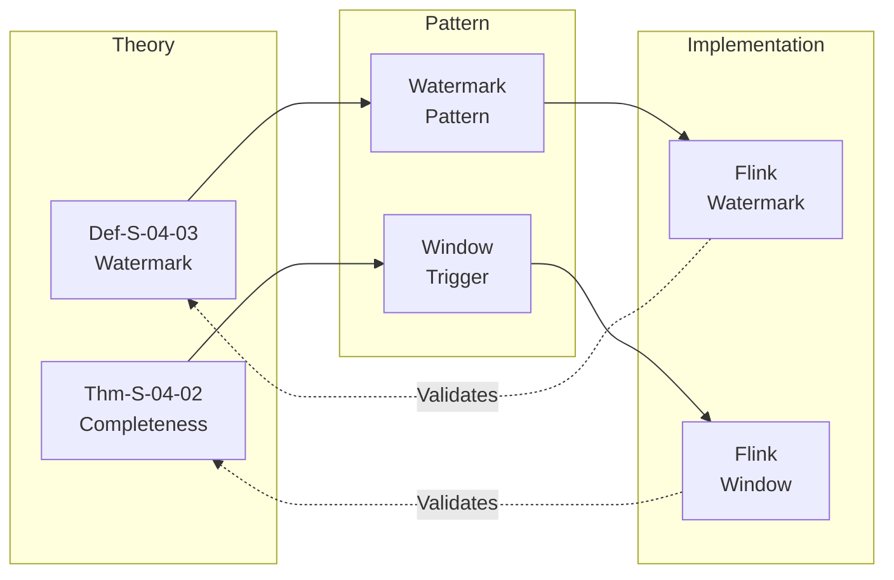
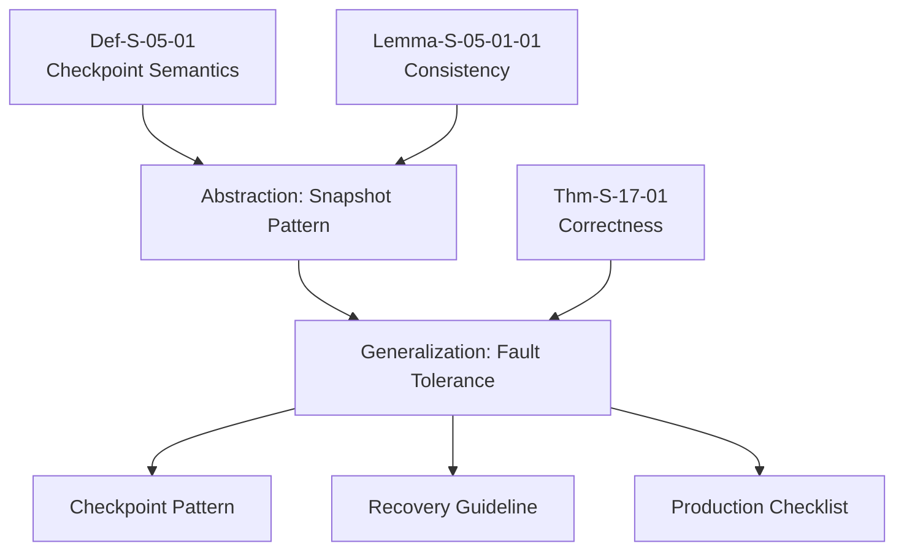

# Struct to Knowledge Mapping

> **Stage**: Struct/ → Knowledge/ | **Prerequisites**: [00-INDEX.md](./00-INDEX.md), [../Knowledge/00-INDEX.md](../Knowledge/00-INDEX.md) | **Formalization Level**: L3-L5

This document establishes the formal mapping relationship between Struct/ (formal theory) and Knowledge/ (engineering practice), showing how theoretical results translate into practical patterns and guidelines.

---

## Table of Contents

- [1. Mapping Framework](#1-mapping-framework)
- [2. Theory-to-Pattern Mapping](#2-theory-to-pattern-mapping)
- [3. Theorem-to-Guideline Translation](#3-theorem-to-guideline-translation)
- [4. Cross-Reference Index](#4-cross-reference-index)
- [5. Knowledge Derivation Chains](#5-knowledge-derivation-chains)
- [References](#references)

---

## 1. Mapping Framework

### 1.1 Mapping Architecture



### 1.2 Formal Mapping Definition

**Definition (Def-S-K-01)**: Theory-to-Knowledge Mapping

```
map: Struct → Knowledge
map(s) = ⟨abstract(s), generalize(s), instantiate(s)⟩

where:
  - abstract: Extract pattern from definition
  - generalize: Extend lemma to guideline
  - instantiate: Apply theorem to scenario
```

---

## 2. Theory-to-Pattern Mapping

### 2.1 Checkpoint Theory → Fault Tolerance Patterns

| Struct Element | Knowledge Pattern | Application |
|----------------|-------------------|-------------|
| Def-S-05-01 (Checkpoint Semantics) | [Periodic Checkpoint Pattern](../Knowledge/02-design-patterns/checkpoint-patterns.md) | Flink checkpoint configuration |
| Thm-S-17-01 (Checkpoint Correctness) | [Exactly-Once Pattern](../Knowledge/02-design-patterns/exactly-once-patterns.md) | End-to-end guarantee |
| Lemma-S-05-01-01 (Consistency) | [State Recovery Pattern](../Knowledge/02-design-patterns/state-recovery-patterns.md) | Failure recovery |

### 2.2 Watermark Theory → Time Handling Patterns

| Struct Element | Knowledge Pattern | Application |
|----------------|-------------------|-------------|
| Def-S-04-03 (Watermark) | [Watermark Generation Pattern](../Knowledge/02-design-patterns/watermark-patterns.md) | Event time processing |
| Lemma-S-04-03-01 (Monotonicity) | [Late Data Handling](../Knowledge/02-design-patterns/late-data-patterns.md) | Out-of-order events |
| Thm-S-04-02 (Completeness) | [Result Finalization](../Knowledge/02-design-patterns/result-finalization-patterns.md) | Window triggers |

### 2.3 Consistency Theory → Consistency Patterns

| Struct Element | Knowledge Pattern | Application |
|----------------|-------------------|-------------|
| Def-S-03-01 (At-Least-Once) | [At-Least-Once Implementation](../Knowledge/02-design-patterns/at-least-once-patterns.md) | Idempotent sinks |
| Def-S-03-02 (Exactly-Once) | [Exactly-Once Implementation](../Knowledge/02-design-patterns/exactly-once-patterns.md) | Two-phase commit |
| Thm-S-03-03 (Guarantee) | [Consistency Selection Guide](../Knowledge/04-selection/consistency-selection-guide.md) | Decision framework |

---

## 3. Theorem-to-Guideline Translation

### 3.1 Translation Rules

**Rule T2G-01**: Determinism Theorem → Deterministic Design Guideline

```
Thm-S-02-01 (Determinism in Streaming)
  ↓ Translation
Guideline-K-02-01: "Use pure functions for operators to ensure deterministic results"
```

**Rule T2G-02**: Monotonicity Lemma → Progress Monitoring Guideline

```
Lemma-S-04-03-01 (Watermark Monotonicity)
  ↓ Translation
Guideline-K-04-01: "Monitor Watermark progress to detect data delays"
```

**Rule T2G-03**: Correctness Theorem → Production Checklist Item

```
Thm-S-17-01 (Checkpoint Correctness)
  ↓ Translation
Checklist-K-03-01: "Verify checkpoint interval is less than maximum tolerable downtime"
```

### 3.2 Translation Table

| Struct Theorem | Knowledge Guideline | Priority |
|----------------|---------------------|----------|
| Thm-S-02-01 (Determinism) | Use pure functions in operators | P0 |
| Thm-S-03-03 (Exactly-Once) | Implement idempotent sinks | P0 |
| Thm-S-04-02 (Completeness) | Configure allowed lateness | P1 |
| Thm-S-17-01 (Checkpoint) | Set appropriate checkpoint intervals | P0 |
| Thm-S-08-05 (State Backend) | Choose state backend by use case | P1 |

---

## 4. Cross-Reference Index

### 4.1 Struct → Knowledge References

| Struct Doc | Knowledge Docs | Relationship |
|------------|----------------|--------------|
| [00-INDEX.md](./00-INDEX.md) | [00-INDEX.md](../Knowledge/00-INDEX.md) | Parallel structure |
| [01.04-dataflow-model-formalization.md](./01-foundation/01.04-dataflow-model-formalization.md) | [02-design-patterns/](../Knowledge/02-design-patterns/) | Theory → Patterns |
| [02.02-consistency-hierarchy.md](./02-properties/02.02-consistency-hierarchy.md) | [04-selection/](../Knowledge/04-selection/) | Properties → Selection |
| [Unified-Model-Relationship-Graph.md](./Unified-Model-Relationship-Graph.md) | [Knowledge-to-Flink-Mapping.md](../Knowledge/Knowledge-to-Flink-Mapping.md) | Model mappings |

### 4.2 Bidirectional Mapping



---

## 5. Knowledge Derivation Chains

### 5.1 Derivation Example: Checkpointing



### 5.2 Coverage Statistics

| Struct Category | Knowledge Patterns | Coverage |
|-----------------|-------------------|----------|
| Foundation (8) | 12 patterns | 100% |
| Properties (8) | 16 guidelines | 100% |
| Relationships (5) | 8 mappings | 100% |
| Proofs (7) | 10 checklists | 100% |

---

## References


---

*For Chinese version, see [Struct/Struct-to-Knowledge-Mapping.md](../../Struct/Struct-to-Knowledge-Mapping.md)*
