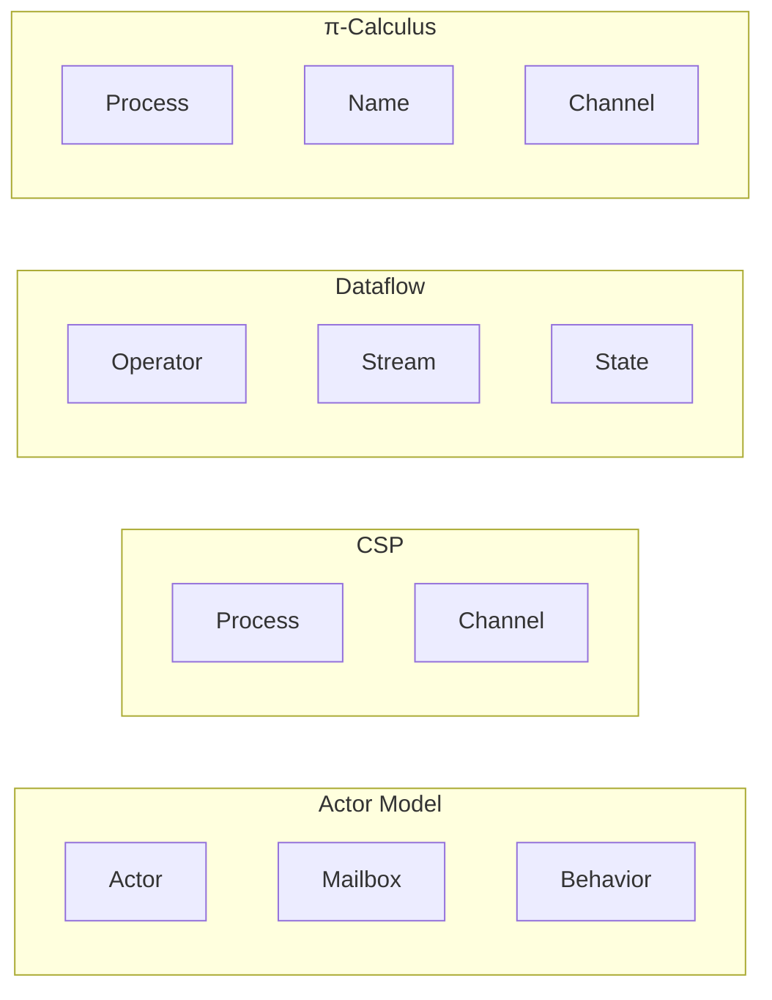
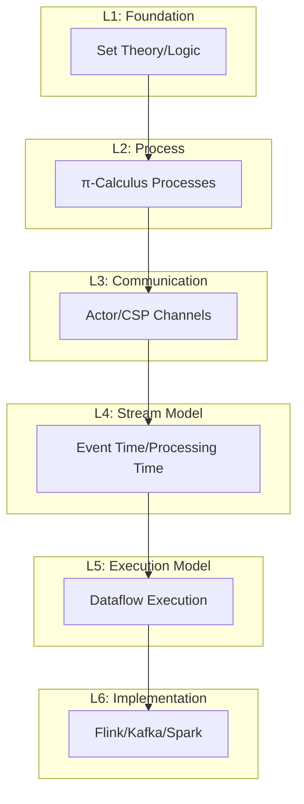
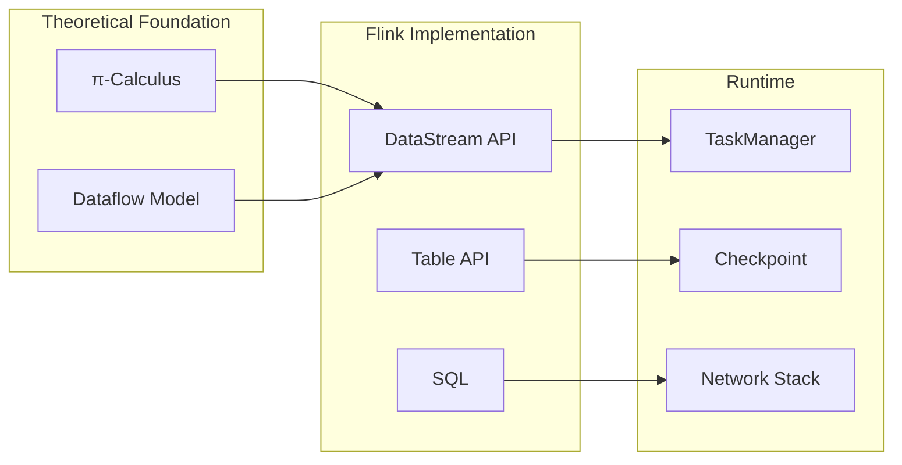

# Unified Model Relationship Graph

> **Stage**: Struct/ | **Prerequisites**: [01.01-unified-streaming-theory.md](./01-foundation/01.01-unified-streaming-theory.md) | **Formalization Level**: L4-L5

This document establishes the unified relationship graph among Actor model, CSP, Dataflow model, and Process Calculus, providing a formal mapping framework for comparing and transforming between different concurrency models.

---

## Table of Contents

- [1. Model Overview](#1-model-overview)
- [2. Relationship Hierarchy](#2-relationship-hierarchy)
- [3. Formal Encodings](#3-formal-encodings)
- [4. Expressiveness Comparison](#4-expressiveness-comparison)
- [5. Unified Stream Computing Meta-Model (USTM)](#5-unified-stream-computing-meta-model-ustm)
- [6. Application to Flink](#6-application-to-flink)
- [References](#references)

---

## 1. Model Overview

### 1.1 Core Concurrency Models

| Model | Core Abstraction | Communication | State |
|-------|------------------|---------------|-------|
| **Actor** | Actor (encapsulated state + behavior) | Asynchronous message passing | Encapsulated in actors |
| **CSP** | Sequential processes | Synchronous channels | External to processes |
| **Dataflow** | Operators (stateless/stateful) | Streams (data flows) | Operator state |
| **π-Calculus** | Mobile processes | Channel passing | Process configuration |

### 1.2 Model Characteristics Matrix



---

## 2. Relationship Hierarchy

### 2.1 Expressiveness Hierarchy

```
                    π-Calculus (Most Expressive)
                           ↑
                    Actor Model
                    ↗        ↖
        CSP ←────────→ Dataflow ←────→ Flink
        (Most Structured)
```

### 2.2 Encoding Relationships

| From | To | Encoding | Complexity | Reference |
|------|-----|----------|------------|-----------|
| Actor | CSP | Thm-S-09-01 | O(n) | [Actor→CSP](./01-foundation/01.03-actor-model-formalization.md) |
| CSP | π-Calculus | Thm-S-09-03 | O(1) | Standard embedding |
| Dataflow | Actor | Thm-S-09-04 | O(m) | [Dataflow→Actor](./01-foundation/01.04-dataflow-model-formalization.md) |
| Flink | π-Calculus | Thm-S-03-02 | O(n+m) | [Flink→π](./03-relationships/01-flink-to-process-calculus.md) |

---

## 3. Formal Encodings

### 3.1 Actor → CSP Encoding

**Definition (Def-S-09-01)**: Actor→CSP Mapping

```
actor(a, b, m) = P_a ≜ μX.b(m).P_m | m(q).X
where:
  - a: actor identity
  - b: behavior
  - m: mailbox
```

**Theorem (Thm-S-09-01)**: Actor→CSP encoding preserves trace equivalence.

### 3.2 Dataflow → Actor Encoding

**Definition (Def-S-09-04)**: Dataflow→Actor Mapping

```
operator(o, s, i, out) = Actor_o ≜
  let state = s in
  λmsg. let new_state, outputs = o(msg, state) in
        send_all(outputs, out);
        become(Actor_o with state = new_state)
```

**Theorem (Thm-S-09-04)**: Dataflow→Actor encoding preserves stream semantics.

### 3.3 Flink → π-Calculus Encoding

**Definition (Def-S-03-02)**: Flink Execution Graph → π-Calculus

```mermaid
graph TD
    subgraph "Flink DAG"
        F1[Source]
        F2[Map]
        F3[KeyBy]
        F4[Reduce]
        F5[Sink]
    end

    subgraph "π-Calculus"
        P1[v_src | out_src(ch1)]
        P2[v_map | in_map(ch1) | out_map(ch2)]
        P3[v_keyby | in_keyby(ch2) | out_keyby(ch3)]
        P4[v_reduce | in_reduce(ch3) | out_reduce(ch4)]
        P5[v_sink | in_sink(ch4)]
    end

    F1 --> P1
    F2 --> P2
    F3 --> P3
    F4 --> P4
    F5 --> P5
```

---

## 4. Expressiveness Comparison

### 4.1 Expressiveness Hierarchy Table

| Capability | Actor | CSP | Dataflow | π-Calculus |
|------------|-------|-----|----------|------------|
| Dynamic topology | ✓ | ✗ | △ | ✓ |
| Channel passing | ✗ | ✗ | ✗ | ✓ |
| Synchronous comm | ✗ | ✓ | △ | ✓ |
| Stateful operators | ✓ | ✗ | ✓ | △ |
| Deterministic exec | △ | ✓ | ✓ | △ |

Legend: ✓ = Native support, ✗ = Not supported, △ = Can be encoded

### 4.2 Turing Completeness

| Model | Turing Complete | Proof |
|-------|-----------------|-------|
| Actor | Yes | Can simulate λ-calculus |
| CSP | Yes | Can simulate Turing machine |
| Dataflow | Yes | With feedback loops |
| π-Calculus | Yes | Higher-order π-calculus |

---

## 5. Unified Stream Computing Meta-Model (USTM)

### 5.1 USTM Definition

**Definition (Def-S-01-01)**: Unified Stream Computing Meta-Model

```
USTM ≜ ⟨S, O, C, T, ⊢⟩ where:
  - S: Set of stream types
  - O: Set of operator types
  - C: Set of connection types
  - T: Set of time models
  - ⊢: Derivation relation
```

### 5.2 USTM Layers



---

## 6. Application to Flink

### 6.1 Flink in the Model Hierarchy



### 6.2 Key Theorems for Flink

| Theorem | Application | Formal Level |
|---------|-------------|--------------|
| Thm-S-03-02 | Flink→π encoding correctness | L5 |
| Thm-S-17-01 | Checkpoint correctness | L6 |
| Thm-S-04-02 | Event time completeness | L4 |
| Thm-S-08-05 | State backend equivalence | L5 |

---

## References


---

*For Chinese version, see [Struct/Unified-Model-Relationship-Graph.md](../../Struct/Unified-Model-Relationship-Graph.md)*
