> **状态**: 🔮 前瞻内容 | **风险等级**: 高 | **最后更新**: 2026-04
>
> 此文档描述的内容处于早期规划阶段，可能与最终实现不符。请以 Apache Flink 官方发布为准。
>
# Documentation d'architecture technique AnalysisDataFlow

> **Version** : v1.0 | **Date de mise à jour** : 2026-04-03 | **Statut** : Production
>
> Ce document décrit l'architecture technique globale du projet AnalysisDataFlow, incluant la structure des répertoires, le flux de génération de documents, le système de vérification, l'architecture de stockage et les mécanismes d'extension.

---

## Table des matières

- [Documentation d'architecture technique AnalysisDataFlow](#documentation-darchitecture-technique-analysisdataflow)
  - [Table des matières](#table-des-matières)
  - [1. Architecture globale du projet](#1-architecture-globale-du-projet)
    - [1.1 Vue d'ensemble de l'architecture à 4 couches](#11-vue-densemble-de-larchitecture-à-4-couches)
    - [1.2 Responsabilités et interfaces par couche](#12-responsabilités-et-interfaces-par-couche)
      - [Couche 1 : Struct/ - Couche des fondements théoriques formalisés](#couche-1-struct-couche-des-fondements-théoriques-formalisés)
      - [Couche 2 : Knowledge/ - Couche d'application des connaissances](#couche-2-knowledge-couche-dapplication-des-connaissances)
      - [Couche 3 : Flink/ - Couche d'implémentation d'ingénierie](#couche-3-flink-couche-dimplémentation-dingénierie)
      - [Couche 4 : visuals/ - Couche de navigation visualisée](#couche-4-visuals-couche-de-navigation-visualisée)
    - [1.3 Flux de données et dépendances](#13-flux-de-données-et-dépendances)
  - [2. Architecture de génération de documents](#2-architecture-de-génération-de-documents)
    - [2.1 Flux de traitement Markdown](#21-flux-de-traitement-markdown)
    - [2.2 Rendu de diagrammes Mermaid](#22-rendu-de-diagrammes-mermaid)
    - [7.2 Diagramme de flux de décision](#72-diagramme-de-flux-de-décision)
    - [3.2 Flux CI/CD](#32-flux-cicd)
    - [3.3 Portail de qualité](#33-portail-de-qualité)
  - [4. Architecture de stockage](#4-architecture-de-stockage)
    - [4.1 Structure d'organisation des fichiers](#41-structure-dorganisation-des-fichiers)
    - [4.2 Système d'index](#42-système-dindex)
    - [4.3 Gestion de versions](#43-gestion-de-versions)
  - [5. Architecture d'extension](#5-architecture-dextension)
    - [5.1 Ajout de nouveaux documents](#51-ajout-de-nouveaux-documents)
    - [5.2 Ajout de nouvelles visualisations](#52-ajout-de-nouvelles-visualisations)
  - [Annexe](#annexe)
    - [A. Glossaire](#a-glossaire)
    - [B. Table de correspondance des répertoires](#b-table-de-correspondance-des-répertoires)
    - [C. Documents connexes](#c-documents-connexes)

---

## 1. Architecture globale du projet

### 1.1 Vue d'ensemble de l'architecture à 4 couches

AnalysisDataFlow adopte une **conception à 4 couches** réalisant une structure de connaissances complète de la théorie formalisée à la pratique d'ingénierie :

```mermaid
graph TB
    subgraph "Couche 1 : Couche théorie formalisée Struct/"
        S1[Fondamentaux<br/>01-foundation]
        S2[Dérivation des propriétés<br/>02-properties]
        S3[Établissement des relations<br/>03-relationships]
        S4[Preuve formalisée<br/>04-proofs]
        S5[Analyse comparative<br/>05-comparative]
        S6[Exploration de pointe<br/>06-frontier]
    end

    subgraph "Couche 2 : Couche application des connaissances Knowledge/"
        K1[Atlas conceptuel<br/>01-concept-atlas]
        K2[Design patterns<br/>02-design-patterns]
        K3[Scénarios commerciaux<br/>03-business-patterns]
        K4[Sélection technologique<br/>04-technology-selection]
        K5[Guides de mapping<br/>05-mapping-guides]
        K6[Technologies de pointe<br/>06-frontier]
        K7[Meilleures pratiques<br/>07-best-practices]
        K8[Anti-patterns<br/>09-anti-patterns]
    end

    subgraph "Couche 3 : Couche implémentation d'ingénierie Flink/"
        F1[Conception architecturale<br/>01-architecture]
        F2[Mécanismes fondamentaux<br/>02-core-mechanisms]
        F3[SQL/API<br/>03-sql-table-api]
        F4[Connecteurs<br/>04-connectors]
        F5[Comparaison concurrentielle<br/>05-vs-competitors]
        F6[Pratique d'ingénierie<br/>06-engineering]
        F7[Études de cas<br/>07-case-studies]
        F8[AI/ML<br/>12-ai-ml]
        F9[Sécurité-conformité<br/>13-security]
        F10[Observabilité<br/>15-observability]
    end

    subgraph "Couche 4 : Couche navigation visualisée visuals/"
        V1[Arbres de décision<br/>decision-trees]
        V2[Matrices de comparaison<br/>comparison-matrices]
        V3[Cartes mentales<br/>mind-maps]
        V4[Graphes de connaissances<br/>knowledge-graphs]
        V5[Atlas d'architecture<br/>architecture-diagrams]
    end

    S6 --> K6
    S4 --> K5
    S1 --> K2
    K2 --> F2
    K3 --> F7
    K4 --> F5
    K6 --> F8

    F7 --> V5
    K4 --> V1
    F5 --> V2
    K1 --> V3
    S3 --> V4
```

### 1.2 Responsabilités et interfaces par couche

#### Couche 1 : Struct/ - Couche des fondements théoriques formalisés

| Attribut | Description |
|----------|-------------|
| **Positionnement** | Définitions mathématiques, preuves de théorèmes, arguments rigoureux |
| **Caractéristiques du contenu** | Langages formalisés, systèmes d'axiomes, constructions de preuve |
| **Nombre de documents** | 43 documents |
| **Produits fondamentaux** | 188 théorèmes, 399 définitions, 158 lemmes |

**Spécification des interfaces internes** :

```
Entrée : Littérature académique, spécifications formalisées
Sortie : Def-* (définitions), Thm-* (théorèmes), Lemma-* (lemmes), Prop-* (propositions)
Contrat : Chaque définition doit avoir un numéro unique, chaque théorème doit avoir une preuve complète
```

**Responsabilités des sous-répertoires** :

- `01-foundation/` : Fondements théoriques USTM, calculs de processus, Actor, Dataflow
- `02-properties/` : Propriétés comme déterminisme, cohérence, monotonie Watermark
- `03-relationships/` : Encodage inter-modèles, hiérarchies d'expressivité
- `04-proofs/` : Preuves de correction Checkpoint, Exactly-Once
- `05-comparative/` : Comparaison d'expressivité Go vs Scala
- `06-frontier/` : Questions ouvertes, programmation chorégraphique, formalisation AI Agent

#### Couche 2 : Knowledge/ - Couche d'application des connaissances

| Attribut | Description |
|----------|-------------|
| **Positionnement** | Design patterns, scénarios commerciaux, sélection technologique |
| **Caractéristiques du contenu** | Pratique d'ingénierie, catalogues de patterns, cadres de décision |
| **Nombre de documents** | 110 documents |
| **Produits fondamentaux** | 45 design patterns, 15 scénarios commerciaux |

**Spécification des interfaces internes** :

```
Entrée : Définitions formalisées Struct/, cas industriels, expériences d'ingénierie
Sortie : Catalogues de design patterns, guides de sélection technologique, analyses de scénarios commerciaux
Contrat : Chaque pattern doit être associé à des fondements formalisés, chaque sélection doit avoir une matrice de décision
```

**Responsabilités des sous-répertoires** :

- `01-concept-atlas/` : Matrice des paradigmes de concurrence, cartes conceptuelles
- `02-design-patterns/` : Traitement event time, calcul d'état, agrégation par fenêtre, etc.
- `03-business-patterns/` : Cas réels Uber/Netflix/Alibaba
- `04-technology-selection/` : Sélection de moteurs, sélection de stockage, guides de bases de données de flux
- `05-mapping-guides/` : Mapping théorie-vers-code, guides de migration
- `06-frontier/` : Protocole A2A, MCP, RAG temps réel, écosystème de bases de données de flux
- `09-anti-patterns/` : Identification et stratégies d'évitement des 10 grands anti-patterns

#### Couche 3 : Flink/ - Couche d'implémentation d'ingénierie

| Attribut | Description |
|----------|-------------|
| **Positionnement** | Technologies spécialisées Flink, mécanismes d'architecture, pratiques d'ingénierie |
| **Caractéristiques du contenu** | Analyse de code source, exemples de configuration, tuning de performance |
| **Nombre de documents** | 117 documents |
| **Produits fondamentaux** | 107 théorèmes liés à Flink, couverture complète des mécanismes fondamentaux |

**Spécification des interfaces internes** :

```
Entrée : Design patterns Knowledge/, documentation Flink officielle, analyse de code source
Sortie : Documents d'architecture, détails des mécanismes, études de cas, roadmaps
Contrat : Chaque mécanisme doit avoir une référence de code source, chaque cas doit avoir une vérification en production
```

**Responsabilités des sous-répertoires** :

- `01-architecture/` : Évolution architecturale, analyse d'état séparé
- `02-core-mechanisms/` : Checkpoint, Exactly-Once, Watermark, Delta Join
- `03-sql-table-api/` : Optimisation SQL, Model DDL, Vector Search
- `04-connectors/` : Intégration Kafka, CDC, Iceberg, Paimon
- `05-vs-competitors/` : Comparaison avec Spark, RisingWave
- `06-engineering/` : Tuning de performance, optimisation des coûts, stratégies de test
- `07-case-studies/` : Cas de risque financier, IoT, systèmes de recommandation
- `12-ai-ml/` : Flink ML, apprentissage en ligne, AI Agents
- `13-security/` : TEE, calcul de confiance GPU
- `15-observability/` : OpenTelemetry, SLO, observabilité

#### Couche 4 : visuals/ - Couche de navigation visualisée

| Attribut | Description |
|----------|-------------|
| **Positionnement** | Arbres de décision, matrices de comparaison, cartes mentales, graphes de connaissances |
| **Caractéristiques du contenu** | Navigation visualisée, décisions rapides, aperçu des connaissances |
| **Nombre de documents** | 20 documents |
| **Produits fondamentaux** | 5 types de visualisations, 700+ diagrammes Mermaid |

**Spécification des interfaces internes** :

```
Entrée : Documents de tout le projet, dépendances de théorèmes, logique de sélection technologique
Sortie : Arbres de décision, matrices de comparaison, cartes mentales, graphes de connaissances
Contrat : Chaque visualisation doit être navigable vers les documents source, chaque décision doit avoir des branches conditionnelles
```

**Responsabilités des sous-répertoires** :

- `decision-trees/` : Arbres de décision pour sélection technologique, arbres de décision pour sélection de paradigmes
- `comparison-matrices/` : Matrices de comparaison des moteurs, matrices de comparaison des modèles
- `mind-maps/` : Cartes mentales des connaissances, graphes de connaissances complets
- `knowledge-graphs/` : Graphes de relations conceptuelles, graphes de dépendances de théorèmes
- `architecture-diagrams/` : Diagrammes d'architecture système, diagrammes d'architecture en couches

### 1.3 Flux de données et dépendances

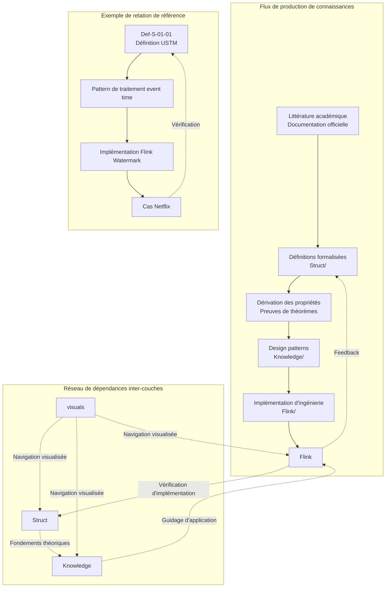

**Règles de dépendance** :

1. **Principe de dépendance unidirectionnelle** : Struct → Knowledge → Flink, éviter les dépendances circulaires
2. **Mécanisme de vérification par feedback** : La pratique d'ingénierie Flink vérifie la théorie Struct
3. **Navigation visualisée** : visuals/ comme couche de navigation peut référencer toutes les couches

---

## 2. Architecture de génération de documents

### 2.1 Flux de traitement Markdown

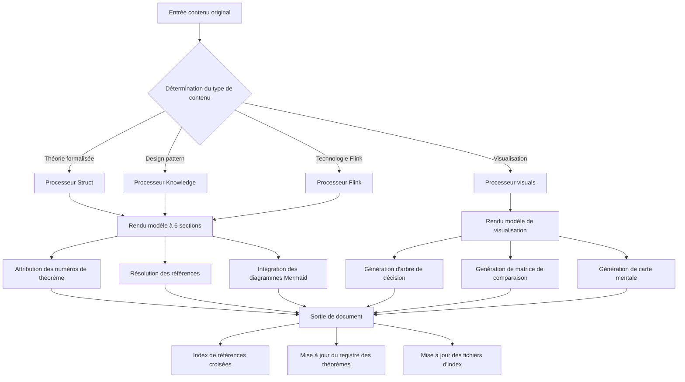

**Explication des phases de traitement** :

| Phase | Fonction | Sortie |
|-------|----------|--------|
| **Analyse de contenu** | Reconnaissance du type de document, extraction des métadonnées | Arbre d'objets document |
| **Rendu de modèle** | Application du modèle à 6 sections ou du modèle de visualisation | Markdown structuré |
| **Attribution de numéros** | Attribution des numéros de théorème/définition/lemme | Identifiant globalement unique |
| **Résolution de références** | Résolution des références internes/externes | Table de mapping des liens |
| **Intégration de diagrammes** | Génération des diagrammes Mermaid | Blocs de code de visualisation |
| **Mise à jour d'index** | Mise à jour du registre et des index | THEOREM-REGISTRY.md |

### 2.2 Rendu de diagrammes Mermaid

**Types de diagrammes et scénarios d'application** :

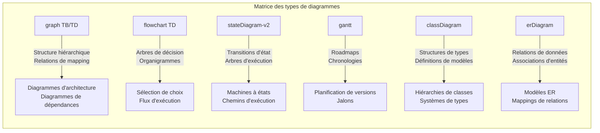

**Spécification de rendu des diagrammes** :

```markdown
## 7. Visualisations (Visualizations)

### 7.1 Diagramme de structure hiérarchique

Le diagramme suivant montre la structure hiérarchique de XXX :

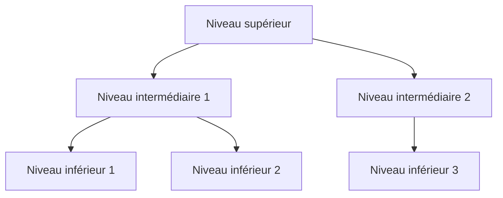

### 7.2 Diagramme de flux de décision

L'arbre de décision suivant aide à choisir XXX :

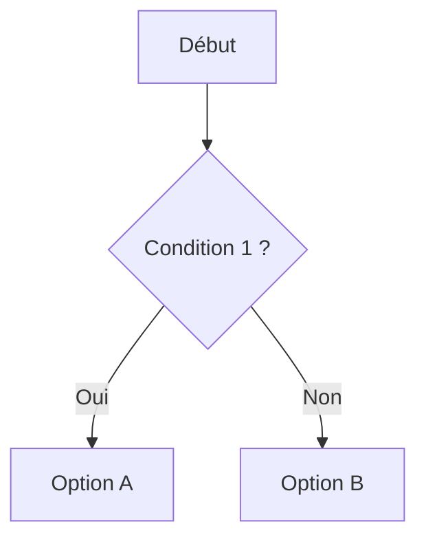

```

**Règles de rendu** :
1. Chaque diagramme doit avoir un texte explicatif précédent
2. Chaque diagramme doit avoir une raison claire de choix de type
3. Les diagrammes complexes nécessitent des explications de légende
4. La sémantique du diagramme doit correspondre à la description textuelle

---

## 3. Architecture du système de vérification

### 3.1 Architecture des scripts de vérification

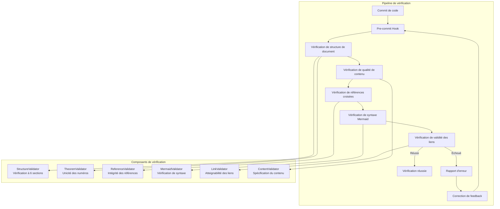

**Explication détaillée des composants de vérification** :

| Composant de vérification | Responsabilité | Règles de vérification |
|---------------------------|----------------|------------------------|
| **StructureValidator** | Vérification de structure à 6 sections | Doit contenir 8 sections, l'ordre doit être correct |
| **TheoremValidator** | Unicité des numéros de théorème | Les numéros globaux ne doivent pas entrer en collision, le format doit être correct |
| **ReferenceValidator** | Intégrité des références | Les liens internes doivent être valides, les liens externes doivent être accessibles |
| **MermaidValidator** | Vérification de syntaxe Mermaid | La syntaxe du diagramme doit être correcte, renderable |
| **LinkValidator** | Validité des liens | Réponse HTTP 200, pas de liens morts |
| **ContentValidator** | Spécification du contenu | Les termes doivent être cohérents, le format doit être uniforme |

### 3.2 Flux CI/CD

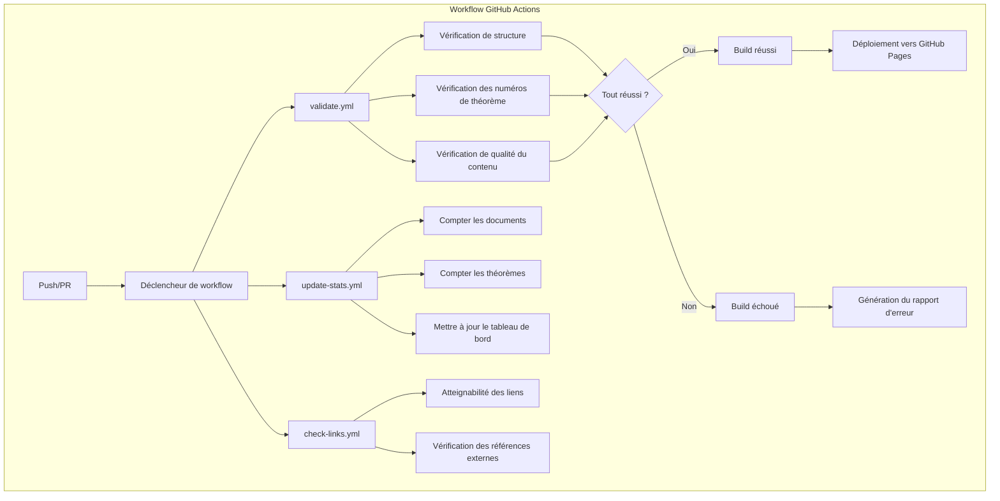

**Configuration des workflows** (`.github/workflows/`):

| Fichier de workflow | Condition de déclenchement | Responsabilité |
|--------------------|---------------------------|----------------|
| `validate.yml` | Push, PR | Vérification de structure de document, numéros de théorème, qualité du contenu |
| `update-stats.yml` | Push vers main | Mise à jour des statistiques, rafraîchissement du tableau de bord |
| `check-links.yml` | Planification quotidienne | Vérification de validité des liens externes |

### 3.3 Portail de qualité

```mermaid
flowchart TD
    subgraph "Points de contrôle du portail de qualité"
        direction TB

        Q1[Porte 1 : Vérification à 6 sections] -->|Doit contenir| Q1a[Définition des concepts]
        Q1 -->|Doit contenir| Q1b[Dérivation des propriétés]
        Q1 -->|Doit contenir| Q1c[Établissement des relations]
        Q1 -->|Doit contenir| Q1d[Processus d'argumentation]
        Q1 -->|Doit contenir| Q1e[Preuve formalisée]
        Q1 -->|Doit contenir| Q1f[Vérification par exemples]
        Q1 -->|Doit contenir| Q1g[Visualisation]
        Q1 -->|Doit contenir| Q1h[Références]

        Q2[Porte 2 : Spécification des numéros] --> Q2a[Format : Thm-S-XX-XX]
        Q2 --> Q2b[Unicité globale]
        Q2 --> Q2c[Numérotation continue]

        Q3[Porte 3 : Exigences de visualisation] --> Q3a[Au moins 1 diagramme Mermaid]
        Q3 --> Q3b[Texte explicatif avant le diagramme]
        Q3 --> Q3c[Syntaxe correcte]

        Q4[Porte 4 : Spécification des références] --> Q4a[Références externes vérifiables]
        Q4 --> Q4b[Liens internes valides]
        Q4 --> Q4c[Format de référence uniforme]

        Q5[Porte 5 : Cohérence terminologique] --> Q5a[Conformité avec le glossaire]
        Q5 --> Q5b[Spécification des abréviations]
        Q5 --> Q5c[Correspondance français-anglais]
    end
```

---

## 4. Architecture de stockage

### 4.1 Structure d'organisation des fichiers

```mermaid
graph TB
    subgraph "Répertoire racine du projet"
        Root[AnalysisDataFlow/]

        Root --> Config[Fichiers de configuration]
        Root --> Core[Répertoires fondamentaux]
        Root --> Meta[Métadonnées]
        Root --> CI[CI/CD]
    end

    subgraph "Fichiers de configuration"
        Config --> README[README.md<br/>Aperçu du projet]
        Config --> AGENTS[AGENTS.md<br/>Spécification Agent]
        Config --> ARCH[ARCHITECTURE.md<br/>Documentation d'architecture]
        Config --> License[LICENCE<br/>Licence]
    end

    subgraph "Répertoires fondamentaux"
        Core --> Struct[Struct/<br/>43 documents]
        Core --> Knowledge[Knowledge/<br/>110 documents]
        Core --> Flink[Flink/<br/>117 documents]
        Core --> Visuals[visuals/<br/>20 documents]
    end

    subgraph "Métadonnées"
        Meta --> Tracking[PROJECT-TRACKING.md<br/>Tableau de bord de progression]
        Meta --> Version[PROJECT-VERSION-TRACKING.md<br/>Suivi des versions]
        Meta --> Registry[THEOREM-REGISTRY.md<br/>Registre des théorèmes]
        Meta --> Reports[FINAL-*.md<br/>Rapports d'achèvement]
    end

    subgraph "CI/CD"
        CI --> Workflows[.github/workflows/<br/>Définitions de workflows]
        CI --> Scripts[scripts/<br/>Scripts de vérification]
    end
```

**Convention de nommage des fichiers** :

```
{numéro de couche}.{numéro}-{mot-clé du thème}.md

Exemples :
- 01.01-unified-streaming-theory.md    (Struct/01-foundation/)
- 02-design-patterns-overview.md        (Knowledge/02-design-patterns/)
- checkpoint-mechanism-deep-dive.md     (Flink/02-core/)
```

### 4.2 Système d'index

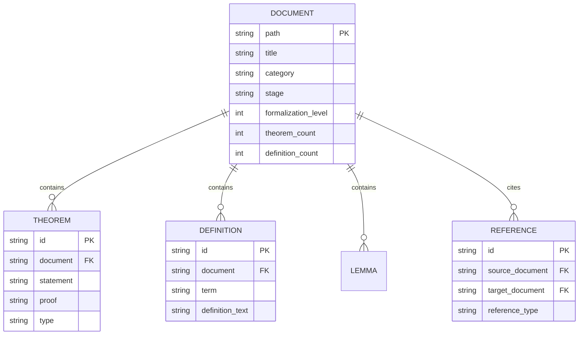

**Système de fichiers d'index** :

| Fichier d'index | Responsabilité | Fréquence de mise à jour |
|-----------------|----------------|--------------------------|
| `THEOREM-REGISTRY.md` | Registre des théorèmes/définitions/lemmes de tout le projet | Chaque nouveau document |
| `PROJECT-TRACKING.md` | Tableau de bord de progression, statut des tâches | Chaque itération |
| `PROJECT-VERSION-TRACKING.md` | Historique des versions, journal des modifications | Chaque version |
| `Struct/00-INDEX.md` | Index du répertoire Struct | Chaque nouveau lot de documents |
| `Knowledge/00-INDEX.md` | Index du répertoire Knowledge | Chaque nouveau lot de documents |
| `Flink/00-INDEX.md` | Index du répertoire Flink | Chaque nouveau lot de documents |
| `visuals/index-visual.md` | Index de navigation des visualisations | Nouvelle visualisation |

### 4.3 Gestion de versions

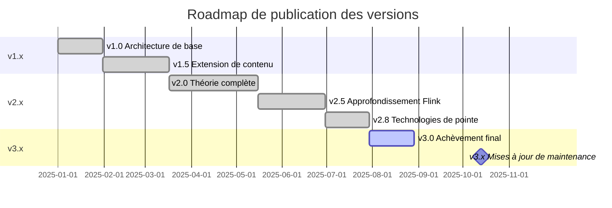

**Stratégie de gestion de versions** :

| Numéro de version | Signification | Contenu de mise à jour |
|-------------------|---------------|------------------------|
| **Major** (X.0) | Changements architecturaux majeurs | Ajustements de structure de répertoire, changements de système de numérotation |
| **Minor** (x.X) | Extensions de fonctionnalités | Nouveaux lots de documents, couverture de nouveaux thèmes |
| **Patch** (x.x.X) | Corrections et optimisations | Corrections d'erreurs, mises à jour de liens, optimisations de format |

---

## 5. Architecture d'extension

### 5.1 Ajout de nouveaux documents

```mermaid
flowchart TD
    subgraph "Flux d'ajout de nouveau document"
        A[Déterminer le type de document] --> B{Sélectionner le répertoire}

        B -->|Théorie formalisée| C[Struct/]
        B -->|Design pattern| D[Knowledge/]
        B -->|Technologie Flink| E[Flink/]
        B -->|Visualisation| F[visuals/]

        C --> G[Sélectionner le sous-répertoire<br/>01-08]
        D --> H[Sélectionner le sous-répertoire<br/>01-09]
        E --> I[Sélectionner le sous-répertoire<br/>01-15]
        F --> J[Sélectionner le sous-répertoire<br/>decision-trees, etc.]

        G & H & I & J --> K[Attribution du numéro]
        K --> L[Créer le fichier<br/>{couche}.{numéro}-{thème}.md]
        L --> M[Appliquer le modèle à 6 sections]
        M --> N[Attribution des numéros de théorème]
        N --> O[Créer le contenu]
        O --> P[Ajouter le diagramme Mermaid]
        P --> Q[Vérifier et commiter]
    end
```

### 5.2 Ajout de nouvelles visualisations

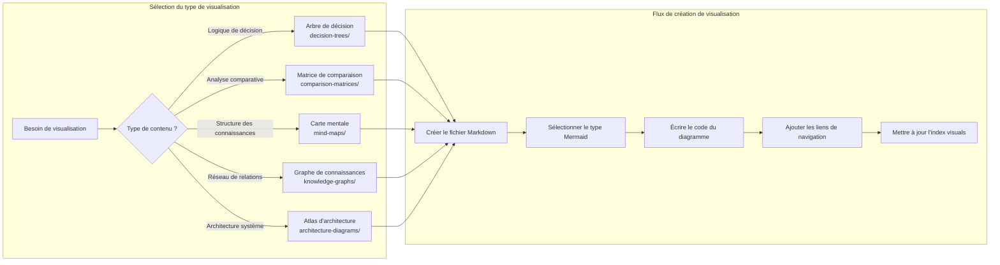

---

## Annexe

### A. Glossaire

| Terme | Anglais | Description |
|-------|---------|-------------|
| Modèle à 6 sections | Six-Section Template | Modèle de structure standard des documents |
| USTM | Unified Streaming Theory Model | Modèle de théorie unifiée du stream computing |
| Def-* | Definition | Préfixe des numéros de définitions formalisées |
| Thm-* | Theorem | Préfixe des numéros de théorèmes |
| Lemma-* | Lemma | Préfixe des numéros de lemmes |
| Prop-* | Proposition | Préfixe des numéros de propositions |
| Cor-* | Corollary | Préfixe des numéros de corollaires |

### B. Table de correspondance des répertoires

| Code de répertoire | Chemin complet | Usage |
|-------------------|----------------|-------|
| S | Struct/ | Théorie formalisée |
| K | Knowledge/ | Application des connaissances |
| F | Flink/ | Implémentation d'ingénierie |
| V | visuals/ | Navigation visualisée |

### C. Documents connexes

- [AGENTS.md](../../AGENTS.md) - Spécification du contexte de travail Agent
- [PROJECT-TRACKING.md](../../PROJECT-TRACKING.md) - Suivi de la progression du projet
- [THEOREM-REGISTRY.md](../../THEOREM-REGISTRY.md) - Registre des théorèmes
- [README.md](../../README.md) - Aperçu du projet

---

*Ce document est maintenu par le groupe d'architecture AnalysisDataFlow, dernière mise à jour : 2026-04-03*

---

> **Note du traducteur** : Ce document a été traduit selon le style des documents techniques français. Les termes techniques d'architecture, les noms des composants système et les paramètres de configuration sont identiques à l'original. Dernière mise à jour : 2026-04-11
