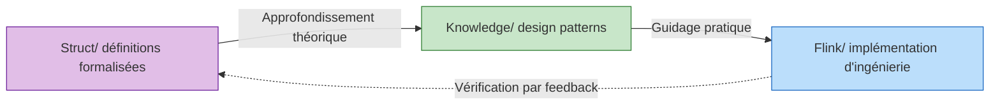
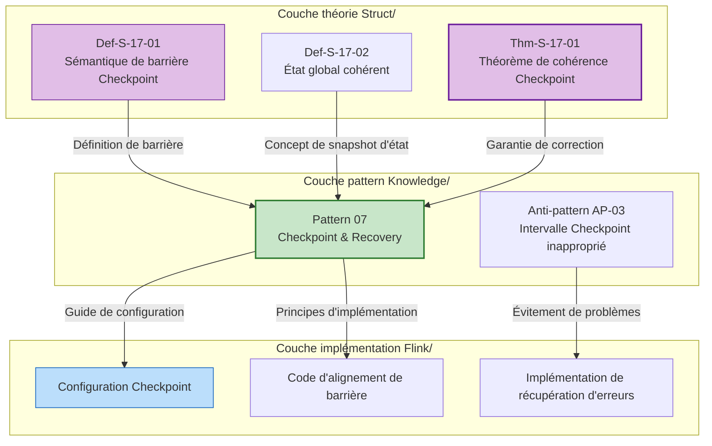

# Guide de démarrage rapide AnalysisDataFlow

> **Comprendre le projet en 5 minutes | Parcours personnalisés par rôle | Index rapide des problèmes**
>
> 📊 **254 documents | 945 éléments formalisés | 100% d'achèvement**

---

## 1. Compréhension rapide en 5 minutes

### 1.1 Qu'est-ce que le projet

**AnalysisDataFlow** est la **base de connaissances unifiée** dans le domaine du stream computing – un système de connaissances full-stack de la théorie formalisée à la pratique d'ingénierie.

```
┌─────────────────────────────────────────────────────────────┐
│                    Pyramide de hiérarchie des connaissances │
├─────────────────────────────────────────────────────────────┤
│  L6 Implémentation production  │  Flink/ Code, Config, Cas  │
├────────────────────────────────┼────────────────────────────┤
│  L4-L5 Patterns                │  Knowledge/ Design patterns│
├────────────────────────────────┼────────────────────────────┤
│  L1-L3 Théorie                 │  Struct/ Théorèmes, Preuves│
└────────────────────────────────┴────────────────────────────┘
```

**Valeurs fondamentales** :

- 🔬 **Fondement théorique** : Les théorèmes formalisés garantissent l'exactitude des décisions d'ingénierie
- 🛠️ **Guidage pratique** : Chemin de mappage complet du théorème au code
- 🔍 **Diagnostic des problèmes** : Localisation rapide des solutions par symptômes

---

### 1.2 Structure des trois répertoires principaux

| Répertoire | Positionnement | Caractéristiques du contenu | Pour qui |
|------------|----------------|----------------------------|----------|
| **Struct/** | Fondements théoriques formalisés | Définitions mathématiques, preuves de théorèmes, arguments rigoureux | Chercheurs, architectes |
| **Knowledge/** | Connaissances de pratique d'ingénierie | Design patterns, scénarios commerciaux, sélection technologique | Architectes, ingénieurs |
| **Flink/** | Technologies spécialisées Flink | Mécanismes d'architecture, SQL/API, pratiques d'ingénierie | Ingénieurs de développement |

**Relations de flux de connaissances** :



---

### 1.3 Caractéristiques principales

#### Modèle de document à six sections (structure obligatoire)

Chaque document principal doit contenir :

| Section | Contenu | Exemple |
|---------|---------|---------|
| 1. Définition des concepts | Définition formalisée rigoureuse + Explication intuitive | `Def-S-04-04` Sémantique Watermark |
| 2. Dérivation des propriétés | Lemmes et propriétés dérivés des définitions | `Lemma-S-04-02` Lemme de monotonie |
| 3. Établissement des relations | Connexions avec d'autres concepts/modèles | Flink→encodage en calcul de processus |
| 4. Processus d'argumentation | Théorèmes auxiliaires, analyse de contre-exemples | Discussion des conditions limites |
| 5. Preuve formalisée | Preuve complète du théorème principal | `Thm-S-17-01` Cohérence Checkpoint |
| 6. Vérification par exemples | Exemples simplifiés, extraits de code | Exemple de configuration Flink |
| 7. Visualisation | Diagrammes Mermaid | Diagrammes d'architecture, organigrammes |
| 8. Références | Citations de sources faisant autorité | Articles VLDB/SOSP |

#### Système de numérotation des théorèmes

Numérotation unifiée globale : `{type}-{étape}-{numéro de document}-{numéro de séquence}`

| Exemple de numérotation | Signification | Position |
|------------------------|---------------|----------|
| `Thm-S-17-01` | Étape Struct, document 17, 1er théorème | Preuve de correction Checkpoint |
| `Def-K-02-01` | Étape Knowledge, document 02, 1ère définition | Pattern Event Time Processing |
| `Thm-F-12-01` | Étape Flink, document 12, 1er théorème | Convergence des paramètres d'apprentissage en ligne |

**Aide-mémoire rapide** :

- **Thm** = Theorem (théorème) | **Def** = Definition (définition) | **Lemma** = Lemme | **Prop** = Proposition
- **S** = Struct (théorie) | **K** = Knowledge (connaissances) | **F** = Flink (implémentation)

---

## 2. Parcours de lecture par rôle

### 2.1 Parcours architecte (3-5 jours)

**Objectif** : Maîtriser la méthodologie de conception système, effectuer des choix technologiques et des décisions d'architecture

```
Jour 1-2 : Fondation des concepts
├── Struct/01-foundation/01.01-unified-streaming-theory.md
│   └── Focus : Hiérarchie d'expressivité à six niveaux (L1-L6)
├── Knowledge/01-concept-atlas/concurrency-paradigms-matrix.md
│   └── Focus : Matrice de comparaison des cinq paradigmes de concurrence
└── Knowledge/01-concept-atlas/streaming-models-mindmap.md
    └── Focus : Comparaison à six dimensions des modèles de stream computing

Jour 3-4 : Patterns et sélection
├── Knowledge/02-design-patterns/ (tout parcourir)
│   └── Focus : Diagramme des relations des 7 patterns fondamentaux
├── Knowledge/04-technology-selection/engine-selection-guide.md
│   └── Focus : Arbre de décision pour sélection de moteur de stream processing
└── Knowledge/04-technology-selection/streaming-database-guide.md
    └── Focus : Matrice de comparaison des bases de données de flux

Jour 5 : Décisions d'architecture
├── Flink/01-architecture/flink-1.x-vs-2.0-comparison.md
│   └── Focus : Évolution architecturale et décisions de migration
└── Struct/03-relationships/03.03-expressiveness-hierarchy.md
    └── Focus : Expressivité et contraintes d'ingénierie
```

---

### 2.2 Parcours ingénieur de développement (1-2 semaines)

**Objectif** : Maîtriser les technologies fondamentales de Flink, capable de développer des applications de stream processing de niveau production

```
Semaine 1 : Démarrage rapide
├── Jour 1 : Flink/05-vs-competitors/flink-vs-spark-streaming.md
│   └── Positionnement et forces de Flink
├── Jour 2-3 : Flink/02-core/time-semantics-and-watermark.md
│   └── Event time, mécanisme Watermark
├── Jour 4 : Knowledge/02-design-patterns/pattern-event-time-processing.md
│   └── Pattern de traitement Event Time
└── Jour 5 : Flink/04-connectors/kafka-integration-patterns.md
    └── Meilleures pratiques d'intégration Kafka

Semaine 2 : Approfondissement des mécanismes fondamentaux
├── Jour 1-2 : Flink/02-core/checkpoint-mechanism-deep-dive.md
│   └── Mécanisme Checkpoint, récupération d'erreurs
├── Jour 3 : Flink/02-core/exactly-once-end-to-end.md
│   └── Principes d'implémentation Exactly-Once
├── Jour 4 : Flink/02-core/backpressure-and-flow-control.md
│   └── Traitement du backpressure et contrôle de flux
└── Jour 5 : Flink/06-engineering/performance-tuning-guide.md
    └── Tuning de performance en pratique
```

---

### 2.3 Parcours chercheur (2-4 semaines)

**Objectif** : Comprendre les fondements théoriques, maîtriser les méthodes formalisées, capable de mener des recherches innovantes

```
Semaine 1-2 : Fondements théoriques
├── Struct/01-foundation/01.02-process-calculus-primer.md
│   └── Fondamentaux CCS/CSP/π-calcul
├── Struct/01-foundation/01.04-dataflow-model-formalization.md
│   └── Formalisation stricte de Dataflow
├── Struct/01-foundation/01.03-actor-model-formalization.md
│   └── Sémantique formelle du modèle Actor
└── Struct/02-properties/02.03-watermark-monotonicity.md
    └── Théorème de monotonie Watermark

Semaine 3 : Relations de modèles et encodage
├── Struct/03-relationships/03.01-actor-to-csp-encoding.md
│   └── Préservation de l'encodage Actor→CSP
├── Struct/03-relationships/03.02-flink-to-process-calculus.md
│   └── Encodage Flink→calcul de processus
└── Struct/03-relationships/03.03-expressiveness-hierarchy.md
    └── Théorème de hiérarchie d'expressivité à six niveaux

Semaine 4 : Preuves formalisées et frontière
├── Struct/04-proofs/04.01-flink-checkpoint-correctness.md
│   └── Preuve de cohérence Checkpoint
├── Struct/04-proofs/04.02-flink-exactly-once-correctness.md
│   └── Preuve de correction Exactly-Once
└── Struct/06-frontier/06.02-choreographic-streaming-programming.md
    └── Frontière de la programmation choreographic
```

---

### 2.4 Parcours étudiant (1-2 mois)

**Objectif** : Construire progressivement une structure de connaissances complète, du débutant à l'expert

```
Mois 1 : Construction des fondamentaux
├── Semaine 1 : Modèles de calcul parallèle
│   ├── Struct/01-foundation/01.02-process-calculus-primer.md
│   ├── Struct/01-foundation/01.03-actor-model-formalization.md
│   └── Struct/01-foundation/01.05-csp-formalization.md
├── Semaine 2 : Fondamentaux du stream computing
│   ├── Struct/01-foundation/01.04-dataflow-model-formalization.md
│   ├── Knowledge/01-concept-atlas/streaming-models-mindmap.md
│   └── Flink/02-core/time-semantics-and-watermark.md
├── Semaine 3 : Propriétés fondamentales
│   ├── Struct/02-properties/02.01-determinism-in-streaming.md
│   ├── Struct/02-properties/02.02-consistency-hierarchy.md
│   └── Knowledge/02-design-patterns/pattern-event-time-processing.md
└── Semaine 4 : Pratique des patterns
    ├── Knowledge/02-design-patterns/ (tous)
    └── Knowledge/03-business-patterns/ (lecture sélective)

Mois 2 : Approfondissement et extension
├── Semaine 5-6 : Pratique d'ingénierie Flink
│   ├── Flink/02-core/ (tous les documents fondamentaux)
│   └── Flink/06-engineering/performance-tuning-guide.md
├── Semaine 7 : Introduction aux preuves formalisées
│   ├── Struct/04-proofs/04.01-flink-checkpoint-correctness.md
│   └── Struct/04-proofs/04.03-chandy-lamport-consistency.md
└── Semaine 8 : Exploration de la frontière
    ├── Knowledge/06-frontier/streaming-databases.md
    └── Knowledge/06-frontier/rust-streaming-ecosystem.md
```

---

## 3. Index de recherche rapide

### 3.1 Index par thème

#### Fondamentaux du stream processing

| Thème | Lecture obligatoire | Fondements formalisés |
|-------|---------------------|----------------------|
| **Traitement Event Time** | Knowledge/02-design-patterns/pattern-event-time-processing.md | `Def-S-04-04` Sémantique Watermark |
| **Calcul de fenêtres** | Knowledge/02-design-patterns/pattern-windowed-aggregation.md | `Def-S-04-05` Opérateur de fenêtre |
| **Gestion d'état** | Knowledge/02-design-patterns/pattern-stateful-computation.md | `Thm-S-17-01` Cohérence Checkpoint |
| **Checkpoint** | Knowledge/02-design-patterns/pattern-checkpoint-recovery.md | `Thm-S-18-01` Correction Exactly-Once |
| **Niveaux de cohérence** | Struct/02-properties/02.02-consistency-hierarchy.md | `Def-S-08-01~04` Sémantiques AM/AL/EO |

#### Design patterns

| Pattern | Scénario d'application | Complexité | Document |
|---------|------------------------|------------|----------|
| P01 Event Time | Traitement de données désordonnées | ★★★☆☆ | pattern-event-time-processing.md |
| P02 Windowed Aggregation | Calcul d'agrégation par fenêtre | ★★☆☆☆ | pattern-windowed-aggregation.md |
| P03 CEP | Correspondance d'événements complexes | ★★★★☆ | pattern-cep-complex-event.md |
| P04 Async I/O | Association de données externes | ★★★☆☆ | pattern-async-io-enrichment.md |
| P05 State Management | Calcul avec état | ★★★★☆ | pattern-stateful-computation.md |
| P06 Side Output | Dérivation de données | ★★☆☆☆ | pattern-side-output.md |
| P07 Checkpoint | Tolérance aux pannes | ★★★★★ | pattern-checkpoint-recovery.md |

#### Technologies de pointe

| Direction technologique | Documents fondamentaux | Stack technologique |
|------------------------|------------------------|---------------------|
| **Bases de données de flux** | Knowledge/06-frontier/streaming-databases.md | RisingWave, Materialize |
| **Écosystème Rust streaming** | Knowledge/06-frontier/rust-streaming-ecosystem.md | Arroyo, Timeplus |
| **RAG temps réel** | Knowledge/06-frontier/real-time-rag-architecture.md | Flink + bases de données vectorielles |
| **Streaming Lakehouse** | Knowledge/06-frontier/streaming-lakehouse-iceberg-delta.md | Flink + Iceberg/Paimon |
| **Edge stream processing** | Knowledge/06-frontier/edge-streaming-patterns.md | Architecture de calcul en périphérie |
| **Vues matérialisées streaming** | Knowledge/06-frontier/streaming-materialized-view-architecture.md | Entrepôt de données temps réel |

---

### 3.2 Index par problème

#### Problèmes liés à Checkpoint

| Symptôme du problème | Solution | Document de référence |
|---------------------|----------|----------------------|
| Délai d'expiration fréquent de Checkpoint | Activer Checkpoint incrémental, utiliser RocksDB | checkpoint-mechanism-deep-dive.md |
| Temps d'alignement trop long | Activer Unaligned Checkpoint, ajuster Debloating | checkpoint-mechanism-deep-dive.md |
| Récupération lente | Récupération locale, récupération incrémentale | checkpoint-mechanism-deep-dive.md |
| État trop volumineux | Checkpoint incrémental, TTL d'état | flink-state-ttl-best-practices.md |

#### Traitement du backpressure

| Symptôme du problème | Solution | Document de référence |
|---------------------|----------|----------------------|
| Backpressure sévère | Optimisation du contrôle de flux basé sur crédits, augmenter la parallélisme | backpressure-and-flow-control.md |
| Backpressure source | Traitement downstream lent, ajouter de la parallélisme ou optimiser | performance-tuning-guide.md |
| Backpressure sink | Optimisation par lots, écriture asynchrone | performance-tuning-guide.md |

#### Skew de données

| Symptôme du problème | Solution | Document de référence |
|---------------------|----------|----------------------|
| Clé chaude | Salage, agrégation en deux phases, partitionneur personnalisé | performance-tuning-guide.md |
| Skew de fenêtre | Assigneur de fenêtre personnalisé, tolérance au retard | pattern-windowed-aggregation.md |

#### Problèmes Exactly-Once

| Symptôme du problème | Solution | Document de référence |
|---------------------|----------|----------------------|
| Duplication de données | Vérifier l'idempotence du sink, configuration 2PC | exactly-once-end-to-end.md |
| Perte de données | Vérifier la rejouabilité de la source, intervalle Checkpoint | exactly-once-end-to-end.md |

---

### 3.3 Liens rapides vers les documents fréquemment utilisés

#### Pages d'index principales

| Index | Usage | Chemin |
|-------|-------|--------|
| **Aperçu du projet** | Compréhension globale de la structure | [README.md](../../README.md) |
| **Index Struct** | Navigation théorie formalisée | [Struct/00-INDEX.md](../../Struct/00-INDEX.md) |
| **Index Knowledge** | Navigation connaissances de pratique | [Knowledge/00-INDEX.md](../../Knowledge/00-INDEX.md) |
| **Index Flink** | Navigation technologies spécialisées Flink | [Flink/00-INDEX.md](../../Flink/00-INDEX.md) |
| **Registre des théorèmes** | Index global des éléments formalisés | [THEOREM-REGISTRY.md](../../THEOREM-REGISTRY.md) |
| **Suivi de progression** | Progression et statistiques du projet | [PROJECT-TRACKING.md](../../PROJECT-TRACKING.md) |

#### Références pour prise de décision rapide

| Type de décision | Document de référence |
|-----------------|----------------------|
| Sélection de moteur de stream processing | Knowledge/04-technology-selection/engine-selection-guide.md |
| Sélection Flink vs Spark | Flink/05-vs-competitors/flink-vs-spark-streaming.md |
| Sélection Flink vs RisingWave | Knowledge/04-technology-selection/flink-vs-risingwave.md |
| SQL vs DataStream API | Flink/03-sql-table-api/sql-vs-datastream-comparison.md |
| Sélection de backend d'état | Flink/06-engineering/state-backend-selection.md |
| Sélection de base de données de flux | Knowledge/04-technology-selection/streaming-database-guide.md |

#### Dépannage en production

| Type de panne | Document de dépannage |
|--------------|----------------------|
| Problèmes Checkpoint | Flink/02-core/checkpoint-mechanism-deep-dive.md |
| Problèmes de backpressure | Flink/02-core/backpressure-and-flow-control.md |
| Tuning de performance | Flink/06-engineering/performance-tuning-guide.md |
| Débordement de mémoire | Flink/06-engineering/performance-tuning-guide.md |
| Échec Exactly-Once | Flink/02-core/exactly-once-end-to-end.md |

---

## 4. Exemple : De la théorie à la pratique

### Exemple de flux de connaissances : Cohérence Checkpoint



### Chaîne de connaissances complète

```
┌─────────────────────────────────────────────────────────────────────┐
│                        Chaîne de connaissances Checkpoint            │
├─────────────────────────────────────────────────────────────────────┤
│                                                                     │
│  1. Définitions formalisées (Struct/)                               │
│     Def-S-17-01: Sémantique de barrière Checkpoint                  │
│     Def-S-17-02: État global cohérent G = <𝒮, 𝒞>                    │
│     Def-S-17-03: Définition d'alignement Checkpoint                 │
│                                                                     │
│           ↓ Garantie du théorème                                    │
│                                                                     │
│  2. Preuves formalisées (Struct/)                                   │
│     Thm-S-17-01: Théorème de cohérence Checkpoint Flink             │
│     Lemma-S-17-01: Invariant de propagation de barrière             │
│     Lemma-S-17-02: Lemme de cohérence d'état                        │
│                                                                     │
│           ↓ Extraction de pattern                                   │
│                                                                     │
│  3. Design patterns (Knowledge/)                                    │
│     Pattern 07: Pattern Checkpoint & Recovery                       │
│     - Guide de sélection d'intervalle Checkpoint                    │
│     - Matrice de sélection de backend d'état                        │
│     - Arbre de décision de stratégie de récupération                │
│                                                                     │
│           ↓ Implémentation d'ingénierie                             │
│                                                                     │
│  4. Implémentation Flink (Flink/)                                   │
│     - Paramètres de configuration Checkpoint                        │
│     - Configuration de backend d'état RocksDB                       │
│     - Activation de Checkpoint incrémental                          │
│     - Configuration de Checkpoint non aligné                        │
│                                                                     │
│           ↓ Vérification en production                              │
│                                                                     │
│  5. Dépannage                                                       │
│     - Diagnostic de dépassement de délai Checkpoint                 │
│     - Traitement du dépassement de temps d'alignement               │
│     - Liste de contrôle des anti-patterns                           │
│                                                                     │
└─────────────────────────────────────────────────────────────────────┘
```

### Exemple de mappage de code

**Théorème** `Thm-S-17-01` : L'alignement de barrière garantit un ensemble de coupes cohérent

↓ Mapping

**Pattern** Pattern 07 : Intervalle Checkpoint = max(tolérance de retard de traitement, taille d'état/bande passante)

↓ Mapping

**Configuration Flink** :

```yaml
# flink-conf.yaml
execution.checkpointing.interval: 10s      # Calculé selon le théorème
execution.checkpointing.timeout: 60s       # Taille d'état/bande passante + marge
execution.checkpointing.mode: EXACTLY_ONCE # Garantie Thm-S-17-01
state.backend: rocksdb                     # Scénario de grand état
state.backend.incremental: true            # Optimisation de transfert
```

---

## 5. FAQ – Recherche rapide

### 5.1 Comment trouver des thèmes spécifiques

**Méthode 1 : Navigation par index**

1. Consulter d'abord [Struct/00-INDEX.md](../../Struct/00-INDEX.md) pour les fondements théoriques
2. Consulter ensuite [Knowledge/00-INDEX.md](../../Knowledge/00-INDEX.md) pour les design patterns
3. Consulter enfin [Flink/00-INDEX.md](../../Flink/00-INDEX.md) pour l'implémentation d'ingénierie

**Méthode 2 : Suivi par numéro de théorème**

1. Rechercher le numéro de théorème dans [THEOREM-REGISTRY.md](../../THEOREM-REGISTRY.md)
2. Localiser le document selon le numéro (ex. `Thm-S-17-01` → Struct/04-proofs/04.01)
3. Références croisées avec définitions et lemmes connexes

**Méthode 3 : Piloté par problème**

1. Consulter la section 3.2 « Index par problème »
2. Sélectionner la solution selon le symptôme
3. Lire en profondeur les documents recommandés

---

### 5.2 Comment comprendre les numéros de théorèmes

**Format de numérotation** : `{type}-{étape}-{numéro de document}-{numéro de séquence}`

| Composant | Valeur | Signification |
|-----------|--------|---------------|
| Type | Thm/Def/Lemma/Prop/Cor | Théorème/Définition/Lemme/Proposition/Corollaire |
| Étape | S/K/F | Struct/Knowledge/Flink |
| Numéro de document | 01-99 | Numéro du document dans le répertoire |
| Numéro de séquence | 01-99 | Séquence de l'élément dans le document |

**Analyse d'exemples** :

- `Thm-S-17-01` : Étape Struct répertoire 04-proofs, document 17, 1er théorème → Théorème de cohérence Checkpoint
- `Def-K-02-01` : Étape Knowledge répertoire 02-design-patterns, 1ère définition → Pattern Event Time Processing
- `Lemma-F-12-02` : Étape Flink répertoire 12-ai-ml, 2e lemme → Lemme connexe à l'apprentissage en ligne

---

### 5.3 Comment contribuer au contenu

**Principes de contribution** :

1. **Suivre le modèle à six sections** : Définition des concepts → Dérivation des propriétés → Établissement des relations → Processus d'argumentation → Preuve formalisée → Vérification par exemples
2. **Utiliser la numérotation unifiée** : Nouveaux théorèmes/définitions numérotés selon les règles, éviter les conflits
3. **Maintenir les références inter-répertoires** : Définitions Struct → Patterns Knowledge → Implémentation Flink
4. **Ajouter des diagrammes Mermaid** : Chaque document contient au moins une visualisation

---

## Annexe : Référence rapide

### Hiérarchie d'expressivité à six niveaux

```
L₆: Turing-Complete (complètement indécidable) ── λ-calcul, Machine de Turing
L₅: Higher-Order (largement indécidable) ── HOπ, Ambient
L₄: Mobile (partiellement indécidable) ── π-calcul, Actor
L₃: Algèbre de processus (EXPTIME) ── CSP, CCS
L₂: Context-Free (PSPACE) ── PDA, BPA
L₁: Régulier (P-Complete) ── FSM, Regex
```

### Référence rapide des niveaux de cohérence

| Niveau | Définition | Mécanisme d'implémentation | Scénarios d'application |
|--------|------------|---------------------------|------------------------|
| At-Most-Once (AM) | Comptage d'effets ≤ 1 | Déduplication/Idempotence | Agrégation de logs, surveillance |
| At-Least-Once (AL) | Comptage d'effets ≥ 1 | Retry/Rejeu | Systèmes de recommandation, statistiques |
| Exactly-Once (EO) | Comptage d'effets = 1 | Source+Checkpoint+Sink transactionnel | Transactions financières, commandes |

---

> 📌 **Note** : Ce document est un guide de démarrage rapide. Pour le contenu détaillé, veuillez consulter les index de chaque répertoire et les documents spécifiques.
>
> 📅 **Dernière mise à jour** : 2026-04-03 | 📝 **Version** : v1.0

---

> **Note du traducteur** : Ce document a été traduit selon le style des documents techniques français. Les notations formalisées, les numéros de théorèmes et les exemples de code sont identiques à l'original. Dernière mise à jour : 2026-04-11

