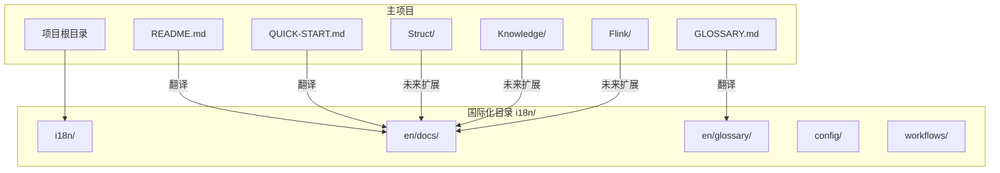
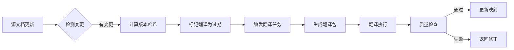

# AnalysisDataFlow 国际化(i18n)架构设计

> **版本**: v1.0 | **日期**: 2026-04-04 | **状态**: 设计完成

---

## 1. 架构概述

### 1.1 设计目标

```
┌─────────────────────────────────────────────────────────────────┐
│                    i18n 架构设计目标                              │
├─────────────────────────────────────────────────────────────────┤
│  ✅ 支持多语言内容并行维护                                         │
│  ✅ 保持源文档与翻译版本的同步追踪                                  │
│  ✅ 提供术语一致性保证                                            │
│  ✅ 支持自动化翻译工作流                                          │
│  ✅ 最小化对现有文档结构的侵入                                     │
└─────────────────────────────────────────────────────────────────┘
```

### 1.2 核心原则

| 原则 | 说明 |
|------|------|
| **平行结构** | 翻译文档保持与源文档相同的目录结构 |
| **版本追踪** | 每个翻译文档记录源文档版本哈希 |
| **术语统一** | 中央术语表确保翻译一致性 |
| **渐进式** | 优先核心文档，逐步扩展 |
| **自动化** | 翻译状态检测、过期提醒自动化 |

---

## 2. 目录结构设计

```
i18n/
├── README.md                    # i18n 系统说明
├── I18N-ARCHITECTURE.md         # 本架构文档
├── config/
│   ├── i18n.json               # 主配置文件
│   ├── languages.json          # 支持语言列表
│   └── mapping.json            # 文档映射关系
├── en/                         # 英语内容 (目标语言)
│   ├── docs/                   # 翻译文档
│   │   ├── README.md
│   │   ├── QUICK-START.md
│   │   └── ...
│   └── glossary/
│       └── GLOSSARY-EN.md      # 英文术语表
├── zh/                         # 中文内容 (源语言)
│   └── (指向根目录的符号链接)
├── workflows/
│   ├── translation-pipeline.yml    # 翻译工作流
│   └── sync-check.yml             # 同步检查工作流
└── scripts/
    └── (与 .scripts/translate_workflow.py 关联)
```

### 2.1 与主项目的关系



---

## 3. 配置系统

### 3.1 主配置文件 (config/i18n.json)

```json
{
  "project": {
    "name": "AnalysisDataFlow",
    "version": "3.3.0",
    "source_language": "zh",
    "default_language": "zh"
  },
  "languages": {
    "zh": {
      "name": "中文",
      "native_name": "简体中文",
      "code": "zh-CN",
      "rtl": false,
      "completeness": 100
    },
    "en": {
      "name": "English",
      "native_name": "English",
      "code": "en-US",
      "rtl": false,
      "completeness": 15
    }
  },
  "translation": {
    "priority_docs": [
      "README.md",
      "QUICK-START.md",
      "GLOSSARY.md",
      "CONTRIBUTING.md"
    ],
    "excluded_patterns": [
      "*.draft.md",
      "*.archived.md",
      "reports/*",
      "*.log"
    ],
    "term_consistency": {
      "enabled": true,
      "strict_mode": false,
      "glossary_file": "glossary/core-terms.json"
    }
  },
  "sync": {
    "check_interval": "daily",
    "auto_notify": true,
    "outdated_threshold_days": 7
  }
}
```

### 3.2 文档映射配置 (config/mapping.json)

```json
{
  "mappings": [
    {
      "source": "README.md",
      "translations": {
        "en": "i18n/en/docs/README.md"
      },
      "version_hash": "a1b2c3d4",
      "last_sync": "2026-04-04T10:00:00Z"
    },
    {
      "source": "QUICK-START.md",
      "translations": {
        "en": "i18n/en/docs/QUICK-START.md"
      },
      "version_hash": "e5f6g7h8",
      "last_sync": "2026-04-04T10:00:00Z"
    }
  ]
}
```

---

## 4. 翻译文档格式规范

### 4.1 头部元数据

每个翻译文档必须包含 YAML frontmatter：

```yaml
---
title: "AnalysisDataFlow - Unified Stream Computing Knowledge Base"
source_file: "README.md"
source_version: "a1b2c3d4e5f6g7h8"
translation_status: "completed"
completion_percentage: 100
language: "en"
last_sync: "2026-04-04T10:00:00Z"
translator: "AI-Assisted"
reviewer: ""
---
```

### 4.2 状态定义

| 状态 | 值 | 说明 |
|------|-----|------|
| 未开始 | `not_started` | 翻译尚未开始 |
| 进行中 | `in_progress` | 翻译正在进行 |
| 待审核 | `pending_review` | 翻译完成，等待审核 |
| 已完成 | `completed` | 翻译并审核完成 |
| 已过期 | `outdated` | 源文档已更新，翻译需要同步 |

---

## 5. 术语管理

### 5.1 术语表结构

```json
{
  "version": "1.0",
  "last_updated": "2026-04-04",
  "terms": [
    {
      "id": "term-001",
      "chinese": "流计算",
      "english": "Stream Computing",
      "abbreviation": "",
      "definition": "Processing of continuous, unbounded data streams",
      "domain": "core",
      "variants": ["Stream Processing"]
    },
    {
      "id": "term-002",
      "chinese": "检查点",
      "english": "Checkpoint",
      "abbreviation": "CP",
      "definition": "Global consistent snapshot for fault recovery",
      "domain": "flink",
      "variants": []
    }
  ]
}
```

### 5.2 术语一致性检查

```python
# 伪代码示例
def check_term_consistency(doc_content, target_lang):
    issues = []
    for term in glossary.terms:
        if term.chinese in doc_content:
            expected = term.english if target_lang == 'en' else term.chinese
            # 检查是否正确翻译
            if not check_translation_presence(doc_content, term, target_lang):
                issues.append(TermIssue(term, expected))
    return issues
```

---

## 6. 自动化工作流

### 6.1 翻译流水线



### 6.2 同步检查流程

```yaml
# workflows/sync-check.yml 概要
name: i18n Sync Check
on:
  push:
    paths:
      - '*.md'
      - 'Struct/**/*.md'
      - 'Knowledge/**/*.md'
      - 'Flink/**/*.md'
  schedule:
    - cron: '0 0 * * *'  # 每日检查

jobs:
  check:
    steps:
      - 检测源文档变更
      - 对比翻译版本
      - 生成过期报告
      - 创建同步任务
```

---

## 7. 实施路线图

### 7.1 阶段划分

| 阶段 | 时间 | 目标 | 交付物 |
|------|------|------|--------|
| P3-1 | Week 1 | 架构搭建 | i18n/目录结构、配置文件 |
| P3-2 | Week 2 | 术语表 | GLOSSARY-EN.md |
| P3-3 | Week 3-4 | 核心文档 | README-EN.md, QUICK-START-EN.md |
| P3-4 | Week 5-6 | 自动化 | translate_workflow.py |
| v3.4 | Q3 2026 | 扩展 | Struct/, Knowledge/, Flink/ 关键文档 |
| v4.0 | Q1 2027 | 完整版 | 全文档双语支持 |

### 7.2 优先级文档列表

```
P0 (立即):
├── README.md
├── QUICK-START.md
└── GLOSSARY.md

P1 (近期):
├── CONTRIBUTING.md
├── AGENTS.md
└── LEARNING-PATH-GUIDE.md

P2 (中期):
├── Struct/00-INDEX.md
├── Knowledge/00-INDEX.md
└── Flink/00-INDEX.md

P3 (长期):
├── 全部文档按目录逐步翻译
└── tutorials/ 系列
```

---

## 8. 工具集成

### 8.1 与现有脚本集成

| 脚本 | 集成方式 | 功能 |
|------|----------|------|
| i18n-manager.py | 扩展 | 管理翻译状态和进度 |
| translate_workflow.py | 新建 | 自动化翻译流程 |
| build_search_index.py | 新建 | 多语言搜索索引 |
| quality-gates | 扩展 | 翻译质量门禁 |

### 8.2 CLI 命令

```bash
# 查看翻译统计
python .scripts/i18n-manager.py stats

# 提取待翻译内容
python .scripts/i18n-manager.py extract --lang en

# 检查术语一致性
python .scripts/i18n-manager.py check-terms --lang en

# 触发翻译工作流
python .scripts/translate_workflow.py --target en --priority-docs
```

---

## 9. 质量保证

### 9.1 检查项

- [ ] 所有翻译文档包含正确的 YAML frontmatter
- [ ] 术语使用符合 GLOSSARY-EN.md 规范
- [ ] 链接在翻译版本中正确指向
- [ ] Mermaid 图表语法保持正确
- [ ] 代码示例保持原样（不翻译代码）

### 9.2 自动化检查

```yaml
quality_gates:
  translation:
    - frontmatter_validation
    - term_consistency_check
    - link_validation
    - mermaid_syntax_check
  thresholds:
    min_completion: 95
    max_term_violations: 0
```

---

## 10. 参考

- [i18n-manager.py](../.scripts/i18n-manager.py) - 国际化管理工具
- [translate_workflow.py](../.scripts/translate_workflow.py) - 翻译工作流
- [GLOSSARY.md](../GLOSSARY.md) - 英文术语表
- [README.md](../README.md) - 英文版项目说明

---

*本文档遵循 AnalysisDataFlow 六段式模板规范*
