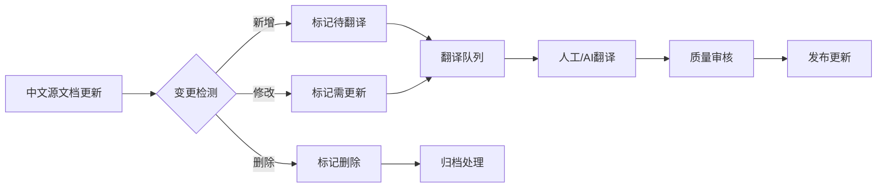
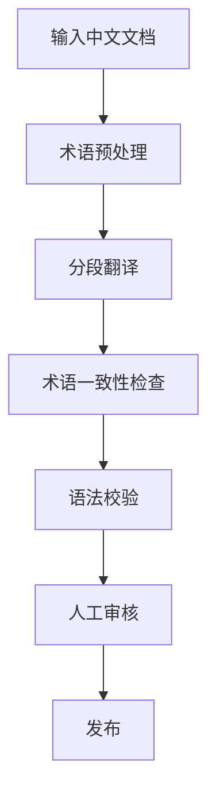

# 国际化 (i18n) 架构设计文档

> 所属阶段: Infrastructure | 前置依赖: [项目规范](../AGENTS.md) | 形式化等级: L3

## 1. 概述

本文档定义 AnalysisDataFlow 项目的国际化架构，支持多语言内容管理和同步机制。

## 2. 目录结构

```
i18n/
├── README.md                    # i18n 使用指南
├── i18n-architecture.md         # 本文档 - 架构设计
├── terminology-glossary.csv     # 术语翻译对照表
├── translation-guide.md         # 翻译规范指南
├── sync-workflow.md             # 同步工作流
│
├── en/                          # 英文内容
│   ├── 00-INDEX.md
│   ├── README.md
│   └── struct/                  # Struct 核心理论文档
│       ├── 01-unified-streaming-theory.md
│       ├── 02-process-calculus-primer.md
│       └── ...
│
├── zh/                          # 中文内容 (源语言)
│   └── (链接到根目录文档)
│
└── config/
    ├── i18n-config.json         # 国际化配置
    └── locale-meta.json         # 语言元数据
```

## 3. 翻译策略

### 3.1 首批翻译文档 (15篇Struct核心理论 + README)

| 序号 | 文档路径 | 优先级 | 状态 |
|------|----------|--------|------|
| 1 | README.md | P0 | 🔄 进行中 |
| 2 | Struct/00-INDEX.md | P0 | ⏳ 待翻译 |
| 3 | Struct/01-foundation/01.01-unified-streaming-theory.md | P0 | ⏳ 待翻译 |
| 4 | Struct/01-foundation/01.02-process-calculus-primer.md | P0 | ⏳ 待翻译 |
| 5 | Struct/01-foundation/01.03-actor-model-formalization.md | P0 | ⏳ 待翻译 |
| 6 | Struct/01-foundation/01.04-dataflow-model-formalization.md | P0 | ⏳ 待翻译 |
| 7 | Struct/02-properties/02.01-determinism-in-streaming.md | P1 | ⏳ 待翻译 |
| 8 | Struct/02-properties/02.02-consistency-hierarchy.md | P1 | ⏳ 待翻译 |
| 9 | Struct/02-properties/02.03-watermark-monotonicity.md | P1 | ⏳ 待翻译 |
| 10 | Struct/03-relationships/03.01-actor-to-csp-encoding.md | P1 | ⏳ 待翻译 |
| 11 | Struct/04-proofs/04.01-flink-checkpoint-correctness.md | P1 | ⏳ 待翻译 |
| 12 | Struct/04-proofs/04.02-flink-exactly-once-correctness.md | P1 | ⏳ 待翻译 |
| 13 | Struct/05-comparative-analysis/05.01-go-vs-scala-expressiveness.md | P2 | ⏳ 待翻译 |
| 14 | Struct/07-tools/smart-casual-verification.md | P2 | ⏳ 待翻译 |
| 15 | Struct/07-tools/tla-for-flink.md | P2 | ⏳ 待翻译 |
| 16 | QUICK-START.md | P1 | ⏳ 待翻译 |

### 3.2 翻译优先级定义

- **P0**: 核心基础，必须首先翻译
- **P1**: 重要内容，建议早期翻译
- **P2**: 扩展内容，可后期补充
- **P3**: 参考内容，按需翻译

## 4. 多语言版本同步机制

### 4.1 同步工作流



### 4.2 版本标记系统

每篇翻译文档必须包含元数据头：

```markdown
---
source: ../Struct/01-foundation/01.01-unified-streaming-theory.md
source_version: v2.8
source_hash: a1b2c3d4
translated_at: 2026-04-04
translator: ai-assisted
status: draft|review|published
language: en
---
```

### 4.3 变更检测规则

| 检测方式 | 说明 | 触发条件 |
|----------|------|----------|
| 哈希比对 | 源文件内容哈希 | 内容变化 |
| 版本标签 | Git标签或文档版本 | 显式版本更新 |
| 时间戳 | 文件修改时间 | 定期扫描 |

## 5. 术语管理

### 5.1 术语表格式

见 `terminology-glossary.csv`：

```csv
term_en,term_zh,category,definition,context,notes
Unified Streaming Theory,统一流理论,Concept,形式化流计算理论框架,Struct/01-foundation,
Watermark,水位线,Mechanism,时间进度标记,Timestamp management,
```

### 5.2 术语翻译原则

1. **优先直译**: 技术术语优先使用直译
2. **保留原文**: 首次出现保留英文原文，如 "Checkpoint (检查点)"
3. **一致性**: 全文术语翻译保持一致
4. **文化适配**: 必要时进行文化适配，但保持技术准确性

## 6. AI辅助翻译流程

### 6.1 翻译流水线



### 6.2 质量门禁

- **术语检查**: 自动验证术语使用一致性
- **链接检查**: 验证跨语言链接有效性
- **格式检查**: 确保符合项目六段式模板

## 7. 工具集成

### 7.1 翻译工具

| 工具 | 用途 | 集成方式 |
|------|------|----------|
| GitHub Copilot | AI辅助翻译 | VS Code插件 |
| OpenAI API | 批量翻译 | Python脚本 |
| DeepL API | 专业翻译 | API调用 |

### 7.2 自动化脚本

```bash
# 检测需要更新的翻译
python scripts/i18n/check-translation-status.py

# 批量翻译
python scripts/i18n/batch-translate.py --source Struct/01-foundation/ --target en/

# 验证翻译完整性
python scripts/i18n/validate-translations.py
```

## 8. 发布与部署

### 8.1 多语言站点结构

```
https://docs.analysisdataflow.io/
├── /              # 默认语言 (中文)
├── /en/           # 英文版
├── /zh/           # 中文版
└── /api/i18n/     # i18n API端点
```

### 8.2 语言切换机制

- URL路径前缀: `/en/docs/...`
- Cookie/LocalStorage 存储语言偏好
- 自动检测浏览器语言

## 9. 维护与治理

### 9.1 翻译贡献流程

1. Fork 项目
2. 创建翻译分支: `i18n/en-{document-name}`
3. 遵循翻译规范
4. 提交 PR，标注 `i18n` 标签
5. 通过质量审核后合并

### 9.2 翻译质量指标

| 指标 | 目标值 | 测量方式 |
|------|--------|----------|
| 术语一致性 | ≥95% | 自动检查 |
| 翻译覆盖率 | 100% (P0/P1) | 文档统计 |
| 审核通过率 | ≥90% | PR统计 |
| 更新延迟 | ≤7天 | 时间追踪 |

## 10. 参考

- [W3C i18n指南](https://www.w3.org/standards/webdesign/i18n)
- [GitHub i18n最佳实践](https://docs.github.com/en/get-started/writing-on-github)
- [Apache项目i18n规范](https://www.apache.org/dev/i18n.html)
