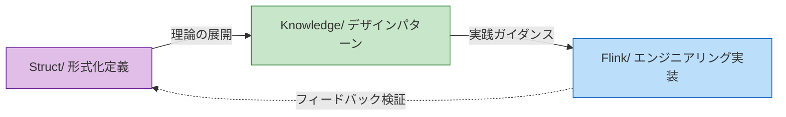
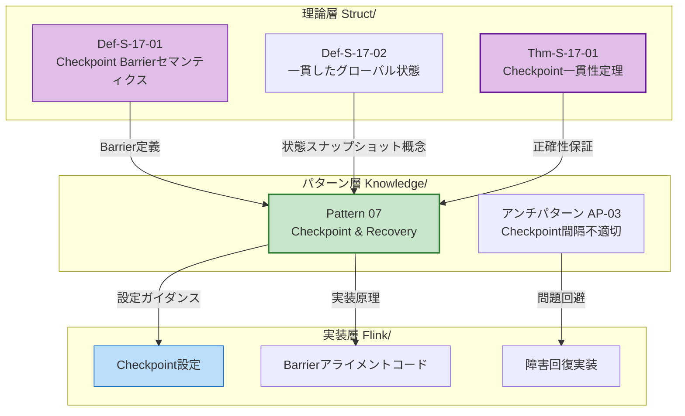

# AnalysisDataFlow クイックスタートガイド

> **5分でプロジェクトを理解 | ロール別カスタムパス | クイック問題インデックス**
>
> 📊 **254 ドキュメント | 945 形式化要素 | 100% 完成度**

---

## 1. 5分間クイック理解

### 1.1 プロジェクトとは何か

**AnalysisDataFlow** はストリームコンピューティング分野の**統一ナレッジベース**——形式化理論からエンジニアリング実践までのフルスタック知識体系です。

```
┌─────────────────────────────────────────────────────────────┐
│                    知識階層ピラミッド                        │
├─────────────────────────────────────────────────────────────┤
│  L6 生産実装  │  Flink/ コード、設定、ケース (116篇)         │
├───────────────┼─────────────────────────────────────────────┤
│  L4-L5 パターン │  Knowledge/ デザインパターン、技術選定     │
├───────────────┼─────────────────────────────────────────────┤
│  L1-L3 理論   │  Struct/ 定理、証明、形式化定義 (43篇)       │
└───────────────┴─────────────────────────────────────────────┘
```

**コアバリュー**：

- 🔬 **理論的裏付け**: 形式化定理がエンジニアリング決定の正確性を保証
- 🛠️ **実践ガイダンス**: 定理からコードへの完全なマッピングパス
- 🔍 **問題診断**: 症状別にソリューションを迅速に特定

---

### 1.2 3大ディレクトリ構造

| ディレクトリ | ポジショニング | コンテンツ特徴 | 対象者 |
|--------------|--------------|----------------|--------|
| **Struct/** | 形式理論基盤 | 数学的定義、定理証明、厳密な論証 | 研究者、アーキテクト |
| **Knowledge/** | エンジニアリング実践知識 | デザインパターン、ビジネスシナリオ、技術選定 | アーキテクト、エンジニア |
| **Flink/** | Flink 専門技術 | アーキテクチャメカニズム、SQL/API、エンジニアリング実践 | 開発エンジニア |

**知識フロー関係**：



---

### 1.3 コア特徴

#### 6セクションドキュメントテンプレート（強制構造）

各コアドキュメントには以下が含まれている必要があります：

| セクション | コンテンツ | 例 |
|------------|------------|-----|
| 1. 概念定義 | 厳密な形式化定義 + 直感的説明 | `Def-S-04-04` Watermarkセマンティクス |
| 2. 性質導出 | 定義から導出される補題と性質 | `Lemma-S-04-02` 単調性補題 |
| 3. 関係構築 | 他の概念/モデルとの関連 | Flink→プロセス計算エンコーディング |
| 4. 論証過程 | 補助定理、反例分析 | 境界条件の議論 |
| 5. 形式証明 | 主要定理の完全な証明 | `Thm-S-17-01` Checkpoint一貫性 |
| 6. 実例検証 | 簡略化された例、コードスニペット | Flink設定例 |
| 7. 可視化 | Mermaid図表 | アーキテクチャ図、フローチャート |
| 8. 引用参考 | 権威ある情報源の引用 | VLDB/SOSP論文 |

#### 定理番号体系

グローバル統一番号：`{タイプ}-{ステージ}-{ドキュメント番号}-{順番}`

| 番号例 | 意味 | 位置 |
|--------|------|------|
| `Thm-S-17-01` | Structステージ, 17番ドキュメント, 第1定理 | Checkpoint正確性証明 |
| `Def-K-02-01` | Knowledgeステージ, 02番ドキュメント, 第1定義 | Event Time Processingパターン |
| `Thm-F-12-01` | Flinkステージ, 12番ドキュメント, 第1定理 | オンライン学習パラメータ収束性 |

**クイック記憶法**：

- **Thm** = Theorem（定理）| **Def** = Definition（定義）| **Lemma** = 補題 | **Prop** = 命題
- **S** = Struct（理論）| **K** = Knowledge（知識）| **F** = Flink（実装）

---

## 2. ロール別読書パス

### 2.1 アーキテクトパス（3-5日）

**目標**：システム設計方法論を習得し、技術選定とアーキテクチャ決定を行う

```
Day 1-2: 概念基盤構築
├── Struct/01-foundation/01.01-unified-streaming-theory.md
│   └── 重点：6層表現能力階層（L1-L6）
├── Knowledge/01-concept-atlas/concurrency-paradigms-matrix.md
│   └── 重点：5大並行パラダイム比較マトリックス
└── Knowledge/01-concept-atlas/streaming-models-mindmap.md
    └── 重点：ストリームコンピューティングモデル6次元比較

Day 3-4: パターンと選定
├── Knowledge/02-design-patterns/ (全て閲覧)
│   └── 重点：7大コアパターンの関係図
├── Knowledge/04-technology-selection/engine-selection-guide.md
│   └── 重点：ストリーム処理エンジン選定決定木
└── Knowledge/04-technology-selection/streaming-database-guide.md
    └── 重点：ストリームデータベース比較マトリックス

Day 5: アーキテクチャ決定
├── Flink/01-architecture/flink-1.x-vs-2.0-comparison.md
│   └── 重点：アーキテクチャ進化と移行決定
└── Struct/03-relationships/03.03-expressiveness-hierarchy.md
    └── 重点：表現能力とエンジニアリング制約
```

---

### 2.2 開発エンジニアパス（1-2週間）

**目標**：Flinkコア技術を習得し、生産レベルのストリーム処理アプリケーションを開発できる

```
Week 1: クイックスタート
├── Day 1: Flink/05-vs-competitors/flink-vs-spark-streaming.md
│   └── Flinkポジショニングと強み
├── Day 2-3: Flink/02-core/time-semantics-and-watermark.md
│   └── イベント時間、Watermarkメカニズム
├── Day 4: Knowledge/02-design-patterns/pattern-event-time-processing.md
│   └── イベント時間処理パターン
└── Day 5: Flink/04-connectors/kafka-integration-patterns.md
    └── Kafka統合ベストプラクティス

Week 2: コアメカニズム深層
├── Day 1-2: Flink/02-core/checkpoint-mechanism-deep-dive.md
│   └── Checkpointメカニズム、障害回復
├── Day 3: Flink/02-core/exactly-once-end-to-end.md
│   └── Exactly-Once実装原理
├── Day 4: Flink/02-core/backpressure-and-flow-control.md
│   └── バックプレッシャー処理とフロー制御
└── Day 5: Flink/06-engineering/performance-tuning-guide.md
    └── パフォーマンスチューニング実戦
```

---

### 2.3 研究者パス（2-4週間）

**目標**：理論基盤を理解し、形式化方法を習得し、イノベーティブな研究を展開できる

```
Week 1-2: 理論基盤
├── Struct/01-foundation/01.02-process-calculus-primer.md
│   └── CCS/CSP/π-計算基礎
├── Struct/01-foundation/01.04-dataflow-model-formalization.md
│   └── Dataflow厳密形式化
├── Struct/01-foundation/01.03-actor-model-formalization.md
│   └── Actorモデル形式セマンティクス
└── Struct/02-properties/02.03-watermark-monotonicity.md
    └── Watermark単調性定理

Week 3: モデル関係とエンコーディング
├── Struct/03-relationships/03.01-actor-to-csp-encoding.md
│   └── Actor→CSPエンコーディング保持性
├── Struct/03-relationships/03.02-flink-to-process-calculus.md
│   └── Flink→プロセス計算エンコーディング
└── Struct/03-relationships/03.03-expressiveness-hierarchy.md
    └── 6層表現能力階層定理

Week 4: 形式証明と最先端
├── Struct/04-proofs/04.01-flink-checkpoint-correctness.md
│   └── Checkpoint一貫性証明
├── Struct/04-proofs/04.02-flink-exactly-once-correctness.md
│   └── Exactly-Once正確性証明
└── Struct/06-frontier/06.02-choreographic-streaming-programming.md
    └── Choreographicプログラミング最先端
```

---

### 2.4 学生パス（1-2ヶ月）

**目標**：体系的な知識体系を段階的に構築し、初心者から熟練者へ

```
Month 1: 基盤構築
├── Week 1: 並行計算モデル
│   ├── Struct/01-foundation/01.02-process-calculus-primer.md
│   ├── Struct/01-foundation/01.03-actor-model-formalization.md
│   └── Struct/01-foundation/01.05-csp-formalization.md
├── Week 2: ストリームコンピューティング基礎
│   ├── Struct/01-foundation/01.04-dataflow-model-formalization.md
│   ├── Knowledge/01-concept-atlas/streaming-models-mindmap.md
│   └── Flink/02-core/time-semantics-and-watermark.md
├── Week 3: コア性質
│   ├── Struct/02-properties/02.01-determinism-in-streaming.md
│   ├── Struct/02-properties/02.02-consistency-hierarchy.md
│   └── Knowledge/02-design-patterns/pattern-event-time-processing.md
└── Week 4: パターンビジネス
    ├── Knowledge/02-design-patterns/ (全て)
    └── Knowledge/03-business-patterns/ (選択読書)

Month 2: 深層と拡張
├── Week 5-6: Flinkエンジニアリング実践
│   ├── Flink/02-core/ (全コアドキュメント)
│   └── Flink/06-engineering/performance-tuning-guide.md
├── Week 7: 形式証明入門
│   ├── Struct/04-proofs/04.01-flink-checkpoint-correctness.md
│   └── Struct/04-proofs/04.03-chandy-lamport-consistency.md
└── Week 8: 最先端探索
    ├── Knowledge/06-frontier/streaming-databases.md
    └── Knowledge/06-frontier/rust-streaming-ecosystem.md
```

---

## 3. クイック検索インデックス

### 3.1 トピック別インデックス

#### ストリーム処理基礎

| トピック | 必読ドキュメント | 形式化基盤 |
|----------|------------------|------------|
| **イベント時間処理** | Knowledge/02-design-patterns/pattern-event-time-processing.md | `Def-S-04-04` Watermarkセマンティクス |
| **ウィンドウ計算** | Knowledge/02-design-patterns/pattern-windowed-aggregation.md | `Def-S-04-05` ウィンドウオペレーター |
| **状態管理** | Knowledge/02-design-patterns/pattern-stateful-computation.md | `Thm-S-17-01` Checkpoint一貫性 |
| **Checkpoint** | Knowledge/02-design-patterns/pattern-checkpoint-recovery.md | `Thm-S-18-01` Exactly-Once正確性 |
| **一貫性レベル** | Struct/02-properties/02.02-consistency-hierarchy.md | `Def-S-08-01~04` AM/AL/EOセマンティクス |

#### デザインパターン

| パターン | 適用シナリオ | 複雑度 | ドキュメント |
|----------|--------------|--------|--------------|
| P01 Event Time | 乱順データ処理 | ★★★☆☆ | pattern-event-time-processing.md |
| P02 Windowed Aggregation | ウィンドウ集計計算 | ★★☆☆☆ | pattern-windowed-aggregation.md |
| P03 CEP | 複雑イベントマッチング | ★★★★☆ | pattern-cep-complex-event.md |
| P04 Async I/O | 外部データ関連付け | ★★★☆☆ | pattern-async-io-enrichment.md |
| P05 State Management | ステートフル計算 | ★★★★☆ | pattern-stateful-computation.md |
| P06 Side Output | データ分流 | ★★☆☆☆ | pattern-side-output.md |
| P07 Checkpoint | 障害耐性 | ★★★★★ | pattern-checkpoint-recovery.md |

#### 最先端技術

| 技術方向 | コアドキュメント | 技術スタック |
|----------|------------------|--------------|
| **ストリームデータベース** | Knowledge/06-frontier/streaming-databases.md | RisingWave, Materialize |
| **Rustストリームエコシステム** | Knowledge/06-frontier/rust-streaming-ecosystem.md | Arroyo, Timeplus |
| **リアルタイムRAG** | Knowledge/06-frontier/real-time-rag-architecture.md | Flink + ベクトルデータベース |
| **Streaming Lakehouse** | Knowledge/06-frontier/streaming-lakehouse-iceberg-delta.md | Flink + Iceberg/Paimon |
| **エッジストリーム処理** | Knowledge/06-frontier/edge-streaming-patterns.md | エッジコンピューティングアーキテクチャ |
| **ストリーム物化ビュー** | Knowledge/06-frontier/streaming-materialized-view-architecture.md | リアルタイムデータウェアハウス |

---

### 3.2 問題別インデックス

#### Checkpoint関連問題

| 問題症状 | ソリューション | 参考ドキュメント |
|----------|----------------|------------------|
| Checkpoint頻繁タイムアウト | 増分Checkpoint有効化、RocksDB使用 | checkpoint-mechanism-deep-dive.md |
| アライメント時間過長 | Unaligned Checkpoint有効化、Debloating調整 | checkpoint-mechanism-deep-dive.md |
| 回復遅延 | ローカル回復、増分回復 | checkpoint-mechanism-deep-dive.md |
| 状態サイズ過大 | 増分Checkpoint、状態TTL | flink-state-ttl-best-practices.md |

#### バックプレッシャー処理

| 問題症状 | ソリューション | 参考ドキュメント |
|----------|----------------|------------------|
| バックプレッシャー重大 | Credit-basedフロー制御チューニング、並列度増加 | backpressure-and-flow-control.md |
| Sourceバックプレッシャー | 下流処理が遅い、並列度追加または最適化が必要 | performance-tuning-guide.md |
| Sinkバックプレッシャー | バッチ最適化、非同期書き込み | performance-tuning-guide.md |

#### データスキュー

| 問題症状 | ソリューション | 参考ドキュメント |
|----------|----------------|------------------|
| ホットKey | ソルティング、2段階集計、カスタムパーティショナー | performance-tuning-guide.md |
| ウィンドウスキュー | カスタムウィンドウアサイナー、遅延許容 | pattern-windowed-aggregation.md |

#### Exactly-Once問題

| 問題症状 | ソリューション | 参考ドキュメント |
|----------|----------------|------------------|
| データ重複 | Sink冪等性チェック、2PC設定 | exactly-once-end-to-end.md |
| データ損失 | Source再実行可能性チェック、Checkpoint間隔 | exactly-once-end-to-end.md |

---

### 3.3 よく使うドキュメントクイックリンク

#### コアインデックスページ

| インデックス | 用途 | パス |
|--------------|------|------|
| **プロジェクト概要** | 全体のプロジェクト構造を理解 | [README.md](../../README.md) |
| **Structインデックス** | 形式化理論ナビゲーション | [Struct/00-INDEX.md](../../Struct/00-INDEX.md) |
| **Knowledgeインデックス** | エンジニアリング実践知識ナビゲーション | [Knowledge/00-INDEX.md](../../Knowledge/00-INDEX.md) |
| **Flinkインデックス** | Flink専門技術ナビゲーション | [Flink/00-INDEX.md](../../Flink/00-INDEX.md) |
| **定理登録表** | 形式化要素グローバルインデックス | [THEOREM-REGISTRY.md](../../THEOREM-REGISTRY.md) |
| **進捗追跡** | プロジェクト進捗と統計 | [PROJECT-TRACKING.md](../../PROJECT-TRACKING.md) |

#### クイック決定参考

| 決定タイプ | 参考ドキュメント |
|------------|------------------|
| ストリーム処理エンジン選定 | Knowledge/04-technology-selection/engine-selection-guide.md |
| Flink vs Spark選定 | Flink/05-vs-competitors/flink-vs-spark-streaming.md |
| Flink vs RisingWave選定 | Knowledge/04-technology-selection/flink-vs-risingwave.md |
| SQL vs DataStream API | Flink/03-sql-table-api/sql-vs-datastream-comparison.md |
| 状態バックエンド選定 | Flink/06-engineering/state-backend-selection.md |
| ストリームデータベース選定 | Knowledge/04-technology-selection/streaming-database-guide.md |

#### 生産障害トラブルシューティング

| 障害タイプ | トラブルシューティングドキュメント |
|------------|-----------------------------------|
| Checkpoint問題 | Flink/02-core/checkpoint-mechanism-deep-dive.md |
| バックプレッシャー問題 | Flink/02-core/backpressure-and-flow-control.md |
| パフォーマンスチューニング | Flink/06-engineering/performance-tuning-guide.md |
| メモリオーバーフロー | Flink/06-engineering/performance-tuning-guide.md |
| Exactly-Once失効 | Flink/02-core/exactly-once-end-to-end.md |

---

## 4. 例：理論から実践へ

### 知識フロー例：Checkpoint一貫性



### 完全な知識リンク

```
┌─────────────────────────────────────────────────────────────────────┐
│                        Checkpoint知識リンク                          │
├─────────────────────────────────────────────────────────────────────┤
│                                                                     │
│  1. 形式化定義 (Struct/)                                            │
│     Def-S-17-01: Checkpoint Barrier セマンティクス                 │
│     Def-S-17-02: 一貫したグローバル状態 G = <𝒮, 𝒞>                  │
│     Def-S-17-03: Checkpoint アライメント定義                        │
│                                                                     │
│           ↓ 定理保証                                                │
│                                                                     │
│  2. 形式化証明 (Struct/)                                            │
│     Thm-S-17-01: Flink Checkpoint一貫性定理                         │
│     Lemma-S-17-01: Barrier伝播不変式                               │
│     Lemma-S-17-02: 状態一貫性補題                                   │
│                                                                     │
│           ↓ パターン抽出                                            │
│                                                                     │
│  3. デザインパターン (Knowledge/)                                   │
│     Pattern 07: Checkpoint & Recovery パターン                      │
│     - Checkpoint間隔選択ガイド                                      │
│     - 状態バックエンド選定マトリックス                              │
│     - 回復戦略決定木                                                │
│                                                                     │
│           ↓ エンジニアリング実装                                    │
│                                                                     │
│  4. Flink実装 (Flink/)                                              │
│     - Checkpoint設定パラメータ                                      │
│     - RocksDB状態バックエンド設定                                   │
│     - 増分Checkpoint有効化                                          │
│     - Unaligned Checkpoint設定                                      │
│                                                                     │
│           ↓ 生産検証                                                │
│                                                                     │
│  5. 障害診断                                                        │
│     - Checkpointタイムアウト診断                                    │
│     - アライメント時間過長処理                                      │
│     - アンチパターンチェックリスト                                  │
│                                                                     │
└─────────────────────────────────────────────────────────────────────┘
```

### コードマッピング例

**定理** `Thm-S-17-01`: Barrierアライメントが一貫したカットセットを保証

↓ マッピング

**パターン** Pattern 07: Checkpoint間隔 = max(処理遅延許容, 状態サイズ/帯域)

↓ マッピング

**Flink設定**:

```yaml
# flink-conf.yaml
execution.checkpointing.interval: 10s      # 定理に基づいて計算
execution.checkpointing.timeout: 60s       # 状態サイズ/帯域 + 余裕
execution.checkpointing.mode: EXACTLY_ONCE # Thm-S-17-01保証
state.backend: rocksdb                     # 大状態シナリオ
state.backend.incremental: true            # 転送最適化
```

---

## 5. よくある質問クイック検索

### 5.1 特定のトピックを検索する方法

**方法1：インデックスナビゲーション**

1. まず [Struct/00-INDEX.md](../../Struct/00-INDEX.md) で理論基盤を確認
2. 次に [Knowledge/00-INDEX.md](../../Knowledge/00-INDEX.md) でデザインパターンを確認
3. 最後に [Flink/00-INDEX.md](../../Flink/00-INDEX.md) でエンジニアリング実装を確認

**方法2：定理番号追跡**

1. [THEOREM-REGISTRY.md](../../THEOREM-REGISTRY.md) で定理番号を検索
2. 番号に基づいてドキュメントを特定（例：`Thm-S-17-01` → Struct/04-proofs/04.01）
3. 関連する定義と補題をクロスリファレンス

**方法3：問題駆動**

1. 第3.2節「問題別インデックス」を参照
2. 症状にマッチするソリューションを選択
3. 推奨ドキュメントを詳細に読む

---

### 5.2 定理番号の理解方法

**番号形式**：`{タイプ}-{ステージ}-{ドキュメント番号}-{順番}`

| コンポーネント | 値 | 意味 |
|----------------|-----|------|
| タイプ | Thm/Def/Lemma/Prop/Cor | 定理/定義/補題/命題/推論 |
| ステージ | S/K/F | Struct/Knowledge/Flink |
| ドキュメント番号 | 01-99 | ディレクトリ内のドキュメント番号 |
| 順番 | 01-99 | ドキュメント内の要素順番 |

**例の解析**：

- `Thm-S-17-01`: Structステージ04-proofsディレクトリ17番目のドキュメントの第1定理 → Checkpoint一貫性定理
- `Def-K-02-01`: Knowledgeステージ02-design-patternsディレクトリの第1定義 → Event Time Processingパターン
- `Lemma-F-12-02`: Flinkステージ12-ai-mlディレクトリの第2補題 → オンライン学習関連補題

---

### 5.3 コンテンツに貢献する方法

**貢献原則**：

1. **6セクションテンプレートに従う**：概念定義 → 性質導出 → 関係構築 → 論証過程 → 形式証明 → 実例検証
2. **統一された番号付けを使用**：新しい定理/定義はルールに従って番号付け、競合を回避
3. **クロスディレクトリ参照を保持**：Struct定義 → Knowledgeパターン → Flink実装
4. **Mermaid図表を追加**：各ドキュメントに少なくとも1つの可視化を含める

**貢献フロー**：

1. [PROJECT-TRACKING.md](../../PROJECT-TRACKING.md) でプロジェクトステータスを確認
2. [AGENTS.md](../../AGENTS.md) でコーディング規約を確認
3. 対応ディレクトリにドキュメントを作成し、命名規約に従う：`{層号}.{番号}-{トピック}.md`
4. 関連インデックスファイル（00-INDEX.md）を更新
5. 定理登録表（THEOREM-REGISTRY.md）を更新

**品質ゲート**：

- 引用は検証可能であること（優先：DOIまたは安定したURL）
- Mermaid図構文は検証を通過する必要がある
- コード例は実行可能であること
- 形式化定義は数学的に厳密であること

---

## 付録：クイックリファレンス

### 6層表現能力階層

```
L₆: Turing-Complete (完全に決定不能) ── λ-calculus, Turing Machine
L₅: Higher-Order (大部分が決定不能) ── HOπ, Ambient
L₄: Mobile (一部が決定不能) ── π-calculus, Actor
L₃: Process Algebra (EXPTIME) ── CSP, CCS
L₂: Context-Free (PSPACE) ── PDA, BPA
L₁: Regular (P-Complete) ── FSM, Regex
```

### 一貫性レベルクイックリファレンス

| レベル | 定義 | 実装メカニズム | 適用シナリオ |
|--------|------|----------------|--------------|
| At-Most-Once (AM) | 効果カウント ≤ 1 | 重複排除/冪等 | ログ集約、モニタリング |
| At-Least-Once (AL) | 効果カウント ≥ 1 | リトライ/再実行 | 推薦システム、統計 |
| Exactly-Once (EO) | 効果カウント = 1 | Source+Checkpoint+トランザクションSink | 金融取引、注文 |

### コアドキュメントクイックリファレンス

| シナリオ | 第一エントリ | 第二エントリ | 第三エントリ |
|----------|--------------|--------------|--------------|
| 理論入門 | Struct/01-foundation/01.01 | Struct/01-foundation/01.02 | Struct/00-INDEX |
| Flink入門 | Flink/05-vs-competitors/flink-vs-spark | Flink/02-core/time-semantics | Flink/00-INDEX |
| パターン学習 | Knowledge/02-design-patterns/pattern-event-time | Knowledge/00-INDEX | シナリオに応じて選択読書 |
| 問題診断 | 第3.2節問題別インデックス | Flink/00-INDEX障害診断 | アンチパターンチェックリスト |
| 最先端技術 | Knowledge/06-frontier/ | PROJECT-TRACKING.md | 興味に応じて選択読書 |

---

> 📌 **ヒント**：本ドキュメントはクイックスタートガイドです。詳細な内容は各ディレクトリのインデックスと具体的なドキュメントを参照してください。
>
> 📅 **最終更新**：2026-04-03 | 📝 **バージョン**：v1.0

---

> **翻訳者注記**：本ドキュメントは日本の技術文書スタイルに従って翻訳されています。形式化表記、定理番号、コード例は原文と同一です。最終更新: 2026-04-11

