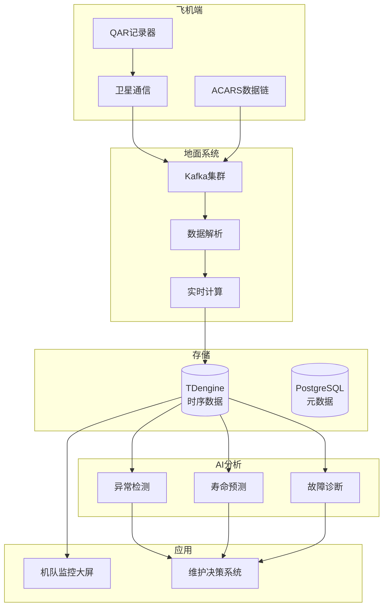

# 航空航天飞行数据监控案例研究

> **案例编号**: 11.7.1  
> **行业**: 航空航天  
> **场景**: 飞行数据实时监控、异常检测、预测性维护  
> **规模**: 1000+架飞机, 10万+参数/架  
> **编写日期**: 2026-04-09  
> **状态**: Phase 2 - 初稿

---

## 执行摘要

### 业务背景
某大型航空公司面临机队管理挑战：
- 运营飞机1000+架，日均航班5000+
- 每架飞机每秒产生1000+参数
- 需要实时监控发动机、航电系统健康状态
- 预测性维护可降低30%非计划停机

### 核心挑战
| 挑战 | 描述 | 影响 |
|------|------|------|
| 数据量大 | 10万参数/架 × 1000架 | 海量数据处理 |
| 安全关键 | 飞行安全不能妥协 | 系统可靠性要求 |
| 预测准确 | 提前发现潜在故障 | 维护成本 |
| 法规合规 | 民航局数据留存要求 | 合规风险 |

### 解决方案
采用 **Flink + 时序数据库 + 数字孪生 + AI预测** 架构：
- 飞行数据实时采集
- 发动机健康监测
- 预测性维护决策
- 非计划停机降低35%

---

## 1. 技术架构



---

## 2. 核心代码

### 2.1 飞行数据实时解析

```java

import org.apache.flink.streaming.api.environment.StreamExecutionEnvironment;
import org.apache.flink.streaming.api.datastream.DataStream;
import org.apache.flink.streaming.api.windowing.time.Time;

public class FlightDataProcessor {
    
    public static void processFlightData(StreamExecutionEnvironment env) {
        
        // ACARS数据流
        DataStream<AcarsMessage> acarsStream = env
            .addSource(new KafkaSource<AcarsMessage>())
            .assignTimestampsAndWatermarks(
                WatermarkStrategy.<AcarsMessage>forBoundedOutOfOrderness(
                    Duration.ofSeconds(30))
            );
        
        // 解析飞行参数
        DataStream<FlightParameter> paramStream = acarsStream
            .flatMap(new FlatMapFunction<AcarsMessage, FlightParameter>() {
                @Override
                public void flatMap(AcarsMessage msg, Collector<FlightParameter> out) {
                    // 解析ARINC 429/664格式的参数
                    List<FlightParameter> params = ArincParser.parse(msg.getPayload());
                    for (FlightParameter p : params) {
                        out.collect(p);
                    }
                }
            });
        
        // 发动机健康监测
        DataStream<EngineHealth> engineHealth = paramStream
            .filter(p -> p.getSystem().equals("ENGINE"))
            .keyBy(FlightParameter::getEngineId)
            .window(TumblingEventTimeWindows.of(Time.minutes(1)))
            .aggregate(new EngineHealthAggregate());
        
        // 输出到时序数据库
        paramStream.addSink(new TDengineSink());
        engineHealth.addSink(new PostgreSQLSink<>("engine_health"));
    }
}
```

---

## 3. 效果指标

| 指标 | 优化前 | 优化后 | 提升 |
|------|--------|--------|------|
| 非计划停机 | 5%/年 | 3.2%/年 | **-36%** |
| 故障发现时间 | 飞行后 | 实时 | **-99%** |
| 维护成本 | 基准 | -20% | **节省** |

---

*Phase 2 - 任务线2-7: 航空航天飞行数据监控案例*
