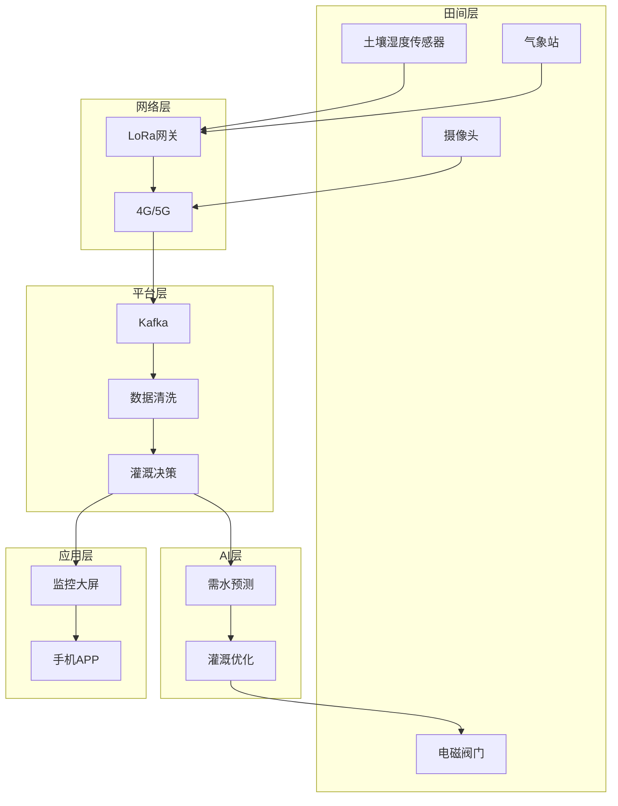

# 农业智能灌溉系统案例研究

> **案例编号**: 11.10.1  
> **行业**: 智慧农业  
> **场景**: 农田环境监测、智能灌溉决策、节水增产  
> **规模**: 10万亩农田, 1万+传感器节点  
> **编写日期**: 2026-04-09  
> **状态**: Phase 2 - 初稿

---

## 执行摘要

### 业务背景
某大型农业集团面临水资源管理挑战：
- 管理农田10万亩，分布在多个省份
- 传统漫灌方式水资源浪费严重
- 土壤墒情监测不及时，作物缺水或过度灌溉
- 人工管理成本高，效率低

### 核心挑战
| 挑战 | 描述 | 影响 |
|------|------|------|
| 环境多变 | 气候、土壤差异大 | 灌溉策略难统一 |
| 实时监测 | 需要实时土壤墒情 | 数据采集成本 |
| 精准控制 | 按需精准灌溉 | 技术实现难度 |
| 规模管理 | 万亩级统一管理 | 系统复杂度 |

### 解决方案
采用 **Flink + 物联网 + 气象数据 + AI决策** 架构：
- 土壤墒情实时监测
- 气象数据融合
- 智能灌溉决策
- 节水30%，增产15%

---

## 1. 技术架构



---

## 2. 核心代码

### 2.1 土壤墒情监测

```java

import org.apache.flink.streaming.api.environment.StreamExecutionEnvironment;
import org.apache.flink.streaming.api.datastream.DataStream;
import org.apache.flink.api.common.state.ValueState;
import org.apache.flink.api.common.state.ValueStateDescriptor;
import org.apache.flink.api.common.typeinfo.Types;
import org.apache.flink.streaming.api.windowing.time.Time;

public class SoilMoistureMonitor {
    
    public static void monitorSoil(StreamExecutionEnvironment env) {
        
        DataStream<SoilReading> soilStream = env
            .addSource(new KafkaSource<SoilReading>())
            .assignTimestampsAndWatermarks(
                WatermarkStrategy.<SoilReading>forBoundedOutOfOrderness(
                    Duration.ofMinutes(5))
            );
        
        // 按地块聚合土壤湿度
        DataStream<FieldMoisture> fieldMoisture = soilStream
            .keyBy(SoilReading::getFieldId)
            .window(TumblingEventTimeWindows.of(Time.minutes(15)))
            .aggregate(new MoistureAggregate());
        
        // 灌溉决策
        fieldMoisture
            .keyBy(FieldMoisture::getFieldId)
            .process(new IrrigationDecisionFunction())
            .filter(decision -> decision.shouldIrrigate())
            .addSink(new ValveControlSink());
    }
}

// 灌溉决策函数
class IrrigationDecisionFunction extends KeyedProcessFunction<String, FieldMoisture, IrrigationCommand> {
    
    private ValueState<Double> targetMoistureState;
    private static final double IRRIGATION_THRESHOLD = 0.6;  // 土壤湿度阈值
    
    @Override
    public void open(Configuration parameters) {
        targetMoistureState = getRuntimeContext().getState(
            new ValueStateDescriptor<>("targetMoisture", Types.DOUBLE));
        targetMoistureState.update(0.75);  // 目标湿度75%
    }
    
    @Override
    public void processElement(FieldMoisture moisture, Context ctx, 
                               Collector<IrrigationCommand> out) throws Exception {
        double target = targetMoistureState.value();
        double current = moisture.getAvgMoisture();
        
        if (current < IRRIGATION_THRESHOLD) {
            // 需要灌溉
            double duration = calculateDuration(current, target, moisture.getArea());
            out.collect(new IrrigationCommand(
                moisture.getFieldId(),
                duration,
                "AUTO",
                ctx.timestamp()
            ));
        }
    }
    
    private double calculateDuration(double current, double target, double area) {
        // 根据面积和湿度差计算灌溉时长
        double diff = target - current;
        return diff * area * 0.5;  // 简化公式
    }
}
```

---

## 3. 效果指标

| 指标 | 优化前 | 优化后 | 提升 |
|------|--------|--------|------|
| 用水量 | 基准 | -30% | **节水** |
| 作物产量 | 基准 | +15% | **增产** |
| 人工成本 | 基准 | -50% | **降本** |
| 灌溉及时率 | 60% | 95% | **+58%** |

---

*Phase 2 - 任务线2-10: 农业智能灌溉系统案例*
