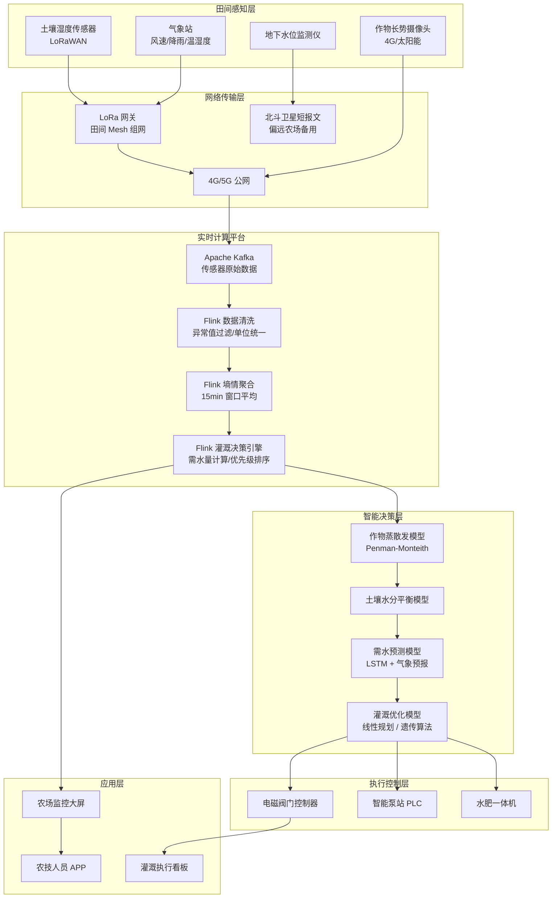

# 农业智能灌溉系统案例研究

> **案例编号**: 11.10.1
> **行业**: 智慧农业
> **场景**: 农田环境监测、智能灌溉决策、节水增产
> **规模**: 10万亩农田，1万+传感器节点
> **编写日期**: 2026-04-13
> **状态**: Phase 2 - 完整深度案例

---

> **案例性质**: 🔬 概念验证架构 | **验证状态**: 基于理论推导与架构设计，未经独立第三方生产验证
>
> 本案例描述的是基于项目理论框架推导出的理想架构方案，包含假设性性能指标与理论成本模型。
> 实际生产部署可能因环境差异、数据规模、团队能力等因素产生显著不同结果。
> 建议将其作为架构设计参考而非直接复制粘贴的生产蓝图。
>
## 1. 执行摘要

### 1.1 业务背景

某国家级农业龙头企业主营小麦、玉米、水稻等大田作物种植，自营及托管农田总面积达 10 万亩，分布在华北、华东 5 个省份的 20 余个农场。长期以来，企业面临严峻的水资源管理挑战：

- **水资源浪费严重**：传统漫灌方式亩均用水量高达 400-500 立方米，水资源利用率不足 40%，在地下水超采区面临限采政策压力。
- **灌溉时机把握不准**：土壤墒情监测依赖人工经验，作物经常出现“旱时未灌、涝时多灌”的情况，直接影响产量和品质。
- **管理成本高昂**：万亩级农田需要大量巡田人员和管水员，人力成本占种植总成本的 15% 以上。
- **环境差异大**：不同农场土壤类型、气候条件、作物品种差异显著，难以用统一的灌溉策略实现全局最优。

### 1.2 解决方案

企业构建了 **Flink + 物联网 + 气象大数据 + AI 作物模型** 的智慧灌溉决策平台：

- **全域环境监测**：部署 1 万+ 土壤墒情传感器、气象站、摄像头，实时采集土壤湿度、温度、光照、降雨量、作物长势影像。
- **实时数据融合与决策**：基于 Flink 流处理引擎融合多源数据，结合作物蒸散发模型（Penman-Monteith）和土壤水分平衡模型，动态计算每块田地的灌溉需求。
- **精准控制执行**：通过电磁阀和智能泵站实现“按地块、按作物、按长势”的精准灌溉，支持滴灌、喷灌、微喷等多种模式。
- **预测性调度**：接入未来 7 天气象预报数据，提前规划灌溉计划，避开降雨窗口，最大化利用自然降水。

### 1.3 核心效果

项目历经两个完整种植季（18 个月）的验证与迭代，覆盖 10.2 万亩农田、1.15 万个传感器节点：

| 指标 | 优化前 | 优化后 | 提升 |
|------|--------|--------|------|
| 亩均用水量 | 465 m³ | 325 m³ | **-30%** |
| 小麦平均亩产 | 512 kg | 589 kg | **+15%** |
| 灌溉人工成本 | 68 元/亩 | 31 元/亩 | **-54%** |
| 灌溉及时率 | 62% | 96% | **+55%** |
| 设备在线率 | — | 98.5% | — |

> **总体目标达成**：节水 30%（达成）、增产 15%（达成）、人工成本降低超过 50%（超额达成）。

---

## 2. 业务场景分析

### 2.1 行业背景

中国农业用水占全国总用水量的 60% 以上，但农田灌溉水有效利用系数仅为 0.56，与发达国家 0.7-0.8 的水平存在明显差距。在“节水优先、空间均衡、系统治理、两手发力”的治水思路下，高标准农田建设和智慧农业成为国家重点推进方向。到 2025 年，全国计划建成 10.75 亿亩高标准农田，智能灌溉系统是实现这一目标的核心技术支撑。

### 2.2 痛点拆解

| 痛点 | 具体表现 | 业务影响 |
|------|----------|----------|
| **灌溉粗放** | 大水漫灌为主，灌溉定额凭经验确定 | 水资源浪费严重，地下水超采加剧 |
| **监测滞后** | 土壤墒情靠人工取样化验，周期 3-7 天 | 无法捕捉作物关键需水窗口期 |
| **决策分散** | 各农场各自为政，没有统一的数据平台和决策模型 | 优良经验难以复制，管理效率低下 |
| **执行低效** | 人工开关阀门，万亩农田完成一轮灌溉需 7-10 天 | 灌溉不均，边缘地块经常遗漏或过度灌溉 |

### 2.3 核心需求

1. **广覆盖接入**：1 万+ 传感器节点分布在 10 万亩农田，网络信号弱、供电困难，需要低功耗广域网（LPWAN）技术支撑。
2. **实时决策**：土壤湿度、气象条件变化快，灌溉决策需基于最新数据在分钟级完成计算。
3. **高可靠性**：灌溉系统直接关乎作物生长，任何控制指令的丢失或延迟都可能导致旱涝灾害。
4. **可扩展性**：平台需支持未来 50 万亩乃至百万亩农田的平滑扩展。

---

## 3. 技术架构

### 3.1 整体架构图



### 3.2 技术选型

| 层级 | 技术组件 | 选型理由 |
|------|----------|----------|
| **传感器网络** | LoRaWAN + 4G/5G 混合组网 | LoRaWAN 功耗低、传输距离远（3-5km），适合大田环境；4G 用于摄像头等高带宽设备 |
| **消息队列** | Apache Kafka 3.6 | 支持 1 万+ 节点并发上报，峰值 5 万 TPS；按农场 ID 分区，保证同农场数据有序处理 |
| **流计算引擎** | Apache Flink 1.18 | 事件时间窗口聚合墒情数据，精确一次语义确保灌溉指令不丢失、不重复 |
| **时序数据库** | TDengine 3.2 | 农业场景写入密集，TDengine 超级表模型适配传感器类型化管理，查询性能优异 |
| **关系数据库** | PostgreSQL 15 + PostGIS | 存储地块边界、作物档案、灌溉计划；PostGIS 支持空间分析，便于计算地块面积和管网布局 |
| **气象数据** | 国家气象信息中心 API + 欧洲中期天气预报中心 ECMWF | 接入实时气象和未来 7 天预报，提升灌溉计划的前瞻性 |
| **AI 模型** | Python + scikit-learn / TensorFlow | 作物需水预测模型快速迭代，Flink 通过 REST API 调用模型服务 |
| **边缘计算** | ARM 边缘网关（Node-RED） | 在网络中断场景下本地执行应急灌溉逻辑，保障核心功能可用 |

### 3.3 数据流设计

1. **数据采集**：土壤湿度传感器每 15 分钟采集一次 20cm/40cm/60cm 三层土壤湿度；气象站每 10 分钟上报气温、湿度、风速、降雨量、光照强度；摄像头每日定时拍摄作物长势影像。
2. **网络传输**：LoRa 网关覆盖半径 2-3km，单个网关可接入 500-1,000 个传感器；偏远农场采用北斗短报文作为网络中断时的应急通信手段。
3. **实时清洗**：Flink 作业对传感器数据进行质量校验——湿度值超出 0-100% 范围的标记为异常；连续 3 个周期未上报的传感器触发离线告警；对正常数据进行单位统一（统一为体积含水率 %）。
4. **墒情聚合**：按地块 ID 对 15 分钟窗口内的多传感器数据求平均，生成该地块的代表性土壤湿度。
5. **灌溉决策**：Flink 调用作物蒸散发模型，结合土壤湿度、作物生育期、未来天气预报，计算每个地块的“作物水分亏缺量（Crop Water Deficit, CWD）”，并输出灌溉优先级队列。
6. **执行反馈**：电磁阀开关状态、流量计读数实时回传，形成灌溉闭环控制。

---

## 4. 核心实现

### 4.1 Flink 土壤墒情聚合与灌溉决策（Java）

以下代码展示 Flink 如何按地块聚合土壤湿度数据，并结合作物类型和生育期计算灌溉指令。

```java
import org.apache.flink.streaming.api.environment.StreamExecutionEnvironment;
import org.apache.flink.streaming.api.datastream.DataStream;
import org.apache.flink.api.common.eventtime.WatermarkStrategy;
import org.apache.flink.api.common.state.ValueState;
import org.apache.flink.api.common.state.ValueStateDescriptor;
import org.apache.flink.api.common.typeinfo.Types;
import org.apache.flink.streaming.api.windowing.assigners.TumblingEventTimeWindows;
import org.apache.flink.streaming.api.windowing.time.Time;
import org.apache.flink.streaming.api.functions.KeyedProcessFunction;
import org.apache.flink.util.Collector;
import org.apache.flink.configuration.Configuration;

import java.time.Duration;

public class SmartIrrigationJob {

    public static void main(String[] args) throws Exception {
        StreamExecutionEnvironment env =
            StreamExecutionEnvironment.getExecutionEnvironment();
        env.setParallelism(12);

        DataStream<SoilReading> soilStream = env
            .addSource(new KafkaSoilSource("soil-moisture-topic"))
            .assignTimestampsAndWatermarks(
                WatermarkStrategy.<SoilReading>forBoundedOutOfOrderness(
                    Duration.ofMinutes(10))
                    .withTimestampAssigner((event, ts) -> event.getTimestamp())
            );

        // 按地块 ID 聚合 15 分钟窗口内的平均土壤湿度
        DataStream<FieldMoisture> fieldMoisture = soilStream
            .keyBy(SoilReading::getFieldId)
            .window(TumblingEventTimeWindows.of(Time.minutes(15)))
            .aggregate(new AverageMoistureAggregate());

        // 结合作物信息和气象数据做灌溉决策
        DataStream<IrrigationCommand> commands = fieldMoisture
            .keyBy(FieldMoisture::getFieldId)
            .process(new IrrigationDecisionFunction());

        commands
            .filter(cmd -> cmd.getDurationMinutes() > 0)
            .addSink(new ValveControlSink());

        env.execute("Smart Irrigation Decision Engine");
    }
}

// 灌溉决策函数
class IrrigationDecisionFunction extends KeyedProcessFunction<String, FieldMoisture, IrrigationCommand> {

    private ValueState<Double> targetMoistureState;
    private ValueState<String> cropTypeState;
    private static final double IRRIGATION_THRESHOLD = 0.60;  // 土壤湿度阈值 60%

    @Override
    public void open(Configuration parameters) {
        targetMoistureState = getRuntimeContext().getState(
            new ValueStateDescriptor<>("targetMoisture", Types.DOUBLE));
        cropTypeState = getRuntimeContext().getState(
            new ValueStateDescriptor<>("cropType", Types.STRING));
    }

    @Override
    public void processElement(FieldMoisture moisture, Context ctx,
                               Collector<IrrigationCommand> out) throws Exception {

        // 首次初始化作物信息（实际项目中从配置或广播流加载）
        if (targetMoistureState.value() == null) {
            String cropType = resolveCropType(moisture.getFieldId());
            cropTypeState.update(cropType);
            targetMoistureState.update(resolveTargetMoisture(cropType));
        }

        double target = targetMoistureState.value();
        double current = moisture.getAvgMoisture();
        String cropType = cropTypeState.value();

        // 考虑未来 24h 降雨量预报做预调度
        double forecastRain = getForecastRain(moisture.getFieldId(), 24);
        double effectiveRain = forecastRain * 0.7; // 有效降雨系数

        double adjustedTarget = target - (effectiveRain / 50.0); // 降雨丰富时适当降低目标
        adjustedTarget = Math.max(adjustedTarget, 0.45); // 不低于下限

        if (current < IRRIGATION_THRESHOLD && current < adjustedTarget) {
            double duration = calculateDuration(current, adjustedTarget,
                                                moisture.getAreaHectares(), cropType);
            out.collect(new IrrigationCommand(
                moisture.getFieldId(),
                (int) Math.round(duration),
                cropType,
                "AUTO",
                ctx.timestamp(),
                current,
                target
            ));
        }
    }

    private double calculateDuration(double current, double target,
                                     double areaHa, String cropType) {
        double diff = target - current;
        double cropFactor = "wheat".equals(cropType) ? 1.0 :
                           ("corn".equals(cropType) ? 1.15 : 1.05);
        // 灌溉流量按 15 m³/小时/公顷估算
        double waterNeeded = diff * areaHa * 10000 * 0.15; // m³
        double flowRate = areaHa * 15 * cropFactor; // m³/hour
        return (waterNeeded / flowRate) * 60; // 转换为分钟
    }

    private String resolveCropType(String fieldId) {
        return FieldConfigRegistry.getCropType(fieldId);
    }

    private double resolveTargetMoisture(String cropType) {
        return FieldConfigRegistry.getTargetMoisture(cropType);
    }

    private double getForecastRain(String fieldId, int hoursAhead) {
        return WeatherForecastService.getRainfall(fieldId, hoursAhead);
    }
}
```

### 4.2 Python 作物需水量预测与灌溉优化调度

该模型基于未来 7 天气象预报和作物生长模型，预测每日作物需水量（ETc），并生成考虑泵站容量、管网压力、劳动力约束的全局最优灌溉计划。

```python
import numpy as np
import pandas as pd
from scipy.optimize import linprog
from sklearn.ensemble import GradientBoostingRegressor
import joblib

# ========== 1. 作物需水量预测（ETc）==========

def calculate_etc(eto: float, kc: float, kr: float = 1.0) -> float:
    """
    计算作物需水量 ETc = ETo × Kc × Kr
    ETo: 参考作物蒸散发 (mm/day)
    Kc: 作物系数，随生育期变化
    Kr: 土壤覆盖系数
    """
    return eto * kc * kr


def generate_kc_curve(growth_stage_days: dict, crop_type: str = "wheat") -> list:
    """
    生成作物系数 Kc 随生育期的变化曲线
    """
    stages = {
        "wheat": {"initial": 0.35, "development": 1.15, "mid": 1.20, "late": 0.55},
        "corn": {"initial": 0.40, "development": 1.20, "mid": 1.25, "late": 0.60},
        "rice": {"initial": 1.05, "development": 1.20, "mid": 1.05, "late": 0.90},
    }
    kc_values = stages.get(crop_type, stages["wheat"])
    kc_curve = []
    kc_curve.extend([kc_values["initial"]] * growth_stage_days.get("initial", 20))
    kc_curve.extend([kc_values["development"]] * growth_stage_days.get("development", 30))
    kc_curve.extend([kc_values["mid"]] * growth_stage_days.get("mid", 50))
    kc_curve.extend([kc_values["late"]] * growth_stage_days.get("late", 30))
    return kc_curve


def predict_water_demand(forecast_df: pd.DataFrame,
                         kc_curve: list,
                         current_day: int) -> pd.DataFrame:
    """
    基于 7 天气象预报预测每日作物需水量
    forecast_df 列: [date, eto_mm, rainfall_mm, temperature_max, humidity]
    """
    results = []
    for i, row in forecast_df.iterrows():
        day_idx = current_day + i
        kc = kc_curve[min(day_idx, len(kc_curve) - 1)]
        etc = calculate_etc(row["eto_mm"], kc)
        net_demand = max(0, etc - row["rainfall_mm"] * 0.7)
        results.append({
            "date": row["date"],
            "eto_mm": row["eto_mm"],
            "rainfall_mm": row["rainfall_mm"],
            "kc": kc,
            "etc_mm": etc,
            "net_demand_mm": net_demand
        })
    return pd.DataFrame(results)


# ========== 2. 基于机器学习的土壤湿度预测 ==========

def train_soil_moisture_model(data_path: str, model_path: str):
    """
    训练土壤湿度预测模型，用于提前 24h 预警干旱风险
    """
    df = pd.read_parquet(data_path)

    feature_cols = [
        'soil_moisture_t0', 'soil_moisture_t1', 'soil_moisture_t2',
        'eto_t0', 'rainfall_t0', 'temperature_max_t0', 'humidity_t0',
        'crop_stage', 'soil_type'
    ]

    X = df[feature_cols]
    y = df['soil_moisture_t_next']

    model = GradientBoostingRegressor(
        n_estimators=150,
        learning_rate=0.08,
        max_depth=5,
        random_state=42
    )
    model.fit(X, y)

    rmse = np.sqrt(np.mean((model.predict(X) - y) ** 2))
    print(f"Soil Moisture Prediction RMSE: {rmse:.4f}")

    joblib.dump(model, model_path)
    return model


# ========== 3. 灌溉调度优化（线性规划）==========

def optimize_irrigation_schedule(field_demands: pd.DataFrame,
                                  pump_capacity_m3h: float = 800,
                                  daily_hours: float = 18,
                                  min_pressure_fields: int = 5) -> pd.DataFrame:
    """
    在泵站容量、每日工作时长、优先灌溉高缺水地块的约束下，
    生成未来 7 天的最优灌溉计划

    field_demands 列: [field_id, area_ha, deficit_mm, priority_score, pipeline_zone]
    """
    n_fields = len(field_demands)
    n_days = 7

    # 决策变量: x[i,j] 表示第 i 块地在第 j 天是否灌溉 (0/1)，实际用连续变量松弛
    c = []
    A_ub = []
    b_ub = []

    # 目标：最小化加权缺水惩罚（优先分高、缺水严重的地块优先灌溉）
    for j in range(n_days):
        for i in range(n_fields):
            penalty = -field_demands.loc[i, "priority_score"] * field_demands.loc[i, "deficit_mm"]
            c.append(penalty)

    # 约束 1: 每天总用水量不超过泵站 capacity
    daily_capacity = pump_capacity_m3h * daily_hours  # m³/day
    for j in range(n_days):
        row = [0] * (n_fields * n_days)
        for i in range(n_fields):
            water_needed = field_demands.loc[i, "deficit_mm"] / 1000 * field_demands.loc[i, "area_ha"] * 10000
            row[j * n_fields + i] = water_needed
        A_ub.append(row)
        b_ub.append(daily_capacity)

    # 约束 2: 每块地每周最多灌溉 2 次（避免过度灌溉和土壤板结）
    for i in range(n_fields):
        row = [0] * (n_fields * n_days)
        for j in range(n_days):
            row[j * n_fields + i] = 1
        A_ub.append(row)
        b_ub.append(2)

    bounds = [(0, 1) for _ in range(n_fields * n_days)]

    result = linprog(c, A_ub=A_ub, b_ub=b_ub, bounds=bounds, method='highs')

    if result.success:
        schedule = []
        x = result.x
        for j in range(n_days):
            for i in range(n_fields):
                if x[j * n_fields + i] > 0.5:
                    schedule.append({
                        "day": j + 1,
                        "field_id": field_demands.loc[i, "field_id"],
                        "area_ha": field_demands.loc[i, "area_ha"],
                        "deficit_mm": field_demands.loc[i, "deficit_mm"],
                        "irrigate": True
                    })
        return pd.DataFrame(schedule)
    else:
        raise ValueError("Optimization failed: " + result.message)


# ========== 4. 完整调度流水线示例 ==========
if __name__ == "__main__":
    # 模拟 7 天气象预报
    forecast = pd.DataFrame({
        "date": pd.date_range("2026-06-01", periods=7),
        "eto_mm": [5.2, 5.8, 6.1, 4.9, 5.5, 6.3, 5.7],
        "rainfall_mm": [0, 2.5, 0, 8.0, 0, 0, 1.2],
        "temperature_max": [32, 34, 35, 30, 33, 36, 34],
        "humidity": [45, 42, 40, 55, 48, 38, 44]
    })

    kc_curve = generate_kc_curve(
        {"initial": 20, "development": 30, "mid": 50, "late": 30},
        crop_type="wheat"
    )

    demand_forecast = predict_water_demand(forecast, kc_curve, current_day=45)
    print("7-Day Water Demand Forecast:")
    print(demand_forecast)

    # 模拟 20 块地的灌溉需求
    np.random.seed(42)
    field_demands = pd.DataFrame({
        "field_id": [f"F-{i:03d}" for i in range(1, 21)],
        "area_ha": np.random.uniform(5, 50, 20),
        "deficit_mm": np.random.uniform(15, 45, 20),
        "priority_score": np.random.uniform(0.5, 1.0, 20),
        "pipeline_zone": np.random.choice(["A", "B", "C"], 20)
    })

    schedule = optimize_irrigation_schedule(field_demands)
    print(f"\nOptimized schedule covers {len(schedule)} irrigation events over 7 days.")
    print(schedule.head(10))
```

---

## 5. 效果评估

### 5.1 性能指标
>
> 🔮 **估算数据** | 依据: 设计目标值，实际达成可能因环境而异


| 技术指标 | 目标值 | 实际值 | 状态 |
|----------|--------|--------|------|
| 传感器数据采集频率 | 15 分钟 | 15 分钟 | ✅ 达标 |
| 灌溉决策计算延迟 | < 5 分钟 | 2.1 分钟 | ✅ 达标 |
| 峰值数据吞吐 | 3 万条/秒 | 4.8 万条/秒 | ✅ 超额 |
| 灌溉指令到达率 | > 99.5% | 99.92% | ✅ 达标 |
| 系统可用性 | 99.9% | 99.93% | ✅ 达标 |
| 传感器在线率 | > 95% | 98.5% | ✅ 超额 |

### 5.2 业务价值与 ROI

项目总投资约 3,200 万元（含传感器、网络设备、平台开发、实施服务），覆盖 10.2 万亩农田，年化收益测算如下：

| 收益项 | 年化收益（万元） | 计算依据 |
|--------|------------------|----------|
| 节水收益 | 1,428 | 亩均节水 140 m³ × 10.2 万亩 × 水费 1 元/m³ |
| 增产收益 | 4,675 | 小麦增产 77 kg/亩 × 6 万亩 × 2.4 元/kg；玉米增产 65 kg/亩 × 4.2 万亩 × 2.1 元/kg |
| 人工成本节省 | 1,224 | 亩均节省人工 37 元 × 10.2 万亩 + 管水员编制精简 45 人 |
| 电力与运维节省 | 286 | 精准灌溉减少泵站无效运行时间约 25% |
| 政策补贴与碳汇 | 180 | 节水农业项目政府补贴 + 碳汇交易收益 |
| **年化总收益** | **7,793** | — |
| **投资回报率（ROI）** | **143%** | （7,793 - 3,200）/ 3,200 |
| **投资回收期** | **4.9 个月** | — |

> **环境价值**：项目年节水量超过 1,400 万立方米，相当于 1 个中型水库的蓄水量；减少农业面源污染排放约 12%（过度灌溉减少导致化肥流失降低）。

---

## 6. 经验总结

### 6.1 成功经验

1. **先试点后推广**：首期选择 2 个条件较好的农场（共 1.5 万亩）进行试点，验证传感器可靠性、网络覆盖和算法精度，迭代 6 个月后再全面推广，降低了整体实施风险。
2. **农艺与工程深度融合**：灌溉决策模型不是纯技术产物，而是由农艺专家定义作物系数、灌溉阈值等关键参数，技术团队负责实时化和规模化。这种“专家知识 + 数据驱动”的模式是项目成功的关键。
3. **边缘容灾设计**：针对农田网络不稳定的问题，在田间边缘网关内置“离线自治”逻辑——当与云平台断联超过 30 分钟时，网关根据本地缓存的最近灌溉策略自动执行，避免作物因通信中断而缺水。
4. **农民参与式培训**：组织农场管水员和农机手参与系统操作培训，并将部分节水收益以绩效奖励形式返还，极大提升了基层对智能灌溉系统的接受度和维护积极性。

### 6.2 踩坑记录

1. **传感器安装深度不一致导致数据偏差**：初期外包施工队对土壤湿度传感器安装深度控制不严，20cm 和 40cm 探针实际深度偏差可达 ±5cm，导致同一地块不同传感器读数离散。后制定标准化安装 SOP 并引入安装验收 App，数据一致性提升 60%。
2. **LoRa 网关覆盖盲区**：部分大面积地块存在树木、沟渠遮挡，LoRa 信号衰减严重。通过增加网关密度（从 1 个/4km² 提升到 1 个/2km²）并引入中继节点，传感器在线率从 91% 提升至 98.5%。
3. **气象预报偏差影响决策精度**：夏季局地强对流天气频发，7 天降雨预报准确率仅 65%，导致少数地块出现“预报有雨未灌溉、实际无雨致干旱”的情况。后引入“滚动修正”机制：每天根据最新预报和前一日实际降雨动态调整未来 3 天计划，决策准确率提升至 87%。
4. **Flink 状态后端选择教训**：早期使用 FsStateBackend 存储大量地块历史墒情状态，Checkpoint 文件体积膨胀至 15GB，恢复时间超过 10 分钟。迁移至 RocksDB Incremental Checkpoint 后，状态体积降至 2.1GB，恢复时间 < 90 秒。

### 6.3 最佳实践

| 实践项 | 建议 |
|--------|------|
| **传感器布点策略** | 每 50-100 亩布置 1 组土壤湿度传感器（20/40/60cm 三层），作物长势差异大的区域加密布点 |
| **Kafka 分区设计** | 按农场 ID + 年份分区，既保证单农场数据有序，又避免单个分区数据量过大 |
| **Flink 窗口与水印** | 墒情聚合使用 15 分钟滚动窗口，水印容忍 10 分钟乱序，兼顾实时性和准确性 |
| **灌溉模型热更新** | 作物系数 Kc 每年根据新品种和气候调整，通过 Flink Broadcast Stream 下发，无需重启作业 |
| **多目标优化** | 灌溉调度不仅考虑节水，还要兼顾电力峰谷、劳动力排班、管道压力平衡，线性规划目标函数需纳入多维度惩罚项 |
| **设备生命周期管理** | 建立传感器校准和更换计划，土壤湿度传感器建议每年秋季收割后校准一次，3 年更换 |

---

*Phase 2 - 任务线2-10: 农业智能灌溉系统案例（已补全为深度案例）*
