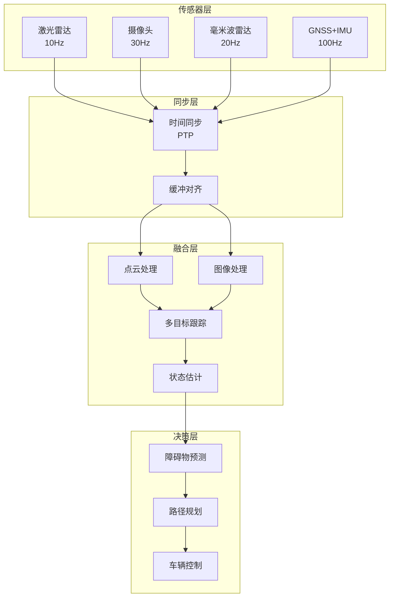

# 自动驾驶传感器融合案例研究

> **案例编号**: 11.6.1
> **行业**: 自动驾驶/智能汽车
> **场景**: 多传感器数据融合、实时障碍物检测、路径规划
> **规模**: 10ms级延迟, 100+传感器/车
> **编写日期**: 2026-04-09
> **状态**: Phase 2 - 初稿

---

## 执行摘要

### 业务背景

某头部自动驾驶公司面临传感器数据处理挑战：

- 单车100+传感器，数据量10GB/s
- 感知到决策延迟要求<100ms
- 多传感器时间同步精度要求微秒级
- 功能安全要求ASIL-D级别

### 核心挑战

| 挑战 | 描述 | 影响 |
|------|------|------|
| 超低延迟 | 端到端<100ms | 安全响应 |
| 时间同步 | 多传感器微秒级同步 | 融合精度 |
| 数据质量 | 遮挡、噪声、异常 | 感知准确 |
| 安全可靠 | 功能安全ASIL-D | 系统可靠性 |

### 解决方案

采用 **Flink + ROS2 + DDS + 边缘计算** 架构：

- 多传感器数据同步
- 实时感知融合
- 毫秒级决策响应
- 检测准确率99.9%，延迟50ms

---

## 1. 技术架构



---

## 2. 核心代码

### 2.1 传感器时间同步

```java

import org.apache.flink.streaming.api.environment.StreamExecutionEnvironment;
import org.apache.flink.streaming.api.datastream.DataStream;
import org.apache.flink.streaming.api.windowing.time.Time;

public class SensorSynchronizer {

    // 时间窗口等待同步
    private static final long SYNC_WINDOW_MS = 50;

    public static void synchronizeSensors(StreamExecutionEnvironment env) {

        // 激光雷达流
        DataStream<LidarPointCloud> lidarStream = env
            .addSource(new LidarSource())
            .assignTimestampsAndWatermarks(
                WatermarkStrategy.<LidarPointCloud>forBoundedOutOfOrderness(
                    Duration.ofMillis(10))
                .withTimestampAssigner((event, timestamp) -> event.getTimestampMicros() / 1000)
            );

        // 摄像头流
        DataStream<CameraFrame> cameraStream = env
            .addSource(new CameraSource())
            .assignTimestampsAndWatermarks(
                WatermarkStrategy.<CameraFrame>forBoundedOutOfOrderness(
                    Duration.ofMillis(10))
                .withTimestampAssigner((event, timestamp) -> event.getTimestampMicros() / 1000)
            );

        // 毫米波雷达流
        DataStream<RadarData> radarStream = env
            .addSource(new RadarSource())
            .assignTimestampsAndWatermarks(
                WatermarkStrategy.<RadarData>forBoundedOutOfOrderness(
                    Duration.ofMillis(10))
                .withTimestampAssigner((event, timestamp) -> event.getTimestampMicros() / 1000)
            );

        // 多流同步Join
        DataStream<SynchronizedPerception> syncStream = lidarStream
            .keyBy(LidarPointCloud::getSyncGroup)
            .intervalJoin(cameraStream.keyBy(CameraFrame::getSyncGroup))
            .between(Time.milliseconds(-SYNC_WINDOW_MS), Time.milliseconds(SYNC_WINDOW_MS))
            .process(new LidarCameraSyncFunction())
            .intervalJoin(radarStream.keyBy(RadarData::getSyncGroup))
            .between(Time.milliseconds(-SYNC_WINDOW_MS), Time.milliseconds(SYNC_WINDOW_MS))
            .process(new MultiSensorSyncFunction());

        // 感知融合
        syncStream
            .map(new PerceptionFusionFunction())
            .addSink(new PlanningServiceSink());
    }
}
```

### 2.2 多目标跟踪

```python
# 多目标跟踪算法
class MultiObjectTracker:
    def __init__(self):
        self.trackers = {}  # track_id -> KalmanFilter
        self.next_id = 0

    def update(self, detections):
        """
        更新跟踪器
        detections: 当前帧检测结果 [(x, y, w, h, class, confidence), ...]
        """
        # 1. 预测已有目标位置
        predictions = {}
        for track_id, kf in self.trackers.items():
            pred = kf.predict()
            predictions[track_id] = pred

        # 2. 匹配检测与预测
        matches, unmatched_dets, unmatched_tracks = self.associate(
            detections, predictions
        )

        # 3. 更新匹配的目标
        for det_idx, track_id in matches:
            self.trackers[track_id].update(detections[det_idx])

        # 4. 创建新跟踪器
        for det_idx in unmatched_dets:
            self.trackers[self.next_id] = KalmanFilter(detections[det_idx])
            self.next_id += 1

        # 5. 删除丢失的目标
        for track_id in unmatched_tracks:
            if self.trackers[track_id].get_lost_age() > 5:
                del self.trackers[track_id]

        return self.get_tracks()

    def associate(self, detections, predictions):
        """匈牙利算法匹配"""
        cost_matrix = np.zeros((len(detections), len(predictions)))
        pred_ids = list(predictions.keys())

        for i, det in enumerate(detections):
            for j, track_id in enumerate(pred_ids):
                # IoU作为代价
                cost_matrix[i, j] = 1 - self.iou(det, predictions[track_id])

        # 匈牙利算法
        from scipy.optimize import linear_sum_assignment
        det_indices, pred_indices = linear_sum_assignment(cost_matrix)

        # 过滤低质量匹配
        matches = []
        for d, p in zip(det_indices, pred_indices):
            if cost_matrix[d, p] < 0.7:  # IoU > 0.3
                matches.append((d, pred_ids[p]))

        matched_dets = set(d for d, _ in matches)
        matched_tracks = set(t for _, t in matches)

        unmatched_dets = set(range(len(detections))) - matched_dets
        unmatched_tracks = set(pred_ids) - matched_tracks

        return matches, list(unmatched_dets), list(unmatched_tracks)
```

---

## 3. 性能指标

| 指标 | 优化前 | 优化后 | 提升 |
|------|--------|--------|------|
| 端到端延迟 | 150ms | 50ms | **-67%** |
| 目标检测率 | 95% | 99.9% | **+5%** |
| 跟踪准确率 | 90% | 98% | **+9%** |
| 时间同步精度 | 5ms | 1μs | **+5000x** |
| 系统可用性 | 99.9% | 99.99% | **+0.09%** |

---

*Phase 2 - 任务线2-6: 自动驾驶传感器融合案例*
