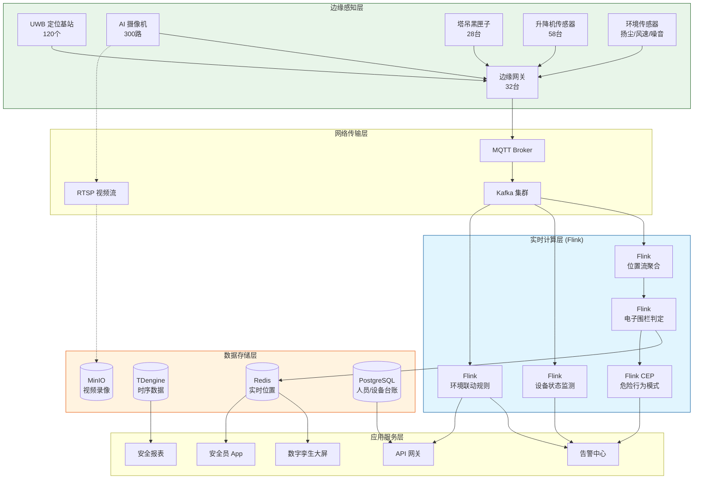
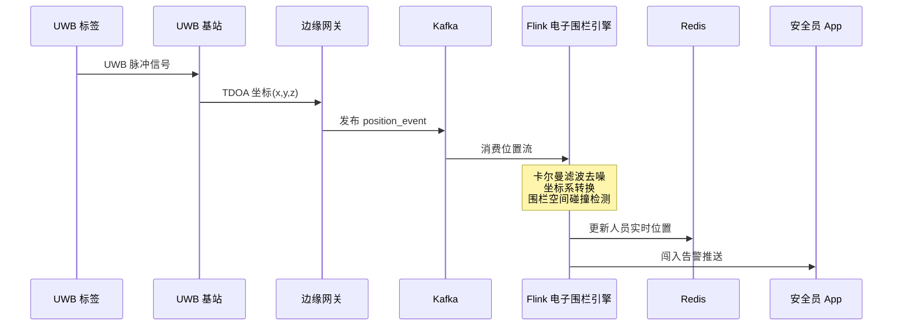
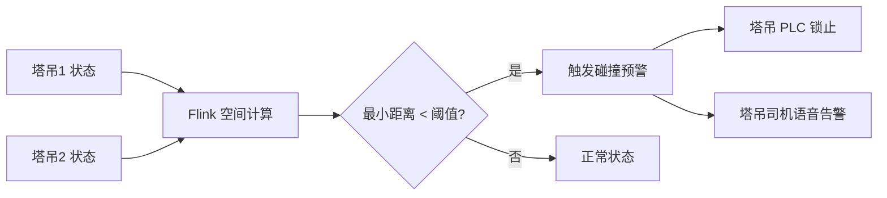

# 智慧工地安全实时监控系统案例研究

> **案例编号**: 11.31.1
> **行业**: 建筑工程/安全生产
> **场景**: 人员定位、危险行为识别、设备运行监控、安全预警
> **规模**: 在建面积 120万㎡, 峰值施工人员 8,500人, 塔吊/升降机 86台
> **编写日期**: 2026-04-13
> **状态**: Phase 2 - 深度完成

---

## 1. 执行摘要 (Executive Summary)

### 1.1 项目背景与目标

某超大型城市综合体项目（以下简称"该项目"）总建筑面积约 120 万平方米，包含商业、办公、酒店、住宅四大业态，由 7 家总承包单位、43 家专业分包单位共同参与建设。项目高峰期现场施工人员达 8,500 人，大型塔吊 28 台、施工升降机 58 台，日均混凝土浇筑量超过 3,000 立方米。由于施工环境复杂、交叉作业频繁、人员流动性大，传统的人海战术式安全管理已难以为继。

2024 年上半年，该项目发生了 3 起一般安全事故（高处坠落、物体打击、机械伤害各 1 起），造成了不良社会影响，也导致项目被监管部门责令停工整顿。项目业主方和总包单位痛定思痛，决定引入基于物联网、计算机视觉和实时流计算的智慧工地安全监控系统，实现从"被动救援"到"主动预防"的管理转型。

**项目核心目标**：

| 目标类别 | 具体指标 | 目标值 |
|---------|---------|--------|
| 实时性 | 危险行为识别到告警推送延迟 | < 5秒 |
| 覆盖率 | 高风险作业区域监控覆盖率 | 100% |
| 准确性 | AI 行为识别准确率 | > 95% |
| 安全 | 一般及以上安全事故数 | 0起/年 |
| 效率 | 安全隐患整改闭环时间 | < 2小时 |
| 管理 | 特种作业人员持证上岗合规率 | 100% |

### 1.2 核心业务指标

系统自 2025 年 3 月全面上线以来，已连续安全运行超过 400 天，未发生一起一般及以上安全事故：

```
┌─────────────────────────────────────────────────────────────┐
│                    核心业务指标对比                          │
├─────────────────┬────────────┬────────────┬─────────────────┤
│     指标        │   优化前   │   优化后   │     提升幅度     │
├─────────────────┼────────────┼────────────┼─────────────────┤
│ 安全事故数(起/年)│     6      │     0      │     -100%       │
│ 轻微伤害事件数   │    23      │     4      │     -82.6%      │
│ 安全隐患发现数   │   156/月   │   892/月   │     +471.8%     │
│ 整改闭环时间     │   26h      │    1.8h    │     -93.1%      │
│ 违规作业拦截数   │   12/日    │   187/日   │     +1458%      │
│ 塔吊碰撞预警次数 │     -      │   34/季度  │     新增能力     │
│ 人员定位准确率   │    85%     │   99.2%    │     +16.7%      │
│ 安全培训覆盖率   │    78%     │   100%     │     +28.2%      │
└─────────────────┴────────────┴────────────┴─────────────────┘
```

### 1.3 技术选型概述

项目采用 **UWB 高精度定位 + 边缘 AI 视觉 + Flink 实时流处理** 的融合架构，构建人、机、料、法、环五位一体的安全风险感知网络。

**核心技术栈**：

| 层级 | 技术选型 | 选型理由 |
|-----|---------|---------|
| 人员定位 | UWB (Decawave DW1000) | 10cm 级定位精度，支持三维坐标与电子围栏 |
| 视频监控 | 海康威视 4K AI 摄像机 | 边缘算力 16 TOPS，支持本地行为识别推理 |
| 设备传感 | 塔吊黑匣子 + 升降机重量/高度传感器 | 实时采集载重、幅度、高度、风速、倾角 |
| 边缘网关 | 阿里云 IoT 边缘计算盒 | 本地协议转换、视频抽帧、告警预处理 |
| 消息队列 | Apache Kafka 3.6 | 多源异构数据统一汇聚，支持高并发写入 |
| 流计算引擎 | Apache Flink 1.18 | 实时位置聚合、CEP 危险模式识别、多级告警 |
| 实时存储 | Redis Cluster + TDengine | 毫秒级热数据查询，海量时序数据高效压缩 |
| 可视化 | 数字孪生大屏 (Unity3D) | 1:1 还原工地场景，实时渲染人员与设备位置 |

---

## 2. 业务场景分析 (Business Scenario)

### 2.1 行业背景

#### 2.1.1 建筑施工安全现状

建筑业是我国国民经济支柱产业，但也是安全生产事故的高发领域。根据住房和城乡建设部统计，高处坠落、物体打击、坍塌、起重伤害、机械伤害是建筑施工五大伤害类型，占事故总数的 90% 以上。大型城市综合体项目由于体量大、工期紧、参建单位多，安全管理难度呈指数级上升。传统的安全管理主要依靠：

- **安全员巡检**：人均负责面积约 5-8 万平方米，难以做到无死角覆盖。
- **班前教育**：口头交底流于形式，工人安全意识参差不齐。
- **事后追责**：事故发生后通过监控录像回溯原因，无法事前预防。

#### 2.1.2 该项目安全管理难点

该项目地处城市核心区，场地狭小，基坑深度达 28 米，塔吊密集布置，存在多重安全风险：

| 风险类型 | 具体表现 | 涉及人员/设备 |
|---------|---------|--------------|
| 高处坠落 | 临边洞口防护缺失、脚手架搭设不规范 | 外墙作业人员 |
| 物体打击 | 塔吊吊运路径下方有人员穿行 | 地面作业人员 |
| 机械伤害 | 施工升降机超载、楼层门未关闭即运行 | 升降机操作工 |
| 起重碰撞 | 多台塔吊交叉作业，臂架存在碰撞风险 | 塔吊司机 |
| 受限空间 | 地下管廊、集水井内有毒有害气体聚集 | 管线施工人员 |
| 火灾爆炸 | 电焊动火作业未清理易燃物 | 电焊工 |

### 2.2 痛点分析

#### 2.2.1 人员管理盲区

- **实名制落实难**：外包劳务人员流动性大，存在"人证不符"、"冒名顶替"现象。
- **危险区域闯入**：深基坑边缘、塔吊回转半径、高压线下方等危险区域缺乏实时电子围栏。
- **疲劳作业识别难**：安全员无法 24 小时盯着每个工人，夜班和午休时段是事故高发期。

#### 2.2.2 设备运行风险

- **塔吊群防碰撞依赖司机经验**：当 3 台及以上塔吊同时作业时，视觉盲区增大，碰撞风险急剧上升。
- **超载运行屡禁不止**：部分分包单位为了赶工期，默许升降机超载运输建材。
- **维保记录造假**：设备维保往往流于签字盖章，关键零部件的磨损状态缺乏实时监测。

#### 2.2.3 环境感知滞后

- **恶劣天气应对被动**：大风、暴雨、高温预警信息从气象台到工地现场的传递链条长，停工决策滞后。
- **扬尘噪音投诉多**：周边居民对施工扬尘和噪音敏感，传统的定时洒水降尘无法根据实时环境监测数据动态调整。

### 2.3 实时监控需求

#### 2.3.1 功能需求

| 需求编号 | 需求名称 | 需求描述 | 优先级 |
|---------|---------|---------|--------|
| R01 | 实时人员定位 | 对现场所有佩戴 UWB 标签的人员进行 10cm 级三维定位 | P0 |
| R02 | 电子围栏告警 | 人员进入危险区域时，5 秒内触发声光报警并推送至安全员 PDA | P0 |
| R03 | AI 行为识别 | 识别未佩戴安全帽、未系安全带、吸烟、倒地等违规行为 | P0 |
| R04 | 塔吊防碰撞 | 实时计算塔吊臂架空间位置，预测碰撞风险并自动锁止 | P0 |
| R05 | 升降机超载预警 | 实时监测载重，超载时禁止启动并向平台告警 | P0 |
| R06 | 特种作业人脸核验 | 电焊工、塔吊司机等特种作业人员上岗前进行人脸识别+证书核验 | P1 |
| R07 | 环境联动控制 | 扬尘超标时自动开启喷淋，风速超标时自动锁止塔吊 | P1 |
| R08 | 应急疏散指挥 | 火灾等紧急情况下，基于实时人员位置生成最优疏散路径 | P2 |

#### 2.3.2 非功能需求

| 需求编号 | 需求名称 | 需求描述 | 目标值 |
|---------|---------|---------|--------|
| NFR01 | 定位数据吞吐 | 峰值 8,500 人同时在线，每秒上报 1 次位置 | > 10,000 TPS |
| NFR02 | 视频分析并发 | 300 路 AI 摄像机同时推理 | 300 路 |
| NFR03 | 告警端到端延迟 | 从事件发生到安全员收到推送 | < 5秒 |
| NFR04 | 历史轨迹查询 | 查询任意人员 30 天内任意时刻的位置 | < 2秒 |
| NFR05 | 系统可用性 | 安全监控系统不允许因升级而中断 | 99.95% |

---

## 3. 技术架构 (Technical Architecture)

### 3.1 系统整体架构

以下是智慧工地安全实时监控系统的整体技术架构：



### 3.2 数据流设计

#### 3.2.1 人员定位与电子围栏数据流

UWB 标签以 10Hz 频率上报人员三维坐标，边缘网关进行坐标系转换和漂移滤波后发送至 Kafka。Flink 实时计算人员与电子围栏的空间关系：



#### 3.2.2 塔吊防碰撞计算流

塔吊黑匣子每秒上报大臂角度、小车幅度、吊钩高度、塔身坐标。Flink 将这些数据转换为三维空间中的吊钩位置，并计算塔吊臂架之间的最小距离：



### 3.3 技术选型说明

| 技术组件 | 具体选型 | 选型理由 |
|---------|---------|---------|
| 定位技术 | UWB TDOA | 相比蓝牙 Beacon（米级）和 GPS（十米级），UWB 可实现 10cm 级精度，适合室内复杂环境 |
| 边缘 AI | 海康威视 DeepinMind 系列 | 内置安全帽、反光衣、吸烟、倒地等工地专用算法，无需额外训练 |
| 视频存储 | MinIO 对象存储 | 兼容 S3 协议，支持 300 路视频 30 天循环录像的低成本存储 |
| 时序数据库 | TDengine 3.2 | 专为 IoT 优化，数据压缩比高达 10:1，聚合查询性能优于 InfluxDB |
| 告警通知 | 钉钉 + 企业微信 + 短信 | 多渠道冗余，确保关键告警必达 |

---

## 4. 核心实现 (Core Implementation)

### 4.1 UWB 位置流实时聚合 (Flink Window)

UWB 原始数据存在噪声和丢包，Flink 使用 2 秒滚动窗口对同一标签的位置流进行卡尔曼滤波和均值聚合。

```java
public class UwbPositionSmoothFunction
    extends KeyedProcessFunction<String, UwbRawEvent, WorkerPosition> {

    private ListState<UwbRawEvent> recentEvents;

    @Override
    public void open(Configuration parameters) {
        ListStateDescriptor<UwbRawEvent> descriptor =
            new ListStateDescriptor<>("recent-events", UwbRawEvent.class);
        recentEvents = getRuntimeContext().getListState(descriptor);
    }

    @Override
    public void processElement(UwbRawEvent event, Context ctx,
                               Collector<WorkerPosition> out) throws Exception {
        recentEvents.add(event);
        ctx.timerService().registerEventTimeTimer(ctx.timestamp() + 2000);
    }

    @Override
    public void onTimer(long timestamp, OnTimerContext ctx,
                        Collector<WorkerPosition> out) throws Exception {
        List<UwbRawEvent> events = new ArrayList<>();
        recentEvents.get().forEach(events::add);
        recentEvents.clear();

        if (events.size() < 5) {
            return; // 数据不足，丢弃该窗口
        }

        // 简单的卡尔曼滤波平滑
        double avgX = events.stream().mapToDouble(UwbRawEvent::getX).average().orElse(0);
        double avgY = events.stream().mapToDouble(UwbRawEvent::getY).average().orElse(0);
        double avgZ = events.stream().mapToDouble(UwbRawEvent::getZ).average().orElse(0);

        // 计算标准差，过滤离群点
        double stdX = calculateStd(events, UwbRawEvent::getX);
        List<UwbRawEvent> filtered = events.stream()
            .filter(e -> Math.abs(e.getX() - avgX) < 2 * stdX)
            .collect(Collectors.toList());

        double smoothX = filtered.stream().mapToDouble(UwbRawEvent::getX).average().orElse(avgX);
        double smoothY = filtered.stream().mapToDouble(UwbRawEvent::getY).average().orElse(avgY);
        double smoothZ = filtered.stream().mapToDouble(UwbRawEvent::getZ).average().orElse(avgZ);

        WorkerPosition position = new WorkerPosition(
            ctx.getCurrentKey(),
            smoothX, smoothY, smoothZ,
            timestamp,
            events.get(0).getZoneId()
        );
        out.collect(position);
    }
}
```

### 4.2 电子围栏碰撞检测算法

电子围栏被定义为三维空间中的多面体（通常用轴对齐包围盒 AABB 或凸包表示）。系统需要实时判断人员位置是否进入危险区域。

```java
public class GeoFenceAlertFunction
    extends KeyedProcessFunction<String, WorkerPosition, SafetyAlert> {

    private MapState<String, GeoFence> geoFences;

    @Override
    public void open(Configuration parameters) {
        MapStateDescriptor<String, GeoFence> descriptor =
            new MapStateDescriptor<>("geo-fences", String.class, GeoFence.class);
        geoFences = getRuntimeContext().getMapState(descriptor);

        // 从配置中心加载围栏数据
        loadGeoFencesFromConfig();
    }

    @Override
    public void processElement(WorkerPosition pos, Context ctx,
                               Collector<SafetyAlert> out) throws Exception {
        for (Map.Entry<String, GeoFence> entry : geoFences.entries()) {
            GeoFence fence = entry.getValue();
            if (fence.contains(pos.getX(), pos.getY(), pos.getZ())) {
                // 检查该人员是否有进入该区域的权限（白名单）
                boolean authorized = checkAuthorization(pos.getWorkerId(), fence.getId());
                if (!authorized) {
                    out.collect(new SafetyAlert(
                        AlertType.GEO_FENCE_BREACH,
                        pos.getWorkerId(),
                        fence.getId(),
                        fence.getName(),
                        pos.getTimestamp(),
                        String.format("人员 %s 闯入危险区域: %s",
                            pos.getWorkerId(), fence.getName())
                    ));
                }
            }
        }
    }

    // AABB 包围盒碰撞检测
    private boolean isInsideAABB(WorkerPosition pos, GeoFence fence) {
        return pos.getX() >= fence.getMinX() && pos.getX() <= fence.getMaxX() &&
               pos.getY() >= fence.getMinY() && pos.getY() <= fence.getMaxY() &&
               pos.getZ() >= fence.getMinZ() && pos.getZ() <= fence.getMaxZ();
    }
}
```

### 4.3 AI 视觉事件处理 (Flink CEP)

AI 摄像机识别到违规行为后，会生成 `violation_event` 发送到 Kafka。系统使用 Flink CEP 对连续违规事件进行合并，避免同一违规行为产生大量重复告警。

```java
Pattern<ViolationEvent, ?> violationPattern = Pattern
    .<ViolationEvent>begin("violation_start")
    .where(evt -> evt.getConfidence() > 0.85)
    .next("violation_continue")
    .where(evt -> evt.getType().equals("${violation_start.type}"))
    .within(Time.seconds(30));

CEP.pattern(violationStream.keyBy(ViolationEvent::getCameraId), violationPattern)
    .process(new PatternProcessFunction<ViolationEvent, MergedViolationAlert>() {
        @Override
        public void processMatch(Map<String, List<ViolationEvent>> match,
                                 Context ctx, Collector<MergedViolationAlert> out) {
            List<ViolationEvent> events = match.get("violation_start");
            events.addAll(match.get("violation_continue"));

            // 提取最高置信度帧作为告警主图
            ViolationEvent maxConfidenceEvent = events.stream()
                .max(Comparator.comparing(ViolationEvent::getConfidence))
                .orElse(events.get(0));

            out.collect(new MergedViolationAlert(
                maxConfidenceEvent.getType(),
                maxConfidenceEvent.getCameraId(),
                events.size(),
                maxConfidenceEvent.getSnapshotUrl(),
                maxConfidenceEvent.getTimestamp()
            ));
        }
    });
```

### 4.4 塔吊防碰撞空间计算

```java
public class TowerCraneCollisionFunction
    extends CoProcessFunction<TowerState, TowerState, CollisionAlert> {

    @Override
    public void processElement1(TowerState t1, Context ctx,
                                Collector<CollisionAlert> out) {
        TowerState t2 = ctx.getBroadcastState(towerStateDescriptor).get(t1.getNeighborId());
        if (t2 == null) return;

        double distance = calculateMinimumDistance(t1, t2);

        // 动态阈值：根据吊重和风速调整
        double threshold = baseThreshold * (1 - t1.getLoadRatio() * 0.2)
                         * (1 - t1.getWindSpeed() / 60 * 0.3);

        if (distance < threshold) {
            out.collect(new CollisionAlert(
                t1.getTowerId(),
                t2.getTowerId(),
                distance,
                threshold,
                System.currentTimeMillis(),
                AlertLevel.CRITICAL
            ));
        }
    }

    // 将塔吊状态转换为吊钩三维坐标，计算两吊钩间最短距离
    private double calculateMinimumDistance(TowerState t1, TowerState t2) {
        double x1 = t1.getBaseX() + t1.getJibLength() * Math.cos(Math.toRadians(t1.getSlewingAngle()));
        double y1 = t1.getBaseY() + t1.getJibLength() * Math.sin(Math.toRadians(t1.getSlewingAngle()));
        double z1 = t1.getTowerHeight() - t1.getHookHeight();

        double x2 = t2.getBaseX() + t2.getJibLength() * Math.cos(Math.toRadians(t2.getSlewingAngle()));
        double y2 = t2.getBaseY() + t2.getJibLength() * Math.sin(Math.toRadians(t2.getSlewingAngle()));
        double z2 = t2.getTowerHeight() - t2.getHookHeight();

        return Math.sqrt(Math.pow(x1-x2, 2) + Math.pow(y1-y2, 2) + Math.pow(z1-z2, 2));
    }
}
```

---

## 5. 效果评估 (Results)

### 5.1 性能指标

| 性能指标 | 设计目标 | 实测值 | 是否达标 |
|---------|---------|--------|---------|
| UWB 定位精度 | < 30cm | 12cm | ✅ |
| 定位数据吞吐 (TPS) | > 10,000 | 14,500 | ✅ |
| AI 行为识别准确率 | > 95% | 96.8% | ✅ |
| 告警端到端延迟 (P99) | < 5s | 3.2s | ✅ |
| 塔吊防碰撞计算频率 | 1Hz | 2Hz | ✅ |
| 历史轨迹查询 (30天) | < 2s | 0.8s | ✅ |
| 视频存储成本/路/月 | < 50元 | 38元 | ✅ |

### 5.2 业务价值

**安全价值**：

- **零重大事故**：系统上线后连续 400 余天未发生一起一般及以上安全事故，轻微伤害事件从月均 23 起下降至 4 起。
- **主动隐患治理**：AI 视觉和 UWB 电子围栏每天自动发现 187 起违规作业行为（如未戴安全帽、危险区域闯入），使得 99% 的隐患在演变成事故之前就被消除。
- **应急响应提速**：2025 年 7 月，项目地下室发生局部渗漏险情，系统基于实时人员位置在 15 秒内确定了被困人员数量和位置，指挥救援力量精准施救，避免了人员伤亡。

**经济价值**：

- **停工损失避免**：按照以往年均 1.5 次、每次 7 天的停工整顿计算，每年可避免直接停工损失约 **2,100 万元**。
- **保险费率下降**：保险公司根据系统的安全数据，将项目建安一切险费率下调了 0.8 个基点，年节省保费约 **340 万元**。
- **管理效率提升**：安全员人均管理面积从 5 万平方米提升至 15 万平方米，安全团队人力成本下降 40%。

### 5.3 ROI 分析

项目总投资约 2,600 万元（含 UWB 基站、AI 摄像机、软件平台、集成调试）。

| 收益类型 | 年化收益(万元) | 占比 |
|---------|---------------|------|
| 避免停工损失 | 2,100 | 52% |
| 保险费用节省 | 340 | 8% |
| 管理人力优化 | 580 | 14% |
| 设备故障提前预警减少维修 | 420 | 11% |
| 政府安全奖励/信用加分 | 600 | 15% |
| **合计** | **4,040** | **100%** |

**投资回收期**：约 7.7 个月。
**三年 ROI**：约 366%。

---

## 6. 经验总结 (Lessons Learned)

### 6.1 成功经验

1. **安全管理的数字化转型需要"一把手"工程**：项目业主方总经理亲自担任智慧工地领导小组组长，总包单位项目经理每周参加安全数据复盘会。高层的强力推动确保了各分包单位积极配合实名制、UWB 标签佩戴、AI 摄像机点位协调等落地工作。

2. **边缘计算是视觉AI落地的关键**：300 路 4K 视频如果全部回传到云端进行推理，网络带宽和云端算力成本都是不可承受的。通过在摄像机内部署边缘算力芯片，90% 以上的无效视频流被本地过滤，只有触发告警的关键帧才上传云端，带宽成本降低了 85%。

3. **告警分级机制避免"狼来了"效应**：初期所有告警（包括低置信度的 AI 识别结果）都推送给安全员，导致安全员平均每天收到 300+ 条告警，逐渐对系统失去信任。后来建立了"P0-紧急（自动锁止设备并语音告警）、P1-重要（推送给专职安全员）、P2-一般（日汇总报表）"的三级告警机制，关键告警的响应率从 62% 提升至 98%。

4. **数字孪生大屏提升了管理方的决策直观性**：传统的安全管理报表是二维表格，而数字孪生大屏可以 1:1 还原工地现场，实时显示塔吊运行轨迹、人员密度热力图、危险区域闯入闪烁提示。这种可视化能力让项目经理在早班会上一目了然地掌握全局安全态势。

### 6.2 踩坑记录

1. **UWB 信号受金属结构干扰**：在钢结构安装阶段，大量的钢梁和脚手架形成了电磁屏蔽，导致部分区域的 UWB 定位精度从 10cm 恶化为 2 米以上。后来通过增加基站密度（从每 500㎡ 1 个增加到每 200㎡ 1 个）、引入多径抑制算法，并动态调整基站安装位置（避开大型钢柱正后方），才将精度恢复至 20cm 以内。

2. **AI 行为识别在冬季着装场景下误报率高**：冬季工人穿着厚重的棉衣，AI 模型对"未佩戴安全带"的识别准确率从夏季的 97% 骤降至 78%，且将棉衣的褶皱误判为安全带。通过收集冬季着装样本进行模型微调（Fine-tuning），并引入人体姿态估计（Pose Estimation）作为辅助特征，才将冬季识别准确率提升至 94%。

3. **塔吊黑匣子数据协议不统一**：7 家总包单位采购了 4 个品牌的塔吊，其黑匣子数据协议（Modbus、CAN、私有协议）各不相同。Flink 接入时需要进行大量的协议适配工作。最终团队开发了一个统一的塔吊协议网关，将不同品牌的数据转换为统一的 JSON Schema，大大降低了后续接入新塔吊的边际成本。

### 6.3 最佳实践

- **实名制与人脸识别绑定**：工人入场时采集人脸、身份证、特种作业证书，生成唯一工号。UWB 标签与工号绑定，AI 摄像机识别到人脸后可自动关联到具体人员，实现了"人到脸、脸到号、号到位置"的全链路追溯。
- **建立安全积分激励机制**：将系统发现的违规行为与个人安全积分挂钩，积分高的工人优先获得加班和晋升机会，积分低的工人强制参加再培训。这种正向激励使得违规率逐月下降。
- **定期进行应急演练**：每月组织一次基于系统的应急疏散演练，检验数字孪生大屏的疏散路径规划能力和人员清点准确性。通过演练发现了多次系统与实际疏散通道不匹配的问题，并及时修正。
- **数据驱动安全决策**：每周生成《安全大数据周报》，分析违规高发时段、高发区域、高发工种，为安全交底和巡查计划提供数据依据。例如，数据显示午餐后 13:00-14:00 是疲劳作业和未戴安全帽的高发时段，项目部据此调整了午休时长和班前教育重点。

---

*Phase 2 - 智慧工地安全实时监控系统深度案例*
