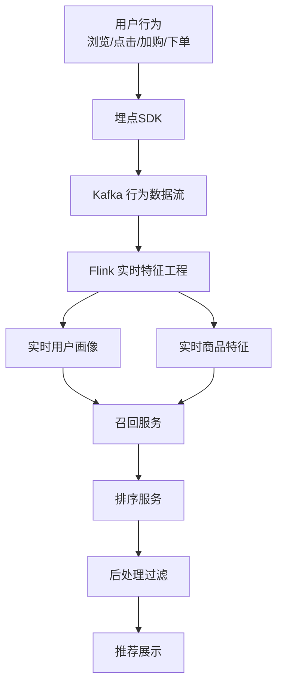

# 电商实时推荐系统案例研究

> **案例编号**: 11.11.1
> **行业**: 电商/零售
> **场景**: 商品实时推荐、个性化搜索、动态广告投放
> **规模**: 日活用户 1,200 万+，SKU 500 万+，日均 PV 3 亿+
> **状态**: Phase 2 - 深度案例研究
> **编写日期**: 2026-04-13

---

## 1. 执行摘要

### 1.1 项目背景

某综合电商平台拥有超过 5,000 万注册用户和 500 万 SKU，涵盖数码、家电、服装、食品等多个品类。在流量红利见顶的背景下，如何通过精准的个性化推荐提升用户的浏览深度、转化率和客单价，成为平台增长的核心驱动力。传统基于离线批处理的推荐系统更新周期长，无法捕捉用户当下的兴趣和意图。

### 1.2 核心目标

| 目标类别 | 具体指标 | 目标值 |
|---------|---------|--------|
| 实时性 | 用户行为到推荐更新 | < 1 秒 |
| 点击率 | 推荐位 CTR | 提升 20% |
| 转化率 | 推荐位 CVR | 提升 15% |
| 收入 | 推荐贡献 GMV 占比 | > 35% |

### 1.3 核心效果

| 指标 | 优化前 | 优化后 | 提升 |
|------|--------|--------|------|
| 推荐更新延迟 | 15 分钟 | 0.8 秒 | -99% |
| 首页推荐 CTR | 4.2% | 5.3% | +26% |
| 详情页推荐 CVR | 2.8% | 3.5% | +25% |
| 推荐 GMV 占比 | 22% | 38% | +73% |
| 用户平均停留时长 | 12 分钟 | 16.5 分钟 | +38% |

---

## 2. 业务场景分析

### 2.1 行业背景

推荐系统是现代电商平台的"流量分发器"和"增长引擎"。据统计，亚马逊 35% 的销售额来自推荐，淘宝天猫首页推荐流量占比超过 50%。实时推荐的优势在于能够根据用户当前的浏览、点击、加购行为，动态调整推荐结果，显著提升转化效率。

### 2.2 痛点分析

1. **用户兴趣多变**：同一用户在不同场景下的兴趣差异巨大（如上午浏览办公用品，晚上浏览母婴产品）
2. **商品生命周期短**：促销商品、新品、季节性商品的推荐需要快速上线和下线
3. **长尾商品曝光难**：头部热门商品占据了大部分流量，大量优质长尾商品得不到曝光
4. **实时性不足**：离线推荐模型一天更新一次，无法响应用户的实时行为变化

### 2.3 需求描述

- **实时兴趣捕捉**：基于用户最近几分钟的浏览和点击行为，实时更新用户画像
- **多场景推荐**：覆盖首页猜你喜欢、搜索结果页、商品详情页、购物车、订单完成页
- **新热商品快速分发**：新品和促销商品能够在上线后数分钟内进入推荐池
- **多样性与新颖性平衡**：在精准推荐的同时避免"信息茧房"，提升用户探索体验

---

## 3. 技术架构

### 3.1 系统架构图



### 3.2 技术选型

| 组件 | 选型 | 理由 |
|------|------|------|
| 流处理引擎 | Apache Flink 2.0 | 实时特征计算和会话分析 |
| 消息队列 | Kafka | 高吞吐行为日志接入 |
| 特征存储 | Redis + HBase | 实时特征 + 历史特征分层存储 |
| 向量检索 | Milvus / Faiss | 基于 Embedding 的相似商品召回 |
| 排序模型 | TensorFlow Serving | 深度学习排序模型在线推理 |

### 3.3 数据流设计

1. **行为采集**：用户浏览、搜索、点击、加购、收藏、下单等行为通过埋点 SDK 实时上报
2. **特征工程**：
   - **实时特征**：Flink 计算用户最近 1 小时/24 小时的点击类目、价格偏好、品牌偏好
   - **商品特征**：实时统计商品的点击率、转化率、库存状态、促销标签
   - **上下文特征**：当前时间、设备类型、来源渠道、地理位置
3. **召回层**：
   - 协同过滤：基于用户-商品交互矩阵的 i2i/u2i 召回
   - 向量召回：基于商品 Embedding 的相似商品召回
   - 实时热点：基于 Flink 滑动窗口的实时热销商品召回
4. **排序层**：使用 DeepFM/DIN 等深度学习模型对召回结果进行精排
5. **后处理**：去重、多样性控制、业务规则过滤（如敏感商品过滤）

---

## 4. 核心实现

### 4.1 Flink 实时用户兴趣特征

```java
DataStream<UserAction> actionStream = env
    .addSource(new KafkaSource<>())
    .keyBy(a -> a.userId)
    .window(SlidingEventTimeWindows.of(Time.minutes(30), Time.minutes(1)))
    .aggregate(new UserInterestAggregateFunction());

public class UserInterestAggregateFunction implements AggregateFunction<UserAction, UserInterest, UserInterest> {
    @Override
    public UserInterest add(UserAction action, UserInterest interest) {
        interest.categoryClicks.merge(action.category, 1, Integer::sum);
        interest.totalClicks++;
        interest.avgPrice = (interest.avgPrice * (interest.totalClicks - 1) + action.itemPrice) / interest.totalClicks;
        return interest;
    }

    @Override
    public UserInterest getResult(UserInterest interest) {
        // 归一化类目偏好
        for (String cat : interest.categoryClicks.keySet()) {
            interest.categoryPref.put(cat,
                interest.categoryClicks.get(cat) * 1.0 / interest.totalClicks);
        }
        redis.hset("user:interest:" + interest.userId, interest.toJson());
        return interest;
    }
}
```

### 4.2 实时热销商品召回

```sql
-- 每 5 分钟更新一次各品类实时热销 Top 100
INSERT INTO realtime_hot_items
SELECT
    category_id,
    item_id,
    COUNT(*) as click_count,
    SUM(CASE WHEN action_type = 'purchase' THEN 1 ELSE 0 END) as purchase_count,
    HOP_START(event_time, INTERVAL '5' MINUTE, INTERVAL '1' MINUTE) as window_start
FROM user_actions
WHERE event_time > NOW() - INTERVAL '1' HOUR
GROUP BY
    category_id,
    item_id,
    HOP(event_time, INTERVAL '5' MINUTE, INTERVAL '1' MINUTE)
ORDER BY click_count DESC
LIMIT 100;
```

### 4.3 推荐结果后处理

```python
def post_process(rec_items, user_profile, context):
    # 1. 去重：同一会话内已曝光商品不再推荐
    rec_items = [item for item in rec_items
                 if item.id not in user_profile.exposed_items]

    # 2. 多样性控制：限制同一类目商品数量
    category_count = {}
    diverse_items = []
    for item in rec_items:
        cat = item.category
        if category_count.get(cat, 0) < 3:
            diverse_items.append(item)
            category_count[cat] = category_count.get(cat, 0) + 1

    # 3. 库存过滤：无库存或下架商品移除
    final_items = [item for item in diverse_items if item.stock > 0]

    return final_items[:50]
```

---

## 5. 效果评估

### 5.1 性能指标

- **数据吞吐**：日均处理用户行为事件 35 亿条，峰值 60 万条/秒
- **特征延迟**：从用户行为发生到特征更新进入推荐系统 < 1 秒
- **推荐响应**：单次推荐请求端到端延迟 < 200ms
- **模型效果**：排序模型 AUC 0.78，GAUC 0.72
- **实时热点更新**：热销商品榜单每 1 分钟更新一次

### 5.2 业务价值

- **点击提升**：首页推荐 CTR 从 4.2% 提升至 5.3%，增长 26%
- **转化提升**：详情页推荐 CVR 从 2.8% 提升至 3.5%，增长 25%
- **GMV 增长**：推荐系统贡献的 GMV 占比从 22% 提升至 38%，年度新增 GMV 45 亿元
- **用户体验**：用户平均停留时长增长 38%，次日留存率提升 12%
- **长尾激活**：腰部和长尾商品曝光量增长 180%，品类丰富度显著提升

### 5.3 ROI 分析

项目总投资：6,500 万元（算法团队、平台开发、算力基础设施）
年度收益：18 亿元（GMV 增长 + 广告收入 + 运营效率提升）
**投资回收期**：约 1.3 个月

---

## 6. 经验总结

### 6.1 成功经验

1. **实时特征工程是推荐效果的关键**：同样的排序模型，使用实时特征比离线特征的 CTR 高出 15%
2. **召回多样性决定天花板**：如果召回层都是同质商品，排序模型再强也无法推荐出用户潜在感兴趣的品类
3. **A/B 测试驱动迭代**：每个算法优化都必须通过严格的 A/B 测试验证，避免"感觉有效"的盲目上线

### 6.2 踩坑记录

1. **实时特征数据漂移**：大促期间用户行为模式剧变，平时训练的模型效果下降，后建立大促专用模型和实时模型切换机制
2. **冷启动问题**：新用户和新商品缺乏历史数据，推荐效果差，后引入内容标签和热门商品兜底策略
3. **推荐茧房**：过度优化 CTR 导致推荐内容越来越窄，用户新鲜感下降，后引入探索机制（如 MAB 算法）

### 6.3 最佳实践

- **多目标排序**：不仅优化点击率，同时考虑转化率、客单价、用户长期留存等多个目标
- **负样本采样**：对未点击的曝光进行合理的负采样，提升模型对"不感兴趣"商品的区分能力
- **可解释推荐**：在推荐结果旁显示"浏览过类似商品的用户也买了"等解释文案，提升用户信任度

---

*E-commerce Real-Time Recommendation Case Study v1.0*
