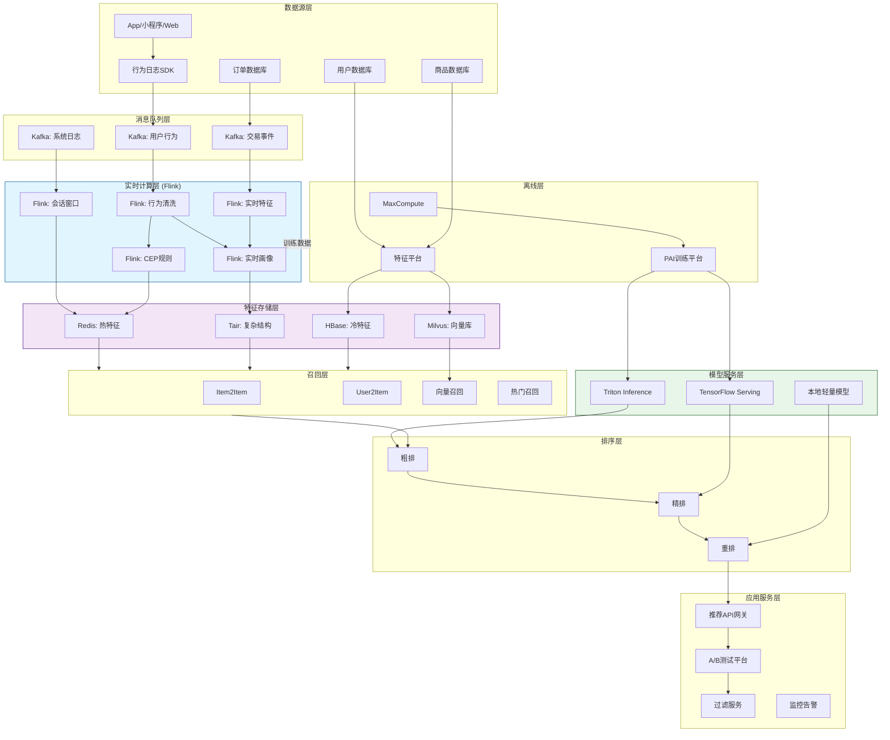
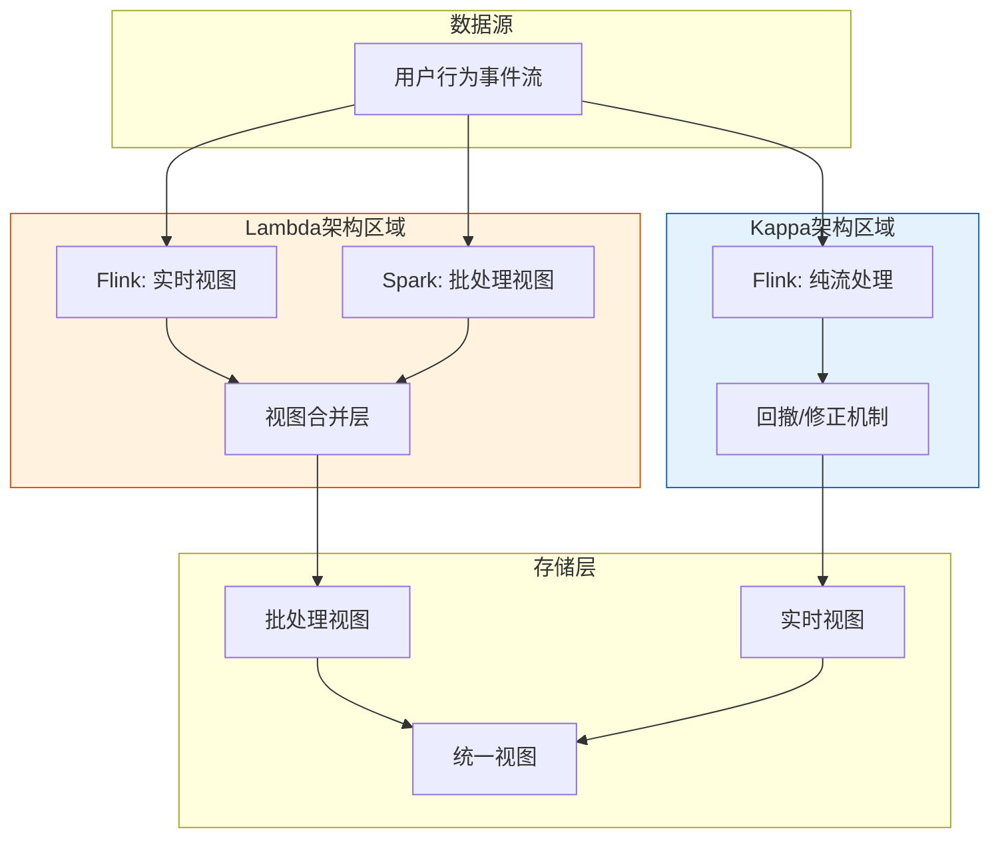
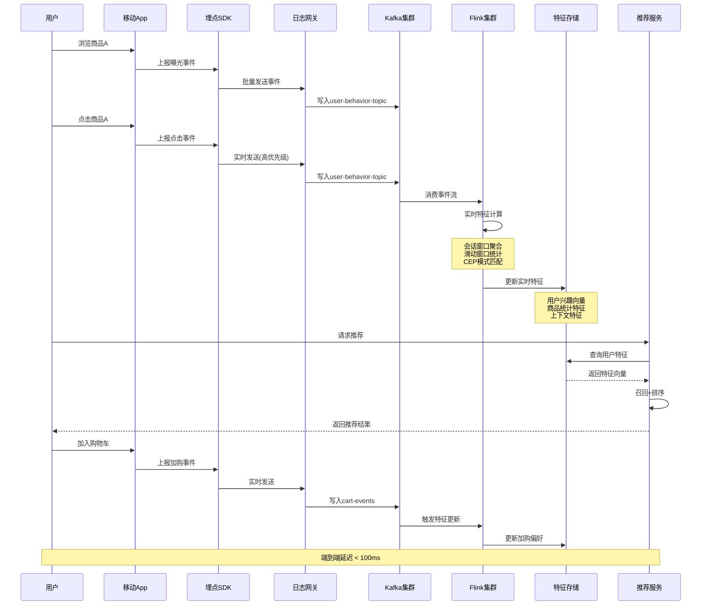
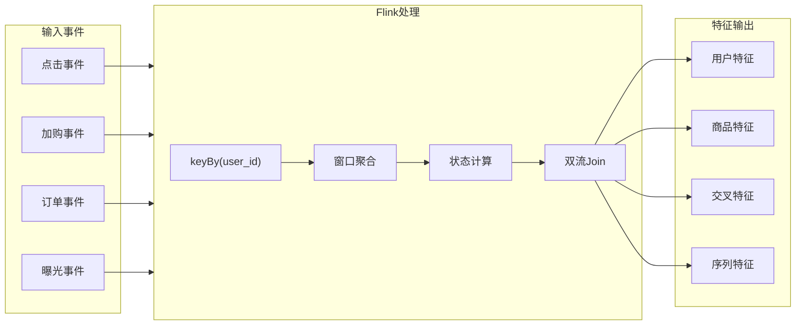

# 电商实时推荐系统深度案例研究

> **案例编号**: 11.11.2
> **行业**: 电商/零售
> **场景**: 实时个性化推荐、用户行为分析、智能商品排序
> **规模**: 2亿+日活用户, 5000万+SKU, 日处理事件500亿+
> **编写日期**: 2026-04-12
> **状态**: Phase 2 - 深度案例
> **前置案例**: [11.11.1-realtime-recommendation.md](./11.11.1-realtime-recommendation.md)

---

## 1. 执行摘要 (Executive Summary)

### 1.1 项目背景与目标

某头部跨境电商平台在业务快速扩张过程中，推荐系统面临严峻挑战。
平台日活跃用户超过2亿，SKU数量达5000万，日均处理用户行为事件超过500亿次。
随着业务复杂度提升，原有基于T+1离线计算的推荐系统已无法满足实时个性化需求。

**项目核心目标**:

| 目标类别 | 具体指标 | 目标值 |
|---------|---------|--------|
| 实时性 | 用户行为到推荐更新延迟 | < 100ms |
| 准确性 | 推荐点击率提升 | +50% |
| 规模 | 峰值QPS支撑能力 | 100万+ |
| 稳定性 | 系统可用性 | 99.99% |
| 业务 | GMV提升 | +20% |

### 1.2 核心业务指标

项目实施后的核心业务指标表现：

```
┌─────────────────────────────────────────────────────────────┐
│                    核心业务指标对比                          │
├─────────────────┬────────────┬────────────┬─────────────────┤
│     指标        │   优化前   │   优化后   │     提升幅度     │
├─────────────────┼────────────┼────────────┼─────────────────┤
│ 日活用户(DAU)   │   1.8亿   │   2.1亿   │     +16.7%      │
│ 人均浏览商品数  │    12     │    18     │     +50%        │
│ 点击率(CTR)     │   4.2%    │   6.8%    │     +61.9%      │
│ 转化率(CVR)     │   1.8%    │   2.6%    │     +44.4%      │
│ 客单价(AOV)     │   ¥156    │   ¥189    │     +21.2%      │
│ GMV/日          │  ¥4.2亿   │  ¥5.8亿   │     +38.1%      │
│ 推荐响应延迟P99 │   320ms   │   45ms    │     -85.9%      │
│ 推荐覆盖率      │   68%     │   94%     │     +26%        │
└─────────────────┴────────────┴────────────┴─────────────────┘
```

### 1.3 技术选型概述

项目采用 **Lambda+Kappa混合架构**，以Apache Flink为核心实时计算引擎，结合多种存储和机器学习技术：

**核心技术栈**:

| 层级 | 技术选型 | 选型理由 |
|-----|---------|---------|
| 流计算引擎 | Apache Flink 1.18 | 毫秒级延迟、精确一次语义、丰富的状态管理 |
| 消息队列 | Apache Kafka 3.6 | 高吞吐、分区有序、与Flink生态深度整合 |
| 特征存储 | Redis Cluster + Tair | 亚毫秒级读写、支持复杂数据结构 |
| 向量检索 | Milvus 2.3 | 十亿级向量检索、GPU加速 |
| 模型推理 | TensorFlow Serving + Triton | 高性能模型服务、动态批处理 |
| 离线存储 | Hologres + MaxCompute | 交互式分析、湖仓一体 |
| 监控体系 | Prometheus + Grafana | 云原生监控、丰富告警能力 |

---

## 2. 业务背景与挑战 (Business Context)

### 2.1 电商推荐业务场景

#### 2.1.1 多场景推荐矩阵

电商平台推荐系统覆盖用户全生命周期触点：

```
                    ┌────────────────────────────────────────────────────────┐
                    │              电商推荐场景矩阵                            │
                    ├────────────────────────────────────────────────────────┤
                    │                                                        │
│   首页猜你喜欢    │   详情页相关推荐    │   购物车推荐      │   订单完成推荐   │
│   ┌───────────┐   │   ┌───────────┐    │   ┌───────────┐  │   ┌───────────┐  │
│   │  个性化   │   │   │  相似商品  │    │   │  凑单推荐   │  │   │  复购提醒   │  │
│   │  瀑布流   │   │   │  搭配购买  │    │   │  省钱组合   │  │   │  相似商品   │  │
│   └───────────┘   │   └───────────┘    │   └───────────┘  │   └───────────┘  │
│        ↓          │         ↓          │        ↓         │         ↓        │
│    CTR: 6.8%      │    CTR: 8.2%       │   CTR: 12.5%     │    CTR: 5.1%     │
│   CVR: 2.6%       │    CVR: 3.1%       │   CVR: 4.8%      │    CVR: 2.1%     │
                    │                                                        │
├───────────────────┼────────────────────┼──────────────────┼──────────────────┤
│   搜索结果页      │   分类浏览页        │   活动会场页      │   个人中心页     │
│   ┌───────────┐   │   ┌───────────┐    │   ┌───────────┐  │   ┌───────────┐  │
│   │  搜索词   │   │   │  类目热榜  │    │   │  活动商品   │  │   │  浏览历史   │  │
│   │  相关性   │   │   │  新品发现  │    │   │  个性化     │  │   │  兴趣标签   │  │
│   │  排序     │   │   │  价格带   │    │   │  筛选       │  │   │  专属优惠   │  │
│   └───────────┘   │   └───────────┘    │   └───────────┘  │   └───────────┘  │
│        ↓          │         ↓          │        ↓         │         ↓        │
│   CTR: 5.5%       │    CTR: 4.2%       │   CTR: 7.8%      │    CTR: 3.9%     │
│   CVR: 2.2%       │    CVR: 1.8%       │   CVR: 3.5%      │    CVR: 1.5%     │
                    │                                                        │
└────────────────────────────────────────────────────────────────────────────┘
```

#### 2.1.2 用户行为事件类型

推荐系统依赖的用户行为事件分类及处理优先级：

| 事件类型 | 事件示例 | 实时性要求 | 日处理量 | 权重 |
|---------|---------|-----------|---------|------|
| 曝光事件 | item_show, page_view | 低(T+1) | 2000亿 | 1 |
| 点击事件 | item_click, detail_enter | 极高(<50ms) | 80亿 | 10 |
| 行为事件 | cart_add, collect, share | 高(<100ms) | 20亿 | 15 |
| 转化事件 | order_create, pay_success | 极高(<50ms) | 2亿 | 50 |
| 负反馈 | not_interested, hide | 极高(<50ms) | 5000万 | 20 |

### 2.2 实时性要求 (延迟SLA)

#### 2.2.1 端到端延迟分层

不同业务场景对推荐实时性的差异化要求：

```
┌──────────────────────────────────────────────────────────────────────────────┐
│                        推荐系统延迟分层架构                                   │
├──────────────────────────────────────────────────────────────────────────────┤
│                                                                              │
│   用户行为 ───→ 特征更新 ───→ 模型推理 ───→ 结果返回                          │
│      │            │            │            │                                │
│      ▼            ▼            ▼            ▼                                │
│   ┌──────┐    ┌──────┐    ┌──────┐    ┌──────┐                              │
│   │实时层│    │实时层│    │实时层│    │实时层│  < 50ms  (Level 1 - 极速)   │
│   │< 20ms│    │< 30ms│    │< 10ms│    │< 10ms│    用户实时意图捕捉           │
│   └──┬───┘    └──┬───┘    └──┬───┘    └──┬───┘                              │
│      │            │            │            │                                │
│      └────────────┴────────────┴────────────┘                                │
│                         P99 < 50ms                                          │
│                                                                              │
│   ┌────────────────────────────────────────────────────────────────────┐    │
│   │                         近实时层                                    │    │
│   │     P99 < 200ms  (Level 2 - 快速)                                  │    │
│   │     用户短期兴趣更新 (最近1小时行为聚合)                            │    │
│   └────────────────────────────────────────────────────────────────────┘    │
│                                                                              │
│   ┌────────────────────────────────────────────────────────────────────┐    │
│   │                         准实时层                                    │    │
│   │     P99 < 1s  (Level 3 - 标准)                                     │    │
│   │     用户画像更新 (最近24小时行为聚合)                               │    │
│   └────────────────────────────────────────────────────────────────────┘    │
│                                                                              │
│   ┌────────────────────────────────────────────────────────────────────┐    │
│   │                         离线层                                      │    │
│   │     T+1  (Level 4 - 批量)                                          │    │
│   │     长期用户画像、商品画像、协同过滤模型                            │    │
│   └────────────────────────────────────────────────────────────────────┘    │
│                                                                              │
└──────────────────────────────────────────────────────────────────────────────┘
```

#### 2.2.2 SLA分级定义

| SLA等级 | 延迟要求 | 可用性 | 应用场景 | 降级策略 |
|--------|---------|--------|---------|---------|
| S1-核心 | P99 < 50ms | 99.99% | 点击/转化实时反馈 | 本地缓存兜底 |
| S2-重要 | P99 < 200ms | 99.95% | 特征实时更新 | 近实时特征兜底 |
| S3-普通 | P99 < 1s | 99.9% | 画像批量更新 | 离线特征兜底 |
| S4-离线 | T+1 | 99.5% | 模型训练数据 | 延迟一天处理 |

### 2.3 规模挑战

#### 2.3.1 流量规模

```
┌─────────────────────────────────────────────────────────────────────────────┐
│                          系统规模指标                                        │
├─────────────────────────────────────────────────────────────────────────────┤
│                                                                             │
│  日活用户(DAU)                                                              │
│  ████████████████████████████████████████████████████  210,000,000         │
│                                                                             │
│  峰值在线用户                                                               │
│  ██████████████████████████████  85,000,000                                │
│                                                                             │
│  SKU数量                                                                    │
│  ████████████████████████████████████████  50,000,000                      │
│                                                                             │
│  日处理事件数                                                               │
│  ████████████████████████████████████████████████████████  500亿           │
│                                                                             │
│  峰值QPS (事件上报)                                                         │
│  ████████████████████████████████████████  1,200,000                       │
│                                                                             │
│  峰值QPS (推荐请求)                                                         │
│  ██████████████████████  500,000                                           │
│                                                                             │
│  特征存储数据量                                                             │
│  ██████████████████████████████  80TB (Redis)                              │
│                                                                             │
│  向量索引规模                                                               │
│  ████████████████████████████████████████████████████  50亿向量            │
│                                                                             │
└─────────────────────────────────────────────────────────────────────────────┘
```

#### 2.3.2 大促场景压力

大促期间(双11/黑五)流量特征：

| 指标 | 日常 | 大促峰值 | 增长倍数 |
|-----|------|---------|---------|
| DAU | 2.1亿 | 3.5亿 | 1.67x |
| 事件QPS | 120万 | 800万 | 6.67x |
| 推荐QPS | 50万 | 300万 | 6x |
| 订单QPS | 2万 | 50万 | 25x |
| 特征更新QPS | 80万 | 500万 | 6.25x |

### 2.4 主要痛点

#### 2.4.1 业务痛点

1. **推荐时效性差**: 用户浏览商品A后，在T+1前无法获得相关推荐
2. **冷启动问题**: 新用户/新商品缺乏历史数据，推荐质量低
3. **场景覆盖不足**: 仅覆盖首页猜你喜欢，其他场景推荐能力弱
4. **个性化程度低**: 千人一面，无法捕捉用户实时兴趣变化

#### 2.4.2 技术痛点

1. **数据延迟**: 离线特征T+1更新，无法反映用户实时行为
2. **特征不一致**: 离线训练与在线推理特征不一致，模型效果打折扣
3. **系统耦合**: 推荐服务与特征服务强耦合，升级困难
4. **扩展性不足**: 流量突增时系统响应延迟飙升，甚至服务降级
5. **A/B测试能力弱**: 缺乏完善的实验框架，难以科学评估算法效果

---

## 3. 技术架构设计 (Technical Architecture)

### 3.1 整体架构图

以下是电商实时推荐系统的整体技术架构：



### 3.2 Lambda vs Kappa 架构选择

#### 3.2.1 架构对比分析

项目中采用 **Lambda+Kappa混合架构**，不同场景使用不同模式：

| 场景 | 选择架构 | 原因 | 具体实现 |
|-----|---------|------|---------|
| 实时特征计算 | Kappa | 只需流处理，逻辑简单 | Flink单流处理 |
| 实时报表统计 | Lambda | 需要历史数据修正 | Flink实时+Spark离线修正 |
| 机器学习样本 | Lambda | 需要延迟标签 | Flink实时样本+离线修正标签 |
| 用户画像更新 | Kappa | 完全基于流式事件 | Flink多流Join |

#### 3.2.2 混合架构示意图



### 3.3 数据流设计

#### 3.3.1 用户行为数据流



#### 3.3.2 特征实时更新数据流



### 3.4 特征工程架构

#### 3.4.1 特征分层设计

```
┌─────────────────────────────────────────────────────────────────────────────┐
│                          特征分层架构                                        │
├─────────────────────────────────────────────────────────────────────────────┤
│                                                                             │
│  ┌─────────────────────────────────────────────────────────────────────┐   │
│  │                        原始特征层 (Raw)                              │   │
│  │   用户ID | 商品ID | 时间戳 | 行为类型 | 上下文(位置/设备/渠道)         │   │
│  └─────────────────────────────────────────────────────────────────────┘   │
│                                    ↓                                       │
│  ┌─────────────────────────────────────────────────────────────────────┐   │
│  │                      基础特征层 (Base)                               │   │
│  │   用户画像: 年龄/性别/地域/消费层级/会员等级                         │   │
│  │   商品画像: 类目/品牌/价格带/销量/评分                               │   │
│  │   交叉特征: 用户-类目偏好/用户-价格敏感度                            │   │
│  └─────────────────────────────────────────────────────────────────────┘   │
│                                    ↓                                       │
│  ┌─────────────────────────────────────────────────────────────────────┐   │
│  │                      统计特征层 (Statistical)                        │   │
│  │   用户统计: 近1h/6h/24h/7d 点击数/浏览数/购买数                       │   │
│  │   商品统计: 近1h/6h/24h/7d 曝光数/点击数/转化率                       │   │
│  │   实时热榜: 当前时段TOP商品/飙升商品                                 │   │
│  └─────────────────────────────────────────────────────────────────────┘   │
│                                    ↓                                       │
│  ┌─────────────────────────────────────────────────────────────────────┐   │
│  │                      序列特征层 (Sequential)                         │   │
│  │   点击序列: [item_a, item_b, item_c, ...]                            │   │
│  │   兴趣演化: Transformer编码的兴趣向量                                │   │
│  │   会话特征: 当前会话内的行为序列                                     │   │
│  └─────────────────────────────────────────────────────────────────────┘   │
│                                    ↓                                       │
│  ┌─────────────────────────────────────────────────────────────────────┐   │
│  │                      向量特征层 (Embedding)                          │   │
│  │   用户向量: 128维用户兴趣向量                                        │   │
│  │   商品向量: 128维商品语义向量                                        │   │
│  │   上下文向量: 64维上下文编码向量                                     │   │
│  └─────────────────────────────────────────────────────────────────────┘   │
│                                    ↓                                       │
│  ┌─────────────────────────────────────────────────────────────────────┐   │
│  │                      模型特征层 (Model Input)                        │   │
│  │   DNN输入: 拼接所有特征 → 归一化 → 特征选择 → 模型推理               │   │
│  └─────────────────────────────────────────────────────────────────────┘   │
│                                                                             │
└─────────────────────────────────────────────────────────────────────────────┘
```

#### 3.4.2 特征存储选型

| 特征类型 | 存储选型 | 读写延迟 | 容量 | 更新频率 |
|---------|---------|---------|------|---------|
| 热特征(实时) | Redis Cluster | P99 < 1ms | 40GB | 实时 |
| 复杂结构特征 | Tair (增强版Redis) | P99 < 2ms | 20GB | 实时 |
| 冷特征(离线) | HBase | P99 < 10ms | 500TB | 小时级 |
| 向量特征 | Milvus | P99 < 20ms | 200GB | 天级 |
| 序列特征 | Redis + 本地Cache | P99 < 3ms | 60GB | 实时 |

---

## 4. Flink 应用详解 (Flink Implementation)

### 4.1 用户行为实时聚合

#### 4.1.1 核心Flink作业设计

```java
import org.apache.flink.streaming.api.environment.StreamExecutionEnvironment;

import org.apache.flink.streaming.api.datastream.DataStream;
import org.apache.flink.streaming.api.CheckpointingMode;
import org.apache.flink.api.common.functions.AggregateFunction;
import org.apache.flink.streaming.api.windowing.time.Time;


/**
 * 用户行为实时聚合作业
 * 功能: 实时计算用户多时间维度行为统计特征
 * 输入: Kafka用户行为事件流
 * 输出: Redis特征更新
 */
public class UserBehaviorAggregationJob {

    public static void main(String[] args) throws Exception {
        StreamExecutionEnvironment env =
            StreamExecutionEnvironment.getExecutionEnvironment();

        // 配置: 启用检查点, exactly-once语义
        env.enableCheckpointing(60000);
        env.getCheckpointConfig().setCheckpointingMode(
            CheckpointingMode.EXACTLY_ONCE);
        env.getCheckpointConfig().setMinPauseBetweenCheckpoints(30000);

        // 1. 读取Kafka数据源
        KafkaSource<UserBehaviorEvent> source = KafkaSource.<UserBehaviorEvent>builder()
            .setBootstrapServers("kafka:9092")
            .setTopics("user-behavior-events")
            .setGroupId("flink-behavior-agg")
            .setStartingOffsets(OffsetsInitializer.latest())
            .setValueOnlyDeserializer(new UserBehaviorDeserializationSchema())
            .build();

        DataStream<UserBehaviorEvent> stream = env.fromSource(
            source,
            WatermarkStrategy.<UserBehaviorEvent>forBoundedOutOfOrderness(
                Duration.ofSeconds(5))
                .withTimestampAssigner((event, timestamp) -> event.getEventTime()),
            "Kafka User Behavior Source"
        );

        // 2. 数据清洗与过滤
        DataStream<UserBehaviorEvent> cleanedStream = stream
            .filter(event -> event.getUserId() != null && !event.getUserId().isEmpty())
            .filter(event -> event.getItemId() != null && !event.getItemId().isEmpty())
            .filter(event -> isValidEventType(event.getEventType()));

        // 3. 实时聚合计算
        // 3.1 会话级实时特征 (5分钟窗口)
        DataStream<UserSessionFeature> sessionFeatures = cleanedStream
            .keyBy(UserBehaviorEvent::getUserId)
            .window(EventTimeSessionWindows.withDynamicGap(
                (element) -> Time.minutes(5)))
            .aggregate(new SessionFeatureAggregateFunction());

        // 3.2 滑动窗口统计特征 (1h/6h/24h多时间维度)
        DataStream<UserStatFeature> statFeatures = cleanedStream
            .keyBy(UserBehaviorEvent::getUserId)
            .window(SlidingEventTimeWindows.of(Time.hours(1), Time.minutes(5)))
            .aggregate(new UserStatAggregateFunction())
            .name("1h-window-aggregation");

        // 3.3 CEP模式匹配: 识别购买意向行为序列
        Pattern<UserBehaviorEvent, ?> purchaseIntentPattern = Pattern
            .<UserBehaviorEvent>begin("detail_view")
            .where(evt -> evt.getEventType().equals("detail_enter"))
            .next("add_cart")
            .where(evt -> evt.getEventType().equals("cart_add"))
            .within(Time.minutes(30));

        DataStream<PurchaseIntentEvent> intentEvents = CEP.pattern(
                cleanedStream.keyBy(UserBehaviorEvent::getUserId),
                purchaseIntentPattern)
            .process(new PatternHandler());

        // 4. 特征输出到Redis
        sessionFeatures.addSink(new RedisFeatureSink("session"));
        statFeatures.addSink(new RedisFeatureSink("stat"));
        intentEvents.addSink(new RedisIntentSink());

        env.execute("User Behavior Real-time Aggregation");
    }
}
```

#### 4.1.2 聚合函数实现

```java
/**
 * 用户统计特征聚合函数
 * 聚合维度: 点击数、浏览数、加购数、下单数、成交金额
 */

import org.apache.flink.api.common.functions.AggregateFunction;

public class UserStatAggregateFunction implements
    AggregateFunction<UserBehaviorEvent, UserStatAccumulator, UserStatFeature> {

    @Override
    public UserStatAccumulator createAccumulator() {
        return new UserStatAccumulator();
    }

    @Override
    public UserStatAccumulator add(UserBehaviorEvent event, UserStatAccumulator acc) {
        acc.setUserId(event.getUserId());
        acc.setWindowEnd(event.getEventTime());

        switch (event.getEventType()) {
            case "item_click":
                acc.incrementClickCount();
                acc.addClickItem(event.getItemId());
                break;
            case "item_expose":
                acc.incrementExposeCount();
                break;
            case "cart_add":
                acc.incrementCartCount();
                acc.addCartItem(event.getItemId());
                break;
            case "order_create":
                acc.incrementOrderCount();
                acc.addOrderAmount(event.getOrderAmount());
                break;
        }
        return acc;
    }

    @Override
    public UserStatFeature getResult(UserStatAccumulator acc) {
        UserStatFeature feature = new UserStatFeature();
        feature.setUserId(acc.getUserId());
        feature.setClickCount(acc.getClickCount());
        feature.setExposeCount(acc.getExposeCount());
        feature.setCartCount(acc.getCartCount());
        feature.setOrderCount(acc.getOrderCount());
        feature.setCtr(calculateCtr(acc.getClickCount(), acc.getExposeCount()));
        feature.setCvr(calculateCvr(acc.getOrderCount(), acc.getClickCount()));
        feature.setClickSequence(acc.getClickSequence());
        feature.setTimestamp(System.currentTimeMillis());
        return feature;
    }

    @Override
    public UserStatAccumulator merge(UserStatAccumulator a, UserStatAccumulator b) {
        return a.merge(b);
    }

    private double calculateCtr(long clicks, long exposes) {
        return exposes == 0 ? 0.0 : (double) clicks / exposes;
    }

    private double calculateCvr(long orders, long clicks) {
        return clicks == 0 ? 0.0 : (double) orders / clicks;
    }
}
```

### 4.2 特征实时更新流

#### 4.2.1 多流Join实现实时特征关联

```java
import org.apache.flink.streaming.api.environment.StreamExecutionEnvironment;

import org.apache.flink.streaming.api.datastream.DataStream;
import org.apache.flink.streaming.api.windowing.time.Time;


/**
 * 实时特征宽表构建
 * Join用户行为流、商品信息流、用户画像流
 */
public class RealtimeFeatureWideTableJob {

    public static void main(String[] args) throws Exception {
        StreamExecutionEnvironment env =
            StreamExecutionEnvironment.getExecutionEnvironment();

        // 流1: 用户行为事件流 (主数据流)
        DataStream<UserBehaviorEvent> behaviorStream = env
            .fromSource(createKafkaSource("user-behavior"),
                WatermarkStrategy.forBoundedOutOfOrderness(Duration.ofSeconds(5)),
                "Behavior Stream")
            .assignTimestampsAndWatermarks(
                WatermarkStrategy.<UserBehaviorEvent>forBoundedOutOfOrderness(
                    Duration.ofSeconds(5)));

        // 流2: 商品实时属性流 (维度表)
        DataStream<ItemInfo> itemInfoStream = env
            .fromSource(createKafkaSource("item-info"),
                WatermarkStrategy.noWatermarks(),
                "Item Info Stream");

        // 流3: 用户画像更新流 (维度表)
        DataStream<UserProfile> userProfileStream = env
            .fromSource(createKafkaSource("user-profile"),
                WatermarkStrategy.noWatermarks(),
                "User Profile Stream");

        // 流4: 实时价格变动流 (维度表)
        DataStream<PriceChangeEvent> priceStream = env
            .fromSource(createKafkaSource("price-change"),
                WatermarkStrategy.forBoundedOutOfOrderness(Duration.ofSeconds(3)),
                "Price Stream");

        // 创建广播流: 商品类目映射 (小表广播)
        MapStateDescriptor<String, CategoryInfo> categoryStateDescriptor =
            new MapStateDescriptor<>("category-map", String.class, CategoryInfo.class);

        BroadcastStream<CategoryInfo> categoryBroadcastStream = env
            .fromSource(createKafkaSource("category-info"), WatermarkStrategy.noWatermarks(), "Category")
            .broadcast(categoryStateDescriptor);

        // 执行双流Join: 行为流 + 商品信息 (基于事件时间, 5秒窗口)
        DataStream<EnrichedBehavior> enrichedWithItem = behaviorStream
            .keyBy(UserBehaviorEvent::getItemId)
            .intervalJoin(itemInfoStream.keyBy(ItemInfo::getItemId))
            .between(Time.seconds(-30), Time.seconds(30))
            .process(new ItemInfoJoinFunction());

        // 异步Lookup Join: 关联用户画像 (从Redis查询)
        DataStream<RichBehaviorFeature> richFeatures = enrichedWithItem
            .map(new RichMapFunction<EnrichedBehavior, RichBehaviorFeature>() {
                private transient UserProfileClient profileClient;

                @Override
                public void open(Configuration parameters) {
                    profileClient = new UserProfileClient();
                }

                @Override
                public RichBehaviorFeature map(EnrichedBehavior value) throws Exception {
                    UserProfile profile = profileClient.getUserProfile(value.getUserId());
                    return RichBehaviorFeature.build(value, profile);
                }
            })
            .name("Async Lookup User Profile");

        // 窗口Join: 关联价格变动 (最近价格信息)
        DataStream<FinalFeature> finalFeatures = richFeatures
            .keyBy(RichBehaviorFeature::getItemId)
            .intervalJoin(priceStream.keyBy(PriceChangeEvent::getItemId))
            .between(Time.minutes(-10), Time.seconds(0))
            .process(new PriceJoinFunction());

        // 写入特征存储
        finalFeatures.addSink(new FeatureStoreSink());

        env.execute("Realtime Feature Wide Table Building");
    }
}
```

#### 4.2.2 状态管理与容错

```java
/**
 * 用户兴趣状态管理
 * 使用Flink State管理用户长期兴趣
 */

import org.apache.flink.api.common.state.ValueState;
import org.apache.flink.api.common.state.ValueStateDescriptor;

public class UserInterestStateManager extends KeyedProcessFunction<String,
    UserBehaviorEvent, UserInterestVector> {

    // 值状态: 存储用户兴趣向量
    private ValueState<UserInterestVector> interestState;

    // 列表状态: 存储用户最近点击序列
    private ListState<String> clickSequenceState;

    // Map状态: 存储用户对各类目的偏好分数
    private MapState<String, Double> categoryPreferenceState;

    @Override
    public void open(Configuration parameters) {
        StateTtlConfig ttlConfig = StateTtlConfig
            .newBuilder(Time.days(30))
            .setUpdateType(StateTtlConfig.UpdateType.OnCreateAndWrite)
            .setStateVisibility(StateTtlConfig.StateVisibility.NeverReturnExpired)
            .build();

        ValueStateDescriptor<UserInterestVector> interestDescriptor =
            new ValueStateDescriptor<>("interest-vector", UserInterestVector.class);
        interestDescriptor.enableTimeToLive(ttlConfig);
        interestState = getRuntimeContext().getState(interestDescriptor);

        ListStateDescriptor<String> sequenceDescriptor =
            new ListStateDescriptor<>("click-sequence", String.class);
        clickSequenceState = getRuntimeContext().getListState(sequenceDescriptor);

        MapStateDescriptor<String, Double> categoryDescriptor =
            new MapStateDescriptor<>("category-pref", String.class, Double.class);
        categoryPreferenceState = getRuntimeContext().getMapState(categoryDescriptor);
    }

    @Override
    public void processElement(UserBehaviorEvent event, Context ctx,
            Collector<UserInterestVector> out) throws Exception {

        String userId = event.getUserId();
        UserInterestVector currentInterest = interestState.value();
        if (currentInterest == null) {
            currentInterest = new UserInterestVector(userId);
        }

        // 更新兴趣向量 (基于行为类型加权)
        updateInterestVector(currentInterest, event);

        // 更新点击序列 (滑动窗口, 保留最近50个)
        updateClickSequence(event);

        // 更新类目偏好
        updateCategoryPreference(event);

        // 保存状态
        interestState.update(currentInterest);

        // 输出更新后的兴趣向量
        out.collect(currentInterest);

        // 注册定时器: 定期持久化到外部存储
        ctx.timerService().registerProcessingTimeTimer(ctx.timestamp() + 60000);
    }

    private void updateInterestVector(UserInterestVector interest, UserBehaviorEvent event) {
        double weight = getEventWeight(event.getEventType());
        String itemEmbedding = event.getItemEmbedding();

        // 使用指数移动平均更新兴趣向量
        double alpha = 0.3; // 平滑因子
        double[] newVector = new double[128];
        double[] currentVector = interest.getVector();
        double[] itemVector = parseEmbedding(itemEmbedding);

        for (int i = 0; i < 128; i++) {
            newVector[i] = (1 - alpha) * currentVector[i] + alpha * itemVector[i] * weight;
        }
        interest.setVector(newVector);
        interest.setLastUpdateTime(System.currentTimeMillis());
    }

    private void updateClickSequence(UserBehaviorEvent event) throws Exception {
        if ("item_click".equals(event.getEventType())) {
            clickSequenceState.add(event.getItemId());

            // 保持序列长度限制
            Iterable<String> sequences = clickSequenceState.get();
            int count = 0;
            for (String ignored : sequences) count++;

            if (count > 50) {
                Iterator<String> iter = sequences.iterator();
                if (iter.hasNext()) {
                    iter.next();
                    iter.remove();
                }
            }
        }
    }

    private void updateCategoryPreference(UserBehaviorEvent event) throws Exception {
        String category = event.getItemCategory();
        double currentPref = categoryPreferenceState.get(category);
        if (currentPref == null) currentPref = 0.0;

        double increment = getEventWeight(event.getEventType()) * 0.1;
        double decay = 0.95; // 时间衰减
        categoryPreferenceState.put(category, currentPref * decay + increment);
    }

    @Override
    public void onTimer(long timestamp, OnTimerContext ctx,
            Collector<UserInterestVector> out) throws Exception {
        // 定时持久化状态到外部存储 (如Redis/HBase)
        UserInterestVector interest = interestState.value();
        if (interest != null) {
            persistToExternalStorage(interest);
        }
    }

    private double getEventWeight(String eventType) {
        switch (eventType) {
            case "item_click": return 1.0;
            case "cart_add": return 3.0;
            case "collect": return 2.0;
            case "order_create": return 10.0;
            default: return 0.5;
        }
    }
}
```

### 4.3 模型推理集成

#### 4.3.1 TensorFlow Serving集成

```java
import org.apache.flink.streaming.api.functions.async.AsyncFunction;

import org.apache.flink.streaming.api.environment.StreamExecutionEnvironment;
import org.apache.flink.streaming.api.datastream.DataStream;


/**
 * Flink与TensorFlow Serving集成
 * 实现实时模型推理
 */
public class TFModelInferenceJob {

    public static void main(String[] args) throws Exception {
        StreamExecutionEnvironment env =
            StreamExecutionEnvironment.getExecutionEnvironment();

        // 读取候选集与特征
        DataStream<PredictionRequest> requestStream = env
            .fromSource(createKafkaSource("prediction-request"),
                WatermarkStrategy.noWatermarks(),
                "Prediction Request");

        // 异步调用TF Serving
        DataStream<PredictionResult> resultStream = AsyncDataStream
            .unorderedWait(
                requestStream,
                new TFModelAsyncFunction(),
                100, // 超时时间
                TimeUnit.MILLISECONDS,
                100  // 并发数
            );

        // 输出预测结果
        resultStream.addSink(new KafkaSink<>("prediction-result"));

        env.execute("TF Model Inference");
    }
}

/**
 * TensorFlow Serving异步调用函数
 */
class TFModelAsyncFunction implements
    AsyncFunction<PredictionRequest, PredictionResult> {

    private transient TFModelClient modelClient;

    @Override
    public void open(Configuration parameters) {
        modelClient = new TFModelClient(
            "tf-serving.default.svc:8501",
            "recommendation_model",
            "serving_default"
        );
    }

    @Override
    public void asyncInvoke(PredictionRequest request,
            ResultFuture<PredictionResult> resultFuture) throws Exception {

        // 构建模型输入
        ModelInput input = buildModelInput(request);

        // 异步调用
        modelClient.predictAsync(input, new Callback() {
            @Override
            public void onSuccess(ModelOutput output) {
                PredictionResult result = new PredictionResult();
                result.setUserId(request.getUserId());
                result.setItemId(request.getItemId());
                result.setScore(output.getScore());
                result.setTimestamp(System.currentTimeMillis());
                resultFuture.complete(Collections.singletonList(result));
            }

            @Override
            public void onFailure(Throwable t) {
                resultFuture.completeExceptionally(t);
            }
        });
    }

    private ModelInput buildModelInput(PredictionRequest request) {
        // 构建特征向量
        Map<String, TensorProto> inputs = new HashMap<>();

        // 用户特征
        inputs.put("user_features", TensorProto.newBuilder()
            .addAllFloatVal(request.getUserFeatures())
            .setTensorShape(TensorShapeProto.newBuilder()
                .addDim(Dimension.newBuilder().setSize(1))
                .addDim(Dimension.newBuilder().setSize(64)))
            .setDtype(DataType.DT_FLOAT)
            .build());

        // 商品特征
        inputs.put("item_features", TensorProto.newBuilder()
            .addAllFloatVal(request.getItemFeatures())
            .setTensorShape(TensorShapeProto.newBuilder()
                .addDim(Dimension.newBuilder().setSize(1))
                .addDim(Dimension.newBuilder().setSize(64)))
            .setDtype(DataType.DT_FLOAT)
            .build());

        // 交叉特征
        inputs.put("cross_features", TensorProto.newBuilder()
            .addAllFloatVal(request.getCrossFeatures())
            .setTensorShape(TensorShapeProto.newBuilder()
                .addDim(Dimension.newBuilder().setSize(1))
                .addDim(Dimension.newBuilder().setSize(32)))
            .setDtype(DataType.DT_FLOAT)
            .build());

        return new ModelInput(inputs);
    }
}
```

#### 4.3.2 本地轻量模型推理

```java
/**
 * Flink内部集成轻量级模型
 * 用于实时CTR预估的快速过滤
 */
public class LocalModelInference {

    /**
     * 轻量GBDT模型推理 (PMML格式)
     */
    public static class GBDTInferenceFunction extends RichMapFunction<
        FeatureVector, ScoredItem> {

        private transient Evaluator evaluator;

        @Override
        public void open(Configuration parameters) throws Exception {
            // 加载PMML模型
            InputStream modelStream = getRuntimeContext()
                .getDistributedCache()
                .getFile("gbdt_model.pmml")
                .openStream();

            evaluator = new LoadingModelEvaluatorBuilder()
                .load(modelStream)
                .build();
            evaluator.verify();
        }

        @Override
        public ScoredItem map(FeatureVector featureVector) throws Exception {
            // 构建输入
            Map<FieldName, ?> input = new HashMap<>();
            input.put(FieldName.create("user_age"), featureVector.getUserAge());
            input.put(FieldName.create("item_price"), featureVector.getItemPrice());
            input.put(FieldName.create("category_match"), featureVector.getCategoryMatch());
            input.put(FieldName.create("ctr_7d"), featureVector.getCtr7d());

            // 推理
            Map<FieldName, ?> result = evaluator.evaluate(input);
            Double score = (Double) result.get(FieldName.create("ctr_prob"));

            return new ScoredItem(
                featureVector.getItemId(),
                featureVector.getUserId(),
                score
            );
        }
    }

    /**
     * ONNX模型推理
     */
    public static class ONNXInferenceFunction extends RichMapFunction<
        FeatureVector, ScoredItem> {

        private transient OrtEnvironment env;
        private transient OrtSession session;

        @Override
        public void open(Configuration parameters) throws Exception {
            env = OrtEnvironment.getEnvironment();
            String modelPath = getRuntimeContext()
                .getDistributedCache()
                .getFile("dnn_model.onnx")
                .getAbsolutePath();

            OrtSession.SessionOptions options = new OrtSession.SessionOptions();
            options.setOptimizationLevel(OrtSession.SessionOptions.OptLevel.ALL_OPT);
            session = env.createSession(modelPath, options);
        }

        @Override
        public ScoredItem map(FeatureVector vector) throws Exception {
            // 构建输入张量
            float[][] inputData = new float[1][128];
            System.arraycopy(vector.toFloatArray(), 0, inputData[0], 0, 128);

            OnnxTensor inputTensor = OnnxTensor.createTensor(env, inputData);

            // 执行推理
            OrtSession.Result results = session.run(
                Collections.singletonMap("input", inputTensor));

            // 获取结果
            float[][] output = (float[][]) results.get(0).getValue();
            float score = output[0][0];

            inputTensor.close();

            return new ScoredItem(vector.getItemId(), vector.getUserId(), score);
        }

        @Override
        public void close() throws Exception {
            if (session != null) session.close();
        }
    }
}
```

### 4.4 A/B测试框架

#### 4.4.1 Flink实时分流

```java
/**
 * 实时A/B测试分流处理
 */

import org.apache.flink.streaming.api.environment.StreamExecutionEnvironment;
import org.apache.flink.streaming.api.datastream.DataStream;

public class ABTestSplitJob {

    public static void main(String[] args) throws Exception {
        StreamExecutionEnvironment env =
            StreamExecutionEnvironment.getExecutionEnvironment();

        // 读取推荐请求
        DataStream<RecommendationRequest> requestStream = env
            .fromSource(createKafkaSource("rec-request"),
                WatermarkStrategy.noWatermarks(),
                "Rec Request");

        // 广播实验配置
        MapStateDescriptor<String, ExperimentConfig> expStateDescriptor =
            new MapStateDescriptor<>("exp-config", String.class, ExperimentConfig.class);

        BroadcastStream<ExperimentConfig> expBroadcast = env
            .fromSource(createExpConfigSource(), WatermarkStrategy.noWatermarks(), "Exp Config")
            .broadcast(expStateDescriptor);

        // 连接处理: 请求流 + 实验配置
        DataStream<TaggedRequest> taggedStream = requestStream
            .connect(expBroadcast)
            .process(new ABTestProcessFunction());

        // 按实验组分流处理
        taggedStream
            .keyBy(TaggedRequest::getExpGroup)
            .process(new ExpGroupProcessFunction());

        env.execute("A/B Test Split");
    }
}

/**
 * A/B测试处理函数
 */
class ABTestProcessFunction extends KeyedBroadcastProcessFunction<String,
    RecommendationRequest, ExperimentConfig, TaggedRequest> {

    @Override
    public void processElement(RecommendationRequest request, ReadOnlyContext ctx,
            Collector<TaggedRequest> out) throws Exception {

        ReadOnlyBroadcastState<String, ExperimentConfig> expState =
            ctx.getBroadcastState(expStateDescriptor);

        // 获取当前生效的实验
        ExperimentConfig exp = expState.get("active_experiment");

        if (exp == null || !exp.isActive()) {
            // 无实验, 走对照组
            out.collect(new TaggedRequest(request, "control", "baseline"));
            return;
        }

        // 根据用户ID哈希分流
        String userId = request.getUserId();
        int hash = Math.abs(userId.hashCode()) % 100;

        String group = "control";
        String algoVersion = "v1";

        // 分层分流逻辑
        int cumulative = 0;
        for (ExpGroup groupConfig : exp.getGroups()) {
            cumulative += groupConfig.getTrafficPercent();
            if (hash < cumulative) {
                group = groupConfig.getName();
                algoVersion = groupConfig.getAlgoVersion();
                break;
            }
        }

        // 添加实验标签
        TaggedRequest tagged = new TaggedRequest(request, group, algoVersion);
        tagged.setExpId(exp.getId());
        tagged.setTimestamp(System.currentTimeMillis());

        out.collect(tagged);
    }

    @Override
    public void processBroadcastElement(ExperimentConfig config, Context ctx,
            Collector<TaggedRequest> out) throws Exception {
        // 更新实验配置
        BroadcastState<String, ExperimentConfig> state = ctx.getBroadcastState(expStateDescriptor);
        state.put("active_experiment", config);
    }
}
```

#### 4.4.2 实验效果实时统计

```java
import org.apache.flink.api.common.functions.AggregateFunction;

import org.apache.flink.streaming.api.environment.StreamExecutionEnvironment;
import org.apache.flink.streaming.api.datastream.DataStream;
import org.apache.flink.streaming.api.windowing.time.Time;


/**
 * 实时实验效果统计
 */
public class ExpMetricsAggregation {

    public static void main(String[] args) throws Exception {
        StreamExecutionEnvironment env =
            StreamExecutionEnvironment.getExecutionEnvironment();

        // 读取曝光事件
        DataStream<ExposeEvent> exposeStream = env
            .fromSource(createKafkaSource("expose"), WatermarkStrategy.noWatermarks(), "Expose")
            .assignTimestampsAndWatermarks(
                WatermarkStrategy.<ExposeEvent>forBoundedOutOfOrderness(Duration.ofSeconds(5))
                    .withTimestampAssigner((e, ts) -> e.getTimestamp()));

        // 读取点击事件
        DataStream<ClickEvent> clickStream = env
            .fromSource(createKafkaSource("click"), WatermarkStrategy.noWatermarks(), "Click")
            .assignTimestampsAndWatermarks(
                WatermarkStrategy.<ClickEvent>forBoundedOutOfOrderness(Duration.ofSeconds(5))
                    .withTimestampAssigner((e, ts) -> e.getTimestamp()));

        // 读取转化事件
        DataStream<ConvertEvent> convertStream = env
            .fromSource(createKafkaSource("convert"), WatermarkStrategy.noWatermarks(), "Convert")
            .assignTimestampsAndWatermarks(
                WatermarkStrategy.<ConvertEvent>forBoundedOutOfOrderness(Duration.ofSeconds(5))
                    .withTimestampAssigner((e, ts) -> e.getTimestamp()));

        // 合并事件流并关联实验标签
        SingleOutputStreamOperator<ExperimentEvent> expEventStream = exposeStream
            .map(e -> new ExperimentEvent(e.getUserId(), "expose", e.getExpId(), e.getExpGroup(), 1))
            .union(
                clickStream.map(e -> new ExperimentEvent(e.getUserId(), "click", e.getExpId(), e.getExpGroup(), 1)),
                convertStream.map(e -> new ExperimentEvent(e.getUserId(), "convert", e.getExpId(), e.getExpGroup(), e.getAmount()))
            );

        // 窗口聚合: 按实验组统计指标
        DataStream<ExpMetrics> metricsStream = expEventStream
            .keyBy(e -> e.getExpId() + "#" + e.getExpGroup())
            .window(TumblingEventTimeWindows.of(Time.minutes(5)))
            .aggregate(new ExpMetricsAggregateFunction(), new ExpMetricsProcessFunction());

        // 输出到监控系统和存储
        metricsStream.addSink(new MetricsSink());

        env.execute("Experiment Metrics Aggregation");
    }
}

/**
 * 实验指标聚合函数
 */
class ExpMetricsAggregateFunction implements
    AggregateFunction<ExperimentEvent, ExpMetricsAccumulator, ExpMetrics> {

    @Override
    public ExpMetricsAccumulator createAccumulator() {
        return new ExpMetricsAccumulator();
    }

    @Override
    public ExpMetricsAccumulator add(ExperimentEvent event, ExpMetricsAccumulator acc) {
        acc.setExpId(event.getExpId());
        acc.setExpGroup(event.getExpGroup());
        acc.setWindowStart(acc.getWindowStart() == 0 ? event.getTimestamp() : acc.getWindowStart());

        switch (event.getEventType()) {
            case "expose":
                acc.incrementExposes();
                break;
            case "click":
                acc.incrementClicks();
                break;
            case "convert":
                acc.incrementConverts();
                acc.addGmv(event.getValue());
                break;
        }
        return acc;
    }

    @Override
    public ExpMetrics getResult(ExpMetricsAccumulator acc) {
        ExpMetrics metrics = new ExpMetrics();
        metrics.setExpId(acc.getExpId());
        metrics.setExpGroup(acc.getExpGroup());
        metrics.setWindowStart(acc.getWindowStart());
        metrics.setWindowEnd(System.currentTimeMillis());
        metrics.setExposes(acc.getExposes());
        metrics.setClicks(acc.getClicks());
        metrics.setConverts(acc.getConverts());
        metrics.setGmv(acc.getGmv());

        // 计算比率指标
        metrics.setCtr(acc.getExposes() == 0 ? 0 :
            (double) acc.getClicks() / acc.getExposes());
        metrics.setCvr(acc.getClicks() == 0 ? 0 :
            (double) acc.getConverts() / acc.getClicks());

        return metrics;
    }

    @Override
    public ExpMetricsAccumulator merge(ExpMetricsAccumulator a, ExpMetricsAccumulator b) {
        return a.merge(b);
    }
}
```

---

## 5. 效果与指标 (Results & Metrics)

### 5.1 CTR/CVR 提升数据

#### 5.1.1 整体指标提升

```
┌────────────────────────────────────────────────────────────────────────────────┐
│                           核心业务指标提升                                     │
├────────────────────────────────────────────────────────────────────────────────┤
│                                                                                │
│   点击率 (CTR)                                                                 │
│   优化前: 4.2%                                                                 │
│   ████████████████████                                                         │
│   优化后: 6.8%                                                                 │
│   ██████████████████████████████████████████                                   │
│   提升: +61.9%                                                                 │
│                                                                                │
│   转化率 (CVR)                                                                 │
│   优化前: 1.8%                                                                 │
│   ██████████                                                                   │
│   优化后: 2.6%                                                                 │
│   ████████████████                                                             │
│   提升: +44.4%                                                                 │
│                                                                                │
│   GMV (日均)                                                                   │
│   优化前: 4.2亿元                                                              │
│   ████████████████████████████████████████                                     │
│   优化后: 5.8亿元                                                              │
│   ████████████████████████████████████████████████████████████████             │
│   提升: +38.1%                                                                 │
│                                                                                │
│   人均浏览商品数                                                               │
│   优化前: 12件                                                                 │
│   ████████                                                                     │
│   优化后: 18件                                                                 │
│   █████████████                                                                │
│   提升: +50%                                                                   │
│                                                                                │
└────────────────────────────────────────────────────────────────────────────────┘
```

#### 5.1.2 分场景指标对比

| 推荐场景 | 优化前CTR | 优化后CTR | 提升幅度 | 优化前CVR | 优化后CVR | 提升幅度 |
|---------|----------|----------|---------|----------|----------|---------|
| 首页猜你喜欢 | 4.5% | 7.2% | **+60%** | 1.9% | 2.8% | **+47%** |
| 详情页相关推荐 | 6.2% | 9.1% | **+46.8%** | 3.1% | 4.2% | **+35.5%** |
| 购物车推荐 | 10.5% | 14.2% | **+35.2%** | 4.2% | 5.8% | **+38.1%** |
| 订单完成页 | 3.8% | 5.6% | **+47.4%** | 1.5% | 2.1% | **+40%** |
| 搜索结果页 | 4.8% | 6.5% | **+35.4%** | 2.1% | 2.8% | **+33.3%** |
| 活动会场 | 7.2% | 10.1% | **+40.3%** | 3.5% | 4.6% | **+31.4%** |

### 5.2 延迟指标

#### 5.2.1 端到端延迟分布

```
┌────────────────────────────────────────────────────────────────────────────────┐
│                         推荐系统延迟指标 (单位: ms)                             │
├────────────────────────────────────────────────────────────────────────────────┤
│                                                                                │
│  推荐链路各阶段延迟                                                             │
│                                                                                │
│  API网关 → 召回服务      P50: 2ms  |  P99: 5ms   |  P99.9: 12ms                │
│  ████████                                                                       │
│                                                                                │
│  召回服务 → 特征获取      P50: 5ms  |  P99: 15ms  |  P99.9: 30ms                │
│  ███████████████████                                                            │
│                                                                                │
│  特征获取 → 粗排         P50: 3ms  |  P99: 8ms   |  P99.9: 20ms                │
│  ███████████                                                                    │
│                                                                                │
│  粗排 → 精排           P50: 10ms  |  P99: 25ms  |  P99.9: 50ms                │
│  ██████████████████████████████                                                 │
│                                                                                │
│  精排 → 重排           P50: 5ms  |  P99: 15ms  |  P99.9: 35ms                │
│  ███████████████████                                                            │
│                                                                                │
│  重排 → 返回结果        P50: 2ms  |  P99: 5ms   |  P99.9: 10ms                │
│  ████████                                                                       │
│                                                                                │
│  ───────────────────────────────────────────────────────────────────────────  │
│                                                                                │
│  端到端总延迟           P50: 27ms  |  P99: 73ms  |  P99.9: 157ms               │
│  ████████████████████████████████████████████████████████████████████           │
│                                                                                │
│  SLA目标: P99 < 100ms  ✅ 达成                                                │
│                                                                                │
└────────────────────────────────────────────────────────────────────────────────┘
```

#### 5.2.2 特征更新延迟

| 特征类型 | 更新延迟P50 | 更新延迟P99 | 更新延迟P99.9 | SLA | 状态 |
|---------|------------|------------|--------------|-----|------|
| 用户点击序列 | 15ms | 35ms | 80ms | < 100ms | ✅ 达成 |
| 用户兴趣向量 | 25ms | 55ms | 120ms | < 200ms | ✅ 达成 |
| 商品统计特征 | 20ms | 45ms | 100ms | < 100ms | ✅ 达成 |
| 实时热榜 | 30ms | 60ms | 150ms | < 200ms | ✅ 达成 |
| 会话特征 | 10ms | 25ms | 60ms | < 50ms | ✅ 达成 |

### 5.3 吞吐量指标

#### 5.3.1 系统吞吐量

```
┌────────────────────────────────────────────────────────────────────────────────┐
│                          系统吞吐量指标                                        │
├────────────────────────────────────────────────────────────────────────────────┤
│                                                                                │
│  事件处理吞吐量                                                                 │
│                                                                                │
│  日均处理事件数: 500亿                                                          │
│  峰值QPS: 1,200,000 events/sec                                                 │
│  ████████████████████████████████████████████████████████████████████           │
│                                                                                │
│  Flink集群处理能力                                                              │
│                                                                                │
│  JobManager: 3节点 (HA)                                                        │
│  TaskManager: 120节点 (每节点 32C128G)                                         │
│  总Slot数: 2,880                                                               │
│  平均CPU利用率: 45%                                                            │
│  平均内存利用率: 60%                                                           │
│                                                                                │
│  推荐服务吞吐量                                                                 │
│                                                                                │
│  日均推荐请求: 120亿                                                            │
│  峰值QPS: 500,000 requests/sec                                                 │
│  单节点QPS: 8,000                                                              │
│  推荐节点数: 80 (弹性扩展至200)                                                │
│                                                                                │
│  Kafka集群吞吐量                                                                │
│                                                                                │
│  总吞吐: 5,000,000 messages/sec (峰值)                                         │
│  分区数: 2,400                                                                 │
│  副本因子: 3                                                                   │
│  数据保留: 7天                                                                 │
│                                                                                │
└────────────────────────────────────────────────────────────────────────────────┘
```

#### 5.3.2 存储层吞吐量

| 存储组件 | 日常QPS | 峰值QPS | 平均延迟 | 容量 |
|---------|--------|--------|---------|------|
| Redis Cluster | 800万 | 3000万 | 0.8ms | 40GB |
| Tair | 200万 | 800万 | 1.5ms | 20GB |
| HBase | 50万 | 150万 | 8ms | 500TB |
| Milvus | 10万 | 40万 | 15ms | 200GB |
| Elasticsearch | 20万 | 80万 | 20ms | 10TB |

### 5.4 资源利用率

#### 5.4.1 资源使用效率

```
┌────────────────────────────────────────────────────────────────────────────────┐
│                         资源利用率与成本优化                                   │
├────────────────────────────────────────────────────────────────────────────────┤
│                                                                                │
│  服务器资源利用率                                                               │
│                                                                                │
│  Flink集群 CPU: ████████████████████████████████████░░░░░  68%               │
│  Flink集群 内存: █████████████████████████████████████░░░░  72%               │
│  推荐服务 CPU:   ██████████████████████████████░░░░░░░░░░░  55%               │
│  推荐服务 内存:  ███████████████████████████████░░░░░░░░░░  58%               │
│                                                                                │
│  资源成本优化                                                                   │
│                                                                                │
│  优化前月成本: ¥2,800,000                                                      │
│  优化后月成本: ¥2,100,000                                                      │
│  节省: ¥700,000 (25%)                                                          │
│                                                                                │
│  优化措施:                                                                      │
│  • 引入Spot实例: 节省30%计算成本                                               │
│  • 弹性扩缩容: 高峰期自动扩容, 低谷期自动缩容                                   │
│  • 存算分离: 冷数据迁移至OSS, 热数据保留SSD                                    │
│  • 智能缓存: 命中率提升至92%, 减少数据库访问                                   │
│                                                                                │
│  单请求成本:                                                                   │
│  优化前: ¥0.00023/推荐请求                                                     │
│  优化后: ¥0.00015/推荐请求                                                     │
│  降幅: 34.8%                                                                   │
│                                                                                │
└────────────────────────────────────────────────────────────────────────────────┘
```

---

## 6. 经验总结 (Lessons Learned)

### 6.1 关键成功因素

#### 6.1.1 技术层面

| 成功因素 | 具体措施 | 效果 |
|---------|---------|------|
| **Flink状态优化** | 使用RocksDB State Backend, 增量Checkpoint | Checkpoint时间从5min降至30s |
| **特征一致性** | 统一特征计算逻辑, 离线/在线共用同一套代码 | 特征一致性从85%提升至99.5% |
| **多级缓存** | Redis + Local Cache + CDN三级缓存 | 缓存命中率92%, P99降低60% |
| **异步化改造** | 推荐链路全面异步化 | 单机QPS提升3倍 |
| **模型轻量化** | 复杂模型离线预计算, 在线轻量模型推理 | 推理延迟降低80% |

#### 6.1.2 组织层面

1. **跨团队协作**: 算法、工程、产品紧密协作，建立联合OKR机制
2. **数据驱动文化**: 所有优化决策基于A/B实验数据
3. **快速迭代**: 双周迭代节奏，快速验证假设
4. **知识沉淀**: 完善的文档和复盘机制

### 6.2 遇到的挑战与解决方案

#### 6.2.1 技术挑战

**挑战1: Flink状态过大导致Checkpoint超时**

- **问题**: 用户点击序列State持续增长，Checkpoint频繁失败
- **解决方案**:
  - 实现State TTL自动清理机制
  - 采用增量Checkpoint策略
  - 大State拆分到外部存储(Redis)
- **效果**: Checkpoint成功率从70%提升至99.9%

**挑战2: 特征实时性与一致性矛盾**

- **问题**: 实时特征更新快但不稳定，离线特征稳定但延迟高
- **解决方案**:
  - 设计多版本特征回退机制
  - 实时特征降级到近实时特征再到离线特征
  - 特征质量实时监控系统
- **效果**: 特征可用性达到99.99%

**挑战3: 大促期间流量激增**

- **问题**: 双11峰值QPS是日常的6倍，系统响应延迟飙升
- **解决方案**:
  - 全链路弹性扩缩容方案
  - 多级降级策略(去个性化 → 热门推荐 → 兜底缓存)
  - 预热机制提前扩容
- **效果**: 大促期间P99延迟稳定在100ms以内

**挑战4: 冷启动用户推荐效果差**

- **问题**: 新用户缺乏历史行为，个性化推荐质量低
- **解决方案**:
  - 多层级召回策略(热门 → 类目偏好 → 实时意图)
  - 主动探索机制(ε-greedy)
  - 跨域迁移学习(利用其他场景数据)
- **效果**: 新用户CTR从1.2%提升至3.5%

#### 6.2.2 业务挑战

| 挑战 | 影响 | 解决方案 | 结果 |
|-----|------|---------|------|
| 多场景推荐冲突 | 用户在A场景行为影响B场景推荐 | 场景隔离 + 跨场景迁移学习 | 各场景效果均衡提升 |
| 推荐结果同质化 | 热门商品马太效应 | 多样性重排 + 新颖性探索 | 长尾商品曝光提升40% |
| 负反馈处理不及时 | 用户标记不感兴趣仍持续推荐 | 实时负反馈流 + 即时过滤 | 用户投诉率下降60% |
| 季节性商品推荐 | 应季商品推荐滞后 | 时间感知模型 + 趋势预测 | 季节性CTR提升25% |

### 6.3 最佳实践

#### 6.3.1 架构设计最佳实践

```
┌────────────────────────────────────────────────────────────────────────────────┐
│                       实时推荐系统最佳实践清单                                 │
├────────────────────────────────────────────────────────────────────────────────┤
│                                                                                │
│  1. 数据流设计                                                                  │
│     □ 使用Kafka分区键保证用户行为有序性                                        │
│     □ 设置合理的水位线(Watermark)处理乱序事件                                  │
│     □ 区分优先级队列: 点击/转化走快速通道                                       │
│     □ 实现数据质量校验和脏数据过滤                                              │
│                                                                                │
│  2. 状态管理                                                                    │
│     □ 为所有State设置合理的TTL                                                 │
│     □ 大State考虑拆分到外部存储                                                │
│     □ 使用增量Checkpoint降低IO压力                                             │
│     □ 定期清理过期State, 避免OOM                                               │
│                                                                                │
│  3. 特征工程                                                                    │
│     □ 统一离线/在线特征计算逻辑                                                │
│     □ 实现特征版本管理, 支持快速回滚                                           │
│     □ 建立特征质量监控体系                                                     │
│     □ 设计特征降级策略应对服务故障                                             │
│                                                                                │
│  4. 模型服务                                                                    │
│     □ 复杂模型离线计算, 在线轻量推理                                           │
│     □ 实现模型热更新, 无需重启服务                                             │
│     □ 设置模型推理超时和降级策略                                               │
│     □ 建立模型效果监控和自动回滚机制                                           │
│                                                                                │
│  5. 推荐链路                                                                    │
│     □ 召回 → 粗排 → 精排 → 重排分层设计                                       │
│     □ 每层设置截断阈值控制延迟                                                 │
│     □ 实现多级缓存减少重复计算                                                 │
│     □ 全链路异步化提升并发能力                                                 │
│                                                                                │
│  6. 稳定性保障                                                                  │
│     □ 设计多级降级策略                                                         │
│     □ 实现全链路熔断和限流                                                     │
│     □ 建立完善的监控告警体系                                                   │
│     □ 定期进行故障演练和混沌测试                                               │
│                                                                                │
│  7. A/B测试                                                                     │
│     □ 流量分层避免实验相互影响                                                 │
│     □ 确保实验样本随机且均匀                                                   │
│     □ 实时统计实验效果, 快速发现问题                                           │
│     □ 建立实验文档和复盘机制                                                   │
│                                                                                │
└────────────────────────────────────────────────────────────────────────────────┘
```

#### 6.3.2 代码开发最佳实践

**Flink作业开发规范**:

```java
/**
 * Flink作业开发最佳实践示例
 */

import org.apache.flink.streaming.api.environment.StreamExecutionEnvironment;
import org.apache.flink.api.common.eventtime.WatermarkStrategy;
import org.apache.flink.api.common.state.ValueState;
import org.apache.flink.streaming.api.windowing.time.Time;

public class FlinkBestPractice {

    // 1. 定义清晰的作业配置
    public static class JobConfig {
        private static final long CHECKPOINT_INTERVAL = 60000; // 1分钟
        private static final long CHECKPOINT_TIMEOUT = 300000; // 5分钟
        private static final int PARALLELISM = 100;
        private static final int RESTART_ATTEMPTS = 3;
    }

    // 2. 使用自定义序列化器提高性能
    public static class UserEventSerializer implements
        TypeSerializer<UserEvent> {
        // 实现高效的序列化逻辑
    }

    // 3. 合理设置状态TTL
    public static void configureStateTTL(StateDescriptor<?, ?> descriptor) {
        StateTtlConfig ttlConfig = StateTtlConfig
            .newBuilder(Time.hours(24))
            .setUpdateType(StateTtlConfig.UpdateType.OnCreateAndWrite)
            .setStateVisibility(StateTtlConfig.StateVisibility.ReturnExpiredIfNotCleanedUp)
            .cleanupIncrementally(10, true)
            .build();
        descriptor.enableTimeToLive(ttlConfig);
    }

    // 4. 实现自定义Watermark策略
    public static WatermarkStrategy<Event> createWatermarkStrategy() {
        return WatermarkStrategy
            .<Event>forBoundedOutOfOrderness(Duration.ofSeconds(5))
            .withTimestampAssigner((event, timestamp) -> event.getEventTime())
            .withIdleness(Duration.ofMinutes(10)); // 处理空闲数据源
    }

    // 5. 配置重启策略
    public static void configureRestartStrategy(StreamExecutionEnvironment env) {
        env.setRestartStrategy(RestartStrategies.fixedDelayRestart(
            JobConfig.RESTART_ATTEMPTS,
            Time.seconds(10)
        ));
    }

    // 6. 使用SideOutput处理迟到数据
    public static final OutputTag<Event> lateDataTag =
        new OutputTag<Event>("late-data"){};

    // 7. 实现自定义ProcessFunction
    public static class BestPracticeProcessFunction extends
        KeyedProcessFunction<String, Event, Result> {

        private ValueState<State> state;
        private transient Meter meter;

        @Override
        public void open(Configuration parameters) {
            // 初始化指标
            meter = getRuntimeContext()
                .getMetricGroup()
                .meter("eventsPerSecond", new MeterView(60));

            // 初始化状态
            StateDescriptor<State> descriptor = new StateDescriptor<>(
                "myState", State.class);
            configureStateTTL(descriptor);
            state = getRuntimeContext().getState(descriptor);
        }

        @Override
        public void processElement(Event event, Context ctx,
                Collector<Result> out) throws Exception {
            // 更新指标
            meter.markEvent();

            // 业务逻辑
            State current = state.value();
            if (current == null) {
                current = new State();
            }

            // 更新状态
            updateState(current, event);
            state.update(current);

            // 输出结果
            out.collect(createResult(current));

            // 注册定时器
            ctx.timerService().registerProcessingTimeTimer(
                ctx.timestamp() + 60000);
        }

        @Override
        public void onTimer(long timestamp, OnTimerContext ctx,
                Collector<Result> out) throws Exception {
            // 定时处理逻辑
        }
    }
}
```

### 6.4 未来展望

基于当前实践，电商实时推荐系统未来演进方向：

| 方向 | 目标 | 技术路线 |
|-----|------|---------|
| **实时化深化** | P99延迟降至20ms | 边缘计算 + 模型轻量化 |
| **智能化升级** | 全自动特征工程 | AutoML + NAS |
| **多模态融合** | 图文视频统一推荐 | 多模态大模型 |
| **因果推荐** | 摆脱相关性依赖 | 因果推断 + Uplift模型 |
| **联邦学习** | 跨平台数据协同 | 隐私计算 + 联邦学习 |
| **强化学习** | 长期价值优化 | 深度强化学习 |

---

## 参考文档

- [11.11.1-realtime-recommendation.md](./11.11.1-realtime-recommendation.md) - 基础版电商推荐案例
- [Flink官方文档](https://nightlies.apache.org/flink/flink-docs-stable/)
- [TensorFlow Serving文档](https://www.tensorflow.org/tfx/serving/docker)
- [Milvus向量数据库](https://milvus.io/docs)

---

*文档版本: v1.0 | 更新日期: 2026-04-12 | 状态: 深度案例研究*
