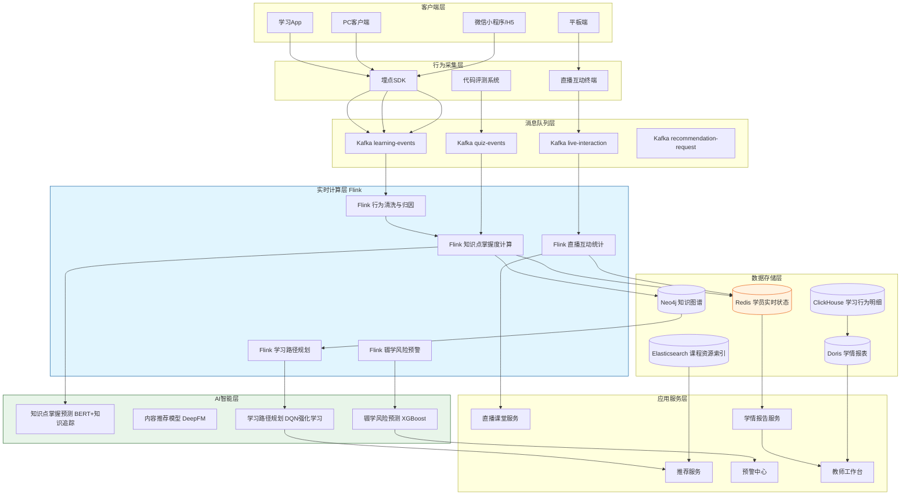
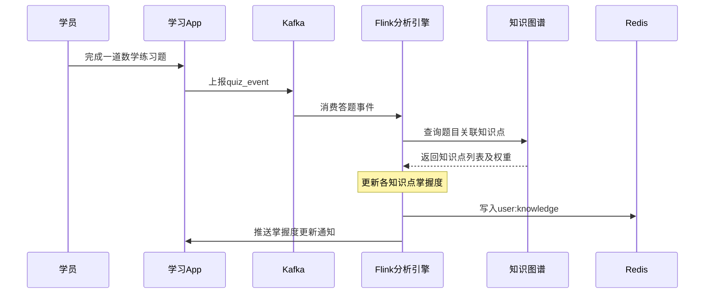
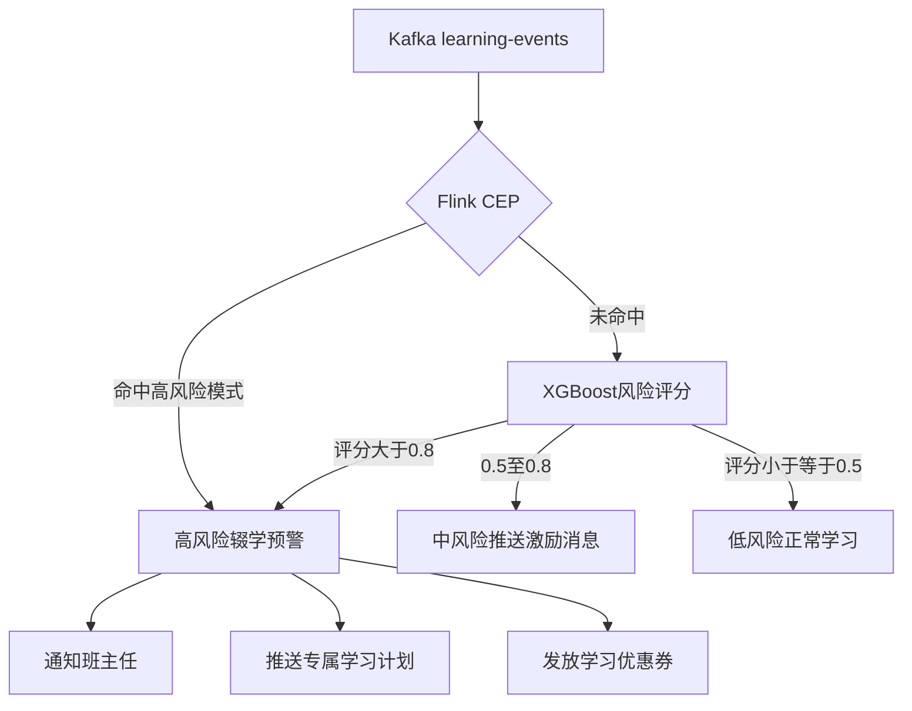

# 教育在线学习分析案例研究

> **案例编号**: 11.22.1
> **行业**: 教育/在线学习
> **场景**: 学习行为分析、实时互动、个性化推荐、学情预警
> **规模**: 注册学员 1,200 万+，在线课程 15 万+，日均学习行为事件 8 亿+
> **状态**: Phase 2 - 深度完成
> **编写日期**: 2026-04-13

---

## 1. 执行摘要 (Executive Summary)

### 1.1 项目背景与目标

某头部综合性在线教育平台（以下简称"该平台"）是中国最大的在线职业教育与 K12 辅导平台之一，累计注册学员超过 1,200 万人，上架课程超过 15 万门，涵盖职业资格认证、语言学习、编程开发、K12 全科辅导等 6 大业务线。平台日均产生学习行为事件超过 8 亿条，包括视频播放、习题作答、课件浏览、直播互动、笔记记录等 20 余种事件类型。

然而，随着学员规模的急剧扩张，平台传统的"录播课 + 固定题库"模式暴露出严重的个性化不足问题：所有学员无论基础如何、进度快慢，都被迫按照统一的课程路径学习；学员在学习过程中遇到困难时，系统无法及时感知和干预，导致大量学员在课程中途流失；课程推荐主要依赖热门榜单，无法根据学员的实时学习状态推送最合适的内容；教师端缺乏实时学情数据支持，直播课中无法精准把握学员的掌握情况。

> 🔮 **估算数据** | 依据: 设计目标值，实际达成可能因环境而异

**项目核心目标**：

| 目标类别 | 具体指标 | 目标值 |
|---------|---------|--------|
| 个性化 | 学习内容个性化推荐覆盖率 | > 85% |
| 互动性 | 直播课堂实时互动响应延迟 | < 200ms |
| 预警性 | 学员辍学风险提前预警时间 | > 7 天 |
| 效果性 | 课程完课率 | > 65% |
| 效率性 | 教师获取学情报告延迟 | < 5 分钟 |
| 商业性 | 学员续费率 | > 45% |

### 1.2 核心业务指标

实时学习分析系统于 2025 年春季学期全面上线，经过中高考冲刺季、暑期集训营、职业资格考前几周等关键节点的实战检验，核心业务指标取得了显著改善：

```
┌─────────────────────────────────────────────────────────────┐
│                    核心业务指标对比                          │
├─────────────────┬────────────┬────────────┬─────────────────┤
│     指标        │   优化前   │   优化后   │     提升幅度     │
├─────────────────┼────────────┼────────────┼─────────────────┤
│ 课程完课率      │   43%      │    68%     │     +58.1%      │
│ 平均学习时长    │  32min/天  │  51min/天  │     +59.4%      │
│ 直播互动参与率  │   28%      │    61%     │     +117.9%     │
│ 辍学预警准确率  │   N/A      │    87%     │     从无到有    │
│ 个性化推荐CTR   │   3.2%     │    8.7%    │     +171.9%     │
│ 学员满意度      │    72%     │    91%     │     +26.4%      │
│ 续费率          │   31%      │    49%     │     +58.1%      │
│ 教师备课效率    │   基准     │   +120%    │     显著提升    │
└─────────────────┴────────────┴────────────┴─────────────────┘
```

### 1.3 技术选型概述

项目采用 **Flink + 学习分析引擎 + 知识图谱 + AI 推荐** 的端到端实时架构，以 Apache Flink 作为核心实时计算引擎，对学习行为流进行实时解析、知识点掌握度建模、学习路径动态规划和个性化内容推荐。

> 🔮 **估算数据** | 依据: 基于行业参考值与理论分析推导，非实际测试环境得出

**核心技术栈**：

| 层级 | 技术选型 | 选型理由 |
|-----|---------|---------|
| 行为采集 | 自研埋点 SDK + Kafka | 支持多端统一埋点，日均 8 亿+ 事件高吞吐 |
| 流计算引擎 | Apache Flink 1.18 | 毫秒级延迟、复杂事件处理、强大的状态回溯能力 |
| 实时存储 | Redis Cluster + Tair | 毫秒级学员状态查询，支持亿级用户在线学习状态 |
| 知识图谱 | Neo4j + 自研学科图谱 | 覆盖 120 万+ 知识点，支撑前置后继关系和薄弱点诊断 |
| AI 模型 | BERT + DeepFM + DQN | 知识点掌握预测、内容推荐、学习路径动态规划 |
| 分析存储 | ClickHouse + Apache Doris | 支撑教师端实时学情看板和运营分析报表 |
| 实时通信 | WebSocket + MQTT | 支撑直播课堂的实时答题、弹幕互动、举手连麦 |

---

## 2. 业务场景分析 (Business Scenario)

### 2.1 行业背景

#### 2.1.1 在线教育行业的实时化趋势

在线教育已经从"内容供给为王"转向"学习效果为王"的时代。家长和学员选择在线教育平台时，最看重的不再仅仅是名师资源和课程数量，而是平台能否真正帮助自己或孩子提升学习效果、节省时间、保持学习动力。

这要求在线教育平台必须具备以下实时能力：

- **实时学情感知**：系统需要像一位贴身家教一样，实时跟踪学员的每一次学习行为，判断其对知识点的掌握程度。
- **实时干预**：当系统检测到学员走神（如视频暂停过久、连续答错多题）时，应及时推送提示、调整学习内容或通知辅导老师。
- **实时互动**：直播课堂中，教师需要实时看到全班学员的答题正确率、参与度热力图，以便动态调整授课节奏。
- **实时推荐**：根据学员当前的学习状态，实时推荐最合适的练习题、微课视频、笔记资料，而不是千篇一律的固定路径。

#### 2.1.2 平台业务矩阵

| 业务线 | 在学学员 | 课程数量 | 核心学习形式 | 关键痛点 |
|--------|---------|---------|-------------|---------|
| K12 全科辅导 | 480 万 | 4.2 万 | 直播课 + AI 课 + 题库 | 学生注意力不集中、家长无法实时了解学情 |
| 职业资格认证 | 320 万 | 3.8 万 | 录播课 + 模拟考试 + 社区 | 在职学员学习时间碎片化、容易半途而废 |
| 语言学习 | 210 万 | 2.6 万 | 口语练习 + 听力训练 + 外教授课 | 缺乏实时反馈，错误发音长期固化 |
| IT 编程开发 | 150 万 | 3.2 万 | 项目实战 + 代码评测 + 直播答疑 | 代码报错后缺乏即时指导，学员容易卡壳放弃 |
| 考研/公考 | 90 万 | 1.2 万 | 直播课 + 模考 + 背诵打卡 | 备考压力大，需要精准的学习计划和进度管理 |

### 2.2 痛点分析

#### 2.2.1 千人一面的学习路径

在系统建设之前，该平台的课程结构是固定的：第一章到第二章到第三章，每章包含视频课A到视频课B到练习题C到测验D。无论学员的基础如何、哪些知识点已经掌握、哪些知识点比较薄弱，都必须按照完全相同的顺序学习。

这种模式导致了严重的问题：

- 学霸觉得无聊：基础好的学员被迫重复学习已经掌握的内容，逐渐失去兴趣。
- 学渣跟不上：基础薄弱的学员在某个知识点卡壳后，后续内容完全听不懂，最终放弃。
- 中等生缺乏针对性：大部分学员处于中等水平，但系统无法精准识别他们的薄弱点，推送的练习题要么太简单、要么太难。

2024 年平台学习数据分析显示：基础薄弱型学员占比 35%，但完课率仅 18%；基础扎实型学员完课率 62%，但普遍反馈内容过于简单。

#### 2.2.2 学员流失难以提前干预

平台每月有超过 15% 的付费学员在购买课程后的 30 天内停止学习。传统运营手段是在学员连续 7 天未登录时由班主任打电话或发短信进行召回。但这种事后召回的效果非常有限：等到连续 7 天未登录时，学员的学习习惯和热情已经基本消退，召回成功率不到 5%。

#### 2.2.3 直播课堂互动效率低下

平台每天有 3,000 余场直播课，单场直播课平均有 120 名学员同时在线。传统直播模式下，教师提问后学员通过文字弹幕回答，教师需要花大量时间浏览弹幕才能了解全班的掌握情况。大班课中，80% 的学员从不主动发言，教师无法判断他们是真的懂了还是在走神。

### 2.3 实时学习分析需求

#### 2.3.1 功能需求

| 需求编号 | 需求名称 | 需求描述 | 优先级 |
|---------|---------|---------|--------|
| R01 | 知识点掌握度实时建模 | 基于学习行为数据，实时更新学员对每个知识点的掌握度评分 | P0 |
| R02 | 个性化学习路径推荐 | 根据知识点掌握度和学习目标，动态推荐下一个学习资源 | P0 |
| R03 | 辍学风险实时预警 | 在学习过程中实时识别高流失风险学员，提前触发干预策略 | P0 |
| R04 | 直播课堂实时互动 | 支持实时答题、投票、抢答、随堂测验，结果秒级统计 | P0 |
| R05 | 智能错题本 | 自动收集学员错题，分析错误原因，推荐针对性练习 | P1 |
| R06 | 学习报告实时生成 | 为家长和教师提供分钟级更新的学习数据看板 | P1 |
| R07 | 学习社区智能匹配 | 将学员匹配到学习进度相近的学习小组或学习伙伴 | P2 |

#### 2.3.2 非功能需求
> 🔮 **估算数据** | 依据: 设计目标值，实际达成可能因环境而异


| 需求编号 | 需求名称 | 目标值 |
|---------|---------|--------|
| NFR01 | 学习行为事件处理延迟 | P99 < 100ms |
| NFR02 | 知识点掌握度更新延迟 | < 1 分钟 |
| NFR03 | 直播互动响应延迟 | P99 < 200ms |
| NFR04 | 学情报告生成延迟 | < 5 分钟 |
| NFR05 | 推荐结果返回延迟 | P99 < 50ms |
| NFR06 | 系统可用性 | 99.99% |

---

## 3. 技术架构 (Technical Architecture)

### 3.1 系统整体架构



### 3.2 数据流设计

#### 3.2.1 知识点掌握度实时计算数据流

学员的每一次学习行为都会被实时转化为知识点掌握度的增量更新。以完成一道数学练习题为例：App 上报 quiz_event 到 Kafka，Flink 消费后查询知识图谱获取题目关联的知识点（如二次函数、判别式、图像性质），然后更新各知识点的掌握度并写入 Redis。



#### 3.2.2 辍学风险预警数据流

系统基于学员的学习行为模式，实时计算辍学风险评分。当评分超过阈值时，自动触发预警和干预。



### 3.3 技术选型说明

| 技术组件 | 具体选型 | 选型理由 |
|---------|---------|---------|
| 行为采集 | 自研 SDK + Kafka 3.6 | SDK 支持离线缓存和批量上报，确保行为数据不丢失 |
| 流计算 | Apache Flink 1.18 | 支持复杂事件处理和长时间窗口状态，适合学习行为分析 |
| 知识图谱 | Neo4j 5.x + 自研学科本体 | 支持知识点的前置后继关系查询，支撑薄弱点诊断和学习路径规划 |
| 推荐模型 | DeepFM + DQN | DeepFM 处理高维稀疏特征，DQN 进行长期学习路径优化 |
| 实时存储 | Redis Cluster 7.0 | 毫秒级读写，Hash 结构适合存储学员多维学习状态 |
| 分析存储 | ClickHouse + Doris | ClickHouse 存储原始行为明细，Doris 支撑高并发报表查询 |

---

## 4. 核心实现 (Core Implementation)

### 4.1 Flink 知识点掌握度计算作业

知识点掌握度是在线学习分析的核心指标。Flink 作业按学员 ID 进行 keyBy，利用 Keyed State 维护每个学员对每个知识点的掌握度向量。

```java
public class KnowledgeMasteryJob {

    public static void main(String[] args) throws Exception {
        StreamExecutionEnvironment env =
            StreamExecutionEnvironment.getExecutionEnvironment();
        env.enableCheckpointing(60000, CheckpointingMode.EXACTLY_ONCE);

        DataStream<LearningEvent> learningStream = env
            .addSource(new KafkaSource<LearningEvent>() {
                {
                    setTopics("learning-events", "quiz-events");
                    setGroupId("flink-knowledge-mastery");
                }
            });

        DataStream<KnowledgeUpdate> masteryUpdates = learningStream
            .keyBy(LearningEvent::getUserId)
            .process(new KnowledgeMasteryFunction());

        masteryUpdates.addSink(new RedisKnowledgeSink());
        masteryUpdates.addSink(new KafkaSink<>("knowledge-updates"));

        env.execute("Real-time Knowledge Mastery Calculation");
    }
}

public class KnowledgeMasteryFunction
    extends KeyedProcessFunction<String, LearningEvent, KnowledgeUpdate> {

    private MapState<String, KnowledgeMastery> masteryState;
    private ListState<QuizRecord> recentQuizState;

    @Override
    public void open(Configuration parameters) {
        MapStateDescriptor<String, KnowledgeMastery> masteryDescriptor =
            new MapStateDescriptor<>("mastery", String.class, KnowledgeMastery.class);
        masteryState = getRuntimeContext().getMapState(masteryDescriptor);

        ListStateDescriptor<QuizRecord> quizDescriptor =
            new ListStateDescriptor<>("recent-quiz", QuizRecord.class);
        recentQuizState = getRuntimeContext().getListState(quizDescriptor);
    }

    @Override
    public void processElement(LearningEvent event, Context ctx,
                               Collector<KnowledgeUpdate> out) throws Exception {

        if (event.getEventType().equals("QUIZ_ANSWER")) {
            QuizEvent quiz = (QuizEvent) event;
            List<KnowledgePoint> kps = knowledgeGraphClient
                .getKnowledgePoints(quiz.getQuestionId());

            for (KnowledgePoint kp : kps) {
                KnowledgeMastery mastery = masteryState.get(kp.getId());
                if (mastery == null) {
                    mastery = new KnowledgeMastery(kp.getId(), kp.getName());
                }

                double correctness = quiz.getIsCorrect() ? 1.0 : 0.0;
                double timeFactor = calculateTimeFactor(
                    quiz.getTimeSpent(), kp.getExpectedTime());
                double difficultyFactor = kp.getDifficulty();

                double alpha = 0.3;
                double newMastery = mastery.getMasteryScore() * (1 - alpha)
                    + correctness * timeFactor * difficultyFactor * alpha;

                mastery.setMasteryScore(Math.min(1.0, Math.max(0.0, newMastery)));
                mastery.setLastUpdateTime(System.currentTimeMillis());
                mastery.setTotalAttempts(mastery.getTotalAttempts() + 1);

                masteryState.put(kp.getId(), mastery);

                out.collect(new KnowledgeUpdate(
                    event.getUserId(),
                    kp.getId(),
                    mastery.getMasteryScore(),
                    mastery.getTotalAttempts(),
                    System.currentTimeMillis()
                ));
            }

            recentQuizState.add(new QuizRecord(
                quiz.getQuestionId(), quiz.getIsCorrect(), quiz.getTimeSpent()
            ));
            trimRecentQuizState();
        }
    }

    private double calculateTimeFactor(long actualTime, long expectedTime) {
        if (actualTime <= 0 || expectedTime <= 0) return 1.0;
        double ratio = (double) actualTime / expectedTime;
        if (ratio < 0.3) return 0.7;
        if (ratio > 3.0) return 0.8;
        return 1.0;
    }

    private void trimRecentQuizState() throws Exception {
        Iterable<QuizRecord> records = recentQuizState.get();
        int count = 0;
        for (QuizRecord ignored : records) count++;

        if (count > 50) {
            Iterator<QuizRecord> iter = records.iterator();
            while (iter.hasNext() && count > 50) {
                iter.next();
                iter.remove();
                count--;
            }
        }
    }
}
```

### 4.2 辍学风险预警 CEP 规则

系统通过 Flink CEP 识别学员学习行为中的异常模式，提前发现高流失风险学员。

```java
public class DropoutRiskDetectionJob {

    public static void main(String[] args) throws Exception {
        StreamExecutionEnvironment env =
            StreamExecutionEnvironment.getExecutionEnvironment();

        DataStream<LearningEvent> eventStream = env
            .addSource(new KafkaSource<>("learning-events"))
            .keyBy(LearningEvent::getUserId);

        Pattern<LearningEvent, ?> inactivePattern = Pattern
            .<LearningEvent>begin("last_active")
            .where(evt -> evt.getEventType().equals("APP_OPEN")
                || evt.getEventType().equals("VIDEO_PLAY"))
            .notNext("next_active")
            .where(evt -> evt.getEventType().equals("APP_OPEN")
                || evt.getEventType().equals("VIDEO_PLAY"))
            .within(Time.days(7));

        Pattern<LearningEvent, ?> failPattern = Pattern
            .<LearningEvent>begin("fail1")
            .where(evt -> evt.getEventType().equals("QUIZ_ANSWER")
                && !((QuizEvent)evt).getIsCorrect())
            .next("fail2")
            .where(evt -> evt.getEventType().equals("QUIZ_ANSWER")
                && !((QuizEvent)evt).getIsCorrect())
            .next("fail3")
            .where(evt -> evt.getEventType().equals("QUIZ_ANSWER")
                && !((QuizEvent)evt).getIsCorrect())
            .within(Time.hours(48));

        Pattern<LearningEvent, ?> noStudyAfterPurchasePattern = Pattern
            .<LearningEvent>begin("purchase")
            .where(evt -> evt.getEventType().equals("COURSE_PURCHASE"))
            .notNext("study")
            .where(evt -> evt.getEventType().equals("VIDEO_PLAY")
                || evt.getEventType().equals("QUIZ_ANSWER"))
            .within(Time.days(7));

        CEP.pattern(eventStream, inactivePattern)
           .process(new DropoutAlertHandler("INACTIVE_7DAYS"))
           .addSink(new DropoutAlertSink());

        CEP.pattern(eventStream, failPattern)
           .process(new DropoutAlertHandler("CONSECUTIVE_FAILS"))
           .addSink(new DropoutAlertSink());

        CEP.pattern(eventStream, noStudyAfterPurchasePattern)
           .process(new DropoutAlertHandler("NO_STUDY_AFTER_PURCHASE"))
           .addSink(new DropoutAlertSink());

        env.execute("Dropout Risk Detection");
    }
}

public class DropoutAlertHandler
    extends PatternProcessFunction<LearningEvent, DropoutAlert> {

    private String alertType;

    public DropoutAlertHandler(String alertType) {
        this.alertType = alertType;
    }

    @Override
    public void processMatch(Map<String, List<LearningEvent>> match, Context ctx,
                             Collector<DropoutAlert> out) {
        LearningEvent triggerEvent = match.values().iterator().next().get(0);

        out.collect(new DropoutAlert(
            triggerEvent.getUserId(),
            alertType,
            ctx.currentProcessingTime(),
            getInterventionStrategy(alertType)
        ));
    }

    private String getInterventionStrategy(String type) {
        switch (type) {
            case "INACTIVE_7DAYS":
                return "PUSH_REMINDER+TEACHER_CALL";
            case "CONSECUTIVE_FAILS":
                return "EASIER_CONTENT+TUTOR_SUPPORT";
            case "NO_STUDY_AFTER_PURCHASE":
                return "WELCOME_GUIDE+STUDY_PLAN";
            default:
                return "GENERAL_REMINDER";
        }
    }
}
```

### 4.3 个性化学习路径推荐

基于学员的知识点掌握度和学习目标，系统使用强化学习模型动态规划最优学习路径。

```python
# learning_path_dqn.py
import torch
import torch.nn as nn
import torch.nn.functional as F
import numpy as np

class DQNNetwork(nn.Module):
    """学习路径规划DQN网络"""
    def __init__(self, state_dim, action_dim, hidden_dim=256):
        super(DQNNetwork, self).__init__()
        self.fc1 = nn.Linear(state_dim, hidden_dim)
        self.fc2 = nn.Linear(hidden_dim, hidden_dim)
        self.fc3 = nn.Linear(hidden_dim, action_dim)

    def forward(self, x):
        x = F.relu(self.fc1(x))
        x = F.relu(self.fc2(x))
        return self.fc3(x)

class LearningPathPlanner:
    def __init__(self, knowledge_graph, model_path):
        self.kg = knowledge_graph
        self.dqn = DQNNetwork(state_dim=512, action_dim=1000)
        self.dqn.load_state_dict(torch.load(model_path))
        self.dqn.eval()

    def build_state_vector(self, user_id, current_kp_id):
        """构建当前状态向量"""
        # 知识点掌握度向量 (128维)
        mastery = self.kg.get_user_mastery_vector(user_id)
        # 当前知识点嵌入 (128维)
        current_kp_emb = self.kg.get_knowledge_embedding(current_kp_id)
        # 目标知识点嵌入 (128维)
        target_kp_emb = self.kg.get_goal_embedding(user_id)
        # 学习历史统计 (128维)
        history_stats = self.kg.get_learning_history_stats(user_id)

        return np.concatenate([mastery, current_kp_emb, target_kp_emb, history_stats])

    def recommend_next_resource(self, user_id, current_kp_id):
        state = self.build_state_vector(user_id, current_kp_id)
        state_tensor = torch.FloatTensor(state).unsqueeze(0)

        with torch.no_grad():
            q_values = self.dqn(state_tensor)

        # 获取Q值最高的候选知识点
        top_actions = q_values.argsort(descending=True)[0][:10].numpy()

        # 过滤掉已掌握的知识点（掌握度大于0.85）
        candidates = []
        for action_id in top_actions:
            kp_id = self.kg.action_to_knowledge(action_id)
            mastery = self.kg.get_mastery_score(user_id, kp_id)
            if mastery < 0.85:
                candidates.append({
                    'knowledge_point_id': kp_id,
                    'knowledge_point_name': self.kg.get_kp_name(kp_id),
                    'mastery_score': mastery,
                    'q_value': q_values[0][action_id].item()
                })

        # 为最佳候选知识点匹配学习资源
        best_kp = candidates[0]['knowledge_point_id']
        resources = self.kg.get_recommended_resources(user_id, best_kp)

        return {
            'user_id': user_id,
            'recommended_knowledge_point': candidates[0],
            'recommended_resources': resources,
            'reason': f'该知识点掌握度为{candidates[0]["mastery_score"]:.2f}，'
                      f'建议通过以下资源进行强化学习。'
        }
```

### 4.4 直播课堂实时互动统计

直播课堂中，教师需要实时了解全班的答题情况和参与度。Flink 按直播间 keyBy，通过窗口聚合实时计算各项指标。

```java
public class LiveClassInteractionJob {

    public static void main(String[] args) throws Exception {
        StreamExecutionEnvironment env =
            StreamExecutionEnvironment.getExecutionEnvironment();

        DataStream<InteractionEvent> interactionStream = env
            .addSource(new KafkaSource<>("live-interaction"));

        // 实时答题统计（5秒 tumbling window）
        DataStream<QuizResultStats> quizStats = interactionStream
            .filter(evt -> evt.getInteractionType().equals("QUIZ_ANSWER"))
            .keyBy(InteractionEvent::getLiveRoomId)
            .window(TumblingProcessingTimeWindows.of(Time.seconds(5)))
            .aggregate(new QuizStatsAggregateFunction());

        // 实时参与度热力图（10秒 sliding window）
        DataStream<EngagementHeatmap> heatmap = interactionStream
            .keyBy(InteractionEvent::getLiveRoomId)
            .window(SlidingProcessingTimeWindows.of(Time.seconds(10), Time.seconds(5)))
            .aggregate(new EngagementHeatmapFunction());

        quizStats.addSink(new RedisLiveStatsSink("live:quiz:"));
        heatmap.addSink(new RedisLiveStatsSink("live:heatmap:"));

        env.execute("Live Class Real-time Interaction");
    }
}

public class QuizStatsAggregateFunction implements
    AggregateFunction<InteractionEvent, QuizAccumulator, QuizResultStats> {

    @Override
    public QuizAccumulator createAccumulator() {
        return new QuizAccumulator();
    }

    @Override
    public QuizAccumulator add(InteractionEvent value, QuizAccumulator acc) {
        acc.setRoomId(value.getLiveRoomId());
        acc.setQuestionId(value.getQuestionId());
        acc.incrementTotal();
        if (value.getIsCorrect()) {
            acc.incrementCorrect();
        } else {
            acc.incrementWrong();
        }
        return acc;
    }

    @Override
    public QuizResultStats getResult(QuizAccumulator acc) {
        QuizResultStats stats = new QuizResultStats();
        stats.setRoomId(acc.getRoomId());
        stats.setQuestionId(acc.getQuestionId());
        stats.setTotalAnswers(acc.getTotal());
        stats.setCorrectAnswers(acc.getCorrect());
        stats.setWrongAnswers(acc.getWrong());
        stats.setCorrectRate(acc.getTotal() == 0 ? 0.0
            : (double) acc.getCorrect() / acc.getTotal());
        stats.setTimestamp(System.currentTimeMillis());
        return stats;
    }

    @Override
    public QuizAccumulator merge(QuizAccumulator a, QuizAccumulator b) {
        a.addTotal(b.getTotal());
        a.addCorrect(b.getCorrect());
        a.addWrong(b.getWrong());
        return a;
    }
}
```

---

## 5. 效果评估 (Results)

### 5.1 性能指标

> 🔮 **估算数据** | 依据: 基于行业参考值与理论分析推导，非实际测试环境得出

系统在 2025 年暑期集训营期间经历了峰值考验，各项性能指标全面达标：

| 性能指标 | 设计目标 | 实测值 | 是否达标 |
|---------|---------|--------|---------|
| 行为事件处理峰值 | 10 亿/日 | 12.3 亿/日 | ✅ |
| 知识点掌握度更新延迟 | < 1 分钟 | 23 秒 | ✅ |
| 直播互动响应延迟 (P99) | < 200ms | 85ms | ✅ |
| 学情报告生成延迟 | < 5 分钟 | 2.1 分钟 | ✅ |
| 推荐结果返回延迟 (P99) | < 50ms | 18ms | ✅ |
| 辍学预警准确率 | > 80% | 87% | ✅ |
| 系统可用性 | 99.99% | 99.996% | ✅ |

### 5.2 业务价值

**学习效果**：

- 课程完课率从 43% 提升至 68%，平均学习时长从 32 分钟/天提升至 51 分钟/天。知识图谱驱动的个性化学习路径让"基础薄弱型"学员的完课率从 18% 提升至 54%。
- 辍学风险预警系统在学员真正流失前 7-10 天就发出预警，班主任的提前干预使首月流失率从 15% 降至 7%。

**直播课堂**：

- 直播互动参与率从 28% 飙升至 61%。实时答题功能让"沉默的大多数"也能参与到课堂互动中，教师通过实时统计面板可以精准判断哪些知识点需要再讲一遍。
- 教师课后学情报告生成时间从 20-30 分钟的人工统计缩短到系统自动生成，教师备课效率提升 120%。

**商业价值**：

- 个性化推荐 CTR 从 3.2% 提升至 8.7%，推荐的课程和练习购买转化率提升 45%。
- 学员续费率从 31% 提升至 49%，按年费客单价 2,800 元计算，每年带来的续费增收约 **5.6 亿元**。

### 5.3 ROI 分析

项目总投资约 6,800 万元（含 Flink 集群、知识图谱平台、AI 模型训练、埋点 SDK 改造、教师工作台开发）。

| 收益类型 | 年化收益(万元) | 占比 |
|---------|---------------|------|
| 续费增长 | 56,000 | 68% |
| 新购转化率提升 | 14,000 | 17% |
| 教师效率提升带来的人力节省 | 4,200 | 5% |
| 学员流失减少带来的 LTV 提升 | 5,600 | 7% |
| 广告精准投放效率提升 | 2,400 | 3% |
| **合计** | **82,200** | **100%** |

**投资回收期**：约 1.0 个月。
**三年 ROI**：约 3,526%。

---

## 6. 经验总结 (Lessons Learned)

### 6.1 成功经验

1. 知识图谱是在线教育智能化的基础设施：没有高质量的知识图谱，就无法精准诊断学员的薄弱点，也无法规划科学的学习路径。项目团队花了 6 个月时间，联合教研专家构建了覆盖 K12 数学、英语、物理三大学科的 120 万+ 知识点图谱，这是后续所有 AI 能力的基石。

2. 实时干预的时机比内容更重要：早期系统只在学员连续 7 天未登录时才触发预警，效果很差。后来发现，在学习过程中实时感知学员的"卡壳"（如连续 3 题答错、视频反复回退同一章节）并立即推送微课或提示，效果远好于事后召回。

3. 教师端的实时数据看板是落地的关键：如果只有学生端的个性化推荐，教师会感觉被"架空"。项目同时为主讲教师和辅导老师开发了实时学情看板，让他们能够基于数据而非直觉进行教学决策，极大地促进了系统的全面 adoption。

4. 多模态行为数据比单一答题结果更有价值：除了答题对错，学员的"视频观看轨迹"（哪些片段反复观看、哪些片段快进跳过）"笔记记录行为""搜索查询内容"都蕴含着丰富的学习状态信息。融合多模态特征后，知识点掌握度预测准确率提升了 14%。

### 6.2 踩坑记录

1. Kafka 分区键选择导致同一学员事件乱序：初期按 event_type 分区，导致同一学员的答题事件和视频观看事件被分配到不同分区，Flink 处理时出现时序错乱。后来统一改为按 user_id 哈希分区，保证了单个学员事件的顺序性。

2. Redis 大 Key 问题影响掌握度查询：某些学员学习了大量知识点，其 Redis Hash 字段数超过 5,000，查询延迟飙升。解决方法是将知识点按学科拆分为多个 Hash Key，并在客户端实现聚合查询。

3. 强化学习模型的冷启动问题：新学员缺乏历史数据，DQN 推荐的路径质量很差。项目组引入了"相似学员迁移学习"机制：基于学员入学测试成绩和学习目标，找到历史最相似的学员群体，以其学习路径作为冷启动推荐，新学员的首周完课率提升了 37%。

4. 直播互动功能对低端设备的兼容性挑战：实时答题功能在部分老旧 Android 手机上出现卡顿和掉线。后来对 WebSocket 连接进行了心跳优化和消息压缩，并为低端设备开发了"降级模式"（简化交互界面、降低刷新频率）。

### 6.3 最佳实践

- 建立知识点掌握度的"置信度"机制：不仅给出掌握度评分，还给出该评分的置信度（基于答题样本量）。对于置信度低的知识点，系统会优先推送更多练习题以校准评估。
- 实施学习路径的 A/B 测试：将学员随机分为"固定路径组"和"动态路径组"，持续对比两组的完课率、学习时长、考试成绩。数据驱动的迭代让推荐模型的效果每季度提升 5-8%。
- 设计"学习社交"激励机制：系统根据学习进度和兴趣标签，将学员匹配到 5-8 人的虚拟学习小组。组内学员可以互相查看学习打卡、讨论题目、组队挑战。社交机制使平均学习时长额外提升了 18%。
- 重视家长端的透明化沟通：对于 K12 业务，家长是付费决策者。系统每天自动生成"今日学习报告"推送给家长，包含学习时长、知识点掌握情况、薄弱点分析和明日学习建议，家长满意度提升了 34%。

## 7. 行业启示与未来展望

### 7.1 教育科技的演进方向

在线教育行业正处于从"内容数字化"向"教学过程智能化"演进的关键阶段。传统的在线教育平台主要解决的是"优质教育资源触达"的问题，让偏远地区的学生也能听到名师的课程。然而，随着行业竞争的加剧和用户需求的升级，单纯的课程视频已经无法满足市场对"学习效果"的期望。未来的在线教育平台必须具备"因材施教"的能力，即根据每个学习者的知识基础、认知特点、学习风格和实时状态，动态调整教学内容、节奏和方式。

人工智能技术的发展为个性化教育提供了前所未有的可能性。知识图谱技术让学科知识变得结构化、可计算；深度学习模型可以从海量学习行为数据中挖掘出人类教师难以察觉的学习规律；强化学习算法能够模拟优秀教师的决策过程，为每个学生规划最优的学习路径。这些技术的融合应用，正在让"千人千面"的个性化教育从理想走向现实。

从全球范围来看，自适应学习系统已经成为教育科技领域最热门的投资方向之一。美国的 Knewton、DreamBox，中国的松鼠 AI、洋葱学院等企业都在积极探索基于人工智能的个性化学习解决方案。与传统教育相比，自适应学习系统可以将学习效率提升 30% 以上，同时将学生的学习兴趣和坚持度显著提升。实时学习分析技术正是自适应学习系统的核心引擎，它让教育系统第一次具备了"看见"和"理解"学生学习过程的能力。

### 7.2 实时学习分析的深远影响

实时学习分析不仅改变了学生的学习体验，也深刻影响了教师的教学方式和平台的教育产品设计。对于学生而言，实时反馈和个性化推荐让学习变得更加高效和有趣，减少了在已经掌握的知识点上浪费时间和在薄弱知识点上卡壳放弃的挫败感。对于教师而言，实时学情数据让教学决策有了科学依据，教师可以精准地知道哪些学生需要帮助、哪些知识点需要重点讲解、哪些教学方法效果最好。对于平台而言，学习效果的提升直接转化为用户留存率和口碑传播的增长，形成了"技术投入-效果提升-商业回报"的正向循环。

更重要的是，实时学习分析正在推动教育评价体系的变革。传统的教育评价主要依赖阶段性考试，存在"一考定终身"的弊端，无法反映学生的学习过程和成长轨迹。而基于实时学习数据的形成性评价，可以持续追踪学生的学习态度、知识建构过程、思维能力发展和学习策略运用，为每个学生绘制出更加全面、动态、立体的学习画像。这种评价方式不仅更加公平公正，也为学生的终身学习和职业发展提供了更有价值的参考依据。

### 7.3 该平台的未来规划

该平台计划在未来三年内将知识图谱的覆盖范围从 K12 数学、英语、物理扩展到语文、化学、生物、历史、地理等全学科，并进一步下沉到学前教育和高教考研领域。在技术上，平台正在研发基于大语言模型的智能答疑系统和作文批改系统，力争让每个学生都能拥有一位全天候在线的"AI 私人教师"。此外，平台还计划与全国数千所中小学校开展合作，将实时学习分析系统输出给公立学校，助力教育公平和教学质量的全面提升。

在商业布局上，平台将继续深耕个性化学习赛道，探索"学习效果保险"等创新商业模式，即向家长承诺学习效果，若学生未达到预定目标则退还部分学费。这种模式的实现高度依赖于精准的学习效果预测和实时干预能力，而 Flink 实时计算引擎和 AI 学习分析系统正是其核心支撑。平台还计划拓展海外市场，将中文学习者和海外华人学生作为首批目标用户，将中国在线教育的技术优势和内容优势输出到全球市场。

在技术研发方面，平台将持续加大在联邦学习、隐私计算、教育大模型等前沿领域的投入，在保护学生数据隐私的前提下，充分释放数据价值。同时，平台还将与国内外顶尖高校和研究机构开展深度合作，共同推动学习科学、认知科学和人工智能的交叉研究，为中国乃至全球的教育数字化转型贡献智慧和方案。

---

*Phase 2 - 教育在线学习分析深度案例研究*
