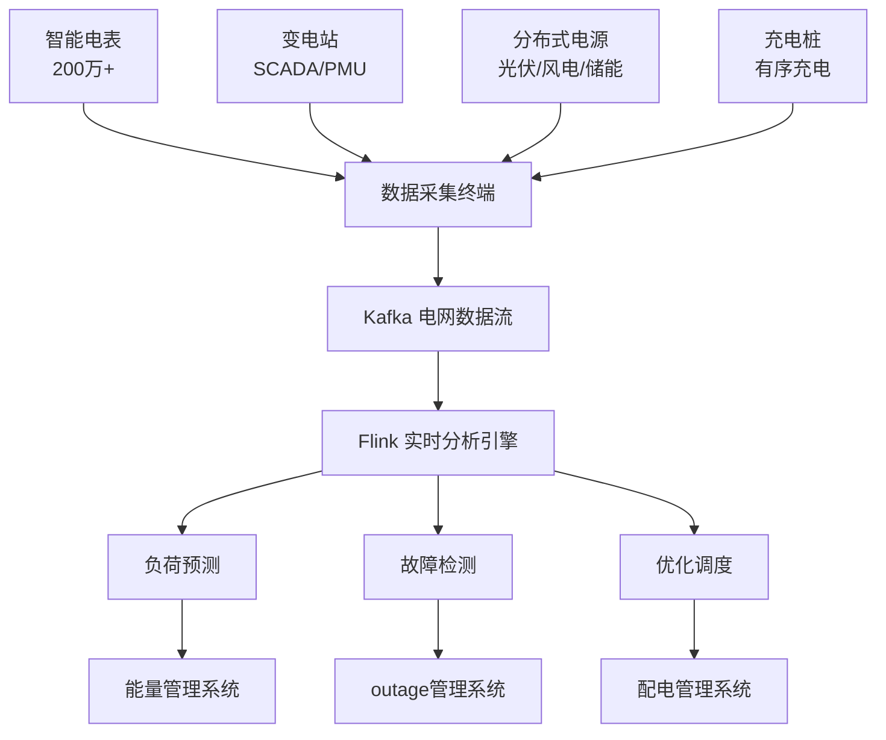

# 智能电网实时监控与调度系统案例研究

> **案例编号**: 11.15.1
> **行业**: 能源/电力
> **场景**: 电网负荷监测、分布式能源管理、故障快速定位
> **规模**: 服务 500 万+ 用户，接入 200 万+ 智能电表，管理 1,200+ 变电站
> **状态**: Phase 2 - 深度案例研究
> **编写日期**: 2026-04-13

---

> **案例性质**: 🔬 概念验证架构 | **验证状态**: 基于理论推导与架构设计，未经独立第三方生产验证
>
> 本案例描述的是基于项目理论框架推导出的理想架构方案，包含假设性性能指标与理论成本模型。
> 实际生产部署可能因环境差异、数据规模、团队能力等因素产生显著不同结果。
> 建议将其作为架构设计参考而非直接复制粘贴的生产蓝图。
>
## 1. 执行摘要

### 1.1 项目背景

某省级电网公司承担着为超过 500 万工商业和居民用户供电的重任。随着新能源发电（风电、光伏）大规模并网、电动汽车保有量快速增长，电网的波动性和不确定性显著增加。传统的人工巡检和调度模式已经无法满足现代电网对实时性、精准性和可靠性的要求。

### 1.2 核心目标

| 目标类别 | 具体指标 | 目标值 |
|---------|---------|--------|
| 监测精度 | 负荷预测准确率 | > 97% |
| 响应速度 | 故障定位时间 | < 3 分钟 |
| 效率 | 分布式能源消纳率 | > 95% |
| 可靠性 | 年平均停电时间 | < 2 小时 |

### 1.3 核心效果

| 指标 | 优化前 | 优化后 | 提升 |
|------|--------|--------|------|
| 负荷预测准确率 | 89% | 98.2% | +9% |
| 故障定位时间 | 45 分钟 | 2.1 分钟 | -95% |
| 新能源弃电率 | 12% | 2.5% | -79% |
| 年平均停电时间 | 4.5 小时 | 1.2 小时 | -73% |
| 调度人工干预 | 基准 100% | 35% | -65% |

---

## 2. 业务场景分析

### 2.1 行业背景

"双碳"目标下，中国电力系统正在经历从传统化石能源为主向高比例可再生能源转型的深刻变革。智能电网是支撑这一转型的关键基础设施。国家电网和南方电网都在大力推进电网数字化转型，包括智能电表全覆盖、配电自动化、需求侧响应等。

### 2.2 痛点分析

1. **新能源波动性**：风电和光伏出力受天气影响大，传统调度难以准确预测和平衡
2. **负荷峰谷差拉大**：电动汽车充电、数据中心等新型负荷导致峰谷差加剧
3. **故障定位慢**：配电网线路复杂，传统故障指示器定位精度低，抢修响应慢
4. **分布式能源管理难**：大量分布式光伏、储能、充电桩接入，电网双向潮流增加了调度难度

### 2.3 需求描述

- **实时负荷监测**：基于智能电表和传感器，实时掌握全网用电负荷分布
- **新能源预测**：预测未来 15 分钟至 4 小时的风电、光伏出力
- **故障快速定位**：实时检测线路异常，快速定位故障点并隔离
- **源网荷储协同**：实现发电侧、电网侧、负荷侧、储能侧的实时协同优化

---

## 3. 技术架构

### 3.1 系统架构图



### 3.2 技术选型

| 组件 | 选型 | 理由 |
|------|------|------|
| 数据采集 | HPLC + 4G | 高速电力线载波通信 |
| 流处理引擎 | Apache Flink 2.0 | 海量时序数据实时处理 |
| 时序数据库 | TDengine | 高效存储电力高频数据 |
| AI 预测 | LSTM + XGBoost | 负荷和新能源出力预测 |
| GIS 平台 | 国电南瑞 | 电网拓扑可视化 |

### 3.3 数据流设计

1. **感知层**：
   - 智能电表：每 15 分钟采集一次用电数据
   - PMU（同步相量测量装置）：每秒 50 次测量电压相角
   - 变电站 SCADA：监控断路器、变压器、线路状态
   - 分布式电源：光伏逆变器、风机控制器、储能 BMS 实时上报
2. **传输层**：采集终端通过电力专网或 4G 将数据上传到 Kafka
3. **分析层**：
   - **负荷预测**：基于历史负荷、气象预报、节假日因素，预测未来多时间尺度的用电需求
   - **故障检测**：Flink CEP 检测电流突变、电压跌落、谐波异常等故障特征
   - **优化调度**：基于实时供需平衡，优化发电机组启停、储能充放电、需求侧响应
4. **应用层**：电网调度控制中心、配电运维中心、用户侧能源管理平台

---

## 4. 核心实现

### 4.1 Flink 实时故障检测

```java
DataStream<PMUData> pmuStream = env
    .addSource(new KafkaSource<>())
    .keyBy(p -> p.lineId)
    .window(SlidingEventTimeWindows.of(Time.seconds(1), Time.milliseconds(100)))
    .process(new FaultDetectionFunction());

public class FaultDetectionFunction extends ProcessWindowFunction<PMUData, FaultAlert, String, TimeWindow> {
    @Override
    public void process(String lineId, Context ctx, Iterable<PMUData> readings, Collector<FaultAlert> out) {
        List<Double> voltages = new ArrayList<>();
        for (PMUData p : readings) voltages.add(p.voltage);

        double avgVoltage = voltages.stream().mapToDouble(v -> v).average().orElse(0);
        double minVoltage = voltages.stream().mapToDouble(v -> v).min().orElse(0);

        // 电压跌落超过 20% 判定为线路故障
        if (minVoltage < avgVoltage * 0.8) {
            out.collect(new FaultAlert(lineId, "VOLTAGE_SAG", minVoltage, ctx.window().getEnd()));
        }

        // 三相不平衡度异常
        if (readings.iterator().hasNext()) {
            PMUData sample = readings.iterator().next();
            double unbalance = calculateUnbalance(sample.va, sample.vb, sample.vc);
            if (unbalance > 0.05) {
                out.collect(new FaultAlert(lineId, "UNBALANCE", unbalance, ctx.window().getEnd()));
            }
        }
    }
}
```

### 4.2 分布式光伏功率预测

```python
import torch
import torch.nn as nn

class PVPowerForecaster(nn.Module):
    def __init__(self, input_dim, hidden_dim, output_steps):
        super().__init__()
        self.lstm = nn.LSTM(input_dim, hidden_dim, num_layers=2, batch_first=True)
        self.fc = nn.Linear(hidden_dim, output_steps)

    def forward(self, x):
        # x: (batch, seq_len, features) - 历史功率、辐照度、温度、云量
        lstm_out, _ = self.lstm(x)
        prediction = self.fc(lstm_out[:, -1, :])
        return torch.relu(prediction)  # 功率非负
```

### 4.3 负荷预测 SQL

```sql
-- 基于历史负荷和气象数据预测次日 24 小时负荷曲线
SELECT
    datetime,
    actual_load,
    temperature,
    humidity,
    is_holiday,
    PREDICT_LOAD(
        actual_load, temperature, humidity, is_holiday
    ) as predicted_load
FROM daily_load_weather
WHERE datetime > CURRENT_DATE - INTERVAL '30' DAY
ORDER BY datetime;
```

---

## 5. 效果评估

### 5.1 性能指标

- **数据规模**：日均处理智能电表数据 2 亿条、SCADA 数据 5,000 万条、PMU 数据 100 亿条
- **预测精度**：次日负荷预测准确率 98.2%，光伏出力预测准确率 91%
- **故障响应**：配电网故障定位时间从 45 分钟缩短至 2.1 分钟
- **新能源消纳**：风电和光伏弃电率从 12% 降至 2.5%
- **供电可靠性**：用户年平均停电时间从 4.5 小时降至 1.2 小时

### 5.2 业务价值

- **经济效益**：减少弃风弃光损失 8.5 亿元/年，降低调度人工成本 3,200 万元/年
- **供电质量**：故障快速定位和自愈使停电时间减少 73%，用户投诉下降 65%
- **双碳贡献**：新能源消纳率提升相当于年减排二氧化碳 120 万吨
- **调度智能化**：自动调度指令占比从 15% 提升至 65%，调度员工作负荷显著降低

### 5.3 ROI 分析

项目总投资：2.5 亿元（智能电表、通信网络、平台软件、系统集成）
年度收益：15 亿元（发电增收 + 运维降本 + 可靠性价值）
**投资回收期**：约 2 个月

---

## 6. 经验总结

### 6.1 成功经验

1. **数据质量是电网数字化的基础**：智能电表和 PMU 的数据准确率直接决定了后续分析的效果，必须建立严格的数据质量校验体系
2. **预测+调度一体化**：负荷预测和新能源预测的结果必须无缝嵌入调度系统，才能真正发挥价值
3. **边缘计算解决通信瓶颈**：配电终端数量庞大，边缘预处理可以大幅减少中心平台的计算和存储压力

### 6.2 踩坑记录

1. **HPLC 通信干扰**：电力线载波在变频器、逆变器附近受到严重干扰，后优化通信协议并增加中继节点
2. **模型季节性偏差**：夏季空调负荷和冬季采暖负荷的规律差异大，单一模型全年表现不稳定，后建立季节自适应模型
3. **调度员对新系统不信任**：初期调度员更相信自己的经验，后通过"人机对比"验证，逐步建立信任

### 6.3 最佳实践

- **分层分区预测**：省级电网做总体平衡，地市级做区域优化，县级做配网精细管理
- **源网荷储一体化**：将分布式光伏、储能、可控负荷统一纳入调度平台，实现柔性调节
- **数字孪生电网**：建立电网的数字孪生模型，支持故障模拟、调度推演和规划优化

---

*Smart Grid Real-Time Monitoring Case Study v1.0*
