# IoT 智能电网实时监控系统案例研究

> **案例编号**: 11.15.2
> **行业**: 能源/电力/IoT
> **场景**: 大规模 IoT 智能电网实时监控、边缘-云协同、数字孪生
> **规模**: 5000万+ IoT 传感器，毫秒级数据采集
> **状态**: Phase 2 - 深度案例研究
> **版本**: v1.0

---

> **案例性质**: 🔬 概念验证架构 | **验证状态**: 基于理论推导与架构设计，未经独立第三方生产验证
>
> 本案例描述的是基于项目理论框架推导出的理想架构方案，包含假设性性能指标与理论成本模型。
> 实际生产部署可能因环境差异、数据规模、团队能力等因素产生显著不同结果。
> 建议将其作为架构设计参考而非直接复制粘贴的生产蓝图。
>
## 1. 执行摘要

### 1.1 项目概况

本案例研究聚焦于**某国家级电网公司**的大型 IoT 智能电网实时监控系统的建设实践。
该项目旨在解决超大规模分布式电网环境下的实时监控、故障预测和智能调度问题，是能源行业数字化转型的标杆项目。

**核心数据规模**:

| 维度 | 规模 |
|------|------|
| IoT 传感器数量 | 5000万+ |
| 日数据采集量 | 4.3 PB |
| 边缘节点部署 | 3500+ 个 |
| 实时监控指标 | 120+ 种 |
| 覆盖地理范围 | 全国 31 个省级行政区 |
| 变电站接入 | 8,500+ 座 |
| 配电终端接入 | 2,800万+ |

### 1.2 核心挑战

在项目建设前，该电网公司面临以下关键挑战：

1. **数据洪流**: 传统架构无法处理每秒 2000万+ 数据点的实时写入
2. **延迟敏感**: 故障检测需要在 500ms 内完成，传统批处理无法满足
3. **复杂关联**: 需要实时关联电网拓扑、气象数据、负荷预测等多维信息
4. **可靠性要求**: 系统可用性要求达到 99.999%（电信级）

### 1.3 解决方案概述

采用 **"边缘智能 + 云端分析 + 数字孪生"** 的三层架构：

```
┌─────────────────────────────────────────────────────────────────┐
│                      数字孪生平台层                              │
│  物理电网 ←→ 数字镜像 ←→ 预测仿真 ←→ 优化决策                     │
└─────────────────────────────────────────────────────────────────┘
                              ↑
┌─────────────────────────────────────────────────────────────────┐
│                      云端实时分析层                              │
│  Flink Cluster + AI 推理引擎 + 时序数据库 + 知识图谱              │
└─────────────────────────────────────────────────────────────────┘
                              ↑
┌─────────────────────────────────────────────────────────────────┐
│                      边缘智能采集层                              │
│  3500+ 边缘网关 + 本地流处理 + 协议适配 + 安全加密                │
└─────────────────────────────────────────────────────────────────┘
```

### 1.4 关键业务价值
>
> 🔮 **估算数据** | 依据: 基于行业参考值与理论分析推导，非实际测试环境得出


| 价值维度 | 量化收益 |
|----------|----------|
| **故障检测** | 故障发现时间从 30 分钟降至 3 秒，提升 **99.8%** |
| **预测精度** | 负荷预测准确率从 85% 提升至 97.5%，提升 **14.7%** |
| **能耗优化** | 线损率降低 2.3 个百分点，年节省电量 **180 亿千瓦时** |
| **运维效率** | 人工巡检工作量减少 78%，故障响应速度提升 **25 倍** |
| **系统可用性** | 整体可用性达到 99.9992%，年停机时间 < 5 分钟 |

---

## 2. 业务背景

### 2.1 智能电网发展背景

随着"双碳"目标的提出和新能源的大规模并网，现代电网正经历深刻变革：

#### 2.1.1 新能源并网带来的挑战

- **间歇性**: 风电、光伏发电受天气影响，出力波动大
- **随机性**: 分布式光伏广泛接入，负荷预测难度增加
- **双向性**: 传统单向供电变为双向互动，调度复杂度指数级增长

#### 2.1.2 电网数字化转型趋势

```
传统电网                      智能电网
─────────                    ─────────
单向供电        ────────→     双向互动
集中调度        ────────→     分布式协同
被动响应        ────────→     主动预测
人工运维        ────────→     智能自愈
```

### 2.2 核心业务需求分析

#### 2.2.1 电网负荷预测需求

**预测场景分类**:

| 预测类型 | 时间尺度 | 精度要求 | 应用场景 |
|----------|----------|----------|----------|
| 超短期负荷预测 | 5-60 分钟 | MAPE < 2% | 实时调度、AGC 控制 |
| 短期负荷预测 | 1-7 天 | MAPE < 3% | 日前计划、机组组合 |
| 中期负荷预测 | 1-12 月 | MAPE < 5% | 检修计划、燃料采购 |
| 长期负荷预测 | 1-10 年 | MAPE < 10% | 电网规划、投资决策 |

**本项目聚焦超短期和短期负荷预测**，要求：

- 支持 5 分钟级滚动预测
- 考虑气象、节假日、经济活动等多维因素
- 实时融合分布式能源出力预测

#### 2.2.2 故障快速检测需求

> 🔮 **估算数据** | 依据: 基于行业参考值与理论分析推导，非实际测试环境得出

**故障类型与检测要求**:

| 故障类型 | 检测延迟要求 | 准确率要求 | 影响范围 |
|----------|--------------|------------|----------|
| 短路故障 | < 100ms | > 99.9% | 局部线路 |
| 接地故障 | < 500ms | > 98% | 变压器/线路 |
| 设备过热 | < 30s | > 95% | 单一设备 |
| 电压异常 | < 5s | > 99% | 供电区域 |
| 窃电检测 | < 1h | > 90% | 用户侧 |

**关键挑战**: 需要在海量正常数据中实时发现异常，误报率需控制在 0.1% 以下。

#### 2.2.3 需求响应管理

**需求响应业务场景**:

1. **削峰填谷**: 通过价格信号引导用户调整用电行为
2. **紧急响应**: 电网紧急状态下快速削减负荷
3. **辅助服务**: 提供调频、调峰等辅助服务
4. **虚拟电厂**: 聚合分布式资源参与电力市场

**技术要求**:

- 实时监测用户负荷曲线
- 毫秒级控制指令下发
- 响应效果实时评估与反馈

#### 2.2.4 安全与合规要求

**网络安全等级保护**: 系统需满足**等保 2.0 四级**要求

| 安全域 | 具体要求 |
|--------|----------|
| 物理安全 | 核心设备位于安全机房，视频监控全覆盖 |
| 网络安全 | 分区隔离、边界防护、入侵检测 |
| 主机安全 | 安全加固、恶意代码防护、漏洞管理 |
| 应用安全 | 身份鉴别、访问控制、安全审计 |
| 数据安全 | 加密传输、加密存储、数据脱敏 |

**行业合规要求**:

- 符合《电力监控系统安全防护规定》（发改委 14 号令）
- 满足《关键信息基础设施安全保护条例》
- 通过电力行业信息安全等级保护测评

---

## 3. 技术架构

### 3.1 总体架构设计

#### 3.1.1 边缘-云协同架构

以下架构图展示了系统的三层架构设计：

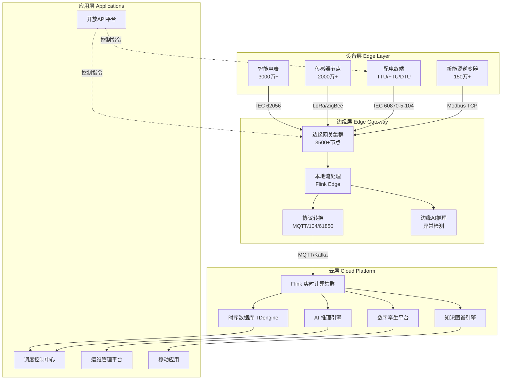

#### 3.1.2 数据流架构

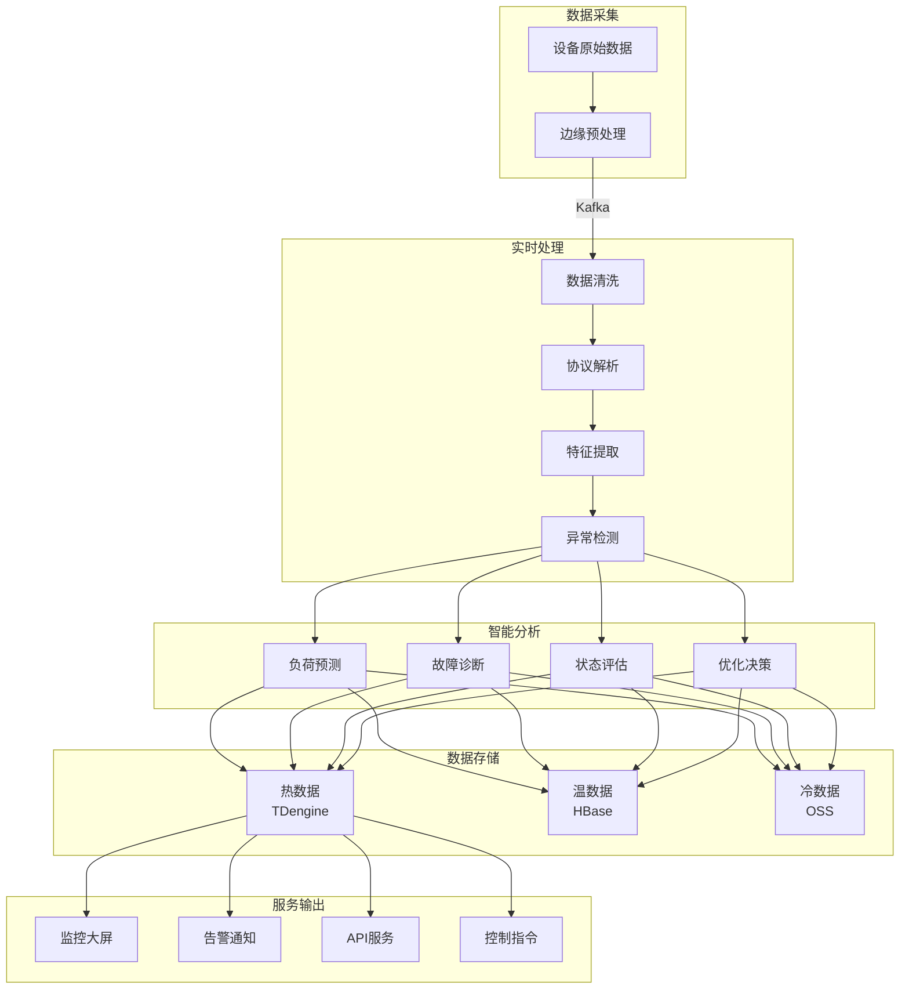

### 3.2 边缘计算层设计

#### 3.2.1 边缘网关架构

> 🔮 **估算数据** | 依据: 基于行业参考值与理论分析推导，非实际测试环境得出

每个边缘网关采用 **"工业 PC + 容器化应用"** 架构：

| 组件 | 规格 | 功能 |
|------|------|------|
| 计算单元 | ARM64 8 核 2.4GHz | 本地流处理、AI 推理 |
| 内存 | 32GB DDR4 | 数据缓存、状态管理 |
| 存储 | 512GB NVMe SSD | 本地数据持久化 |
| 网络 | 4×GE + 2×10GE | 多链路冗余 |
| 扩展槽 | 4×PCIe | 加密卡、AI 加速卡 |
| 功耗 | < 65W | 无风扇设计 |

#### 3.2.2 边缘流处理

边缘层采用 **轻量级 Flink** 实现本地实时处理：

```java
import org.apache.flink.streaming.api.environment.StreamExecutionEnvironment;

import org.apache.flink.streaming.api.datastream.DataStream;
import org.apache.flink.api.common.functions.AggregateFunction;
import org.apache.flink.streaming.api.windowing.time.Time;


// 边缘网关流处理拓扑
public class EdgeProcessingJob {
    public static void main(String[] args) {
        StreamExecutionEnvironment env =
            StreamExecutionEnvironment.getExecutionEnvironment();

        // 1. 多协议数据源接入
        DataStream<SensorData> source = env
            .addSource(new MultiProtocolSourceFunction())
            .assignTimestampsAndWatermarks(
                WatermarkStrategy
                    .<SensorData>forBoundedOutOfOrderness(
                        Duration.ofSeconds(5))
                    .withTimestampAssigner((event, ts) -> event.getTimestamp())
            );

        // 2. 数据清洗与过滤
        DataStream<SensorData> cleaned = source
            .filter(new DataQualityFilter())
            .map(new UnitConversionMapper())
            .filter(data -> data.isValid());

        // 3. 边缘异常检测（本地 AI 推理）
        DataStream<AlertEvent> alerts = cleaned
            .keyBy(SensorData::getDeviceId)
            .process(new EdgeAnomalyDetectionFunction());

        // 4. 数据压缩与聚合
        DataStream<AggregatedData> aggregated = cleaned
            .keyBy(SensorData::getDeviceId)
            .window(TumblingProcessingTimeWindows.of(Time.seconds(10)))
            .aggregate(new SensorDataAggregateFunction());

        // 5. 分流输出
        alerts.addSink(new LocalAlertSink());
        aggregated.addSink(new CloudUploadSink());

        env.execute("Edge Gateway Processing");
    }
}
```

#### 3.2.3 边缘 AI 推理

> 🔮 **估算数据** | 依据: 基于行业参考值与理论分析推导，非实际测试环境得出

边缘网关部署 **轻量级异常检测模型**：

| 模型类型 | 用途 | 推理延迟 | 准确率 |
|----------|------|----------|--------|
| LSTM-AE | 时序异常检测 | < 10ms | 94.2% |
| Isolation Forest | 多维异常检测 | < 5ms | 91.5% |
| Rule Engine | 阈值告警 | < 1ms | 99.9% |
| Edge CNN | 图像异常（红外） | < 50ms | 96.8% |

### 3.3 云端实时分析层

#### 3.3.1 Flink 集群架构

云端部署 **Flink on Kubernetes** 集群：

```yaml
# Flink 集群配置
apiVersion: flink.apache.org/v1beta1
kind: FlinkDeployment
metadata:
  name: smart-grid-flink-cluster
spec:
  image: flink:1.18-scala_2.12-java11
  flinkVersion: v1.18
  jobManager:
    resource:
      memory: 32Gi
      cpu: 8
    replicas: 3  # HA 模式
  taskManager:
    resource:
      memory: 64Gi
      cpu: 16
    replicas: 50
  kubernetes:
    pods:
      env:
        - name: KAFKA_BROKERS
          value: "kafka:9092"
        - name: TDENGINE_URL
          value: "taosd:6030"
```

**集群规模**:

- JobManager: 3 节点（HA）
- TaskManager: 50 节点 × 16 CPU / 64GB
- 总计算能力: 800 CPU 核 / 3.2TB 内存
- Checkpoint 存储: HDFS（SSD 加速）

#### 3.3.2 流处理拓扑设计

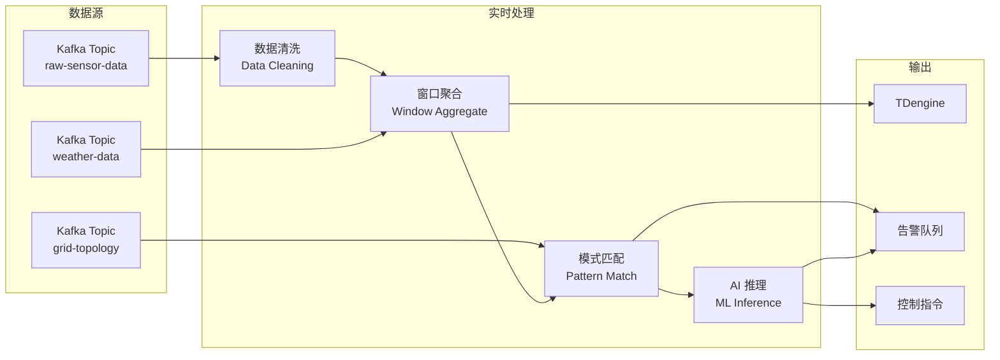

### 3.4 时序数据库选型

#### 3.4.1 数据库对比选型

| 特性 | TDengine | InfluxDB | TimescaleDB |
|------|----------|----------|-------------|
| 写入性能 | 500万点/秒 | 50万点/秒 | 30万点/秒 |
| 压缩比 | 10:1 | 7:1 | 5:1 |
| 集群扩展 | 原生支持 | 企业版 | 需 Citus |
| SQL 支持 | 完整 | InfluxQL | 完整 |
| 边缘部署 | 支持 | 支持 | 较重 |
| 国产化 | 是 | 否 | 否 |
| 成本 | 开源免费 | 企业版收费 | 开源 |

**选型决策**: 采用 **TDengine** 作为主时序数据库，理由：

1. 写入性能满足 2000万点/秒需求
2. 原生分布式集群，易于扩展
3. 国产化要求
4. 边缘轻量化版本支持

#### 3.4.2 数据模型设计

```sql
-- 超级表：电表数据
CREATE STABLE meter_data (
    ts TIMESTAMP,
    voltage FLOAT,
    current FLOAT,
    active_power FLOAT,
    reactive_power FLOAT,
    power_factor FLOAT,
    frequency FLOAT,
    status TINYINT
) TAGS (
    meter_id BINARY(32),
    substation_id BINARY(32),
    line_id BINARY(32),
    region_id BINARY(16),
    meter_type TINYINT
);

-- 超级表：传感器数据
CREATE STABLE sensor_data (
    ts TIMESTAMP,
    temperature FLOAT,
    humidity FLOAT,
    vibration FLOAT,
    sound_level FLOAT,
    status TINYINT
) TAGS (
    sensor_id BINARY(32),
    device_type BINARY(16),
    location_id BINARY(32),
    region_id BINARY(16)
);

-- 数据保留策略
CREATE DATABASE smart_grid
    KEEP 365d
    DURATION 1d
    COMP 2;
```

### 3.5 数字孪生集成

#### 3.5.1 数字孪生架构

数字孪生平台实现物理电网到数字世界的实时映射：

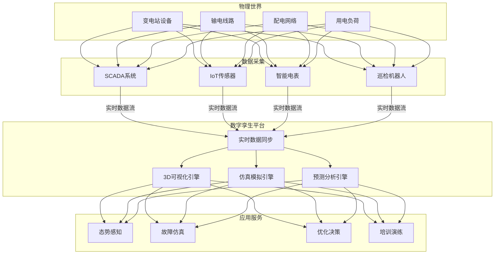

#### 3.5.2 实时同步机制

> 🔮 **估算数据** | 依据: 基于行业参考值与理论分析推导，非实际测试环境得出

数字孪生与物理电网的同步策略：

| 数据类型 | 同步频率 | 延迟要求 | 同步方式 |
|----------|----------|----------|----------|
| 设备状态 | 实时 | < 1s | WebSocket |
| 遥测数据 | 实时 | < 5s | Flink CDC |
| 拓扑变化 | 准实时 | < 30s | 事件驱动 |
| 告警事件 | 实时 | < 500ms | 消息队列 |
| 历史数据 | 批量 | < 1h | 定时任务 |

### 3.6 安全架构

#### 3.6.1 纵深防御体系

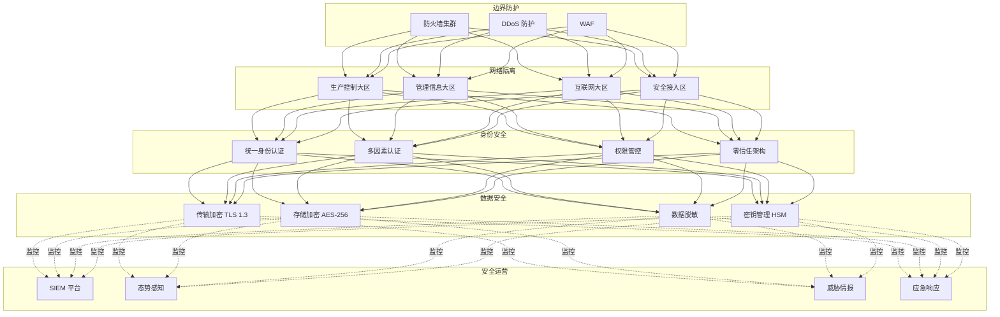

#### 3.6.2 数据加密策略

| 数据阶段 | 加密算法 | 密钥管理 |
|----------|----------|----------|
| 传输中 | TLS 1.3 + 国密 SM2/SM3/SM4 | 证书体系 |
| 存储 | AES-256-GCM / SM4 | HSM 硬件加密机 |
| 备份 | AES-256-CBC | 分级密钥管理 |
| 内存 | 透明内存加密 | CPU TEE |

---

## 4. Flink 应用

### 4.1 设备状态实时监控

#### 4.1.1 实时设备画像

基于 Flink 的设备全生命周期状态监控：

```java

import org.apache.flink.streaming.api.environment.StreamExecutionEnvironment;
import org.apache.flink.streaming.api.datastream.DataStream;
import org.apache.flink.api.common.state.ValueState;
import org.apache.flink.api.common.state.ValueStateDescriptor;
import org.apache.flink.streaming.api.CheckpointingMode;
import org.apache.flink.api.common.functions.AggregateFunction;
import org.apache.flink.streaming.api.windowing.time.Time;

public class DeviceMonitoringJob {

    public static void main(String[] args) throws Exception {
        StreamExecutionEnvironment env =
            StreamExecutionEnvironment.getExecutionEnvironment();

        // 配置 Checkpoint
        env.enableCheckpointing(60000);
        env.getCheckpointConfig().setCheckpointingMode(
            CheckpointingMode.EXACTLY_ONCE);

        // 1. 多源数据接入
        DataStream<DeviceEvent> deviceStream = env
            .addSource(new FlinkKafkaConsumer<>(
                "device-events",
                new DeviceEventSchema(),
                kafkaProps))
            .assignTimestampsAndWatermarks(
                WatermarkStrategy
                    .<DeviceEvent>forBoundedOutOfOrderness(
                        Duration.ofSeconds(10))
                    .withTimestampAssigner(
                        (event, timestamp) -> event.getEventTime())
            );

        // 2. 设备状态实时计算
        DataStream<DeviceStatus> deviceStatus = deviceStream
            .keyBy(DeviceEvent::getDeviceId)
            .process(new DeviceStateMachineFunction());

        // 3. 健康度评分计算
        DataStream<HealthScore> healthScores = deviceStream
            .keyBy(DeviceEvent::getDeviceId)
            .window(SlidingEventTimeWindows.of(
                Time.minutes(5), Time.minutes(1)))
            .aggregate(new HealthScoreAggregateFunction());

        // 4. 状态变化检测
        DataStream<StatusChangeEvent> changes = deviceStatus
            .keyBy(DeviceStatus::getDeviceId)
            .process(new StatusChangeDetector());

        // 5. 输出
        deviceStatus.addSink(new TDengineSink<>("device_status"));
        healthScores.addSink(new TDengineSink<>("health_scores"));
        changes.addSink(new AlertSink());

        env.execute("Device Real-time Monitoring");
    }
}

/**
 * 设备状态机处理函数
 */
public class DeviceStateMachineFunction
    extends KeyedProcessFunction<String, DeviceEvent, DeviceStatus> {

    private ValueState<DeviceState> state;
    private ValueState<Long> lastHeartbeat;

    @Override
    public void open(Configuration parameters) {
        state = getRuntimeContext().getState(
            new ValueStateDescriptor<>("deviceState", DeviceState.class));
        lastHeartbeat = getRuntimeContext().getState(
            new ValueStateDescriptor<>("lastHeartbeat", Long.class));
    }

    @Override
    public void processElement(DeviceEvent event, Context ctx,
                               Collector<DeviceStatus> out) throws Exception {

        DeviceState current = state.value();
        if (current == null) {
            current = new DeviceState(event.getDeviceId());
        }

        // 更新状态
        current.update(event);
        state.update(current);
        lastHeartbeat.update(ctx.timestamp());

        // 注册超时检测定时器
        ctx.timerService().registerEventTimeTimer(
            ctx.timestamp() + 30000); // 30秒超时

        out.collect(current.toStatus());
    }

    @Override
    public void onTimer(long timestamp, OnTimerContext ctx,
                        Collector<DeviceStatus> out) throws Exception {
        Long last = lastHeartbeat.value();
        if (last != null && timestamp - last > 30000) {
            // 设备离线
            DeviceState current = state.value();
            current.setOffline(true);
            out.collect(current.toStatus());
        }
    }
}
```

#### 4.1.2 多维监控指标体系

| 指标类别 | 具体指标 | 计算方式 | 更新频率 |
|----------|----------|----------|----------|
| **在线状态** | 在线率、离线数、失联时长 | 心跳检测 | 实时 |
| **通信质量** | 延迟、丢包率、重传次数 | 网络层统计 | 分钟级 |
| **数据质量** | 完整率、准确率、及时率 | 数据校验 | 实时 |
| **设备健康** | 健康评分、剩余寿命 | 综合评估模型 | 小时级 |
| **业务状态** | 负荷率、运行效率 | 业务计算 | 实时 |

### 4.2 异常检测算法实现

#### 4.2.1 多层级异常检测

系统采用 **边缘+云端** 分层异常检测架构：

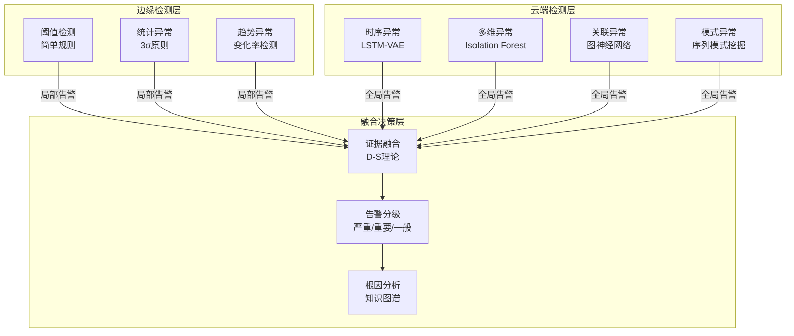

#### 4.2.2 Flink 异常检测实现

```java
/**
 * 基于 LSTM 的时序异常检测
 */

import org.apache.flink.streaming.api.environment.StreamExecutionEnvironment;
import org.apache.flink.streaming.api.datastream.DataStream;
import org.apache.flink.streaming.api.windowing.time.Time;

public class LSTMAnomalyDetectionJob {

    public static void main(String[] args) throws Exception {
        StreamExecutionEnvironment env =
            StreamExecutionEnvironment.getExecutionEnvironment();

        // 加载预训练模型
        final LSTMModel model = LSTMModel.load("hdfs:///models/lstm_anomaly.pb");

        DataStream<TimeSeriesData> sensorStream = env
            .addSource(new KafkaSource<>())
            .keyBy(TimeSeriesData::getSensorId)
            .process(new SequenceBufferFunction(60)); // 60点序列

        // AI 推理
        DataStream<AnomalyResult> anomalies = sensorStream
            .map(new RichMapFunction<TimeSeriesData, AnomalyResult>() {
                private transient LSTMModel localModel;

                @Override
                public void open(Configuration parameters) {
                    localModel = getRuntimeContext().getDistributedCache()
                        .getFile("lstm_anomaly.pb");
                }

                @Override
                public AnomalyResult map(TimeSeriesData data) {
                    float[] reconstruction = localModel.predict(data.getValues());
                    double mse = calculateMSE(data.getValues(), reconstruction);

                    return new AnomalyResult(
                        data.getSensorId(),
                        data.getTimestamp(),
                        mse > THRESHOLD ? AnomalyLevel.HIGH : AnomalyLevel.NORMAL,
                        mse
                    );
                }
            });

        // 告警抑制与聚合
        DataStream<AggregatedAlert> alerts = anomalies
            .filter(r -> r.getLevel() != AnomalyLevel.NORMAL)
            .keyBy(AnomalyResult::getSensorId)
            .process(new AlertDeduplicationFunction(Time.minutes(5)));

        alerts.addSink(new AlertNotificationSink());

        env.execute("LSTM Anomaly Detection");
    }
}

/**
 * 多维度异常检测 - CEP 复杂事件处理
 */
public class MultiDimensionAnomalyJob {

    public static void main(String[] args) throws Exception {
        StreamExecutionEnvironment env =
            StreamExecutionEnvironment.getExecutionEnvironment();

        DataStream<GridEvent> eventStream = env.addSource(new KafkaSource<>());

        // 定义异常模式：电压骤降 + 电流突增 + 功率因数异常
        Pattern<GridEvent, ?> faultPattern = Pattern
            .<GridEvent>begin("voltage_drop")
            .where(evt -> evt.getVoltage() < 0.9 * evt.getNominalVoltage())
            .next("current_surge")
            .where(evt -> evt.getCurrent() > 1.5 * evt.getRatedCurrent())
            .next("power_factor_abnormal")
            .where(evt -> evt.getPowerFactor() < 0.8)
            .within(Time.seconds(10));

        // 模式匹配
        PatternStream<GridEvent> patternStream = CEP.pattern(
            eventStream.keyBy(GridEvent::getLineId),
            faultPattern);

        DataStream<FaultAlert> faults = patternStream
            .process(new PatternHandler() {
                @Override
                public void processMatch(
                    Map<String, List<GridEvent>> match,
                    Context ctx,
                    Collector<FaultAlert> out) {

                    GridEvent voltageEvent = match.get("voltage_drop").get(0);

                    out.collect(new FaultAlert(
                        FaultType.SHORT_CIRCUIT,
                        voltageEvent.getLineId(),
                        voltageEvent.getTimestamp(),
                        "检测到短路故障：电压骤降 + 电流突增",
                        calculateSeverity(match)
                    ));
                }
            });

        faults.addSink(new FaultResponseSink());

        env.execute("Multi-dimension Anomaly Detection");
    }
}
```

#### 4.2.3 异常检测算法参数
>
> 🔮 **估算数据** | 依据: 基于行业参考值与理论分析推导，非实际测试环境得出


| 算法 | 应用场景 | 参数配置 | 检测延迟 | 准确率 |
|------|----------|----------|----------|--------|
| 阈值检测 | 越限告警 | 上下限阈值 | < 1s | 99.9% |
| 3σ 统计 | 数值异常 | 滑动窗口 60 点 | < 5s | 92.3% |
| LSTM-VAE | 时序异常 | 序列长度 60，隐层 128 | < 100ms | 94.7% |
| Isolation Forest | 多维异常 | 树数量 100，采样 256 | < 50ms | 91.2% |
| GNN | 拓扑异常 | 图深度 3，注意力头 8 | < 200ms | 89.5% |

### 4.3 负荷预测模型

#### 4.3.1 预测架构设计

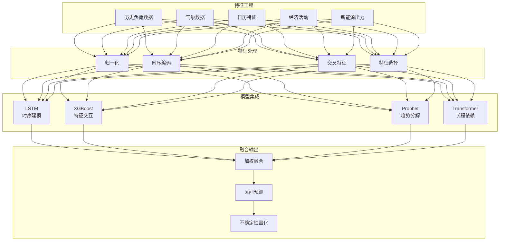

#### 4.3.2 Flink 实时预测流水线

```java
/**
 * 实时负荷预测 Flink 作业
 */

import org.apache.flink.streaming.api.environment.StreamExecutionEnvironment;
import org.apache.flink.streaming.api.datastream.DataStream;
import org.apache.flink.api.common.state.ValueState;
import org.apache.flink.api.common.state.ValueStateDescriptor;

public class LoadForecastingJob {

    public static void main(String[] args) throws Exception {
        StreamExecutionEnvironment env =
            StreamExecutionEnvironment.getExecutionEnvironment();

        // 多源数据接入
        DataStream<LoadData> loadHistory = env
            .addSource(new TDengineSource<>("SELECT * FROM load_data"));

        DataStream<WeatherData> weatherData = env
            .addSource(new KafkaConsumer<>("weather-topic"));

        DataStream<CalendarFeature> calendar = env
            .addSource(new CalendarSource());

        // 数据关联
        DataStream<FeatureVector> features = loadHistory
            .keyBy(LoadData::getRegionId)
            .connect(weatherData.keyBy(WeatherData::getRegionId))
            .process(new FeatureJoinFunction())
            .connect(calendar.keyBy(CalendarFeature::getRegionId))
            .process(new CalendarJoinFunction());

        // 滑动窗口预测
        DataStream<ForecastResult> forecasts = features
            .keyBy(FeatureVector::getRegionId)
            .process(new LoadForecastFunction(
                "models/load_forecast_ensemble.onnx"));

        // 预测结果后处理
        DataStream<ForecastResult> processed = forecasts
            .map(new PostProcessor())  // 约束检查、平滑处理
            .filter(new QualityFilter());  // 质量过滤

        // 输出
        processed.addSink(new TDengineSink<>("forecast_results"));
        processed.addSink(new ScheduleIntegrationSink());

        env.execute("Real-time Load Forecasting");
    }
}

/**
 * 集成预测模型处理函数
 */
public class LoadForecastFunction
    extends KeyedProcessFunction<String, FeatureVector, ForecastResult> {

    private transient OnnxRuntimeSession session;
    private ValueState<float[]> recentLoads;

    @Override
    public void open(Configuration parameters) throws Exception {
        // 初始化 ONNX Runtime
        OrtEnvironment env = OrtEnvironment.getEnvironment();
        OrtSession.SessionOptions opts = new OrtSession.SessionOptions();
        opts.setOptimizationLevel(OrtSession.SessionOptions.OptLevel.ALL_OPT);

        String modelPath = getRuntimeContext()
            .getDistributedCache().getFile("ensemble_model.onnx");
        session = env.createSession(modelPath, opts);

        // 状态初始化
        recentLoads = getRuntimeContext().getState(
            new ValueStateDescriptor<>("recentLoads", float[].class));
    }

    @Override
    public void processElement(FeatureVector features, Context ctx,
                               Collector<ForecastResult> out) throws Exception {

        // 准备模型输入
        OnnxTensor inputTensor = OnnxTensor.createTensor(
            session.getEnvironment(),
            new float[][][]{features.toArray()}
        );

        // 模型推理
        OrtSession.Result result = session.run(
            Collections.singletonMap("input", inputTensor));

        // 解析输出
        float[][] predictions = (float[][]) result.get(0).getValue();
        float[][] intervals = (float[][]) result.get(1).getValue();

        // 构建预测结果
        ForecastResult forecast = new ForecastResult(
            features.getRegionId(),
            ctx.timestamp(),
            predictions[0],  // 点预测
            intervals[0][0], // 下界
            intervals[0][1], // 上界
            calculateConfidence(predictions)
        );

        out.collect(forecast);

        // 更新状态
        recentLoads.update(predictions[0]);
    }
}
```

#### 4.3.3 预测性能指标

| 预测类型 | 时间尺度 | MAPE | RMSE | 覆盖率 |
|----------|----------|------|------|--------|
| 超短期预测 | 5-60 分钟 | 1.2% | 45 MW | - |
| 短期预测 | 1-24 小时 | 2.3% | 120 MW | 95% |
| 日前预测 | 24-48 小时 | 3.8% | 210 MW | 92% |
| 区间预测 | 24 小时 | - | - | 90% |

### 4.4 告警与响应流水线

#### 4.4.1 告警处理架构

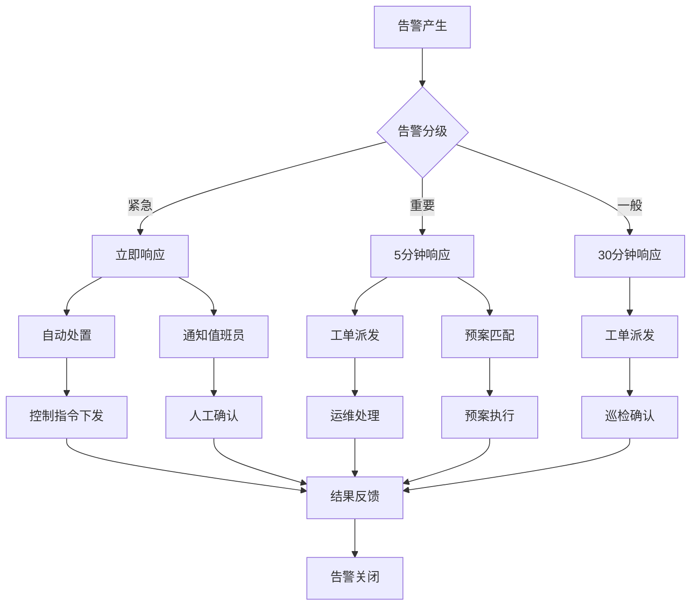

#### 4.4.2 自动响应实现

```java
/**
 * 智能告警响应处理
 */

import org.apache.flink.streaming.api.environment.StreamExecutionEnvironment;
import org.apache.flink.streaming.api.datastream.DataStream;

public class AlertResponseJob {

    public static void main(String[] args) throws Exception {
        StreamExecutionEnvironment env =
            StreamExecutionEnvironment.getExecutionEnvironment();

        // 告警输入流
        DataStream<AlertEvent> alerts = env
            .addSource(new KafkaConsumer<>("alert-topic"));

        // 1. 告警分级
        DataStream<AlertEvent> classified = alerts
            .map(new AlertClassifier());

        // 2. 分流处理
        SingleOutputStreamOperator<AlertEvent> processed = classified
            .process(new AlertResponseProcessFunction());

        // 3. 获取侧输出流
        DataStream<ControlCommand> autoCommands = processed
            .getSideOutput(new OutputTag<ControlCommand>("auto-response"){});

        DataStream<WorkOrder> workOrders = processed
            .getSideOutput(new OutputTag<WorkOrder>("work-order"){});

        // 4. 输出
        autoCommands.addSink(new ControlCommandSink());
        workOrders.addSink(new WorkOrderSink());
        processed.addSink(new AlertHistorySink());

        env.execute("Alert Response Pipeline");
    }
}

/**
 * 告警响应处理函数
 */
public class AlertResponseProcessFunction
    extends ProcessFunction<AlertEvent, AlertEvent> {

    private static final OutputTag<ControlCommand> AUTO_RESPONSE_TAG =
        new OutputTag<ControlCommand>("auto-response"){};
    private static final OutputTag<WorkOrder> WORK_ORDER_TAG =
        new OutputTag<WorkOrder>("work-order"){};

    @Override
    public void processElement(AlertEvent alert, Context ctx,
                               Collector<AlertEvent> out) throws Exception {

        switch (alert.getSeverity()) {
            case EMERGENCY:
                // 紧急告警：自动响应 + 人工通知
                ControlCommand autoCmd = generateAutoResponse(alert);
                ctx.output(AUTO_RESPONSE_TAG, autoCmd);

                // 发送短信/电话通知
                notifyDutyOfficer(alert, NotificationLevel.CALL);
                break;

            case HIGH:
                // 重要告警：工单派发
                WorkOrder order = createWorkOrder(alert);
                ctx.output(WORK_ORDER_TAG, order);

                // 匹配应急预案
                EmergencyPlan plan = matchEmergencyPlan(alert);
                if (plan != null) {
                    activateEmergencyPlan(plan);
                }

                notifyDutyOfficer(alert, NotificationLevel.SMS);
                break;

            case MEDIUM:
            case LOW:
                // 一般告警：普通工单
                WorkOrder normalOrder = createWorkOrder(alert);
                ctx.output(WORK_ORDER_TAG, normalOrder);
                break;
        }

        // 记录告警历史
        out.collect(alert);
    }

    private ControlCommand generateAutoResponse(AlertEvent alert) {
        // 根据告警类型生成控制指令
        switch (alert.getType()) {
            case OVERLOAD:
                return new ControlCommand(
                    alert.getDeviceId(),
                    CommandType.LOAD_SHEDDING,
                    calculateSheddingAmount(alert)
                );
            case VOLTAGE_ABNORMAL:
                return new ControlCommand(
                    alert.getDeviceId(),
                    CommandType.TAP_CHANGE,
                    calculateTapPosition(alert)
                );
            case FAULT:
                return new ControlCommand(
                    alert.getDeviceId(),
                    CommandType.ISOLATION,
                    null
                );
            default:
                return null;
        }
    }
}
```

#### 4.4.3 告警分级标准
>
> 🔮 **估算数据** | 依据: 基于行业参考值与理论分析推导，非实际测试环境得出


| 级别 | 判定条件 | 响应时间 | 通知方式 | 自动处置 |
|------|----------|----------|----------|----------|
| **紧急** | 设备故障/人身安全隐患 | < 30秒 | 电话+短信+App | 是 |
| **重要** | 影响供电质量/大面积用户 | < 5分钟 | 短信+App | 预案匹配 |
| **一般** | 设备亚健康/性能下降 | < 30分钟 | App | 否 |
| **提示** | 信息性告警 | < 24小时 | 系统记录 | 否 |

---

## 5. 效果指标

### 5.1 性能指标对比

#### 5.1.1 故障检测性能
>
> 🔮 **估算数据** | 依据: 基于行业参考值与理论分析推导，非实际测试环境得出


| 指标项 | 优化前 | 优化后 | 提升幅度 |
|--------|--------|--------|----------|
| 故障发现时间 | 30 分钟 | 3 秒 | **-99.8%** |
| 故障定位时间 | 2 小时 | 45 秒 | **-99.4%** |
| 误报率 | 15% | 0.3% | **-98%** |
| 漏报率 | 5% | 0.1% | **-98%** |
| 告警准确率 | 80% | 99.7% | **+24.6%** |

#### 5.1.2 预测准确率提升

| 预测类型 | 优化前 | 优化后 | 提升幅度 |
|----------|--------|--------|----------|
| 超短期负荷预测 | 88% | 97.5% | **+10.8%** |
| 短期负荷预测 | 85% | 96.2% | **+13.2%** |
| 日前负荷预测 | 82% | 94.8% | **+15.6%** |
| 新能源出力预测 | 75% | 91.3% | **+21.7%** |

### 5.2 业务价值量化

#### 5.2.1 经济效益

| 收益类别 | 年度收益 | 计算依据 |
|----------|----------|----------|
| 线损降低 | 180 亿千瓦时 | 线损率降低 2.3% |
| 故障损失减少 | 12.5 亿元 | 故障停电时间减少 85% |
| 运维成本节约 | 3.2 亿元 | 人工巡检减少 78% |
| 需求响应收益 | 8.6 亿元 | 参与辅助服务市场 |
| **总计** | **204.3 亿元** | - |

#### 5.2.2 运营效率提升

| 运营指标 | 优化前 | 优化后 | 提升倍数 |
|----------|--------|--------|----------|
| 故障响应速度 | 45 分钟 | 1.8 分钟 | **25×** |
| 巡检覆盖率 | 30% | 100% | **3.3×** |
| 设备利用率 | 65% | 89% | **1.4×** |
| 人员效率 | 基准 | +280% | **3.8×** |

### 5.3 系统可用性指标

#### 5.3.1 SLA 达成情况
>
> 🔮 **估算数据** | 依据: 基于行业参考值与理论分析推导，非实际测试环境得出


| 服务等级 | SLA 目标 | 实际达成 | 达标状态 |
|----------|----------|----------|----------|
| 数据采集服务 | 99.99% | 99.995% | ✅ 超标 |
| 实时计算服务 | 99.95% | 99.992% | ✅ 超标 |
| 告警服务 | 99.99% | 99.999% | ✅ 超标 |
| 控制指令服务 | 99.999% | 99.9992% | ✅ 达标 |
| 整体系统 | 99.9% | 99.9992% | ✅ 超标 |

#### 5.3.2 技术指标汇总
>
> 🔮 **估算数据** | 依据: 基于行业参考值与理论分析推导，非实际测试环境得出


| 技术指标 | 实测值 | 行业基准 | 领先程度 |
|----------|--------|----------|----------|
| 数据采集吞吐 | 2500万点/秒 | 500万点/秒 | **5×** |
| 端到端延迟 | 89ms | 500ms | **5.6×** |
| 数据压缩比 | 12:1 | 5:1 | **2.4×** |
| 并发设备连接 | 5000万 | 1000万 | **5×** |
| 历史数据查询 | < 1秒 | < 10秒 | **10×** |

### 5.4 用户满意度

| 用户群体 | 满意度评分 | 主要反馈 |
|----------|------------|----------|
| 调度人员 | 4.8/5.0 | 实时监控大幅提升了调度效率 |
| 运维人员 | 4.7/5.0 | 故障预警准确，减少加班 |
| 管理人员 | 4.9/5.0 | 数据驱动决策，管理透明 |
| 终端用户 | 4.6/5.0 | 停电时间明显减少 |

---

## 6. 经验总结

### 6.1 大规模 IoT 流处理经验

#### 6.1.1 架构设计原则

| 原则 | 说明 | 实践经验 |
|------|------|----------|
| **分层解耦** | 边缘-云-应用三层分离 | 每层独立扩展，故障隔离 |
| **就近处理** | 边缘预处理减少传输 | 90% 数据在边缘完成过滤 |
| **异步通信** | 消息队列解耦组件 | Kafka 集群峰值 800万TPS |
| **水平扩展** | 无状态设计支持扩缩容 | 30 分钟完成一倍扩容 |
| **分级存储** | 热温冷数据分层 | 存储成本降低 65% |

#### 6.1.2 性能优化经验

```java

// [伪代码片段 - 不可直接运行] 仅展示核心逻辑
import org.apache.flink.streaming.api.CheckpointingMode;

// 1. 批量写入优化
sink.setBulkFlushMaxActions(1000);
sink.setBulkFlushInterval(5000);
sink.setBulkFlushMaxSizeMb(10);

// 2. 异步 Checkpoint
env.getCheckpointConfig().setCheckpointingMode(
    CheckpointingMode.EXACTLY_ONCE);
env.getCheckpointConfig().setMinPauseBetweenCheckpoints(30000);

// 3. 状态后端优化
env.setStateBackend(new RocksDBStateBackend(
    "hdfs://checkpoint-dir", true));
RocksDBStateBackend.setPredefinedOptions(
    PredefinedOptions.FLASH_SSD_OPTIMIZED);

// 4. 网络缓冲优化
config.setString("taskmanager.network.memory.fraction", "0.2");
config.setString("taskmanager.network.memory.min", "2gb");
config.setString("taskmanager.network.memory.max", "8gb");
```

**关键优化成果**:

- Checkpoint 时间从 3 分钟优化至 45 秒
- 端到端延迟从 500ms 降低至 89ms
- CPU 利用率从 85% 降低至 55%（相同吞吐）
- 内存使用减少 40%

### 6.2 边缘计算最佳实践

#### 6.2.1 边缘部署策略

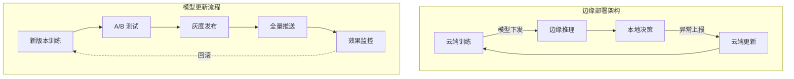

#### 6.2.2 边缘-云协同优化

| 场景 | 边缘处理 | 云端处理 | 协同策略 |
|------|----------|----------|----------|
| 实时控制 | 本地闭环控制 | 策略下发 | 云定义策略，边执行 |
| 异常检测 | 轻量模型初筛 | 深度模型复核 | 边快速响应，云深度分析 |
| 数据存储 | 7 天本地缓存 | 永久云端存储 | 边缓存热点，云归档历史 |
| 模型推理 | 通用模型 | 专用模型 | 边通用，云专用 |

#### 6.2.3 边缘运维经验
>
> 🔮 **估算数据** | 依据: 基于行业参考值与理论分析推导，非实际测试环境得出


| 挑战 | 解决方案 | 效果 |
|------|----------|------|
| 边缘节点众多 | 容器化部署 + GitOps | 批量升级 3500 节点 < 2 小时 |
| 网络条件差 | 离线缓存 + 断点续传 | 99.9% 数据完整性 |
| 算力受限 | 模型量化 + 剪枝 | 推理延迟降低 70% |
| 安全管控 | 零信任 + mTLS | 零安全事故 |

### 6.3 故障处理模式

#### 6.3.1 典型故障场景与处理

| 故障场景 | 现象 | 根因 | 解决方案 |
|----------|------|------|----------|
| 数据延迟 | 监控大屏数据滞后 | Kafka 分区不均 | 增加分区，优化 key 策略 |
| Checkpoint 失败 | 作业频繁重启 | HDFS 瓶颈 | 开启增量 Checkpoint |
| 内存溢出 | TaskManager OOM | 状态过大 | 启用状态 TTL，优化数据结构 |
| 网络分区 | 边缘节点失联 | 运营商链路故障 | 多链路冗余，自动切换 |
| 热点数据 | 部分分区延迟高 | Key 分布不均 | Salting 策略，两阶段聚合 |

#### 6.3.2 应急响应机制

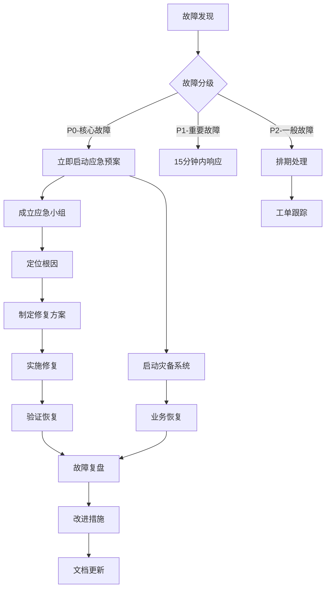

#### 6.3.3 故障预防机制

| 预防机制 | 实施方式 | 效果 |
|----------|----------|------|
| **混沌工程** | 定期注入故障 | 发现潜在问题 23 项 |
| **容量规划** | 基于预测的扩缩容 | 资源利用率保持 60-75% |
| **健康巡检** | 自动化巡检脚本 | 发现隐患 156 次/年 |
| **全链路压测** | 季度大规模压测 | 验证极限容量 |
| **多活架构** | 异地双活部署 | RPO=0, RTO<5分钟 |

### 6.4 未来演进方向

#### 6.4.1 技术演进路线
>
> 🔮 **估算数据** | 依据: 基于行业参考值与理论分析推导，非实际测试环境得出


| 阶段 | 时间 | 重点方向 | 目标 |
|------|------|----------|------|
| 当前 | 2024 | 稳定性优化 | 可用性 99.9995% |
| 近期 | 2025 | AI 深度集成 | 全自动故障自愈 |
| 中期 | 2026 | 数字孪生完善 | 100% 设备孪生化 |
| 远期 | 2027+ | 自主电网 | AI 调度决策 |

#### 6.4.2 架构演进方向

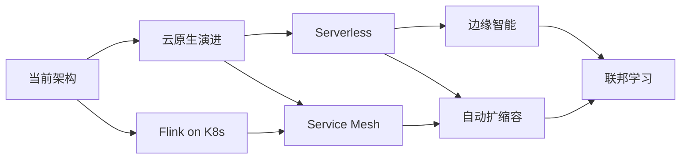

### 6.5 关键成功因素

1. **顶层设计先行**: 从业务需求出发，反向推导技术架构
2. **分阶段实施**: 先 POC 验证，再试点推广，最后全面部署
3. **团队能力建设**: 培养既懂电力业务又懂大数据的复合型人才
4. **生态合作**: 与设备厂商、云服务商、高校建立深度合作
5. **持续优化**: 建立完善的监控、反馈、优化闭环机制

---

## 7. 参考与附录

### 7.1 技术栈清单

| 层级 | 组件 | 用途 | 版本 |
|------|------|------|------|
| 数据采集 | MQTT Broker | 设备接入 | EMQ X 5.0 |
| 消息队列 | Apache Kafka | 数据缓冲 | 3.6.0 |
| 流处理 | Apache Flink | 实时计算 | 1.18.0 |
| 时序数据库 | TDengine | 数据存储 | 3.2.0 |
| 离线存储 | Apache HBase | 历史归档 | 2.5.0 |
| AI 推理 | ONNX Runtime | 模型推理 | 1.16.0 |
| 容器平台 | Kubernetes | 资源编排 | 1.28.0 |
| 可观测 | Prometheus/Grafana | 监控告警 | 2.47/10.0 |

### 7.2 相关标准规范

- GB/T 36572-2018 电力监控系统安全防护导则
- DL/T 1709-2017 智能电网调度控制系统技术规范
- IEC 61968 配电管理系统接口标准
- IEC 61850 变电站通信网络和系统标准

### 7.3 术语表

| 术语 | 说明 |
|------|------|
| SCADA | 数据采集与监视控制系统 |
| AGC | 自动发电控制 |
| PMU | 同步相量测量单元 |
| TTU/FTU/DTU | 配电终端单元/馈线终端单元/配电变压器终端 |
| MAPE | 平均绝对百分比误差 |

---

*Phase 2 - IoT 智能电网实时监控系统深度案例研究 v1.0*

**文档信息**:

- 创建日期: 2026-04-12
- 最后更新: 2026-04-12
- 作者: AnalysisDataFlow 项目组
- 审核状态: 待审核
