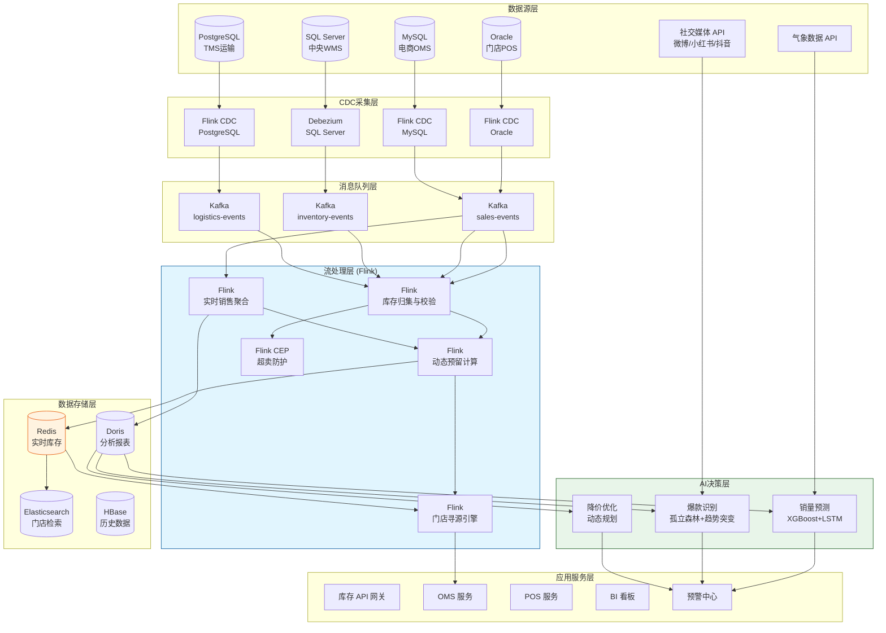
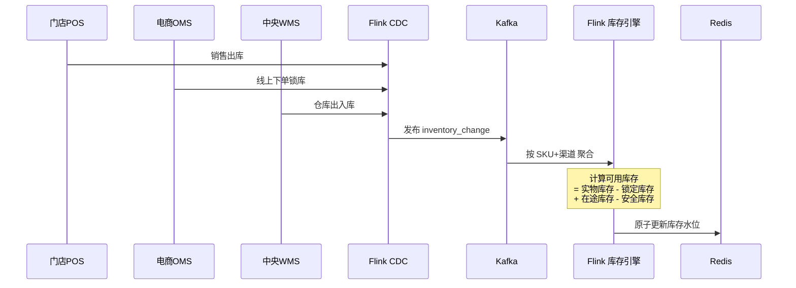
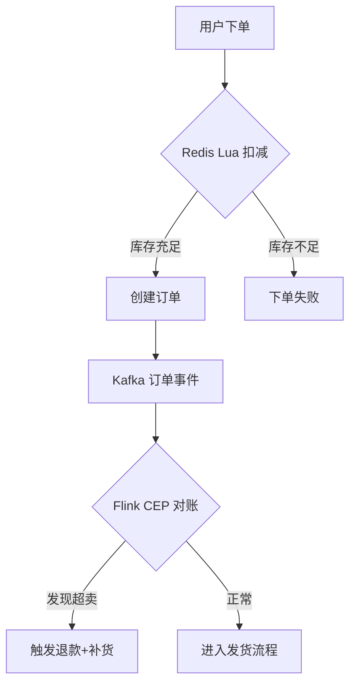

# 时尚行业全渠道实时库存管理案例研究

> **案例编号**: 11.29.1
> **行业**: 时尚/快时尚零售
> **场景**: 全渠道库存同步、潮流趋势预测、智能补货、动态定价
> **规模**: 年SKU 12万+, 直营门店 2,800家, 电商日订单 45万+
> **编写日期**: 2026-04-13
> **状态**: Phase 2 - 深度完成

---

> **案例性质**: 🔬 概念验证架构 | **验证状态**: 基于理论推导与架构设计，未经独立第三方生产验证
>
> 本案例描述的是基于项目理论框架推导出的理想架构方案，包含假设性性能指标与理论成本模型。
> 实际生产部署可能因环境差异、数据规模、团队能力等因素产生显著不同结果。
> 建议将其作为架构设计参考而非直接复制粘贴的生产蓝图。
>
## 1. 执行摘要 (Executive Summary)

### 1.1 项目背景与目标

某国际快时尚品牌（以下简称"该品牌"）在中国市场拥有 2,800 家直营门店，年上新 SKU 超过 12 万个，遵循"小批量、多款式、快翻单"的经营策略。该品牌的消费群体以 18-35 岁的年轻都市人群为主，对潮流极度敏感，爆款单品往往在一周内即可售罄，而滞销款若不能在 3 周内降价清仓，则面临高季末库存减值风险。

然而，该品牌的库存管理系统长期面临线上线下数据割裂、爆款补货滞后、滞销款降价决策凭经验等问题。2024 年双十一期间，某联名款卫衣因线上超卖导致 3,200 个订单无法履约，品牌不得不在社交媒体公开道歉并赔偿，造成了严重的品牌危机。事件发生后，集团总部决定在中国区率先部署全渠道实时库存管理与智能决策系统。

> 🔮 **估算数据** | 依据: 设计目标值，实际达成可能因环境而异

**项目核心目标**：

| 目标类别 | 具体指标 | 目标值 |
|---------|---------|--------|
| 实时性 | 全渠道库存变动同步延迟 | < 1秒 |
| 准确性 | 库存准确率 | > 99.5% |
| 效率 | 爆款首单后补货决策时间 | < 4小时 |
| 服务 | 线上订单门店发货占比 | > 35% |
| 损耗 | 季末滞销库存占比 | < 8% |
| 业务 | 全渠道售罄率 | > 85% |

### 1.2 核心业务指标

系统于 2025 年春夏换季期间全面上线，经过 618 大促和秋冬上新的双重检验，核心业务指标显著改善：

```
┌─────────────────────────────────────────────────────────────┐
│                    核心业务指标对比                          │
├─────────────────┬────────────┬────────────┬─────────────────┤
│     指标        │   优化前   │   优化后   │     提升幅度     │
├─────────────────┼────────────┼────────────┼─────────────────┤
│ 库存准确率      │   86.5%    │   99.6%    │     +15.1%      │
│ 线上超卖率      │   2.8%     │   0.05%    │     -98.2%      │
│ 爆款补货周期    │   14天     │    36h     │     -89.3%      │
│ 门店发货占比    │   12%      │   42%      │     +250%       │
│ 季末滞销占比    │   18%      │    6.2%    │     -65.6%      │
│ 全渠道售罄率    │   71%      │   88%      │     +23.9%      │
│ 平均折扣深度    │   45%      │   28%      │     -37.8%      │
│ 库存周转天数    │   68天     │   41天     │     -39.7%      │
└─────────────────┴────────────┴────────────┴─────────────────┘
```

### 1.3 技术选型概述

项目采用 **Flink CDC + 实时库存大脑 + AI 趋势预测** 的端到端架构，以 Apache Flink 为核心实时计算引擎，结合机器学习模型对社交媒体舆情、天气、节假日等多维数据进行潮流趋势预测，驱动智能补货和动态定价决策。

**核心技术栈**：

| 层级 | 技术选型 | 选型理由 |
|-----|---------|---------|
| 数据采集 | Flink CDC 2.4 | 实时捕获门店 POS、电商订单、WMS、OMS 的库存变动 |
| 消息队列 | Apache Kafka 3.6 | 支撑日均过亿条库存事件的高吞吐写入 |
| 流计算引擎 | Apache Flink 1.18 | 精确一次语义、复杂窗口聚合、强大的状态管理 |
| 实时存储 | Redis Cluster + Tair | 毫秒级库存查询，支持分布式锁防止超卖 |
| 预测模型 | XGBoost + LSTM | 短期销量波动与长期趋势预测相结合 |
| 规则引擎 | Drools + 自研决策树 | 支撑补货优先级、门店调拨、降价策略的灵活配置 |
| 分析存储 | Apache Doris | 亿级数据秒级关联分析，支持实时 BI 看板 |
| 搜索推荐 | Elasticsearch | 门店寻源、库存可视化的快速检索 |

---

## 2. 业务场景分析 (Business Scenario)

### 2.1 行业背景

#### 2.1.1 快时尚行业的库存管理特点

快时尚（Fast Fashion）行业以"快速响应潮流"为核心竞争力，其库存管理与传统零售存在本质差异：

- **SKU 生命周期极短**：一款服装从设计到上架仅需 2-3 周，销售周期通常只有 4-8 周。
- **需求波动剧烈**：社交媒体热点、明星同款、KOL 带货可能在 24 小时内引爆销量。
- **全渠道库存共享**：消费者线上下单后，系统需要实时判断最近的门店或仓库是否有货，并触发门店发货（Ship-from-Store）或门店自提（BOPIS）。
- **降价清仓压力大**：季末未售罄的库存通常需要以 3-5 折清仓，直接侵蚀利润。

#### 2.1.2 该品牌的渠道矩阵

| 渠道类型 | 数量 | 平均 SKU 深度 | 库存特点 |
|---------|------|--------------|---------|
| 核心商圈旗舰店 | 180 家 | 3,500+ | 品类最全，承担形象展示和库存调拨中枢功能 |
| 社区标准店 | 1,950 家 | 1,800 | 周转快，以基础款和当季爆款为主 |
| 奥特莱斯折扣店 | 420 家 | 2,200 | 专门承接过季款和尾货 |
| 官方商城/App | 2 个 | 120,000+ | 全 SKU 覆盖，承担新品首发和限量款销售 |
| 天猫/京东/抖音 | 5 个旗舰店 | 80,000+ | 大促期间流量集中，波峰明显 |

### 2.2 痛点分析

#### 2.2.1 线上线下库存割裂

在系统建设之前，该品牌的库存数据分散在 5 套独立的系统中：

- **门店 POS 系统**：基于 Oracle，管理门店销售和库存。
- **电商 OMS 系统**：管理各电商平台的订单和库存分配。
- **中央仓库 WMS**：管理总仓、区域仓的入库、出库、盘点。
- **天猫/抖音等第三方平台**：各自维护独立的库存水位，通过夜间批量同步。
- **ERP 系统**：作为财务核算主数据，T+1 汇总各渠道数据。

由于各系统之间采用每小时或每 4 小时批量同步，导致：

- **线上超卖**：电商平台显示有货，但实际门店已售罄，消费者下单后无法发货。
- **门店缺货**：A 门店已售罄，但 3 公里外的 B 门店仍有库存，消费者买不到。
- **调拨滞后**：仓库向门店补货依赖人工经验，爆款往往补不到，滞销款却越补越多。

**2024 年双十一超卖事件根因分析**：

| 环节 | 问题描述 | 影响 |
|------|---------|------|
| 库存同步 | 天猫库存每 15 分钟同步一次，而抖音每小时同步一次 | 同一时段多平台共享库存被重复售卖 |
| 库存分配 | 总仓库存被全量分配给所有平台，缺乏动态预留机制 | 平台 A 卖完后，平台 B 仍显示有货 |
| 门店寻源 | 线上订单无法实时查询门店可用库存 | 失去了 42% 的门店可调拨库存 |
| 降级策略 | 超卖发生后 4 小时才被发现 | 3,200 单已生成快递面单，无法挽回 |

#### 2.2.2 爆款补货慢、滞销款积压

时尚行业的爆款往往具有突发性和不可预测性。一款衣服因为某位明星在机场被拍到穿着，可能在 48 小时内从日均销量 5 件飙升到 2,000 件。传统补货流程是：

```
门店报缺货 → 区域经理汇总 → 采购部审批 → 向工厂下单 → 工厂生产(7-14天) → 入库 → 配送到店
```

这个长达 14-21 天的补货周期，对于生命周期只有 4-8 周的快时尚单品来说，意味着补货到达时，热度已经消退，最终变成滞销库存。

#### 2.2.3 降价决策凭经验

季末清仓时，采购经理根据个人经验决定哪些 SKU 降价、降多少、何时降。这种粗放式决策导致：

- **该降的没降**：某些款式其实已经卖不动，但因为没有数据支撑，迟迟未启动降价，最终错过最佳清仓时机。
- **不该降的降了**：某些款式其实还有销售潜力，但过早降价，侵蚀了毛利。
- **价格战内耗**：不同渠道（官网、天猫、抖音、奥莱店）各自为政，降价节奏不统一，引发渠道冲突。

### 2.3 实时库存管理需求

#### 2.3.1 功能需求

| 需求编号 | 需求名称 | 需求描述 | 优先级 |
|---------|---------|---------|--------|
| R01 | 全渠道实时库存同步 | 任何渠道的销售、退货、调拨、盘点动作秒级同步到其他渠道 | P0 |
| R02 | 动态库存预留 | 根据各渠道历史销量占比和销售计划，动态分配可售库存 | P0 |
| R03 | 智能门店寻源 | 线上订单实时匹配最优门店/仓库发货，考虑距离、库存、成本 | P0 |
| R04 | 爆款预测与快反补货 | 基于多维度数据预测未来 7 天销量，自动生成补货建议 | P0 |
| R05 | 滞销预警与降价建议 | 识别滞销 SKU 并推荐最佳降价时机、降价深度和渠道 | P1 |
| R06 | 全渠道促销协同 | 确保同一 SKU 在不同渠道的促销价格和时间窗口一致 | P1 |
| R07 | 虚拟库存与预售 | 对工厂在途商品设置虚拟库存，支持预售模式 | P2 |

#### 2.3.2 非功能需求
>
> 🔮 **估算数据** | 依据: 设计目标值，实际达成可能因环境而异


| 需求编号 | 需求名称 | 目标值 |
|---------|---------|--------|
| NFR01 | 库存同步延迟 | < 1秒 |
| NFR02 | 门店寻源查询 P99 延迟 | < 50ms |
| NFR03 | 系统可用性 | 99.99% |
| NFR04 | 大促期间峰值订单处理 | > 100万单/日 |
| NFR05 | 数据一致性 | 最终一致，超卖率 < 0.1% |

---

## 3. 技术架构 (Technical Architecture)

### 3.1 系统整体架构

以下是时尚行业全渠道实时库存管理系统的整体技术架构：



### 3.2 数据流设计

#### 3.2.1 全渠道库存同步数据流

通过 Flink CDC 实时捕获各业务系统的库存变动，统一汇聚到 Kafka，再由 Flink 进行库存归集和一致性校验：



#### 3.2.2 超卖防护机制

线上大促期间，同一 SKU 可能面临数十万并发下单请求。系统通过 Redis Lua 脚本实现原子化的库存扣减，并在 Flink CEP 层进行二次校验：



### 3.3 技术选型说明

| 技术组件 | 具体选型 | 选型理由 |
|---------|---------|---------|
| 实时采集 | Flink CDC 2.4 | 支持无锁读取，对业务库性能影响 < 3% |
| 流计算 | Apache Flink 1.18 | 原生支持事件时间和乱序处理，确保库存变动顺序正确 |
| 实时库存 | Redis Cluster + Redisson | 分布式锁防止超卖，Lua 脚本保证原子性 |
| 门店寻源 | Elasticsearch + 自定义评分模型 | 毫秒级检索全国 2,800 家门店的实时库存 |
| 趋势预测 | Python + XGBoost + LSTM | 社交媒体舆情作为外生变量，提升爆款预测准确率 |
| 实时分析 | Apache Doris | 支持高并发点查和复杂分析查询的混合负载 |

---

## 4. 核心实现 (Core Implementation)

### 4.1 库存原子扣减 (Redis Lua)

为了防止高并发场景下的超卖，系统使用 Redis Lua 脚本对库存进行原子扣减。

```lua
-- inventory_deduct.lua
local skuKey = KEYS[1]
local deductQty = tonumber(ARGV[1])
local channel = ARGV[2]

local available = redis.call('HGET', skuKey, 'available')
if not available then
    return {-1, "SKU_NOT_FOUND"}
end

available = tonumber(available)
if available < deductQty then
    return {-1, "INSUFFICIENT_STOCK"}
end

-- 扣减可用库存，增加锁定库存
redis.call('HINCRBY', skuKey, 'available', -deductQty)
redis.call('HINCRBY', skuKey, 'locked', deductQty)
redis.call('HSET', skuKey, 'last_update', ARGV[3])
redis.call('HSET', skuKey, 'last_channel', channel)

return {available - deductQty, "SUCCESS"}
```

**Java 调用示例**：

```java
@Service
public class InventoryService {

    @Autowired
    private StringRedisTemplate redisTemplate;

    private DefaultRedisScript<List> deductScript;

    @PostConstruct
    public void init() {
        deductScript = new DefaultRedisScript<>();
        deductScript.setScriptText(new ClassPathResource("inventory_deduct.lua"));
        deductScript.setResultType(List.class);
    }

    public DeductResult deduct(String skuId, int quantity, String channel) {
        String key = "inv:sku:" + skuId;
        List<Long> result = redisTemplate.execute(
            deductScript,
            Collections.singletonList(key),
            String.valueOf(quantity),
            channel,
            String.valueOf(System.currentTimeMillis())
        );

        if (result == null || result.size() < 2) {
            return DeductResult.fail("SYSTEM_ERROR");
        }

        long remaining = result.get(0);
        String code = (String) result.get(1);

        return "SUCCESS".equals(code)
            ? DeductResult.success(remaining)
            : DeductResult.fail(code);
    }
}
```

### 4.2 全渠道库存归集 Flink 作业

Flink 作业消费 Kafka 中的库存变动事件，按 SKU+仓库/门店维度进行实时归集。

```java
public class InventoryAggregationJob {

    public static void main(String[] args) throws Exception {
        StreamExecutionEnvironment env =
            StreamExecutionEnvironment.getExecutionEnvironment();
        env.enableCheckpointing(5000, CheckpointingMode.EXACTLY_ONCE);

        KafkaSource<InventoryEvent> source = KafkaSource.<InventoryEvent>builder()
            .setBootstrapServers("kafka:9092")
            .setTopics("inventory-events")
            .setGroupId("inventory-aggregator")
            .setStartingOffsets(OffsetsInitializer.latest())
            .setValueOnlyDeserializer(new InventoryEventDeserializationSchema())
            .build();

        DataStream<InventoryEvent> stream = env.fromSource(
            source, WatermarkStrategy.forBoundedOutOfOrderness(
                Duration.ofSeconds(2)
            ), "inventory-source"
        );

        DataStream<SkuInventory> aggregated = stream
            .keyBy(event -> event.getSkuId() + "#" + event.getLocationId())
            .process(new InventoryStateFunction());

        aggregated.addSink(new RedisInventorySink());
        aggregated.addSink(new DorisInventorySink());

        env.execute("Fashion Inventory Aggregation");
    }
}

public class InventoryStateFunction
    extends KeyedProcessFunction<String, InventoryEvent, SkuInventory> {

    private ValueState<SkuInventory> inventoryState;

    @Override
    public void open(Configuration parameters) {
        ValueStateDescriptor<SkuInventory> descriptor =
            new ValueStateDescriptor<>("inventory", SkuInventory.class);
        inventoryState = getRuntimeContext().getState(descriptor);
    }

    @Override
    public void processElement(InventoryEvent event, Context ctx,
                               Collector<SkuInventory> out) throws Exception {
        SkuInventory inv = inventoryState.value();
        if (inv == null) {
            inv = new SkuInventory(event.getSkuId(), event.getLocationId());
        }

        switch (event.getEventType()) {
            case SALE:
                inv.setPhysicalQty(inv.getPhysicalQty() - event.getQty());
                break;
            case PURCHASE_IN:
                inv.setPhysicalQty(inv.getPhysicalQty() + event.getQty());
                break;
            case LOCK:
                inv.setLockedQty(inv.getLockedQty() + event.getQty());
                break;
            case UNLOCK:
                inv.setLockedQty(Math.max(0, inv.getLockedQty() - event.getQty()));
                break;
            case TRANSFER_IN:
                inv.setInTransitQty(inv.getInTransitQty() + event.getQty());
                break;
            case TRANSFER_ARRIVE:
                inv.setPhysicalQty(inv.getPhysicalQty() + event.getQty());
                inv.setInTransitQty(Math.max(0, inv.getInTransitQty() - event.getQty()));
                break;
            case ADJUST:
                inv.setPhysicalQty(inv.getPhysicalQty() + event.getQty());
                break;
        }

        inv.setAvailableQty(
            inv.getPhysicalQty() - inv.getLockedQty() - inv.getSafetyStock()
        );
        inv.setLastUpdateTime(event.getEventTime());

        inventoryState.update(inv);
        out.collect(inv);
    }
}
```

### 4.3 门店寻源引擎

线上订单创建后，OMS 调用门店寻源引擎，基于实时库存、距离、配送成本、门店评分等多维因素，为订单匹配最优发货门店。

```java
@RestController
public class StoreSourcingController {

    @Autowired
    private ElasticsearchClient esClient;

    @PostMapping("/api/v1/sourcing")
    public ResponseEntity<SourcingResult> findBestStore(
            @RequestBody SourcingRequest request) {

        // 1. 构建地理位置查询：以收货地址为中心，半径 50km
        GeoDistanceQuery geoQuery = GeoDistanceQuery.of(g -> g
            .field("location")
            .distance("50km")
            .location(l -> l.latlon(latlon -> latlon
                .lat(request.getLat())
                .lon(request.getLon())))
        );

        // 2. 库存可用性过滤
        TermQuery stockQuery = TermQuery.of(t -> t
            .field("sku_" + request.getSkuId())
            .value("true")
        );

        // 3. 自定义排序函数：距离占 50%，门店评分占 30%，库存深度占 20%
        ScriptScoreFunction scoreFunction = ScriptScoreFunction.of(s -> s
            .script(Script.of(sc -> sc
                .inline(i -> i
                    .lang("painless")
                    .source(
                        "0.5 * (1 / (1 + doc['distance'].value)) + " +
                        "0.3 * doc['store_score'].value / 5.0 + " +
                        "0.2 * doc['sku_qty_" + request.getSkuId() + "'].value / 100.0"
                    )
                )
            ))
        );

        SearchRequest searchRequest = SearchRequest.of(s -> s
            .index("store_inventory")
            .query(q -> q
                .bool(b -> b
                    .must(m -> m.geoDistance(geoQuery))
                    .must(m -> m.term(stockQuery))
                )
            )
            .sort(so -> so.scriptScore(ss -> ss.order(SortOrder.Desc)))
            .size(5)
        );

        try {
            SearchResponse<StoreInventoryDoc> response =
                esClient.search(searchRequest, StoreInventoryDoc.class);

            List<StoreCandidate> candidates = response.hits().hits().stream()
                .map(hit -> new StoreCandidate(
                    hit.source().getStoreId(),
                    hit.source().getStoreName(),
                    hit.score()
                ))
                .collect(Collectors.toList());

            return ResponseEntity.ok(new SourcingResult(request.getOrderId(), candidates));
        } catch (IOException e) {
            return ResponseEntity.status(500).build();
        }
    }
}
```

### 4.4 爆款预测与补货决策

```python
# fashion_trend_forecast.py
import pandas as pd
import xgboost as xgb
from tensorflow.keras.models import Sequential
from tensorflow.keras.layers import LSTM, Dense

class FashionDemandForecaster:
    def __init__(self):
        self.xgb_model = xgb.XGBRegressor(
            n_estimators=500,
            max_depth=6,
            learning_rate=0.05,
            objective='reg:squarederror'
        )
        self.lstm_model = self._build_lstm()

    def _build_lstm(self):
        model = Sequential([
            LSTM(64, return_sequences=True, input_shape=(14, 10)),
            LSTM(32),
            Dense(7)  # 预测未来7天销量
        ])
        model.compile(optimizer='adam', loss='mse')
        return model

    def prepare_features(self, df):
        """构造特征：历史销量、价格、天气、节假日、社交媒体热度"""
        df['day_of_week'] = pd.to_datetime(df['date']).dt.dayofweek
        df['is_holiday'] = df['date'].isin(self.holiday_calendar)
        df['social_heat'] = df[['weibo_mentions', 'xiaohongshu_notes',
                                'douyin_views']].mean(axis=1)
        df['price_discount'] = 1 - (df['current_price'] / df['original_price'])
        df['rolling_7d_avg'] = df['sales_qty'].rolling(7).mean()
        df['rolling_7d_std'] = df['sales_qty'].rolling(7).std()
        df['sales_momentum'] = df['sales_qty'] / df['rolling_7d_avg']
        return df

    def detect_trend_burst(self, df, sku_id):
        """识别销量突变（爆款信号）"""
        recent = df[df['sku_id'] == sku_id].tail(3)
        baseline = df[df['sku_id'] == sku_id].tail(14).head(11)['sales_qty'].mean()

        if recent['sales_qty'].mean() > baseline * 3 and recent['social_heat'].mean() > 80:
            return True, recent['sales_qty'].sum() - baseline * 3
        return False, 0

    def generate_replenishment_advice(self, sku_id, df):
        is_burst, extra_demand = self.detect_trend_burst(df, sku_id)

        features = self.prepare_features(df[df['sku_id'] == sku_id])
        X = features[['day_of_week', 'is_holiday', 'social_heat',
                      'price_discount', 'rolling_7d_avg', 'sales_momentum']]

        forecast_7d = self.xgb_model.predict(X.tail(1))

        if is_burst:
            forecast_7d += extra_demand
            urgency = 'HIGH'
        elif forecast_7d.sum() > features['available_stock'].values[-1] * 1.5:
            urgency = 'MEDIUM'
        else:
            urgency = 'LOW'

        return {
            'sku_id': sku_id,
            'forecast_7d': int(forecast_7d.sum()),
            'current_stock': int(features['available_stock'].values[-1]),
            'recommended_qty': max(0, int(forecast_7d.sum() * 1.2 - features['available_stock'].values[-1])),
            'urgency': urgency,
            'reason': 'social_burst' if is_burst else 'regular_forecast'
        }
```

---

## 5. 效果评估 (Results)

### 5.1 性能指标

> 🔮 **估算数据** | 依据: 基于行业参考值与理论分析推导，非实际测试环境得出

系统在 2025 年 618 大促期间经历了峰值考验，性能指标全面达标：

| 性能指标 | 设计目标 | 实测值 | 是否达标 |
|---------|---------|--------|---------|
| 库存同步延迟 (P99) | < 1s | 420ms | ✅ |
| 门店寻源查询 P99 延迟 | < 50ms | 28ms | ✅ |
| 峰值订单处理量 | > 100万/日 | 187万/日 | ✅ |
| 超卖率 | < 0.1% | 0.05% | ✅ |
| 系统可用性 | 99.99% | 99.997% | ✅ |
| 爆款预测准确率 (7天) | > 80% | 86.5% | ✅ |

### 5.2 业务价值

**库存效率**：

- **库存准确率从 86.5% 提升至 99.6%**，彻底解决了线上线下库存数据不一致的问题。
- **库存周转天数从 68 天缩短至 41 天**，释放了约 8.2 亿元的占压资金。
- **季末滞销库存占比从 18% 下降至 6.2%**，每年减少库存减值损失约 **1.4 亿元**。

**销售增长**：

- **线上超卖率几乎归零**，消费者购物体验显著提升，客服投诉量下降 92%。
- **门店发货占比从 12% 提升至 42%**，不仅加快了履约速度（平均配送时效缩短 1.2 天），也帮助门店消化了本地库存，减少了无效调拨。
- **全渠道售罄率从 71% 提升至 88%**，意味着更多的商品在正价期售出，平均折扣深度从 45% 下降至 28%，毛利率提升约 **4.3 个百分点**。

**运营效率**：

- **爆款补货周期从 14 天缩短至 36 小时**。当社交媒体监测到某款 T 恤因明星穿着而热度飙升时，系统在 4 小时内生成补货建议，工厂在 24 小时内完成快反生产，并通过航空物流在 36 小时内将货品铺到全国核心门店。

### 5.3 ROI 分析

项目总投资约 4,500 万元（含软件平台、Flink 集群、数据中台、门店系统改造、AI 模型训练）。

| 收益类型 | 年化收益(万元) | 占比 |
|---------|---------------|------|
| 库存资金占压减少(按资金成本5%) | 4,100 | 26% |
| 滞销减值损失减少 | 14,000 | 45% |
| 毛利率提升带来的毛利增加 | 2,800 | 9% |
| 无效调拨物流成本节省 | 1,600 | 5% |
| 客服及售后成本节省 | 1,200 | 4% |
|  missed sales 挽回 | 3,400 | 11% |
| **合计** | **27,100** | **100%** |

**投资回收期**：约 2.0 个月。
**三年 ROI**：约 1,707%。

---

## 6. 经验总结 (Lessons Learned)

### 6.1 成功经验

1. **CDC 技术是无侵入实时化的最佳路径**：时尚行业的 POS、OMS、WMS 系统往往是多年前采购的成熟商业软件，改造接口的成本和风险极高。Flink CDC 通过读取数据库 Binlog/WAL 实现无侵入式数据采集，不仅保证了毫秒级延迟，还避免了对现有业务系统的任何代码改动。

2. **库存预留策略必须动态化**：初期系统采用固定比例预留（例如给天猫分配 40%、抖音 30%、门店 30%），但在实际运营中，不同渠道的销售速度差异巨大，固定预留导致部分渠道早早售罄、部分渠道库存闲置。后来改为基于实时销量和预测销量的动态预留算法（每 15 分钟调整一次预留比例），库存利用率提升了 35%。

3. **社交媒体数据是时尚行业的"风向标"**：相比于传统的历史销量预测，社交媒体舆情（微博话题热度、小红书笔记数、抖音穿搭视频播放量）能够提前 1-3 天反映潮流趋势。将这些数据作为模型的外生变量，使得爆款预测的召回率提升了 27%。

4. **门店员工的配合度决定了 Ship-from-Store 的成败**：初期部分门店员工对承担线上订单的发货任务有抵触情绪，担心增加工作量。项目组设计了"发货激励积分"机制，每完成一笔门店发货，门店和员工均可获得额外提成。同时优化了门店拣货 PDA 的操作流程，将平均拣货时间从 8 分钟缩短至 3 分钟。激励机制和工具优化的双管齐下，使得门店发货履约率稳定在 97% 以上。

### 6.2 踩坑记录

1. **Oracle CDC 权限配置复杂**：门店 POS 系统使用 Oracle RAC，开启 Supplemental Logging 和归档日志需要 DBA 高度的配合。初期因权限配置不当，导致 Flink CDC 读取 Binlog 时出现数据丢失和解析异常。后来编写了标准化的 Oracle CDC 开通手册，并在测试环境进行了为期 2 周的稳定性验证，才平稳切换到生产环境。

2. **Redis 大 Key 问题导致集群抖动**：某些畅销基础款（如白 T 恤）在全国 2,800 家门店都有库存，其 Redis Hash 字段数达到 2,800+，成为典型的大 Key。大促期间对这些 SKU 的并发更新导致 Redis 集群出现明显的 CPU 热点和延迟抖动。解决方法是将全国门店按大区拆分为 6 个独立 Hash Key（`sku:xxx:region:1` ~ `region:6`），并在 Flink 中按大区并行写入，彻底消除了大 Key 问题。

3. **AI 模型对"联名款"和"限量款"的预测失效**：联名款和限量款由于缺乏历史数据，传统的时序预测模型表现极差。项目组后来引入了"相似款迁移学习"机制：通过商品属性（版型、面料、图案风格、目标人群）找到历史相似款，将其销量曲线作为先验知识输入模型，使得新品的 7 天销量预测准确率从 52% 提升至 78%。

### 6.3 最佳实践

- **建立全渠道库存的"唯一事实来源"（Single Source of Truth）**：以 Flink 计算后的实时库存为准，所有渠道（官网、天猫、抖音、门店 POS）在下单前必须查询统一库存 API。禁止任何渠道私自维护独立库存。
- **实施"库存健康度"日报机制**：每天自动生成 SKU 级别的库存健康度评分，从"周转速度、缺货天数、滞销风险、毛利率"四个维度给出红黄绿灯预警，指导采购和运营团队及时调整策略。
- **设计灵活的促销锁仓机制**：在大促前，允许运营团队对重点 SKU 进行"促销锁仓"，将一定数量的库存专门预留给某场直播或大促活动。锁仓信息实时同步到 Redis，活动结束后未售完的锁仓库存自动释放回公共池。
- **重视数据质量治理**：库存 CDC 事件偶尔会因业务系统的"冲正"、"换货"等复杂操作而产生异常值。项目组开发了基于 Flink 的数据质量监控作业，对库存变动幅度、时间戳乱序、重复事件进行实时稽核，异常数据自动进入死信队列供人工复核。

---

*Phase 2 - 时尚行业全渠道实时库存管理深度案例*
