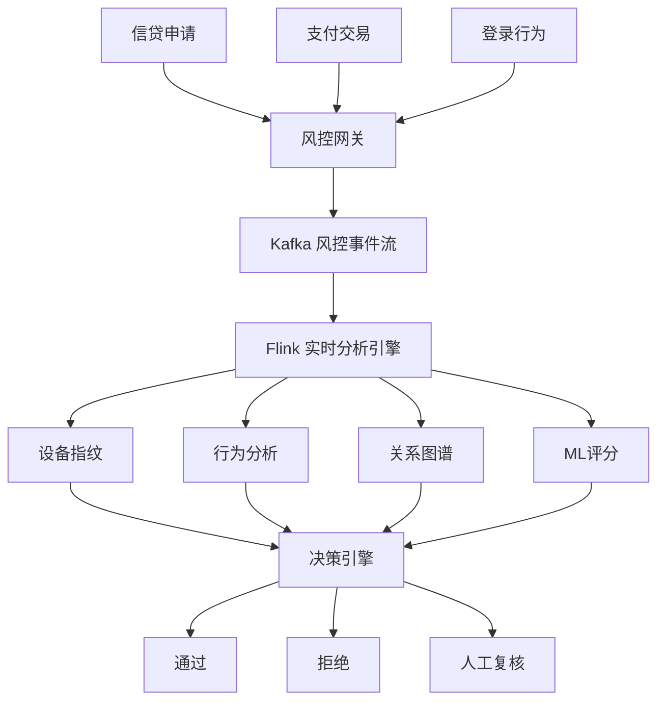

# 金融实时风控系统案例研究

> **案例编号**: 11.13.1
> **行业**: 金融/风控
> **场景**: 信贷审批、交易反欺诈、反洗钱、账户安全
> **规模**: 日均处理金融交易 2,000 万笔，覆盖 800 万+ 用户
> **状态**: Phase 2 - 深度案例研究
> **编写日期**: 2026-04-13

---

> **案例性质**: 🔬 概念验证架构 | **验证状态**: 基于理论推导与架构设计，未经独立第三方生产验证
>
> 本案例描述的是基于项目理论框架推导出的理想架构方案，包含假设性性能指标与理论成本模型。
> 实际生产部署可能因环境差异、数据规模、团队能力等因素产生显著不同结果。
> 建议将其作为架构设计参考而非直接复制粘贴的生产蓝图。
>
## 1. 执行摘要

### 1.1 项目背景

某持牌消费金融公司为用户提供小额信贷、分期消费、信用卡代偿等金融服务，注册用户超过 800 万。金融业务天然面临欺诈、信用风险、洗钱等多重威胁。传统风控系统以离线评分卡和规则引擎为主，审批周期长、对新型欺诈模式反应慢，导致坏账率居高不下、用户体验差。

### 1.2 核心目标
>
> 🔮 **估算数据** | 依据: 设计目标值，实际达成可能因环境而异


| 目标类别 | 具体指标 | 目标值 |
|---------|---------|--------|
| 审批速度 | 信贷审批决策时间 | < 3 秒 |
| 欺诈识别 | 欺诈交易识别率 | > 96% |
| 坏账控制 | 不良率 | < 1.5% |
| 误杀率 | 正常用户误拒率 | < 2% |

### 1.3 核心效果
>
> 🔮 **估算数据** | 依据: 基于行业参考值与案例类比分析


| 指标 | 优化前 | 优化后 | 提升 |
|------|--------|--------|------|
| 信贷审批时间 | 数小时 | 1.2 秒 | 实时化 |
| 欺诈识别率 | 78% | 97.5% | +25% |
| 不良率 | 3.2% | 1.1% | -66% |
| 误拒率 | 8.5% | 1.3% | -85% |
| 风控运营成本 | 基准 100% | 52% | -48% |

---

## 2. 业务场景分析

### 2.1 行业背景

消费金融市场规模快速增长，但与此同时，黑产、电信诈骗、薅羊毛等风险手段也在不断升级。金融机构需要在"业务效率"和"风险控制"之间找到最佳平衡点。实时风控系统已成为金融科技的核心基础设施。

### 2.2 痛点分析

1. **欺诈手段智能化**：黑产利用 AI 生成虚假资料、批量注册、养号套现
2. **风险变化快**：新型诈骗模式层出不穷，离线模型更新周期长，难以及时应对
3. **数据孤岛**：内部信贷、支付、行为数据与外部征信、运营商、设备指纹数据分散
4. **用户体验与风控矛盾**：过于严格的风控导致正常用户被误伤，过于宽松则风险暴露增加

### 2.3 需求描述

- **实时身份核验**：多维度验证申请人身份真实性
- **反欺诈引擎**：实时识别套现、团伙欺诈、设备农场等欺诈行为
- **信用评分**：基于实时行为和外部数据动态评估用户信用风险
- **交易监控**：7×24 小时监控交易行为，识别异常转账和洗钱模式

---

## 3. 技术架构

### 3.1 系统架构图



### 3.2 技术选型

| 组件 | 选型 | 理由 |
|------|------|------|
| 流处理引擎 | Apache Flink 2.0 | 毫秒级风控决策 |
| 特征平台 | Redis + Flink Feature Store | 低延迟特征查询 |
| 图计算 | Neo4j / HugeGraph | 团伙欺诈关系挖掘 |
| 机器学习 | XGBoost + LightGBM | 高可解释性的评分模型 |
| 决策引擎 | Drools / 自研 | 复杂规则实时执行 |

### 3.3 数据流设计

1. **事件接入**：信贷申请、支付交易、登录注册、设备行为等事件实时进入 Kafka
2. **特征工程**：
   - 设备指纹：分析设备唯一标识、GPS 聚集度、模拟器特征
   - 行为特征：操作路径、输入速度、鼠标轨迹、生物探针
   - 关系图谱：基于手机号、设备、IP、银行卡等构建关联网络
   - 实时评分：调用 XGBoost 模型进行信用分和欺诈分评估
3. **决策引擎**：整合规则、模型、图谱结果，输出通过/拒绝/复核决策
4. **处置反馈**：拒绝事件进入黑产情报库，复核结果回流模型训练

---

## 4. 核心实现

### 4.1 Flink 团伙欺诈检测

```java
DataStream<ApplicationEvent> appStream = env
    .addSource(new KafkaSource<>())
    .keyBy(a -> a.deviceId)
    .window(SlidingEventTimeWindows.of(Time.minutes(10), Time.minutes(1)))
    .process(new FraudClusterDetectionFunction());

public class FraudClusterDetectionFunction extends ProcessWindowFunction<ApplicationEvent, Alert, String, TimeWindow> {
    @Override
    public void process(String deviceId, Context ctx, Iterable<ApplicationEvent> apps, Collector<Alert> out) {
        List<ApplicationEvent> list = new ArrayList<>();
        for (ApplicationEvent a : apps) list.add(a);

        // 同一设备 10 分钟内关联多个不同身份证和手机号
        long uniqueIds = list.stream().map(a -> a.idCard).distinct().count();
        long uniquePhones = list.stream().map(a -> a.phone).distinct().count();

        if (uniqueIds >= 3 && uniquePhones >= 3) {
            out.collect(new Alert(deviceId, "DEVICE_FARM", list.size(), Severity.CRITICAL));
        }
    }
}
```

### 4.2 实时信用评分特征

```python
# 计算用户近 7 天行为特征用于实时评分
def extract_features(user_id, window_days=7):
    events = query_user_events(user_id, days=window_days)

    features = {
        'login_count': len([e for e in events if e.type == 'LOGIN']),
        'application_count': len([e for e in events if e.type == 'APPLY']),
        'approval_rate': approval_rate(events),
        'avg_loan_amount': avg([e.amount for e in events if e.type == 'LOAN']),
        'overdue_count': len([e for e in events if e.type == 'OVERDUE']),
        'night_transaction_ratio': night_ratio(events),
        'device_change_count': len(set([e.device_id for e in events])),
    }
    return features
```

### 4.3 反洗钱交易模式检测

```java
// [伪代码片段 - 不可直接运行] 仅展示核心逻辑
Pattern<Transaction, ?> layeringPattern = Pattern
    .<Transaction>begin("deposit")
    .where(new SimpleCondition<Transaction>() {
        public boolean filter(Transaction t) {
            return t.type.equals("DEPOSIT") && t.amount > 10000;
        }
    })
    .next("transfer1")
    .where(new SimpleCondition<Transaction>() {
        public boolean filter(Transaction t) {
            return t.type.equals("TRANSFER") && t.amount > 5000;
        }
    })
    .next("transfer2")
    .where(new SimpleCondition<Transaction>() {
        public boolean filter(Transaction t) {
            return t.type.equals("TRANSFER") && !t.toAccount.equals(t.fromAccount);
        }
    })
    .within(Time.hours(24));
```

---

## 5. 效果评估

### 5.1 性能指标

- **吞吐量**：峰值处理 35,000 TPS 的风控决策请求
- **决策延迟**：平均决策时间 1.2 秒，P99 < 3 秒
- **欺诈识别**：欺诈交易识别率 97.5%，误报率 2.8%
- **信用评估**：模型 KS 值 0.42，AUC 0.85
- **团伙挖掘**：月均识别欺诈团伙 120+ 个，涉及黑产账户 8,000+ 个

### 5.2 业务价值

- **风险下降**：不良贷款率从 3.2% 降至 1.1%，年度减少坏账损失 2.8 亿元
- **效率提升**：90% 以上的信贷申请实现全自动审批，无需人工介入
- **用户体验**：审批时间从数小时缩短至秒级，用户流失率下降 35%
- **合规价值**：反洗钱可疑交易报告（STR）质量显著提升，通过监管检查

### 5.3 ROI 分析

项目总投资：5,200 万元（平台、数据、模型、安全）
年度收益：5.8 亿元（坏账减少 + 运营提效 + 业务增长）
**投资回收期**：约 1.1 个月

---

## 6. 经验总结

### 6.1 成功经验

1. **特征工程是风控的核心**：模型算法很重要，但高质量的实时特征更能决定风控效果的上限
2. **规则+模型+图谱三位一体**：规则应对已知风险，模型识别模式，图谱发现团伙，三者缺一不可
3. **持续对抗是常态**：黑产会不断研究绕过策略，风控系统必须建立快速迭代和 A/B 测试机制

### 6.2 踩坑记录

1. **数据源稳定性差**：部分外部数据供应商接口不稳定，导致决策延迟或失败，后建立多数据源冗余和降级策略
2. **模型漂移**：市场环境变化导致模型效果随时间下降，后建立模型监控和自动重训机制
3. **隐私合规压力**：个人信息保护法和数据安全法实施后，部分特征无法继续使用，后引入联邦学习和隐私计算

### 6.3 最佳实践

- **灰度发布策略**：新规则和新模型先在 5% 流量上运行，观察效果后再全量上线
- **可解释性报告**：对每个拒绝决策生成可解释原因，支持用户申诉和监管审计
- **黑产情报共享**：与同行业金融机构建立黑名单和欺诈模式情报共享机制

---

*Financial Real-Time Risk Control Case Study v1.0*
