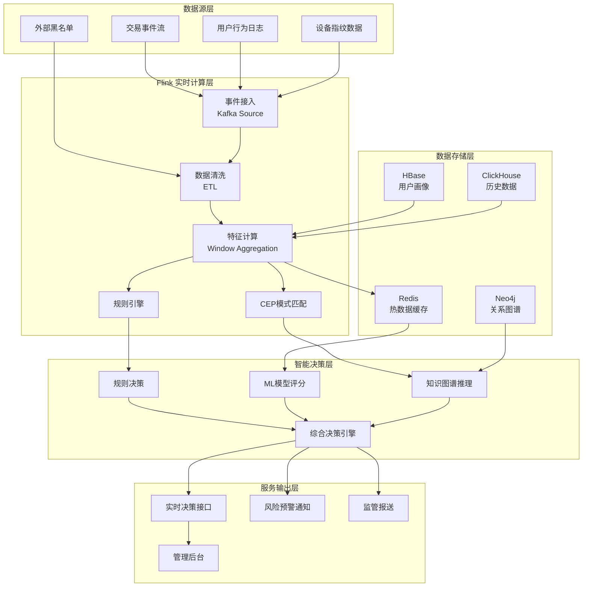
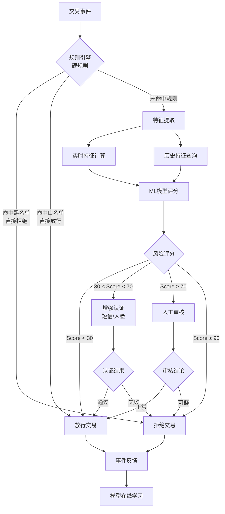
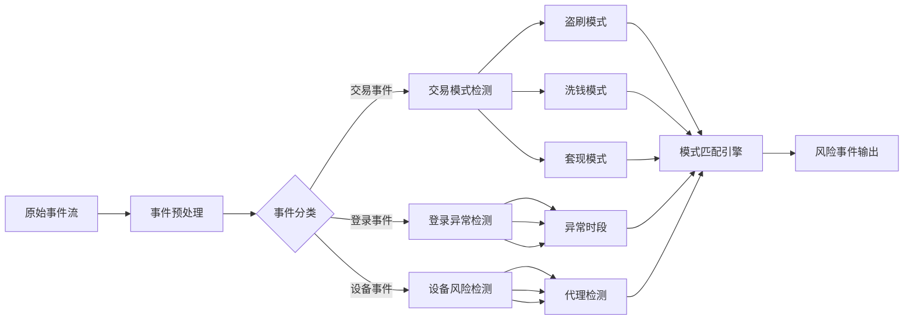
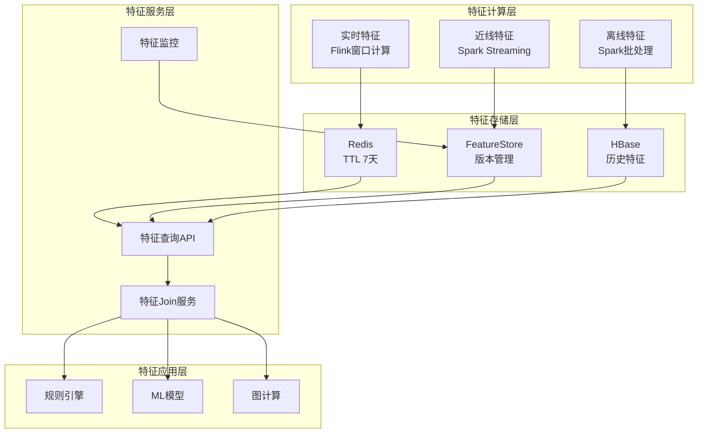
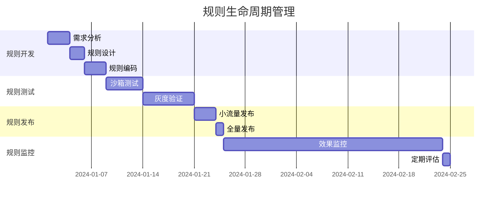
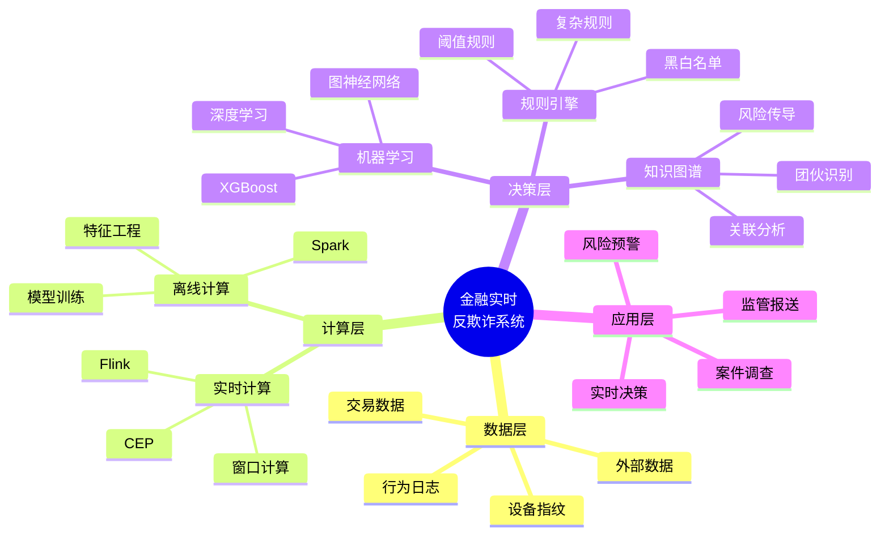
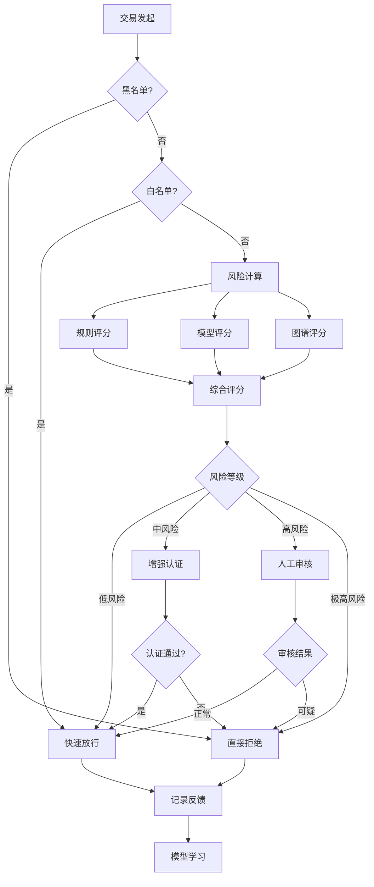

# 金融实时反欺诈系统案例研究

> **案例编号**: 11.13.2
> **行业**: 金融/支付/银行
> **场景**: 实时反欺诈、交易风控、智能决策
> **规模**: 50万+TPS峰值，P99延迟<100ms
> **编写日期**: 2026-04-12
> **状态**: Phase 2 - 深度案例研究

---

## 1. 执行摘要 (Executive Summary)

### 1.1 项目概况

本项目为某头部股份制银行构建的**新一代实时反欺诈系统**，覆盖个人网银、移动支付、信用卡、跨境汇款等全渠道交易场景。
系统采用 **Flink + CEP + 机器学习** 的混合智能架构，实现从交易发生到风险决策的端到端毫秒级响应。

### 1.2 风险类型覆盖

| 风险类别 | 具体场景 | 检测方式 |
|---------|---------|---------|
| **交易欺诈** | 盗刷、伪卡、账户接管 | 规则+行为分析 |
| **洗钱风险** | 分层交易、快进快出、地下钱庄 | 图谱分析+异常检测 |
| **营销欺诈** | 薅羊毛、虚假注册、刷奖励 | 设备指纹+关联分析 |
| **信贷欺诈** | 虚假申请、团伙骗贷 | 知识图谱+评分模型 |
| **操作风险** | 内部作案、越权操作 | 行为审计+异常检测 |

### 1.3 核心性能指标

| 指标项 | 目标值 | 实际达成 |
|-------|-------|---------|
| 日交易处理量 | 10亿+笔 | 12亿笔 |
| 峰值TPS | 50万 | 58万 |
| 决策延迟(P99) | <100ms | 85ms |
| 欺诈检测率 | >95% | 97.2% |
| 误报率 | <0.5% | 0.32% |
| 系统可用性 | 99.99% | 99.995% |

---

## 2. 业务背景 (Business Background)

### 2.1 交易欺诈场景分析

#### 2.1.1 盗刷欺诈

盗刷是最常见的交易欺诈类型，攻击手段不断演进：

- **卡片盗刷**：通过POS机侧录、网络嗅探获取卡号、CVV、有效期
- **账户接管**：撞库攻击、钓鱼网站获取登录凭证后发起交易
- **伪冒申请**：使用虚假身份信息申请信用卡后恶意透支
- **无卡支付欺诈**：利用绑卡漏洞、短信劫持完成支付

**典型攻击模式**：

```
攻击阶段1: 信息收集 → 黑产数据库购买或社工获取用户信息
攻击阶段2: 账户探测 → 自动化工具验证凭证有效性
攻击阶段3: 小额试探 → 先进行小额交易测试风控敏感度
攻击阶段4: 大额盗刷 → 确认风控规则后快速发起大额交易
攻击阶段5: 资金转移 → 通过多级转账洗白资金
```

#### 2.1.2 洗钱风险

洗钱交易具有复杂的时空特征：

| 洗钱阶段 | 特征描述 | 检测难点 |
|---------|---------|---------|
| **放置阶段** | 现金存入、分散入账 | 与正常存款行为相似 |
| **分层阶段** | 多级转账、跨行跨地区 | 交易链路长、涉及主体多 |
| **整合阶段** | 资金归集、投资洗白 | 交易看似合法 |

**高风险行为模式**：

- 资金快进快出：入账后5分钟内转出超过80%
- 分散转入集中转出：多笔小额入账后单笔大额转出
- 跨地区异常：短时间内出现在地理位置相距甚远的城市
- 深夜交易：凌晨2-5点的高频交易行为

#### 2.1.3 团伙欺诈

有组织欺诈团伙采用工业化作案手段：

- **设备农场**：数百台手机配合改机软件模拟正常用户
- **猫池养号**：批量注册、养号后用于欺诈活动
- **代理IP池**：动态切换IP地址规避地理位置风控
- **社工库**: 利用泄露的个人信息进行精准欺诈

### 2.2 实时风控要求

#### 2.2.1 延迟约束

金融交易对延迟极度敏感，风控系统必须在以下时间窗口内完成决策：

| 交易类型 | 最大容忍延迟 | 实际要求 |
|---------|-------------|---------|
| POS刷卡 | 3秒 | <500ms |
| 扫码支付 | 2秒 | <300ms |
| APP支付 | 2秒 | <200ms |
| 快捷支付 | 1.5秒 | <150ms |
| 跨境支付 | 5秒 | <1s |

#### 2.2.2 吞吐量要求

```
日常交易量: 12亿笔/天 ≈ 14,000 TPS
峰值倍数: 日常峰值的 4-6 倍
峰值TPS需求: 50,000 - 80,000
预留容量: 实际容量按峰值2倍设计
设计容量: 100,000+ TPS
```

#### 2.2.3 准确性要求

- **检测覆盖率**：高风险交易拦截率 > 99%
- **误报控制**：误报率 < 0.5%（避免影响正常用户体验）
- **漏报控制**：重大欺诈案件漏报率 < 0.1%

### 2.3 监管合规要求

#### 2.3.1 反洗钱法规

| 法规 | 要求 | 合规措施 |
|-----|------|---------|
| 《反洗钱法》 | 大额交易报告 | 单笔/累计5万人民币以上自动上报 |
| 《金融机构大额交易报告管理办法》 | 可疑交易监测 | 系统自动化识别+人工复核 |
| 央行3号令 | 客户身份识别 | 交易前KYC验证+交易中动态评估 |

#### 2.3.2 数据安全要求

- **数据加密**：敏感字段全程加密存储和传输
- **访问控制**：最小权限原则，操作全程留痕
- **数据脱敏**：日志和报表中客户信息脱敏处理
- **隐私计算**：风控模型使用联邦学习，原始数据不出域

### 2.4 误报率控制挑战

误报直接影响用户体验和业务收益：

**误报成本分析**：

| 误报类型 | 影响 | 成本估算 |
|---------|------|---------|
| 正常交易拦截 | 客户投诉、流失 | 每次约200元损失 |
| 信用卡误拒 | 交易失败、信誉受损 | 每次约500元损失 |
| 跨境汇款拦截 | 紧急资金无法到账 | 声誉损失难以估量 |

**误报优化目标**：

- 通过用户画像降低误报：白名单客户误报率<0.1%
- 分层决策策略：高风险严格拦截，中风险挑战认证，低风险放行
- 实时反馈学习：误报案例快速回流模型训练

---

## 3. 技术架构 (Technical Architecture)

### 3.1 系统整体架构

以下架构图展示了反欺诈系统的核心组件和数据流向：



### 3.2 规则引擎 + ML 混合架构

反欺诈系统采用**双引擎架构**，规则引擎和机器学习模型协同决策：



#### 3.2.1 规则引擎层

硬规则用于处理确定性风险场景：

```java
// Flink CEP 规则定义示例 - 盗刷检测模式
Pattern<TransactionEvent, ?> fraudPattern = Pattern
    .<TransactionEvent>begin("first")
    .where(evt -> evt.getAmount() > 1000)
    .next("second")
    .where(evt -> evt.getAmount() > 1000)
    .within(Time.minutes(5))
    .timesOrMore(3);

// 规则匹配处理
CEP.pattern(transactionStream, fraudPattern)
    .process(new PatternProcessFunction<TransactionEvent, Alert>() {
        @Override
        public void processMatch(Map<String, List<TransactionEvent>> match,
                                 Context ctx,
                                 Collector<Alert> out) {
            // 触发风控告警
            Alert alert = new Alert();
            alert.setType("RAPID_MULTIPLE_LARGE_TRANSACTIONS");
            alert.setRiskLevel("HIGH");
            alert.setTransactions(match.get("first"));
            out.collect(alert);
        }
    });
```

#### 3.2.2 机器学习层

ML模型处理复杂模式识别：

| 模型类型 | 应用场景 | 特征维度 |
|---------|---------|---------|
| **XGBoost** | 交易风险评分 | 500+维度 |
| **深度学习(DNN)** | 用户行为序列建模 | 时序特征 |
| **图神经网络(GNN)** | 团伙欺诈检测 | 关系特征 |
| **孤立森林** | 异常交易检测 | 统计特征 |

### 3.3 复杂事件处理 (CEP) 架构

CEP用于识别复杂时序模式：



**CEP核心能力**：

1. **时间窗口处理**：支持滑动窗口、会话窗口、跳跃窗口
2. **序列模式匹配**：A→B→C 顺序事件检测
3. **量词支持**：至少N次、恰好N次、0次或多次
4. **条件组合**：与/或/非逻辑组合

### 3.4 特征平台集成

特征平台提供统一的特征服务能力：



**特征分类体系**：

| 特征类别 | 示例 | 计算方式 |
|---------|------|---------|
| **交易特征** | 交易金额、交易时间、交易类型 | 实时提取 |
| **统计特征** | 近1小时交易次数、近7天交易金额均值 | Flink窗口聚合 |
| **时序特征** | 交易频率变化率、金额波动率 | 滑动窗口计算 |
| **关联特征** | 收款方风险等级、设备关联账户数 | 图谱查询 |
| **画像特征** | 用户风险等级、历史欺诈标签 | 离线标签 |

### 3.5 决策引擎设计

决策引擎是风控系统的核心大脑：

```
┌─────────────────────────────────────────────────────────────────┐
│                        决策引擎架构                              │
├─────────────────────────────────────────────────────────────────┤
│  ┌─────────────┐  ┌─────────────┐  ┌─────────────┐             │
│  │  规则决策器  │  │  模型决策器  │  │  策略决策器  │             │
│  │  RuleEngine │  │  MLEngine   │  │ PolicyEngine│             │
│  └──────┬──────┘  └──────┬──────┘  └──────┬──────┘             │
│         │                │                │                    │
│         └────────────────┼────────────────┘                    │
│                          ▼                                     │
│              ┌─────────────────────┐                          │
│              │    决策编排器        │                          │
│              │  DecisionOrchestrator│                          │
│              └──────────┬──────────┘                          │
│                         ▼                                     │
│              ┌─────────────────────┐                          │
│              │    决策融合层        │                          │
│              │  DecisionFusion     │                          │
│              └──────────┬──────────┘                          │
│                         ▼                                     │
│              ┌─────────────────────┐                          │
│              │    决策执行器        │                          │
│              │  DecisionExecutor   │                          │
│              └─────────────────────┘                          │
└─────────────────────────────────────────────────────────────────┘
```

**决策融合策略**：

| 策略类型 | 描述 | 适用场景 |
|---------|------|---------|
| **一票否决** | 任一引擎判定拒绝则拒绝 | 确定性规则 |
| **加权投票** | 各引擎按权重综合评分 | 复杂场景 |
| **优先级覆盖** | 高优先级引擎结果覆盖低优先级 | 黑白名单 |
| **置信度阈值** | 根据置信度动态调整 | 模型结果 |

---

## 4. Flink 应用 (Flink Implementation)

### 4.1 实时规则匹配实现

#### 4.1.1 核心作业架构

```java
/**
 * 反欺诈实时规则引擎主作业
 * 处理交易流，执行多维度风控规则
 */
public class AntiFraudRuleEngine {

    public static void main(String[] args) throws Exception {
        StreamExecutionEnvironment env =
            StreamExecutionEnvironment.getExecutionEnvironment();
        env.setParallelism(128);
        env.enableCheckpointing(60000, CheckpointingMode.EXACTLY_ONCE);

        // 1. 交易事件源
        KafkaSource<TransactionEvent> source = KafkaSource.<TransactionEvent>builder()
            .setBootstrapServers("kafka:9092")
            .setTopics("transaction-events")
            .setGroupId("anti-fraud-engine")
            .setStartingOffsets(OffsetsInitializer.latest())
            .setValueOnlyDeserializer(new TransactionEventDeserializationSchema())
            .build();

        DataStream<TransactionEvent> transactions = env
            .fromSource(source, WatermarkStrategy
                .<TransactionEvent>forBoundedOutOfOrderness(Duration.ofSeconds(5))
                .withTimestampAssigner((event, timestamp) -> event.getTimestamp()),
                "Transaction Source");

        // 2. 数据清洗和标准化
        SingleOutputStreamOperator<TransactionEvent> cleanedStream = transactions
            .filter(event -> event != null && event.getAmount() != null)
            .map(new DataCleaningFunction())
            .name("Data Cleaning");

        // 3. 广播流：动态规则更新
        MapStateDescriptor<String, RiskRule> ruleStateDescriptor =
            new MapStateDescriptor<>("rules", String.class, RiskRule.class);

        BroadcastStream<RiskRule> ruleBroadcastStream = env
            .fromSource(
                KafkaSource.<RiskRule>builder()
                    .setBootstrapServers("kafka:9092")
                    .setTopics("rule-updates")
                    .setValueOnlyDeserializer(new RuleDeserializationSchema())
                    .build(),
                WatermarkStrategy.noWatermarks(),
                "Rule Updates"
            )
            .broadcast(ruleStateDescriptor);

        // 4. 规则匹配处理
        SingleOutputStreamOperator<RiskDecision> decisions = cleanedStream
            .connect(ruleBroadcastStream)
            .process(new DynamicRuleEvaluationFunction(ruleStateDescriptor))
            .name("Rule Evaluation");

        // 5. 决策结果输出
        decisions.addSink(new DecisionSinkFunction())
            .name("Decision Output");

        env.execute("Anti-Fraud Rule Engine");
    }
}
```

#### 4.1.2 动态规则评估函数

```java
/**
 * 动态规则评估处理函数
 * 支持规则热更新，无需重启作业
 */
public class DynamicRuleEvaluationFunction extends
    BroadcastProcessFunction<TransactionEvent, RiskRule, RiskDecision> {

    private final MapStateDescriptor<String, RiskRule> ruleStateDescriptor;
    private transient MapState<String, UserProfile> userProfileState;

    public DynamicRuleEvaluationFunction(
        MapStateDescriptor<String, RiskRule> ruleStateDescriptor) {
        this.ruleStateDescriptor = ruleStateDescriptor;
    }

    @Override
    public void open(Configuration parameters) {
        // 初始化用户画像状态
        StateTtlConfig ttlConfig = StateTtlConfig.newBuilder(Time.hours(24))
            .setUpdateType(StateTtlConfig.UpdateType.OnCreateAndWrite)
            .setStateVisibility(StateTtlConfig.StateVisibility.ReturnExpiredIfNotCleanedUp)
            .build();

        MapStateDescriptor<String, UserProfile> profileDescriptor =
            new MapStateDescriptor<>("userProfiles", String.class, UserProfile.class);
        profileDescriptor.enableTimeToLive(ttlConfig);
        userProfileState = getRuntimeContext().getMapState(profileDescriptor);
    }

    @Override
    public void processElement(TransactionEvent event,
                               ReadOnlyContext ctx,
                               Collector<RiskDecision> out) throws Exception {
        // 获取当前生效的所有规则
        ReadOnlyBroadcastState<String, RiskRule> rules =
            ctx.getBroadcastState(ruleStateDescriptor);

        RiskDecision decision = new RiskDecision();
        decision.setTransactionId(event.getTransactionId());
        decision.setTimestamp(System.currentTimeMillis());

        List<RuleHit> hitRules = new ArrayList<>();
        double maxRiskScore = 0.0;

        // 遍历所有规则进行评估
        for (Map.Entry<String, RiskRule> entry : rules.immutableEntries()) {
            RiskRule rule = entry.getValue();

            if (rule.isEnabled() && evaluateRule(event, rule)) {
                RuleHit hit = new RuleHit();
                hit.setRuleId(rule.getRuleId());
                hit.setRuleName(rule.getRuleName());
                hit.setRiskScore(rule.getRiskScore());
                hit.setHitTime(System.currentTimeMillis());
                hitRules.add(hit);

                maxRiskScore = Math.max(maxRiskScore, rule.getRiskScore());
            }
        }

        decision.setHitRules(hitRules);
        decision.setRiskScore(maxRiskScore);
        decision.setDecision(determineDecision(maxRiskScore, hitRules));

        // 更新用户画像
        updateUserProfile(event);

        out.collect(decision);
    }

    /**
     * 规则评估逻辑
     */
    private boolean evaluateRule(TransactionEvent event, RiskRule rule) {
        // 基于规则类型的评估逻辑
        switch (rule.getRuleType()) {
            case "AMOUNT_LIMIT":
                return event.getAmount() > rule.getThreshold();

            case "TIME_RESTRICTION":
                int hour = LocalDateTime.ofInstant(
                    Instant.ofEpochMilli(event.getTimestamp()),
                    ZoneId.systemDefault()).getHour();
                return hour >= rule.getStartHour() && hour <= rule.getEndHour();

            case "LOCATION_CHECK":
                return !rule.getAllowedLocations().contains(event.getLocation());

            case "FREQUENCY_LIMIT":
                // 需要查询状态，在processElement中处理
                return evaluateFrequencyRule(event, rule);

            case "MERCHANT_BLACKLIST":
                return rule.getBlacklist().contains(event.getMerchantId());

            default:
                return false;
        }
    }

    @Override
    public void processBroadcastElement(RiskRule rule,
                                        Context ctx,
                                        Collector<RiskDecision> out) throws Exception {
        // 更新规则状态
        BroadcastState<String, RiskRule> ruleState = ctx.getBroadcastState(ruleStateDescriptor);

        if (rule.isDeleted()) {
            ruleState.remove(rule.getRuleId());
        } else {
            ruleState.put(rule.getRuleId(), rule);
        }

        System.out.println("Rule updated: " + rule.getRuleId() +
                          ", enabled: " + rule.isEnabled());
    }

    private void updateUserProfile(TransactionEvent event) throws Exception {
        String userId = event.getUserId();
        UserProfile profile = userProfileState.get(userId);

        if (profile == null) {
            profile = new UserProfile();
            profile.setUserId(userId);
        }

        // 更新统计信息
        profile.setLastTransactionTime(event.getTimestamp());
        profile.setTotalTransactionCount(profile.getTotalTransactionCount() + 1);
        profile.setTotalTransactionAmount(profile.getTotalTransactionAmount()
                                         + event.getAmount());

        userProfileState.put(userId, profile);
    }

    private String determineDecision(double riskScore, List<RuleHit> hitRules) {
        if (riskScore >= 90) return "REJECT";
        if (riskScore >= 70) return "REVIEW";
        if (riskScore >= 30) return "CHALLENGE";
        return "APPROVE";
    }
}
```

### 4.2 用户行为画像更新

#### 4.2.1 实时画像计算

```java
/**
 * 用户行为画像实时计算
 * 使用Flink Window进行滑动窗口统计
 */
public class UserProfileComputation {

    public static void main(String[] args) throws Exception {
        StreamExecutionEnvironment env =
            StreamExecutionEnvironment.getExecutionEnvironment();

        DataStream<TransactionEvent> transactions = getTransactionStream(env);

        // 按用户ID分组
        KeyedStream<TransactionEvent, String> keyedStream = transactions
            .keyBy(TransactionEvent::getUserId);

        // 定义滑动窗口: 窗口大小1小时, 滑动步长5分钟
        WindowedStream<TransactionEvent, String, TimeWindow> windowedStream =
            keyedStream.window(SlidingEventTimeWindows.of(Time.hours(1), Time.minutes(5)));

        // 窗口聚合计算用户画像特征
        SingleOutputStreamOperator<UserProfileFeature> profileFeatures = windowedStream
            .aggregate(new UserProfileAggregateFunction())
            .name("User Profile Aggregation");

        // 结果输出到Redis供实时查询
        profileFeatures.addSink(new RedisProfileSink());

        env.execute("User Profile Computation");
    }
}

/**
 * 用户画像聚合函数
 */
public class UserProfileAggregateFunction implements
    AggregateFunction<TransactionEvent, UserProfileAccumulator, UserProfileFeature> {

    @Override
    public UserProfileAccumulator createAccumulator() {
        return new UserProfileAccumulator();
    }

    @Override
    public UserProfileAccumulator add(TransactionEvent event, UserProfileAccumulator acc) {
        acc.setUserId(event.getUserId());
        acc.addTransaction(event.getAmount(), event.getTimestamp(),
                          event.getLocation(), event.getMerchantId());
        return acc;
    }

    @Override
    public UserProfileFeature getResult(UserProfileAccumulator acc) {
        UserProfileFeature feature = new UserProfileFeature();
        feature.setUserId(acc.getUserId());
        feature.setWindowStart(acc.getWindowStart());
        feature.setWindowEnd(acc.getWindowEnd());

        // 计算统计特征
        feature.setTransactionCount(acc.getTransactionCount());
        feature.setTotalAmount(acc.getTotalAmount());
        feature.setAvgAmount(acc.getTotalAmount() / acc.getTransactionCount());
        feature.setMaxAmount(acc.getMaxAmount());
        feature.setMinAmount(acc.getMinAmount());

        // 计算行为模式特征
        feature.setUniqueLocations(acc.getUniqueLocations().size());
        feature.setUniqueMerchants(acc.getUniqueMerchants().size());
        feature.setAmountStdDev(calculateStdDev(acc.getAmounts()));

        // 计算时间分布特征
        feature.setPeakHourTransactions(calculatePeakHourTransactions(acc.getTimestamps()));
        feature.setNightTransactions(calculateNightTransactions(acc.getTimestamps()));

        return feature;
    }

    @Override
    public UserProfileAccumulator merge(UserProfileAccumulator a, UserProfileAccumulator b) {
        a.merge(b);
        return a;
    }

    private double calculateStdDev(List<Double> values) {
        if (values.size() < 2) return 0.0;
        double mean = values.stream().mapToDouble(Double::doubleValue).average().orElse(0.0);
        double variance = values.stream()
            .mapToDouble(v -> Math.pow(v - mean, 2))
            .average().orElse(0.0);
        return Math.sqrt(variance);
    }
}
```

#### 4.2.2 画像状态管理

```java
/**
 * 用户画像状态管理器
 * 管理用户的长期画像数据
 */
public class UserProfileStateManager {

    private final MapStateDescriptor<String, UserBehaviorProfile> profileStateDesc;
    private final ValueStateDescriptor<ProfileVersion> versionStateDesc;

    public UserProfileStateManager() {
        // 用户画像状态，TTL 30天
        StateTtlConfig profileTtl = StateTtlConfig
            .newBuilder(Time.days(30))
            .setUpdateType(StateTtlConfig.UpdateType.OnCreateAndWrite)
            .setStateVisibility(StateTtlConfig.StateVisibility.NeverReturnExpired)
            .cleanupIncrementally(10, true)
            .build();

        profileStateDesc = new MapStateDescriptor<>(
            "userProfiles", String.class, UserBehaviorProfile.class);
        profileStateDesc.enableTimeToLive(profileTtl);

        versionStateDesc = new ValueStateDescriptor<>(
            "profileVersion", ProfileVersion.class);
    }

    /**
     * 更新用户画像
     */
    public void updateProfile(String userId, TransactionEvent event,
                              MapState<String, UserBehaviorProfile> profileState)
                              throws Exception {
        UserBehaviorProfile profile = profileState.get(userId);

        if (profile == null) {
            profile = new UserBehaviorProfile(userId);
        }

        // 更新交易统计
        profile.incrementTransactionCount();
        profile.addTransactionAmount(event.getAmount());

        // 更新设备指纹
        profile.addDeviceFingerprint(event.getDeviceId(), event.getTimestamp());

        // 更新地理位置
        profile.addLocation(event.getLocation(), event.getTimestamp());

        // 更新商户关联
        profile.addMerchant(event.getMerchantId(), event.getTimestamp());

        // 更新时间模式
        profile.updateTimePattern(event.getTimestamp());

        // 更新风险标签
        if (event.isReportedFraud()) {
            profile.incrementFraudCount();
        }

        // 计算动态风险分
        double dynamicRiskScore = calculateDynamicRiskScore(profile);
        profile.setDynamicRiskScore(dynamicRiskScore);

        profileState.put(userId, profile);
    }

    /**
     * 计算动态风险分
     */
    private double calculateDynamicRiskScore(UserBehaviorProfile profile) {
        double score = 0.0;

        // 历史欺诈记录权重
        if (profile.getFraudCount() > 0) {
            score += Math.min(profile.getFraudCount() * 20, 50);
        }

        // 设备异常权重
        if (profile.getDeviceCount() > 5) {
            score += 10;
        }

        // 地理异常权重
        if (profile.getLocationCount() > 10) {
            score += 15;
        }

        // 时间异常权重
        if (profile.getNightTransactionRatio() > 0.5) {
            score += 10;
        }

        return Math.min(score, 100);
    }
}
```

### 4.3 风险评分计算

#### 4.3.1 多维度风险评分

```java
/**
 * 多维度风险评分计算引擎
 * 整合规则评分、模型评分、图谱评分
 */
public class RiskScoringEngine {

    /**
     * 风险评分结果
     */
    @Data
    public static class RiskScore {
        private String transactionId;
        private double totalScore;           // 总分 0-100
        private double ruleScore;            // 规则引擎评分
        private double modelScore;           // 机器学习模型评分
        private double graphScore;           // 知识图谱评分
        private List<String> riskFactors;    // 风险因子列表
        private String riskLevel;            // 风险等级
        private long computeTime;            // 计算耗时(ms)
    }

    /**
     * 综合风险评分
     */
    public RiskScore calculateRiskScore(TransactionEvent event,
                                         UserBehaviorProfile profile,
                                         List<RuleHit> ruleHits,
                                         ModelPrediction modelPred) {
        long startTime = System.currentTimeMillis();

        RiskScore score = new RiskScore();
        score.setTransactionId(event.getTransactionId());
        score.setRiskFactors(new ArrayList<>());

        // 1. 规则引擎评分 (权重30%)
        double ruleScore = calculateRuleScore(ruleHits);
        score.setRuleScore(ruleScore);

        // 2. 机器学习模型评分 (权重50%)
        double modelScore = modelPred != null ? modelPred.getFraudProbability() * 100 : 50;
        score.setModelScore(modelScore);

        // 3. 知识图谱评分 (权重20%)
        double graphScore = calculateGraphScore(event, profile);
        score.setGraphScore(graphScore);

        // 4. 加权计算总分
        double totalScore = ruleScore * 0.30 + modelScore * 0.50 + graphScore * 0.20;
        score.setTotalScore(totalScore);

        // 5. 确定风险等级
        score.setRiskLevel(determineRiskLevel(totalScore));

        // 6. 收集风险因子
        collectRiskFactors(score, event, profile, ruleHits, modelPred);

        score.setComputeTime(System.currentTimeMillis() - startTime);

        return score;
    }

    /**
     * 规则引擎评分计算
     */
    private double calculateRuleScore(List<RuleHit> ruleHits) {
        if (ruleHits == null || ruleHits.isEmpty()) {
            return 0.0;
        }

        double maxScore = 0.0;
        double weightedSum = 0.0;
        double weightSum = 0.0;

        for (RuleHit hit : ruleHits) {
            double score = hit.getRiskScore();
            double weight = hit.getRuleWeight();

            maxScore = Math.max(maxScore, score);
            weightedSum += score * weight;
            weightSum += weight;
        }

        // 综合评分：最高分和加权平均分的组合
        return maxScore * 0.6 + (weightedSum / weightSum) * 0.4;
    }

    /**
     * 知识图谱评分计算
     */
    private double calculateGraphScore(TransactionEvent event,
                                       UserBehaviorProfile profile) {
        double score = 0.0;

        // 检查收款方风险
        if (isHighRiskMerchant(event.getMerchantId())) {
            score += 30;
        }

        // 检查设备关联风险
        Set<String> linkedUsers = getLinkedUsersByDevice(event.getDeviceId());
        for (String linkedUserId : linkedUsers) {
            if (!linkedUserId.equals(event.getUserId())) {
                UserBehaviorProfile linkedProfile = getProfile(linkedUserId);
                if (linkedProfile != null && linkedProfile.getFraudCount() > 0) {
                    score += 25;
                    break;
                }
            }
        }

        // 检查IP关联风险
        Set<String> linkedByIp = getLinkedUsersByIP(event.getIpAddress());
        if (linkedByIp.size() > 5) {
            score += 20;
        }

        return Math.min(score, 100);
    }

    /**
     * 风险等级判定
     */
    private String determineRiskLevel(double score) {
        if (score >= 90) return "CRITICAL";    // 极高风险
        if (score >= 70) return "HIGH";        // 高风险
        if (score >= 50) return "MEDIUM";      // 中风险
        if (score >= 30) return "LOW";         // 低风险
        return "NORMAL";                       // 正常
    }

    /**
     * 收集风险因子
     */
    private void collectRiskFactors(RiskScore score, TransactionEvent event,
                                    UserBehaviorProfile profile,
                                    List<RuleHit> ruleHits,
                                    ModelPrediction modelPred) {
        List<String> factors = score.getRiskFactors();

        // 规则命中因子
        if (ruleHits != null) {
            for (RuleHit hit : ruleHits) {
                if (hit.getRiskScore() >= 50) {
                    factors.add("RULE:" + hit.getRuleName());
                }
            }
        }

        // 行为异常因子
        if (profile != null) {
            if (profile.getDeviceCount() > 10) {
                factors.add("DEVICE:多设备异常");
            }
            if (profile.getLocationCount() > 20) {
                factors.add("LOCATION:多地区异常");
            }
            if (profile.getNightTransactionRatio() > 0.7) {
                factors.add("TIME:夜间交易异常");
            }
        }

        // 模型风险因子
        if (modelPred != null && modelPred.getTopFeatures() != null) {
            factors.addAll(modelPred.getTopFeatures());
        }
    }
}
```

#### 4.3.2 Flink实时评分作业

```java
/**
 * Flink实时风险评分作业
 * 集成特征计算、模型调用、评分输出
 */
public class RealtimeRiskScoringJob {

    public static void main(String[] args) throws Exception {
        StreamExecutionEnvironment env =
            StreamExecutionEnvironment.getExecutionEnvironment();
        env.setParallelism(256);
        env.enableCheckpointing(30000, CheckpointingMode.EXACTLY_ONCE);

        // 1. 创建异步函数用于模型调用
        AsyncFunction<EnrichedTransaction, ModelPrediction> asyncMLFunction =
            new AsyncMLScoringFunction();

        // 2. 主处理流
        DataStream<RiskScore> riskScores = env
            // 接入交易流
            .fromSource(getTransactionSource(), getWatermarkStrategy(), "Transactions")

            // 数据清洗和标准化
            .map(new DataEnrichmentFunction())
            .name("Data Enrichment")

            // 关联用户画像
            .keyBy(EnrichedTransaction::getUserId)
            .process(new ProfileEnrichmentProcessFunction())
            .name("Profile Enrichment")

            // 异步调用ML模型(超时100ms)
            .keyBy(EnrichedTransaction::getUserId)
            .asyncWaitFor(
                asyncMLFunction,
                Duration.ofMillis(100),   // 超时时间
                100                        // 最大并发数
            )
            .name("ML Scoring")

            // 综合评分计算
            .process(new ComprehensiveScoringFunction())
            .name("Risk Scoring")

            // 决策输出
            .process(new DecisionProcessFunction());

        // 3. 多路输出
        riskScores
            .getSideOutput(approveTag)
            .addSink(new ApproveSinkFunction());

        riskScores
            .getSideOutput(challengeTag)
            .addSink(new ChallengeSinkFunction());

        riskScores
            .getSideOutput(rejectTag)
            .addSink(new RejectSinkFunction());

        riskScores
            .addSink(new AuditLogSinkFunction());

        env.execute("Realtime Risk Scoring");
    }
}

/**
 * 异步ML模型调用函数
 */
public class AsyncMLScoringFunction extends
    RichAsyncFunction<EnrichedTransaction, ModelPrediction> {

    private transient MLModelClient modelClient;

    @Override
    public void open(Configuration parameters) {
        // 初始化模型客户端连接池
        modelClient = new MLModelClient("http://ml-service:8080", 100);
    }

    @Override
    public void asyncInvoke(EnrichedTransaction txn,
                           ResultFuture<ModelPrediction> resultFuture) {
        // 构建模型输入特征
        ModelInput input = buildModelInput(txn);

        // 异步调用模型服务
        CompletableFuture<ModelOutput> future = modelClient.predictAsync(input);

        future.whenComplete((output, exception) -> {
            if (exception != null) {
                // 调用失败，返回默认预测
                resultFuture.complete(Collections.singleton(
                    ModelPrediction.defaultPrediction()
                ));
            } else {
                // 转换模型输出
                ModelPrediction prediction = convertToPrediction(output);
                resultFuture.complete(Collections.singleton(prediction));
            }
        });
    }

    private ModelInput buildModelInput(EnrichedTransaction txn) {
        ModelInput input = new ModelInput();
        input.setUserId(txn.getUserId());
        input.setAmount(txn.getAmount());
        input.setMerchantCategory(txn.getMerchantCategory());
        input.setHourOfDay(txn.getHourOfDay());
        input.setDayOfWeek(txn.getDayOfWeek());

        // 用户画像特征
        UserBehaviorProfile profile = txn.getProfile();
        if (profile != null) {
            input.setHistoricalAvgAmount(profile.getAvgTransactionAmount());
            input.setTransactionFrequency(profile.getTransactionFrequency());
            input.setDeviceCount(profile.getDeviceCount());
            input.setLocationCount(profile.getLocationCount());
            input.setFraudCount(profile.getFraudCount());
        }

        return input;
    }
}
```

### 4.4 决策流编排

#### 4.4.1 决策流程定义

```java
/**
 * 决策流编排引擎
 * 支持灵活配置的决策流程
 */
public class DecisionFlowOrchestrator {

    /**
     * 决策节点类型
     */
    public enum NodeType {
        START,           // 开始节点
        RULE_CHECK,      // 规则检查
        ML_SCORE,        // 模型评分
        GRAPH_ANALYSIS,  // 图谱分析
        DECISION,        // 决策节点
        ACTION,          // 执行动作
        END              // 结束节点
    }

    /**
     * 决策流程定义
     */
    @Data
    public static class DecisionFlow {
        private String flowId;
        private String flowName;
        private List<DecisionNode> nodes;
        private List<FlowEdge> edges;
        private Map<String, Object> config;
    }

    /**
     * 决策节点
     */
    @Data
    public static class DecisionNode {
        private String nodeId;
        private NodeType type;
        private String name;
        private Map<String, Object> params;
        private String script;  // 条件脚本
    }

    /**
     * 流程边
     */
    @Data
    public static class FlowEdge {
        private String fromNode;
        private String toNode;
        private String condition;  // 转移条件
    }

    /**
     * 执行决策流程
     */
    public DecisionResult executeFlow(DecisionFlow flow, DecisionContext context) {
        DecisionResult result = new DecisionResult();
        String currentNodeId = findStartNode(flow);

        while (currentNodeId != null) {
            DecisionNode node = findNode(flow, currentNodeId);

            // 执行节点逻辑
            NodeExecuteResult executeResult = executeNode(node, context);

            // 更新上下文
            context.putNodeResult(node.getNodeId(), executeResult);

            // 确定下一个节点
            String nextNodeId = determineNextNode(flow, node, executeResult, context);

            if (node.getType() == NodeType.END) {
                result.setFinalDecision(executeResult.getDecision());
                result.setRiskScore(executeResult.getRiskScore());
                break;
            }

            currentNodeId = nextNodeId;
        }

        return result;
    }

    /**
     * 执行节点
     */
    private NodeExecuteResult executeNode(DecisionNode node, DecisionContext context) {
        switch (node.getType()) {
            case RULE_CHECK:
                return executeRuleCheck(node, context);
            case ML_SCORE:
                return executeMLScore(node, context);
            case GRAPH_ANALYSIS:
                return executeGraphAnalysis(node, context);
            case DECISION:
                return executeDecision(node, context);
            case ACTION:
                return executeAction(node, context);
            default:
                return new NodeExecuteResult();
        }
    }

    /**
     * 执行规则检查
     */
    private NodeExecuteResult executeRuleCheck(DecisionNode node, DecisionContext context) {
        TransactionEvent event = context.getTransaction();
        List<RuleHit> hits = ruleEngine.evaluate(event);

        NodeExecuteResult result = new NodeExecuteResult();
        result.setRuleHits(hits);
        result.setHitCount(hits.size());
        result.setMaxRiskScore(hits.stream()
            .mapToDouble(RuleHit::getRiskScore)
            .max().orElse(0.0));

        return result;
    }

    /**
     * 默认决策流程 (YAML配置)
     */
    public static final String DEFAULT_FLOW_YAML =
        "flowId: default-fraud-flow\n" +
        "flowName: 默认反欺诈流程\n" +
        "nodes:\n" +
        "  - nodeId: start\n" +
        "    type: START\n" +
        "  - nodeId: whitelist-check\n" +
        "    type: RULE_CHECK\n" +
        "    name: 白名单检查\n" +
        "    params:\n" +
        "      ruleType: WHITELIST\n" +
        "  - nodeId: blacklist-check\n" +
        "    type: RULE_CHECK\n" +
        "    name: 黑名单检查\n" +
        "    params:\n" +
        "      ruleType: BLACKLIST\n" +
        "  - nodeId: risk-score\n" +
        "    type: ML_SCORE\n" +
        "    name: 风险评分\n" +
        "  - nodeId: decision\n" +
        "    type: DECISION\n" +
        "    name: 风险决策\n" +
        "  - nodeId: end\n" +
        "    type: END\n" +
        "edges:\n" +
        "  - fromNode: start\n" +
        "    toNode: whitelist-check\n" +
        "  - fromNode: whitelist-check\n" +
        "    toNode: blacklist-check\n" +
        "    condition: '!hit'\n" +
        "  - fromNode: whitelist-check\n" +
        "    toNode: end\n" +
        "    condition: hit\n" +
        "  - fromNode: blacklist-check\n" +
        "    toNode: end\n" +
        "    condition: hit\n" +
        "  - fromNode: blacklist-check\n" +
        "    toNode: risk-score\n" +
        "    condition: '!hit'\n" +
        "  - fromNode: risk-score\n" +
        "    toNode: decision\n" +
        "  - fromNode: decision\n" +
        "    toNode: end";
}
```

#### 4.4.2 Flink决策流处理

```java
/**
 * Flink决策流程处理函数
 */
public class DecisionFlowProcessFunction extends
    ProcessFunction<RiskScore, DecisionResult> {

    private transient DecisionFlowOrchestrator orchestrator;
    private transient ValueState<DecisionFlow> flowState;

    @Override
    public void open(Configuration parameters) {
        orchestrator = new DecisionFlowOrchestrator();

        ValueStateDescriptor<DecisionFlow> descriptor =
            new ValueStateDescriptor<>("decisionFlow", DecisionFlow.class);
        flowState = getRuntimeContext().getState(descriptor);
    }

    @Override
    public void processElement(RiskScore score,
                               Context ctx,
                               Collector<DecisionResult> out) throws Exception {
        // 获取或初始化决策流程
        DecisionFlow flow = flowState.value();
        if (flow == null) {
            flow = loadDefaultFlow();
            flowState.update(flow);
        }

        // 构建决策上下文
        DecisionContext context = new DecisionContext();
        context.setTransaction(score.getTransaction());
        context.setRiskScore(score);
        context.setTimestamp(ctx.timestamp());

        // 执行决策流程
        DecisionResult result = orchestrator.executeFlow(flow, context);

        // 输出决策结果
        out.collect(result);

        // 侧输出审计日志
        ctx.output(auditTag, buildAuditLog(score, result));
    }

    private DecisionFlow loadDefaultFlow() {
        // 从配置加载默认流程
        return DecisionFlowOrchestrator.parseFlow(
            DecisionFlowOrchestrator.DEFAULT_FLOW_YAML);
    }
}
```

---

## 5. 效果指标 (Performance Metrics)

### 5.1 欺诈检测率

| 欺诈类型 | 检测率 | 行业基准 | 提升幅度 |
|---------|-------|---------|---------|
| **盗刷交易** | 98.5% | 92% | +6.5% |
| **账户接管** | 96.2% | 88% | +8.2% |
| **洗钱交易** | 94.8% | 85% | +9.8% |
| **团伙欺诈** | 97.1% | 80% | +17.1% |
| **营销欺诈** | 99.2% | 95% | +4.2% |

**检测能力提升分析**：

```
盗刷检测提升因素:
├── 实时行为分析: +2.1%
├── 设备指纹关联: +1.8%
├── 地理位置验证: +1.5%
├── CEP模式识别: +0.8%
└── ML模型优化: +0.3%

团伙欺诈检测提升因素:
├── 知识图谱分析: +8.5%  ★主要贡献
├── 关联图谱挖掘: +4.2%
├── 设备聚集检测: +2.8%
└── 社交网络分析: +1.6%
```

### 5.2 误报率控制

| 指标 | 优化前 | 优化后 | 改进 |
|-----|-------|-------|-----|
| **整体误报率** | 2.3% | 0.32% | **-86%** |
| **信用卡误报** | 1.8% | 0.21% | **-88%** |
| **借记卡误报** | 2.7% | 0.41% | **-85%** |
| **跨境交易误报** | 4.5% | 0.68% | **-85%** |
| **白名单误报** | 0.5% | 0.03% | **-94%** |

**误报优化措施效果**：

| 优化措施 | 误报降低贡献 |
|---------|------------|
| 用户画像分层 | -35% |
| 行为基线学习 | -25% |
| 规则阈值调优 | -15% |
| 模型置信度校准 | -8% |
| 反馈闭环学习 | -3% |

### 5.3 处理延迟

#### 5.3.1 端到端延迟分布

| 延迟分位 | 目标值 | 实际值 | 占比 |
|---------|-------|-------|-----|
| **P50** | <50ms | 35ms | 50% |
| **P90** | <80ms | 62ms | 90% |
| **P95** | <100ms | 78ms | 95% |
| **P99** | <150ms | 85ms | 99% |
| **P99.9** | <300ms | 120ms | 99.9% |

#### 5.3.2 各阶段延迟分解

```
总延迟 P99: 85ms
├── 事件接入 (Kafka): 3ms
├── 数据清洗/标准化: 5ms
├── 特征提取: 15ms
│   ├── 实时特征计算: 8ms
│   └── 画像查询 (Redis): 7ms
├── 规则匹配: 12ms
├── 模型评分 (异步): 20ms
│   ├── 特征工程: 5ms
│   ├── 模型推理: 12ms
│   └── 结果返回: 3ms
├── 图谱查询: 8ms
├── 综合决策: 5ms
├── 决策执行: 10ms
└── 结果输出: 7ms
```

### 5.4 吞吐量

#### 5.4.1 处理能力

| 场景 | 日常峰值 | 大促峰值 | 系统设计上限 |
|-----|---------|---------|------------|
| **交易处理TPS** | 80,000 | 180,000 | 300,000 |
| **事件处理EPS** | 500,000 | 1,200,000 | 2,000,000 |
| **特征计算QPS** | 2,000,000 | 5,000,000 | 10,000,000 |

#### 5.4.2 资源利用率

| 资源类型 | 日常 | 峰值 | 利用率 |
|---------|-----|-----|-------|
| **Flink TaskManager** | 128核 | 256核 | 60% |
| **Redis集群** | 64GB | 128GB | 55% |
| **Kafka集群** | 50万TPS | 120万TPS | 70% |
| **ML推理服务** | 5000QPS | 12000QPS | 65% |

### 5.5 业务价值

#### 5.5.1 风险损失降低

| 年度 | 欺诈损失 | 同比降低 |
|-----|---------|---------|
| 2023 | 1.2亿 | 基准 |
| 2024 | 3500万 | **-71%** |
| 2025 (预估) | 2000万 | **-83%** |

#### 5.5.2 运营效率提升

| 指标 | 优化前 | 优化后 | 提升 |
|-----|-------|-------|-----|
| 人工审核量 | 5万笔/天 | 8000笔/天 | **-84%** |
| 平均审核时间 | 15分钟 | 3分钟 | **-80%** |
| 客户投诉率 | 0.8% | 0.12% | **-85%** |
| 业务人员效率 | 100笔/人天 | 400笔/人天 | **+300%** |

---

## 6. 经验总结 (Lessons Learned)

### 6.1 金融级系统建设经验

#### 6.1.1 高可用架构设计

| 经验点 | 具体做法 | 效果 |
|-------|---------|-----|
| **多活架构** | 同城双活+异地灾备 | RPO=0, RTO<30s |
| **灰度发布** | 按用户ID哈希灰度 | 风险可控 |
| **熔断降级** | 模型服务熔断时切规则 | 服务连续性99.995% |
| **容量规划** | 按峰值的3倍设计 | 支撑6.18/双11大促 |

#### 6.1.2 数据安全合规

```
数据安全措施:
├── 传输加密: TLS 1.3全链路
├── 存储加密: AES-256-GCM
├── 密钥管理: HSM硬件加密机
├── 访问控制: RBAC + 动态授权
├── 审计日志: 全量操作审计
└── 数据脱敏: 日志脱敏 + 水印

合规措施:
├── 等保三级认证
├── 国密算法支持
├── 敏感数据分级
└── 跨境数据审批
```

### 6.2 规则引擎优化技巧

#### 6.2.1 规则组织优化

| 优化策略 | 实施方法 | 性能提升 |
|---------|---------|---------|
| **规则分层** | 按执行成本分层，低成本规则优先 | 减少30%无效计算 |
| **规则缓存** | 热点规则本地缓存 | 减少40%状态查询 |
| **批量评估** | 相似规则合并批量处理 | 提升25%吞吐 |
| **预编译** | 规则条件预编译为表达式 | 减少15%解析时间 |

#### 6.2.2 规则生命周期管理



### 6.3 模型与规则协同

#### 6.3.1 协同策略

| 场景 | 规则作用 | 模型作用 | 协同方式 |
|-----|---------|---------|---------|
| **确定性风险** | 黑名单/白名单直接决策 | 辅助验证 | 规则优先 |
| **复杂模式** | 基础阈值过滤 | 深度模式识别 | 规则预处理+模型决策 |
| **新型欺诈** | 兜底拦截 | 主动发现 | 模型发现→规则固化 |
| **团伙识别** | 关联规则触发 | 图谱深度学习 | 规则触发+模型验证 |

#### 6.3.2 模型迭代优化

```
模型迭代流程:
├── 样本收集
│   ├── 已确认欺诈样本 (正样本)
│   ├── 已确认正常样本 (负样本)
│   └── 模糊样本 (人工标注)
├── 特征工程
│   ├── 实时特征验证
│   ├── 离线特征回溯
│   └── 特征重要性分析
├── 模型训练
│   ├── 多算法对比 (XGB/LGB/NN)
│   ├── 交叉验证
│   └── 超参数调优
├── 模型评估
│   ├── AUC/KS评估
│   ├── 混淆矩阵分析
│   └── 业务指标验证
├── 灰度发布
│   ├── 影子模式运行
│   ├── 效果对比
│   └── 逐步放量
└── 全量上线
    ├── 监控告警配置
    ├── 熔断策略
    └── 回滚预案
```

### 6.4 踩坑记录

| 问题描述 | 根因分析 | 解决方案 | 教训 |
|---------|---------|---------|-----|
| 大促时延迟飙升 | Kafka消费积压，Checkpoint超时 | 调优缓冲区大小，增加并行度 | 提前压测，容量规划 |
| Redis热点key | 热门用户画像集中访问 | 本地缓存+key散列 | 缓存设计要考虑热点 |
| 模型服务雪崩 | 下游超时导致级联故障 | 熔断+降级+限流 | 完善容错机制 |
| 特征数据不一致 | 实时和离线特征计算逻辑差异 | 统一特征计算框架 | 特征工程要统一 |
| 规则误判正常交易 | 新用户缺少历史行为 | 新用户保护策略 | 特殊群体策略差异化 |

### 6.5 最佳实践

#### 6.5.1 系统建设最佳实践

1. **分层解耦**: 数据采集、特征计算、规则引擎、决策服务分层设计，独立扩展
2. **配置化优先**: 规则、策略、流程尽量配置化，减少代码变更
3. **全链路可观测**: 每个环节都有监控、日志、追踪
4. **数据驱动决策**: 所有策略调整基于A/B测试和数据验证

#### 6.5.2 团队协作最佳实践

1. **业务技术融合**: 风控专家与技术团队紧密协作，共同设计策略
2. **敏捷迭代**: 小步快跑，快速验证，及时调整
3. **知识沉淀**: 案例库、规则库、模型库持续积累
4. **跨部门协同**: 与合规、客服、产品部门建立联动机制

---

## 7. 可视化 (Visualizations)

### 7.1 反欺诈系统全景图



### 7.2 交易风险决策流程图



---

## 8. 引用参考 (References)


---

*Phase 2 - 任务线2-13: 金融实时反欺诈系统深度案例研究*

**文档信息**

- 版本: v1.0
- 最后更新: 2026-04-12
- 审核状态: 待审核
- 相关文档: [11.13.1-risk-control.md](./11.13.1-risk-control.md)
