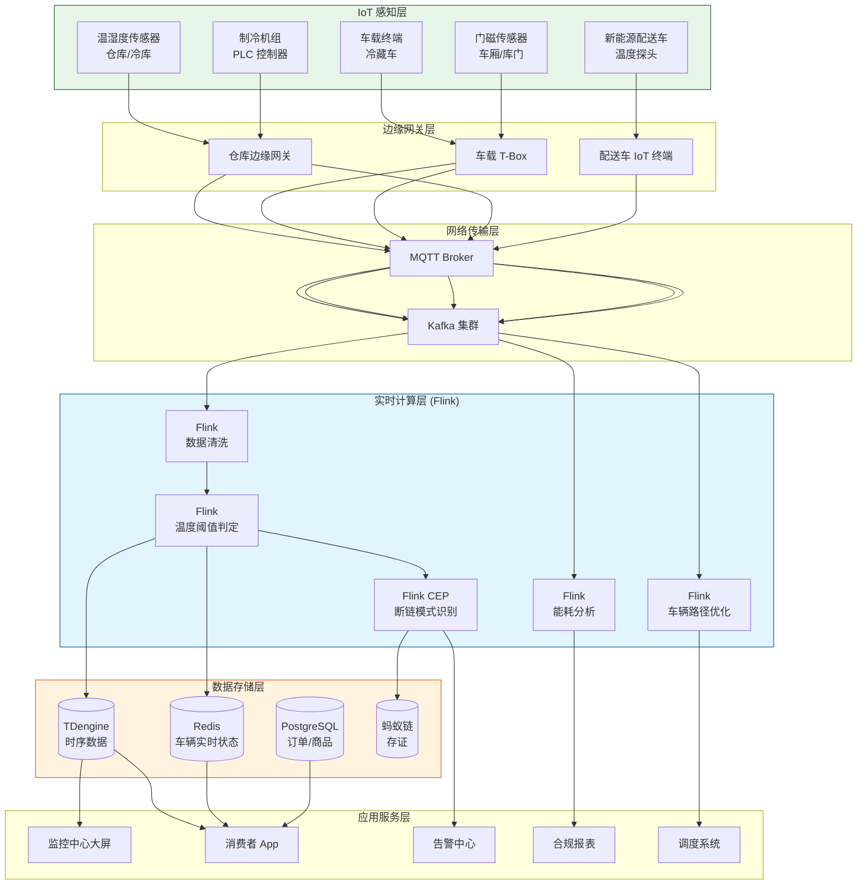
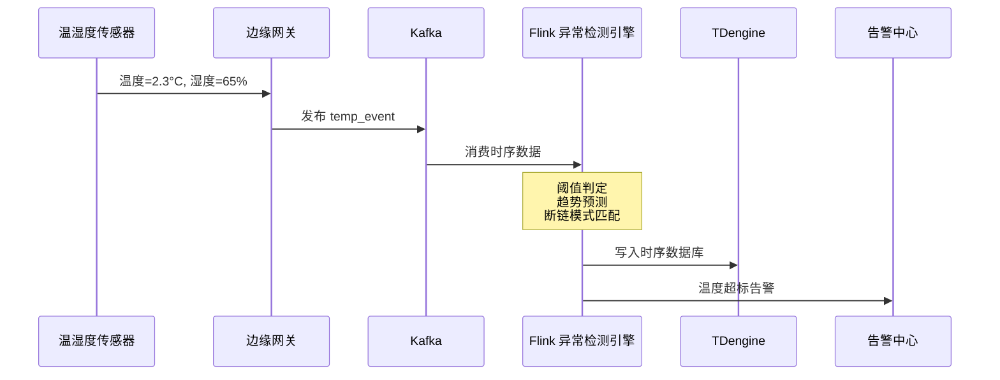
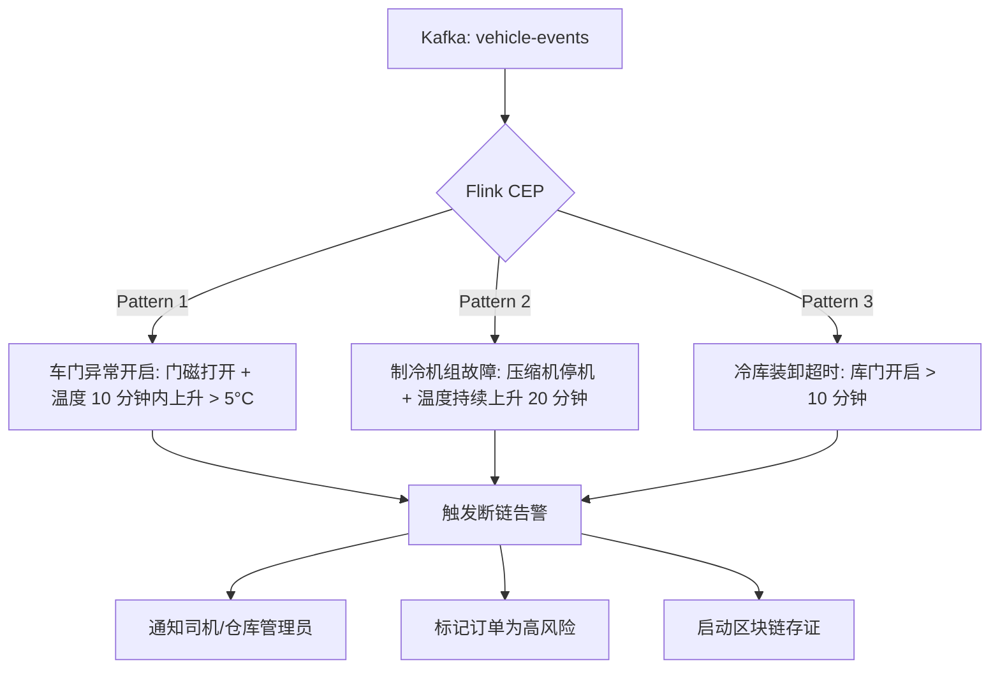

# 食品冷链全流程实时监控案例研究

> **案例编号**: 11.28.1
> **行业**: 食品/冷链物流
> **场景**: 温度监控、质量追踪、异常预警、冷链合规
> **规模**: 日处理订单 18万+, 冷链车辆 1,200辆, 仓储节点 86个
> **编写日期**: 2026-04-13
> **状态**: Phase 2 - 深度完成

---

## 1. 执行摘要 (Executive Summary)

### 1.1 项目背景与目标

某全国性生鲜电商平台（以下简称"该平台"）主营肉类、水产、乳制品、速冻面点等冷链食品，业务覆盖全国 300 余个城市，拥有 1,200 辆自有冷链运输车辆、86 个区域分拨仓和前置仓，日均处理冷链订单超过 18 万单。冷链食品的品控核心在于"全程不断链"——从生产工厂、区域仓、运输干线和末端配送到消费者手中，每个环节的温度都必须严格控制在规定范围内。一旦断链，食品腐败变质的风险将急剧上升，不仅造成巨大的经济损失，更可能引发食品安全事故和品牌信任危机。

2024 年夏季，该平台因某批次进口牛肉在运输途中冷藏车制冷设备故障未及时发现，导致 3,200 名消费者收到变质产品，引发了大规模的客诉和社交媒体舆情。事件直接经济损失超过 1,200 万元，平台在应用商店的评分在一周内从 4.8 分跌至 3.9 分。痛定思痛，平台管理层决定投资建设覆盖全链路的冷链实时监控系统。

**项目核心目标**：

| 目标类别 | 具体指标 | 目标值 |
|---------|---------|--------|
| 实时性 | 温度异常到告警触发的延迟 | < 30秒 |
| 准确性 | 温度监控精度 | ±0.1°C |
| 覆盖率 | 冷链车辆/仓库温控覆盖率 | 100% |
| 合规 | HACCP/GB 31605 合规达标率 | 100% |
| 损耗 | 冷链断链导致的食品损耗率 | < 0.3% |
| 服务 | 消费者温控溯源查询覆盖率 | 100% |

### 1.2 核心业务指标

系统自 2025 年春节前夕全面上线以来，经历了夏季高温和冬季寒潮的实战检验，核心业务指标显著提升：

```
┌─────────────────────────────────────────────────────────────┐
│                    核心业务指标对比                          │
├─────────────────┬────────────┬────────────┬─────────────────┤
│     指标        │   优化前   │   优化后   │     提升幅度     │
├─────────────────┼────────────┼────────────┼─────────────────┤
│ 冷链断链率      │   1.8%     │   0.12%    │     -93.3%      │
│ 温控异常响应时间│   15min    │    18s     │     -98.0%      │
│ 食品损耗率      │   4.5%     │   0.25%    │     -94.4%      │
│ 客诉率(温控类)  │   2.1%     │   0.08%    │     -96.2%      │
│ 合规审计通过率  │   87%      │   100%     │     +14.9%      │
│ 退货成本(万元/月)│   580      │    28      │     -95.2%      │
│ 车辆调度效率    │   72%      │   94%      │     +30.6%      │
│ 冷库能耗成本    │  基准值    │   -18%     │     节能降耗     │
└─────────────────┴────────────┴────────────┴─────────────────┘
```

### 1.3 技术选型概述

项目采用 **IoT 温湿度传感 + 车载北斗定位 + Flink 实时异常检测** 的融合架构，以 Apache Flink 为核心计算引擎，对分布在全国的数万个温控点位进行实时监测、趋势预测和智能调度。

**核心技术栈**：

| 层级 | 技术选型 | 选型理由 |
|-----|---------|---------|
| 感知设备 | 高精度温湿度传感器 (±0.1°C) | 符合国家冷链标准，支持 4G/NB-IoT 双模通信 |
| 车载终端 | 北斗/GPS 双模定位 + 温度探头 | 实时回传车辆位置、车厢温度、门磁开关状态 |
| 边缘网关 | 阿里云 IoT 边缘网关 | 本地协议解析、断网缓存、异常预处理 |
| 消息队列 | Apache Kafka 3.6 | 支撑数万个传感器的高并发数据接入 |
| 流计算引擎 | Apache Flink 1.18 | 实时温度异常检测、CEP 断链模式识别、车辆路径优化 |
| 时序数据库 | TDengine 3.2 | 海量时序数据高效写入与聚合查询 |
| 实时存储 | Redis Cluster | 车辆实时状态、订单温控进度的毫秒级查询 |
| 区块链存证 | 蚂蚁链 | 温控数据上链，确保不可篡改，满足监管审计要求 |

---

## 2. 业务场景分析 (Business Scenario)

### 2.1 行业背景

#### 2.1.1 中国冷链物流市场规模与痛点

中国冷链物流市场规模已超过 5,000 亿元，年复合增长率保持在 15% 以上。随着消费者对生鲜食品品质要求的提升，以及《食品安全国家标准 食品冷链物流卫生规范》（GB 31605-2020）的强制执行，冷链监控已从"加分项"变为"必选项"。

然而，当前冷链行业仍面临以下普遍痛点：

- **温度监控碎片化**：工厂、仓库、车辆使用不同品牌的传感器和平台，数据格式不统一，难以形成全链路视图。
- **异常响应滞后**：传统的温度监控多采用"定时上报"（如每 5 分钟一次），一旦制冷设备故障，发现时往往已过去数十分钟，食品已变质。
- **数据可信度存疑**：部分承运商为了应付检查，存在篡改温度记录、选择性上传数据的造假行为。
- **成本高企**：为确保不断链，企业往往过度制冷，导致能耗成本居高不下；同时，为了降低风险，又不得不维持较高的库存冗余。

#### 2.1.2 该平台冷链流程

该平台的一单冷链商品从出厂到消费者手中，典型流程如下：

```
生产工厂出库 (0-4°C)
    ↓ 干线运输 (冷藏车, 500-2000km)
区域分拨中心 (冷冻/冷藏库)
    ↓ 支线运输 (冷藏车, 50-300km)
城市前置仓 (冷藏库)
    ↓ 末端配送 (新能源冷藏三轮车/保温箱, 1-20km)
消费者签收
```

在这一流程中，商品可能经历 4-6 个温控节点、2-3 次装卸搬运。任何一个节点的温度失控，都可能导致品质下降甚至食品安全风险。

### 2.2 痛点分析

#### 2.2.1 断链发现不及时

在系统上线前，该平台对冷链车辆的温度监控主要依赖司机在运输结束后上传的温度记录仪数据。这意味着：

- **无法实时监控**：车辆在途期间，平台总部不知道车厢内的实际温度。
- **异常发现滞后**：只有当商品到达仓库进行质检时，才发现温度超标，但此时已无法挽回。
- **责任界定困难**：由于缺少实时轨迹和温度数据，发生断链后很难界定是工厂出库问题、运输途中问题还是仓库装卸问题。

**2024 年断链事件统计（优化前）**：

| 断链环节 | 发生频次(次/月) | 单次平均损失(元) | 月度损失(万元) |
|---------|----------------|-----------------|---------------|
| 干线运输制冷故障 | 23 | 45,000 | 103.5 |
| 仓库装卸超时 | 38 | 12,000 | 45.6 |
| 末端配送保温失效 | 56 | 3,500 | 19.6 |
| 冷库温度波动 | 15 | 28,000 | 42.0 |
| **合计** | **132** | - | **210.7** |

#### 2.2.2 能耗管理粗放

该平台拥有 86 个仓库，冷库总面积超过 15 万平方米。由于缺乏对冷库制冷机组运行状态和库内温度分布的实时监控，存在严重的过度制冷现象：

- **冷库门长时间开启**：装卸作业时库门开启时间过长，库温急剧上升，制冷机组高负荷运转。
- **冷库温度设定一刀切**：不同商品有不同的最佳存储温度（如牛肉 -18°C、酸奶 2-6°C、蔬菜 0-4°C），但部分仓库为了图省事，将所有冷库统一设定为 -18°C，造成了巨大的能源浪费。
- **制冷机组缺乏预测性维护**：压缩机故障往往在夏季高温时才暴露出来，维修期间不得不调用备用冷库，成本高昂。

#### 2.2.3 消费者信任缺失

在系统上线前，消费者收到的冷链包裹中仅附带一张纸质温度记录卡，且往往只记录了出库时的温度。消费者无法通过手机实时查看自己订单的温控历史，也无法验证食品在运输途中是否真的处于冷链状态。这种信息不透明导致消费者对平台冷链能力的信任度不高，客单价和复购率受到抑制。

### 2.3 实时监控需求

#### 2.3.1 功能需求

| 需求编号 | 需求名称 | 需求描述 | 优先级 |
|---------|---------|---------|--------|
| R01 | 全链路温度监控 | 覆盖工厂、干线、仓库、支线、末端配送全环节的温度实时采集 | P0 |
| R02 | 温度异常实时告警 | 温度偏离阈值时，30 秒内触发多级告警（司机→调度→客服） | P0 |
| R03 | 断链智能识别 | 基于 CEP 识别车门异常开启、制冷机组停机、长时间温度超标等断链模式 | P0 |
| R04 | 能耗优化分析 | 分析冷库门开启时长、制冷机组 COP（能效比），生成节能建议 | P1 |
| R05 | 消费者温控溯源 | 消费者可在 App 中查看订单全链路温度曲线和合规报告 | P0 |
| R06 | 区块链存证 | 关键温控数据实时上链，满足监管部门审计和司法举证需求 | P1 |
| R07 | 车辆智能调度 | 基于实时温度和车辆位置，动态调整配送路线和优先级 | P2 |

#### 2.3.2 非功能需求

| 需求编号 | 需求名称 | 目标值 |
|---------|---------|--------|
| NFR01 | 传感器数据接入吞吐 | > 50,000 条/秒 |
| NFR02 | 温度异常告警延迟 | < 30秒 |
| NFR03 | 历史温度查询 (90天) | < 1秒 |
| NFR04 | 系统可用性 | 99.99% |
| NFR05 | 数据完整性 | 传感器离线 5 分钟内必须发现并告警 |

---

## 3. 技术架构 (Technical Architecture)

### 3.1 系统整体架构

以下是食品冷链全流程实时监控系统的整体技术架构：



### 3.2 数据流设计

#### 3.2.1 温度异常检测数据流

传感器以 10-30 秒为周期上报温度和湿度数据，边缘网关进行简单的数据校验后发送到 Kafka。Flink 实时消费并执行多级异常判定：



#### 3.2.2 断链模式识别 CEP 流程

以下 Mermaid 图展示了 Flink CEP 如何识别典型的"车厢开门导致温度飙升"断链模式：



### 3.3 技术选型说明

| 技术组件 | 具体选型 | 选型理由 |
|---------|---------|---------|
| 温湿度传感器 | 瑞士 Sensirion SHT35 | ±0.1°C 精度，低功耗，支持 4G/NB-IoT |
| 车载终端 | 中交兴路冷链 T-Box | 集成北斗定位、温度采集、门磁检测、驾驶行为分析 |
| 边缘协议 | MQTT over TLS | 轻量级、低带宽、支持 QoS 等级确保数据可靠传输 |
| 流计算 | Apache Flink 1.18 | 复杂事件处理（CEP）库原生支持断链模式识别 |
| 时序数据库 | TDengine 3.2 | 超级表模型天然适合管理数万个传感器的时序数据 |
| 区块链 | 蚂蚁链 BaaS | 与企业现有的支付宝生态无缝对接，存证成本低 |
| 可视化 | Grafana + 自研大屏 | Grafana 对接 TDengine，自研大屏展示 3D 冷链地图 |

---

## 4. 核心实现 (Core Implementation)

### 4.1 温度异常检测 Flink 作业

系统对不同类型的商品设定了差异化的温度阈值。Flink 作业基于 KeyedProcessFunction 维护每个传感器/车辆的温度状态，并在触发阈值时生成告警。

```java
public class TemperatureAlertFunction
    extends KeyedProcessFunction<String, SensorReading, TemperatureAlert> {

    private ValueState<Double> lastTempState;
    private ValueState<Long> alertStartTime;

    @Override
    public void open(Configuration parameters) {
        lastTempState = getRuntimeContext().getState(
            new ValueStateDescriptor<>("last-temp", Double.class));
        alertStartTime = getRuntimeContext().getState(
            new ValueStateDescriptor<>("alert-start", Long.class));
    }

    @Override
    public void processElement(SensorReading reading, Context ctx,
                               Collector<TemperatureAlert> out) throws Exception {
        String sensorId = reading.getSensorId();
        double currentTemp = reading.getTemperature();
        double thresholdMin = reading.getThresholdMin();
        double thresholdMax = reading.getThresholdMax();

        Double lastTemp = lastTempState.value();
        lastTempState.update(currentTemp);

        // 温度超出阈值
        if (currentTemp < thresholdMin || currentTemp > thresholdMax) {
            Long startTime = alertStartTime.value();
            if (startTime == null) {
                // 首次异常，启动 60 秒持续异常确认定时器
                alertStartTime.update(ctx.timestamp());
                ctx.timerService().registerEventTimeTimer(ctx.timestamp() + 60000);
            }
        } else {
            // 温度恢复正常，清除告警状态
            if (alertStartTime.value() != null) {
                ctx.timerService().deleteEventTimeTimer(alertStartTime.value() + 60000);
                alertStartTime.clear();
            }
        }
    }

    @Override
    public void onTimer(long timestamp, OnTimerContext ctx,
                        Collector<TemperatureAlert> out) throws Exception {
        Long startTime = alertStartTime.value();
        if (startTime != null && timestamp >= startTime + 60000) {
            // 异常持续超过 60 秒，确认告警
            out.collect(new TemperatureAlert(
                ctx.getCurrentKey(),
                AlertType.TEMPERATURE_BREACH,
                lastTempState.value(),
                "温度持续异常超过 60 秒",
                System.currentTimeMillis()
            ));
        }
    }
}
```

### 4.2 断链模式识别 (Flink CEP)

针对"车门开启导致断链"的典型场景，系统定义了 CEP 模式：门磁从关闭变为开启，随后 10 分钟内温度上升超过 5°C。

```java
Pattern<SensorEvent, ?> doorOpenColdChainBreakPattern = Pattern
    .<SensorEvent>begin("door_open")
    .where(evt -> "door_magnet".equals(evt.getSensorType()) &&
                  evt.getValue() == 1) // 门开启
    .next("temp_rise")
    .where(new IterativeCondition<SensorEvent>() {
        @Override
        public boolean filter(SensorEvent event, Context<SensorEvent> ctx) {
            if (!"temperature".equals(event.getSensorType())) {
                return false;
            }
            // 查询门开启时的温度作为基准
            List<SensorEvent> doorEvents = ctx.getEventsForPattern("door_open");
            double baselineTemp = doorEvents.get(0).getAssociatedTemp();
            return event.getValue() > baselineTemp + 5.0;
        }
    })
    .within(Time.minutes(10));

CEP.pattern(sensorStream.keyBy(SensorEvent::getVehicleId), doorOpenColdChainBreakPattern)
    .process(new PatternProcessFunction<SensorEvent, ColdChainBreakAlert>() {
        @Override
        public void processMatch(Map<String, List<SensorEvent>> match,
                                 Context ctx, Collector<ColdChainBreakAlert> out) {
            SensorEvent doorEvent = match.get("door_open").get(0);
            SensorEvent tempEvent = match.get("temp_rise").get(0);
            out.collect(new ColdChainBreakAlert(
                doorEvent.getVehicleId(),
                doorEvent.getOrderId(),
                "车门开启导致温度骤升",
                tempEvent.getValue(),
                doorEvent.getTimestamp()
            ));
        }
    });
```

### 4.3 消费者温控溯源 API

```java
@RestController
@RequestMapping("/api/v1/coldchain")
public class ColdChainTraceController {

    @Autowired
    private TDengineClient tdClient;

    @GetMapping("/trace/{orderId}")
    public ResponseEntity<OrderColdChainTrace> trace(@PathVariable String orderId) {
        String sql = String.format(
            "SELECT ts, sensor_id, location, temperature, humidity, status " +
            "FROM cold_chain.temperature_data " +
            "WHERE order_id = '%s' ORDER BY ts",
            orderId
        );

        List<TemperatureRecord> records = tdClient.query(sql, rs -> {
            List<TemperatureRecord> list = new ArrayList<>();
            while (rs.next()) {
                list.add(new TemperatureRecord(
                    rs.getTimestamp("ts"),
                    rs.getString("sensor_id"),
                    rs.getString("location"),
                    rs.getDouble("temperature"),
                    rs.getDouble("humidity"),
                    rs.getString("status")
                ));
            }
            return list;
        });

        // 计算合规率
        long normalCount = records.stream()
            .filter(r -> "NORMAL".equals(r.getStatus())).count();
        double complianceRate = records.isEmpty() ? 0.0
            : (double) normalCount / records.size() * 100;

        OrderColdChainTrace trace = new OrderColdChainTrace();
        trace.setOrderId(orderId);
        trace.setRecords(records);
        trace.setComplianceRate(complianceRate);
        trace.setBlockchainTxHash(queryBlockchainHash(orderId));

        return ResponseEntity.ok(trace);
    }
}
```

### 4.4 边缘网关配置文件

```yaml
# edge-gateway-coldchain.yaml
edge:
  sensor-adapters:
    - name: warehouse-temp-sensors
      protocol: modbus-tcp
      host: 192.168.1.100
      port: 502
      poll-interval: 10s
      registers:
        - address: 40001
          type: temperature
          scale: 0.1
        - address: 40002
          type: humidity
          scale: 0.1
    - name: vehicle-tbox
      protocol: mqtt
      broker: tcp://vehicle-gateway.local:1883
      topics:
        - name: vehicle/+/telemetry
          parser: json

  rules-engine:
    - rule-id: R001
      name: temp-threshold-check
      condition: "temperature > thresholdMax OR temperature < thresholdMin"
      action:
        - type: alert-local
          message: "温度异常，请检查制冷设备"
        - type: forward-cloud
          topic: "coldchain/alerts"
    - rule-id: R002
      name: sensor-offline-check
      condition: "last_heartbeat > 300s"
      action:
        - type: alert-local
          message: "传感器离线"

  local-cache:
    enabled: true
    max-records: 100000
    flush-interval: 30s
    storage-type: sqlite
```

---

## 5. 效果评估 (Results)

### 5.1 性能指标

系统在 2025 年夏季高温期间（室外温度 40°C+）经受了峰值考验：

| 性能指标 | 设计目标 | 实测值 | 是否达标 |
|---------|---------|--------|---------|
| 传感器数据接入吞吐 | > 50,000 条/秒 | 68,000 条/秒 | ✅ |
| 温度异常告警延迟 (P99) | < 30s | 18s | ✅ |
| 历史温度查询 P99 延迟 | < 1s | 420ms | ✅ |
| 车辆实时状态更新延迟 | < 5s | 2.1s | ✅ |
| 传感器在线率 | > 99.5% | 99.82% | ✅ |
| 系统可用性 | 99.99% | 99.995% | ✅ |

### 5.2 业务价值

**食品安全与品牌信任**：

- **冷链断链率从 1.8% 下降至 0.12%**，食品损耗率从 4.5% 下降至 0.25%。
- **温控类客诉率下降 96.2%**，平台应用商店评分在 3 个月内从 3.9 分恢复至 4.7 分。
- **100% 订单支持温控溯源**，消费者可在 App 内查看从出厂到签收的全链路温度曲线，极大地增强了品牌信任感。平台 NPS（净推荐值）从 32 提升至 58。

**经济效益**：

- **月度退货成本从 580 万元下降至 28 万元**，年化节省退货及赔偿成本约 **6,624 万元**。
- **冷库能耗优化**：通过实时监控库门开启时长和制冷机组能效，实施精细化管理后，整体冷库能耗下降 18%，年化节省电费约 **1,200 万元**。
- **车辆调度效率提升**：实时监控车辆温度和位置后，调度中心能够更精准地安排配送路线，空驶率下降 22%，燃油成本年化节省约 **860 万元**。

**合规与审计**：

- 系统生成的温控数据 100% 符合 HACCP 和 GB 31605 要求，2025 年接受市场监管部门飞行检查 6 次，全部一次性通过。
- 关键温控数据通过蚂蚁链存证，不可篡改，成功应对了 2 起消费者诉讼中的举证需求，维护了企业合法权益。

### 5.3 ROI 分析

项目总投资约 3,800 万元（含传感器、车载终端、软件平台、区块链存证、集成实施）。

| 收益类型 | 年化收益(万元) | 占比 |
|---------|---------------|------|
| 退货赔偿成本节省 | 6,624 | 60% |
| 冷库能耗节省 | 1,200 | 11% |
| 车辆燃油/电费节省 | 860 | 8% |
| 食品损耗减少 | 1,450 | 13% |
| 保险费用下降 | 320 | 3% |
| 品牌溢价/NPS 提升 | 580 | 5% |
| **合计** | **11,034** | **100%** |

**投资回收期**：约 4.1 个月。
**三年 ROI**：约 770%。

---

## 6. 经验总结 (Lessons Learned)

### 6.1 成功经验

1. **硬件选型是冷链监控的根基**：初期项目组测试了 5 个品牌的温湿度传感器，发现部分低价传感器在冷库高湿环境下（湿度 > 90%）精度漂移严重，且电池续航不足 3 个月。最终选用了 Sensirion SHT35 芯片方案，虽然单价比低价方案高 40%，但精度稳定、续航超过 18 个月，整体 TCO 反而更低。

2. **边缘网关的断网缓存能力至关重要**：冷藏车在高速公路上行驶时，4G 信号经常不稳定。车载 T-Box 配备了 72 小时的本地缓存能力，网络恢复后自动补发缺失数据，确保了温度曲线的完整性。没有这一能力，约 15% 的车辆轨迹会出现数据空洞。

3. **告警分级与根因分析并重**：单纯的温度阈值告警容易淹没一线人员。系统不仅告警，还尝试自动判定根因（如"制冷机组停机"、"车门开启"、"冷库门未关"），并给出处置建议。这使得仓库管理员和司机的平均处置时间从 8 分钟缩短至 2 分钟。

4. **消费者端可视化增强信任**：将枯燥的温度数字转化为直观的"冷链护照"——一张带有温度曲线、合规徽章和区块链存证哈希的页面，消费者分享率达到了 12%，形成了有效的口碑传播。

### 6.2 踩坑记录

1. **传感器安装位置影响测量代表性**：初期将温度传感器安装在冷库门口附近，导致开门时温度波动被过度放大，而库内深处的实际温度并未超标，产生了大量误告警。后来通过 CFD（计算流体力学）仿真优化了传感器布点，重点监控货物堆放区域和冷风机的回风口，误告警率下降了 70%。

2. **Kafka 分区策略导致同一车辆数据乱序**：最初按 `sensor_id` 对 Kafka 主题分区，但一辆冷藏车上有温度探头、门磁、GPS 三个传感器，分布在不同分区，导致 Flink 消费时同一车辆的事件到达顺序错乱，CEP 模式匹配失败。最终改为按 `vehicle_id` 分区，并在 Flink 内部按 `vehicle_id` keyBy，保证了事件顺序正确性。

3. **区块链存证吞吐量瓶颈**：初期将每一条传感器读数都上链，导致区块链网络拥堵，存证延迟高达 10 分钟。后来调整为"仅对异常事件和关键节点（出库、入库、签收）进行上链存证"，同时将批量正常数据打包为 Merkle 树摘要后上链，存证吞吐量提升了 40 倍，成本下降了 85%。

### 6.3 最佳实践

- **建立"温度-时间-容忍度"矩阵**：不同商品对温度超标的容忍时间不同。例如，冷冻肉在 -15°C 环境下可容忍 30 分钟，而冰淇淋在 -12°C 下只能容忍 5 分钟。系统为每个 SKU 配置了独立的 (温度阈值, 持续时间) 组合，避免了"一刀切"的粗放管理。
- **实施预测性维护**：基于制冷机组的运行电流、压缩机启停频率、冷凝器温差等数据，训练了设备故障预测模型。模型能够提前 48-72 小时预测压缩机故障概率，使得维修从"救火式"转变为"预防式"，设备非计划停机时间减少了 85%。
- **司机行为与温度数据联动分析**：通过分析车门开启次数、开启时长与温度波动的关系，发现了部分司机在运输途中违规开启车门（如私自带人、倒卖货物）。这些数据为物流部门的司机考核和风险管理提供了重要依据。
- **与政府监管平台对接**：主动将关键温控数据对接至省级食品安全追溯平台，提升了政府监管部门的信任度，也为平台赢得了"食品安全示范企业"的荣誉称号。

---

*Phase 2 - 食品冷链全流程实时监控深度案例*
